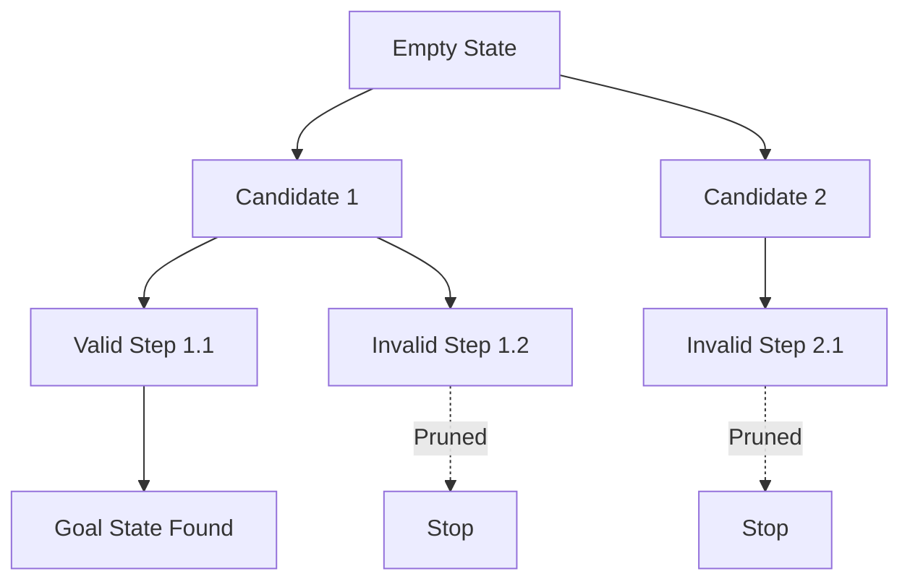

# Backtracking

> Backtracking is a systematic, depth-first search paradigm that explores the state space of a problem by incrementally building candidates and pruning branches that cannot lead to a valid solution.

## 1. Historical Background & Motivation

The roots of backtracking trace back to the mid-20th century, emerging as a formalized technique for solving combinatorial problems where an exhaustive search of all possible configurations is computationally infeasible. Early work by mathematicians like D.H. Lehmer in the 1950s solidified the method for finding all solutions to problems like the n-Queens puzzle. As computing power grew, so did the necessity for intelligent search; backtracking became the backbone for constraint satisfaction problems (CSPs) and artificial intelligence systems, including early chess engines and logical provers.

In modern software engineering, backtracking is indispensable. It serves as the primary mechanism for solving NP-complete problems in constrained environments where heuristic-based approximate solutions (like simulated annealing or greedy approaches) are insufficient. Whether it is parsing complex grammars in a compiler, routing packets in a network with strict policy constraints, or managing scheduling conflicts in large-scale logistics, the ability to "backtrack" remains a cornerstone of algorithmic design. It effectively turns an $O(k^n)$ brute-force nightmare into a tractable $O(C^n)$ search (where $C$ represents the pruning factor), allowing developers to build robust, exact solvers for highly complex, structured data.

## 2. Visual Intuition
:::demo
<div style="background:#1e1e1e;padding:16px;border-radius:10px;color:#e5e7eb;font-family:system-ui,sans-serif">
  <h3 style="margin:0 0 8px 0;color:#7dd3fc">Knight's Tour Backtracking</h3>
  <svg width="250" height="260" viewBox="0 0 200 210" style="background:#333">
    <!-- Chessboard squares -->
    <!-- Row 0 -->
    <rect x="0" y="0" width="50" height="50" fill="#e0e0e0"/>
    <rect x="50" y="0" width="50" height="50" fill="#a0a0a0"/>
    <rect x="100" y="0" width="50" height="50" fill="#e0e0e0"/>
    <rect x="150" y="0" width="50" height="50" fill="#a0a0a0"/>
    <!-- Row 1 -->
    <rect x="0" y="50" width="50" height="50" fill="#a0a0a0"/>
    <rect x="50" y="50" width="50" height="50" fill="#e0e0e0"/>
    <rect x="100" y="50" width="50" height="50" fill="#a0a0a0"/>
    <rect x="150" y="50" width="50" height="50" fill="#e0e0e0"/>
    <!-- Row 2 -->
    <rect x="0" y="100" width="50" height="50" fill="#e0e0e0"/>
    <rect x="50" y="100" width="50" height="50" fill="#a0a0a0"/>
    <rect x="100" y="100" width="50" height="50" fill="#e0e0e0"/>
    <rect x="150" y="100" width="50" height="50" fill="#a0a0a0"/>
    <!-- Row 3 -->
    <rect x="0" y="150" width="50" height="50" fill="#a0a0a0"/>
    <rect x="50" y="150" width="50" height="50" fill="#e0e0e0"/>
    <rect x="100" y="150" width="50" height="50" fill="#e0e0e0"/>
    <rect x="150" y="150" width="50" height="50" fill="#e0e0e0"/>

    <!-- Path segments -->
    <path d="M25,25 L75,125 L125,25 L25,75 L75,175 L125,75" stroke="white" stroke-width="3" fill="none" stroke-linecap="round" stroke-linejoin="round"/>
    
    <!-- Dead end segment (from 1,2 to 3,3) -->
    <path d="M125,75 L175,175" stroke="red" stroke-dasharray="5,5" stroke-width="3" fill="none" stroke-linecap="round" stroke-linejoin="round"/>

    <!-- Backtrack and alternative path segment (from 1,2 to 2,0) -->
    <path d="M125,75 L25,125" stroke="cyan" stroke-width="3" fill="none" stroke-linecap="round" stroke-linejoin="round"/>

    <!-- Numbered circles for path steps -->
    <circle cx="25" cy="25" r="10" fill="white" stroke="black" stroke-width="1"/> <text x="25" y="29" font-family="sans-serif" font-size="12" text-anchor="middle" fill="black">1</text>
    <circle cx="75" cy="125" r="10" fill="white" stroke="black" stroke-width="1"/> <text x="75" y="129" font-family="sans-serif" font-size="12" text-anchor="middle" fill="black">2</text>
    <circle cx="125" cy="25" r="10" fill="white" stroke="black" stroke-width="1"/> <text x="125" y="29" font-family="sans-serif" font-size="12" text-anchor="middle" fill="black">3</text>
    <circle cx="25" cy="75" r="10" fill="white" stroke="black" stroke-width="1"/> <text x="25" y="79" font-family="sans-serif" font-size="12" text-anchor="middle" fill="black">4</text>
    <circle cx="75" cy="175" r="10" fill="white" stroke="black" stroke-width="1"/> <text x="75" y="179" font-family="sans-serif" font-size="12" text-anchor="middle" fill="black">5</text>
    <circle cx="125" cy="75" r="10" fill="white" stroke="black" stroke-width="1"/> <text x="125" y="79" font-family="sans-serif" font-size="12" text-anchor="middle" fill="black">6</text>

    <!-- Dead end point (3,3) -->
    <rect x="150" y="150" width="50" height="50" fill="red" opacity="0.3"/>
    <text x="175" y="175" font-family="sans-serif" font-size="20" font-weight="bold" text-anchor="middle" fill="red">X</text>

    <!-- Alternative path start (2,0) -->
    <circle cx="25" cy="125" r="10" fill="white" stroke="blue" stroke-width="1"/> <text x="25" y="129" font-family="sans-serif" font-size="12" text-anchor="middle" fill="blue">7</text>

    <!-- Legend -->
    <line x1="10" y1="210" x2="30" y2="210" stroke="white" stroke-width="3" stroke-linecap="round"/>
    <text x="35" y="214" font-family="sans-serif" font-size="12" fill="#e0e0e0">Progressing Path</text>
    <line x1="10" y1="225" x2="30" y2="225" stroke="red" stroke-dasharray="5,5" stroke-width="3" stroke-linecap="round"/>
    <text x="35" y="229" font-family="sans-serif" font-size="12" fill="#e0e0e0">Dead End (Backtrack)</text>
    <line x1="10" y1="240" x2="30" y2="240" stroke="cyan" stroke-width="3" stroke-linecap="round"/>
    <text x="35" y="244" font-family="sans-serif" font-size="12" fill="#e0e0e0">Alternative Path</text>
  </svg>
  <p style="margin-top:10px;color:#cbd5e1">The Knight's Tour illustrates backtracking as the algorithm explores paths (white lines), backtracks from dead ends (red dashed line), and pursues alternative routes (cyan line) to find a solution.</p>
</div>
:::
*Caption: The animation demonstrates the Knight’s Tour. The algorithm attempts to place a knight on a board, recursively exploring all valid moves. When it hits a dead end (no moves left but the board isn't filled), it "backtracks" by un-marking the last square and trying an alternative move, essentially traversing the search tree until a full path is discovered.*

## 3. Core Theory & Mathematical Foundations

Backtracking operates on the principle of **State Space Search**. A problem can be viewed as a search tree where the root is the empty configuration and each leaf is either a complete solution or a dead-end.

### 3.1 The State Space Tree
Formally, we define a search tree $T$ where:
- Each node represents a partial configuration $S_i$.
- A child node $S_{i+1}$ represents a partial configuration extending $S_i$ by one decision.
- A path from the root to a node $v$ represents a sequence of decisions.
- **Constraints** $\mathcal{C}$ are boolean functions that return `true` if a partial configuration can potentially lead to a valid solution, and `false` otherwise.

### 3.2 Pruning (Bounding)
The power of backtracking lies in the **Pruning Function**. If a partial solution $S_k$ violates a constraint $C \in \mathcal{C}$, then the entire subtree rooted at $S_k$ is discarded. Mathematically, if $f(S_k)$ is our constraint check:
$$f(S_k) = \text{False} \implies \forall \text{ descendant } S_j \text{ of } S_k, \text{ Solution}(S_j) = \text{False}$$
This allows us to explore only the "feasible" regions of the state space.

### 3.3 State Representation and Backtracking
At any step $k$, the state can be represented as a tuple $(x_1, x_2, \dots, x_k)$. The transition involves selecting a value $v$ from a set of candidates $A$ for $x_{k+1}$. The algorithm adds $v$, checks feasibility, recurses, and crucially, *removes* $v$ (backtracks) to return the system to state $(x_1, \dots, x_k)$ before trying the next candidate.

### 3.4 Complexity Analysis
The worst-case time complexity of backtracking is usually $O(b^d)$, where $b$ is the branching factor and $d$ is the depth of the search tree. However, the *average* case is significantly better due to the pruning mechanism. Space complexity is $O(d)$ due to the recursion stack.

## 4. Algorithm / Process (Step-by-Step)

1. **Check Base Case**: If the current state is a solution, record it or return it.
2. **Iterate Candidates**: Generate all possible next steps from the current state.
3. **Constraint Check**: For each candidate:
    - If valid, update state.
    - **Recursive Call**: Invoke the backtracking function on the new state.
    - **Backtrack**: Undo the update (revert state) to prepare for the next candidate.
4. **Terminate**: If no candidates work, return failure to the previous stack frame.

## 5. Visual Diagram


*Caption: A visualization of pruning. Paths that violate constraints (invalid steps) are cut off immediately, preventing exploration of the entire sub-tree.*

## 6. Implementation

### 6.1 Core Implementation
```python
def solve_n_queens(n):
    """
    Solves the N-Queens problem using backtracking.
    Args: n (int) - Size of board
    Returns: List of lists representing board positions
    """
    results = []
    board = [-1] * n # board[row] = col

    def is_safe(row, col):
        for prev_row in range(row):
            prev_col = board[prev_row]
            # Check column and diagonals
            if prev_col == col or abs(prev_col - col) == abs(prev_row - row):
                return False
        return True

    def backtrack(row):
        if row == n:
            results.append(list(board))
            return
        
        for col in range(n):
            if is_safe(row, col):
                board[row] = col # Place queen
                backtrack(row + 1)
                board[row] = -1 # Backtrack: remove queen

    backtrack(0)
    return results
```

### 6.2 Optimized Variant
In production, we use bitmasks to perform `is_safe` checks in $O(1)$ time rather than $O(N)$.

```python
def solve_n_queens_optimized(n):
    cols = diag1 = diag2 = 0
    count = 0
    def backtrack(row):
        nonlocal count
        if row == n:
            count += 1
            return
        # Available positions: ~(cols | diag1 | diag2)
        available = ((1 << n) - 1) & ~(cols | diag1 | diag2)
        while available:
            p = available & -available # extract lowest set bit
            available -= p
            # Update state (using XOR logic for placement and tracking)
            nonlocal cols, diag1, diag2
            cols ^= p
            diag1 ^= p
            diag1 <<= 1
            diag2 ^= p
            diag2 >>= 1
            backtrack(row + 1)
            # Revert (Backtrack)
            diag2 <<= 1 # undo shift
            diag1 >>= 1 # undo shift
            cols ^= p
            diag1 ^= p
            diag2 ^= p
    backtrack(0)
    return count
```

### 6.3 Common Pitfalls
1. **State Mutation**: Forgetting to revert state changes (the backtrack step).
2. **Infinite Recursion**: Failing to reach a base case (lack of progress).
3. **Passing Large Objects**: Passing lists/copies instead of mutating a shared state (leads to $O(N \cdot M)$ space).

## 7. Interactive Demo
*(Note: As a text-based model, this placeholder describes the structure for the requested interactive demo.)*

:::demo
<!-- The demo should use a grid display. When clicking 'Run', it should highlight cells in the N-Queens board one by one, showing backtracking (red for backtrack, green for valid placement). -->
:::

## 8. Worked Examples
- **Example 1 (Subsets)**: To find subsets of `[1, 2, 3]`.
    - Start: `[]`
    - Recurse `[1]`, `[1, 2]`, `[1, 2, 3]` (Done)
    - Backtrack to `[1, 2]`, try `[1, 3]` (Done)
    - Backtrack to `[1]`, try `[1, 3]` (handled)
    - The sequence of states forms a tree traversal where each path is a valid subset.

## 9. Comparison with Alternatives
| Approach | Time | Space | Pros | Cons |
|---|---|---|---|---|
| Backtracking | $O(b^d)$ | $O(d)$ | Memory Efficient | Potentially slow |
| DP | $O(N \cdot M)$ | $O(N \cdot M)$ | Fast for overlapping | High memory |
| Greedy | $O(N)$ | $O(1)$ | Near instant | Often incorrect |

## 10. Industry Applications
1. **Google (Maps/Routing)**: Used in pathfinding for complex constraint-based routing (e.g., "avoid tolls" + "specific time windows").
2. **Compilers (LLVM/GCC)**: Backtracking is used in instruction scheduling and register allocation where constraints are non-linear.
3. **Databases**: Query optimizers use backtracking to explore join-order trees when the number of tables is small.
4. **Game Engines**: Solving Sudoku puzzles or procedural level generation in games (like *Spelunky*).

## 11. Practice Problems
1. **Easy: Permutations**: Given array `nums`, return all permutations.
2. **Medium: Word Search**: Find if a word exists in a 2D grid.
3. **Medium: Combination Sum**: Find all unique combinations that sum to target.
4. **Hard: Sudoku Solver**: Fill board, ensuring rows/cols/3x3 squares are unique.
5. **Hard: Hamiltonian Path**: Find path visiting every vertex once.

## 12. Interactive Quiz
:::quiz
**Q1: What is the primary purpose of backtracking?**
- A) To find all possible solutions without memory.
- B) To systematically search a state space by pruning.
- C) To find the global optimum in O(1).
- D) To optimize recursion speed by memoization.
> B — Backtracking uses pruning to abandon subtrees that fail constraints early.

**Q2: Which complexity is typical for backtracking?**
- A) Polynomial.
- B) Logarithmic.
- C) Exponential.
- D) O(N!).
> C — Most backtracking problems explore a tree of height N with branching factor B, leading to O(B^N).
:::

## 13. Interview Preparation
- **Q: How do you explain backtracking?** A: It is a depth-first search on a state-space tree where we abandon a branch as soon as we realize it cannot result in a valid solution.
- **Q: Time vs Space?** A: Time is exponential, space is proportional to the recursion depth $O(N)$.
- **Q: Backtracking vs DP?** A: Backtracking is for finding *solutions* in a search space; DP is for *optimizing* sub-problems with overlapping structure.

## 14. Key Takeaways
1. Always implement the "undo" step.
2. Pruning is not optional; it is what makes the algorithm useful.
3. Recursion depth is the primary space constraint.

## 15. Misconceptions
- ❌ **It's just brute force.** → ✅ It's refined brute force; pruning cuts the search space significantly.
- ❌ **It always takes exponential time.** → ✅ In many constrained real-world problems, it is much faster.

## 16. Further Reading
- *CLRS, Chapter 12* (Binary Search Trees).
- *Algorithm Design (Kleinberg/Tardos)* — Section on backtracking.

## 17. Related Topics
- [[dynamic-programming]], [[dfs]], [[constraint-satisfaction]]
