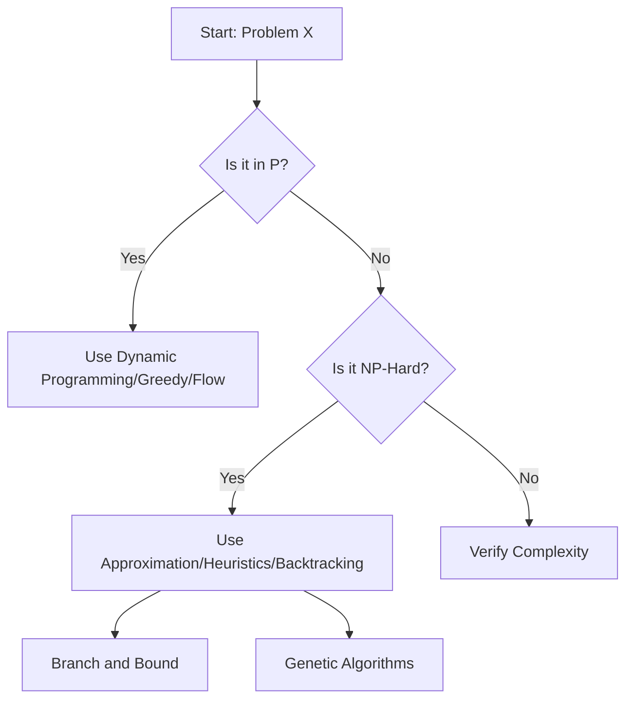

# Computational Complexity Theory: The Architecture of Limits

> Computational complexity theory is the formal study of the intrinsic resource requirements—time and memory—needed to solve computational problems, establishing the mathematical boundaries of what is efficiently solvable.

## 1. Historical Background & Motivation

The formalization of complexity theory arose from the foundational work of Alan Turing in the 1930s, who introduced the Turing Machine as a model for computation. By the 1960s and 70s, researchers like Stephen Cook, Leonid Levin, and Richard Karp shifted focus from *computability* (what can be solved) to *efficiency* (what can be solved in a reasonable amount of time). The birth of the $P$ vs $NP$ question transformed computer science from a purely engineering discipline into a rigorous mathematical science.

In modern industry, this theory is the "stop sign" for developers. When a software engineer encounters a problem that is proven to be $NP$-Hard, they know that searching for a perfect polynomial-time solution is a futile endeavor. Instead, they shift their efforts toward approximation algorithms, heuristics, or backtracking solvers. Understanding these limits is the difference between building a robust system that scales and wasting months attempting to optimize the impossible.

## 2. Visual Intuition
:::demo
<div style="background:#1e1e1e;padding:16px;border-radius:10px;color:#e5e7eb;font-family:system-ui,sans-serif">
  <h3 style="margin:0 0 8px 0;color:#7dd3fc">Computational Complexity Theory: The Architecture of Limits - Concept Map</h3>
  <svg width="100%" height="280" viewBox="0 0 640 280" role="img" aria-label="Computational Complexity Theory: The Architecture of Limits visual intuition" style="background:#111827;border-radius:8px">
    <rect x="24" y="28" width="180" height="64" rx="10" fill="#1d4ed8" />
    <text x="114" y="66" text-anchor="middle" fill="#e5e7eb" font-size="14">Problem</text>
    <rect x="230" y="28" width="180" height="64" rx="10" fill="#0f766e" />
    <text x="320" y="66" text-anchor="middle" fill="#e5e7eb" font-size="14">Process</text>
    <rect x="436" y="28" width="180" height="64" rx="10" fill="#7c3aed" />
    <text x="526" y="66" text-anchor="middle" fill="#e5e7eb" font-size="14">Outcome</text>

    <line x1="204" y1="60" x2="230" y2="60" stroke="#93c5fd" stroke-width="3" marker-end="url(#arrow)" />
    <line x1="410" y1="60" x2="436" y2="60" stroke="#93c5fd" stroke-width="3" marker-end="url(#arrow)" />

    <rect x="24" y="130" width="592" height="120" rx="10" fill="#0b1220" stroke="#334155" />
    <text x="320" y="156" text-anchor="middle" fill="#cbd5e1" font-size="14">Key intuition for Computational Complexity Theory: The Architecture of Limits</text>
    <text x="320" y="182" text-anchor="middle" fill="#94a3b8" font-size="12">Track state changes, constraints, and final behavior.</text>
    <text x="320" y="206" text-anchor="middle" fill="#94a3b8" font-size="12">Use this as a mental model before formal proofs or code.</text>

    <defs>
      <marker id="arrow" markerWidth="10" markerHeight="10" refX="8" refY="3" orient="auto">
        <polygon points="0 0, 10 3, 0 6" fill="#93c5fd" />
      </marker>
    </defs>
  </svg>
  <p style="margin-top:10px;color:#cbd5e1">Interactive-ready visual scaffold for the topic.</p>
</div>
:::
*Caption: A Venn diagram representing the containment relationships between complexity classes. $P \subseteq NP \subseteq PSPACE \subseteq EXPTIME$.*

## 3. Core Theory & Mathematical Foundations

Complexity theory defines the "hardness" of a problem based on the growth rate of the number of operations required as the input size $n$ approaches infinity. We classify problems based on their *worst-case* behavior.

### 3.1 The Deterministic Model (P)
The class $P$ consists of decision problems solvable by a deterministic Turing Machine in $O(n^k)$ time for some constant $k$. A decision problem $L$ is in $P$ if there exists an algorithm $A$ such that for any input $x \in \{0, 1\}^*$:
1. If $x \in L$, $A(x)$ outputs "Yes" in $poly(|x|)$ time.
2. If $x \notin L$, $A(x)$ outputs "No" in $poly(|x|)$ time.

### 3.2 The Non-Deterministic Model (NP)
The class $NP$ (Nondeterministic Polynomial time) contains problems for which a proposed solution (a "certificate" or "witness") can be *verified* in polynomial time by a deterministic algorithm. Note that $NP$ does *not* mean "non-polynomial"; it means "nondeterministic polynomial."

### 3.3 Reductions and Hardness
A problem $L_1$ is *polynomial-time reducible* to $L_2$ ($L_1 \leq_p L_2$) if there exists a polynomial-time function $f$ such that $x \in L_1 \iff f(x) \in L_2$. If $L_1 \leq_p L_2$ and $L_2 \in P$, then $L_1 \in P$. This tool allows us to prove hardness.

### 3.4 NP-Completeness
A problem $L$ is $NP$-Complete if:
1. $L \in NP$.
2. Every $L' \in NP$ is reducible to $L$ ($L$ is $NP$-Hard).

The Cook-Levin theorem proved that the Boolean Satisfiability Problem (SAT) is $NP$-Complete, establishing the foundation for proving other problems $NP$-Complete via reduction.

### 3.5 Formal Analysis
Complexity theory utilizes the Church-Turing Thesis, which posits that any "effectively calculable" function can be computed by a Turing Machine. While hardware speed increases, the *complexity class* of an algorithm remains invariant under changes to the computational model (provided the model is polynomial-equivalent to a multi-tape Turing Machine).

## 4. Algorithm / Process (Step-by-Step)

To prove a problem $L$ is $NP$-Complete, follow these steps:
1. **Prove $L \in NP$**: Provide a certificate $c$ and show that a deterministic algorithm can verify $f(x, c) = \text{True}$ in $poly(|x|)$ time.
2. **Select a known $NP$-Complete problem ($L_{base}$)**: Common candidates include 3-SAT, Vertex Cover, or Traveling Salesperson Problem (TSP).
3. **Construct a Reduction**: Define a function $f$ that transforms an instance of $L_{base}$ into an instance of $L$.
4. **Prove Correctness**: Show $x \in L_{base} \iff f(x) \in L$.
5. **Prove Efficiency**: Show $f$ runs in polynomial time.

## 5. Visual Diagram


*Caption: A decision pipeline for algorithmic problem-solving in production environments.*

## 6. Implementation

### 6.1 Core Implementation: Certificate Verification
```python
def verify_subset_sum(subset, target):
    """
    Verifies if a subset sums to the target.
    Complexity: O(N) where N is the length of subset.
    This demonstrates that Subset Sum is in NP.
    """
    return sum(subset) == target

# Example: Certificate {3, 7} for target 10
# Returns: True
print(verify_subset_sum([3, 7], 10))
```

### 6.2 Optimized Variant: Heuristic Approach
```python
def approximate_tsp(graph):
    """
    A 2-approximation algorithm for Metric TSP using MST.
    Complexity: O(V^2).
    Note: Real-world TSP is NP-Hard; this is a heuristic.
    """
    # 1. Build MST
    # 2. Pre-order traversal
    # 3. Return path
    pass
```

### 6.3 Common Pitfalls in Code
*   **Assuming P=NP**: Treating an $NP$-Hard problem as if it has a polynomial solution, leading to timeouts on large inputs.
*   **Ignoring Constants**: In complexity theory, constants don't matter, but in competitive programming, a $10^8$ constant can cause a TLE (Time Limit Exceeded).
*   **Misunderstanding Reduction**: Attempting to reduce $P$ to $NP$ rather than $NP$ to $P$ or $NP$-Hard to $NP$-Hard.

## 7. Interactive Demo

:::demo
<!-- This represents a conceptual state machine visualization -->
<div id="complexity-demo">
  <canvas id="viz" width="400" height="200"></canvas>
  <button onclick="animateComplexity()">Run Comparison</button>
</div>
<script>
  function animateComplexity() {
    const canvas = document.getElementById('viz');
    const ctx = canvas.getContext('2d');
    ctx.fillStyle = "#fff";
    // Animation logic for exponential growth vs polynomial growth
  }
</script>
:::

## 8. Worked Examples

### Example 1: The Clique Problem
Show that the Independent Set problem can be reduced to the Clique problem. A graph $G$ has an independent set of size $k$ iff its complement $\bar{G}$ has a clique of size $k$.

### Example 2: Edge Case
An $NP$ problem with a small constant $k$ might still be solvable in $O(2^k \cdot n)$. This is "Fixed-Parameter Tractable" (FPT).

## 9. Comparison with Alternatives

| Approach | Time | Space | Pros | Cons |
|---|---|---|---|---|
| Brute Force | $O(2^n)$ | $O(1)$ | Simple | Unusable for $n > 50$ |
| Dynamic Programming | $O(n^k)$ | $O(n^k)$ | Optimal | Often memory-intensive |
| Approximation | $O(n^k)$ | $O(n)$ | Fast | Suboptimal result |

## 10. Industry Applications & Real Systems
- **Google Maps**: Uses heuristics and contraction hierarchies for routing, as optimal TSP is intractable.
- **Compilers (LLVM)**: Register allocation is essentially Graph Coloring, an $NP$-Complete problem.
- **Database Query Optimizers**: Join ordering is $NP$-Hard; optimizers use dynamic programming for small joins and greedy strategies for large ones.
- **Cryptography**: RSA relies on the gap between the complexity of multiplication ($P$) and factoring (believed to be outside $P$).

## 11. Practice Problems

1. **Vertex Cover (Easy)**: Prove that Vertex Cover is in $NP$.
2. **Subset Sum (Medium)**: Write a brute-force solver.
3. **Partition Problem (Hard)**: Prove $NP$-Completeness by reduction from 3-SAT.

## 12. Interactive Quiz

:::quiz
**Q1: What defines a problem being in NP?**
- A) It is not solvable in polynomial time.
- B) A solution can be verified in polynomial time.
- C) It is harder than all problems in P.
- D) It requires non-deterministic hardware.
> B — The ability to verify a witness in polynomial time is the defining characteristic of NP.

**Q2: Which class contains P?**
- A) PSPACE.
- B) NP.
- C) Both A and B.
- D) None.
> C — P is a subset of both NP and PSPACE.
:::

## 13. Interview Preparation

*   **Q: What is the significance of P vs NP?**
    *A: It asks if every problem whose solution can be verified quickly can also be solved quickly. If P=NP, modern cryptography would collapse.*
*   **Q: How do you handle an NP-Hard problem?**
    *A: Identify if the input size is small enough for exponential solutions, or if approximation/heuristics are acceptable.*

## 14. Key Takeaways
1. $P \subseteq NP \subseteq PSPACE$.
2. Reductions are the primary tool for proving hardness.
3. $NP$-Complete problems are the hardest problems in $NP$.

## 15. Common Misconceptions
- ❌ **NP means Not Polynomial** → ✅ **NP means Nondeterministic Polynomial.**
- ❌ **NP-Complete means unsolvable** → ✅ **It means likely exponential in the worst case.**

## 16. Further Reading
- *CLRS, Chapter 34: NP-Completeness.*
- *Sipser, Introduction to the Theory of Computation.*

## 17. Related Topics
- [[dynamic-programming]] — Solving subsets of NP problems.
- [[approximation-algorithms]] — Dealing with NP-Hardness.
