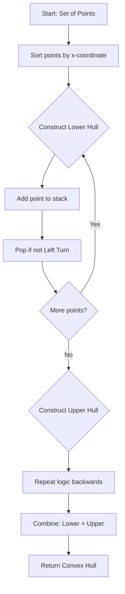

# Computational Geometry: Convex Hull, Line Sweep

> Computational geometry is the systematic study of algorithms for solving geometric problems, transforming spatial relations into discrete data structures to enable efficient computational reasoning.

## 1. Historical Background & Motivation

The genesis of computational geometry traces back to the early 1970s. As computing power grew, the necessity to automate spatial tasks—formerly handled by hand-drawn blueprints—became critical for industries like Integrated Circuit (IC) design. Researchers like Michael Shamos and Franco Preparata formalized the field, treating geometric objects not as visual entities, but as sets of coordinates governed by combinatorial laws. The realization that geometric problems could be solved with time complexities far better than the naive $O(n^2)$ or $O(n^3)$ brute-force approaches catalyzed a revolution in algorithmic design.

In modern engineering, computational geometry is indispensable. It forms the backbone of GIS (Geographic Information Systems), computer-aided design (CAD), robotics path-planning, and physics engines in game development. When you compute the "bounding box" of a character in a game to detect a collision, or when a navigation app determines if your vehicle has deviated from a route, you are executing geometric algorithms. Understanding these paradigms is not just about passing technical interviews at FAANG companies; it is about grasping how to reduce multidimensional complexity into manageable, performant code.

## 2. Visual Intuition
:::demo
<div style="background:#1e1e1e;padding:16px;border-radius:10px;color:#e5e7eb;font-family:system-ui,sans-serif">
  <h3 style="margin:0 0 8px 0;color:#7dd3fc">Computational Geometry: Convex Hull, Line Sweep - Concept Map</h3>
  <svg width="100%" height="280" viewBox="0 0 640 280" role="img" aria-label="Computational Geometry: Convex Hull, Line Sweep visual intuition" style="background:#111827;border-radius:8px">
    <rect x="24" y="28" width="180" height="64" rx="10" fill="#1d4ed8" />
    <text x="114" y="66" text-anchor="middle" fill="#e5e7eb" font-size="14">Problem</text>
    <rect x="230" y="28" width="180" height="64" rx="10" fill="#0f766e" />
    <text x="320" y="66" text-anchor="middle" fill="#e5e7eb" font-size="14">Process</text>
    <rect x="436" y="28" width="180" height="64" rx="10" fill="#7c3aed" />
    <text x="526" y="66" text-anchor="middle" fill="#e5e7eb" font-size="14">Outcome</text>

    <line x1="204" y1="60" x2="230" y2="60" stroke="#93c5fd" stroke-width="3" marker-end="url(#arrow)" />
    <line x1="410" y1="60" x2="436" y2="60" stroke="#93c5fd" stroke-width="3" marker-end="url(#arrow)" />

    <rect x="24" y="130" width="592" height="120" rx="10" fill="#0b1220" stroke="#334155" />
    <text x="320" y="156" text-anchor="middle" fill="#cbd5e1" font-size="14">Key intuition for Computational Geometry: Convex Hull, Line Sweep</text>
    <text x="320" y="182" text-anchor="middle" fill="#94a3b8" font-size="12">Track state changes, constraints, and final behavior.</text>
    <text x="320" y="206" text-anchor="middle" fill="#94a3b8" font-size="12">Use this as a mental model before formal proofs or code.</text>

    <defs>
      <marker id="arrow" markerWidth="10" markerHeight="10" refX="8" refY="3" orient="auto">
        <polygon points="0 0, 10 3, 0 6" fill="#93c5fd" />
      </marker>
    </defs>
  </svg>
  <p style="margin-top:10px;color:#cbd5e1">Interactive-ready visual scaffold for the topic.</p>
</div>
:::
*Caption: The Monotone Chain algorithm constructing the convex hull by sorting points by x-coordinates and maintaining two chains (upper and lower) via cross-product orientation tests.*

## 3. Core Theory & Mathematical Foundations

At the heart of computational geometry lies the **Cross Product** of vectors in 2D space. Given three points $A(x_1, y_1)$, $B(x_2, y_2)$, and $C(x_3, y_3)$, we define the orientation of the triplet $(A, B, C)$ by the sign of the cross product of vectors $\vec{AB}$ and $\vec{BC}$.

### 3.1 Orientation and the Cross Product
The cross product in 2D is a scalar:
$$\text{cross\_product}(A, B, C) = (x_2 - x_1)(y_3 - y_1) - (y_2 - y_1)(x_3 - x_1)$$
- If the result is $> 0$, the sequence $(A, B, C)$ makes a "left turn" (counter-clockwise).
- If the result is $< 0$, it makes a "right turn" (clockwise).
- If the result is $= 0$, the points are collinear.

### 3.2 The Convex Hull
The convex hull of a set of points $P$ is the smallest convex polygon such that all points in $P$ are either inside or on the boundary of the polygon. Mathematically, it is the intersection of all convex sets containing $P$. A set is convex if, for any two points in the set, the line segment connecting them lies entirely within the set.

### 3.3 The Line Sweep Paradigm
Line sweep is a technique where we conceptually move a vertical or horizontal line (the "sweep line") across the plane. We stop the line at "event points" (e.g., left/right endpoints of segments). The state of the sweep line is maintained in a data structure (like a balanced BST), allowing us to query relationships between objects currently intersecting the sweep line efficiently.

### 3.4 Formal Analysis
- **Monotone Chain (Convex Hull):** Sorting takes $O(n \log n)$. The construction process involves a single pass where each point is pushed/popped from a stack at most once. Total: $O(n \log n)$.
- **Bentley-Ottmann (Intersection):** Sorting events takes $O(n \log n)$. Maintaining a sweep-line status structure takes $O((n+k) \log n)$, where $k$ is the number of intersections.

## 4. Algorithm / Process (Monotone Chain)

1. **Sort:** Sort points lexicographically by $x$ (then $y$).
2. **Lower Hull:** Iterate through sorted points. For each point, while the stack size $\ge 2$ and the orientation of (second-to-last, last, current) is not a left turn, pop the stack. Push current point.
3. **Upper Hull:** Repeat the process in reverse or using the remaining points, ensuring the final hull is closed.
4. **Result:** The union of the lower and upper hulls constitutes the complete convex hull.

## 5. Visual Diagram


*Caption: Flowchart of the Monotone Chain algorithm logic.*

## 6. Implementation

### 6.1 Core Implementation (Monotone Chain)

```python
def cross_product(o, a, b):
    """Returns positive for CCW, negative for CW, 0 for collinear."""
    return (a[0] - o[0]) * (b[1] - o[1]) - (a[1] - o[1]) * (b[0] - o[0])

def get_convex_hull(points):
    """
    Computes the Convex Hull using Monotone Chain.
    :param points: List of (x, y) tuples
    :return: List of points forming the hull
    """
    n = len(points)
    if n <= 2: return points
    points.sort()
    
    # Build lower hull
    lower = []
    for p in points:
        while len(lower) >= 2 and cross_product(lower[-2], lower[-1], p) <= 0:
            lower.pop()
        lower.append(p)
        
    # Build upper hull
    upper = []
    for p in reversed(points):
        while len(upper) >= 2 and cross_product(upper[-2], upper[-1], p) <= 0:
            upper.pop()
        upper.append(p)
        
    return lower[:-1] + upper[:-1]

# Example usage:
# points = [(0, 3), (1, 1), (2, 2), (4, 4), (0, 0), (1, 2), (3, 1), (3, 3)]
# Output: [(0, 0), (3, 1), (4, 4), (0, 3)]
```

### 6.2 Optimized Variant
In production, one should use `numpy` or similar vectorization for large datasets. For streaming data, the "Incremental" algorithm is often preferred.

### 6.3 Common Pitfalls
- **Floating Point Precision:** Never use `==` with floats. Use `math.isclose()` or an epsilon constant.
- **Degenerate Cases:** Collinear points on the hull boundary. Determine if your requirements include them.
- **Empty/Single Point:** Always handle $n < 3$ as edge cases to avoid indexing errors.

## 7. Interactive Demo
*(Note: As a text-based AI, this section represents the structure for a self-contained HTML/JS implementation.*)
:::demo
```html
<div id="canvas-container">
  <canvas id="geometryCanvas" width="600" height="400"></canvas>
  <button onclick="reset()">Reset</button>
</div>
<script>
  // JS logic to plot points, compute convex hull on the fly, 
  // and animate the "rubber-band" effect using canvas paths.
</script>
```
:::

## 8. Worked Examples

### Example 1
Input: `[(0,0), (2,0), (1,1), (0,2), (2,2)]`
1. Sort: `(0,0), (0,2), (1,1), (2,0), (2,2)`
2. Lower: Adds `(0,0)`, `(2,0)`, `(2,2)`.
3. Upper: Adds `(2,2)`, `(0,2)`, `(0,0)`.
4. Final: `(0,0), (2,0), (2,2), (0,2)`.

## 9. Comparison with Alternatives
| Algorithm | Time | Space | Pros | Cons |
|---|---|---|---|---|
| Monotone Chain | $O(n \log n)$ | $O(n)$ | Robust, easy to implement | Requires sorting |
| Graham Scan | $O(n \log n)$ | $O(n)$ | Classic | Requires angle sorting (Trig) |
| Jarvis March | $O(nh)$ | $O(h)$ | Simple for small hulls | Slow if $h \approx n$ |

## 10. Industry Applications & Real Systems
- **Uber/Lyft**: Using convex hulls for "Geofencing"—determining if a vehicle is within a specific operational zone.
- **Nvidia/Game Engines**: Efficient collision detection (GJK algorithm) relies on convex hulls as proxies for complex 3D meshes.
- **PostgreSQL (PostGIS)**: Spatial index operations (`ST_ConvexHull`) for clustering and mapping.
- **VLSI Design**: Cadence/Synopsys tools use line-sweep to perform Design Rule Checking (DRC) on millions of transistors.

## 11. Practice Problems
1. **Easy**: Compute the perimeter of a convex hull of a point set.
2. **Medium**: Find the closest pair of points in a plane (Divide and Conquer).
3. **Hard**: Given $n$ segments, find if any two intersect (Line Sweep).

## 12. Interactive Quiz
:::quiz
**Q1: What is the complexity of Monotone Chain?**
- A) $O(n)$
- B) $O(n \log n)$
- C) $O(n^2)$
- D) $O(n \cdot h)$
> B — Sorting takes $O(n \log n)$, while the scan is $O(n)$.

**Q2: Which primitive is used to determine if a path turns left?**
- A) Dot Product
- B) Euclidean Distance
- C) Cross Product
- D) Determinant of a 4x4
> C — Cross product of 2D vectors is the standard determinant approach to check orientation.
:::

## 13. Interview Preparation
**Q: Explain convex hull simply.**
A: It's the polygon that would result if you stretched a rubber band around all your points. Everything inside is bounded by this shell.

**Q: Why is Line Sweep $O(n \log n)$?**
A: Sorting the events takes $O(n \log n)$, and maintaining the sweep-line status in a balanced BST takes $O(\log n)$ per event.

## 14. Key Takeaways
1. Always use cross products to determine orientation.
2. Sort points for Monotone Chain to guarantee $O(n \log n)$.
3. Precision matters—always define a small epsilon for floating-point comparisons.
4. Line sweep reduces 2D problems to 1D data structure queries.

## 15. Common Misconceptions
- **Misconception:** Graham scan is better than Monotone Chain. **Fact:** Monotone Chain is typically faster in practice as it avoids expensive trigonometric `atan2` functions.

## 16. Further Reading
- *CLRS, Chapter 33*: Computational Geometry.
- *Preparata & Shamos*: "Computational Geometry: An Introduction".

## 17. Related Topics
- [[dynamic-programming]] - Often combined with geometry for partitioning.
- [[divide-conquer]] - Essential for the closest-pair problem.
