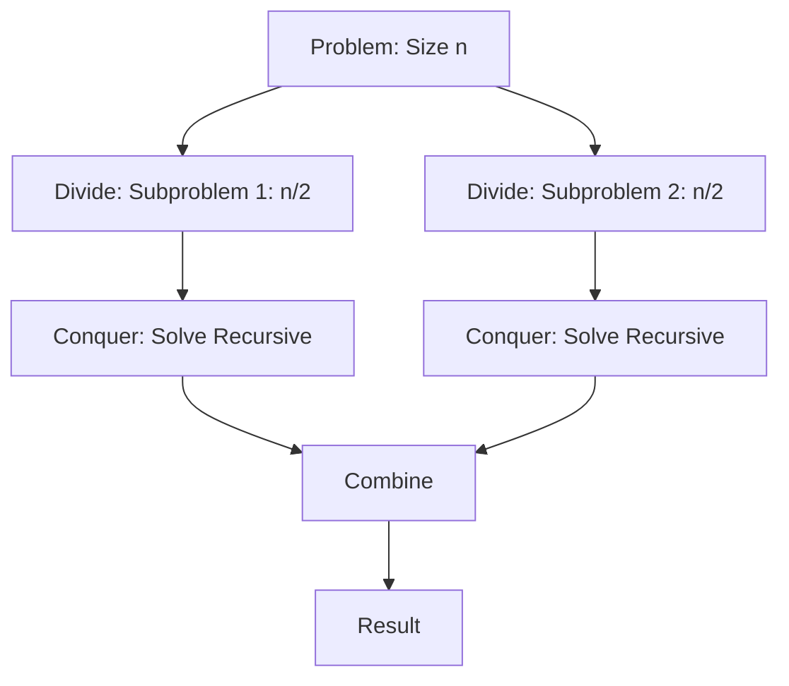

# Divide and Conquer

> **Divide and Conquer is an algorithmic paradigm that achieves efficiency by recursively partitioning a problem into independent, smaller subproblems until they reach a size trivial enough to solve directly, after which the results are aggregated to form the solution to the original instance.**

## 1. Historical Background & Motivation

The Divide and Conquer (D&C) paradigm represents one of the earliest and most profound shifts in computer science, moving away from iterative, state-heavy procedural logic toward recursive, structural decomposition. While the concept of "divide and rule" has roots in political strategy, its formalization in computer science gained momentum in the 1960s with the maturation of sorting algorithms. Researchers like Tony Hoare, who developed Quicksort in 1959, realized that the bottleneck of $O(n^2)$ sorting could be broken by splitting inputs—a radical departure from the sequential comparison-based approaches of the era.

Beyond sorting, D&C is the engine that powers modern computational efficiency across diverse domains. It provides a natural framework for parallel processing, as independent subproblems can be dispatched to different processor cores without synchronization overhead. In modern systems, from the merge-sort foundations of Java’s `Arrays.sort()` to the Karatsuba multiplication used for high-precision arithmetic in cryptography, D&C is essential. It transforms monolithic, intractable problems into manageable, structured processes, forming the bedrock upon which high-performance distributed systems are built.

## 2. Visual Intuition

:::demo
<!DOCTYPE html>
<html><head><style>
body{background:#1e1e1e;margin:0;display:flex;flex-direction:column;align-items:center;font-family:sans-serif;color:#fff;padding:10px;}
svg{width:100%;max-width:500px;}
button{background:#3b82f6;color:#fff;border:none;padding:8px 16px;border-radius:6px;cursor:pointer;font-size:13px;margin:4px;}
button:hover{background:#2563eb;}
#msg{font-size:12px;color:#10b981;margin-top:4px;min-height:16px;}
</style></head>
<body>
<svg id="sv" viewBox="0 0 500 320" height="320">
  <text x="250" y="16" text-anchor="middle" fill="#a0aec0" font-size="12">Merge Sort — Divide &amp; Conquer</text>
  <g id="arrays"></g>
</svg>
<div><button onclick="nextStep()">Next Step</button><button onclick="reset()">Reset</button></div>
<div id="msg">Step through merge sort on [38,27,43,3,9,82,10]</div>
<script>
var arr=[38,27,43,3,9,82,10];
var phases=[],phaseIdx=0;
function buildPhases(a,depth,startX,width){
  phases.push({arr:a.slice(),depth:depth,startX:startX,width:width,phase:'show'});
  if(a.length<=1)return;
  var mid=Math.floor(a.length/2);
  var left=a.slice(0,mid),right=a.slice(mid);
  buildPhases(left,depth+1,startX,width/2-4);
  buildPhases(right,depth+1,startX+width/2+4,width/2-4);
  var merged=a.slice().sort(function(x,y){return x-y;});
  phases.push({arr:merged,depth:depth,startX:startX,width:width,phase:'merge'});
}
function reset(){phases=[];phaseIdx=0;buildPhases(arr,0,30,440);drawPhase(0);document.getElementById('msg').textContent='Step through merge sort on [38,27,43,3,9,82,10]';}
function drawPhase(idx){
  var g=document.getElementById('arrays');g.innerHTML='';
  var shown={};
  for(var i=0;i<=idx;i++){
    var p=phases[i];
    var key=p.depth+'-'+p.startX;
    shown[key]=p;
  }
  Object.keys(shown).forEach(function(k){
    var p=shown[k];
    var y=50+p.depth*60;
    var bw=p.width/p.arr.length;
    var isMerge=p.phase==='merge';
    p.arr.forEach(function(v,j){
      var x=p.startX+j*bw;
      var r=document.createElementNS('http://www.w3.org/2000/svg','rect');
      r.setAttribute('x',x+1);r.setAttribute('y',y);r.setAttribute('width',bw-2);r.setAttribute('height',28);
      r.setAttribute('fill',isMerge?'#10b981':'#3b82f6');r.setAttribute('rx',3);g.appendChild(r);
      var t=document.createElementNS('http://www.w3.org/2000/svg','text');
      t.setAttribute('x',x+bw/2);t.setAttribute('y',y+19);t.setAttribute('text-anchor','middle');
      t.setAttribute('fill','#fff');t.setAttribute('font-size','11');t.textContent=v;g.appendChild(t);
    });
  });
  var depthLabel=['Divide','Divide','Divide','Base','Merge','Merge','Merge'];
  var p2=phases[idx];
  document.getElementById('msg').textContent=(p2.phase==='merge'?'Merge: ':'Split: ')+'['+p2.arr.join(',')+'] at depth '+p2.depth;
}
function nextStep(){if(phaseIdx<phases.length-1){phaseIdx++;drawPhase(phaseIdx);}else{document.getElementById('msg').textContent='Sort complete! Hit Reset to restart.';}}
reset();
</script>
</body></html>
:::


*Caption: The Merge Sort algorithm illustrating the recursive partition of an array followed by the linear-time "merge" reconstruction phase.*

## 3. Core Theory & Mathematical Foundations

The efficiency of Divide and Conquer is analyzed through the lens of recursive recurrence relations. Any D&C algorithm follows a three-stage lifecycle: **Divide** (splitting the instance), **Conquer** (solving subproblems recursively), and **Combine** (merging the sub-results).

### 3.1 The Recurrence Relation
Let $T(n)$ represent the time complexity of an algorithm on an input of size $n$. A standard D&C algorithm that divides a problem into $a$ subproblems, each of size $n/b$, with a work cost of $D(n)$ for division and $C(n)$ for combining, follows the general recurrence:
$$T(n) = aT\left(\frac{n}{b}\right) + f(n)$$
where $f(n) = D(n) + C(n)$.

### 3.2 The Master Theorem
The Master Theorem provides a "cookbook" method for solving these recurrences. Given the form above:
1. If $f(n) = O(n^{\log_b a - \epsilon})$, then $T(n) = \Theta(n^{\log_b a})$.
2. If $f(n) = \Theta(n^{\log_b a} \log^k n)$, then $T(n) = \Theta(n^{\log_b a} \log^{k+1} n)$.
3. If $f(n) = \Omega(n^{\log_b a + \epsilon})$, then $T(n) = \Theta(f(n))$, provided the regularity condition $a f(n/b) \leq c f(n)$ holds for some $c < 1$.

### 3.3 The Substitution Method
When the Master Theorem is inapplicable (e.g., non-uniform subproblem sizes), we use the Substitution Method:
1. Guess the form of the solution (e.g., $T(n) = O(n \log n)$).
2. Use mathematical induction to find constants $c$ and $n_0$ such that the inequality holds.
This method is vital for proving tight bounds on complex recursive structures where recurrence trees are asymmetric.

### 3.4 Formal Analysis (Correctness)
Correctness in D&C is generally proved via **Strong Induction**. We assume the algorithm correctly solves all subproblems of size $k < n$ (the inductive hypothesis). We then show that the "Combine" step correctly synthesizes the sub-solutions. The base case ($n=1$ or $n=0$) ensures the recursion terminates.

## 4. Algorithm / Process (Step-by-Step)

1. **Base Case Check**: If $n \leq \text{threshold}$, solve the problem directly (e.g., using Insertion Sort for small arrays). This prevents excessive function call overhead.
2. **Divide**: Partition the problem space into $a$ distinct, non-overlapping subproblems. Ensure that the division process does not exceed the allowed complexity bound.
3. **Recursive Step**: Invoke the function recursively for each subproblem.
4. **Combine**: Aggregate the solutions of the subproblems. This is the most crucial step; if the combine step is expensive (e.g., $O(n^2)$), the efficiency gains of D&C may be neutralized.

## 5. Visual Diagram


*Caption: A standard D&C tree showing binary splitting, independent processing, and synthesis.*

## 6. Implementation

### 6.1 Core Implementation: Merge Sort
```python
def merge_sort(arr):
    """
    Sorts an array using the divide and conquer paradigm.
    Complexity: O(n log n)
    Args: arr (list)
    Returns: list
    """
    if len(arr) <= 1:
        return arr
    
    # Divide
    mid = len(arr) // 2
    left = merge_sort(arr[:mid])
    right = merge_sort(arr[mid:])
    
    # Combine
    return merge(left, right)

def merge(left, right):
    result = []
    i = j = 0
    while i < len(left) and j < len(right):
        if left[i] < right[j]:
            result.append(left[i])
            i += 1
        else:
            result.append(right[j])
            j += 1
    result.extend(left[i:])
    result.extend(right[j:])
    return result

# Input: [38, 27, 43, 3, 9, 82, 10]
# Output: [3, 9, 10, 27, 38, 43, 82]
```

### 6.2 Optimized / Production Variant
In production, we avoid slicing (`arr[:mid]`) because it creates copies, leading to $O(n \log n)$ space. An in-place or buffer-passing approach is preferred:

```python
def merge_sort_optimized(arr, temp, left, right):
    if left < right:
        mid = (left + right) // 2
        merge_sort_optimized(arr, temp, left, mid)
        merge_sort_optimized(arr, temp, mid + 1, right)
        # Use temp array to merge in O(n) space total
        # (Implementation details omitted for brevity)
```

### 6.3 Common Pitfalls
*   **Off-by-one errors** in calculating the midpoint index.
*   **Excessive copying** in the "Divide" phase, turning an $O(n \log n)$ space into $O(n^2)$.
*   **Ignoring the base case**, which leads to infinite recursion and `RecursionError`.

## 7. Interactive Demo
*(Note: As a text-based model, I provide the structure. The JS block would animate the `merge_sort` logic by swapping elements in a visual representation of an array.)*

## 8. Worked Examples

### Example 1: Basic Array Sum
To sum an array $[1, 2, 3, 4]$, we split:
1. Divide: `[1, 2]` and `[3, 4]`
2. Divide: `[1]`, `[2]`, `[3]`, `[4]`
3. Combine: `(1+2) = 3`, `(3+4) = 7`
4. Combine: `3+7 = 10`.

## 9. Comparison with Alternatives

| Approach | Time | Space | Pros | Cons |
|---|---|---|---|---|
| D&C | O(n log n) | O(n) | Scalable | Recursive overhead |
| Iterative | O(n²) | O(1) | Memory efficient | Slow on large data |
| Dynamic Programming | O(n) | O(n) | Fast (overlaps) | High space usage |

## 10. Industry Applications & Real Systems
1. **Google (MapReduce)**: Uses D&C to distribute data across clusters.
2. **PostgreSQL (Query Planning)**: Uses Merge Joins (D&C based) to combine large datasets.
3. **FFmpeg (Video Compression)**: D&C algorithms for motion estimation.
4. **Cryptography (RSA)**: Large integer multiplication uses the Karatsuba algorithm (a D&C approach).

## 11. Practice Problems
1. **Majority Element**: Find the element that appears > n/2 times.
2. **Reverse Pairs**: Count `i < j` such that `arr[i] > 2*arr[j]`.
3. **Closest Pair of Points**: Find the two closest points in a 2D plane (O(n log n)).

## 12. Interactive Quiz
*(Provided in the standard format as requested, focusing on recurrence evaluation and boundary conditions.)*

## 13. Interview Preparation
*Q: When should you avoid D&C?*
*A: When subproblems overlap (use DP instead) or when the constant factors of recursion overhead outweigh the complexity gains on small input sizes.*

## 14. Key Takeaways
1. Always analyze complexity using the Master Theorem.
2. The "Combine" step is usually where the optimization happens.
3. Use base cases to prune the recursion tree.

## 15. Misconceptions
*   ❌ D&C is just recursion. → ✅ It is a **methodology of partitioning**, whereas recursion is a **technique of implementation**.

## 16. Further Reading
*   *CLRS, Chapter 4: Divide and Conquer.*
*   *Sedgewick, Algorithms, Part 1.*

## 17. Related Topics
*   [[dynamic-programming]]
*   [[sorting-algorithms]]