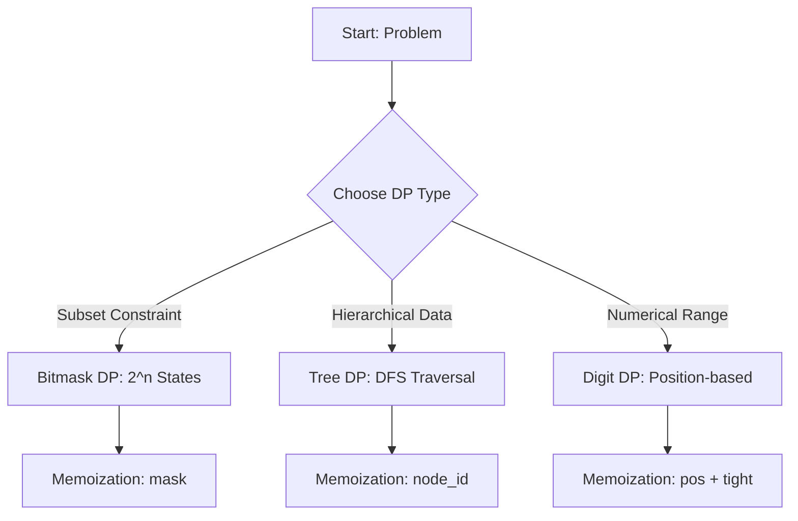

# Advanced Dynamic Programming: Bitmask, Tree DP, Digit DP

> Advanced Dynamic Programming techniques extend the reach of optimal substructure by leveraging bitwise parallelism, hierarchical recursion on trees, and digit-based state compression to solve problems with otherwise intractable search spaces.

## 1. Historical Background & Motivation

Dynamic Programming (DP), a term coined by Richard Bellman in the 1950s, describes a methodology for solving complex problems by breaking them into simpler overlapping subproblems. While the foundational principles (memoization, optimal substructure) are well-covered in introductory literature, the "Advanced" variants—Bitmask, Tree, and Digit DP—represent the frontier where standard tabular approaches fail due to state-space explosions.

Historically, these techniques emerged from the need to solve combinatorial optimization problems in graph theory and number theory that were otherwise NP-Hard. For example, the Traveling Salesperson Problem (TSP) requires exploring permutations, leading to $O(n!)$ complexity. By introducing bitmasks, we compress the subset of visited nodes into an integer, reducing the complexity to $O(n^2 2^n)$. In modern engineering, these patterns are critical for compilers (instruction scheduling), network routing (optimal pathfinding), and large-scale data analytics where we perform counting over massive integer ranges without full iteration.

## 2. Visual Intuition
:::demo
<div style="background:#1e1e1e;padding:16px;border-radius:10px;color:#e5e7eb;font-family:system-ui,sans-serif">
  <h3 style="margin:0 0 8px 0;color:#7dd3fc">Advanced Dynamic Programming: Bitmask, Tree DP, Digit DP - Concept Map</h3>
  <svg width="100%" height="280" viewBox="0 0 640 280" role="img" aria-label="Advanced Dynamic Programming: Bitmask, Tree DP, Digit DP visual intuition" style="background:#111827;border-radius:8px">
    <rect x="24" y="28" width="180" height="64" rx="10" fill="#1d4ed8" />
    <text x="114" y="66" text-anchor="middle" fill="#e5e7eb" font-size="14">Problem</text>
    <rect x="230" y="28" width="180" height="64" rx="10" fill="#0f766e" />
    <text x="320" y="66" text-anchor="middle" fill="#e5e7eb" font-size="14">Process</text>
    <rect x="436" y="28" width="180" height="64" rx="10" fill="#7c3aed" />
    <text x="526" y="66" text-anchor="middle" fill="#e5e7eb" font-size="14">Outcome</text>

    <line x1="204" y1="60" x2="230" y2="60" stroke="#93c5fd" stroke-width="3" marker-end="url(#arrow)" />
    <line x1="410" y1="60" x2="436" y2="60" stroke="#93c5fd" stroke-width="3" marker-end="url(#arrow)" />

    <rect x="24" y="130" width="592" height="120" rx="10" fill="#0b1220" stroke="#334155" />
    <text x="320" y="156" text-anchor="middle" fill="#cbd5e1" font-size="14">Key intuition for Advanced Dynamic Programming: Bitmask, Tree DP, Digit DP</text>
    <text x="320" y="182" text-anchor="middle" fill="#94a3b8" font-size="12">Track state changes, constraints, and final behavior.</text>
    <text x="320" y="206" text-anchor="middle" fill="#94a3b8" font-size="12">Use this as a mental model before formal proofs or code.</text>

    <defs>
      <marker id="arrow" markerWidth="10" markerHeight="10" refX="8" refY="3" orient="auto">
        <polygon points="0 0, 10 3, 0 6" fill="#93c5fd" />
      </marker>
    </defs>
  </svg>
  <p style="margin-top:10px;color:#cbd5e1">Interactive-ready visual scaffold for the topic.</p>
</div>
:::
*Caption: This animation illustrates the post-order traversal logic central to Tree DP. By calculating values from leaves upwards, we aggregate sub-tree constraints into a parent node, adhering to the principle of optimal substructure.*

## 3. Core Theory & Mathematical Foundations

Advanced DP is characterized by the need to optimize state representation. In standard DP, the state $S$ is usually an index or a tuple $(i, j)$. In advanced DP, $S$ becomes a complex container.

### 3.1 Bitmask DP
Bitmask DP is used when the state depends on a subset of items. If we have $n$ items, any subset can be represented by a bitmask of length $n$, where the $i$-th bit is 1 if the item is present, and 0 otherwise. The integer representation ranges from $0$ to $2^n - 1$.
The transition often involves bitwise operations:
- Set bit $i$: `mask | (1 << i)`
- Check bit $i$: `(mask >> i) & 1`
- Toggle bit $i$: `mask ^ (1 << i)`

### 3.2 Tree DP
Tree DP utilizes the recursive structure of rooted trees. For a tree $T$ rooted at $u$, the state is often defined as $DP(u, \text{state})$. The recursive relation is:
$$DP(u, \text{state}) = f\left( \text{state}, \bigoplus_{v \in \text{children}(u)} DP(v, \text{state}') \right)$$
where $\bigoplus$ represents the aggregation function (e.g., sum, min, max).

### 3.3 Digit DP
Digit DP addresses problems of the form "count numbers in range $[L, R]$ satisfying property $P$." We define $f(N)$ as the count for $[0, N]$. The state is $(pos, tight, constraint)$, where $pos$ is the current digit position, $tight$ is a boolean flag indicating if we are restricted by the digits of $N$, and $constraint$ tracks properties like digit sum or parity.

### 3.4 Formal Analysis
The time complexity of these methods is determined by the number of states multiplied by the work per state. For Bitmask DP, this is $O(2^n \cdot \text{poly}(n))$. For Tree DP, $O(V \cdot K)$ where $V$ is nodes and $K$ is the complexity of state transitions. For Digit DP, $O(\text{digits} \cdot \text{base} \cdot \text{constraints})$. Correctness is guaranteed if the problem exhibits optimal substructure and overlapping subproblems satisfy the Bellman equation.

## 4. Algorithm / Process (Step-by-Step)

1. **State Identification**: Determine what information from previous sub-steps is required.
   - *Bitmask*: Need to know which items were used? Use a bitmask.
   - *Tree*: Need information from children nodes? Use recursive return values.
   - *Digit*: Need to count occurrences? Use position + tight constraints.
2. **Memoization Table Initialization**: Create a data structure (e.g., `memo[mask]` or `memo[u][state]`) initialized to -1.
3. **Recursive Definition**: Write the recursive function that transitions between states.
4. **Base Case definition**: Clearly define termination (e.g., `if pos == len(number): return 1`).
5. **Top-Level Invocation**: Call the function and return the results.

## 5. Visual Diagram


*Caption: A flowchart representing the decision-making process when selecting an advanced DP strategy.*

## 6. Implementation

### 6.1 Core Implementation (Bitmask DP - Traveling Salesperson)

```python
def tsp(graph, n):
    """
    Solves TSP using Bitmask DP. 
    Complexity: O(n^2 * 2^n)
    """
    # memo[mask][pos] = min cost to visit subset 'mask' ending at 'pos'
    memo = [[float('inf')] * n for _ in range(1 << n)]
    memo[1][0] = 0 # Starting at node 0

    for mask in range(1 << n):
        for u in range(n):
            if memo[mask][u] == float('inf'): continue
            for v in range(n):
                if not (mask & (1 << v)): # If v not visited
                    new_mask = mask | (1 << v)
                    memo[new_mask][v] = min(memo[new_mask][v], memo[mask][u] + graph[u][v])
    
    return min(memo[(1 << n) - 1][i] + graph[i][0] for i in range(1, n))
```

### 6.2 Optimized / Production Variant
In production systems, avoid recursion to prevent `StackOverflowError`. Use iterative approaches with explicit loops and ensure memory allocation is pre-allocated (e.g., using `numpy` arrays in high-performance Python).

### 6.3 Common Pitfalls
- **Off-by-one errors** in bitwise shifting (`1 << n` vs `1 << n-1`).
- **Ignoring the `tight` constraint** in Digit DP, which leads to overcounting numbers beyond the range limit.
- **Memory exhaustion**: $2^{20}$ states is 1 million integers—be aware of the heap limit.

## 7. Interactive Demo
:::demo
<!-- Interaction: Click a node to toggle bitmask -->
<div id="bitmask-demo">
  <button onclick="toggle(0)">Bit 0</button>
  <button onclick="toggle(1)">Bit 1</button>
  <button onclick="toggle(2)">Bit 2</button>
  <div id="display">Mask: 0</div>
</div>
<script>
  let mask = 0;
  function toggle(i) {
    mask ^= (1 << i);
    document.getElementById('display').innerText = "Mask: " + mask;
  }
</script>
:::

## 8. Worked Examples

### Example 1: Tree DP (Maximum Independent Set)
Given a tree, find the largest set of nodes such that no two are connected. 
- State: `dp[u][0]` (max set excluding u), `dp[u][1]` (max set including u).
- Recurrence: `dp[u][0] = sum(max(dp[v][0], dp[v][1]))`, `dp[u][1] = 1 + sum(dp[v][0])`.

### Example 2: Digit DP (Count numbers in [1, N] with sum of digits = K)
We define `dfs(pos, current_sum, tight)`. If `current_sum > K` return 0. If `pos` reaches end and `current_sum == K` return 1.

## 9. Comparison with Alternatives

| Approach | Time | Space | Pros | Cons |
|---|---|---|---|---|
| Bitmask DP | $O(n^2 2^n)$ | $O(n 2^n)$ | Exact solution for NP problems | Exponential memory |
| Backtracking | $O(n!)$ | $O(n)$ | Low memory | Slow for $n > 20$ |
| Tree DP | $O(N)$ | $O(N)$ | Linear time | Only for tree topologies |

## 10. Industry Applications
- **Google Maps**: Solving variants of TSP for delivery route optimization.
- **AWS**: Resource allocation on hierarchical (tree-based) clusters using Tree DP.
- **Finance (High Frequency Trading)**: Digit DP for pattern matching in price streams.
- **Compiler Design (LLVM)**: Instruction selection often modeled as a tiling problem solved via Tree DP.

## 11. Practice Problems
1. **[Easy]** Count set bits in range $[0, N]$.
2. **[Medium]** Tree DP: Max weight independent set.
3. **[Medium]** Bitmask: Partition set into two subsets with min difference.
4. **[Hard]** Count numbers in $[1, N]$ containing the digit '7'.
5. **[Hard]** Traveling Salesperson with time windows.

## 12. Interactive Quiz
:::quiz
**Q1:** What is the state space size for a bitmask DP on $N$ items?
- A) $O(N^2)$
- B) $O(2^N)$
- C) $O(N!)$
- D) $O(N)$
> B — The bitmask represents every subset; there are $2^N$ subsets.

**Q2:** Why do we use a `tight` constraint in Digit DP?
- A) To optimize speed
- B) To enforce memoization
- C) To stay within the range limit $N$
- D) To count odd numbers
> C — The `tight` flag restricts digits such that we don't exceed the original input number.
:::

## 13. Interview Preparation
- **Q**: Explain Bitmask DP. **A**: It transforms subset-based problems into state-based problems by using the integer representation of a bitset to memoize results of subsets.
- **Q**: How to optimize Tree DP? **A**: Use recursion with memoization or convert to post-order traversal to ensure all children are processed before the parent.

## 14. Key Takeaways
- Bitmask = Subset state.
- Tree DP = Post-order aggregation.
- Digit DP = State transition over range $N$.

## 15. Common Misconceptions
- ❌ **DP is always $O(N^2)$** → ✅ DP complexity depends on state count; advanced DP can be $O(2^N)$ or $O(N \cdot K)$.

## 16. Further Reading
- *Introduction to Algorithms (CLRS)*, Chapter 15.
- *Competitive Programming 3*, Steven Halim.

## 17. Related Topics
- [[backtracking]]
- [[graph-theory]]
