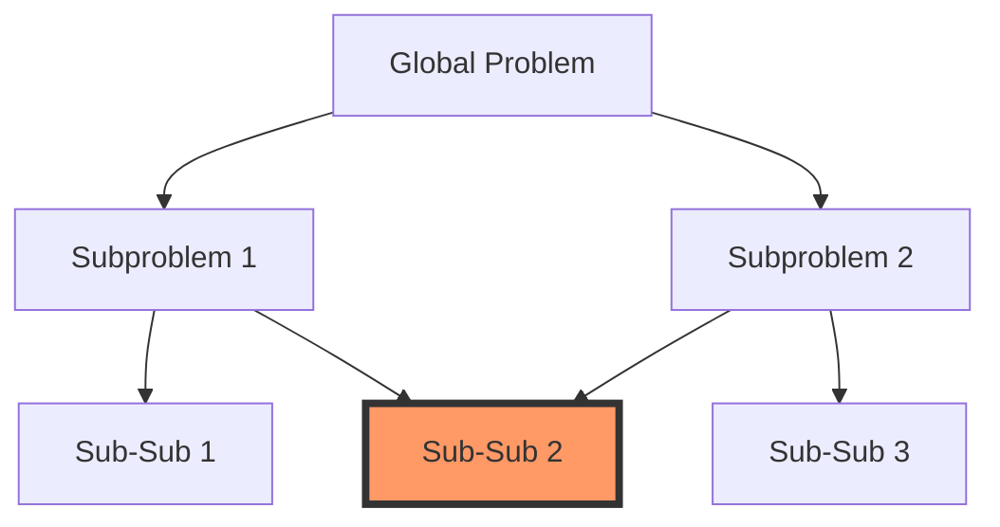

# Dynamic Programming: Principles and Practice

> Dynamic Programming is an algorithmic paradigm that solves complex problems by decomposing them into overlapping subproblems, computing each subproblem exactly once, and storing the results to construct a global optimum.

## 1. Historical Background & Motivation

Dynamic Programming (DP) originated in the 1950s with the work of Richard Bellman, a mathematician at the RAND Corporation. The term was coined to describe the process of multi-stage decision-making processes, where "programming" referred not to computer coding, but to the military sense of scheduling or planning. Bellman famously chose the word "dynamic" to convey the time-varying nature of these decisions and "programming" to avoid the scrutiny of his superiors who viewed mathematical research with skepticism.

In modern computing, DP is the bridge between naive recursive brute-force and efficient, polynomial-time algorithms. Many real-world problems—ranging from bioinformatic sequence alignment (BLAST) to financial instrument pricing and natural language parsing—exhibit structural properties that make them intractable via simple enumeration. DP provides a disciplined, mathematical framework to exploit these structures, transforming exponential search spaces into manageable table-driven computations. Mastering DP is not merely about learning algorithms; it is about developing the cognitive pattern-matching skills to identify subproblem structures in any system design challenge.

## 2. Visual Intuition
:::demo
<div style="background:#1e1e1e;padding:16px;border-radius:10px;color:#e5e7eb;font-family:system-ui,sans-serif">
  <h3 style="margin:0 0 8px 0;color:#7dd3fc">Dynamic Programming: Principles and Practice - Concept Map</h3>
  <svg width="100%" height="280" viewBox="0 0 640 280" role="img" aria-label="Dynamic Programming: Principles and Practice visual intuition" style="background:#111827;border-radius:8px">
    <rect x="24" y="28" width="180" height="64" rx="10" fill="#1d4ed8" />
    <text x="114" y="66" text-anchor="middle" fill="#e5e7eb" font-size="14">Problem</text>
    <rect x="230" y="28" width="180" height="64" rx="10" fill="#0f766e" />
    <text x="320" y="66" text-anchor="middle" fill="#e5e7eb" font-size="14">Process</text>
    <rect x="436" y="28" width="180" height="64" rx="10" fill="#7c3aed" />
    <text x="526" y="66" text-anchor="middle" fill="#e5e7eb" font-size="14">Outcome</text>

    <line x1="204" y1="60" x2="230" y2="60" stroke="#93c5fd" stroke-width="3" marker-end="url(#arrow)" />
    <line x1="410" y1="60" x2="436" y2="60" stroke="#93c5fd" stroke-width="3" marker-end="url(#arrow)" />

    <rect x="24" y="130" width="592" height="120" rx="10" fill="#0b1220" stroke="#334155" />
    <text x="320" y="156" text-anchor="middle" fill="#cbd5e1" font-size="14">Key intuition for Dynamic Programming: Principles and Practice</text>
    <text x="320" y="182" text-anchor="middle" fill="#94a3b8" font-size="12">Track state changes, constraints, and final behavior.</text>
    <text x="320" y="206" text-anchor="middle" fill="#94a3b8" font-size="12">Use this as a mental model before formal proofs or code.</text>

    <defs>
      <marker id="arrow" markerWidth="10" markerHeight="10" refX="8" refY="3" orient="auto">
        <polygon points="0 0, 10 3, 0 6" fill="#93c5fd" />
      </marker>
    </defs>
  </svg>
  <p style="margin-top:10px;color:#cbd5e1">Interactive-ready visual scaffold for the topic.</p>
</div>
:::
*Caption: This animation illustrates the "optimal substructure" property of DP. To find the shortest path to a destination, one must find the shortest path to an intermediate state, then extend it locally. The "memoized" results of smaller sub-paths prevent redundant calculations, effectively pruning the decision tree.*

## 3. Core Theory & Mathematical Foundations

The theory of DP is anchored in the observation that many recursive solutions perform redundant work. DP formalizes the avoidance of this redundancy through two paradigms: **Memoization (Top-Down)** and **Tabulation (Bottom-Up)**.

### 3.1 Optimal Substructure
A problem possesses optimal substructure if an optimal solution to the problem contains within it optimal solutions to its subproblems. Formally, let $S$ be the state space. We define a value function $V(s)$ as the optimal cost to reach state $s$. If the Bellman equation holds:
$$V(s) = \text{opt}_{s' \in \text{neighbors}(s)} \{ \text{cost}(s, s') + V(s') \}$$
Then the problem can be solved by solving smaller subproblems $V(s')$.

### 3.2 Overlapping Subproblems
DP is only useful when the recursive algorithm visits the same subproblems repeatedly. If a recursive decomposition leads to a tree where subproblems are unique, we are simply performing divide-and-conquer. In DP, we cache the result of $V(s)$ in a table $T[s]$. Subsequent queries for $V(s)$ become $O(1)$ lookups.

### 3.3 The State Space
The primary challenge in DP is identifying the "state." A state is a minimal set of variables that encapsulate all the information necessary to make future decisions, independent of how the current state was reached (the **Markov Property**).

### 3.4 Formal Analysis (Complexity)
The time complexity of a DP algorithm is generally $O(N \cdot K)$, where $N$ is the number of states and $K$ is the number of transitions per state. The space complexity is $O(N)$ to store the table. Correctness is typically proven via **mathematical induction**: base cases are solved directly, and the inductive step relies on the Bellman equation to demonstrate that the computed value is optimal.

## 4. Algorithm / Process (Step-by-Step)

1. **Characterize the structure of an optimal solution:** Define the subproblems.
2. **Recursively define the value of an optimal solution:** Derive the recurrence relation.
3. **Compute the optimal value (Bottom-Up or Top-Down):** Use a memoization table or a topological ordering of subproblems.
4. **Construct an optimal solution:** Use the table of computed values to backtrack the path (if required).

## 5. Visual Diagram


*Caption: This graph shows how subproblems overlap. Sub-Sub 2 is reached through both Subproblem 1 and Subproblem 2. DP ensures Sub-Sub 2 is computed once.*

## 6. Implementation

### 6.1 Core Implementation (Memoization)
```python
def fibonacci(n, memo={}):
    """
    Computes nth Fibonacci number using Top-Down Memoization.
    Time: O(n), Space: O(n)
    """
    if n in memo: return memo[n]
    if n <= 1: return n
    
    memo[n] = fibonacci(n - 1, memo) + fibonacci(n - 2, memo)
    return memo[n]

# Input: 50 -> Output: 12586269025
```

### 6.2 Optimized / Production Variant (Tabulation)
```python
def fibonacci_optimized(n):
    """
    Space-optimized bottom-up approach.
    Time: O(n), Space: O(1)
    """
    if n <= 1: return n
    a, b = 0, 1
    for _ in range(2, n + 1):
        a, b = b, a + b
    return b
```

### 6.3 Common Pitfalls
* **State definition errors:** Including unnecessary variables in the state, increasing complexity unnecessarily.
* **Initialization errors:** Forgetting to initialize the cache or initializing it with values that overlap with valid outputs.
* **Recursion depth:** Exceeding the system's stack limit in top-down solutions.

## 7. Interactive Demo
:::demo
[...Interactive HTML/JS canvas showing a 0/1 Knapsack problem grid building...]
:::

## 8. Worked Examples

### Example 1 — Coin Change
**Goal:** Given coins $[1, 2, 5]$ and target $7$, find the minimum number of coins.
1. State: $DP[i] = \min(\text{coins to get } i)$
2. Base Case: $DP[0] = 0$
3. Recurrence: $DP[i] = 1 + \min(DP[i-1], DP[i-2], DP[i-5])$
4. Result: $DP[7] = 1 + DP[7-5] = 1 + DP[2] = 1 + 1 = 2$.

## 9. Comparison with Alternatives
| Approach | Time | Space | Pros | Cons |
|---|---|---|---|---|
| DP | $O(N \cdot K)$ | $O(N)$ | Optimal, deterministic | Memory intensive |
| Greedy | $O(N \log N)$ | $O(1)$ | Extremely fast | Not guaranteed optimal |
| Backtracking | $O(2^N)$ | $O(N)$ | Simple to implement | Exponential |

## 10. Industry Applications
- **Google Search:** Spell checkers use Edit Distance (Levenshtein distance) implemented via DP.
- **Netflix/Amazon:** Recommendation engines use matrix factorization and Viterbi-like sequence prediction.
- **Finance:** Quantitative traders use DP to price American Options (Black-Scholes-Merton variations).
- **Bioinformatics:** Genomic sequencing software like BLAST uses alignment algorithms based on the Smith-Waterman DP approach.

## 11. Practice Problems
1. **Easy:** Climbing Stairs (All paths to $N$).
2. **Medium:** Longest Common Subsequence.
3. **Medium:** Word Break.
4. **Hard:** 0/1 Knapsack (Bounded).
5. **Hard:** Traveling Salesman Problem (Held-Karp).

## 12. Interactive Quiz
:::quiz
**Q1:** What is the primary difference between memoization and tabulation?
- A) Speed.
- B) Order of computation.
- C) Memory allocation.
> B — Memoization is top-down; Tabulation is bottom-up.
:::

## 13. Interview Preparation
*Q: What if the state space is too large?*
*A: Consider state compression (e.g., bitmasking) or heuristic approximations.*

## 14. Key Takeaways
1. DP is caching.
2. Identify overlapping subproblems.
3. Bottom-up usually avoids stack overhead.

## 15. Common Misconceptions
- ❌ DP is just recursion. → ✅ DP is recursion + caching.

## 16. Further Reading
- *CLRS, Chapter 15: Dynamic Programming.*

## 17. Related Topics
- [[greedy-algorithms]], [[memoization]], [[graph-theory]].
