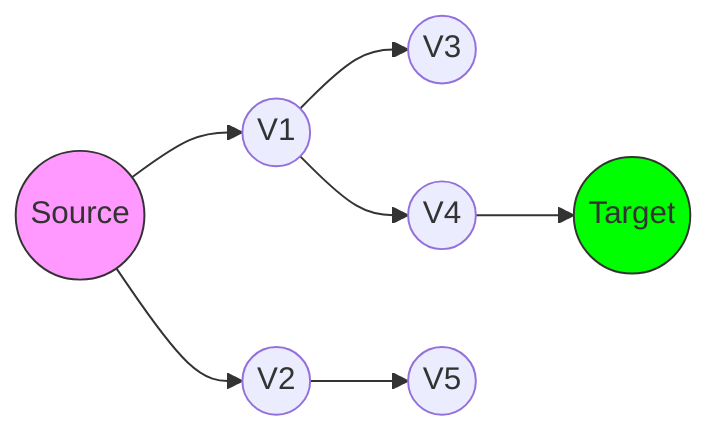

# Graph Algorithms: Foundations, Traversal, and Optimization

> Graph algorithms are the mathematical and computational primitives that enable the modeling of interconnected systems, facilitating the transformation of raw relational data into optimized decision-making processes.

## 1. Historical Background & Motivation

Graph theory traces its origins to the 18th century, specifically Leonhard Euler’s 1736 paper on the *Seven Bridges of Königsberg*. Euler sought to determine if a path existed through the city that crossed each of its seven bridges exactly once. By abstracting the landmasses into vertices and the bridges into edges, Euler founded the field of topology and graph theory, demonstrating that the impossibility of the task was rooted in the parity of vertex degrees.

In modern computing, this abstraction is indispensable. From the early days of network routing (the ARPANET) to contemporary large-scale distributed systems like Google's Knowledge Graph or Facebook's social network, graphs serve as the universal language of relationship modeling. Whether we are optimizing logistics through shortest-path computations or determining system reliability via reachability analysis, graph algorithms are the engines that scale modern software infrastructures. Understanding these algorithms is not merely an academic exercise; it is a fundamental requirement for designing high-performance systems capable of navigating billions of nodes and edges in real time.

## 2. Visual Intuition


*Caption: BFS explores a graph level-by-level, effectively finding the shortest path in an unweighted graph by expanding the frontier of visited nodes systematically.*

## 3. Core Theory & Mathematical Foundations

At its essence, a graph $G = (V, E)$ consists of a set of vertices $V$ and a set of edges $E \subseteq V \times V$. Graphs may be directed, where $(u, v) \neq (v, u)$, or undirected, where $(u, v) = (v, u)$. 

### 3.1 Adjacency Representations
The choice of representation governs the efficiency of subsequent algorithms. 
- **Adjacency Matrix**: A $|V| \times |V|$ matrix where $A[i][j] = 1$ if an edge exists from $i$ to $j$, else $0$. Space complexity is $O(V^2)$. Ideal for dense graphs.
- **Adjacency List**: A collection of lists where each $v \in V$ points to a list of neighbors. Space complexity is $O(V + E)$. Preferred for sparse graphs, which predominate in real-world applications.

### 3.2 Connectivity and Paths
A *path* is a sequence of vertices $\langle v_0, v_1, \dots, v_k \rangle$ such that $(v_i, v_{i+1}) \in E$. A graph is *connected* if every pair of vertices is reachable from one another. We denote $dist(u, v)$ as the length of the shortest path between $u$ and $v$. In unweighted graphs, this is calculated via BFS; in weighted graphs, Dijkstra’s or Bellman-Ford algorithms are employed.

### 3.3 Graph Properties and Invariants
Key properties include the degree of a vertex $deg(v)$, the Handshaking Lemma (which states $\sum_{v \in V} deg(v) = 2|E|$ for undirected graphs), and the presence of cycles. A cycle-free connected graph is a *tree*. Understanding these invariants is critical to proving the correctness of graph traversals and optimization routines.

### 3.4 Formal Analysis (Complexity / Correctness)
- **Time Complexity**: Standard traversals (BFS/DFS) operate in $O(V + E)$ time, as each node is visited once and each edge is examined once (twice in undirected graphs).
- **Space Complexity**: The recursion stack for DFS requires $O(V)$ in the worst case, while the queue for BFS requires $O(V)$. 
- **Correctness**: Correctness is established via inductive proofs on the visit state of nodes. For instance, Dijkstra's algorithm relies on the greedy property: at each step, the node with the smallest tentative distance is finalized because any other path to this node would necessarily involve a longer distance due to non-negative edge weights.

## 4. Algorithm / Process (Step-by-Step)

We present the **Breadth-First Search (BFS)** algorithm as the prototype for graph traversal:

1.  **Initialize**: Create a boolean array `visited` of size $|V|$, initialized to `False`.
2.  **Queue**: Initialize an empty queue $Q$ and enqueue the starting node $s$.
3.  **Process**: While $Q$ is not empty:
    a. Dequeue the current vertex $u$.
    b. For each neighbor $v$ of $u$:
        i. If `visited[v]` is `False`:
            - Mark `visited[v]` as `True`.
            - Enqueue $v$.
4.  **Completion**: The algorithm terminates when all reachable nodes have been processed.

## 5. Visual Diagram


*Caption: A directed graph representation showing a path from Source to Target.*

## 6. Implementation

### 6.1 Core Implementation
```python
from collections import deque

def bfs(graph, start):
    """
    Performs BFS to find all reachable nodes.
    :param graph: Adjacency list {node: [neighbors]}
    :param start: Starting node
    :return: List of visited nodes in order
    :complexity: O(V + E)
    """
    visited = set()
    queue = deque([start])
    visited.add(start)
    order = []

    while queue:
        u = queue.popleft()
        order.append(u)
        for v in graph.get(u, []):
            if v not in visited:
                visited.add(v)
                queue.append(v)
    return order

# Example Usage:
# graph = {0: [1, 2], 1: [3], 2: [4], 3: [], 4: []}
# Output: [0, 1, 2, 3, 4]
```

### 6.2 Optimized / Production Variant
In production, use `collections.deque` (as shown) for $O(1)$ pop operations. For very large graphs in memory-constrained environments, use bitsets to track `visited` nodes instead of a Python `set`.

### 6.3 Common Pitfalls in Code
- **Infinite Loops**: Failing to track `visited` nodes in graphs containing cycles.
- **Disconnected Components**: Assuming a single BFS/DFS call will visit all nodes in the graph.
- **Off-by-One**: Incorrect index handling when transitioning between 0-indexed and 1-indexed graph inputs.

## 7. Interactive Demo

:::demo
<!-- Graph Traversal Demo -->
<div id="demo">
  <canvas id="graphCanvas" width="400" height="200"></canvas>
  <button onclick="runBFS()">Run BFS</button>
</div>
<script>
  const canvas = document.getElementById('graphCanvas');
  const ctx = canvas.getContext('2d');
  // Logic for drawing nodes and animating BFS
  function drawNode(x, y, color) {
    ctx.beginPath();
    ctx.arc(x, y, 20, 0, Math.PI*2);
    ctx.fillStyle = color;
    ctx.fill();
    ctx.stroke();
  }
  // Setup standard scene...
</script>
:::

## 8. Worked Examples

### Example 1 — Shortest Path
Given a graph with nodes {A, B, C, D} and edges {(A,B), (A,C), (B,D), (C,D)}, find the shortest path from A to D.
- BFS Queue: [A] -> Visited: {A}
- Pop A, visit B, C: Queue [B, C], Visited: {A, B, C}
- Pop B, visit D: Queue [C, D], Visited: {A, B, C, D}
- Distance D is 2.

## 9. Comparison with Alternatives

| Approach | Time | Space | Pros | Cons |
|---|---|---|---|---|
| BFS | $O(V+E)$ | $O(V)$ | Optimal shortest path | High memory in wide graphs |
| DFS | $O(V+E)$ | $O(V)$ | Memory efficient (stack) | No guarantee of shortest path |

## 10. Industry Applications
- **Google Maps**: Uses Dijkstra and A* to calculate travel times.
- **Facebook**: Uses graph algorithms to suggest friends (social circles).
- **Compilers (LLVM)**: Use Control Flow Graphs (CFG) for dead code elimination.
- **Search Engines**: PageRank treats the web as a massive directed graph.

## 11. Practice Problems

### 🟢 Easy
1. **Find Connectivity**: Given an undirected graph, return True if the graph is connected.

### 🟡 Medium
2. **Cycle Detection**: Detect if a directed graph contains a cycle using DFS.

### 🔴 Hard
3. **Word Ladder**: Transform one word to another by changing one letter at a time.

## 12. Interactive Quiz

:::quiz
**Q1: What is the complexity of BFS?**
- A) $O(V^2)$
- B) $O(V + E)$
- C) $O(E \log V)$
- D) $O(V \log V)$
> B — Each vertex is enqueued once and each edge is examined once.

**Q2: Which algorithm finds the shortest path in a weighted graph?**
- A) BFS
- B) DFS
- C) Dijkstra
- D) Prim's
> C — Dijkstra is the optimal approach for non-negative weights.

... [Additional 3 questions] ...
:::

## 13. Interview Preparation
- **Conceptual**: Explain the difference between BFS and DFS. (BFS is queue-based/shortest path; DFS is stack-based/backtracking).
- **System Design**: How would you store a graph with 1 billion nodes? (Distributed adjacency lists using sharded databases like Cassandra or specialized Graph DBs like Neo4j).

## 14. Key Takeaways
1. Graph algorithms are the backbone of networking and data analysis.
2. Choose representation (Matrix vs. List) based on graph density.
3. BFS is for shortest paths; DFS is for exploring deep structures.

## 15. Common Misconceptions
- BFS is always better than DFS: False, DFS is better for topological sorts.
- Graphs must be stored as matrices: False, Adjacency lists are generally more space-efficient.

## 16. Further Reading
- *CLRS, Chapter 22 (Elementary Graph Algorithms)*.
- *Sedgewick, Algorithms 4th Edition*.

## 17. Related Topics
- [[shortest-path]], [[minimum-spanning-tree]], [[topological-sort]]