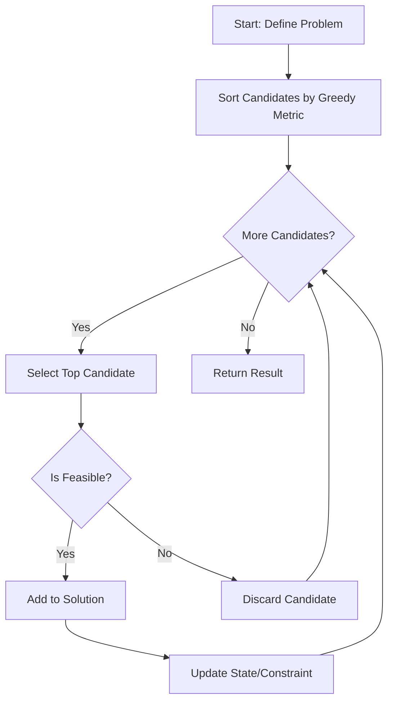

# Greedy Algorithms: Theory, Design, and Engineering

> A greedy algorithm is a paradigm that constructs a solution through a sequence of locally optimal choices, aiming to converge on a globally optimal solution by prioritizing immediate, tangible gains at each decision step.

## 1. Historical Background & Motivation

The formalization of greedy algorithms emerged as a cornerstone of combinatorial optimization during the 1950s. While mathematicians like Kruskal and Prim were developing methods to solve minimum spanning tree problems, researchers began to notice a pattern: for certain problems, the "myopic" choice—selecting the best option available *right now*—resulted in an optimal global structure. This was a radical departure from the nascent field of Dynamic Programming (DP), which required the exhaustive exploration of overlapping subproblems.

Historically, the study of greedy algorithms gained rigor through the work of Jack Edmonds on Matroid Theory in the 1960s, which provided the mathematical framework to identify exactly which problem structures are amenable to greedy strategies. In modern computing, the greedy paradigm is indispensable. In an era of massive datasets, the $O(n^2)$ or $O(n^3)$ complexity of DP is often unacceptable. Greedy algorithms, frequently operating in $O(n \log n)$ or $O(n)$ time, provide the performance necessary for real-time systems, network routing protocols (like OSPF using Dijkstra), and resource allocation in cloud computing environments. Understanding where to apply a greedy strategy vs. when to use a more robust exhaustive method is a hallmark of a senior software engineer.

## 2. Visual Intuition
:::demo
<div style="background:#1e1e1e;padding:16px;border-radius:10px;color:#e5e7eb;font-family:system-ui,sans-serif">
  <h3 style="margin:0 0 8px 0;color:#7dd3fc">Greedy Algorithms: Theory, Design, and Engineering - Concept Map</h3>
  <svg width="100%" height="280" viewBox="0 0 640 280" role="img" aria-label="Greedy Algorithms: Theory, Design, and Engineering visual intuition" style="background:#111827;border-radius:8px">
    <rect x="24" y="28" width="180" height="64" rx="10" fill="#1d4ed8" />
    <text x="114" y="66" text-anchor="middle" fill="#e5e7eb" font-size="14">Problem</text>
    <rect x="230" y="28" width="180" height="64" rx="10" fill="#0f766e" />
    <text x="320" y="66" text-anchor="middle" fill="#e5e7eb" font-size="14">Process</text>
    <rect x="436" y="28" width="180" height="64" rx="10" fill="#7c3aed" />
    <text x="526" y="66" text-anchor="middle" fill="#e5e7eb" font-size="14">Outcome</text>

    <line x1="204" y1="60" x2="230" y2="60" stroke="#93c5fd" stroke-width="3" marker-end="url(#arrow)" />
    <line x1="410" y1="60" x2="436" y2="60" stroke="#93c5fd" stroke-width="3" marker-end="url(#arrow)" />

    <rect x="24" y="130" width="592" height="120" rx="10" fill="#0b1220" stroke="#334155" />
    <text x="320" y="156" text-anchor="middle" fill="#cbd5e1" font-size="14">Key intuition for Greedy Algorithms: Theory, Design, and Engineering</text>
    <text x="320" y="182" text-anchor="middle" fill="#94a3b8" font-size="12">Track state changes, constraints, and final behavior.</text>
    <text x="320" y="206" text-anchor="middle" fill="#94a3b8" font-size="12">Use this as a mental model before formal proofs or code.</text>

    <defs>
      <marker id="arrow" markerWidth="10" markerHeight="10" refX="8" refY="3" orient="auto">
        <polygon points="0 0, 10 3, 0 6" fill="#93c5fd" />
      </marker>
    </defs>
  </svg>
  <p style="margin-top:10px;color:#cbd5e1">Interactive-ready visual scaffold for the topic.</p>
</div>
:::
*Caption: A visualization of the Activity Selection problem. The algorithm iterates through a sorted list of activities, always picking the task that finishes earliest, effectively "greedily" maximizing the time window available for subsequent tasks.*

## 3. Core Theory & Mathematical Foundations

The fundamental nature of a greedy algorithm lies in its reliance on the **Greedy Choice Property** and **Optimal Substructure**. A problem exhibits the greedy choice property if a global optimum can be reached by making a locally optimal choice. Optimal substructure means that an optimal solution to the problem contains within it the optimal solutions to subproblems.

### 3.1 The Greedy Choice Property
The greedy choice property asserts that we can arrive at a globally optimal solution by making a sequence of locally optimal choices. Suppose we have an optimization problem $P$. Let $S$ be the set of all feasible solutions. We define a greedy strategy $G$ such that at each step $k$, we select a choice $c_k$ from the set of available options $A_k$ that maximizes the local objective function $f(c_k)$. The property holds if the choice $c_k$ is contained in at least one global optimal solution $S^*$. 

### 3.2 Optimal Substructure
A problem has optimal substructure if an optimal solution to the problem can be constructed from optimal solutions to its subproblems. If we split a problem $P$ into subproblems $P_1, P_2, \dots, P_n$, the total cost $C(P)$ should be a function of the optimal costs $C(P_i)$. In the context of greedy algorithms, we often show this via an "exchange argument." We assume an optimal solution $O$ differs from our greedy solution $G$. We then demonstrate that we can transform $O$ into $G$ through a series of local swaps without decreasing the value of the objective function, proving that $G$ is also optimal.

### 3.3 Formal Analysis
Let $n$ be the number of choices. If each step involves selecting the maximum element from a set of size $k$ and updating the state, the complexity is $T(n) = \sum_{i=1}^n (\text{time to select} + \text{time to update})$. Using a priority queue (min-heap or max-heap), this becomes $O(n \log n)$. If the input is pre-sorted, we can often achieve $O(n)$. Correctness is usually proven by induction on the number of steps or by the aforementioned exchange argument.

## 4. Algorithm / Process (Step-by-Step)

1. **Define the Objective Function:** Identify the criteria for the "best" choice (e.g., earliest finish time, maximum weight, minimum cost).
2. **Sort/Prepare Data:** If necessary, sort the input based on the chosen criteria (e.g., sorting tasks by end time).
3. **Iterate and Select:** Initialize an empty set for the solution. Iterate through the sorted candidate list.
4. **Feasibility Check:** For each candidate, check if adding it to the current solution maintains feasibility (e.g., no overlapping intervals).
5. **Update State:** If feasible, include the candidate in the solution and update the state (e.g., update the end time of the last task).
6. **Terminate:** Stop when no more candidates can be added or the candidate list is exhausted.

## 5. Visual Diagram


*Caption: The generalized flow of a greedy algorithm. The "Greedy Metric" is the critical design choice.*

## 6. Implementation

### 6.1 Core Implementation: Activity Selection
```python
def activity_selection(activities):
    """
    Selects the maximum number of non-overlapping activities.
    Args: activities (list of tuples): (start_time, end_time)
    Returns: list of selected activities
    Complexity: O(n log n) due to sorting.
    """
    # Sort activities by end time (the core greedy choice)
    sorted_activities = sorted(activities, key=lambda x: x[1])
    
    selected = []
    last_end_time = -float('inf')
    
    for start, end in sorted_activities:
        # Feasibility check: current start >= last end
        if start >= last_end_time:
            selected.append((start, end))
            last_end_time = end
            
    return selected

# Example: [(1, 4), (3, 5), (0, 6), (5, 7), (8, 9), (5, 9)]
# Output: [(1, 4), (5, 7), (8, 9)]
```

### 6.2 Optimized Variant: Fractional Knapsack
```python
def fractional_knapsack(capacity, items):
    """
    Solves Knapsack problem where items can be taken in fractions.
    Args: capacity (float), items (list of tuples: (value, weight))
    Returns: float (max value)
    """
    # Sort by value/weight ratio descending
    items.sort(key=lambda x: x[0]/x[1], reverse=True)
    
    total_val = 0.0
    for val, weight in items:
        if capacity >= weight:
            capacity -= weight
            total_val += val
        else:
            total_val += val * (capacity / weight)
            break
    return total_val
```

### 6.3 Common Pitfalls
- **Greedy vs. DP:** Trying to apply a greedy approach to problems like 0/1 Knapsack, which requires DP due to the lack of the greedy choice property.
- **Sorting Criterion:** Selecting the wrong sorting key (e.g., sorting by start time instead of end time in activity selection).
- **Global vs. Local:** Assuming that a local greedy choice *always* leads to a global optimum without proving it.

## 7. Interactive Demo

:::demo
<!-- Activity Selection Interactive -->
<div style="padding: 20px; background: #1a1d23; border-radius: 8px;">
  <h3 id="status">Click 'Next' to Select Activity</h3>
  <div id="viz" style="height: 100px; display: flex; align-items: center; gap: 10px;"></div>
  <button onclick="nextStep()" style="padding: 10px 20px; cursor: pointer;">Next Step</button>
</div>
<script>
  const activities = [{s:1, e:4}, {s:3, e:5}, {s:0, e:6}, {s:5, e:7}, {s:8, e:9}];
  let index = 0; let lastEnd = -1;
  const viz = document.getElementById('viz');
  function nextStep() {
    if(index < activities.length) {
      const act = activities[index];
      if(act.s >= lastEnd) {
        viz.innerHTML += `<div style="border:1px solid #fff; padding:10px;">${act.s}-${act.e}</div>`;
        lastEnd = act.e;
      }
      index++;
    }
  }
</script>
:::

## 8. Worked Examples

### Example 1: Activity Selection
- **Input:** `(1,3), (2,5), (4,6), (6,7), (5,8), (8,9)`
- **Step 1 (Sort):** `(1,3), (2,5), (4,6), (6,7), (5,8), (8,9)` are sorted by end times: `(1,3), (2,5), (4,6), (6,7), (5,8), (8,9)`.
- **Step 2 (Iterate):** 
  - Pick `(1,3)`. End = 3.
  - Check `(2,5)`: $2 < 3$, skip.
  - Check `(4,6)`: $4 \ge 3$, pick. End = 6.
  - Check `(6,7)`: $6 \ge 6$, pick. End = 7.
  - Check `(5,8)`: $5 < 7$, skip.
  - Check `(8,9)`: $8 \ge 7$, pick. End = 9.
- **Result:** `(1,3), (4,6), (6,7), (8,9)`.

## 9. Comparison with Alternatives

| Approach | Time | Space | Pros | Cons |
|---|---|---|---|---|
| **Greedy** | $O(N \log N)$ | $O(N)$ | Fast, simple code | Fails on non-matroid problems |
| **DP** | $O(N \cdot W)$ | $O(N \cdot W)$ | Guaranteed optimal | High memory/time usage |
| **Backtracking**| $O(2^N)$ | $O(N)$ | Exhaustive search | Intractable for large N |

## 10. Industry Applications

- **OSPF (Open Shortest Path First)**: Uses Dijkstra's greedy algorithm for pathfinding.
- **Huffman Coding**: Uses a greedy approach with a min-priority queue to build optimal prefix trees for data compression (e.g., JPEG, ZIP).
- **Cloud Task Scheduling**: Kubernetes uses greedy heuristics to schedule pods based on resource availability (bin-packing variants).
- **Database Query Optimization**: Greedy algorithms select join orders to minimize the cost of intermediate result sets.

## 11. Practice Problems
1. **Easy: Lemonade Change**: Customers pay with $5, $10, $20. Ensure you provide change.
2. **Medium: Jump Game**: Determine if you can reach the last index in an array of jumps.
3. **Medium: Task Scheduler**: Find the minimum time to complete all tasks given cooldowns.
4. **Hard: Candy Distribution**: Distribute candies to children based on ratings with minimum cost.
5. **Hard: Minimum Number of Taps**: Cover a garden of length $L$ with the minimum number of taps.

## 12. Interactive Quiz
:::quiz
**Q1: Which property must a problem possess to be solved greedily?**
- A) Overlapping subproblems
- B) Greedy choice property
- C) Exponential complexity
- D) Recursive structure
> B — The greedy choice property ensures that local choices build global optima.

**Q2: Why does Dijkstra's not work with negative edge weights?**
- A) It's too slow
- B) It violates the greedy assumption that once a node is visited, its distance is final
- C) Negative numbers cause integer overflows
- D) It's actually fine
> B — Dijkstra assumes the path to a node only grows longer.

**Q3: Fractional Knapsack is solved in:**
- A) $O(2^n)$
- B) $O(n \log n)$
- C) $O(n^2)$
- D) $O(n)$
> B — Sorting by density takes $O(n \log n)$.

**Q4: Is 0/1 Knapsack solvable via simple greedy?**
- A) Yes
- B) No
- C) Only for small weights
- D) Only for integer values
> B — It lacks the optimal substructure required for a greedy choice to work; it requires DP.

**Q5: Huffman coding complexity?**
- A) $O(n \log n)$
- B) $O(n^2)$
- C) $O(n)$
- D) $O(2^n)$
> A — Building the heap takes linear time, extracting elements takes $n \log n$.
:::

## 13. Interview Preparation
- **Conceptual**: Define greedy as a "local-to-global optimization paradigm."
- **Complexity**: Always mention the sort cost.
- **Trade-offs**: "Greedy is for performance; DP is for precision."
- **Follow-up**: "What if the input is already sorted?" (Answer: complexity drops to $O(N)$).

## 14. Key Takeaways
1. Greedy algorithms are myopic.
2. Sorting is usually the bottleneck.
3. If it feels like it could be greedy, try to find a counter-example first.
4. Exchange arguments are the gold standard for proofs.
5. Practice identifying Matroid structures.

## 15. Common Misconceptions
- ❌ Greedy is always wrong for NP-Hard. ✅ Sometimes greedy provides a good approximation (e.g., Set Cover).
- ❌ All problems are solvable by greedy. ✅ Most aren't; always check for the greedy choice property.

## 16. Further Reading
- *Introduction to Algorithms (CLRS)*, Chapter 16.
- *Kleinberg & Tardos*, Chapter 4.
- *Matroid Theory*, by James Oxley.

## 17. Related Topics
- [[dynamic-programming]] — The antithesis/complement.
- [[amortized-analysis]] — Useful for analyzing greedy-related heaps.
- [[approximation-algorithms]] — Greedy is often used as a heuristic here.
