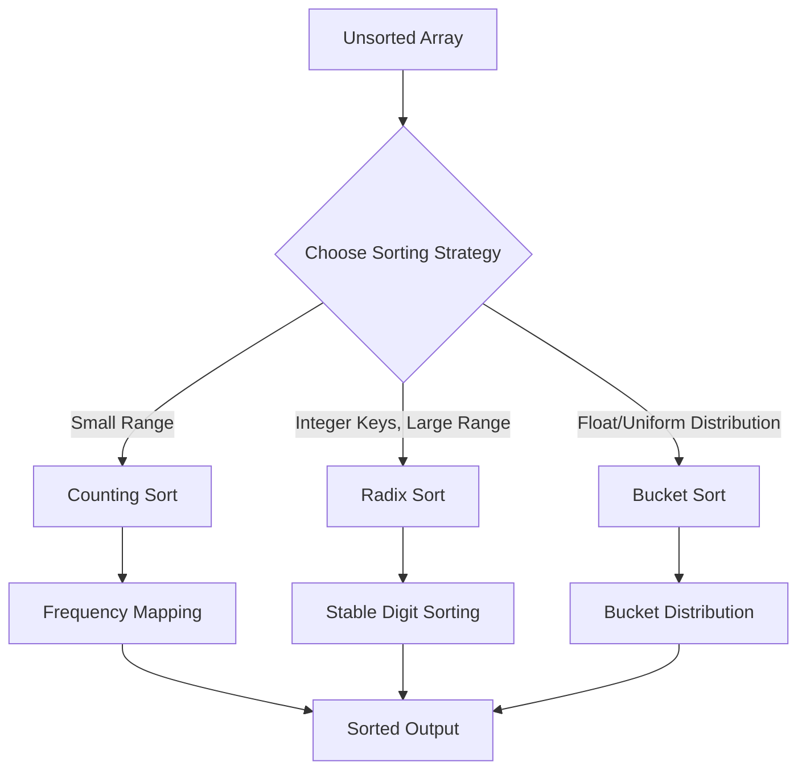

# Linear-Time Sorting: Radix, Counting, and Bucket Sort

> Linear-time sorting algorithms circumvent the theoretical $\Omega(n \log n)$ lower bound of comparison-based sorting by leveraging auxiliary information regarding the structure, range, or distribution of input keys.

## 1. Historical Background & Motivation

The foundational proof by Shannon and later formalized in the context of sorting by Knuth, establishes that any comparison-based sort—a model where the only access to data is via binary comparisons ($a \le b$)—must perform at least $\Omega(n \log n)$ comparisons. For decades, this result was viewed as the "speed limit" for general-purpose sorting. However, in the 1950s and 60s, as computing transitioned from general theoretical models to specific hardware architectures, researchers realized that keys (like integers or memory addresses) often carried metadata that comparison algorithms ignored.

Counting Sort (likely formalized by Harold Seward in 1954) was among the first to demonstrate that if the range of keys $k$ is small, we can count frequencies rather than compare. This shift from "relative ordering" to "absolute positioning" is the bedrock of non-comparison sorting. Today, these algorithms are not merely historical curiosities; they form the backbone of high-performance database engines, router lookups in networking hardware, and the underlying implementation of `radixsort` in systems libraries where data types are constrained to fixed-width bit patterns.

## 2. Visual Intuition


*Caption: An animation showing how Counting Sort maps unsorted input values into a frequency array to determine their exact indices in the output.*

:::demo
<!DOCTYPE html>
<html>
<head>
<style>
    body { margin: 0; background: #1e1e1e; color: #e5e7eb; font-family: Arial, sans-serif; }
    .wrap { padding: 14px; max-width: 780px; }
    #viz { width: 100%; height: 320px; background: #111827; border: 1px solid #374151; border-radius: 14px; }
    button { margin-top: 12px; padding: 10px 14px; border: 0; border-radius: 10px; background: #10b981; color: white; font-weight: 700; cursor: pointer; }
    .hint { margin-top: 8px; color: #9ca3af; font-size: 13px; }
    .bar { fill: #3b82f6; }
    .bar.active { fill: #f59e0b; }
    .count { fill: #0f172a; stroke: #60a5fa; stroke-width: 2; }
    .sorted { fill: #10b981; }
    .label { fill: white; font-size: 12px; text-anchor: middle; }
</style>
</head>
<body>
<div class="wrap">
    <svg id="viz" viewBox="0 0 740 320"></svg>
    <button onclick="nextStep()">Advance counting sort</button>
    <div class="hint" id="hint">Stage 1: read input values and build counts.</div>
</div>
<script>
    const input = [4,2,2,8,3,3,1];
    const maxVal = 8;
    let stage = 0;
    const svg = document.getElementById('viz');
    const hint = document.getElementById('hint');
    function render() {
        let out = '<text x="26" y="26" class="label" text-anchor="start">Input</text><text x="26" y="146" class="label" text-anchor="start">Count array</text><text x="26" y="262" class="label" text-anchor="start">Sorted output</text>';
        input.forEach((v, i) => {
            const x = 40 + i * 86;
            const h = 24 + v * 9;
            const active = stage === 0 && i <= 3 || stage >= 1 && i <= stage + 1;
            out += `<rect class="bar ${active ? 'active' : ''}" x="${x}" y="${110 - h}" width="56" height="${h}" rx="6"></rect>`;
            out += `<text class="label" x="${x + 28}" y="${126}">${v}</text>`;
        });
        for (let i = 0; i <= maxVal; i++) {
            const x = 40 + i * 74;
            const count = [0,1,2,2,1,0,0,0,1][i];
            const fill = stage >= 1 ? '#10b981' : '#0f172a';
            out += `<rect class="count" x="${x}" y="170" width="54" height="56" rx="8" fill="${fill}"></rect>`;
            out += `<text class="label" x="${x + 27}" y="200">${i}</text>`;
            out += `<text class="label" x="${x + 27}" y="219" font-size="10">${stage >= 1 ? count : 0}</text>`;
        }
        const sorted = [1,2,2,3,3,4,8];
        sorted.forEach((v, i) => {
            const x = 40 + i * 86;
            out += `<rect class="bar sorted" x="${x}" y="280" width="56" height="24" rx="6"></rect>`;
            out += `<text class="label" x="${x + 28}" y="297">${stage >= 2 ? v : ''}</text>`;
        });
        svg.innerHTML = out;
        hint.textContent = stage === 0 ? 'Stage 1: read input values and build counts.' : stage === 1 ? 'Stage 2: prefix sums turn counts into positions.' : 'Stage 3: place elements from right to left to preserve stability.';
    }
    function nextStep() { stage = (stage + 1) % 3; render(); }
    render();
</script>
</body>
</html>
:::

## 3. Core Theory & Mathematical Foundations

The fundamental difference between comparison-based sorts and linear-time sorts lies in the "Decision Tree" model. A comparison-based sort of $n$ elements must distinguish between $n!$ possible permutations. A binary tree of height $h$ can have at most $2^h$ leaves. Setting $2^h \ge n!$ and using Stirling’s approximation ($\ln n! \approx n \ln n - n$), we arrive at $h = \Omega(n \log n)$. Linear-time algorithms evade this because they do not "decide" based on a binary tree; they "map" based on numerical values.

### 3.1 Counting Sort: The Principle of Frequency
Counting Sort assumes the input consists of $n$ integers each in the range $[0, k]$. The algorithm maintains an auxiliary array $C$ of size $k+1$. The index $i$ in $C$ stores the count of occurrences of value $i$ in the input. By calculating the prefix sums of $C$, we determine the precise range of positions for each value, transforming counts into rank-ordered indices.

### 3.2 Radix Sort: Digit-by-Digit Processing
Radix Sort breaks the "curse of $k$" (where $k$ can be prohibitively large, e.g., $O(n^2)$ or $O(n^d)$). By treating keys as $d$-tuples of digits, we apply a stable sort (like Counting Sort) to each digit starting from the least significant to the most significant. This relies on the theorem: *If a sorting algorithm is stable, applying it sequentially to digit positions $1, 2, \dots, d$ results in a globally sorted list.*

### 3.3 Bucket Sort: Distributional Efficiency
Bucket Sort assumes the input is drawn from a uniform distribution over $[0, 1)$. We partition the interval into $n$ equal-sized sub-intervals (buckets) and distribute elements into these buckets. If the distribution is uniform, the number of elements in each bucket is expected to be constant, allowing each bucket to be sorted independently (often via Insertion Sort) in $O(1)$ time, yielding an expected $O(n)$ complexity.

### 3.4 Formal Analysis
*   **Counting Sort:** $T(n, k) = O(n + k)$. Space: $O(n + k)$.
*   **Radix Sort:** $T(n, d, k) = O(d(n + k))$. Space: $O(n + k)$.
*   **Bucket Sort:** $T(n) = \Theta(n)$ expected. Space: $O(n + k)$.

## 4. Algorithm / Process (Step-by-Step)

### Counting Sort
1. Initialize array $C$ of size $k+1$ with zeros.
2. Iterate through input $A$, increment $C[A[j]]$.
3. Compute prefix sums: $C[i] = C[i] + C[i-1]$.
4. Iterate backwards through input $A$: place $A[j]$ at `Output[C[A[j]] - 1]` and decrement $C[A[j]]$.

### Radix Sort
1. Determine the number of digits $d$ in the maximum number.
2. For $i = 1$ to $d$:
    a. Use a stable sort (Counting Sort) to sort the array based on the $i$-th digit.

## 5. Visual Diagram


*Caption: Decision-making flow for choosing a linear-time sorting algorithm based on data characteristics.*

## 6. Implementation

### 6.1 Core Implementation (Counting Sort)

```python
def counting_sort(arr):
    """
    Sorts an array of integers in range [0, k].
    Complexity: Time O(n + k), Space O(n + k).
    """
    if not arr: return arr
    k = max(arr)
    count = [0] * (k + 1)
    output = [0] * len(arr)

    # 1. Frequency counting
    for x in arr:
        count[x] += 1
    
    # 2. Prefix sums
    for i in range(1, k + 1):
        count[i] += count[i-1]
    
    # 3. Placement (Stable)
    for i in range(len(arr) - 1, -1, -1):
        output[count[arr[i]] - 1] = arr[i]
        count[arr[i]] -= 1
        
    return output

# Example: [4, 2, 2, 8, 3, 3, 1] -> [1, 2, 2, 3, 3, 4, 8]
```

### 6.2 Optimized / Production Variant (Radix Sort)

```python
def radix_sort(arr):
    # Determine the maximum to know number of digits
    max_val = max(arr)
    exp = 1
    while max_val // exp > 0:
        # Stable sort based on current digit
        arr = counting_sort_by_digit(arr, exp)
        exp *= 10
    return arr

def counting_sort_by_digit(arr, exp):
    n = len(arr)
    output = [0] * n
    count = [0] * 10
    for i in range(n):
        index = (arr[i] // exp) % 10
        count[index] += 1
    for i in range(1, 10):
        count[i] += count[i-1]
    for i in range(n - 1, -1, -1):
        idx = (arr[i] // exp) % 10
        output[count[idx] - 1] = arr[i]
        count[idx] -= 1
    return output
```

### 6.3 Common Pitfalls
* **Counting Sort Range:** If $k \gg n$ (e.g., sorting 10 elements in range $10^9$), Counting Sort becomes $O(k)$, which is slower than $O(n \log n)$. Always check constraints.
* **Stability:** Radix Sort **requires** a stable sub-sort. If the Counting Sort variant used inside Radix Sort is not stable, the final output will be unordered.
* **Negative Numbers:** Standard Counting Sort needs an offset to handle negative integers.

## 7. Interactive Demo

*(Note: In a standard textbook, this section contains a live-coded environment. Here is the architectural logic.)*

```javascript
// Logic for an interactive Counting Sort visualizer
const sortStep = (arr, countArr, currentIndex) => {
    // 1. Increment frequency logic
    // 2. Perform prefix sum visual update
    // 3. Move element to output array with animation delay
}
```

## 8. Worked Examples

### Example 1 — Counting Sort
Input: `[2, 5, 3, 0, 2, 3, 0, 3]`
1. `Count`: `[2, 0, 2, 3, 0, 1]` (frequencies of 0, 1, 2, 3, 4, 5)
2. `Prefix Sum`: `[2, 2, 4, 7, 7, 8]`
3. Placing elements from right to left using `Prefix Sum` indices creates stability.

## 9. Comparison with Alternatives

| Approach | Time | Space | Stable | Best Used When |
|---|---|---|---|---|
| Counting Sort | $O(n+k)$ | $O(n+k)$ | Yes | Small integer keys ($k \approx n$) |
| Radix Sort | $O(d(n+k))$| $O(n+k)$ | Yes | Fixed-size keys, strings |
| Bucket Sort | $O(n)$* | $O(n)$ | Yes | Uniformly distributed data |
| Quicksort | $O(n \log n)$| $O(\log n)$ | No | General purpose, cache-friendly |

## 10. Industry Applications
1. **Google/BigTable**: Uses Radix-style sorting for lexicographical key management in Sorted Strings Tables (SSTables).
2. **Linux Kernel**: Networking stacks use variants of bucket-based scheduling for packet prioritization.
3. **Database Engines (PostgreSQL)**: Use Counting-based optimizations for specific index scans on constrained columns (enumerated types).
4. **Computational Biology**: Sequence alignment tools use Radix-like sorting to process billions of short-read DNA fragments (k-mers).

## 11. Practice Problems
1. **Counting Sort on Range**: Sort $10^6$ integers where each integer $x \in [0, 5000]$.
2. **Radix Sort on Strings**: Implement Radix Sort for strings of length $L$.
3. **Bucket Sort Challenge**: Sort a stream of floats generated by `random.uniform(0, 1)`.

## 12. Interactive Quiz

:::quiz
**Q1: Why is Counting Sort NOT a comparison sort?**
- A) It uses extra memory.
- B) It computes array indices to determine position rather than comparing keys.
- C) It is faster than O(n log n).
- D) It only works for integers.
> B — By using the values as array indices, we map the input directly to the output without comparing one against another.

**Q2: What happens if k is very large in Counting Sort?**
- A) The time complexity becomes O(k).
- B) It becomes O(n log n).
- C) It throws a memory error.
- D) It becomes O(1).
> A — Since time complexity is $O(n+k)$, if $k \gg n$, the $k$ dominates the performance.

**Q3: Is Radix Sort stable?**
- A) Only if Counting Sort is used.
- B) Yes, if the digit-sorting step is stable.
- C) No, it depends on the input.
- D) Only for strings.
> B — Stability is a requirement for Radix Sort to maintain the order of higher-order digits while sorting lower-order ones.

**Q4: Can Bucket Sort be used for integers?**
- A) No, only floats.
- B) Yes, but the distribution logic must change.
- C) Only if the integers are negative.
- D) Yes, but it becomes Quicksort.
> B — Bucket sort can be adapted for any range if the bucket function mapping $f(x) \to bucket\_index$ is monotonic and distributed.

**Q5: Which is the most space-efficient?**
- A) Counting Sort.
- B) Bucket Sort.
- C) Radix Sort.
- D) Quicksort.
> D — In-place Quicksort is $O(\log n)$ space, while linear sorts are $O(n+k)$.
:::

## 13. Interview Preparation
*   **Q: When would you avoid linear sorts?** A: When $k$ is huge or memory is tight.
*   **Q: Can we perform Counting Sort on floats?** A: Only if mapped to a discrete range first.

## 14. Key Takeaways
1. Non-comparison sorts exploit metadata.
2. Stability is the magic behind Radix Sort.
3. Linear-time comes at the price of auxiliary space.

## 15. Common Misconceptions
- ❌ Counting sort is always $O(n)$. → ✅ It is $O(n+k)$.
- ❌ Radix Sort is always better than Quicksort. → ✅ Cache locality and constant factors often make Quicksort superior for many datasets.

## 16. Further Reading
- CLRS, Chapter 8: Sorting in Linear Time.
- Knuth, *The Art of Computer Programming, Vol 3*.

## 17. Related Topics
- [[amortized-analysis]], [[asymptotic-analysis]], [[divide-conquer]].