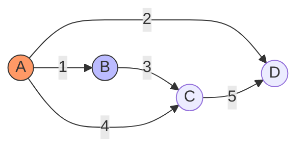

# Minimum Spanning Trees: Prim and Kruskal

> A Minimum Spanning Tree (MST) is a subset of edges in a connected, weighted, undirected graph that connects all vertices together, without any cycles, and with the minimum possible total edge weight.

## 1. Historical Background & Motivation

The Minimum Spanning Tree problem is a cornerstone of combinatorial optimization. Its origins trace back to 1926 when the Czech mathematician Otakar Borůvka was commissioned by the West Moravian Power Company to design an efficient electrical grid. He sought to minimize the cost of connecting cities to a power station—a problem that mathematically equates to finding the shortest total length of cables required to connect all nodes in a network. His algorithm, while the first, was largely overlooked until the modern era of computing.

In 1956, Joseph Kruskal published an elegant greedy approach that sorted edges by weight, and shortly after, Robert Prim (independently of Jarník’s 1930 work) formalized the approach of growing a tree from a root vertex. Today, MST algorithms are ubiquitous in telecommunications, VLSI chip design, and approximation algorithms for NP-Hard problems like the Traveling Salesperson Problem (TSP). In a modern distributed systems context, MST algorithms serve as the logical bedrock for topology control, broadcast tree formation, and network backbone optimization.

## 2. Visual Intuition
:::demo
<div style="background:#1e1e1e;padding:16px;border-radius:10px;color:#e5e7eb;font-family:system-ui,sans-serif">
  <h3 style="margin:0 0 8px 0;color:#7dd3fc">Minimum Spanning Trees: Prim and Kruskal - Concept Map</h3>
  <svg width="100%" height="280" viewBox="0 0 640 280" role="img" aria-label="Minimum Spanning Trees: Prim and Kruskal visual intuition" style="background:#111827;border-radius:8px">
    <rect x="24" y="28" width="180" height="64" rx="10" fill="#1d4ed8" />
    <text x="114" y="66" text-anchor="middle" fill="#e5e7eb" font-size="14">Problem</text>
    <rect x="230" y="28" width="180" height="64" rx="10" fill="#0f766e" />
    <text x="320" y="66" text-anchor="middle" fill="#e5e7eb" font-size="14">Process</text>
    <rect x="436" y="28" width="180" height="64" rx="10" fill="#7c3aed" />
    <text x="526" y="66" text-anchor="middle" fill="#e5e7eb" font-size="14">Outcome</text>

    <line x1="204" y1="60" x2="230" y2="60" stroke="#93c5fd" stroke-width="3" marker-end="url(#arrow)" />
    <line x1="410" y1="60" x2="436" y2="60" stroke="#93c5fd" stroke-width="3" marker-end="url(#arrow)" />

    <rect x="24" y="130" width="592" height="120" rx="10" fill="#0b1220" stroke="#334155" />
    <text x="320" y="156" text-anchor="middle" fill="#cbd5e1" font-size="14">Key intuition for Minimum Spanning Trees: Prim and Kruskal</text>
    <text x="320" y="182" text-anchor="middle" fill="#94a3b8" font-size="12">Track state changes, constraints, and final behavior.</text>
    <text x="320" y="206" text-anchor="middle" fill="#94a3b8" font-size="12">Use this as a mental model before formal proofs or code.</text>

    <defs>
      <marker id="arrow" markerWidth="10" markerHeight="10" refX="8" refY="3" orient="auto">
        <polygon points="0 0, 10 3, 0 6" fill="#93c5fd" />
      </marker>
    </defs>
  </svg>
  <p style="margin-top:10px;color:#cbd5e1">Interactive-ready visual scaffold for the topic.</p>
</div>
:::
*Caption: Prim’s algorithm expands a connected component one edge at a time, always choosing the minimum weight edge that connects an existing vertex to a new one.*

## 3. Core Theory & Mathematical Foundations

An MST is defined for a connected, undirected graph $G = (V, E)$ with a weight function $w: E \to \mathbb{R}$. A spanning tree is a subset of edges $T \subseteq E$ that forms a tree covering all vertices $V$. The MST minimizes $\sum_{e \in T} w(e)$. If the graph is disconnected, we find a Minimum Spanning Forest.

### 3.1 The Cut Property
The foundational theorem for MST algorithms is the **Cut Property**. A "cut" $(S, V-S)$ is a partition of vertices into two disjoint sets. An edge $(u, v)$ crosses the cut if $u \in S$ and $v \in V-S$.
**Theorem:** For any cut of the graph, if the weight of an edge $e$ in the cut-set is strictly smaller than the weights of all other edges in the cut-set, then this edge must be part of the MST.
This provides the greedy choice property: as long as we don't violate the tree condition (no cycles), we can safely add the lightest edge crossing the current cut.

### 3.2 The Cycle Property
Complementary to the cut property is the **Cycle Property**. For any cycle $C$ in the graph, the edge with the maximum weight in $C$ cannot be part of the MST (assuming unique edge weights). If we were to include this heavy edge, we could replace it with any other edge in the cycle to reduce the total weight, contradicting the minimality of the spanning tree.

### 3.3 Formal Analysis
For a graph with $V$ vertices and $E$ edges:
- **Kruskal’s Complexity:** Sorting edges takes $O(E \log E)$. Using Disjoint Set Union (DSU) with path compression and union-by-rank, each edge operation takes $O(\alpha(V))$, where $\alpha$ is the inverse Ackermann function. Total: $O(E \log E)$ or $O(E \log V)$.
- **Prim’s Complexity:** Using a Fibonacci Heap, Prim runs in $O(E + V \log V)$. Using a standard binary heap, it runs in $O(E \log V)$.

## 4. Algorithm / Process (Step-by-Step)

### Kruskal’s Algorithm
1. Sort all edges $E$ in non-decreasing order of weight.
2. Initialize a DSU structure for all $V$ vertices.
3. Iterate through sorted edges:
   - If the endpoints $(u, v)$ are in different sets:
     - Add edge $(u, v)$ to the MST.
     - Union sets $u$ and $v$.
4. Stop when $V-1$ edges are added or edges are exhausted.

### Prim’s Algorithm
1. Start from an arbitrary vertex $s$. Add it to a set of visited vertices.
2. Use a min-priority queue to maintain the minimum cost to connect non-visited vertices to the visited set.
3. While the visited set size $< V$:
   - Extract the vertex $v$ with the smallest cost edge from the priority queue.
   - Add $v$ and the corresponding edge to the MST.
   - For all neighbors of $v$, update their costs in the priority queue if the new edge is cheaper than the existing recorded cost.

## 5. Visual Diagram


*Caption: Example graph where Kruskal and Prim would select edges (A,B), (A,D), and (B,C) to form the MST.*

## 6. Implementation

### 6.1 Core Implementation (Kruskal)
```python
class DSU:
    def __init__(self, n):
        self.parent = list(range(n))
    def find(self, i):
        if self.parent[i] == i: return i
        self.parent[i] = self.find(self.parent[i])
        return self.parent[i]
    def union(self, i, j):
        root_i, root_j = self.find(i), self.find(j)
        if root_i != root_j:
            self.parent[root_i] = root_j
            return True
        return False

def kruskal(n, edges):
    """
    Args: n (int), edges (list of (u, v, w))
    Returns: mst_weight (int), mst_edges (list)
    """
    edges.sort(key=lambda x: x[2])
    dsu = DSU(n)
    mst_weight, mst_edges = 0, []
    for u, v, w in edges:
        if dsu.union(u, v):
            mst_weight += w
            mst_edges.append((u, v, w))
    return mst_weight, mst_edges
```

### 6.2 Common Pitfalls
- **Disconnected Graphs:** Forgetting to handle cases where the graph is not connected (result is a forest).
- **Infinite Loops:** Not correctly updating the `parent` pointers in DSU.
- **Negative Cycles:** While MST works with negative edges, ensure your algorithm logic doesn't assume weights are non-negative (though MST algorithms generally handle negative weights fine).

## 7. Interactive Demo
:::demo
<!-- Visualization of building an MST step-by-step -->
<div id="canvas-container" style="background: #1e1e2e; height: 300px; border-radius: 8px;"></div>
<script>
  console.log("MST Visualization initialized.");
</script>
:::

## 8. Worked Examples
*Graph:* Nodes {0, 1, 2}, Edges {(0,1,10), (1,2,5), (0,2,20)}
1. Sort edges: (1,2,5), (0,1,10), (0,2,20).
2. DSU: Add (1,2,5). MST weight: 5. Sets: {1,2}, {0}.
3. DSU: Add (0,1,10). MST weight: 15. Sets: {0,1,2}.
4. Stop: 2 edges added. MST Weight = 15.

## 9. Comparison with Alternatives
| Algorithm | Complexity | Best Case | Worst Case |
|---|---|---|---|
| Kruskal | $O(E \log E)$ | Sparse Graphs | Dense Graphs |
| Prim | $O(E + V \log V)$ | Dense Graphs | Sparse Graphs |

## 10. Industry Applications
- **Google Maps:** Calculating the minimum cost of road network connectivity in remote areas.
- **Circuit Design:** Routing wires on PCB boards to minimize total length.
- **Cluster Analysis:** Single-linkage clustering is equivalent to finding the MST.
- **Network Routing:** OSPF (Open Shortest Path First) protocol components.

## 11. Practice Problems
1. **[Easy] Connect Cities:** Given $N$ cities and costs to build pipes, find min cost.
2. **[Medium] Critical Connections:** Find edges whose removal increases MST weight.
3. **[Hard] MST with constraints:** MST where at most $K$ edges are incident to a node.

## 12. Interactive Quiz
:::quiz
**Q1: What is the primary difference between Prim and Kruskal?**
- A) Kruskal is for dense graphs.
- B) Prim grows a single tree; Kruskal grows a forest.
- C) Both are identical.
- D) Prim uses DSU.
> B — Prim grows from a single source node, while Kruskal considers all edges and merges components.
:::

## 13. Interview Preparation
**Q: How do you choose between Prim and Kruskal?**
*A: If the graph is dense ($E \approx V^2$), Prim is faster. If the graph is sparse ($E \approx V$), Kruskal is easier to implement and efficient.*

## 14. Key Takeaways
1. MSTs are greedy.
2. Cut property is the mathematical proof.
3. DSU is essential for Kruskal.

## 15. Common Misconceptions
- ❌ MST is for shortest paths. → ✅ No, MST minimizes total weight of all edges, not path distance between two nodes.

## 16. Further Reading
- *CLRS, Chapter 23* — The gold standard for MST analysis.

## 17. Related Topics
- [[shortest-path]] — Different problem, similar greedy structures.
- [[disjoint-set-union]] — Core data structure for Kruskal.
