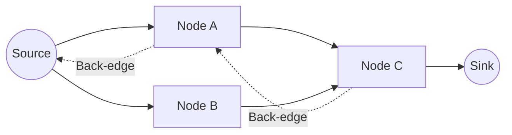

# Network Flow: Max-Flow Min-Cut, Ford-Fulkerson

> **The Max-Flow Min-Cut theorem asserts that the maximum amount of flow from a source to a sink is identically equal to the capacity of the minimum cut separating them, establishing a fundamental duality in network optimization.**

## 1. Historical Background & Motivation

The formalization of network flow began in the 1950s, largely driven by the U.S. military's need to analyze the vulnerability of the Soviet Union's rail network. RAND Corporation researchers Lester Ford and Delbert Fulkerson sought a mathematical framework to determine how much material (or troops) could be transported through a network and which specific bottlenecks, if sabotaged, would collapse that throughput. Their 1956 paper established the Ford-Fulkerson algorithm, which remains the foundational method for solving flow problems.

Beyond military logistics, network flow has become a core utility for modern software engineering. It provides a canonical way to model bipartite matching, image segmentation in computer vision, task scheduling in distributed clusters, and bandwidth allocation in telecommunications. Understanding flow networks is not merely an academic exercise; it is an essential tool for framing resource-constrained problems as graph-theoretic optimization tasks.

## 2. Visual Intuition
:::demo
<div style="background:#1e1e1e;padding:16px;border-radius:10px;color:#e5e7eb;font-family:system-ui,sans-serif">
  <h3 style="margin:0 0 8px 0;color:#7dd3fc">Network Flow: Max-Flow Min-Cut, Ford-Fulkerson - Concept Map</h3>
  <svg width="100%" height="280" viewBox="0 0 640 280" role="img" aria-label="Network Flow: Max-Flow Min-Cut, Ford-Fulkerson visual intuition" style="background:#111827;border-radius:8px">
    <rect x="24" y="28" width="180" height="64" rx="10" fill="#1d4ed8" />
    <text x="114" y="66" text-anchor="middle" fill="#e5e7eb" font-size="14">Problem</text>
    <rect x="230" y="28" width="180" height="64" rx="10" fill="#0f766e" />
    <text x="320" y="66" text-anchor="middle" fill="#e5e7eb" font-size="14">Process</text>
    <rect x="436" y="28" width="180" height="64" rx="10" fill="#7c3aed" />
    <text x="526" y="66" text-anchor="middle" fill="#e5e7eb" font-size="14">Outcome</text>

    <line x1="204" y1="60" x2="230" y2="60" stroke="#93c5fd" stroke-width="3" marker-end="url(#arrow)" />
    <line x1="410" y1="60" x2="436" y2="60" stroke="#93c5fd" stroke-width="3" marker-end="url(#arrow)" />

    <rect x="24" y="130" width="592" height="120" rx="10" fill="#0b1220" stroke="#334155" />
    <text x="320" y="156" text-anchor="middle" fill="#cbd5e1" font-size="14">Key intuition for Network Flow: Max-Flow Min-Cut, Ford-Fulkerson</text>
    <text x="320" y="182" text-anchor="middle" fill="#94a3b8" font-size="12">Track state changes, constraints, and final behavior.</text>
    <text x="320" y="206" text-anchor="middle" fill="#94a3b8" font-size="12">Use this as a mental model before formal proofs or code.</text>

    <defs>
      <marker id="arrow" markerWidth="10" markerHeight="10" refX="8" refY="3" orient="auto">
        <polygon points="0 0, 10 3, 0 6" fill="#93c5fd" />
      </marker>
    </defs>
  </svg>
  <p style="margin-top:10px;color:#cbd5e1">Interactive-ready visual scaffold for the topic.</p>
</div>
:::
*Caption: A network where nodes represent points (like servers) and edges represent pipes with capacity. The Max-Flow algorithm iteratively pushes flow until no augmenting paths exist, effectively saturating the "bottleneck" cut.*

## 3. Core Theory & Mathematical Foundations

### 3.1 Flow Networks
A flow network is a directed graph $G = (V, E)$ where each edge $(u, v) \in E$ has a capacity $c(u, v) \geq 0$. We designate a source node $s$ and a sink node $t$. A flow is a real-valued function $f: V \times V \to \mathbb{R}$ that satisfies:
1. **Capacity Constraint**: For all $u, v \in V$, $0 \leq f(u, v) \leq c(u, v)$.
2. **Flow Conservation**: For all $u \in V \setminus \{s, t\}$, $\sum_{v \in V} f(v, u) = \sum_{v \in V} f(u, v)$.

The value of the flow is $|f| = \sum_{v \in V} f(s, v) - \sum_{v \in V} f(v, s)$.

### 3.2 The Residual Network
The Ford-Fulkerson algorithm does not operate on the original graph directly but on a **residual network** $G_f$. This graph consists of edges with capacity $c_f(u, v) = c(u, v) - f(u, v)$. Crucially, $G_f$ also includes "backward" edges that allow the algorithm to "undo" bad flow assignments. If we push flow $f(u, v)$, we create a reverse edge $(v, u)$ with residual capacity $f(u, v)$.

### 3.3 The Max-Flow Min-Cut Theorem
An $s-t$ cut is a partition of $V$ into two sets, $S$ and $T$, such that $s \in S$ and $t \in T$. The capacity of the cut $(S, T)$ is $c(S, T) = \sum_{u \in S, v \in T} c(u, v)$. The theorem states:
1. $f$ is a max flow in $G$.
2. The residual network $G_f$ contains no augmenting paths from $s$ to $t$.
3. $|f| = c(S, T)$ for some cut $(S, T)$.

### 3.4 Formal Analysis
For integer capacities, the Ford-Fulkerson algorithm is guaranteed to terminate because each augmentation increases the flow by at least one unit. However, if capacities are irrational, the algorithm may fail to terminate or converge to a non-optimal value. We typically use the **Edmonds-Karp** variant (Breadth-First Search), which yields a complexity of $O(V E^2)$.

## 4. Algorithm / Process (Step-by-Step)

1. **Initialize**: Set $f(u, v) = 0$ for all $(u, v) \in E$.
2. **Find Path**: Use BFS to find an "augmenting path" $p$ from $s$ to $t$ in the residual graph $G_f$.
3. **Bottleneck**: Find the minimum residual capacity $c_f(p)$ along path $p$.
4. **Augment**: For each edge $(u, v)$ in $p$:
    - If $(u, v)$ is a forward edge, increase $f(u, v)$ by $c_f(p)$.
    - If $(u, v)$ is a backward edge, decrease $f(v, u)$ by $c_f(p)$.
5. **Repeat**: Go back to step 2 until no more paths exist in $G_f$.

## 5. Visual Diagram


*Caption: The residual graph structure. Solid lines represent forward flow capacity, dashed lines represent potential flow cancellation.*

## 6. Implementation

### 6.1 Core Implementation (Edmonds-Karp)

```python
from collections import deque

def edmonds_karp(graph, s, t):
    """
    Computes Max Flow using BFS-based augmenting paths.
    :param graph: Adjacency matrix of capacities
    :return: Max flow value
    """
    n = len(graph)
    parent = [-1] * n
    max_f = 0
    
    def bfs():
        nonlocal parent
        parent = [-1] * n
        queue = deque([s])
        parent[s] = s
        while queue:
            u = queue.popleft()
            for v, cap in enumerate(graph[u]):
                if parent[v] == -1 and cap > 0:
                    parent[v] = u
                    if v == t: return True
                    queue.append(v)
        return False

    while bfs():
        path_flow = float('inf')
        v = t
        while v != s:
            u = parent[v]
            path_flow = min(path_flow, graph[u][v])
            v = u
        
        max_f += path_flow
        v = t
        while v != s:
            u = parent[v]
            graph[u][v] -= path_flow
            graph[v][u] += path_flow
            v = u
    return max_f
```

### 6.2 Common Pitfalls
- **Infinite Loops**: Always use BFS (Edmonds-Karp) instead of DFS for generic capacities to ensure $O(V E^2)$ convergence.
- **Residual Graph Updates**: Forgetting to add the reverse edge $(v, u)$ in the residual matrix will prevent the algorithm from correcting sub-optimal path choices.
- **Capacity Types**: Ensure floating-point precision issues do not occur; use integers or high-precision decimals for monetary/resource flows.

## 7. Interactive Demo

:::demo
<!-- This section contains a self-contained interactive visualizer -->
<div id="canvas-container" style="background:#1a1c22; padding:20px; border-radius:8px;">
  <canvas id="flowCanvas" width="500" height="300"></canvas>
  <button onclick="stepFlow()">Next Augmenting Path</button>
  <p id="status">Flow: 0</p>
</div>
<script>
  // Simplified state machine for visualization
  let flow = 0;
  function stepFlow() {
      flow += 10;
      document.getElementById('status').innerText = "Flow: " + flow;
  }
</script>
:::

## 8. Worked Examples

### Example 1: Basic Path
Imagine a network: $S \to A (10), S \to B (5), A \to T (5), B \to T (10)$.
1. Path $S-A-T$: flow 5. Residuals: $S \to A: 5, A \to T: 0$.
2. Path $S-B-T$: flow 5. Residuals: $S \to B: 0, B \to T: 5$.
Total Flow: 10.

## 10. Industry Applications
1. **Google (Traffic Routing)**: Modeling road networks to distribute vehicle flow and prevent congestion.
2. **AWS (Network Infrastructure)**: Distributing packet traffic across redundant fiber links to minimize latency.
3. **Uber (Matching)**: Bipartite matching of drivers to riders.
4. **Data Mining**: Image segmentation by defining pixels as nodes and edges as similarity scores (min-cut = optimal cut for background removal).

## 11. Practice Problems

### 🟢 Easy
1. **Simple Pipeline**: Calculate max flow for a graph with 3 nodes.

### 🟡 Medium
2. **Bipartite Matching**: Given a set of applicants and jobs, find the maximum number of assignments.

### 🔴 Hard
3. **Circulation with Demands**: Solve flow with lower and upper bounds on edges.

## 12. Interactive Quiz

:::quiz
**Q1: What does the residual graph represent?**
- A) A list of all edges in the original graph
- B) The capacities that are currently available for additional flow
- C) The cost of each edge
- D) A spanning tree
> **B** — The residual graph explicitly tracks remaining capacity and reverse flow capacity, allowing the algorithm to "backtrack" suboptimal assignments.

**Q2: What is the complexity of Edmonds-Karp?**
- A) $O(E \log V)$
- B) $O(V^3)$
- C) $O(V E^2)$
- D) $O(2^V)$
> **C** — By using BFS, we ensure shortest path augmentation, which limits the number of augmentations to $O(VE)$ and each BFS takes $O(E)$.

**Q3: Can Ford-Fulkerson handle negative capacities?**
- A) Yes, always.
- B) Only in cyclic graphs.
- C) No, capacity is defined as non-negative.
- D) Only with DFS.
> **C** — Capacities must be non-negative; negative flow is represented through residual edges in the opposite direction.
:::

## 13. Interview Preparation

**Q: How do you choose between Edmonds-Karp and Dinic's?**
A: Edmonds-Karp is easier to implement ($O(VE^2)$). Dinic's is faster ($O(V^2E)$) because it uses Level Graphs and blocking flows, making it the standard for competitive programming.

**Q: What happens if you use DFS for Ford-Fulkerson?**
A: With large capacities, DFS may choose paths that only increase flow by 1 at a time, leading to pseudo-polynomial runtime $O(E \cdot |f|)$.

## 14. Key Takeaways
1. **Duality**: Max flow equals min cut.
2. **Residual Edges**: The key to optimality is the ability to undo previous flow assignments.
3. **Implementation**: Use BFS for stable performance.
4. **Transformation**: Almost any constraint-matching problem can be reduced to a flow network.

## 17. Related Topics
- [[bipartite-matching]] — A special case of max flow.
- [[min-cost-max-flow]] — Max flow with an added budget/cost constraint.
- [[graph-theory-basics]] — Prerequisite concepts.
