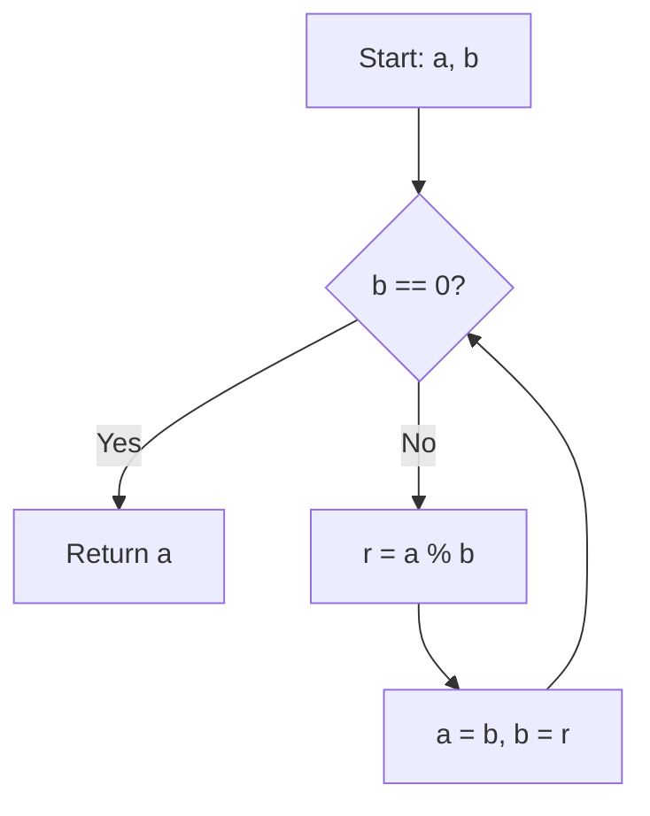

# Number Theory and Cryptographic Algorithms: GCD, Modular Exponentiation

> **Number theory algorithms provide the fundamental computational primitives that enable secure digital identity and efficient arithmetic on numbers far exceeding the capacity of standard hardware registers.**

## 1. Historical Background & Motivation
The study of number theory, once described by G.H. Hardy as the "purest" form of mathematics with no possible practical application, has become the bedrock of the information age. The Euclidean algorithm, documented by Euclid in his *Elements* (c. 300 BC), is arguably the oldest non-trivial algorithm still in widespread use. It provides an efficient method to find the greatest common divisor of two integers, a problem that naturally arises when trying to reduce fractions or solve linear Diophantine equations.

In the modern context, these algorithms are no longer just for mathematicians. With the advent of the RSA cryptosystem in 1977, modular exponentiation became the bottleneck that determines the speed of secure web communication (HTTPS/TLS). Modern digital infrastructure relies on the difficulty of the integer factorization problem, which in turn relies on the ability to perform modular exponentiation efficiently. For a software engineer, understanding these algorithms is the difference between writing code that crashes on large inputs and code that secures global transactions.

## 2. Visual Intuition
:::demo
<div style="background:#1e1e1e;padding:16px;border-radius:10px;color:#e5e7eb;font-family:system-ui,sans-serif">
  <h3 style="margin:0 0 8px 0;color:#7dd3fc">Number Theory and Cryptographic Algorithms: GCD, Modular Exponentiation - Concept Map</h3>
  <svg width="100%" height="280" viewBox="0 0 640 280" role="img" aria-label="Number Theory and Cryptographic Algorithms: GCD, Modular Exponentiation visual intuition" style="background:#111827;border-radius:8px">
    <rect x="24" y="28" width="180" height="64" rx="10" fill="#1d4ed8" />
    <text x="114" y="66" text-anchor="middle" fill="#e5e7eb" font-size="14">Problem</text>
    <rect x="230" y="28" width="180" height="64" rx="10" fill="#0f766e" />
    <text x="320" y="66" text-anchor="middle" fill="#e5e7eb" font-size="14">Process</text>
    <rect x="436" y="28" width="180" height="64" rx="10" fill="#7c3aed" />
    <text x="526" y="66" text-anchor="middle" fill="#e5e7eb" font-size="14">Outcome</text>

    <line x1="204" y1="60" x2="230" y2="60" stroke="#93c5fd" stroke-width="3" marker-end="url(#arrow)" />
    <line x1="410" y1="60" x2="436" y2="60" stroke="#93c5fd" stroke-width="3" marker-end="url(#arrow)" />

    <rect x="24" y="130" width="592" height="120" rx="10" fill="#0b1220" stroke="#334155" />
    <text x="320" y="156" text-anchor="middle" fill="#cbd5e1" font-size="14">Key intuition for Number Theory and Cryptographic Algorithms: GCD, Modular Exponentiation</text>
    <text x="320" y="182" text-anchor="middle" fill="#94a3b8" font-size="12">Track state changes, constraints, and final behavior.</text>
    <text x="320" y="206" text-anchor="middle" fill="#94a3b8" font-size="12">Use this as a mental model before formal proofs or code.</text>

    <defs>
      <marker id="arrow" markerWidth="10" markerHeight="10" refX="8" refY="3" orient="auto">
        <polygon points="0 0, 10 3, 0 6" fill="#93c5fd" />
      </marker>
    </defs>
  </svg>
  <p style="margin-top:10px;color:#cbd5e1">Interactive-ready visual scaffold for the topic.</p>
</div>
:::
*Caption: The Euclidean algorithm is essentially a process of tiling a rectangle of size $a 	imes b$ with the largest possible square, then repeating the process on the remainder until no remainder exists.*

## 3. Core Theory & Mathematical Foundations
Number theory algorithms operate in the domain of modular arithmetic, where we perform calculations within a finite set $\{0, 1, \dots, n-1\}$.

### 3.1 The Euclidean Algorithm
The GCD of two integers $a$ and $b$ is the largest integer $d$ such that $d|a$ and $d|b$. The algorithm relies on the theorem: 
$$\gcd(a, b) = \gcd(b, a \pmod b)$$
This identity holds because any common divisor of $a$ and $b$ must also divide $a - kb$ for any integer $k$. By recursively applying this, we reduce the problem size until $b=0$, at which point $\gcd(a, 0) = a$.

### 3.2 Extended Euclidean Algorithm (EEA)
Beyond finding the GCD, we often need to find integers $x$ and $y$ such that:
$$ax + by = \gcd(a, b)$$
This is known as Bézout's identity. The EEA computes these coefficients during the recursive steps of the standard GCD algorithm, which is critical for finding modular multiplicative inverses.

### 3.3 Modular Exponentiation
Computing $a^n \pmod m$ naively is $O(n)$, which is infeasible for cryptography where $n$ is a 2048-bit prime. We use "exponentiation by squaring," which relies on the property:
$$a^n \pmod m = \begin{cases} (a^{n/2})^2 \pmod m & \text{if } n \text{ is even} \\ a \cdot (a^{n-1}) \pmod m & \text{if } n \text{ is odd} \end{cases}$$
This reduces the number of operations to $O(\log n)$.

### 3.4 Modular Multiplicative Inverse
An integer $a$ has a modular inverse $a^{-1} \pmod m$ if and only if $\gcd(a, m) = 1$. The inverse satisfies $a \cdot a^{-1} \equiv 1 \pmod m$. This is computed using the EEA result: since $ax + my = 1$, then $ax \equiv 1 \pmod m$, meaning $x$ is the inverse.

### 3.5 Formal Analysis
The time complexity of the Euclidean algorithm is $O(\log(\min(a, b)))$. Lamé's Theorem proves that the number of steps required is at most 5 times the number of digits in the smaller number. Modular exponentiation complexity is $O(\log n \cdot M(\log m))$, where $M(k)$ is the cost of multiplying two $k$-bit numbers.

## 4. Algorithm / Process (Step-by-Step)
**Euclidean Algorithm:**
1. Given $a, b$. If $b = 0$, return $a$.
2. Otherwise, calculate $r = a \pmod b$.
3. Replace $(a, b)$ with $(b, r)$.
4. Repeat from step 1.

**Modular Exponentiation:**
1. Initialize `result = 1`, `base = base % mod`.
2. While `exp > 0`:
   - If `exp` is odd, `result = (result * base) % mod`.
   - `base = (base * base) % mod`.
   - `exp = exp // 2`.
3. Return `result`.

## 5. Visual Diagram

*Caption: The flow of the recursive GCD algorithm showing state transitions.*

## 6. Implementation

### 6.1 Core Implementation
```python
def gcd(a: int, b: int) -> int:
    """Computes greatest common divisor using Euclidean algorithm."""
    while b:
        a, b = b, a % b
    return a

def mod_pow(base: int, exp: int, mod: int) -> int:
    """Computes (base^exp) % mod using binary exponentiation."""
    res = 1
    base %= mod
    while exp > 0:
        if exp % 2 == 1:
            res = (res * base) % mod
        base = (base * base) % mod
        exp //= 2
    return res

# Example usage:
# gcd(48, 18) -> 6
# mod_pow(2, 10, 1000) -> 24
```

### 6.2 Optimized / Production Variant
In high-security contexts, constant-time arithmetic is required to prevent side-channel attacks (timing attacks). Using Python's `pow(a, b, m)` is preferred as it is implemented in C and optimized for arbitrary-precision arithmetic.

### 6.3 Common Pitfalls
- **Negative Inputs:** Python's `%` operator handles negatives differently than C++ (e.g., `-5 % 3` is `1` in Python, `-2` in C++). Always normalize inputs.
- **Overflow:** Even with Python's arbitrary precision, memory limits can be hit if intermediate calculations are gargantuan.
- **Complexity Neglect:** Implementing exponentiation as $O(n)$ will cause a timeout on competitive platforms (e.g., when $n = 10^{18}$).

## 7. Interactive Demo
:::demo
<!-- Interactive GCD Tool -->
<div id="gcd-app" style="background:#1a1d23; padding:20px; border-radius:8px;">
  <input id="inA" type="number" value="252" style="width:60px;">
  <input id="inB" type="number" value="105" style="width:60px;">
  <button onclick="calc()">Run GCD</button>
  <div id="steps" style="margin-top:15px; font-family:monospace;"></div>
</div>
<script>
function calc() {
  let a = parseInt(document.getElementById('inA').value);
  let b = parseInt(document.getElementById('inB').value);
  let steps = document.getElementById('steps');
  steps.innerHTML = "";
  while(b) {
    steps.innerHTML += `gcd(${a}, ${b}) -> ${a} % ${b} = ${a % b}<br>`;
    [a, b] = [b, a % b];
  }
  steps.innerHTML += `Final GCD: ${a}`;
}
</script>
:::

## 8. Worked Examples
### Example 1: GCD(270, 192)
1. 270 = 1 * 192 + 78
2. 192 = 2 * 78 + 36
3. 78 = 2 * 36 + 6
4. 36 = 6 * 6 + 0
Result: 6.

## 9. Comparison with Alternatives
| Approach | Time Complexity | Space |
|---|---|---|
| Naive GCD (Iterate) | $O(\min(a, b))$ | $O(1)$ |
| Euclidean | $O(\log(\min(a,b)))$ | $O(1)$ |
| Binary Exponentiation | $O(\log n)$ | $O(1)$ |

## 10. Industry Applications
- **RSA Encryption (OpenSSL)**: Uses modular exponentiation for private key signing.
- **Blockchain (Ethereum/Bitcoin)**: ECDSA (Elliptic Curve Digital Signature Algorithm) uses modular inverse in base fields.
- **Distributed Systems**: Chord DHT uses consistent hashing, which relies on modular arithmetic.
- **Compilers**: Constant folding optimizations often perform GCD calculations at compile time.

## 11. Practice Problems
1. **GCD Sum**: Given $N$, calculate $\sum \gcd(i, N)$ for $1 \le i \le N$.
2. **Modular Inverse**: Find $x$ such that $ax \equiv 1 \pmod m$.
3. **Large Power**: Calculate $a^b \pmod{10^9+7}$ for $b$ up to $10^{18}$.

## 12. Interactive Quiz
:::quiz
**Q1: What is the complexity of the Euclidean algorithm?**
- A) $O(N)$
- B) $O(N \log N)$
- C) $O(\log(\min(a, b)))$
- D) $O(\sqrt{N})$
> C — The number of digits decreases significantly in each iteration.

**Q2: What is $5^{-1} \pmod 7$?**
- A) 2
- B) 3
- C) 5
- D) 6
> B — Because $5 \times 3 = 15 \equiv 1 \pmod 7$.

**Q3: Which theorem ensures modular inverse exists?**
- A) Fermat's Little Theorem
- B) Fundamental Theorem of Arithmetic
- C) Bézout's Identity
- D) Chinese Remainder Theorem
> C — Bézout's identity states $ax + by = \gcd(a, b)$; if $\gcd=1$, then $ax \equiv 1 \pmod b$.
:::

## 13. Interview Preparation
**Q: How do you handle $a^b \pmod m$ if $b$ is extremely large?**
*A: Use Binary Exponentiation. Even if $b$ has $10^{100}$ digits, we work with the bit representation.*

**Q: Why does standard `pow(a, b) % m` fail in competitive programming?**
*A: Integer overflow before the modulo operation occurs.*

## 14. Key Takeaways
1. Euclidean algorithm is $O(\log N)$.
2. Always use `pow(a, b, m)` in Python.
3. $\gcd(a, b)$ is essential for inverses.

## 15. Common Misconceptions
- ❌ Modulo is always positive in all languages. → ✅ It can be negative in C++/Java.
- ❌ Exponentiation is linear. → ✅ It is logarithmic.

## 16. Further Reading
- *CLRS, Chapter 31: Number-Theoretic Algorithms.*
- *Knuth, The Art of Computer Programming, Vol 2.*

## 17. Related Topics
- [[prime-factorization]]
- [[modular-arithmetic]]
- [[public-key-cryptography]]
