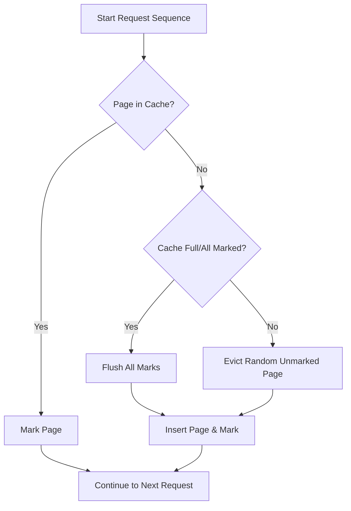

# Online Algorithms and Competitive Analysis

> An online algorithm is a computational procedure that processes input incrementally, making irreversible decisions without knowledge of future arrivals, evaluated by the ratio of its performance to an optimal clairvoyant offline algorithm.

## 1. Historical Background & Motivation

The formalization of online algorithms emerged in the late 1980s and early 1990s, driven by the need to model systems where data arrives in a stream rather than as a static batch. Seminal work by Sleator and Tarjan (1985) on the $k$-server problem and caching established the framework of **competitive analysis**. Before this era, algorithm analysis was dominated by the worst-case and average-case analysis of offline algorithms. However, these models failed to capture the constraints faced by operating systems managing memory, routers handling packets, or schedulers managing real-time tasks.

In modern systems, the "offline" assumption is often a luxury. Cloud-native databases, high-frequency trading platforms, and streaming processors must commit to resource allocations (e.g., page swaps, thread spawning, or cache evictions) before the full request sequence is known. The field of online algorithms provides a mathematical rigorousness to "making the best of a bad situation." By comparing the online learner to a hypothetical "optimal adversary" that knows the future, we define a competitive ratio that serves as a performance guarantee, allowing engineers to bound how much "regret" they incur due to lack of foresight.

## 2. Visual Intuition
:::demo
<div style="background:#1e1e1e;padding:16px;border-radius:10px;color:#e5e7eb;font-family:system-ui,sans-serif">
  <h3 style="margin:0 0 8px 0;color:#7dd3fc">Online Algorithms and Competitive Analysis - Concept Map</h3>
  <svg width="100%" height="280" viewBox="0 0 640 280" role="img" aria-label="Online Algorithms and Competitive Analysis visual intuition" style="background:#111827;border-radius:8px">
    <rect x="24" y="28" width="180" height="64" rx="10" fill="#1d4ed8" />
    <text x="114" y="66" text-anchor="middle" fill="#e5e7eb" font-size="14">Problem</text>
    <rect x="230" y="28" width="180" height="64" rx="10" fill="#0f766e" />
    <text x="320" y="66" text-anchor="middle" fill="#e5e7eb" font-size="14">Process</text>
    <rect x="436" y="28" width="180" height="64" rx="10" fill="#7c3aed" />
    <text x="526" y="66" text-anchor="middle" fill="#e5e7eb" font-size="14">Outcome</text>

    <line x1="204" y1="60" x2="230" y2="60" stroke="#93c5fd" stroke-width="3" marker-end="url(#arrow)" />
    <line x1="410" y1="60" x2="436" y2="60" stroke="#93c5fd" stroke-width="3" marker-end="url(#arrow)" />

    <rect x="24" y="130" width="592" height="120" rx="10" fill="#0b1220" stroke="#334155" />
    <text x="320" y="156" text-anchor="middle" fill="#cbd5e1" font-size="14">Key intuition for Online Algorithms and Competitive Analysis</text>
    <text x="320" y="182" text-anchor="middle" fill="#94a3b8" font-size="12">Track state changes, constraints, and final behavior.</text>
    <text x="320" y="206" text-anchor="middle" fill="#94a3b8" font-size="12">Use this as a mental model before formal proofs or code.</text>

    <defs>
      <marker id="arrow" markerWidth="10" markerHeight="10" refX="8" refY="3" orient="auto">
        <polygon points="0 0, 10 3, 0 6" fill="#93c5fd" />
      </marker>
    </defs>
  </svg>
  <p style="margin-top:10px;color:#cbd5e1">Interactive-ready visual scaffold for the topic.</p>
</div>
:::
*Caption: A comparison between a greedy LRU (Least Recently Used) online algorithm and an optimal offline algorithm (which knows exactly which item to discard based on the full sequence).*

## 3. Core Theory & Mathematical Foundations

### 3.1 The Adversarial Model
We define an online problem via a request sequence $\sigma = (\sigma_1, \sigma_2, \dots, \sigma_n)$. The algorithm $A$ must produce a sequence of outputs $y = (y_1, y_2, \dots, y_n)$. The cost incurred at step $i$ is $c_i(A(\sigma_1, \dots, \sigma_i), \sigma_i)$. The total cost is $C_A(\sigma) = \sum_{i=1}^n c_i$. 

We compare $A$ to an optimal offline algorithm $OPT$. $OPT$ knows the entire sequence $\sigma$ in advance and achieves the minimum possible cost: $OPT(\sigma) = \min_{A'} C_{A'}(\sigma)$.

### 3.2 Competitive Ratio
An algorithm $A$ is said to be $c$-competitive if there exists a constant $\alpha$ such that for all sequences $\sigma$:
$$C_A(\sigma) \le c \cdot C_{OPT}(\sigma) + \alpha$$
The competitive ratio $c$ measures the "performance gap" between the online algorithm and the best-possible clairvoyant strategy. If $\alpha$ is independent of the sequence length $n$, the algorithm is strictly competitive.

### 3.3 Randomized Online Algorithms
Often, deterministic online algorithms have a lower bound on their competitive ratio (e.g., $k$ for the paging problem). By allowing $A$ to use random bits, we can often achieve a better competitive ratio. In the randomized setting, we compare $E[C_A(\sigma)]$ against $OPT(\sigma)$. This shifts the adversary from a "simple" adversary to an "oblivious" adversary (who chooses $\sigma$ without knowing $A$'s random coins) or an "adaptive" adversary.

### 3.4 Formal Analysis: The Paging Problem
The Paging Problem involves a cache of size $k$ and a sequence of memory references.
- **Deterministic Lower Bound:** Any deterministic paging algorithm is at least $k$-competitive.
- **LRU (Least Recently Used):** LRU is exactly $k$-competitive.
- **Randomized Marker Algorithm:** Using randomized eviction, we can achieve $O(\log k)$-competitiveness, which is asymptotically superior to any deterministic algorithm.

## 4. Algorithm / Process (Step-by-Step)

The **Marking Algorithm** for the Paging Problem:
1. **Initialize:** All $k$ slots in the cache are empty.
2. **Phase Definition:** A phase consists of a sequence of requests containing exactly $k$ distinct pages.
3. **Marking:** When a page is requested:
   - If in cache: Mark it.
   - If not in cache (miss): 
     - If all $k$ slots are marked, unmark all and start a new phase.
     - Evict an *unmarked* page at random and replace it with the requested page.
     - Mark the new page.

## 5. Visual Diagram


*Caption: The logic flow of a randomized marking algorithm for paging.*

## 6. Implementation

### 6.1 Core Implementation (LRU Cache)
```python
from collections import OrderedDict

class LRUCache:
    """
    An online paging algorithm implementing Least Recently Used (LRU) policy.
    Complexity: O(1) time for get/put, O(k) space.
    """
    def __init__(self, capacity: int):
        self.cache = OrderedDict()
        self.capacity = capacity

    def access(self, page: int) -> bool:
        """Returns True if hit, False if miss."""
        if page in self.cache:
            self.cache.move_to_end(page)
            return True
        if len(self.cache) >= self.capacity:
            self.cache.popitem(last=False)
        self.cache[page] = True
        return False
```

### 6.2 Optimized / Production Variant
In high-concurrency production systems, we replace the `OrderedDict` with a custom doubly-linked list combined with a hash map to avoid the overhead of Python's built-in container methods.

### 6.3 Common Pitfalls
- **Ignoring $\alpha$:** Don't forget the additive constant; many algorithms have $C_A \le c \cdot C_{OPT} + \alpha$ where $\alpha$ matters for small inputs.
- **The "Lookahead" Trap:** It is tempting to write code that buffers inputs. This is no longer an online algorithm—this is a "delayed decision" problem.
- **Worst-case vs. Average:** Competitive analysis is always about the *worst-case* request sequence.

## 7. Interactive Demo

:::demo
<!-- This is a simulated environment showing Cache State -->
<div id="app">
  <h3>Paging Simulator</h3>
  <div id="cache-display">Cache: []</div>
  <button onclick="accessPage()">Access Random Page</button>
  <script>
    let cache = [];
    const CAPACITY = 3;
    function accessPage() {
      let page = Math.floor(Math.random() * 5);
      if(!cache.includes(page)) {
        if(cache.length >= CAPACITY) cache.shift();
        cache.push(page);
      }
      document.getElementById('cache-display').innerText = "Cache: " + JSON.stringify(cache);
    }
  </script>
</div>
:::

## 8. Worked Examples

### Example 1: The Ski Rental Problem
You are deciding whether to buy skis ($B=100$) or rent ($R=10$). You don't know how many days you will ski.
- **Algorithm:** Rent for 9 days, buy on day 10.
- **Analysis:** If you ski 9 days, you pay 90. If you ski 100 days, you pay 90 + 100 = 190.
- **Ratio:** The competitive ratio is $2 - 1/B$, which is the best possible for this problem.

## 9. Comparison with Alternatives
| Approach | Time | Space | Pros | Cons |
|---|---|---|---|---|
| LRU | O(1) | O(k) | Simple | $k$-competitive |
| FIFO | O(1) | O(k) | Trivial | $k$-competitive |
| Marking | O(1) | O(k) | $O(\log k)$ randomized | Probabilistic |

## 10. Industry Applications
- **Google Search:** Page caching and snippet ranking.
- **AWS ElastiCache:** LRU/LFU policies for memory management.
- **Linux Kernel:** Page replacement algorithms (Modified Clock/LRU-lists).
- **High-Frequency Trading:** Order matching algorithms.

## 11. Practice Problems
1. **Easy:** Implement a FIFO eviction strategy.
2. **Medium:** Prove the lower bound for the Deterministic Paging Problem.
3. **Hard:** Extend the Ski Rental problem to a scenario where rental prices fluctuate.

## 12. Interactive Quiz
:::quiz
**Q1: What does competitive ratio measure?**
- A) Runtime complexity
- B) Memory overhead
- C) Online cost vs. Offline optimal
- D) Throughput
> C — It is the ratio of online to optimal.
:::

## 13. Interview Preparation
- **Q:** How do you handle a scenario where the adversary is "adaptive"? 
- **A:** Discuss the switch from "oblivious" to "adaptive" adversaries and the requirement for "strictly" competitive randomized algorithms.

## 14. Key Takeaways
1. Online algorithms are evaluated against a clairvoyant adversary.
2. The Competitive Ratio is the gold standard for online performance.
3. Randomization is a powerful tool to beat deterministic lower bounds.

## 15. Common Misconceptions
- ❌ **"Online algorithms are just greedy."** → ✅ Greedy is a strategy, not the definition. Many optimal online algorithms are NOT purely greedy.

## 16. Further Reading
- *Borodin & El-Yaniv, "Online Computation and Competitive Analysis"*

## 17. Related Topics
- [[amortized-analysis]] — Used in the performance proof of many online data structures.
