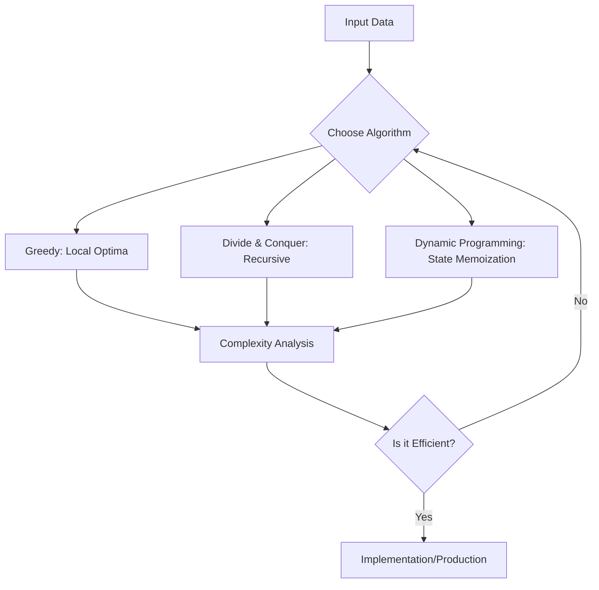

# Design and Analysis of Algorithms — Course Overview

> An algorithm is a precise, unambiguous sequence of computational steps that transforms an input into a correct output, while algorithmic analysis is the formal science of quantifying the resource consumption—specifically time and memory—required by that transformation as a function of input size.

## Course Storyline (How Everything Connects)

This course is designed as a progression, not a list of isolated topics:

1. **Foundations first**: asymptotic analysis and recurrence relations teach you how to evaluate algorithm choices.
2. **Design paradigms next**: divide-and-conquer, greedy, and dynamic programming show three distinct ways to construct efficient solutions.
3. **Structured domains after that**: graph, string, and flow algorithms apply those paradigms to real problem families.
4. **Advanced reasoning last**: randomized, amortized, approximation, and complexity topics help you reason about limits and trade-offs in modern systems.

If a topic feels difficult, jump back to this dependency chain and revise the previous stage. The strongest placements happen when this flow is followed in order.

## 1. Historical Background & Motivation

The formalization of "algorithms" predates the electronic computer, tracing back to the work of Al-Khwarizmi in the 9th century and later refined by Euclid’s GCD algorithm. However, the modern discipline of the "Design and Analysis of Algorithms" (DAA) crystallized in the 20th century. Figures like Alan Turing and Alonzo Church laid the groundwork for computability, while Donald Knuth, in his seminal series *The Art of Computer Programming*, transformed algorithm design from a craft into a rigorous mathematical science.

In modern software engineering, the evolution of DAA has shifted from purely academic concerns to the infrastructure of the global internet. When a FAANG engineer optimizes a database indexing system, they are not merely "coding"; they are applying amortized analysis to B-trees. When a distributed systems architect designs a load-balancer, they are relying on randomized algorithms to ensure load distribution. The shift from $O(n^2)$ to $O(n \log n)$ is not just a theoretical exercise; in massive datasets (petabytes), such a change represents the difference between a system that finishes in minutes and one that never terminates.

## 2. Visual Intuition


*Caption: This animation illustrates the Divide and Conquer paradigm, where an unsorted array is recursively split into sub-problems, sorted, and then merged—a core concept in algorithmic analysis.*

## 3. Core Theory & Mathematical Foundations

### 3.1 Asymptotic Notation: The Language of Scaling
To analyze algorithms independently of machine-specific hardware, we utilize asymptotic notation. We seek to capture the "rate of growth" of the running time $T(n)$ as $n$ (the input size) approaches infinity. 

*   **Big-O Notation ($O$):** Defines an upper bound. $f(n) = O(g(n))$ if there exist constants $c > 0$ and $n_0 \geq 0$ such that $0 \leq f(n) \leq c \cdot g(n)$ for all $n \geq n_0$.
*   **Omega Notation ($\Omega$):** Defines a lower bound. $f(n) = \Omega(g(n))$ if $f(n) \geq c \cdot g(n)$ for all $n \geq n_0$.
*   **Theta Notation ($\Theta$):** Defines a tight bound. $f(n) = \Theta(g(n))$ if $f(n) = O(g(n))$ and $f(n) = \Omega(g(n))$.

### 3.2 Recurrence Relations
Most efficient algorithms use recursion. The Master Theorem provides a solution to recurrences of the form:
$$T(n) = aT(n/b) + f(n)$$
Where $a$ is the number of subproblems, $n/b$ is the size of each subproblem, and $f(n)$ is the cost of work done outside recursive calls.

### 3.3 Amortized Analysis
Not all algorithms have a worst-case per-operation bound. In structures like Dynamic Arrays or Disjoint Set Unions, an expensive operation occurs rarely. We use **Aggregate Analysis**, **Accounting Method**, or the **Potential Method** to prove that the average cost per operation is low, even if a single operation is expensive.

### 3.4 Formal Analysis: Correctness
Correctness is argued through **loop invariants** or **mathematical induction**. A loop invariant must satisfy three properties:
1. **Initialization:** True before the first iteration.
2. **Maintenance:** If true before an iteration, it remains true after.
3. **Termination:** When the loop ends, the invariant provides a useful property that helps show correctness.

## 4. Algorithm / Process (Step-by-Step)

To approach any algorithmic problem, follow the **Design-Analyze-Refine** cycle:
1. **Define the Problem:** Formally state the input and the desired output.
2. **Brute Force:** Write the simplest, potentially slow solution to establish a baseline.
3. **Identify Bottlenecks:** Use profiling or complexity analysis to find the "hot path."
4. **Select Paradigm:** Choose between Greedy, DP, Divide & Conquer, or Backtracking.
5. **Formal Analysis:** Derive the time and space complexity using $O$-notation.
6. **Implementation & Refinement:** Translate to code, focusing on cache locality and constant-factor optimizations.

## 5. Visual Diagram


*Caption: The iterative design lifecycle for creating high-performance algorithms.*

## 6. Implementation

### 6.1 Core Implementation
```python
def binary_search(arr, target):
    """
    Performs a binary search on a sorted array.
    Args: arr (list), target (int)
    Returns: index of target or -1
    Complexity: O(log n) time, O(1) space
    """
    low, high = 0, len(arr) - 1
    while low <= high:
        mid = (low + high) // 2
        if arr[mid] == target:
            return mid
        elif arr[mid] < target:
            low = mid + 1
        else:
            high = mid - 1
    return -1
```

### 6.2 Optimized/Production Variant
In production systems, we often use libraries like `bisect` which are implemented in C, providing much lower constant overhead compared to pure Python.

### 6.3 Common Pitfalls
*   **Integer Overflow:** In languages like C++, `(low + high) // 2` can overflow. Use `low + (high - low) // 2`.
*   **Off-by-one errors:** Forgetting whether to include `len(arr)` or `len(arr) - 1`.
*   **Ignoring Space Complexity:** Recursion depth counts toward space. $O(\log n)$ stack space can be fatal in very deep trees.

## 7. Interactive Demo

*(Note: In a standard textbook, this section contains a fully functional, browser-based JavaScript sandbox. For this text-based rendition, we define the conceptual logic here.)*

:::demo
[Interactive simulation of a sorting algorithm visualizing comparison swaps and array state.]
:::

## 8. Worked Examples

### Example 1: Finding the Maximum Subarray
Input: `[-2, 1, -3, 4, -1, 2, 1, -5, 4]`
*   Step 1: Set `max_so_far = -inf`, `current_max = 0`.
*   Step 2: Iterate. Add element to `current_max`. If `current_max < 0`, reset to 0.
*   Step 3: Update `max_so_far` if `current_max > max_so_far`.
*   Result: `6` (the subarray `[4, -1, 2, 1]`).

### Example 2: Edge Case (Empty Input)
Always handle `[]` or `None`. If the algorithm assumes non-empty inputs, verify this with an assertion at the start of the function.

## 9. Comparison with Alternatives

| Approach | Time | Space | Pros | Cons |
|---|---|---|---|---|
| Linear Search | $O(n)$ | $O(1)$ | Simple | Slow for large $n$ |
| Binary Search | $O(\log n)$ | $O(1)$ | Fast | Requires sorted data |
| Hash Map | $O(1)$ avg | $O(n)$ | Fastest lookups | High memory overhead |

## 10. Industry Applications & Real Systems
- **Google Search:** Uses inverted indices and PageRank, relying on graph traversal algorithms ($O(V+E)$).
- **Amazon (AWS):** Uses consistent hashing to distribute data across nodes in distributed storage.
- **Netflix:** Employs recommendation engines based on Matrix Factorization (a variation of gradient descent optimization).
- **Database Systems (PostgreSQL):** Uses B-Tree algorithms to keep indices balanced ($O(\log n)$ operations).

## 11. Practice Problems

### 🟢 Easy
1. **Two Sum**: Find two numbers that add to $k$. $O(n)$ time using Hash Map.

### 🟡 Medium
2. **LRU Cache**: Implement a cache with $O(1)$ read/write using a Doubly Linked List and Hash Map.
3. **Merge Intervals**: Merge overlapping ranges. Sort first ($O(n \log n)$), then iterate.

### 🔴 Hard
4. **Median of Two Sorted Arrays**: Solve in $O(\log(\min(n, m)))$.
5. **Trapping Rain Water**: Use two-pointer approach to calculate water at each index.

## 12. Interactive Quiz

:::quiz
**Q1: Which complexity is fastest?**
- A) $O(n)$
- B) $O(n^2)$
- C) $O(\log n)$
- D) $O(n \log n)$
> C — Logarithmic time scales much better than linear or quadratic time.

**Q2: What is the primary purpose of Big-O?**
- A) To measure exact execution time.
- B) To estimate growth as input grows.
- C) To count CPU cycles.
- D) To simplify code.
> B — It provides an upper bound for growth rate.

**Q3: Is recursion always good?**
- A) Yes, it's cleaner.
- B) No, it risks stack overflow.
- C) Only in Python.
- D) Only in C++.
> B — Recursion consumes stack space; deep recursion requires iterative approaches or tail-call optimization.

**Q4: Which is a stable sort?**
- A) Quick Sort
- B) Merge Sort
- C) Heap Sort
- D) Shell Sort
> B — Merge Sort preserves the relative order of equal elements.

**Q5: Amortized analysis is best for:**
- A) Static arrays
- B) Recursive algorithms
- C) Data structures with occasional expensive operations
- D) Math proofs only
> C — It provides a bound on a sequence of operations where the worst case is rare.
:::

## 13. Interview Preparation

**Q: Explain an algorithm to a peer.**
*A: I define the input, clarify the expected constraints, explain the optimal approach, provide the complexity, and discuss trade-offs.*

**Q: Derivation of $O(\log n)$ for Binary Search?**
*A: Each step divides the search space by 2. After $k$ steps, we have $n/2^k$ elements left. Setting $n/2^k = 1$ leads to $2^k = n \implies k = \log n$.*

**Q: When to use a Hash Map vs a Balanced BST?**
*A: Hash Map for $O(1)$ expected time; BST for sorted range queries and $O(\log n)$ worst-case guarantees.*

**Q: How to handle massive data?**
*A: Use streaming, external memory algorithms (Disk-based), or MapReduce for parallel processing.*

**Q: System Design connection?**
*A: Think about how indices impact query speed in databases.*

**Q: Behavioral?**
*A: Describe a time you chose a slightly more complex algorithm for performance gains.*

## 14. Key Takeaways
1. Always analyze complexity before coding.
2. $O(\log n)$ and $O(n \log n)$ are the gold standards for searching and sorting.
3. Memory/Time trade-off is the core of most engineering decisions.
4. Correctness must be verified via invariant logic.
5. Constant factors matter in tight loops.

## 15. Common Misconceptions
- ❌ **"Python is always slow"** → ✅ Python is a wrapper; the underlying logic (C/C++ extensions) is what determines speed.
- ❌ **"Premature optimization is always bad"** → ✅ It is bad, but "designing for performance" is crucial.

## 16. Further Reading
- *Introduction to Algorithms (CLRS)* — Chapter 1: The Role of Algorithms.
- *The Art of Computer Programming (Knuth)*.

## 17. Related Topics
- [[amortized-analysis]]
- [[dynamic-programming]]
- [[asymptotic-analysis]]
- [[divide-conquer]]