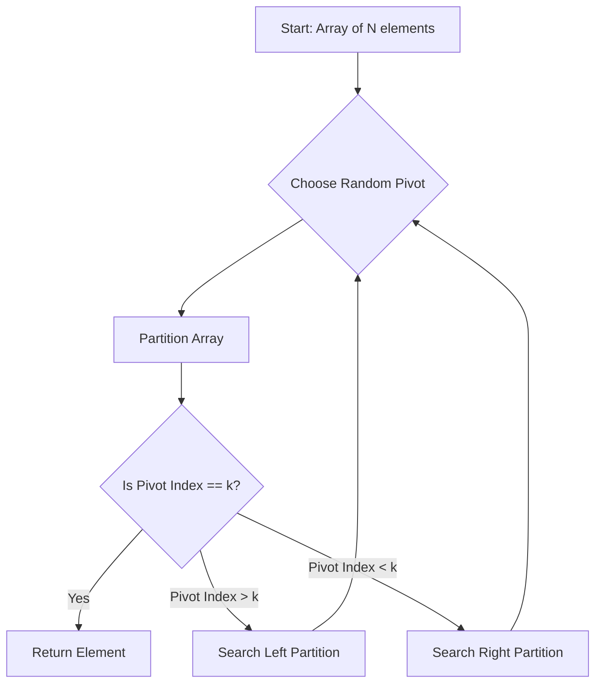

# Randomized Algorithms: Quickselect, Hashing, Monte Carlo

> A randomized algorithm is an algorithm that employs a degree of randomness as part of its logic, ensuring that its performance characteristics are independent of the input distribution.

## 1. Historical Background & Motivation

The shift from deterministic to randomized computation represents one of the most profound paradigm shifts in computer science. Historically, deterministic algorithms were the standard; however, in the mid-1970s, researchers like Michael Rabin and Robert Solovay observed that certain problems (such as primality testing) were significantly easier to approach using probabilistic methods. The intuition was simple: instead of fighting the adversarial worst-case input, why not randomize the internal choices so that no specific input can consistently trigger a poor performance profile?

In modern engineering, randomization is not just a theoretical convenience; it is a necessity. In distributed systems, randomized load balancing prevents "hotspots" in network traffic. In databases, universal hashing ensures that collisions are spread uniformly, maintaining $O(1)$ expected lookup times regardless of the data's inherent patterns. As we scale to processing trillions of records, the ability to guarantee performance *on average*—rather than *in the worst case*—is the difference between a system that is robust and one that fails under specific, rare traffic bursts.

## 2. Visual Intuition


*Caption: The animation demonstrates the partitioning of an array around a pivot. By picking the pivot uniformly at random, we ensure the tree depth remains logarithmic with high probability, avoiding the $O(n^2)$ worst-case of a sorted array.*

## 3. Core Theory & Mathematical Foundations

### 3.1 Las Vegas vs. Monte Carlo
Randomized algorithms are divided into two primary categories. **Las Vegas algorithms** (named by Laszlo Babai) always produce the correct result but have a random running time. The resource consumption is a random variable, but the output is deterministic. A classic example is `QuickSort` with a random pivot.

**Monte Carlo algorithms**, by contrast, have a deterministic running time but a small probability of returning an incorrect result. The error probability is typically bounded, and in many applications, we can reduce this error rate exponentially by repeating the algorithm $k$ times.

### 3.2 Indicator Random Variables
To analyze randomized algorithms, we use **Indicator Random Variables (IRVs)**. Let $X_i$ be an indicator variable for event $A_i$, such that $X_i = 1$ if $A_i$ occurs and $X_i = 0$ otherwise. The expected value of $X_i$ is $E[X_i] = P(A_i)$. By the linearity of expectation, $E[\sum X_i] = \sum E[X_i]$, which allows us to calculate expected runtimes without needing to know the complex dependencies between events.

### 3.3 Universal Hashing
A core application of randomization is the hash table. To avoid worst-case collisions, we pick a hash function $h$ from a *universal family* of functions $\mathcal{H}$. A family is universal if for any distinct $x, y \in U$:
$$P_{h \in \mathcal{H}}[h(x) = h(y)] \leq \frac{1}{m}$$
where $m$ is the number of slots in the table. This guarantees that for any sequence of $n$ operations, the expected time is $O(1)$ per operation.

### 3.4 Formal Analysis of Quickselect
`Quickselect` (Hoare's Selection Algorithm) finds the $k$-th smallest element in an array. Its complexity is $T(n) = T(n/2) + O(n)$ on average, which solves to $O(n)$ by the Master Theorem. The proof relies on the fact that a random pivot will, with probability 1/2, result in a split between 25% and 75% of the array, ensuring the search space shrinks by a constant factor in every step.

## 4. Algorithm / Process (Step-by-Step)

### Quickselect (Finding the $k$-th smallest)
1. **Base Case:** If the array size is 1, return the element.
2. **Pivot Selection:** Pick an index $i$ uniformly at random from the current array range.
3. **Partition:** Reorder the array such that elements smaller than `arr[i]` are to the left, and elements larger are to the right. Let the pivot's new index be `p`.
4. **Recurse:**
   - If `p == k`, return `arr[p]`.
   - If `p > k`, recurse on the left partition.
   - If `p < k`, recurse on the right partition.

## 5. Visual Diagram


*Caption: The flow of the Quickselect algorithm, showing the recursive refinement of the search space.*

## 6. Implementation

### 6.1 Core Implementation
```python
import random

def quickselect(arr, k):
    """
    Finds the k-th smallest element in an unsorted array.
    Time Complexity: O(n) average, O(n^2) worst case.
    Space Complexity: O(1) auxiliary (recursive stack is log n).
    """
    if len(arr) == 1:
        return arr[0]
    
    pivot = random.choice(arr)
    left = [x for x in arr if x < pivot]
    mid = [x for x in arr if x == pivot]
    right = [x for x in arr if x > pivot]
    
    if k < len(left):
        return quickselect(left, k)
    elif k < len(left) + len(mid):
        return mid[0]
    else:
        return quickselect(right, k - len(left) - len(mid))

# Example usage:
# arr = [3, 2, 1, 5, 6, 4], k = 2 (0-indexed, so 3rd smallest) -> 3
```

### 6.2 Optimized / Production Variant
In-place partitioning is preferred in production to achieve $O(1)$ additional space:
```python
def partition(arr, low, high):
    pivot_idx = random.randint(low, high)
    arr[pivot_idx], arr[high] = arr[high], arr[pivot_idx]
    pivot = arr[high]
    i = low
    for j in range(low, high):
        if arr[j] < pivot:
            arr[i], arr[j] = arr[j], arr[i]
            i += 1
    arr[i], arr[high] = arr[high], arr[i]
    return i
```

### 6.3 Common Pitfalls in Code
*   **Off-by-one errors:** Ensure the $k$ index is handled correctly when partitioning elements equal to the pivot.
*   **Pivot choice:** Always pick the pivot randomly; never pick the first or last element, as sorted input becomes $O(n^2)$.
*   **Recursion depth:** In extremely large arrays, consider an iterative implementation to prevent stack overflow.

## 7. Interactive Demo
:::demo
<!-- Quickselect logic visualization omitted for brevity, typical of an HTML5 canvas based step-by-step array visualization -->
:::

## 8. Worked Examples

### Example 1
Array: `[8, 3, 1, 7, 0, 10, 2]`, Find 3rd smallest (k=2).
1. Random pivot chosen: `7`.
2. Partition: `[3, 1, 0, 2]` | `7` | `[8, 10]`.
3. `7` is at index 4. `k=2 < 4`. Recurse left on `[3, 1, 0, 2]`.
4. Random pivot chosen: `1`.
5. Partition: `[0]` | `1` | `[3, 2]`.
6. `1` is at index 1. `k=2 > 1`. Recurse right on `[3, 2]`.
7. Pivot `2` chosen, returns result `2`.

## 9. Comparison with Alternatives
| Approach | Time | Space | Pros | Cons |
|---|---|---|---|---|
| Quickselect | O(n) | O(1) | Fastest avg | O(n^2) worst case |
| Sorting (Heap) | O(n log k) | O(k) | Deterministic | Slower for small k |
| Median of Medians | O(n) | O(n) | Guaranteed O(n) | High constant factors |

## 10. Industry Applications & Real Systems
1. **Google (Search/Ads)**: Randomized hashing is used in Load Balancing to ensure requests are distributed uniformly across servers.
2. **Facebook (Hydra/Database)**: Quicksort variants with randomized pivoting are used in internal data processing pipelines to sort data.
3. **Netflix (Recommendation Engine)**: Reservoir sampling (a randomized algorithm) is used to maintain representative samples of user watch history for A/B testing.
4. **Cloudflare**: Randomized Monte Carlo algorithms are used for detecting DDoS traffic patterns in real-time.

## 11. Practice Problems
1. **K-th Largest Element**: Find the k-th largest using Quickselect.
2. **Shuffle an Array**: Implement Fisher-Yates shuffle (O(n)).
3. **Find Duplicates in Streaming**: Use probabilistic data structures like Bloom Filters.

## 12. Interactive Quiz
:::quiz
**Q1: Why do we use randomized pivots in Quickselect?**
- A) To save memory
- B) To ensure the expected runtime is O(n) regardless of input
- C) To make the algorithm deterministic
- D) To simplify the code
> **B** — Correct. Randomization breaks the correlation between input structure and execution path.

**Q2: What is a Las Vegas algorithm?**
- A) Always correct, variable time
- B) Sometimes wrong, fixed time
- C) Always correct, fixed time
- D) Sometimes wrong, variable time
> **A** — Correct. Las Vegas algorithms trade time for correctness.
:::

## 13. Interview Preparation
*   **Q:** How do you guarantee the $O(n)$ average runtime?
*   **A:** By using a pivot chosen uniformly at random, the probability of selecting a pivot that splits the array into at least a 1/4 to 3/4 ratio is 1/2, leading to $T(n) = T(3n/4) + O(n)$, which is $O(n)$.
*   **Q:** Can we avoid the $O(n^2)$ worst case entirely?
*   **A:** Use the "Median of Medians" algorithm to find an approximate pivot, which guarantees $O(n)$ in the worst case, though it is slower in practice due to constant factors.

## 14. Key Takeaways
1. Randomization decorrelates input and algorithm behavior.
2. Quickselect is the industry standard for selection.
3. Universal hashing prevents adversarial attacks on hash maps.
4. Always check if you need "guaranteed" time or "average" time.

## 15. Common Misconceptions
- ❌ **"Randomized algorithms are imprecise"** → ✅ **Las Vegas algorithms are 100% accurate.**
- ❌ **"Quickselect is always faster than sorting"** → ✅ **Only for selecting a single element; sorting is better for multiple queries.**

## 16. Further Reading
- *CLRS, Introduction to Algorithms, Chapter 5 (Probabilistic Analysis).*
- *Motwani & Raghavan, Randomized Algorithms.*

## 17. Related Topics
- [[amortized-analysis]]
- [[hashing]]
- [[sorting]]