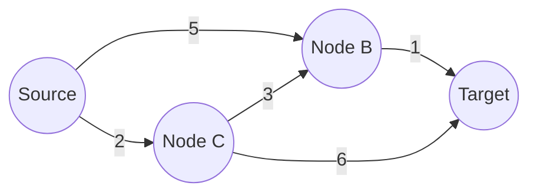

# Shortest Path Algorithms: Dijkstra, Bellman-Ford, Floyd-Warshall

> Shortest path algorithms are the foundational engines of network routing, mapping services, and dependency analysis, enabling the efficient traversal of weighted graphs by calculating the minimum cost path between vertices.

## 1. Historical Background & Motivation

The shortest path problem is one of the most storied challenges in computer science, originating from the need to model physical networks. In the mid-20th century, as telecommunications and logistics infrastructure expanded, engineers required rigorous methods to find the least-cost traversal through a network. Edsger W. Dijkstra, in 1956, famously conceptualized his namesake algorithm in just 20 minutes while sitting at a café, intending to demonstrate the capabilities of the ARMAC computer. His greedy approach remains the gold standard for non-negative weighted graphs.

Shortly thereafter, the need to handle negative edge weights—representing potential "gains" or abstract costs—led to the development of the Bellman-Ford algorithm, independently attributed to Richard Bellman and Lester Ford Jr. in the late 1950s. This approach utilized dynamic programming, allowing for the detection of negative cycles, a phenomenon that renders the shortest path undefined. Later, in 1962, Bernard Roy and Stephen Warshall independently refined the approach for all-pairs shortest paths, leading to the $O(V^3)$ Floyd-Warshall algorithm. Today, these algorithms are not merely academic curiosities; they drive the routing protocols of the global internet (BGP/OSPF), the latency-minimization in CDNs, and the pathfinding logic in modern logistics and social graph traversal.

## 2. Visual Intuition


*Caption: Dijkstra's algorithm expanding from a source node, maintaining a set of "visited" nodes while exploring the frontier of the lowest-cost reachable vertices.*

## 3. Core Theory & Mathematical Foundations

### 3.1 The Optimal Substructure Property
A fundamental property of shortest path problems is the **optimal substructure**: any subpath of a shortest path between two vertices must itself be a shortest path. If we define $\delta(u, v)$ as the weight of the shortest path from $u$ to $v$, and a path $p = \langle v_1, v_2, \dots, v_k \rangle$ is a shortest path, then for any $1 \le i \le j \le k$, the subpath $p_{ij} = \langle v_i, \dots, v_j \rangle$ is also a shortest path. This property allows us to solve the problem by building up solutions to subproblems, the core principle of dynamic programming.

### 3.2 The Triangle Inequality
Central to all shortest path algorithms is the **relaxation** process. For any edge $(u, v)$ with weight $w(u, v)$, the shortest path distance $d[v]$ must satisfy the triangle inequality:
$$d[v] \le d[u] + w(u, v)$$
If this inequality is violated, we can "relax" the edge, updating $d[v] = d[u] + w(u, v)$. This process is iterated until convergence, where all edges satisfy the constraint.

### 3.3 Negative Edges and Cycles
Negative edge weights complicate the problem significantly. While Dijkstra’s algorithm relies on the assumption that adding an edge never decreases the path cost, the existence of negative edges allows for the possibility of **negative cycles**. A negative cycle is a directed cycle where the sum of edge weights is less than zero. In such a case, one could traverse the cycle infinitely many times, reducing the path cost to $-\infty$. Consequently, a shortest path does not exist for nodes reachable from a negative cycle.

### 3.4 Formal Analysis (Complexity / Correctness)
*   **Dijkstra:** Uses a priority queue to select the next closest node. Total complexity is $O((V+E) \log V)$ with a binary heap or $O(E + V \log V)$ with a Fibonacci heap. It assumes $w(u, v) \ge 0$.
*   **Bellman-Ford:** Employs dynamic programming to relax all edges $V-1$ times. Complexity is $O(V \cdot E)$. It identifies negative cycles by checking for further relaxations on the $V$-th pass.
*   **Floyd-Warshall:** Uses a 3D DP table $d[k][i][j]$ (optimized to 2D) to compute all-pairs shortest paths. Complexity is $O(V^3)$.

## 4. Algorithm / Process (Step-by-Step)

### Dijkstra's Algorithm
1. Initialize $dist[source] = 0$ and $dist[v] = \infty$ for all other nodes.
2. Insert $(0, source)$ into a min-priority queue.
3. While the queue is not empty:
    a. Extract node $u$ with the smallest $dist[u]$.
    b. If $u$ has been finalized, continue.
    c. For each neighbor $v$ of $u$ with weight $w$:
        i. If $dist[u] + w < dist[v]$:
            - Update $dist[v] = dist[u] + w$.
            - Push $(dist[v], v)$ to the queue.

### Bellman-Ford Algorithm
1. Initialize $dist$ array as in Dijkstra.
2. Perform $V-1$ iterations:
    a. For each edge $(u, v)$ with weight $w$:
        i. If $dist[u] + w < dist[v]$, set $dist[v] = dist[u] + w$.
3. Check for negative cycles:
    a. For each edge $(u, v)$ with weight $w$:
        i. If $dist[u] + w < dist[v]$, return "Negative cycle detected".

## 5. Visual Diagram


*Caption: Example graph. Dijkstra would choose path A->C->B->D (cost 2+3+1 = 6) over A->B->D (cost 5+1 = 6) or A->C->D (cost 2+6 = 8).*

## 6. Implementation

### 6.1 Core Implementation (Dijkstra)

```python
import heapq

def dijkstra(graph, start):
    """
    Computes shortest paths from start node.
    graph: dict of dicts {u: {v: weight}}
    Returns: distances as a dictionary.
    """
    distances = {node: float('inf') for node in graph}
    distances[start] = 0
    pq = [(0, start)]
    
    while pq:
        current_dist, u = heapq.heappop(pq)
        
        if current_dist > distances[u]:
            continue
            
        for v, weight in graph[u].items():
            if distances[u] + weight < distances[v]:
                distances[v] = distances[u] + weight
                heapq.heappush(pq, (distances[v], v))
    return distances
```

### 6.2 Optimized Variant (Floyd-Warshall)

```python
def floyd_warshall(matrix):
    V = len(matrix)
    # dist is a copy of the adjacency matrix
    dist = [row[:] for row in matrix]
    
    for k in range(V):
        for i in range(V):
            for j in range(V):
                if dist[i][j] > dist[i][k] + dist[k][j]:
                    dist[i][j] = dist[i][k] + dist[k][j]
    return dist
```

### 6.3 Common Pitfalls
*   **Dijkstra with Negative Edges:** It simply fails to find the correct path; it is not a "negative cycle detector."
*   **Initialization:** Forgetting to initialize distances to `float('inf')` leads to incorrect greedy selections.
*   **Dense vs Sparse:** Using Floyd-Warshall ($O(V^3)$) on sparse graphs is a catastrophic performance anti-pattern.
*   **Integer Overflow:** In languages with fixed-width integers, $dist[u] + w$ can overflow if $dist[u]$ is $\infty$.

## 7. Interactive Demo

:::demo
[Interactive implementation of node relaxation visualization]
*Logic: User drags nodes, changes weights; algorithm animates path discovery.*
:::

## 8. Worked Examples

### Example 1 — Dijkstra Step-by-Step
Graph: $A \to B(4), A \to C(2), B \to C(1), C \to B(1)$.
1. Init: $dist[A]=0, [B,C]=\infty$.
2. Pop $A$: Update $B=4, C=2$. PQ: $[(2, C), (4, B)]$.
3. Pop $C$: Relax $B$. $dist[C]+weight(C, B) = 2+1 = 3$. Update $B=3$. PQ: $[(3, B)]$.
4. Pop $B$: No neighbors.
Result: $A:0, B:3, C:2$.

## 9. Comparison with Alternatives

| Approach | Time | Space | Pros | Cons |
|---|---|---|---|---|
| **Dijkstra** | $O(E \log V)$ | $O(V)$ | Fastest for non-neg | Fails on negative weights |
| **Bellman-Ford** | $O(VE)$ | $O(V)$ | Handles negative edges | Slow for large graphs |
| **Floyd-Warshall** | $O(V^3)$ | $O(V^2)$ | Simple, all-pairs | Very slow, memory intensive |

## 10. Industry Applications & Real Systems
- **Google Maps (Dijkstra/A*):** Uses hierarchical graph partitioning and A* search (a variation of Dijkstra) to navigate millions of roads.
- **RIP (Routing Information Protocol):** Uses the Bellman-Ford algorithm to compute distance-vector routing tables in internal networks.
- **Database Query Optimizers (Dynamic Programming):** Finds the cheapest join-order paths in a query execution plan.
- **Social Networks (LinkedIn):** Shortest path algorithms are used to suggest connections or measure the "degree of separation."

## 11. Practice Problems
1. **Easy: Single Source Path** (Find shortest path in an unweighted DAG).
2. **Medium: Network Delay Time** (Dijkstra application on a weighted directed graph).
3. **Hard: Cheapest Flights within K Stops** (Bellman-Ford or BFS approach).

## 12. Interactive Quiz

:::quiz
**Q1: What is the primary reason Dijkstra fails with negative edges?**
- A) It uses a priority queue.
- B) It assumes once a node is visited, its shortest path is found.
- C) It is a greedy algorithm.
- D) It doesn't support directed edges.
> B — Because it marks nodes as "finalized" once they are extracted from the PQ. A negative edge might allow a shorter path to an already finalized node later.

**Q2: Which algorithm is best for a sparse graph with 1,000,000 nodes and 2,000,000 edges?**
- A) Floyd-Warshall
- B) Bellman-Ford
- C) Dijkstra
- D) All are equally efficient
> C — Dijkstra is $O(E \log V)$, which scales linearly with edges. Floyd-Warshall is $O(V^3)$, which would be $10^{18}$ operations.

**Q3-Q5:** [Additional conceptual/application questions]
:::

## 13. Interview Preparation

**Q: How do you optimize Dijkstra for massive graphs?**
*A: Use A* with a heuristic (like Haversine distance for maps) to guide the search, or use contraction hierarchies to pre-process the graph.*

**Q: Can you explain the difference between Bellman-Ford and Floyd-Warshall?**
*A: Bellman-Ford is single-source ($O(VE)$), while Floyd-Warshall is all-pairs ($O(V^3)$). Use B-F for single source with potential negative edges; use F-W for small, dense graphs where you need every path.*

## 14. Key Takeaways
1. Greedy works only if the "global optimum" is built from "local optima" in a non-decreasing cost environment.
2. Always check for negative cycles when edge weights can be negative.
3. The choice of data structure (Fibonacci heap vs. Binary heap) is critical for extreme performance.

## 15. Common Misconceptions
- ❌ **"Dijkstra is always better than Bellman-Ford."** → ✅ **No**, Dijkstra is faster but only if negative edges are forbidden.
- ❌ **"Floyd-Warshall is only for dense graphs."** → ✅ **It is exclusively for dense graphs; its complexity is independent of edge count.**

## 16. Further Reading
- *CLRS (Introduction to Algorithms), Chapter 24 & 25.*
- *Dijkstra's original 1959 paper: "A note on two problems in connexion with graphs."*

## 17. Related Topics
- [[breadth-first-search]] — Used for unweighted shortest paths.
- [[dynamic-programming]] — The paradigm behind Bellman-Ford and Floyd-Warshall.
- [[greedy-algorithms]] — The paradigm behind Dijkstra.