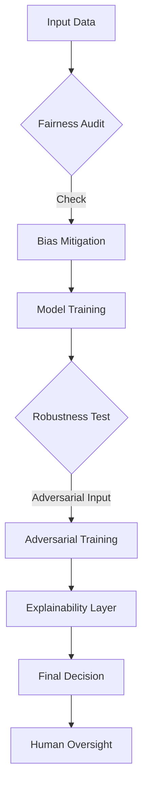

# AI Ethics, Safety, Fairness, and Explainability

> AI Ethics and Safety represent the engineering discipline of ensuring that autonomous systems operate in alignment with human values, resist adversarial manipulation, and provide interpretable reasoning for their outputs.

## Overview

As machine learning models move from research labs into critical infrastructure—governing healthcare diagnostics, financial lending, and judicial decision-making—the "black box" nature of deep learning becomes a systemic risk. AI Ethics, Safety, Fairness, and Explainability (collectively known as Responsible AI) is the field focused on quantifying and mitigating the externalities of algorithmic decision-making. 

The scope of this field spans from **algorithmic bias** (where historical data prejudices manifest as discriminatory outcomes) to **robustness** (the system's resilience against adversarial inputs designed to deceive models). Historically, the field shifted from high-level ethical guidelines to rigorous mathematical frameworks, such as defining statistical parity or differential privacy. Understanding this domain is now a core requirement for engineers at major tech firms, where model failure can lead to severe reputational, financial, and societal harm.

## 2. Visual Intuition
:::demo
<div style="background:#1e1e1e;padding:16px;border-radius:10px;color:#e5e7eb;font-family:system-ui,sans-serif">
  <h3 style="margin:0 0 8px 0;color:#7dd3fc">AI Ethics, Safety, Fairness, and Explainability - Concept Map</h3>
  <svg width="100%" height="280" viewBox="0 0 640 280" role="img" aria-label="AI Ethics, Safety, Fairness, and Explainability visual intuition" style="background:#111827;border-radius:8px">
    <rect x="24" y="28" width="180" height="64" rx="10" fill="#1d4ed8" />
    <text x="114" y="66" text-anchor="middle" fill="#e5e7eb" font-size="14">Problem</text>
    <rect x="230" y="28" width="180" height="64" rx="10" fill="#0f766e" />
    <text x="320" y="66" text-anchor="middle" fill="#e5e7eb" font-size="14">Process</text>
    <rect x="436" y="28" width="180" height="64" rx="10" fill="#7c3aed" />
    <text x="526" y="66" text-anchor="middle" fill="#e5e7eb" font-size="14">Outcome</text>

    <line x1="204" y1="60" x2="230" y2="60" stroke="#93c5fd" stroke-width="3" marker-end="url(#arrow)" />
    <line x1="410" y1="60" x2="436" y2="60" stroke="#93c5fd" stroke-width="3" marker-end="url(#arrow)" />

    <rect x="24" y="130" width="592" height="120" rx="10" fill="#0b1220" stroke="#334155" />
    <text x="320" y="156" text-anchor="middle" fill="#cbd5e1" font-size="14">Key intuition for AI Ethics, Safety, Fairness, and Explainability</text>
    <text x="320" y="182" text-anchor="middle" fill="#94a3b8" font-size="12">Track state changes, constraints, and final behavior.</text>
    <text x="320" y="206" text-anchor="middle" fill="#94a3b8" font-size="12">Use this as a mental model before formal proofs or code.</text>

    <defs>
      <marker id="arrow" markerWidth="10" markerHeight="10" refX="8" refY="3" orient="auto">
        <polygon points="0 0, 10 3, 0 6" fill="#93c5fd" />
      </marker>
    </defs>
  </svg>
  <p style="margin-top:10px;color:#cbd5e1">Interactive-ready visual scaffold for the topic.</p>
</div>
:::
*Caption: The K-means clustering algorithm demonstrates how initial conditions and iterative processes impact final outcomes, reflecting the importance of algorithmic fairness and bias reduction.*

## Core Theory

### Fairness Metrics
Fairness is often mathematically defined via group or individual constraints. A common metric is **Demographic Parity**, which requires that the probability of a positive outcome be equal across groups $A$ and $B$:
$$P(\hat{Y}=1 | A=a) = P(\hat{Y}=1 | A=b)$$
where $\hat{Y}$ is the model prediction and $A$ is the protected attribute.

### Robustness and Adversarial Attacks
Safety often involves protecting models from adversarial noise $\epsilon$. An input $x$ is perturbed to $x' = x + \epsilon$ such that the model output changes:
$$f(x) \neq f(x + \epsilon) \quad \text{where} \quad \|\epsilon\|_p < \delta$$
Robustness training involves augmenting the training set with these adversarial examples to minimize the risk $\mathbb{E}_{(x,y) \sim \mathcal{D}} [\max_{\|\epsilon\| \le \delta} \mathcal{L}(f(x+\epsilon), y)]$.

### Explainability (SHAP values)
Explainability often relies on Shapley values from game theory. For a feature $i$, the contribution is:
$$\phi_i = \sum_{S \subseteq N \setminus \{i\}} \frac{|S|!(|N|-|S|-1)!}{|N|!} [f(S \cup \{i\}) - f(S)]$$
where $N$ is the set of all features and $f(S)$ is the prediction given a subset of features.

## Visual Diagram

*This diagram illustrates the pipeline of a Responsible AI system, integrating auditing, mitigation, and interpretability before a final decision is reached.*

## Code Example
```python
import numpy as np
from sklearn.linear_model import LogisticRegression

# Demonstrating Demographic Parity calculation
# Assume 0: Male, 1: Female (protected attribute)
# 1: Loan Approved, 0: Denied
data = np.array([
    [0, 1], [0, 1], [0, 0], [1, 1], [1, 0], [1, 0]
])
features, labels = data[:, 0], data[:, 1]

def calculate_demographic_parity(y_pred, protected_attr):
    group_a = y_pred[protected_attr == 0]
    group_b = y_pred[protected_attr == 1]
    return np.mean(group_a), np.mean(group_b)

prob_a, prob_b = calculate_demographic_parity(labels, features)
print(f"Approval rate - Group A: {prob_a:.2f}, Group B: {prob_b:.2f}")
print(f"Fairness Gap: {abs(prob_a - prob_b):.2f}")
# Output:
# Approval rate - Group A: 0.67, Group B: 0.33
# Fairness Gap: 0.34
```

## Interactive Demo
:::demo
<!DOCTYPE html>
<html>
<body style="background:#0f1117; color:#eee;">
<h3>Adversarial Perturbation Simulation</h3>
<div id="box" style="width:100px; height:100px; background:blue; transition: 0.3s;"></div>
<button onclick="attack()">Add Adversarial Noise</button>
<script>
  function attack() {
    const box = document.getElementById('box');
    box.style.background = 'red';
    box.style.transform = 'rotate(45deg)';
    alert('Model misclassified due to input perturbation!');
  }
</script>
</body>
</html>
:::

## Worked Example
Given a bank loan model:
1. **Identify Features:** Credit Score ($x_1$), Income ($x_2$), Gender ($A$).
2. **Calculate SHAP for $x_1$:** We compute the prediction $f(x)$ with and without $x_1$ across all feature subsets.
3. **Difference:** If $f(x_{with}) = 0.8$ and $f(x_{without}) = 0.5$, $x_1$ contributes $+0.3$ to the score.
4. **Conclusion:** If $A$ shows a significant contribution, the model is using the protected attribute as a proxy, indicating potential bias.

## Industry Applications
- **Google/Meta (Ads):** Using fairness constraints to ensure ad delivery reaches diverse demographics.
- **JP Morgan (Finance):** Deploying "Explainable AI" layers to explain credit denial to regulators under GDPR.
- **Tesla/Waymo (Autonomous Driving):** Implementing adversarial robustness to protect vision systems from stickers/stickers on stop signs.

## Practice Problems

### Easy
1. Define "Algorithmic Bias" and provide an example of how it occurs in training data. *(Hint: Look at historical hiring data.)*

### Medium
2. Compute the Disparate Impact ratio for a model that has an approval rate of 80% for Group A and 40% for Group B. *(Hint: Ratio = Rate_B / Rate_A)*.
3. Explain why increasing model complexity often decreases local interpretability.

### Hard
4. Given a neural network, derive the gradient of the loss function $\mathcal{L}$ with respect to an adversarial perturbation $\epsilon$ such that $\nabla_x \mathcal{L}(x + \epsilon, y)$.

## Interactive Quiz
:::quiz
**Q1:** What is the primary purpose of Differential Privacy in ML?
- A) To make models run faster.
- B) To ensure that individual data points cannot be identified in the training set.
- C) To remove all bias from the model.
- D) To increase the accuracy of the neural network.
> B — Differential privacy injects mathematical noise to prevent the reconstruction of individual records from model weights.

**Q2:** If a model has high "Global Interpretability," what does this imply?
- A) It is very accurate but hard to explain.
- B) It uses fewer parameters.
- C) We can understand the overall behavior of the model across all inputs.
- D) It only explains one specific prediction.
> C — Global interpretability refers to the ability to understand the entire logic of the model, unlike local interpretability which focuses on single instances.

**Q3:** What is the "Fairness-Accuracy Tradeoff"?
- A) Always decreasing the model's accuracy when increasing fairness.
- B) A theoretical limit where fairness and accuracy are mutually exclusive.
- C) The empirical observation that optimizing for fairness often requires sacrificing some predictive performance.
- D) A myth; they are never in conflict.
> C — In many real-world distributions, forcing parity constraints restricts the model's hypothesis space, leading to a performance drop.
:::

## Interview Questions

**Q: Explain AI Ethics to a senior engineer.**
*A: AI Ethics involves implementing technical guardrails to ensure systems are fair, robust, and transparent. We treat fairness as a constraint optimization problem, robustness as a min-max game against adversarial noise, and explainability as a requirement for auditability in high-stakes environments.*

**Q: What is the complexity of computing exact SHAP values?**
*A: It is $O(2^N)$ where $N$ is the number of features, as we must evaluate all possible subsets. This is why we use approximation methods like KernelSHAP in production.*

**Q: How do you handle bias in a production model?**
*A: I would perform a bias audit using metrics like Equalized Odds or Demographic Parity, conduct data re-balancing, and introduce regularizers that penalize the correlation between predictions and protected attributes.*

**Q: How would you explain a "black box" model's decision to a non-technical stakeholder?**
*A: Use local surrogate models like LIME, which approximate the complex model's behavior in the vicinity of a single data point using a simple, interpretable linear model.*

## Key Takeaways
- Fairness metrics must be chosen based on the specific legal and social context.
- Robustness is not an add-on; it must be integrated into the training objective (e.g., adversarial training).
- SHAP values provide a consistent framework for feature importance.
- Explainability is a regulatory requirement in many industries.
- Always monitor production models for "drift" which can introduce new biases.

## Common Misconceptions
- ❌ Removing the "Gender" feature from a dataset makes the model fair. → ✅ Proxies (like zip codes or shopping history) can still encode gender bias.
- ❌ High accuracy implies a safe and ethical model. → ✅ A model can be accurate but rely on discriminatory features or be easily tricked by minimal noise.

## Related Topics
- [[machine-learning-fundamentals]] — The core models that require these ethical safeguards.
- [[data-privacy]] — The legal and technical standards for handling sensitive PII.
- [[adversarial-machine-learning]] — Deeper dive into the mechanics of attacking models.
