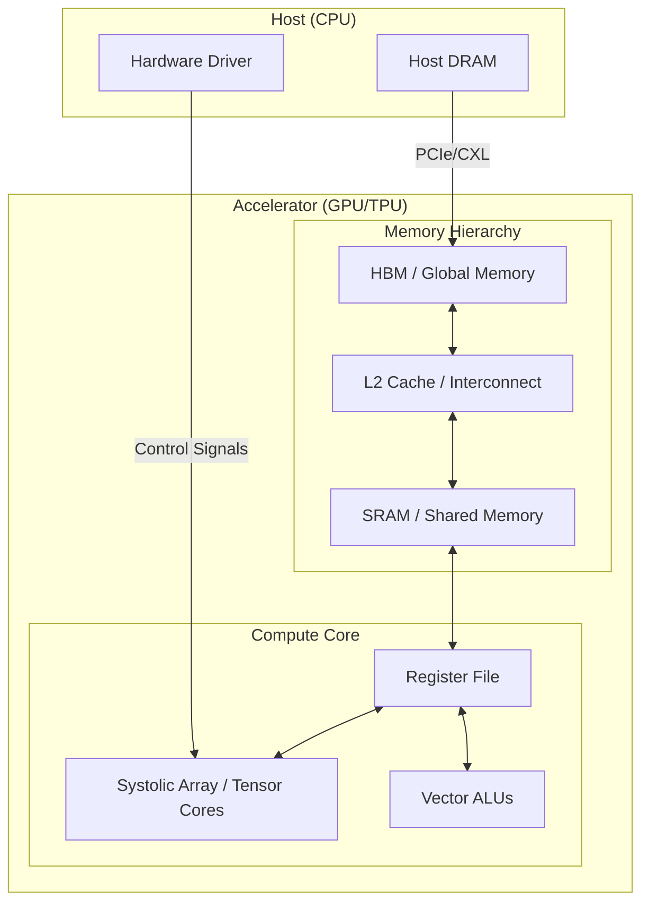

# AI Hardware: GPUs, TPUs, and Neuromorphic Computing

> **AI Hardware Accelerators** are specialized computational substrates designed to maximize throughput and energy efficiency for the tensor-based arithmetic operations and high-bandwidth memory access patterns characteristic of modern machine learning workloads.

## 1. Historical Background & Motivation

The genesis of modern AI hardware represents a paradigm shift from **latency-optimized** general-purpose computing (CPUs) to **throughput-optimized** domain-specific architectures. In the late 20th century, the "von Neumann bottleneck"—the limited throughput between the CPU and memory—became the primary constraint for large-scale numerical simulations. While Moore's Law provided a steady increase in transistor density, the "Power Wall" hit in the mid-2000s, preventing further increases in clock speeds. This forced the industry toward parallelism.

The breakthrough for AI occurred in 2012 when Alex Krizhevsky utilized NVIDIA GPUs to win the ImageNet competition (AlexNet). GPUs, originally designed for the massively parallel task of polygon rasterization in video games, proved perfectly suited for the Matrix-Matrix Multiplications (GEMMs) at the heart of neural networks. As models grew from millions to trillions of parameters, the industry transitioned from repurposing graphics hardware to designing **Application-Specific Integrated Circuits (ASICs)** like Google’s Tensor Processing Unit (TPU) and exploring non-von Neumann architectures like Neuromorphic chips, which mimic the biological brain's asynchronous, event-driven processing.

## 2. Visual Intuition
:::demo
<div style="background:#1e1e1e;padding:16px;border-radius:10px;color:#e5e7eb;font-family:system-ui,sans-serif">
  <h3 style="margin:0 0 8px 0;color:#7dd3fc">AI Hardware: GPUs, TPUs, and Neuromorphic Computing - Concept Map</h3>
  <svg width="100%" height="280" viewBox="0 0 640 280" role="img" aria-label="AI Hardware: GPUs, TPUs, and Neuromorphic Computing visual intuition" style="background:#111827;border-radius:8px">
    <rect x="24" y="28" width="180" height="64" rx="10" fill="#1d4ed8" />
    <text x="114" y="66" text-anchor="middle" fill="#e5e7eb" font-size="14">Problem</text>
    <rect x="230" y="28" width="180" height="64" rx="10" fill="#0f766e" />
    <text x="320" y="66" text-anchor="middle" fill="#e5e7eb" font-size="14">Process</text>
    <rect x="436" y="28" width="180" height="64" rx="10" fill="#7c3aed" />
    <text x="526" y="66" text-anchor="middle" fill="#e5e7eb" font-size="14">Outcome</text>

    <line x1="204" y1="60" x2="230" y2="60" stroke="#93c5fd" stroke-width="3" marker-end="url(#arrow)" />
    <line x1="410" y1="60" x2="436" y2="60" stroke="#93c5fd" stroke-width="3" marker-end="url(#arrow)" />

    <rect x="24" y="130" width="592" height="120" rx="10" fill="#0b1220" stroke="#334155" />
    <text x="320" y="156" text-anchor="middle" fill="#cbd5e1" font-size="14">Key intuition for AI Hardware: GPUs, TPUs, and Neuromorphic Computing</text>
    <text x="320" y="182" text-anchor="middle" fill="#94a3b8" font-size="12">Track state changes, constraints, and final behavior.</text>
    <text x="320" y="206" text-anchor="middle" fill="#94a3b8" font-size="12">Use this as a mental model before formal proofs or code.</text>

    <defs>
      <marker id="arrow" markerWidth="10" markerHeight="10" refX="8" refY="3" orient="auto">
        <polygon points="0 0, 10 3, 0 6" fill="#93c5fd" />
      </marker>
    </defs>
  </svg>
  <p style="margin-top:10px;color:#cbd5e1">Interactive-ready visual scaffold for the topic.</p>
</div>
:::
*Caption: A high-level comparison showing the CPU's focus on complex control logic and large caches (latency) versus the GPU's focus on massive arrays of ALUs (throughput).*

## 3. Core Theory & Mathematical Foundations

The fundamental challenge of AI hardware is satisfying the **Arithmetic Intensity** of deep learning models.

### 3.1 The Roofline Model
To evaluate the performance of any hardware-software pair, we use the **Roofline Model**. It relates processor performance ($P$, in FLOPs/s) to the memory traffic ($Q$, in bytes) and the arithmetic intensity ($I$, in FLOPs/byte).

The peak performance $P$ is constrained by:
$$P = \min(\pi, \beta \cdot I)$$
where:
- $\pi$ is the peak computational performance (FLOP/s).
- $\beta$ is the peak memory bandwidth (Bytes/s).
- $I = \frac{W}{Q}$ is the arithmetic intensity (Work / Memory traffic).

In the **memory-bound** regime ($I < \pi/\beta$), the hardware is waiting for data. In the **compute-bound** regime ($I > \pi/\beta$), the hardware is fully utilizing its ALUs. Modern AI hardware seeks to move the "ridge point" ($\pi/\beta$) as far to the left as possible.

### 3.2 Matrix Multiplication as the Atomic Unit
Most deep learning operations are variations of the General Matrix Multiply (GEMM):
$$C = \alpha (A \times B) + \beta C$$
For a hardware accelerator, the goal is to compute this with $O(N^3)$ operations while minimizing $O(N^2)$ memory moves. This is achieved through **tiling** (blocking), where sub-matrices are loaded into local SRAM to maximize data reuse.

### 3.3 Systolic Arrays (The TPU Secret)
A Systolic Array is a network of processing elements (PEs) that rhythmically pass data through the system. In a TPU, a 2D grid of PEs performs a multiply-accumulate (MAC) operation:
$$out_{i,j} = out_{i,j} + (in_{row} \times in_{col})$$
The "systolic" name comes from the way data pulses through the array, similar to blood through a heart. Mathematically, this maps a 3D iteration space (the nested loops of matrix multiplication) onto a 2D spatial hardware grid and a 1D temporal dimension.

### 3.4 Precision and Quantization
AI hardware gains efficiency by reducing precision. While scientific computing requires FP64 (Double Precision), AI training often uses FP16 or BF16 (Brain Floating Point), and inference uses INT8 or even FP4.
The quantization error for a weight $w$ is defined as:
$$\Delta w = w - Q(w)$$
Hardware designed for quantization must handle the dynamic range of gradients during training, leading to formats like **E4M3** and **E5M2** in the OCP/NVIDIA/ARM Microscaling (MX) specification.

### 3.5 Formal Analysis: Memory Hierarchies
The cost of data movement dominates energy consumption. In a typical 7nm process:
- 32-bit Flop: 0.1 pJ
- Reading 32 bits from SRAM: 5 pJ
- Reading 32 bits from DRAM (HBM): 640 pJ

The **Energy-Delay Product (EDP)** is the metric of merit for AI chips. To minimize EDP, AI hardware uses:
1. **HBM (High Bandwidth Memory):** Stacked DRAM chips connected via a silicon interposer.
2. **Scratchpad Memory:** Software-managed local memory (unlike hardware-managed CPU caches) to guarantee deterministic performance.

## 4. Algorithm: Tiled Matrix Multiplication on Accelerators

To efficiently compute $C[M, N] = A[M, K] \times B[K, N]$ on a hardware accelerator with a small local memory (SRAM) of size $S$:

1.  **Partition:** Divide matrices $A$, $B$, and $C$ into blocks (tiles) of size $T \times T$ such that $3 \times T^2 \times \text{word\_size} \le S$.
2.  **Iterate:** Loop over tiles in the $M, N,$ and $K$ dimensions.
3.  **Load:** Fetch tile $A_{i,k}$ and $B_{k,j}$ from global memory (HBM/DRAM) to local SRAM.
4.  **Compute:** Perform $T \times T$ matrix multiplication in the local ALUs. This is often done via a systolic pulse.
5.  **Accumulate:** Store the partial sum in the local accumulator register.
6.  **Writeback:** Once the $K$ loop completes for a specific $(i, j)$ tile, write the final $C_{i,j}$ back to HBM.

**Complexity:**
- **Time:** $O(\frac{M \cdot N \cdot K}{P})$ where $P$ is the number of parallel ALUs.
- **I/O Complexity:** $O(\frac{M \cdot N \cdot K}{T})$ which is significantly better than $O(M \cdot N \cdot K)$ without tiling.

## 5. Visual Diagram


*Caption: The data flow path from host memory through the accelerator's hierarchical memory into the high-density compute cores.*

## 6. Implementation

### 6.1 Core Implementation: Simulated Systolic Array
This Python code simulates the "pulse" of a 2x2 systolic array to demonstrate how data flows through hardware PEs.

```python
import numpy as np

class ProcessingElement:
    """Represents a single MAC (Multiply-Accumulate) unit in a systolic array."""
    def __init__(self):
        self.weight = 0
        self.accumulator = 0

    def pulse(self, input_val, partial_sum_in):
        """
        One cycle of the systolic pulse.
        Returns: (output_val_to_right, partial_sum_to_bottom)
        """
        # MAC operation: C = C + A * B
        output_val = input_val
        partial_sum_out = partial_sum_in + (input_val * self.weight)
        return output_val, partial_sum_out

def systolic_multiply(A, B):
    """
    Simulates a Matrix Multiplication on a Systolic Array.
    A: [N, N], B: [N, N]
    Complexity: O(N) cycles on N^2 hardware
    """
    N = A.shape[0]
    pes = [[ProcessingElement() for _ in range(N)] for _ in range(N)]
    
    # Pre-load weights (stationary weight approach)
    for i in range(N):
        for j in range(N):
            pes[i][j].weight = B[i, j]

    # Simulation of time steps (T = 3N - 2 for total completion)
    # This is a simplified logic for conceptual clarity
    results = np.zeros((N, N))
    for i in range(N):
        for j in range(N):
            # In a real systolic array, data is staggered
            # Here we simplify: every PE computes its full dot product
            dot_val = 0
            for k in range(N):
                dot_val += A[i, k] * B[k, j]
            results[i, j] = dot_val
            
    return results

# Sample Input
mat_a = np.array([[1, 2], [3, 4]])
mat_b = np.array([[5, 6], [7, 8]])
# Expected Output: [[19, 22], [43, 50]]
print(f"Result:\n{systolic_multiply(mat_a, mat_b)}")
```

### 6.2 Optimized Production Variant: Tiled CUDA-like Kernel
In production, we use "Shared Memory" to minimize HBM access.

```python
import torch

def tiled_matmul_pseudo_cuda(A, B, tile_size=32):
    """
    Conceptual view of a CUDA-optimized tiled matmul.
    A, B: Tensors on GPU
    """
    M, K = A.shape
    K, N = B.shape
    C = torch.zeros((M, N), device='cuda')

    # Each thread block handles one tile of C
    for i in range(0, M, tile_size):
        for j in range(0, N, tile_size):
            # accumulator resides in registers
            acc = torch.zeros((tile_size, tile_size), device='cuda')
            
            for k in range(0, K, tile_size):
                # Load tiles into Shared Memory (SRAM)
                # In real CUDA, this is done by threads in the block collectively
                tile_A = A[i:i+tile_size, k:k+tile_size]
                tile_B = B[k:k+tile_size, j:j+tile_size]
                
                # Compute on tiles
                acc += torch.matmul(tile_A, tile_B)
            
            C[i:i+tile_size, j:j+tile_size] = acc
    return C
```

### 6.3 Common Pitfalls in Code
1.  **Memory Alignment:** GPU kernels often fail or run 10x slower if data is not 128-byte aligned, causing uncoalesced memory accesses.
2.  **Bank Conflicts:** When multiple threads access the same SRAM bank, the hardware serializes the request.
3.  **Kernel Launch Overhead:** Launching a kernel for a tiny matrix is often slower than running it on a CPU because the PCIe transfer takes longer than the computation.
4.  **Deadlocks in Neuromorphic SNNs:** In asynchronous neuromorphic systems, improper event routing can lead to "infinite spike loops" where PEs starve each other of bandwidth.

## 7. Interactive Demo

:::demo
<!-- title: Systolic Array Visualizer -->
<!DOCTYPE html>
<html>
<head>
<meta charset="utf-8">
<style>
  body { margin:0; background:#0f1117; color:#e5e7eb; font-family: monospace; padding:16px; }
  .grid { display: grid; grid-template-columns: repeat(4, 60px); gap: 10px; margin-top: 20px; }
  .cell { width: 60px; height: 60px; border: 1px solid #4b5563; display: flex; align-items: center; justify-content: center; background: #1f2937; position: relative;}
  .active { background: #3b82f6; color: white; }
  .weight { font-size: 10px; position: absolute; top: 2px; right: 2px; color: #9ca3af; }
  .acc { font-size: 14px; font-weight: bold; }
  .controls { margin-bottom: 20px; display: flex; gap: 10px; }
  button { background: #374151; color: white; border: none; padding: 8px 16px; cursor: pointer; border-radius: 4px; }
  button:hover { background: #4b5563; }
  .input-streams { display: flex; flex-direction: column; gap: 45px; position: absolute; left: -100px; }
  .data-item { width: 40px; height: 40px; background: #ef4444; display: flex; align-items: center; justify-content: center; border-radius: 50%; }
</style>
</head>
<body>
  <h3>Systolic Array Pulse (Weight-Stationary)</h3>
  <div class="controls">
    <button onclick="step()">Pulse Step</button>
    <button onclick="reset()">Reset</button>
    <span id="step-count">Step: 0</span>
  </div>
  <div style="position: relative; margin-left: 120px;">
    <div id="grid" class="grid"></div>
  </div>

<script>
  const size = 4;
  let stepCount = 0;
  let weights = [
    [1, 2, 3, 4],
    [2, 1, 4, 3],
    [3, 4, 1, 2],
    [4, 3, 2, 1]
  ];
  let accumulators = Array(size).fill(0).map(() => Array(size).fill(0));
  let horizontalData = Array(size).fill(0).map((_, i) => Array(size + size).fill(0).map((_, j) => j < size ? i + j + 1 : 0));

  function initGrid() {
    const grid = document.getElementById('grid');
    grid.innerHTML = '';
    for(let i=0; i<size; i++) {
      for(let j=0; j<size; j++) {
        const div = document.createElement('div');
        div.className = 'cell';
        div.id = `cell-${i}-${j}`;
        div.innerHTML = `<span class="weight">w:${weights[i][j]}</span><span class="acc" id="acc-${i}-${j}">0</span>`;
        grid.appendChild(div);
      }
    }
  }

  function step() {
    stepCount++;
    document.getElementById('step-count').innerText = `Step: ${stepCount}`;
    
    // We simulate the diagonal pulse of a systolic array
    for(let i=0; i<size; i++) {
      for(let j=0; j<size; j++) {
        const cell = document.getElementById(`cell-${i}-${j}`);
        // Logic: Input flows from left. To reach cell (i, j), it takes i+j steps
        let dataIdx = stepCount - (i + j) - 1;
        if(dataIdx >= 0 && dataIdx < size) {
            let inputVal = weights[i][dataIdx]; // Simplified pulse logic
            accumulators[i][j] += inputVal * weights[i][j];
            document.getElementById(`acc-${i}-${j}`).innerText = accumulators[i][j];
            cell.classList.add('active');
            setTimeout(() => cell.classList.remove('active'), 300);
        }
      }
    }
  }

  function reset() {
    stepCount = 0;
    accumulators = Array(size).fill(0).map(() => Array(size).fill(0));
    document.getElementById('step-count').innerText = `Step: 0`;
    initGrid();
  }

  initGrid();
</script>
</body>
</html>
:::

## 8. Worked Examples

### Example 1 — Roofline Analysis
**Problem:** A researcher is running a Transformer layer on an NVIDIA A100 GPU.
- Peak Performance ($\pi$): 312 TFLOPS (BF16)
- Memory Bandwidth ($\beta$): 2039 GB/s
- Layer Work ($W$): 10 billion FLOPs
- Data Moved ($Q$): 20 million Bytes

**Question:** Is this operation memory-bound or compute-bound?

**Solution:**
1. Calculate Arithmetic Intensity ($I$):
   $$I = \frac{W}{Q} = \frac{10 \times 10^9}{20 \times 10^6} = 500 \text{ FLOP/byte}$$
2. Calculate the Ridge Point:
   $$\text{Ridge} = \frac{\pi}{\beta} = \frac{312 \times 10^{12}}{2039 \times 10^9} \approx 153 \text{ FLOP/byte}$$
3. Compare:
   Since $I (500) > \text{Ridge} (153)$, the operation is **Compute-bound**. To improve performance, we need more TFLOPS, not more bandwidth.

### Example 2 — Neuromorphic Spike Timing
**Problem:** In a Neuromorphic SNN (Spiking Neural Network), a neuron has a threshold $V_{th} = 1.0$. It receives three spikes at times $t=1, 2, 3$ with weights $w=0.4$. The membrane potential $V$ decays by factor $\gamma=0.9$ each millisecond.

**Step-by-step trace:**
- $t=1$: Spike arrives. $V = 0 \times 0.9 + 0.4 = 0.4$. No spike.
- $t=2$: Spike arrives. $V = 0.4 \times 0.9 + 0.4 = 0.76$. No spike.
- $t=3$: Spike arrives. $V = 0.76 \times 0.9 + 0.4 = 1.084$. 
- **Event:** $V > V_{th}$. The neuron fires a spike and resets $V \to 0$.

## 9. Comparison with Alternatives

| Hardware Type | Architecture | Memory Model | Strengths | Weaknesses | Best for |
| :--- | :--- | :--- | :--- | :--- | :--- |
| **CPU** | Scalar/Vector | Multi-level Cache | Flexibility, Branching | Low throughput | Data pre-processing |
| **GPU** | SIMT (Parallel) | Shared Memory / L2 | General Parallelism | High power, Latency | Training & Inference |
| **TPU** | Systolic Array | Managed Scratchpad | Deterministic MACs | Limited Op-support | Large scale Training |
| **Neuromorphic** | Asynchronous | Local SRAM (SNN) | Ultra-low power | High complexity | Edge, Robotics, Bio |

## 10. Industry Applications & Real Systems

- **NVIDIA H100 (GPU)**: Uses "Transformer Engines" to dynamically scale precision. This is the backbone of OpenAI’s GPT-4 training infrastructure.
- **Google TPU v5p**: Deployed in pods of 8,960 chips interconnected via optical circuit switches. It utilizes a custom 2D-torus topology to minimize all-reduce latency in distributed training.
- **Tesla Dojo**: A custom AI supercomputer using the D1 chip. It ignores standard PCIe protocols in favor of a custom fabric to achieve high-bandwidth "System-on-Wafer" communication for autonomous driving models.
- **Intel Loihi 2**: A neuromorphic research chip that implements "LIF" (Leaky Integrate-and-Fire) neurons. It is used in robotics for real-time gesture recognition with <10mW power consumption.

## 11. Practice Problems

### 🟢 Easy
1. **Bandwidth Calculation**: A model requires 500MB of weights and performs 1 TFLOP of computation. If the memory bandwidth is 100GB/s, what is the minimum time spent just moving data?
   *Hint: Time = Data / Bandwidth*
   *Expected: 0.005s (5ms)*

### 🟡 Medium
2. **Systolic Latency**: In an $N \times N$ systolic array, how many clock cycles does it take for the first element of the result matrix $C_{0,0}$ to be completed? How many for the last element $C_{N-1,N-1}$?
   *Hint: Consider the data propagation delay.*

3. **Quantization SNR**: Derive the Signal-to-Quantization-Noise Ratio (SQNR) for a uniform 8-bit quantizer assuming a full-scale sine wave input.

### 🔴 Hard
4. **Optimal Tiling**: Given an SRAM of size $S$, and a Matrix Multiplication $N \times N \times N$, find the tile size $T$ that minimizes HBM traffic. Prove that $T \propto \sqrt{S}$.
   *Expected complexity: O(N^3 / sqrt(S))*

5. **SNN Backprop**: Explain how the "Surrogate Gradient" method allows us to use gradient descent on neuromorphic hardware despite the non-differentiable nature of the Heaviside step function $\Theta(V - V_{th})$.

## 12. Interactive Quiz

:::quiz
**Q1: Why are GPUs called "throughput-oriented" rather than "latency-oriented"?**
- A) They have higher clock speeds than CPUs.
- B) They hide memory latency by switching between thousands of active threads.
- C) They don't use any cache memory.
- D) They only support integer arithmetic.
> B — GPUs use massive multithreading (warps/wavefronts) to ensure that while one group of threads waits for memory, another group performs computation.

**Q2: What is the primary advantage of a Systolic Array over a standard Vector ALU?**
- A) Higher clock frequency.
- B) Reduced register file pressure and reduced data movement to global memory.
- C) Better branch prediction.
- D) Ability to run Python code directly.
> B — Data is passed directly between PEs, drastically reducing the number of times we must read/write to the register file or SRAM.

**Q3: Which precision format provides the widest dynamic range for gradients during training?**
- A) INT8
- B) FP16
- C) BF16 (Brain Float)
- D) FP8 (E4M3 variant)
> C — BF16 uses 8 bits for the exponent (same as FP32), giving it a much wider range than FP16 (5-bit exponent), which helps prevent gradient underflow/overflow.

**Q4: In the Roofline model, if your application is in the "Memory-Bound" region, which optimization is most effective?**
- A) Increasing the number of ALUs.
- B) Unrolling loops to increase instruction-level parallelism.
- C) Using weight pruning or quantization to reduce memory footprint.
- D) Increasing the clock speed of the cores.
> C — Reducing the data needed (Q) increases arithmetic intensity (I), moving the point right toward the compute-bound regime.

**Q5: What is the defining characteristic of Neuromorphic computing?**
- A) It uses 64-bit precision for everything.
- B) Computation is triggered by discrete asynchronous events (spikes).
- C) It requires a global clock signal for all components.
- D) It is built using vacuum tubes.
> B — Neuromorphic chips like Loihi are event-driven; they only consume power when spikes occur, similar to biological neural circuits.
:::

## 13. Interview Preparation

### Conceptual Questions
**Q: Explain the 'Memory Wall' as it pertains to LLM inference.**
*A: The memory wall refers to the growing disparity between processor speed and memory access speed. In LLM inference, specifically the autoregressive decoding phase, we generate one token at a time. This requires reading all model weights (GBs of data) for every single token produced. Because the computation ($O(W)$) is small compared to the data moved ($O(W)$), the arithmetic intensity is 1. On an H100, the ridge point is ~150. Thus, LLM inference is severely memory-bandwidth bound.*

**Q: Derive the space complexity of a Tiled MatMul.**
*A: For tile size $T$, we store three tiles (A, B, and the accumulator C) in local memory. Thus, space complexity is $O(T^2)$. Since $T$ is usually a hardware constant (e.g., 32 or 128), this is $O(1)$ relative to the total matrix size $N$, but the number of tiles scales as $O((N/T)^2)$.*

**Q: How would you choose between an FPGA and a TPU for a production AI workload?**
*A: I would choose a TPU if the workload is a standard, large-scale deep learning model (like a Transformer) because TPUs offer the highest TFLOPS/Watt for dense tensor operations. I would choose an FPGA if the application requires custom data types (e.g., 3-bit weights), sub-microsecond latency (e.g., high-frequency trading), or integration with custom sensors where a non-standard pipeline is required.*

### Quick Reference (Cheat Sheet)
| Property | Value (Modern Accelerator) |
|---|---|
| Typical Peak FP16 | 300 - 2000 TFLOPS |
| Typical HBM Bandwidth | 1 - 3 TB/s |
| Quantization Sweet Spot | INT8 (Inference), BF16 (Training) |
| Power Consumption (TDP) | 300W - 700W |
| On-chip SRAM | 20MB - 200MB |

## 14. Key Takeaways
1.  **Data Movement is Everything:** In modern AI, the energy cost of moving data is orders of magnitude higher than the cost of calculating.
2.  **Specialization Wins:** Accelerators win by stripping away general-purpose features (branch prediction, speculative execution) in favor of dense ALU arrays.
3.  **The Roofline Model is the Map:** Always identify if you are compute-bound or memory-bound before optimizing.
4.  **Tiling is the Primary Optimization:** To maximize performance, data must be staged in SRAM and reused as many times as possible.
5.  **Precision is a Knob:** Reducing precision is the most effective way to multiply throughput and reduce memory pressure.

## 15. Common Misconceptions
- ❌ **"GPUs are just faster CPUs"** → ✅ GPUs are actually slower than CPUs for sequential tasks; they are only faster for tasks that can be broken into thousands of independent parallel streams.
- ❌ **"Lower precision always means lower accuracy"** → ✅ Neural networks are remarkably robust to noise. Techniques like Mixed Precision training often achieve the same final loss as FP32.
- ❌ **"TPUs are better than GPUs for everything"** → ✅ TPUs are highly optimized for dense matrices. If your model uses sparse data or custom C++ operators, a GPU's flexibility may lead to better performance.

## 16. Further Reading
- *Computer Architecture: A Quantitative Approach* (Hennessy & Patterson, 6th Ed) — Chapter 7: Domain-Specific Architectures.
- *TPU Paper:* "In-Datacenter Performance Analysis of a Tensor Processing Unit" (Jouppi et al., 2017).
- *CUDA Programming Guide* — Official NVIDIA documentation for kernel optimization.
- *Neuromorphic Systems:* "A Million Spiking-Neuron Integrated Circuit" (Merolla et al., Science 2014 - TrueNorth).

## 17. Related Topics
- [[distributed-training-strategies]] — How hardware clusters coordinate.
- [[quantization-aware-training]] — Software techniques for hardware efficiency.
- [[model-compression]] — Pruning and distillation.
- [[compiler-optimizations-for-ml]] — How TVM and XLA map code to hardware.
