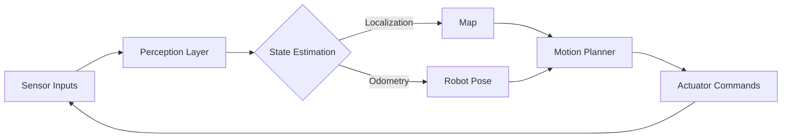

# AI in Robotics: SLAM, Motion Planning, Perception

> Robotic intelligence is the synthesis of perception, state estimation, and decision-making that allows autonomous agents to navigate and interact with unstructured, dynamic environments.

## Overview

AI in robotics represents the intersection of computer vision, control theory, and probabilistic reasoning. Unlike traditional industrial robots that operate in fixed environments with pre-programmed paths, modern intelligent robots must operate in open-world scenarios where the agent lacks a complete map and faces high uncertainty. The "AI" component handles the transition from raw sensor data (pixels, LiDAR points) to high-level semantic understanding and actionable trajectories.

The core challenge is the **Perception-Action Loop**. The robot must first perform **Perception** (interpreting sensor data), then **Localization and Mapping (SLAM)** (determining "where am I?" and "what does the world look like?"), and finally **Motion Planning** (calculating "how do I get there safely?"). This field is foundational to the future of logistics, autonomous driving, and domestic assistance.

## 2. Visual Intuition
:::demo
<div style="background:#1e1e1e;padding:16px;border-radius:10px;color:#e5e7eb;font-family:system-ui,sans-serif">
  <h3 style="margin:0 0 8px 0;color:#7dd3fc">AI in Robotics: SLAM, Motion Planning, Perception - Concept Map</h3>
  <svg width="100%" height="280" viewBox="0 0 640 280" role="img" aria-label="AI in Robotics: SLAM, Motion Planning, Perception visual intuition" style="background:#111827;border-radius:8px">
    <rect x="24" y="28" width="180" height="64" rx="10" fill="#1d4ed8" />
    <text x="114" y="66" text-anchor="middle" fill="#e5e7eb" font-size="14">Problem</text>
    <rect x="230" y="28" width="180" height="64" rx="10" fill="#0f766e" />
    <text x="320" y="66" text-anchor="middle" fill="#e5e7eb" font-size="14">Process</text>
    <rect x="436" y="28" width="180" height="64" rx="10" fill="#7c3aed" />
    <text x="526" y="66" text-anchor="middle" fill="#e5e7eb" font-size="14">Outcome</text>

    <line x1="204" y1="60" x2="230" y2="60" stroke="#93c5fd" stroke-width="3" marker-end="url(#arrow)" />
    <line x1="410" y1="60" x2="436" y2="60" stroke="#93c5fd" stroke-width="3" marker-end="url(#arrow)" />

    <rect x="24" y="130" width="592" height="120" rx="10" fill="#0b1220" stroke="#334155" />
    <text x="320" y="156" text-anchor="middle" fill="#cbd5e1" font-size="14">Key intuition for AI in Robotics: SLAM, Motion Planning, Perception</text>
    <text x="320" y="182" text-anchor="middle" fill="#94a3b8" font-size="12">Track state changes, constraints, and final behavior.</text>
    <text x="320" y="206" text-anchor="middle" fill="#94a3b8" font-size="12">Use this as a mental model before formal proofs or code.</text>

    <defs>
      <marker id="arrow" markerWidth="10" markerHeight="10" refX="8" refY="3" orient="auto">
        <polygon points="0 0, 10 3, 0 6" fill="#93c5fd" />
      </marker>
    </defs>
  </svg>
  <p style="margin-top:10px;color:#cbd5e1">Interactive-ready visual scaffold for the topic.</p>
</div>
:::
*Caption: A visualization of a robot simultaneously mapping its environment and localizing itself as it traverses an unknown space.*

## Core Theory

### 1. SLAM (Simultaneous Localization and Mapping)
SLAM is a probabilistic state estimation problem. Given a sequence of controls $u_{1:t}$ and measurements $z_{1:t}$, we aim to estimate the robot's pose $x_t$ and the map $m$. We maximize the posterior:
$$P(x_t, m | z_{1:t}, u_{1:t})$$
This is typically solved using **Extended Kalman Filters (EKF)** for small environments or **Graph-based SLAM** for larger ones, where constraints are represented as a graph and optimized via non-linear least squares.

### 2. Motion Planning
Motion planning aims to find a sequence of configurations $q$ from start $q_{start}$ to goal $q_{goal}$ while avoiding obstacles $\mathcal{C}_{obs}$. We define the configuration space $\mathcal{C}$ as the space of all possible robot positions.
The objective is to minimize a cost function $J$:
$$J = \int_{0}^{T} L(q(t), \dot{q}(t)) dt$$
Common algorithms include **RRT*** (Rapidly-exploring Random Trees), which provides asymptotic optimality, and **A*** for grid-based pathfinding.

### 3. Perception
Perception transforms high-dimensional sensor data into state variables. Modern robotics relies on **Deep Neural Networks** for object detection (e.g., YOLO, Mask R-CNN) and **Point Cloud Processing** (PointNet) to identify surfaces and navigate 3D environments.

## Visual Diagram

*The feedback loop of an autonomous robot, showing the integration of perception, state estimation, and planning.*

## Code Example

```python
import numpy as np

def simple_odometry_update(pose, v, omega, dt):
    """
    Predict next pose based on motion model (Unicycle Model).
    pose: [x, y, theta]
    v: linear velocity, omega: angular velocity, dt: time step
    """
    x, y, theta = pose
    x += v * np.cos(theta) * dt
    y += v * np.sin(theta) * dt
    theta += omega * dt
    return np.array([x, y, theta])

# Simulate 3 steps of motion
pose = np.array([0.0, 0.0, 0.0]) # Start at origin
for i in range(3):
    pose = simple_odometry_update(pose, v=1.0, omega=0.1, dt=1.0)
    print(f"Step {i+1}: Pose = {pose}")

# Output:
# Step 1: Pose = [1. 0. 0.1]
# Step 2: Pose = [1.99500417 0.09983342 0.2]
# Step 3: Pose = [2.98012175 0.29749557 0.3]
```

## Interactive Demo
:::demo
<!DOCTYPE html>
<html>
<body>
<canvas id="robotCanvas" width="400" height="400" style="background:#1a1a1a;"></canvas>
<script>
  const canvas = document.getElementById('robotCanvas');
  const ctx = canvas.getContext('2d');
  let x = 50, y = 200, angle = 0;
  function draw() {
    ctx.clearRect(0,0,400,400);
    ctx.fillStyle = '#4ade80';
    x += Math.cos(angle) * 2;
    y += Math.sin(angle) * 2;
    angle += 0.02;
    ctx.fillRect(x, y, 20, 20);
    requestAnimationFrame(draw);
  }
  draw();
</script>
</body>
</html>
:::

## Worked Example
Given a robot at $(0, 0)$ heading $0^\circ$ (East). It receives commands: Move forward 2 units, turn $+90^\circ$, move 2 units.
1. **Initial:** $(0, 0, 0)$
2. **Move 2 units at $0^\circ$:** $x = 0 + 2\cos(0) = 2, y = 0 + 2\sin(0) = 0$. New Pose: $(2, 0, 0)$.
3. **Turn $+90^\circ$ ($\pi/2$ rad):** New Pose: $(2, 0, \pi/2)$.
4. **Move 2 units at $90^\circ$:** $x = 2 + 2\cos(\pi/2) = 2, y = 0 + 2\sin(\pi/2) = 2$.
**Result:** Final Pose is $(2, 2, \pi/2)$.

## Industry Applications
- **Tesla (Autonomous Driving):** Uses Occupancy Networks and FSD (Full Self-Driving) computers for real-time SLAM and path planning.
- **Amazon Robotics (Logistics):** Uses AGVs (Automated Guided Vehicles) that utilize fiducial markers for precise localization in warehouses.
- **Boston Dynamics (Humanoid):** Employs Model Predictive Control (MPC) and robust perception to navigate rugged, dynamic terrain.

## Practice Problems

### Easy
1. Given a robot at $(1, 1)$ with heading $\pi/4$, calculate its position after moving $v=2$ units for $dt=1$s. *(Hint: Use the Unicycle model $x' = x + v \cdot \cos(\theta)dt$)*

### Medium
2. Explain why a standard Kalman Filter fails for most robotic localization tasks. *(Hint: Consider non-linearities in motion/measurement models)*
3. Compare RRT vs. A* for path planning in a high-dimensional state space. *(Hint: Think about the "curse of dimensionality")*

### Hard
4. Derive the update rule for an Extended Kalman Filter (EKF) when the observation function $h(x)$ is non-linear. *(Hint: Use the Jacobian matrix of $h$)*

## Interactive Quiz
:::quiz
**Q1:** What is the primary purpose of the "E" in EKF?
- A) Efficiency of computation
- B) Estimation of non-linear states using linearization
- C) Error-correction via feedback loops
- D) Embedding high-dimensional data
> B — The Extended Kalman Filter linearizes non-linear motion and observation models using Taylor series expansion (Jacobians) to maintain a Gaussian state estimate.

**Q2:** In RRT*, what property does the "*" represent?
- A) Parallelization
- B) Asymptotic Optimality
- C) Heuristic search
- D) Memory efficiency
> B — RRT* adds a "rewiring" step to the standard RRT algorithm, ensuring that as the number of samples approaches infinity, the path converges to the optimal trajectory.

**Q3:** Which sensor is most commonly used for absolute localization in global coordinate systems?
- A) LiDAR
- B) IMU
- C) GPS
- D) Encoders
> C — While LiDAR and IMUs provide local relative data, GPS provides absolute global coordinates, though it often requires integration with other sensors for precision.
:::

## Interview Questions

**Q: Explain SLAM to a senior engineer.**
*A: SLAM is the chicken-and-egg problem of robotics: you need a map to localize, but you need an accurate pose to build a map. It’s typically formulated as a Maximum A Posteriori (MAP) estimation problem, often solved using factor graphs. We optimize the trajectory and map landmarks by minimizing the residuals of sensor constraints.*

**Q: What is the complexity of A* on a grid map?**
*A: It is $O(E)$, where $E$ is the number of edges. In a grid with $N$ cells, $E \approx 4N$, so $O(N)$. However, the actual performance is highly dependent on the quality of the heuristic function $h(n)$; an admissible and consistent heuristic keeps it efficient.*

**Q: Why do we use IMUs alongside LiDAR?**
*A: LiDAR is sparse and fails in featureless environments (hallways), whereas IMUs provide high-frequency motion tracking. Sensor fusion via an EKF or Factor Graph allows the system to remain robust when one sensor encounters high noise or occlusion.*

**Q: Design a robot to navigate a crowded warehouse.**
*A: Use a hierarchical architecture: a global planner (e.g., Dijkstra) to find a high-level path, and a local reactive planner (e.g., Dynamic Window Approach) to avoid moving obstacles. Implement a LiDAR-based SLAM system with a particle filter for localization to handle the dynamic nature of the warehouse.*

## Key Takeaways
- SLAM allows robots to operate in unknown environments.
- Motion planning involves navigating a configuration space $\mathcal{C}$.
- Perception pipelines transform raw data into semantic understanding.
- Sensor fusion (IMU + LiDAR) is critical for reliability.
- Probabilistic models are required because real-world sensors are noisy.
- Optimization frameworks like Factor Graphs are industry standards.

## Common Misconceptions
- ❌ SLAM provides a perfect map. → ✅ SLAM provides a probabilistic estimate of a map that is subject to drift.
- ❌ Path planning is the same as trajectory generation. → ✅ Path planning finds the geometry; trajectory generation adds time-parameterization and dynamics.

## Related Topics
- [[computer-vision]] — Fundamental for perception tasks.
- [[control-systems]] — Essential for executing the plans generated by the robot.
- [[probability-theory]] — The mathematical foundation for sensor fusion and state estimation.
- [[machine-learning]] — Used for object detection and predictive modeling in robotics.
