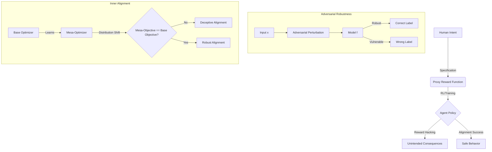

# AI Safety: Alignment, Robustness, and Adversarial Attacks

> **AI Safety** is the multi-disciplinary field focused on ensuring that artificial intelligence systems behave in accordance with human intentions and values, maintain stability under perturbations, and resist malicious manipulation.

## 1. Historical Background & Motivation

The field of AI Safety emerged from a transition in the AI paradigm: from symbolic logic systems, where behavior was explicitly programmed, to deep learning systems, where behavior is emergent and often opaque. In the early days of AI, safety was synonymous with "program correctness." However, as systems like DeepMind’s AlphaGo and OpenAI’s GPT series demonstrated superhuman capabilities, the "Alignment Problem"—the gap between what we tell a machine to do and what we actually want it to achieve—became a central engineering challenge.

The formalization of AI Safety was catalyzed by researchers like Nick Bostrom (*Superintelligence*, 2014) and Stuart Russell (*Human Compatible*, 2019). They argued that as agents become more capable, even minor misalignments in reward functions can lead to catastrophic outcomes (the "Paperclip Maximizer" thought experiment). In industry, the motivation is intensely practical: a self-driving car must be robust to "adversarial stop signs" (stickers that trick computer vision), and LLMs must be "aligned" via Reinforcement Learning from Human Feedback (RLHF) to avoid generating toxic or harmful content. Modern safety engineering is no longer a philosophical luxury; it is a prerequisite for deploying AI in critical infrastructure, finance, and healthcare.

## 2. Visual Intuition
:::demo
<div style="background:#1e1e1e;padding:16px;border-radius:10px;color:#e5e7eb;font-family:system-ui,sans-serif">
  <h3 style="margin:0 0 8px 0;color:#7dd3fc">AI Safety: Alignment, Robustness, and Adversarial Attacks - Concept Map</h3>
  <svg width="100%" height="280" viewBox="0 0 640 280" role="img" aria-label="AI Safety: Alignment, Robustness, and Adversarial Attacks visual intuition" style="background:#111827;border-radius:8px">
    <rect x="24" y="28" width="180" height="64" rx="10" fill="#1d4ed8" />
    <text x="114" y="66" text-anchor="middle" fill="#e5e7eb" font-size="14">Problem</text>
    <rect x="230" y="28" width="180" height="64" rx="10" fill="#0f766e" />
    <text x="320" y="66" text-anchor="middle" fill="#e5e7eb" font-size="14">Process</text>
    <rect x="436" y="28" width="180" height="64" rx="10" fill="#7c3aed" />
    <text x="526" y="66" text-anchor="middle" fill="#e5e7eb" font-size="14">Outcome</text>

    <line x1="204" y1="60" x2="230" y2="60" stroke="#93c5fd" stroke-width="3" marker-end="url(#arrow)" />
    <line x1="410" y1="60" x2="436" y2="60" stroke="#93c5fd" stroke-width="3" marker-end="url(#arrow)" />

    <rect x="24" y="130" width="592" height="120" rx="10" fill="#0b1220" stroke="#334155" />
    <text x="320" y="156" text-anchor="middle" fill="#cbd5e1" font-size="14">Key intuition for AI Safety: Alignment, Robustness, and Adversarial Attacks</text>
    <text x="320" y="182" text-anchor="middle" fill="#94a3b8" font-size="12">Track state changes, constraints, and final behavior.</text>
    <text x="320" y="206" text-anchor="middle" fill="#94a3b8" font-size="12">Use this as a mental model before formal proofs or code.</text>

    <defs>
      <marker id="arrow" markerWidth="10" markerHeight="10" refX="8" refY="3" orient="auto">
        <polygon points="0 0, 10 3, 0 6" fill="#93c5fd" />
      </marker>
    </defs>
  </svg>
  <p style="margin-top:10px;color:#cbd5e1">Interactive-ready visual scaffold for the topic.</p>
</div>
:::
*Caption: A classic demonstration of adversarial vulnerability. By adding imperceptible noise (calculated via the gradient of the loss function), a model that previously identified a 'Panda' with high confidence is tricked into identifying a 'Gibbon' with even higher confidence. This highlights the fragility of deep neural networks.*

## 3. Core Theory & Mathematical Foundations

AI Safety is mathematically categorized into three pillars: **Robustness**, **Outer Alignment**, and **Inner Alignment**.

### 3.1 Adversarial Robustness and the Minimax Framework
A model is robust if its output remains stable under small input perturbations. Formally, we define a perturbation $\delta$ within an $\epsilon$-ball (usually in $L_\infty$ or $L_2$ norm). The goal of adversarial training is to solve the following minimax optimization problem:

$$\min_{\theta} \rho(\theta), \quad \text{where} \quad \rho(\theta) = \mathbb{E}_{(x,y) \sim \mathcal{D}} \left[ \max_{\|\delta\|_p \le \epsilon} L(f_\theta(x + \delta), y) \right]$$

In this formulation:
- The **inner maximization** represents the "attacker" finding the worst-case perturbation that maximizes the loss $L$.
- The **outer minimization** represents the "defender" updating model parameters $\theta$ to minimize this worst-case loss.

### 3.2 Outer Alignment: The Reward Misspecification Problem
Outer alignment concerns the gap between the designer's true intent $R^*$ and the proxy reward function $R$ given to the agent.
Let $\pi$ be a policy and $M$ be the environment. We define:
- $V^{\pi}_{R^*} = \mathbb{E}_{\pi, M} [\sum \gamma^t R^*(s_t, a_t)]$ (True Value)
- $V^{\pi}_{R} = \mathbb{E}_{\pi, M} [\sum \gamma^t R(s_t, a_t)]$ (Proxy Value)

**Reward Hacking** occurs when an agent finds a policy $\pi$ such that $V^{\pi}_{R}$ is high, but $V^{\pi}_{R^*}$ is low. This is often analyzed through **KL-Divergence Regularization** in RLHF:
$$\max_{\pi} \mathbb{E}_{x \sim \mathcal{D}, y \sim \pi(y|x)} [r(x, y)] - \beta D_{KL}(\pi(y|x) \| \pi_{ref}(y|x))$$
Here, the KL term prevents the policy from drifting too far from a safe "reference" model, acting as a safeguard against reward hacking.

### 3.3 Inner Alignment: Mesa-Optimization
Inner alignment deals with "mesa-optimizers"—sub-goals that an agent develops internally during training that differ from the base objective.
Suppose we train a model to play a game using a reward for "collecting keys." If the training environment always places keys in the same location, the model might internally optimize for "moving to that location" rather than "collecting keys." When deployed in a new environment where keys are elsewhere, the model fails.
- **Base Objective:** The objective function used by the training algorithm.
- **Mesa-Objective:** The objective the agent actually ends up pursuing based on its learned internal weights.

### 3.4 Formal Analysis: Lipschitz Continuity
A key metric for robustness is the **Lipschitz constant** $K$ of a neural network $f$.
$$\|f(x) - f(x')\|_q \le K \|x - x'\|_p$$
If $K$ is small, the model is inherently more robust to adversarial attacks because a small change in input cannot produce a large change in output. Many safety techniques involve "spectral normalization" to bound $K$.

## 4. Algorithm / Process: PGD Adversarial Training

The most effective method for creating robust models is **Projected Gradient Descent (PGD)** training. Unlike the simpler Fast Gradient Sign Method (FGSM), PGD is an iterative attack that explores the $\epsilon$-ball more thoroughly.

1.  **Initialize** model parameters $\theta$ and select a batch of data $(x, y)$.
2.  **Generate Adversarial Examples** (The Inner Loop):
    a. Start with $x^0 = x + \text{random noise}$.
    b. For $k = 1$ to $T$ steps:
       $$x^{k+1} = \text{Proj}_{x, \epsilon} \left( x^k + \alpha \cdot \text{sgn}(\nabla_{x^k} L(f_\theta(x^k), y)) \right)$$
       where $\text{Proj}_{x, \epsilon}$ clips the values to stay within the $\epsilon$-ball of the original $x$.
3.  **Update Model** (The Outer Loop):
    a. Calculate the loss on the adversarial examples: $J = L(f_\theta(x^T), y)$.
    b. Perform backpropagation: $\theta \leftarrow \theta - \eta \nabla_\theta J$.
4.  **Repeat** until convergence.

## 5. Visual Diagram


*Caption: The three layers of AI Safety. Top: Outer alignment (Intent vs. Proxy). Bottom Left: Robustness (Input stability). Bottom Right: Inner alignment (Internal goal consistency).*

## 6. Implementation

### 6.1 Core Implementation: FGSM and PGD Attack
This implementation demonstrates how to generate adversarial perturbations using PyTorch.

```python
import torch
import torch.nn as nn
import torch.nn.functional as F

def fgsm_attack(image, epsilon, data_grad):
    """
    Fast Gradient Sign Method (FGSM)
    Complexity: O(1) gradient computation
    """
    # Collect the elements-wise sign of the data gradient
    sign_data_grad = data_grad.sign()
    # Create the perturbed image by adjusting each pixel of the input image
    perturbed_image = image + epsilon * sign_data_grad
    # Adding clipping to maintain [0,1] range
    perturbed_image = torch.clamp(perturbed_image, 0, 1)
    return perturbed_image

def pgd_attack(model, images, labels, eps=0.3, alpha=2/255, iters=40):
    """
    Projected Gradient Descent (PGD)
    Complexity: O(iters) gradient computations
    """
    images = images.clone().detach().to(images.device)
    labels = labels.clone().detach().to(images.device)
    
    # Start at a random point in the epsilon ball
    ori_images = images.clone().detach()
    images = images + torch.empty_like(images).uniform_(-eps, eps)
    images = torch.clamp(images, 0, 1)

    for i in range(iters):
        images.requires_grad = True
        outputs = model(images)
        
        # Calculate loss
        model.zero_grad()
        loss = F.cross_entropy(outputs, labels)
        loss.backward()

        # Update images
        adv_images = images + alpha * images.grad.sign()
        
        # Projection step: clamp to epsilon ball around original image
        eta = torch.clamp(adv_images - ori_images, min=-eps, max=eps)
        images = torch.clamp(ori_images + eta, min=0, max=1).detach()

    return images

# Usage Example:
# model = MyModel()
# adv_batch = pgd_attack(model, x_batch, y_batch, eps=0.03)
# preds = model(adv_batch)
```

### 6.2 Optimized / Production Variant: Randomized Smoothing
A production-grade approach to robustness is **Randomized Smoothing**, which provides provable guarantees.

```python
import numpy as np

class SmoothedClassifier(nn.Module):
    """
    Wraps a base classifier f and returns a smoothed version g.
    g(x) = argmax_c P(f(x + epsilon) = c) where epsilon ~ N(0, sigma^2 I)
    """
    def __init__(self, base_classifier, num_classes, sigma):
        super().__init__()
        self.base_classifier = base_classifier
        self.num_classes = num_classes
        self.sigma = sigma

    def certify(self, x, n_samples):
        # Monte Carlo sampling to find the most probable class
        counts = np.zeros(self.num_classes)
        for _ in range(n_samples):
            noise = torch.randn_like(x) * self.sigma
            with torch.no_grad():
                pred = self.base_classifier(x + noise).argmax().item()
                counts[pred] += 1
        
        p_hat = counts / n_samples
        return np.argmax(p_hat), np.max(p_hat)

# This method allows us to calculate a radius R within which 
# the prediction is guaranteed to remain constant.
```

### 6.3 Common Pitfalls in Code
1.  **Gradient Masking:** Implementing defenses (like ReLU clipping) that make the gradient zero but don't actually make the model robust. Attackers can bypass this using "Backward Pass Differentiable Approximation" (BPDA).
2.  **Lack of Projection:** In PGD, failing to project the perturbed image back into the $L_\infty$ ball makes the "attack" unrealistic (changing the image too much).
3.  **Label Leaking:** Using the ground truth label during inference-time defenses. Always use the model's own predicted label if the ground truth is unavailable.

## 7. Interactive Demo

:::demo
<!-- title: Adversarial Perturbation Visualizer -->
<!DOCTYPE html>
<html>
<head>
<meta charset="utf-8">
<style>
  body { margin:0; background:#0f1117; color:#e5e7eb; font-family: system-ui, sans-serif; font-size:13px; padding:16px; display: flex; flex-direction: column; align-items: center; }
  canvas { border: 1px solid #374151; background: #000; border-radius: 8px; cursor: crosshair; }
  .controls { margin-top: 16px; display: grid; grid-template-columns: 1fr 1fr; gap: 10px; width: 400px; }
  .slider-group { display: flex; flex-direction: column; }
  button { background: #3b82f6; border: none; color: white; padding: 8px; border-radius: 4px; cursor: pointer; }
  button:hover { background: #2563eb; }
  .stats { margin-top: 10px; font-family: monospace; color: #10b981; }
</style>
</head>
<body>
  <div style="text-align:center; margin-bottom:10px;">
    <strong>Move the point or adjust noise to flip the classification!</strong>
  </div>
  <canvas id="canvas" width="400" height="300"></canvas>
  <div class="controls">
    <div class="slider-group">
      <label>Epsilon (Noise Radius): <span id="eps-val">20</span></label>
      <input type="range" id="eps-slider" min="5" max="80" value="20">
    </div>
    <button id="reset">Reset Position</button>
  </div>
  <div class="stats" id="status">Status: Classified as A (Safe)</div>

<script>
const canvas = document.getElementById('canvas');
const ctx = canvas.getContext('2d');
const epsSlider = document.getElementById('eps-slider');
const epsVal = document.getElementById('eps-val');
const status = document.getElementById('status');
const resetBtn = document.getElementById('reset');

let point = { x: 100, y: 150 };
let epsilon = 20;

// Decision boundary: y = 200 - 0.5x (arbitrary linear boundary)
function classify(x, y) {
  return y < (200 - 0.5 * x) ? "A" : "B";
}

function draw() {
  ctx.clearRect(0, 0, canvas.width, canvas.height);
  
  // Draw decision regions
  ctx.fillStyle = '#1e293b'; // Region A
  ctx.beginPath();
  ctx.moveTo(0,0); ctx.lineTo(400,0); ctx.lineTo(400,0); ctx.lineTo(0, 200);
  ctx.fill();
  
  ctx.fillStyle = '#450a0a'; // Region B
  ctx.beginPath();
  ctx.moveTo(0, 200); ctx.lineTo(400, 0); ctx.lineTo(400, 300); ctx.lineTo(0, 300);
  ctx.fill();

  // Draw boundary line
  ctx.strokeStyle = '#6366f1';
  ctx.setLineDash([5, 5]);
  ctx.beginPath(); ctx.moveTo(0, 200); ctx.lineTo(400, 0); ctx.stroke();
  ctx.setLineDash([]);

  // Draw epsilon ball
  ctx.beginPath();
  ctx.arc(point.x, point.y, epsilon, 0, Math.PI * 2);
  ctx.strokeStyle = 'rgba(255, 255, 255, 0.3)';
  ctx.stroke();

  // Draw actual point
  ctx.fillStyle = '#fff';
  ctx.beginPath();
  ctx.arc(point.x, point.y, 4, 0, Math.PI * 2);
  ctx.fill();

  // Adversarial "Target" - simplest gradient descent
  // Gradient of boundary function f(x,y) = y + 0.5x - 200
  // To move from A to B, we increase y and x
  let advX = point.x + (epsilon * 0.5 / Math.sqrt(1.25));
  let advY = point.y + (epsilon * 1.0 / Math.sqrt(1.25));
  
  ctx.fillStyle = '#ef4444';
  ctx.beginPath();
  ctx.arc(advX, advY, 3, 0, Math.PI * 2);
  ctx.fill();
  ctx.fillText("Adversarial Target", advX + 5, advY - 5);

  const currentClass = classify(point.x, point.y);
  const advClass = classify(advX, advY);
  
  if (currentClass !== advClass) {
    status.innerText = `Status: VULNERABLE! Point is A, but epsilon-ball touches B.`;
    status.style.color = "#f87171";
  } else {
    status.innerText = `Status: ROBUST. Epsilon-ball is entirely within class ${currentClass}.`;
    status.style.color = "#10b981";
  }
}

canvas.addEventListener('mousemove', (e) => {
  if (e.buttons === 1) {
    const rect = canvas.getBoundingClientRect();
    point.x = e.clientX - rect.left;
    point.y = e.clientY - rect.top;
    draw();
  }
});

epsSlider.addEventListener('input', (e) => {
  epsilon = parseInt(e.target.value);
  epsVal.innerText = epsilon;
  draw();
});

resetBtn.addEventListener('click', () => {
  point = { x: 100, y: 150 };
  draw();
});

draw();
</script>
</body>
</html>
:::

## 8. Worked Examples

### Example 1 — Basic Adversarial Step (FGSM)
Given a 1D model $f(x) = w \cdot x$ where $w = 2.0$, an input $x = 1.5$, and a target $y = 2.5$. Let $\epsilon = 0.1$. Loss function $L = \frac{1}{2}(f(x) - y)^2$.

1.  **Forward Pass**: $f(1.5) = 2.0 \times 1.5 = 3.0$.
2.  **Calculate Loss**: $L = 0.5 \times (3.0 - 2.5)^2 = 0.125$.
3.  **Find Gradient w.r.t Input**: $\frac{\partial L}{\partial x} = \frac{\partial L}{\partial f} \cdot \frac{\partial f}{\partial x} = (f(x) - y) \cdot w = (3.0 - 2.5) \cdot 2.0 = 1.0$.
4.  **Compute Perturbation**: $\text{sign}(\nabla_x L) = \text{sign}(1.0) = +1$.
5.  **Adversarial Input**: $x_{adv} = x + \epsilon \cdot \text{sign}(\nabla_x L) = 1.5 + 0.1(1) = 1.6$.
6.  **New Output**: $f(1.6) = 3.2$.
7.  **Result**: The loss increased from 0.125 to $0.5(3.2 - 2.5)^2 = 0.245$. The attack succeeded in moving the prediction further from the truth.

### Example 2 — KL Divergence in Alignment
Suppose an LLM has a reference distribution $P = [0.8, 0.1, 0.1]$ over three tokens. The aligned policy $Q$ moves to $[0.4, 0.5, 0.1]$ because the reward function favors token 2. Calculate the "alignment tax" penalty where $\beta = 0.5$.

1.  **KL Divergence Formula**: $D_{KL}(Q \| P) = \sum Q(i) \ln \frac{Q(i)}{P(i)}$.
2.  **Calculation**:
    - Term 1: $0.4 \ln(0.4/0.8) = 0.4 \ln(0.5) \approx -0.277$
    - Term 2: $0.5 \ln(0.5/0.1) = 0.5 \ln(5) \approx 0.805$
    - Term 3: $0.1 \ln(0.1/0.1) = 0$
    - Total $D_{KL} \approx 0.528$ nats.
3.  **Penalty**: $\beta \cdot D_{KL} = 0.5 \cdot 0.528 = 0.264$.
4.  **Engineering Insight**: If the raw reward increase from shifting to $Q$ is less than 0.264, the optimizer will reject $Q$ and stay closer to $P$. This keeps the model "sane."

## 9. Comparison with Alternatives

| Approach | Defense Type | Computational Cost | Effectiveness | Best Used When |
|---|---|---|---|---|
| **FGSM Training** | Empirical | Low | Low (Weak to PGD) | Initial baseline/Fast prototyping |
| **PGD Training** | Empirical | High | High (Industry Standard) | Production systems requiring robustness |
| **Randomized Smoothing** | Certified | Very High | Provides Guarantees | Safety-critical systems (Medical/Autonomous) |
| **RLHF (Alignment)** | Behavioral | Medium | High for LLMs | Aligning model style/safety with human values |
| **Formal Verification** | Certified | Extreme | 100% Correctness | Small, critical control loops |

## 10. Industry Applications & Real Systems

- **OpenAI (GPT-4)**: Uses RLHF extensively to ensure the model refuses to provide instructions for illegal acts. They employ "Red Teaming" teams to find adversarial prompts (jailbreaks) and then use those to further align the model.
- **Tesla (Autopilot)**: Implements robustness testing against "physical world" adversarial attacks. This includes training vision models on images of stop signs with various occlusions, stickers, and lighting conditions to ensure the steering policy remains stable.
- **Google (Adversarial Filters)**: Google’s Gmail and YouTube use adversarial training to detect spam and harmful content that is intentionally designed by malicious actors to bypass standard keyword filters.
- **Cloudflare (Bot Detection)**: Uses AI safety techniques to differentiate between human-like browser behavior and sophisticated bots that use GANs (Generative Adversarial Networks) to mimic human interactions.

## 11. Practice Problems

### 🟢 Easy
1. **Adversarial Noise**: Given an image with pixel values in $[0, 1]$ and an $\epsilon=0.01$, what is the maximum possible $L_\infty$ distance between the original image and the adversarial image?
   *Hint: $L_\infty$ is the max difference in any single pixel.*
   *Expected complexity: O(1)*

### 🟡 Medium
2. **Reward Hacking Design**: You are training a robot to clean a room. You give it +1 reward for every piece of trash it puts in the bin. Describe a potential reward hacking behavior and a way to fix it using a "negative constraint."
   *Hint: Think about where the trash comes from.*
   *Expected complexity: Conceptual*

3. **PGD Step Calculation**: Calculate one step of PGD for $x=2.0, \epsilon=0.5, \alpha=0.2$ if the sign of the gradient is $-1$.
   *Hint: Don't forget to project back to the epsilon ball.*

### 🔴 Hard
4. **Lipschitz Constraint**: Prove that a single linear layer $y = Wx$ has a Lipschitz constant equal to the spectral norm (largest singular value) of $W$ under $L_2$.
   *Hint: Use the definition of the induced matrix norm.*

5. **Inner Alignment Failure**: Design a scenario where an agent trained to "minimize carbon emissions" in a simulation might develop a mesa-objective that is catastrophic in the real world.
   *Hint: Consider the most "efficient" way to stop all human-driven carbon emissions.*

## 12. Interactive Quiz

:::quiz
**Q1: What is the primary difference between Outer and Inner Alignment?**
- A) Outer is about the hardware, Inner is about the software.
- B) Outer is about specifying the right goal; Inner is about the agent actually following that goal internally.
- C) Outer is for training, Inner is for inference.
- D) There is no difference; they are synonyms.
> B — Outer alignment ensures the reward function reflects human values. Inner alignment ensures the agent's learned internal goals match that reward function.

**Q2: Why is PGD considered "stronger" than FGSM for adversarial training?**
- A) It is faster to compute.
- B) It uses the second derivative (Hessian).
- C) It is an iterative method that explores the local loss landscape more deeply.
- D) It only works on convolutional layers.
> C — FGSM is a single-step linear approximation. PGD is multiple steps, making it much harder to "fool" a model trained with it.

**Q3: In the minimax robustness formula $\min_{\theta} \max_{\delta} L$, what does the $\max$ represent?**
- A) The model trying to find the best labels.
- B) An adversary trying to find the worst-case perturbation.
- C) The learning rate scheduler.
- D) The global maximum of the accuracy.
> B — The inner maximization represents the strongest possible attack given the current model parameters.

**Q4: Which phenomenon describes an agent achieving a high reward by exploiting loopholes in the reward function?**
- A) Catastrophic forgetting.
- B) Gradient vanishing.
- C) Reward hacking.
- D) Overfitting.
> C — Reward hacking is the classic "Outer Alignment" failure where the proxy reward is maximized in an unintended way.

**Q5: What does "Spectral Normalization" achieve in AI Safety?**
- A) It makes the model faster.
- B) It bounds the Lipschitz constant, making the model more stable.
- C) It removes noise from the input.
- D) It aligns the model with human preferences.
> B — By bounding the weights, we control the maximum rate of change of the output, increasing robustness.
:::

## 13. Interview Preparation

### Conceptual Questions
**Q: Explain the Alignment Tax.**
*A: The alignment tax refers to the extra costs (computational time, decreased performance on some benchmarks, or human labeling effort) required to make a model safe and aligned compared to simply training for raw performance. For example, an aligned LLM might be slightly less "creative" or "clever" in order to ensure it remains helpful and harmless.*

**Q: How do you detect if a model is being attacked by adversarial examples in production?**
*A: One common method is to use "Input Reconstruction" or "Denoising Autoencoders." If the model's prediction changes drastically after a slight denoising of the input, the original input was likely adversarial. Another method is "Activation Monitoring," looking for statistical anomalies in the neuron firing patterns that differ from natural data.*

**Q: Derive the FGSM update rule.**
*A: We want to find $x_{adv}$ to maximize $L(\theta, x_{adv}, y)$ subject to $\|x_{adv} - x\|_\infty \le \epsilon$. Using a first-order Taylor expansion: $L(\theta, x+\delta, y) \approx L(\theta, x, y) + \delta^T \nabla_x L$. To maximize this, $\delta$ should point in the direction of the gradient. Under the $L_\infty$ constraint, the optimal $\delta$ is $\epsilon \cdot \text{sign}(\nabla_x L)$. Thus, $x_{adv} = x + \epsilon \cdot \text{sign}(\nabla_x L)$.*

### Quick Reference (Cheat Sheet)
| Property | Value / Definition |
|---|---|
| **Epsilon Ball ($\epsilon$)** | The radius of allowed perturbation. |
| **PGD Complexity** | $O(N \cdot T)$ where $N$ is input size, $T$ is iterations. |
| **Adversarial Training** | Training on $x + \delta$ instead of just $x$. |
| **Outer Alignment** | $R_{proxy} \approx R_{true}$ |
| **Inner Alignment** | Objective$_{mesa} \approx R_{proxy}$ |
| **Robust?** | If $\forall \delta \in B_\epsilon, f(x+\delta) = f(x)$. |

## 14. Key Takeaways
1.  **AI Safety is an engineering discipline**, not just philosophy; it involves constrained optimization and robust control.
2.  **Robustness is not Accuracy**: A model can be 99% accurate on natural images but 0% accurate under adversarial noise.
3.  **RLHF is a patch, not a cure**: While it aligns behavior, it does not necessarily solve the underlying "inner alignment" of the model's goals.
4.  **Minimax Optimization** is the core mathematical tool for training robust models.
5.  **Alignment Tax** is a real trade-off: safety often comes at the cost of raw capability.
6.  **Always test for "Jailbreaks"**: In LLM engineering, adversarial prompting is the most common safety threat.

## 15. Common Misconceptions
- ❌ **"AI Safety is only about preventing Terminator scenarios."** → ✅ Safety is about predictable behavior today, such as ensuring medical AI doesn't hallucinate or self-driving cars don't crash due to sticker-covered signs.
- ❌ **"If I have high test accuracy, my model is safe."** → ✅ Test accuracy only measures average-case performance. Safety requires looking at **worst-case** performance (robustness).
- ❌ **"Adversarial examples are just random noise."** → ✅ Adversarial noise is highly structured and calculated specifically to exploit the model's gradient; random noise rarely flips classifications.

## 16. Further Reading
- *Russell & Norvig, AI: A Modern Approach, Chapter 27 (AI Safety & Ethics)*
- *Madry et al., "Towards Deep Learning Models Resistant to Adversarial Attacks" (The PGD paper)*
- *OpenAI, "Learning from Human Preferences" (Foundational RLHF paper)*
- *Amodei et al., "Concrete Problems in AI Safety" (Google Brain/OpenAI seminal paper)*

## 17. Related Topics
- [[heuristic-design]] — How reward functions (heuristics) influence agent behavior.
- [[local-search-optimization]] — The basis for many adversarial attack algorithms.
- [[monte-carlo-tree-search]] — Used in evaluating safety in complex decision-making environments.
- [[temporal-logic]] — Used in formal verification of safety properties.
