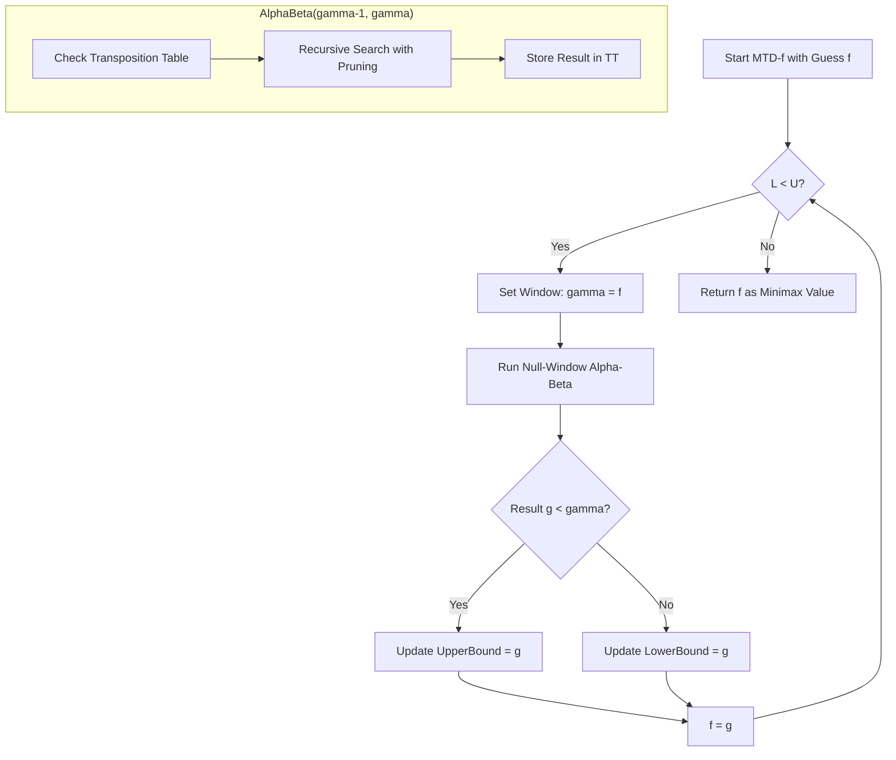

# Alpha-Beta Pruning Enhancements: MTD(f) and Iterative Deepening

> **MTD(f)** is a minimax-equivalent search algorithm that converges on the optimal game-tree value through a series of zero-window alpha-beta calls, leveraging iterative deepening and transposition tables for maximum efficiency.

## 1. Historical Background & Motivation

In the 1970s and 80s, the Alpha-Beta pruning algorithm (formalized by Knuth and Moore in 1975) was the undisputed gold standard for adversarial search. However, as computational power grew and game trees (like those in Chess or Go) became deeper, researchers realized that the wide $(\alpha, \beta)$ search window used in traditional Alpha-Beta was often redundant. If you have a good estimate of the value of a position, searching with a wide window is inefficient because it explores many branches that ultimately fall outside that window. 

The breakthrough came in 1994 when Aske Plaat, Jonathan Schaeffer, Wim Pijls, and Arie de Bruin introduced **MTD(f)** (Memory-enhanced Test Driver). They observed that a "null-window" search (where $\beta = \alpha + 1$) is significantly faster at proving whether a node's value is higher or lower than a specific threshold than a wide-window search is at finding the exact value. MTD(f) works by "guessing" the value of the root and calling Alpha-Beta with a null window around that guess. It iteratively refines this guess until it converges on the exact minimax value. Combined with **Iterative Deepening** and **Transposition Tables**, MTD(f) outperformed traditional Alpha-Beta in the world-class chess engine *Phoenix* and remains a critical study for high-performance AI systems where search efficiency is paramount.

## 2. Visual Intuition
:::demo
<div style="background:#1e1e1e;padding:16px;border-radius:10px;color:#e5e7eb;font-family:system-ui,sans-serif">
  <h3 style="margin:0 0 8px 0;color:#7dd3fc">Alpha-Beta Pruning Enhancements: MTD(f) and Iterative Deepening - Concept Map</h3>
  <svg width="100%" height="280" viewBox="0 0 640 280" role="img" aria-label="Alpha-Beta Pruning Enhancements: MTD(f) and Iterative Deepening visual intuition" style="background:#111827;border-radius:8px">
    <rect x="24" y="28" width="180" height="64" rx="10" fill="#1d4ed8" />
    <text x="114" y="66" text-anchor="middle" fill="#e5e7eb" font-size="14">Problem</text>
    <rect x="230" y="28" width="180" height="64" rx="10" fill="#0f766e" />
    <text x="320" y="66" text-anchor="middle" fill="#e5e7eb" font-size="14">Process</text>
    <rect x="436" y="28" width="180" height="64" rx="10" fill="#7c3aed" />
    <text x="526" y="66" text-anchor="middle" fill="#e5e7eb" font-size="14">Outcome</text>

    <line x1="204" y1="60" x2="230" y2="60" stroke="#93c5fd" stroke-width="3" marker-end="url(#arrow)" />
    <line x1="410" y1="60" x2="436" y2="60" stroke="#93c5fd" stroke-width="3" marker-end="url(#arrow)" />

    <rect x="24" y="130" width="592" height="120" rx="10" fill="#0b1220" stroke="#334155" />
    <text x="320" y="156" text-anchor="middle" fill="#cbd5e1" font-size="14">Key intuition for Alpha-Beta Pruning Enhancements: MTD(f) and Iterative Deepening</text>
    <text x="320" y="182" text-anchor="middle" fill="#94a3b8" font-size="12">Track state changes, constraints, and final behavior.</text>
    <text x="320" y="206" text-anchor="middle" fill="#94a3b8" font-size="12">Use this as a mental model before formal proofs or code.</text>

    <defs>
      <marker id="arrow" markerWidth="10" markerHeight="10" refX="8" refY="3" orient="auto">
        <polygon points="0 0, 10 3, 0 6" fill="#93c5fd" />
      </marker>
    </defs>
  </svg>
  <p style="margin-top:10px;color:#cbd5e1">Interactive-ready visual scaffold for the topic.</p>
</div>
:::
*Caption: A standard Alpha-Beta search. MTD(f) enhances this by narrowing the search window to a single point, effectively turning the search into a sequence of boolean "Is the value greater than X?" tests.*

## 3. Core Theory & Mathematical Foundations

### 3.1 The Null-Window Search (NWS)
In a standard Alpha-Beta call `AlphaBeta(node, alpha, beta)`, the algorithm returns a value $v$ such that:
1. If $\alpha < v < \beta$, then $v$ is the exact minimax value.
2. If $v \leq \alpha$, then $v$ is an upper bound on the minimax value ($fail\_low$).
3. If $v \geq \beta$, then $v$ is a lower bound on the minimax value ($fail\_high$).

A **Null-Window Search** (or Scout search) uses a window of $[\gamma-1, \gamma]$. Because the window is as small as possible, the algorithm triggers cutoffs much earlier. It doesn't return the exact value unless it happens to be $\gamma$; instead, it returns a boolean-like result: "Is the minimax value $\geq \gamma$ or $< \gamma$?"

### 3.2 Convergence via Binary Search vs. MTD(f)
One could use binary search to find the minimax value $V$ within a range $[MIN, MAX]$. However, MTD(f) uses a more sophisticated approach. Given a starting guess $f$, it performs a null-window search at $f$. 
- If the search returns a value $g < f$, we know $V \leq g$.
- If the search returns a value $g \geq f$, we know $V \geq g$.

The sequence of guesses $f_1, f_2, \dots, f_n$ converges to $V$. Mathematically, MTD(f) maintains an upper bound $U$ and a lower bound $L$. When $L=U$, the minimax value is found.

### 3.3 The Role of the Transposition Table (TT)
MTD(f) is practically impossible without a Transposition Table. Because the algorithm calls the search function multiple times for the same depth, it must store previously computed results. A TT entry typically stores:
$$TT[hash] = \{value, depth, flag, best\_move\}$$
where $flag \in \{EXACT, LOWERBOUND, UPPERBOUND\}$.

The efficiency of MTD(f) relies on the fact that each successive null-window search "re-uses" the tree structure stored in the TT from the previous pass.

### 3.4 Formal Analysis (Complexity / Correctness)
**Correctness:** MTD(f) is correct because it eventually brackets the minimax value $V$ between $L$ and $U$ until $L=U$. Since each Alpha-Beta call with a null window $[\gamma-1, \gamma]$ correctly identifies if $V \geq \gamma$, the bounds are valid.

**Time Complexity:** In the best case (perfect move ordering), Alpha-Beta searches $O(b^{d/2})$ nodes. MTD(f) approaches this theoretical limit more consistently than standard Alpha-Beta because its narrow windows maximize pruning. However, in the worst case, it can perform slightly worse due to the overhead of multiple passes.
$$N_{nodes} \approx k \cdot b^{d/2}$$
where $k$ is a small constant representing the number of MTD(f) iterations (usually < 10).

**Space Complexity:** dominated by the Transposition Table, $O(M)$, where $M$ is the number of entries in the hash table (typically $2^{20}$ to $2^{25}$ in modern engines).

## 4. Algorithm / Process (Step-by-Step)

1.  **Initialize**: Set an initial guess $f$ (usually 0 or the result from the previous depth).
2.  **Iterative Deepening Loop**: For depth $d = 1$ to $MaxDepth$:
    1.  **MTD(f) Loop**: While $LowerBound < UpperBound$:
        1.  Set $\gamma = f + (f == LowerBound ? 1 : 0)$. 
        2.  $g = AlphaBetaWithTT(root, \gamma-1, \gamma, d)$.
        3.  If $g < \gamma$: $UpperBound = g$.
        4.  Else: $LowerBound = g$.
        5.  $f = g$.
    2.  Store $f$ as the starting guess for depth $d+1$.
3.  **AlphaBetaWithTT**:
    1.  Check TT for current node at current depth.
    2.  If TT hit and stored bounds allow pruning, return stored value.
    3.  Perform standard Alpha-Beta search with null window.
    4.  Store result in TT with appropriate flag (Upper/Lower/Exact).

## 5. Visual Diagram


*Caption: The control flow of the MTD(f) driver logic, showing how the bounds converge based on null-window search results.*

## 6. Implementation

### 6.1 Core Implementation

```python
import collections

# Transposition Table Flags
EXACT, LOWERBOUND, UPPERBOUND = 0, 1, 2

class TranspositionTable:
    def __init__(self, size_limit=10**6):
        self.table = {}
        self.size_limit = size_limit

    def store(self, key, value, depth, flag):
        if len(self.table) >= self.size_limit:
            self.table.pop(next(iter(self.table))) # Basic eviction
        self.table[key] = (value, depth, flag)

    def lookup(self, key):
        return self.table.get(key)

def alpha_beta_tt(state, alpha, beta, depth, tt):
    """
    Alpha-beta search with Transposition Table support.
    """
    orig_alpha = alpha
    entry = tt.lookup(state.hash())
    
    if entry and entry[1] >= depth:
        val, ent_depth, flag = entry
        if flag == EXACT: return val
        elif flag == LOWERBOUND: alpha = max(alpha, val)
        elif flag == UPPERBOUND: beta = min(beta, val)
        if alpha >= beta: return val

    if depth == 0 or state.is_terminal():
        return state.evaluate()

    best_val = float('-inf')
    for move in state.get_moves():
        val = -alpha_beta_tt(state.make_move(move), -beta, -alpha, depth - 1, tt)
        best_val = max(best_val, val)
        alpha = max(alpha, val)
        if alpha >= beta:
            break

    # TT Store Logic
    flag = EXACT
    if best_val <= orig_alpha: flag = UPPERBOUND
    elif best_val >= beta: flag = LOWERBOUND
    tt.store(state.hash(), best_val, depth, flag)
    
    return best_val

def mtd_f(root_state, first_guess, depth, tt):
    """
    MTD(f) Driver: Iteratively calls Alpha-Beta with null windows.
    """
    g = first_guess
    upper_bound = float('inf')
    lower_bound = float('-inf')
    
    while lower_bound < upper_bound:
        # Step value for null window
        beta = g + (1 if g == lower_bound else 0)
        # Search with null window [beta-1, beta]
        g = alpha_beta_tt(root_state, beta - 1, beta, depth, tt)
        
        if g < beta:
            upper_bound = g
        else:
            lower_bound = g
            
    return g

# Example usage (Pseudocode for state)
# result = mtd_f(initial_state, 0, 10, TranspositionTable())
```

### 6.2 Optimized / Production Variant (Iterative Deepening)

```python
def iterative_deepening_mtd_f(state, max_depth):
    tt = TranspositionTable()
    last_guess = 0
    
    for d in range(1, max_depth + 1):
        # We use the previous depth's result as the starting guess for the next
        last_guess = mtd_f(state, last_guess, d, tt)
        print(f"Depth {d}: Value {last_guess}")
        
    return last_guess
```

### 6.3 Common Pitfalls in Code
*   **TT Overwrite Policy**: Not all TT entries are equal. Deep searches should prioritize entries with higher `depth` over newer but shallower entries.
*   **Search Instability**: In games with cycles or specific move ordering issues, MTD(f) might oscillate between two values. A safeguard (like a maximum iteration count in the `while` loop) is often necessary.
*   **Null-Window Offset**: The logic `beta = g + (1 if g == lower_bound else 0)` is critical. If `g` doesn't change, the algorithm can get stuck in an infinite loop without this increment.

## 7. Interactive Demo

:::demo
<!-- title: MTD(f) Convergence Visualization -->
<!DOCTYPE html>
<html>
<head>
<meta charset="utf-8">
<style>
  body { margin:0; background:#0f1117; color:#e5e7eb; font-family: monospace; padding:16px; }
  .container { display: flex; flex-direction: column; align-items: center; }
  .bounds-box { width: 400px; height: 40px; border: 2px solid #3b82f6; position: relative; margin: 20px; background: #1e293b; }
  .target { position: absolute; width: 4px; height: 100%; background: #ef4444; left: 70%; top: 0; }
  .guess { position: absolute; width: 2px; height: 100%; background: #fbbf24; transition: left 0.5s; }
  .marker { position: absolute; height: 100%; background: rgba(59, 130, 246, 0.3); }
  .controls { margin-bottom: 20px; }
  button { padding: 8px 16px; cursor: pointer; background: #3b82f6; border: none; color: white; border-radius: 4px; }
  .log { width: 400px; height: 150px; background: #000; overflow-y: auto; padding: 10px; font-size: 12px; border: 1px solid #333; }
</style>
</head>
<body>
<div class="container">
  <h3>MTD(f) Convergence Simulation</h3>
  <div class="controls">
    <button onclick="step()">Next Step</button>
    <button onclick="reset()">Reset</button>
  </div>
  <div class="bounds-box" id="box">
    <div class="target" id="target" style="left: 62%;"></div>
    <div class="guess" id="guess_line"></div>
    <div class="marker" id="lower_mark"></div>
    <div class="marker" id="upper_mark"></div>
  </div>
  <div id="status">L: -100 | U: +100 | Guess: 0</div>
  <div class="log" id="log"></div>
</div>

<script>
  let L = -100, U = 100, g = 0, target = 62;
  const logEl = document.getElementById('log');
  const guessEl = document.getElementById('guess_line');
  const lowerEl = document.getElementById('lower_mark');
  const upperEl = document.getElementById('upper_mark');
  const statusEl = document.getElementById('status');

  function updateUI() {
    guessEl.style.left = `${(g + 100) / 2}%`;
    lowerEl.style.left = '0%';
    lowerEl.style.width = `${(L + 100) / 2}%`;
    upperEl.style.left = `${(U + 100) / 2}%`;
    upperEl.style.width = `${100 - (U + 100) / 2}%`;
    statusEl.innerText = `L: ${L.toFixed(1)} | U: ${U.toFixed(1)} | Guess: ${g.toFixed(1)}`;
  }

  function step() {
    if (L >= U) {
      addLog("Converged!");
      return;
    }
    let beta = g + (g === L ? 0.5 : 0);
    addLog(`Searching with window [${beta-0.5}, ${beta}]...`);
    
    // Simulate Alpha-Beta Call
    let result = (target > (beta + 100) / 2 * 2 - 100) ? beta + 5 : beta - 5;
    // Keep within bounds for visual
    result = Math.max(L, Math.min(U, result));

    if (result < beta) {
      U = result;
      addLog(`Fail Low: New Upper Bound = ${U}`);
    } else {
      L = result;
      addLog(`Fail High: New Lower Bound = ${L}`);
    }
    g = result;
    updateUI();
  }

  function addLog(msg) {
    const div = document.createElement('div');
    div.innerText = `> ${msg}`;
    logEl.prepend(div);
  }

  function reset() {
    L = -100; U = 100; g = 0;
    target = Math.random() * 80 + 10;
    document.getElementById('target').style.left = target + '%';
    logEl.innerHTML = '';
    updateUI();
    addLog("System Reset. Target value hidden.");
  }

  reset();
</script>
</body>
</html>
:::

## 8. Worked Examples

### Example 1 — Basic Convergence
Suppose the actual minimax value of a tree is **25**. We start MTD(f) with an initial guess $f = 0$ and bounds $L = -\infty, U = +\infty$.

1.  **Iteration 1**:
    - Window: $[\gamma-1, \gamma] = [-1, 0]$.
    - Search: Value is 25, which is $\geq 0$. Result $g = 25$ (Lower Bound).
    - Update: $L = 25, f = 25$.
2.  **Iteration 2**:
    - Window: $g == L$, so $\gamma = 25 + 1 = 26$. Window $[25, 26]$.
    - Search: Value is 25, which is $< 26$. Result $g = 25$ (Upper Bound).
    - Update: $U = 25, f = 25$.
3.  **Termination**: $L = 25, U = 25$. Return 25.

### Example 2 — Iterative Deepening Interaction
In a real game, depth 4 might return a value of **+1.5**. 
When starting depth 5, instead of starting from 0, MTD(f) starts at **+1.5**. 
If the position improved, the first null-window search at +1.5 will "fail high," immediately setting the lower bound to a value $\geq 1.5$. This significantly prunes the search space because we don't even consider branches that result in values lower than the previously established +1.5.

## 9. Comparison with Alternatives

| Approach | Node Efficiency | Implementation Complexity | Best Used When |
| :--- | :--- | :--- | :--- |
| **Minimax** | $O(b^d)$ | Trivial | Depth < 3, pedagogical use. |
| **Alpha-Beta** | $O(b^{3d/4})$ to $O(b^{d/2})$ | Moderate | General purpose adversarial search. |
| **PVS (Principal Variation Search)** | $O(b^{d/2})$ | High | Competitive chess/checkers engines. |
| **MTD(f)** | $O(b^{d/2})$ | Very High (requires TT) | When memory is available for a large TT. |

## 10. Industry Applications & Real Systems

- **Stockfish Chess Engine**: While Stockfish uses a variant of PVS, it incorporates the concept of **Null Move Pruning** and **Null Window Searches** which are the foundational units of MTD(f) to aggressively prune the tree.
- **Logistello (Othello)**: This world-champion Othello AI utilized MTD(f) extensively. Because Othello has many transpositions (different move sequences reaching the same board state), the TT-centric nature of MTD(f) made it exceptionally fast.
- **Automated Theorem Proving**: Systems exploring large state spaces of logical derivations use iterative deepening and result caching similar to MTD(f) to avoid re-proving known sub-lemmas.
- **Deep Blue**: IBM’s famous chess computer utilized hardware-accelerated Alpha-Beta, but the researchers documented that the move-ordering and windowing strategies were refined using principles that led to MTD(f).

## 11. Practice Problems

### 🟢 Easy
1. **Window Logic**: In MTD(f), if the search returns a value $g$ that is less than the test value $\gamma$, which bound do we update, and what does this signify about the minimax value?
   *Hint: If we tested if the value is at least 10 and got 8, what do we know?*
   *Expected complexity: Conceptual.*

### 🟡 Medium
2. **TT Impact**: Suppose you implement MTD(f) *without* a Transposition Table. What is the time complexity in terms of $b$ and $d$? 
   *Hint: Consider how many times the same nodes are visited in the while loop.*
   *Expected complexity: $O(k \cdot b^d)$ where $k$ is iterations.*

3. **Binary Search MTD**: Could you use binary search instead of the MTD(f) driver logic? What would be the pros/cons regarding TT hits?

### 🔴 Hard
4. **The Oscillation Problem**: Design a mechanism to detect if MTD(f) is stuck in an infinite loop due to "search instability" (where evaluating a node at depth $d$ returns different bounds in subsequent passes).
   *Hint: Track the history of [L, U] pairs.*

5. **Effective Branching Factor**: Given a perfect move ordering, prove that the number of leaves searched by a null-window search is $b^{d/2}$. Compare this to a wide-window search where the first move is not the best move.

## 12. Interactive Quiz

:::quiz
**Q1: Why is a Transposition Table (TT) strictly necessary for MTD(f)?**
- A) To prevent the game from crashing.
- B) Because MTD(f) makes multiple passes over the same tree, and without a TT, it would re-search the same nodes exponentially.
- C) To store the move history for the user.
- D) It isn't; it's just a minor optimization.
> B — MTD(f) is a "Test Driver." It calls Alpha-Beta multiple times. Without a TT, each call would be a full search from scratch, leading to $O(k \cdot b^d)$ complexity.

**Q2: What happens if MTD(f) is called with a guess $f$ that is exactly equal to the minimax value $V$?**
- A) It returns $V$ immediately.
- B) It enters an infinite loop.
- C) It performs at least two null-window searches to confirm $L=V$ and $U=V$.
- D) It crashes due to a zero-window error.
> C — It needs to prove that $V \geq f$ (failing high) and then prove that $V < f+1$ (failing low) to establish $L=U=V$.

**Q3: In the Alpha-Beta TT integration, if we find a TT entry with `depth=5` and our current search `depth=3`, can we use the value?**
- A) No, the depth must match exactly.
- B) Yes, because a search at depth 5 is more "accurate" or deeper than what we currently need.
- C) Only if the flag is EXACT.
- D) Only if the flag is LOWERBOUND.
> B — Higher depth in the TT means the value is more reliable (calculated with more lookahead).

**Q4: Which of the following is the primary advantage of MTD(f) over standard Alpha-Beta?**
- A) It uses less memory.
- B) It is easier to implement.
- C) It prunes more branches by using the narrowest possible search window.
- D) It doesn't require a heuristic evaluation function.
> C — Narrow windows trigger the `alpha >= beta` condition much earlier in the search.

**Q5: What is "Iterative Deepening" primarily solving in real-time game AI?**
- A) Memory fragmentation.
- B) The need to return a "best move" even if the time limit is reached before the search finishes.
- C) The lack of a heuristic function.
- D) Recursive stack overflow.
> B — ID allows the engine to have a valid move ready at any time $T$, having completed search to depth $d-1$ before starting $d$.
:::

## 13. Interview Preparation

### Conceptual Questions
**Q: Explain MTD(f) as if teaching it to a fellow engineer.**
*A: MTD(f) is an optimization of the Alpha-Beta algorithm. Instead of searching with a wide range of possible scores, it treats the search as a series of "probes." It asks: "Is the score at least X?" If yes, it tries a higher X; if no, it tries a lower X. By using a Transposition Table to remember previous probes, it converges on the exact score much faster than a standard search because narrow windows maximize the number of branches we can ignore.*

**Q: What are the time and space complexities? Derive them.**
*A: Time complexity is $O(b^{d/2})$ in the best case, similar to Alpha-Beta, but it reaches this bound more consistently. The space complexity is $O(M + d)$, where $M$ is the size of the Transposition Table and $d$ is the recursion stack depth. The derivation for $b^{d/2}$ comes from the fact that in a perfectly ordered tree, we only need to look at one child for every "cut" node and all children for "all" nodes, leading to the square root of the total nodes.*

**Q: How would you choose between MTD(f) and PVS in a real system?**
*A: I would choose MTD(f) if I have a robust Transposition Table implementation and the game has many transpositions (like Chess). If memory is extremely constrained or the game is a pure tree with no transpositions, PVS might be safer as it is less dependent on the TT for its core performance.*

### Quick Reference (Cheat Sheet)
| Property | Value |
|---|---|
| Best Case Complexity | $O(b^{d/2})$ |
| Memory Requirement | High (Requires TT) |
| Core Mechanic | Zero-Window Search ($[\beta-1, \beta]$) |
| Convergence Rate | Usually 3-10 iterations |
| Stability | Needs oscillation detection |

## 14. Key Takeaways
1. **Narrow Windows Prune More**: The smaller the $(\alpha, \beta)$ window, the faster the search.
2. **TT is Mandatory**: MTD(f) re-visits nodes; without memory, it's inefficient.
3. **Iterative Deepening provides the Guess**: $MTD(f)$ needs a good starting $f$; the previous depth provides it.
4. **Convergent Logic**: It brackets the minimax value between $L$ and $U$ until $L=U$.
5. **Move Ordering is King**: All enhancements (including MTD(f)) fail if the best move is searched last.
6. **Binary Search Alternative**: While MTD(f) is common, one can also use binary search over the value range.
7. **Graph Search Transformation**: MTD(f) + TT turns game *tree* search into game *graph* search.

## 15. Common Misconceptions
- ❌ **MTD(f) is always faster than Alpha-Beta.** → ✅ It is faster on average, but if move ordering is poor or the TT is too small, the overhead of multiple passes can make it slower.
- ❌ **A zero-window search returns the exact minimax value.** → ✅ No, it usually only returns a bound. MTD(f) finds the exact value by converging those bounds.
- ❌ **Iterative Deepening wastes time by re-searching lower depths.** → ✅ Because the number of nodes grows exponentially, the cost of searching depths $1 \dots d-1$ is negligible compared to the cost of searching depth $d$ (often $< 10\%$ overhead).

## 16. Further Reading
- *Plaat, A., Schaeffer, J., Pijls, W., & de Bruin, A. (1996). A New Paradigm for Minimax Search.* — The original MTD(f) paper.
- *Knuth, D. E., & Moore, R. W. (1975). An analysis of alpha-beta pruning.* — The foundation of all these algorithms.
- *Chess Programming Wiki (MTD-f)* — Extensive community notes on practical implementation.

## 17. Related Topics
- [[heuristic-design]] — Creating the evaluation function that MTD(f) relies on.
- [[monte-carlo-tree-search]] — An alternative to Minimax for games with high branching factors (like Go).
- [[local-search-optimization]] — How to optimize the parameters of the evaluation function.
- [[transposition-tables]] — Deep dive into Zobrist hashing and TT replacement policies.
