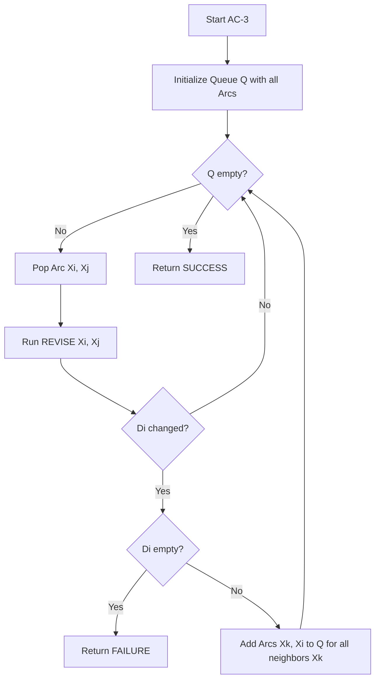

# Arc Consistency (AC-3) and Constraint Propagation Algorithms

> Arc Consistency is a filtering technique for Constraint Satisfaction Problems (CSPs) that prunes the search space by ensuring that for every value in a variable's domain, there exists at least one valid supporting value in the domains of all its neighbors.

## 1. Historical Background & Motivation

In the early 1970s, researchers in artificial intelligence encountered a recurring obstacle: the "combinatorial explosion." Whether they were attempting to solve line-drawing interpretation, map coloring, or scheduling, the number of possible states grew exponentially with the number of variables. Early backtracking algorithms (like those popularized by Golomb and Baumert in 1965) were exhaustive and often redundant, exploring massive branches of the search tree that were doomed to fail due to local inconsistencies.

The breakthrough came from **Ugo Montanari (1974)**, who introduced the concept of networks of constraints, and **Alan Mackworth (1977)**, who formalized the AC-1, AC-2, and AC-3 algorithms in his seminal paper "Consistency in Networks of Relations." Mackworth’s key insight was that we don't need to wait for a full assignment to find failures; we can "propagate" the implications of a constraint locally to reduce the domains of variables before the search even begins. This shifted the paradigm from "Search and Test" to "Propagate and Search." Today, AC-3 and its successors (like AC-2001 or Bit-AC) are foundational components in industrial solvers such as Google’s OR-Tools, IBM CPLEX, and high-performance hardware verification tools at companies like NVIDIA and Intel.

## 2. Visual Intuition
:::demo
<div style="background:#1e1e1e;padding:16px;border-radius:10px;color:#e5e7eb;font-family:system-ui,sans-serif">
  <h3 style="margin:0 0 8px 0;color:#7dd3fc">Arc Consistency (AC-3) and Constraint Propagation Algorithms - Concept Map</h3>
  <svg width="100%" height="280" viewBox="0 0 640 280" role="img" aria-label="Arc Consistency (AC-3) and Constraint Propagation Algorithms visual intuition" style="background:#111827;border-radius:8px">
    <rect x="24" y="28" width="180" height="64" rx="10" fill="#1d4ed8" />
    <text x="114" y="66" text-anchor="middle" fill="#e5e7eb" font-size="14">Problem</text>
    <rect x="230" y="28" width="180" height="64" rx="10" fill="#0f766e" />
    <text x="320" y="66" text-anchor="middle" fill="#e5e7eb" font-size="14">Process</text>
    <rect x="436" y="28" width="180" height="64" rx="10" fill="#7c3aed" />
    <text x="526" y="66" text-anchor="middle" fill="#e5e7eb" font-size="14">Outcome</text>

    <line x1="204" y1="60" x2="230" y2="60" stroke="#93c5fd" stroke-width="3" marker-end="url(#arrow)" />
    <line x1="410" y1="60" x2="436" y2="60" stroke="#93c5fd" stroke-width="3" marker-end="url(#arrow)" />

    <rect x="24" y="130" width="592" height="120" rx="10" fill="#0b1220" stroke="#334155" />
    <text x="320" y="156" text-anchor="middle" fill="#cbd5e1" font-size="14">Key intuition for Arc Consistency (AC-3) and Constraint Propagation Algorithms</text>
    <text x="320" y="182" text-anchor="middle" fill="#94a3b8" font-size="12">Track state changes, constraints, and final behavior.</text>
    <text x="320" y="206" text-anchor="middle" fill="#94a3b8" font-size="12">Use this as a mental model before formal proofs or code.</text>

    <defs>
      <marker id="arrow" markerWidth="10" markerHeight="10" refX="8" refY="3" orient="auto">
        <polygon points="0 0, 10 3, 0 6" fill="#93c5fd" />
      </marker>
    </defs>
  </svg>
  <p style="margin-top:10px;color:#cbd5e1">Interactive-ready visual scaffold for the topic.</p>
</div>
:::
*Caption: This visualization demonstrates the pruning of variable domains. As the constraint $X < Y$ is applied, values in the domain of $X$ that have no valid counterpart in $Y$ (and vice-versa) are removed, preventing the search algorithm from ever attempting those doomed assignments.*

## 3. Core Theory & Mathematical Foundations

A Constraint Satisfaction Problem (CSP) is formally defined as a triple $(X, D, C)$:
- $X = \{X_1, X_2, \dots, X_n\}$ is a set of variables.
- $D = \{D_1, D_2, \dots, D_n\}$ is a set of domains, where $D_i$ is the set of allowed values for $X_i$.
- $C = \{C_1, C_2, \dots, C_m\}$ is a set of constraints, where each constraint $C_j$ involves a subset of variables and specifies the allowed combinations of values.

### 3.1 Formal Definition of Arc Consistency
A directed arc $(X_i, X_j)$ is said to be **arc consistent** if and only if for every value $x \in D_i$, there exists some value $y \in D_j$ such that the pair $(x, y)$ satisfies the binary constraint between $X_i$ and $X_j$. 

Mathematically, $(X_i, X_j)$ is consistent if:
$$\forall x \in D_i, \exists y \in D_j : (x, y) \in R_{ij}$$
where $R_{ij}$ is the relation defining the constraint between $X_i$ and $X_j$. If an arc $(X_i, X_j)$ is not consistent, we remove all values $x$ from $D_i$ that lack a "support" in $D_j$.

### 3.2 The Property of Directionality
It is critical to note that arc consistency is **directional**. Consistency of $(X_i, X_j)$ does not imply consistency of $(X_j, X_i)$. 
Example: Let $X \in \{1, 2, 3\}$, $Y \in \{1\}$. Constraint: $X > Y$.
- The arc $(Y, X)$ is consistent because for $y=1$, there exists $x=2$ such that $1 < 2$.
- The arc $(X, Y)$ is **not** consistent because for $x=1$, there is no $y \in \{1\}$ such that $1 > y$. We must prune $1$ from $D_X$.

### 3.3 Constraint Propagation as a Fixed-Point Algorithm
AC-3 is essentially a **fixed-point algorithm**. When we modify a domain $D_i$ to make $(X_i, X_j)$ consistent, we may have inadvertently broken the consistency of arcs pointing *to* $X_i$ (e.g., $(X_k, X_i)$). Therefore, we must re-check those arcs. The process continues until no more values can be removed from any domain, reaching a stable state (fixed point) or proving that the problem is unsolvable (if any domain becomes empty).

### 3.4 Formal Analysis (Complexity / Correctness)
Let $n$ be the number of variables, $d$ the maximum domain size, and $e$ the number of binary constraints (arcs in the constraint graph).

**Time Complexity:**
1. Each arc $(X_i, X_j)$ can be inserted into the queue at most $d$ times. Why? Because an arc is only re-added when a value is removed from $D_j$. $D_j$ has at most $d$ values.
2. There are $2e$ directed arcs in total.
3. The `REVISE` function, which checks an arc, takes $O(d^2)$ in the worst case (comparing every value in $D_i$ to every value in $D_j$).
4. Total complexity: $O(e \cdot d \cdot d^2) = O(ed^3)$. 

*Note: Optimized versions like AC-4 improve this to $O(ed^2)$ by maintaining support counters.*

**Space Complexity:**
The queue stores arcs. Since there are $2e$ possible arcs and we don't store duplicates in the queue at any single time, the space complexity is $O(e)$.

## 4. Algorithm / Process (Step-by-Step)

The AC-3 algorithm maintains a queue of arcs to be checked.

1.  **Initialization**: Create a queue $Q$ containing all directed arcs $(X_i, X_j)$ in the CSP.
2.  **Iteration**: While $Q$ is not empty:
    a. Pop an arc $(X_i, X_j)$ from $Q$.
    b. Call `REVISE(Xi, Xj)`.
    c. If `REVISE` returned `True` (meaning $D_i$ was changed):
        i. If $D_i$ is now empty, return **Failure** (the CSP has no solution).
        ii. Otherwise, for every neighbor $X_k$ of $X_i$ (where $k \neq j$), add the arc $(X_k, X_i)$ to $Q$.
3.  **Termination**: If the queue becomes empty, return **Success**. The domains are now arc-consistent.

**The REVISE Function:**
1. Set `revised = False`.
2. For each value $x$ in $D_i$:
    a. If no value $y$ in $D_j$ satisfies the constraint between $X_i$ and $X_j$:
        i. Delete $x$ from $D_i$.
        ii. `revised = True`.
3. Return `revised`.

## 5. Visual Diagram


*Caption: The flow of arc propagation. Note how the modification of a single domain triggers a "ripple effect" through the queue, re-validating all incoming constraints.*

## 6. Implementation

### 6.1 Core Implementation
The following Python code implements AC-3 for a generic CSP.

```python
from collections import deque

def ac3(csp):
    """
    Standard AC-3 Algorithm.
    :param csp: An object with vars, domains, and constraints
    :return: Boolean (is consistent?), updated domains
    """
    # Initialize queue with all directed arcs
    queue = deque(csp.get_all_arcs())
    
    while queue:
        (xi, xj) = queue.popleft()
        
        if revise(csp, xi, xj):
            # If domain is empty, the CSP is unsolvable
            if len(csp.domains[xi]) == 0:
                return False
            
            # Domain of xi changed, so neighbors must be re-checked
            # We check arcs (xk, xi) where xk is a neighbor of xi and xk != xj
            for xk in csp.get_neighbors(xi):
                if xk != xj:
                    queue.append((xk, xi))
                    
    return True

def revise(csp, xi, xj):
    """
    Prunes the domain of xi based on constraints with xj.
    :return: True if xi's domain was modified
    """
    revised = False
    # Get values currently in domain
    domain_i = list(csp.domains[xi])
    domain_j = csp.domains[xj]
    
    for x in domain_i:
        # Check if there's any y in D_j that satisfies the constraint
        # csp.constraints[(xi, xj)] is a function returning True/False
        if not any(csp.satisfies(x, y, xi, xj) for y in domain_j):
            csp.domains[xi].remove(x)
            revised = True
            
    return revised

# Sample usage logic:
# csp.domains = {'A': [1, 2, 3], 'B': [1, 2]}
# csp.constraints = {('A', 'B'): lambda a, b: a < b}
# ac3(csp) -> domains['A'] will be [1], domains['B'] will be [2]
```

### 6.2 Optimized / Production Variant (Bit-AC Concept)
In production systems, we often represent domains as **Bitsets**. This allows the `REVISE` step to be performed using bitwise operations, which are significantly faster and cache-friendly.

```python
def revise_bitset(csp, xi, xj):
    """
    Conceptual optimized revise using bitsets.
    Each bit in the integer represents a value in the domain.
    """
    original_domain = csp.domains[xi]
    # bitwise_check is a precomputed matrix of valid pairs
    supported_mask = 0
    for val_j in csp.get_bitset_values(csp.domains[xj]):
        supported_mask |= csp.support_matrix[xi][xj][val_j]
    
    csp.domains[xi] &= supported_mask
    return csp.domains[xi] != original_domain
```

### 6.3 Common Pitfalls in Code
1.  **Ignoring Directionality**: Forgetting that a constraint between $A$ and $B$ must be treated as two directed arcs: $(A, B)$ and $(B, A)$.
2.  **Modifying List while Iterating**: In Python, `for x in domain_i: domain_i.remove(x)` causes skipped elements. Always iterate over a copy.
3.  **Inefficient Queue Handling**: Using a standard list for the queue instead of `collections.deque` leads to $O(N)$ pops, making the algorithm $O(E^2 \dots)$ instead of $O(E \dots)$.
4.  **Redundant Arc Addition**: Adding $(X_j, X_i)$ back to the queue when $D_i$ was modified. This is unnecessary because $(X_j, X_i)$ only cares about $D_j$ remaining valid relative to $D_i$, and $D_j$ hasn't changed.

## 7. Interactive Demo

:::demo
<!-- title: AC-3 Constraint Propagation Visualizer -->
<!DOCTYPE html>
<html>
<head>
<meta charset="utf-8">
<style>
  body { margin:0; background:#0f1117; color:#e5e7eb; font-family: system-ui, sans-serif; font-size:13px; padding:16px; }
  .container { display: flex; flex-direction: column; align-items: center; gap: 20px; }
  .graph { display: flex; gap: 50px; position: relative; height: 200px; align-items: center;}
  .node { border: 2px solid #3b82f6; border-radius: 8px; padding: 10px; width: 80px; text-align: center; background: #1f2937; position: relative; }
  .node.active { border-color: #f59e0b; box-shadow: 0 0 15px #f59e0b; }
  .domain-val { display: inline-block; padding: 2px 6px; margin: 2px; background: #374151; border-radius: 4px; }
  .domain-val.removed { text-decoration: line-through; color: #ef4444; opacity: 0.5; }
  .controls { display: flex; gap: 10px; }
  button { background: #3b82f6; color: white; border: none; padding: 8px 16px; border-radius: 4px; cursor: pointer; }
  button:disabled { background: #4b5563; }
  .status { font-family: monospace; background: #000; padding: 10px; width: 100%; border-radius: 4px; border: 1px solid #333; height: 60px; overflow-y: auto; }
</style>
</head>
<body>
<div class="container">
  <h3>AC-3 Visualization: X < Y</h3>
  <div class="graph" id="graph">
    <div id="nodeX" class="node">
      <div>X</div>
      <div id="domX"></div>
    </div>
    <div style="font-size: 24px;">&lt;</div>
    <div id="nodeY" class="node">
      <div>Y</div>
      <div id="domY"></div>
    </div>
  </div>
  <div class="status" id="log">Click Start to trace AC-3 for X < Y where X:{1,2,3}, Y:{1,2}</div>
  <div class="controls">
    <button id="btnStart">Start AC-3</button>
    <button id="btnStep" disabled>Next Step</button>
    <button id="btnReset">Reset</button>
  </div>
</div>

<script>
  let domains = { X: [1, 2, 3], Y: [1, 2] };
  let queue = [['X', 'Y'], ['Y', 'X']];
  let step = 0;

  const logEl = document.getElementById('log');
  const domXEl = document.getElementById('domX');
  const domYEl = document.getElementById('domY');

  function render() {
    domXEl.innerHTML = [1,2,3].map(v => `<span class="domain-val ${!domains.X.includes(v) ? 'removed' : ''}">${v}</span>`).join('');
    domYEl.innerHTML = [1,2].map(v => `<span class="domain-val ${!domains.Y.includes(v) ? 'removed' : ''}">${v}</span>`).join('');
  }

  function log(msg) {
    logEl.innerHTML += `<div>> ${msg}</div>`;
    logEl.scrollTop = logEl.scrollHeight;
  }

  document.getElementById('btnStart').onclick = () => {
    document.getElementById('btnStart').disabled = true;
    document.getElementById('btnStep').disabled = false;
    log('Initialized Queue: [(X,Y), (Y,X)]');
  };

  document.getElementById('btnStep').onclick = () => {
    if (queue.length === 0) {
      log('Queue empty. Fixed point reached!');
      document.getElementById('btnStep').disabled = true;
      return;
    }

    let [xi, xj] = queue.shift();
    document.querySelectorAll('.node').forEach(n => n.classList.remove('active'));
    document.getElementById('node' + xi).classList.add('active');
    
    log(`Checking Arc (${xi}, ${xj})...`);
    
    let changed = false;
    let newDom = [];
    for (let valI of domains[xi]) {
      let supported = false;
      for (let valJ of domains[xj]) {
        if (xi === 'X' ? valI < valJ : valJ < valI) {
          supported = true;
          break;
        }
      }
      if (supported) newDom.push(valI);
      else {
        log(`Pruning ${valI} from D_${xi} (no support in D_${xj})`);
        changed = true;
      }
    }
    
    domains[xi] = newDom;
    if (changed) {
      if (xi === 'X') queue.push(['Y', 'X']);
      else queue.push(['X', 'Y']);
      log(`Domain changed. Added neighbors to queue.`);
    }
    render();
  };

  document.getElementById('btnReset').onclick = () => {
    domains = { X: [1, 2, 3], Y: [1, 2] };
    queue = [['X', 'Y'], ['Y', 'X']];
    logEl.innerHTML = '';
    document.getElementById('btnStart').disabled = false;
    document.getElementById('btnStep').disabled = true;
    render();
  };

  render();
</script>
</body>
</html>
:::

## 8. Worked Examples

### Example 1 — Basic Application (Map Coloring)
**Variables**: $A, B, C$ (Nodes in a triangle graph).
**Domains**: $\{Red, Blue\}$ for all.
**Constraint**: $A \neq B, B \neq C, C \neq A$.

1.  **Queue**: $[(A,B), (B,A), (B,C), (C,B), (C,A), (A,C)]$
2.  **Step 1**: Pop $(A,B)$. For $A=Red$, $B=Blue$ exists. For $A=Blue$, $B=Red$ exists. No change.
3.  **Manual Assignment**: Suppose we assign $A=Red$ (Search step). Now $D_A = \{Red\}$.
4.  **Propagation**: 
    -   Check $(B,A)$: $B=Red$ has no support in $D_A$ (since $B \neq A$). Prune $Red$ from $D_B$. $D_B = \{Blue\}$.
    -   $D_B$ changed, add neighbors of $B$ to queue: $(C,B)$.
    -   Check $(C,B)$: $C=Blue$ has no support in $D_B$ (since $C \neq B$ and $D_B=\{Blue\}$). Prune $Blue$ from $D_C$. $D_C = \{Red\}$.
    -   $D_C$ changed, add $(A,C)$ to queue.
    -   Check $(A,C)$: $A=Red$ has no support in $D_C$ (since $A \neq C$ and $D_C=\{Red\}$). Prune $Red$ from $D_A$.
5.  **Result**: $D_A$ is empty. **Failure**. This tells the search algorithm immediately that $A=Red$ is impossible with only two colors for a triangle graph.

### Example 2 — Numerical Constraints
**Variables**: $X \in \{1, 2, 3\}, Y \in \{1, 2, 3\}, Z \in \{1, 2, 3\}$.
**Constraints**: $X + Y = 4$, $Y < Z$.

1.  **Initial Queue**: $[(X,Y), (Y,X), (Y,Z), (Z,Y)]$
2.  **Revise $(X,Y)$**:
    - $X=1$: Need $Y=3$. (Exists)
    - $X=2$: Need $Y=2$. (Exists)
    - $X=3$: Need $Y=1$. (Exists)
    - No change.
3.  **Revise $(Y,Z)$**:
    - $Y=1$: Need $Z \in \{2, 3\}$. (Exists)
    - $Y=2$: Need $Z \in \{3\}$. (Exists)
    - $Y=3$: No $Z \in \{1,2,3\}$ satisfies $3 < Z$. **Prune 3 from $D_Y$**.
4.  **Queue becomes**: $[(Z,Y), (X,Y)]$ (since $D_Y$ changed).
5.  **Revise $(X,Y)$**:
    - $X=1$: Need $Y=3$. (3 is gone!) **Prune 1 from $D_X$**.
    - $X=2, 3$: Support still exists.
6.  **Final Domains**: $X \in \{2,3\}, Y \in \{1,2\}, Z \in \{2,3\}$.

## 9. Comparison with Alternatives

| Approach | Time | Space | Pros | Cons | Best Used When |
|---|---|---|---|---|---|
| **AC-3** | $O(ed^3)$ | $O(e)$ | Simple to implement, very effective. | Can be redundant (checks same pairs). | General purpose CSPs. |
| **Forward Checking** | $O(d)$ per step | $O(n \cdot d)$ | Very low overhead. | Only looks 1-step ahead; misses many prunings. | Small domains, simple constraints. |
| **AC-4** | $O(ed^2)$ | $O(ed^2)$ | Optimal worst-case time complexity. | High space usage, complex bookkeeping. | Very large domains where $d^3$ is prohibitive. |
| **Path Consistency** | $O(n^3 d^3)$ | $O(n^2 d^2)$ | Higher pruning power (looks at triples). | Extremely slow and high memory. | Highly constrained, small variable sets. |

## 10. Industry Applications & Real Systems

- **Google OR-Tools**: Uses arc consistency as a default propagator for integer programming and scheduling problems. It's the engine behind massive vehicle routing and logistics optimization for delivery fleets.
- **NASA Remote Agent**: Arc consistency was used in the constraint engine for the Deep Space One mission (the first autonomous spacecraft control system) to manage complex temporal constraints between hardware components.
- **Intel/AMD Chip Design**: In Register Transfer Level (RTL) verification, formal tools use constraint propagation to verify that no combination of inputs can lead to an illegal hardware state.
- **Package Managers (NPM/Pip/apt)**: Resolving dependency versions is a CSP. Propagating version constraints (e.g., `React > 16.0` and `Router < 5.0`) uses arc consistency techniques to prune incompatible version sets before trying to install.

## 11. Practice Problems

### 🟢 Easy
1.  **Domain Pruning**: Given $X \in \{1, 2, 3, 4, 5\}$ and $Y \in \{1, 2\}$, and the constraint $X = Y^2$. Perform one pass of arc consistency. What is the remaining domain of $X$?
    *Hint: Check which squares are present in Y's domain.*
    *Expected complexity: O(d^2)*

### 🟡 Medium
2.  **Sudoku Propagation**: In a Sudoku board, every cell is a variable. What is the number of arcs in the constraint graph for a single cell? If you set a cell's value to 5, how many arcs are added to the AC-3 queue?
    *Hint: A cell belongs to a row, a column, and a 3x3 box.*
    *Expected complexity: O(1) analysis.*

3.  **AC-3 Trace**: Manually trace AC-3 for $X, Y, Z \in \{1, 2, 3\}$ with $X < Y$ and $Y < Z$. Show the queue at every step.

### 🔴 Hard
4.  **Global Constraints**: The `AllDifferent(X1, ..., Xn)` constraint is common. A naive implementation treats this as $O(n^2)$ binary $\neq$ constraints. Explain why binary arc consistency (AC-3) is weaker than a global propagator for `AllDifferent`. 
    *Example: $X_1, X_2, X_3 \in \{1, 2\}$. AC-3 will not prune anything. Why?*
    *Hint: Look at the Hall Marriage Theorem.*

5.  **Path Consistency Challenge**: Provide a CSP that is Arc Consistent but has no solution.
    *Hint: Think about a triangle graph with 2 colors.*

## 12. Interactive Quiz

:::quiz
**Q1: Why do we add (Xk, Xi) to the queue when Di is modified, rather than (Xi, Xk)?**
- A) Because Xi's neighbors are the ones whose support might have been removed.
- B) Because AC-3 is a unidirectional algorithm.
- C) To avoid infinite loops.
- D) It's a typo in the algorithm; we should add both.
> A — If Di shrinks, a value in Dk that previously relied on a now-deleted value in Di is no longer supported. Xi itself doesn't need to re-check its neighbors unless their domains change.

**Q2: What is the worst-case time complexity of AC-3?**
- A) O(n^2 d^2)
- B) O(ed^2)
- C) O(ed^3)
- D) O(e^2 d)
> C — There are $e$ arcs, each can be queued $d$ times, and each `REVISE` takes $O(d^2)$.

**Q3: If AC-3 completes and all domains are non-empty, what can we conclude?**
- A) The CSP has exactly one solution.
- B) The CSP has at least one solution.
- C) The problem is arc-consistent, but may or may not have a solution.
- D) The problem is NP-Complete.
> C — Arc consistency is a *necessary* but not *sufficient* condition for the existence of a solution.

**Q4: Which constraint type is AC-3 specifically designed for?**
- A) Unary constraints only.
- B) Binary constraints only.
- C) Ternary constraints only.
- D) All global constraints.
> B — AC-3 is the standard for binary arc consistency. Higher-order constraints require Generalized Arc Consistency (GAC).

**Q5: In the REVISE(Xi, Xj) function, if we remove a value from Di, why do we NOT need to add (Xi, Xj) back to the queue?**
- A) Because the relationship is already satisfied.
- B) Because shrinking Di cannot make an arc (Xi, Xj) inconsistent if it was already consistent.
- C) Because xj will be checked anyway.
- D) Because of the Monotonicity property of domains.
> B — Arc consistency of (Xi, Xj) depends on there being a support in Dj for every value in Di. If Di gets smaller, there are fewer values needing support, so the arc remains consistent.
:::

## 13. Interview Preparation

### Conceptual Questions
**Q: Explain AC-3 as if teaching it to a fellow engineer.**
*A: AC-3 is a preprocessing algorithm for Constraint Satisfaction Problems. Think of it as a "sanity check" that runs before a heavy search. It looks at every pair of variables connected by a constraint and removes any values that can't possibly work. If changing one variable's options affects its neighbors, those neighbors are put back on a "to-check" list (the queue). This "propagation" continues until the system reaches a steady state.*

**Q: What are the time and space complexities? Derive them.**
*A: Time is $O(ed^3)$ and Space is $O(e)$. For time: each of the $e$ constraints can be revised $d$ times (once for each value removal). Each revision involves nested loops over domains of size $d$, hence $O(d^2)$. Multiplying gives $O(e \cdot d \cdot d^2) = O(ed^3)$. Space is $O(e)$ because we store arcs in a queue.*

**Q: How would you choose between AC-3 and Forward Checking in a real system?**
*A: It's a trade-off between "pruning power" and "overhead." Forward Checking is fast and only looks at variables currently being assigned. AC-3 is slower but catches contradictions much earlier. In highly constrained problems (like Sudoku or scheduling), the overhead of AC-3 pays for itself by preventing the explorer from entering massive dead-end subtrees.*

### Quick Reference (Cheat Sheet)
| Property | Value |
|---|---|
| Time Complexity | $O(ed^3)$ |
| Space Complexity | $O(e)$ |
| Fixed-Point? | Yes |
| Pruning Type | Domain Reduction |
| Industrial Standard | MAC (Maintaining Arc Consistency) |

## 14. Key Takeaways
1. **Local to Global**: AC-3 uses local binary constraints to make global inferences about variable domains.
2. **Fixed-Point Nature**: The algorithm iterates until no more changes can be made, ensuring a stable, consistent state.
3. **Necessary, not Sufficient**: Passing AC-3 doesn't guarantee a solution exists, but failing it guarantees one does *not*.
4. **The Ripple Effect**: A single pruning can trigger a chain reaction across the entire constraint graph.
5. **Efficiency**: Using a `deque` and avoiding redundant arc checks is critical for performance.
6. **Constraint Density**: AC-3 is most effective in "medium-dense" constraint graphs where propagation can travel far.
7. **Preprocessing vs. Search**: In modern AI, AC-3 is rarely used alone; it is usually interleaved with backtracking (this is called the MAC algorithm).

## 15. Common Misconceptions
- ❌ **"AC-3 solves the CSP"** → ✅ AC-3 only reduces domains. You usually still need to search (backtracking) to find an actual assignment.
- ❌ **"The order of the queue matters for correctness"** → ✅ The final result is the same regardless of order, but the *efficiency* can vary.
- ❌ **"AC-3 works for X+Y+Z=10"** → ✅ Standard AC-3 is for binary constraints (2 variables). For 3+ variables, you need **Generalized Arc Consistency (GAC)**.

## 16. Further Reading
- *Artificial Intelligence: A Modern Approach (Russell & Norvig)* — Chapter 6 is the gold standard for CSPs.
- *Constraint Processing (Rina Dechter)* — Deep dive into the mathematical properties of consistency.
- *Mackworth (1977)* — The original paper "Consistency in Networks of Relations."
- *Google OR-Tools Documentation* — See how CP-SAT implements these propagators.

## 17. Related Topics
- [[heuristic-design]] — How to choose which variable to assign next after AC-3.
- [[local-search-optimization]] — An alternative to backtracking/propagation.
- [[temporal-logic]] — Applying constraints over time intervals.
- [[backtracking-search]] — The search algorithm that often wraps AC-3.
