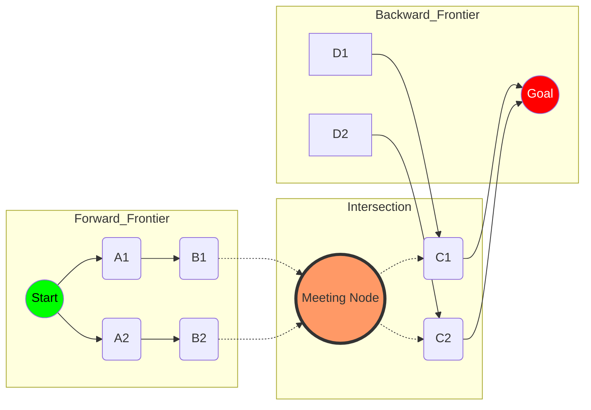

# Bidirectional Search and Meet-in-the-Middle Strategies

> **Bidirectional search** is a graph traversal strategy that simultaneously explores forward from the initial state and backward from the goal state, terminating when the two frontiers intersect to significantly reduce the effective search depth and time complexity from $O(b^d)$ to $O(b^{d/2})$.

## 1. Historical Background & Motivation

The genesis of bidirectional search traces back to the early 1970s, primarily through the pioneering work of **Ira Pohl**. In his 1971 paper, "Bi-directional Search," Pohl proposed that for many problems, searching from both ends could drastically reduce the number of nodes expanded. This was a direct response to the "combinatorial explosion" problem inherent in Breadth-First Search (BFS) and Dijkstra’s algorithm, where the state space grows exponentially with the depth of the solution.

Historically, while the intuition was sound, early implementations struggled with the "meeting point" problem. If the forward and backward searches used different heuristics, they might "miss" each other in the state space—a phenomenon known as the "search leakage" or "missed handshake." This led to a fallow period in the 1980s until researchers like Kwa (1989) and later Kaindl and Kainz (1997) refined the conditions for optimality. In the modern era, bidirectional search has evolved into **Meet-in-the-Middle (MITM)** strategies used in cryptography (e.g., breaking Double DES) and high-performance pathfinding (e.g., Google Maps routing). It matters today because as datasets grow, even polynomial improvements are insufficient; we require the square-root reduction in complexity that bidirectional strategies provide.

## 2. Visual Intuition
:::demo
<div style="background:#1e1e1e;padding:16px;border-radius:10px;color:#e5e7eb;font-family:system-ui,sans-serif">
  <h3 style="margin:0 0 8px 0;color:#7dd3fc">Bidirectional Search and Meet-in-the-Middle Strategies - Concept Map</h3>
  <svg width="100%" height="280" viewBox="0 0 640 280" role="img" aria-label="Bidirectional Search and Meet-in-the-Middle Strategies visual intuition" style="background:#111827;border-radius:8px">
    <rect x="24" y="28" width="180" height="64" rx="10" fill="#1d4ed8" />
    <text x="114" y="66" text-anchor="middle" fill="#e5e7eb" font-size="14">Problem</text>
    <rect x="230" y="28" width="180" height="64" rx="10" fill="#0f766e" />
    <text x="320" y="66" text-anchor="middle" fill="#e5e7eb" font-size="14">Process</text>
    <rect x="436" y="28" width="180" height="64" rx="10" fill="#7c3aed" />
    <text x="526" y="66" text-anchor="middle" fill="#e5e7eb" font-size="14">Outcome</text>

    <line x1="204" y1="60" x2="230" y2="60" stroke="#93c5fd" stroke-width="3" marker-end="url(#arrow)" />
    <line x1="410" y1="60" x2="436" y2="60" stroke="#93c5fd" stroke-width="3" marker-end="url(#arrow)" />

    <rect x="24" y="130" width="592" height="120" rx="10" fill="#0b1220" stroke="#334155" />
    <text x="320" y="156" text-anchor="middle" fill="#cbd5e1" font-size="14">Key intuition for Bidirectional Search and Meet-in-the-Middle Strategies</text>
    <text x="320" y="182" text-anchor="middle" fill="#94a3b8" font-size="12">Track state changes, constraints, and final behavior.</text>
    <text x="320" y="206" text-anchor="middle" fill="#94a3b8" font-size="12">Use this as a mental model before formal proofs or code.</text>

    <defs>
      <marker id="arrow" markerWidth="10" markerHeight="10" refX="8" refY="3" orient="auto">
        <polygon points="0 0, 10 3, 0 6" fill="#93c5fd" />
      </marker>
    </defs>
  </svg>
  <p style="margin-top:10px;color:#cbd5e1">Interactive-ready visual scaffold for the topic.</p>
</div>
:::
*Caption: In a unidirectional search (left), the search tree expands as a large circle. In a bidirectional search (right), two smaller circles expand from the start and goal. The area of the two smaller circles is significantly less than the area of one large circle encompassing the same distance.*

## 3. Core Theory & Mathematical Foundations

### 3.1 The Geometry of Search Spaces
Consider a uniform state space with a branching factor $b$ and a solution at depth $d$. A standard unidirectional search like BFS explores a volume of nodes proportional to the area of a circle with radius $d$:
$$V_{uni} \approx b^d$$

In contrast, bidirectional search creates two "expanding waves." If they meet at the midpoint, each wave has a radius of $d/2$. The total nodes expanded is:
$$V_{bi} \approx b^{d/2} + b^{d/2} = 2 \cdot b^{d/2}$$

As $d$ increases, the ratio $\frac{b^d}{2b^{d/2}} = \frac{1}{2}b^{d/2}$ grows exponentially. For example, if $b=10$ and $d=10$, unidirectional search explores $10^{10}$ nodes, while bidirectional search explores only $200,000$ nodes—a speedup of 50,000x.

### 3.2 The Stopping Condition and Optimality
The most critical theoretical aspect of bidirectional search is knowing *when* to stop. For BFS-based bidirectional search, the first time the frontiers intersect, the shortest path is found. However, for weighted graphs (Dijkstra) or heuristic searches (A*), the first intersection does **not** necessarily yield the optimal path.

Let $L_{forward}$ be the length of the shortest path found from start to a node $v$ in the forward frontier, and $L_{backward}$ be the length from $v$ to the goal. Even if $v$ is in both frontiers, there might exist another node $w$ that hasn't been "settled" yet which provides a shorter total path.

**Theorem (Luby & Ragde):** To guarantee optimality in a weighted bidirectional search, the algorithm must continue until the shortest path found so far ($C^*$) is less than or equal to the sum of the minimum edge costs in both frontiers. 

### 3.3 Heuristic Bidirectional Search (MM and Bi-A*)
Integrating heuristics (A*) into bidirectional search is non-trivial. If we use $h_f(n)$ (heuristic to goal) and $h_b(n)$ (heuristic to start), the search frontiers may not be directed toward each other.
A breakthrough algorithm, **MM (Meet-in-the-Middle)**, introduced by Holte et al. (2016), ensures that the forward and backward searches are guaranteed to meet in the middle by modifying the priority function:
$$f_f(n) = \max(g_f(n) + h_f(n), 2g_f(n))$$
$$f_b(n) = \max(g_b(n) + h_b(n), 2g_b(n))$$
This ensures that neither search expands beyond the halfway point of the optimal solution cost $C^*$.

### 3.4 Formal Complexity Analysis
**Time Complexity:**
Let $b$ be the branching factor and $d$ be the distance between start and goal.
- Forward search expands: $1 + b + b^2 + ... + b^{d/2} = O(b^{d/2})$
- Backward search expands: $1 + b + b^2 + ... + b^{d/2} = O(b^{d/2})$
- Total Time: $O(b^{d/2})$.

**Space Complexity:**
Unlike Depth-First Search, bidirectional search **must** keep at least one of the frontiers in memory to check for intersections.
- Space: $O(b^{d/2})$.
This is the primary drawback compared to IDA* (Iterative Deepening A*), which has $O(d)$ space.

## 4. Algorithm / Process (Step-by-Step)

The following steps describe the **Bidirectional Breadth-First Search (Bi-BFS)**:

1.  **Initialize Frontiers:** Create two queues, `Q_f` (forward) and `Q_b` (backward).
2.  **Initialize Visited Maps:** Create two dictionaries/hash maps, `dist_f` and `dist_b`, mapping nodes to their distance from their respective origins.
3.  **Insert Origins:** Add the `start_node` to `Q_f` and `dist_f`. Add the `goal_node` to `Q_b` and `dist_b`.
4.  **Loop until one queue is empty:**
    a.  **Expand Forward:** Dequeue $u$ from `Q_f`. For each neighbor $v$ of $u$:
        i.  If $v$ is in `dist_b`, a path is found! Return `dist_f[u] + 1 + dist_b[v]`.
        ii. If $v$ is not in `dist_f`, add it to `dist_f` and enqueue to `Q_f`.
    b.  **Expand Backward:** Dequeue $x$ from `Q_b`. For each neighbor $y$ of $x$:
        i.  If $y$ is in `dist_f`, a path is found! Return `dist_b[x] + 1 + dist_f[y]`.
        ii. If $y$ is not in `dist_b`, add it to `dist_b` and enqueue to `Q_b`.
5.  **Termination:** If queues empty without intersection, no path exists.

## 5. Visual Diagram


*Caption: The Bidirectional Search process. The forward search (green) and backward search (red) expand until they collide at the Meeting Node (orange). The total path is the concatenation of the two paths.*

## 6. Implementation

### 6.1 Core Implementation: Bidirectional BFS
This implementation finds the shortest path in an unweighted graph using a bidirectional approach.

```python
from collections import deque

def bidirectional_bfs(graph, start, goal):
    """
    Performs a bidirectional BFS to find the shortest path length.
    
    Args:
        graph: Dict mapping nodes to list of neighbors
        start: Starting node
        goal: Target node
        
    Returns:
        int: Shortest distance, or -1 if no path exists.
    
    Complexity:
        Time: O(b^(d/2))
        Space: O(b^(d/2))
    """
    if start == goal:
        return 0

    # Forward search structures
    q_f = deque([start])
    visited_f = {start: 0}

    # Backward search structures
    q_b = deque([goal])
    visited_b = {goal: 0}

    while q_f and q_b:
        # Expand one level from the smaller frontier to keep it balanced
        if len(q_f) <= len(q_b):
            res = _expand_level(q_f, visited_f, visited_b, graph)
        else:
            res = _expand_level(q_b, visited_b, visited_f, graph)
        
        if res != -1:
            return res

    return -1

def _expand_level(queue, visited_this_side, visited_other_side, graph):
    """Helper to process one level of the BFS."""
    # We only process the current 'level' to ensure shortest path
    for _ in range(len(queue)):
        curr = queue.popleft()
        
        for neighbor in graph.get(curr, []):
            if neighbor in visited_other_side:
                # Intersection found!
                return visited_this_side[curr] + 1 + visited_other_side[neighbor]
            
            if neighbor not in visited_this_side:
                visited_this_side[neighbor] = visited_this_side[curr] + 1
                queue.append(neighbor)
    return -1

# Example Usage:
# graph = {0: [1, 2], 1: [0, 3], 2: [0, 4], 3: [1, 5], 4: [2, 5], 5: [3, 4]}
# print(bidirectional_bfs(graph, 0, 5)) # Output: 3
```

### 6.2 Optimized Variant: Meet-in-the-Middle (Subset Sum)
Meet-in-the-Middle is often used in purely mathematical/combinatorial contexts. Here is an $O(2^{n/2} \cdot n)$ solution for the Subset Sum problem, which is normally $O(2^n)$.

```python
import bisect

def subset_sum_mitm(nums, target):
    """
    Determines if a subset of nums adds up to target using MITM.
    
    Splits the array into two halves, computes all subset sums for both,
    and then uses binary search to find a pair that hits the target.
    """
    n = len(nums)
    left_half = nums[:n//2]
    right_half = nums[n//2:]

    def get_subset_sums(arr):
        sums = {0}
        for x in arr:
            new_sums = {s + x for s in sums}
            sums.update(new_sums)
        return sorted(list(sums))

    left_sums = get_subset_sums(left_half)
    right_sums = get_subset_sums(right_half)

    for s in left_sums:
        remaining = target - s
        idx = bisect.bisect_left(right_sums, remaining)
        if idx < len(right_sums) and right_sums[idx] == remaining:
            return True
            
    return False

# Example:
# nums = [3, 34, 4, 12, 5, 2]
# target = 9
# print(subset_sum_mitm(nums, target)) # Output: True (4+5)
```

### 6.3 Common Pitfalls in Code
*   **Asymmetric Expansion:** Forgetting to expand the *entire level* or failing to check for intersections during the neighbor-generation phase can lead to sub-optimal paths or missed solutions.
*   **Hashability:** In AI state-space search (like the 8-puzzle), ensure states are immutable (tuples, strings) so they can be used as keys in the `visited` dictionary.
*   **Memory Overhead:** Bidirectional search stores two frontiers. In large state spaces, this can exceed RAM. For such cases, consider **Bidirectional IDA*** or **MM**.
*   **Directionality:** If the graph is directed, the backward search must follow edges in reverse (from $v$ to $u$).

## 7. Interactive Demo

:::demo
<!-- title: Bidirectional BFS Visualizer -->
<!DOCTYPE html>
<html>
<head>
<style>
  body { margin:0; background:#1a1b26; color:#a9b1d6; font-family: monospace; overflow: hidden; }
  canvas { display: block; cursor: crosshair; }
  .controls { position: absolute; top: 10px; left: 10px; background: rgba(26,27,38,0.9); padding: 15px; border: 1px solid #414868; border-radius: 8px; }
  button { background: #3d59a1; border: none; color: white; padding: 5px 10px; cursor: pointer; border-radius: 4px; }
  button:hover { background: #4e75d4; }
  .stats { margin-top: 10px; font-size: 12px; }
</style>
</head>
<body>
<div class="controls">
  <strong>Bidirectional BFS</strong><br>
  <small>Green: Start | Red: Goal</small><br><br>
  <button onclick="reset()">Reset</button>
  <button onclick="step()">Step</button>
  <button onclick="autoPlay()">Auto Play</button>
  <div class="stats" id="stats">Nodes explored: 0</div>
</div>
<canvas id="canvas"></canvas>
<script>
  const canvas = document.getElementById('canvas');
  const ctx = canvas.getContext('2d');
  const stats = document.getElementById('stats');
  
  let grid = [];
  const ROWS = 20;
  const COLS = 30;
  const SIZE = 25;
  
  let start = { r: 5, c: 5 };
  let goal = { r: 15, c: 25 };
  
  let qF = [start];
  let qB = [goal];
  let distF = {};
  let distB = {};
  let found = false;
  let interval;

  function init() {
    canvas.width = window.innerWidth;
    canvas.height = window.innerHeight;
    distF[`${start.r},${start.c}`] = 0;
    distB[`${goal.r},${goal.c}`] = 0;
    draw();
  }

  function draw() {
    ctx.clearRect(0, 0, canvas.width, canvas.height);
    for(let r=0; r<ROWS; r++) {
      for(let c=0; c<COLS; c++) {
        let key = `${r},${c}`;
        ctx.strokeStyle = '#24283b';
        ctx.strokeRect(c*SIZE + 50, r*SIZE + 100, SIZE, SIZE);
        
        if(r === start.r && c === start.c) ctx.fillStyle = '#9ece6a';
        else if(r === goal.r && c === goal.c) ctx.fillStyle = '#f7768e';
        else if(distF[key] !== undefined && distB[key] !== undefined) ctx.fillStyle = '#ff9e64';
        else if(distF[key] !== undefined) ctx.fillStyle = 'rgba(158, 206, 106, 0.4)';
        else if(distB[key] !== undefined) ctx.fillStyle = 'rgba(247, 118, 142, 0.4)';
        else ctx.fillStyle = 'transparent';
        
        ctx.fillRect(c*SIZE + 50 + 1, r*SIZE + 100 + 1, SIZE-2, SIZE-2);
      }
    }
  }

  function step() {
    if(found || (qF.length === 0 && qB.length === 0)) return;
    
    let currentQ = (qF.length <= qB.length && qF.length > 0) ? qF : qB;
    let myDist = (currentQ === qF) ? distF : distB;
    let otherDist = (currentQ === qF) ? distB : distF;
    
    let levelSize = currentQ.length;
    for(let i=0; i<levelSize; i++) {
        let curr = currentQ.shift();
        const dirs = [[0,1],[1,0],[0,-1],[-1,0]];
        for(let [dr, dc] of dirs) {
            let nr = curr.r + dr, nc = curr.c + dc;
            let key = `${nr},${nc}`;
            if(nr >= 0 && nr < ROWS && nc >= 0 && nc < COLS) {
                if(otherDist[key] !== undefined) {
                    found = true;
                    myDist[key] = myDist[`${curr.r},${curr.c}`] + 1;
                    clearInterval(interval);
                    break;
                }
                if(myDist[key] === undefined) {
                    myDist[key] = myDist[`${curr.r},${curr.c}`] + 1;
                    currentQ.push({r: nr, c: nc});
                }
            }
        }
        if(found) break;
    }
    
    stats.innerText = `Nodes explored: ${Object.keys(distF).length + Object.keys(distB).length}`;
    draw();
  }

  function autoPlay() {
    interval = setInterval(step, 100);
  }

  function reset() {
    clearInterval(interval);
    qF = [{ r: 5, c: 5 }];
    qB = [{ r: 15, c: 25 }];
    distF = {[`5,5`]: 0};
    distB = {[`15,25`]: 0};
    found = false;
    draw();
  }

  init();
</script>
</body>
</html>
:::

## 8. Worked Examples

### Example 1 — Word Ladder
**Problem:** Find the shortest transformation from `HIT` to `COG` using words in dictionary `{"HOT", "DOT", "DOG", "LOT", "LOG", "COG"}`.

*   **Step 1:** Initialize `F_Frontier = {HIT}`, `B_Frontier = {COG}`.
*   **Step 2 (Forward):** Expand `HIT`. Neighbors: `HOT`.
    *   `dist_f = {HIT: 0, HOT: 1}`.
*   **Step 3 (Backward):** Expand `COG`. Neighbors: `DOG`, `LOG`.
    *   `dist_b = {COG: 0, DOG: 1, LOG: 1}`.
*   **Step 4 (Forward):** Expand `HOT`. Neighbors: `DOT`, `LOT`.
    *   `dist_f = {HIT: 0, HOT: 1, DOT: 2, LOT: 2}`.
*   **Step 5 (Backward):** Expand `DOG`. Neighbors: `DOT`, `LOG`, `COG`.
    *   `DOT` is in `dist_f`!
*   **Result:** Distance = `dist_f[DOT] + dist_b[DOG] + 1` = $2 + 1 + 1 = 4$.
*   **Path:** HIT $\rightarrow$ HOT $\rightarrow$ DOT $\rightarrow$ DOG $\rightarrow$ COG.

### Example 2 — Meet-in-the-Middle (Discrete Logarithm)
**Problem:** Solve $3^x \equiv 13 \pmod{17}$. (Baby-step Giant-step algorithm).

1.  Let $m = \lceil \sqrt{17} \rceil = 5$.
2.  **Baby steps (Backward-ish):** Calculate $3^j \pmod{17}$ for $j \in [0, 4]$.
    *   $3^0=1, 3^1=3, 3^2=9, 3^3=10, 3^4=13$.
    *   Table: `{1:0, 3:1, 9:2, 10:3, 13:4}`.
3.  **Giant steps (Forward-ish):** Calculate $13 \cdot (3^{-5})^i \pmod{17}$.
    *   $3^5 = 243 \equiv 5 \pmod{17}$. Inverse of $5 \pmod{17}$ is $7$.
    *   $i=0: 13 \cdot 7^0 = 13$. **Match found!**
4.  Value in table for 13 is $j=4$.
5.  $x = i \cdot m + j = 0 \cdot 5 + 4 = 4$.
6.  **Check:** $3^4 = 81 = 17 \cdot 4 + 13 \equiv 13$. Correct.

## 9. Comparison with Alternatives

| Approach | Time | Space | Pros | Cons | Best Used When |
|---|---|---|---|---|---|
| **Bidirectional BFS** | $O(b^{d/2})$ | $O(b^{d/2})$ | Drastic time reduction | High memory usage | Shortest path in large unweighted graphs |
| **BFS** | $O(b^d)$ | $O(b^d)$ | Simple, optimal | Exponential time/space | Shallow trees |
| **A\*** | $O(b^d)$ | $O(b^d)$ | Guided by heuristic | Can still expand many nodes | Good heuristic is available |
| **IDA\*** | $O(b^d)$ | $O(d)$ | Extremely space efficient | Re-visits nodes | Deep trees, tight memory |
| **MM Algorithm** | $O(b^{d/2})$ | $O(b^{d/2})$ | Guaranteed meeting point | Complex priority function | Heuristic bidirectional search |

## 10. Industry Applications & Real Systems

-   **Google Maps / Routing Engines**: Modern routing uses "Contraction Hierarchies" and "Hub Labels," which are heavily optimized bidirectional Dijkstra variants. Searching from both the user's location and the destination allows the engine to ignore millions of irrelevant residential streets in the middle.
-   **Cryptography (3DES)**: The reason "Double DES" ($2 \times 56$-bit keys) was never used is a Meet-in-the-Middle attack. An attacker can precompute $2^{56}$ encryptions from the plaintext and $2^{56}$ decryptions from the ciphertext. The intersection reveals the keys in $O(2^{56})$ instead of $O(2^{112})$. This necessitated the move to Triple DES.
-   **Bioinformatics (Sequence Alignment)**: When aligning a short DNA "read" to a massive reference genome, seed-and-extend algorithms often use bidirectional indexing (like the FM-index) to narrow down the search space from both ends of the sequence.
-   **Robotics (Motion Planning)**: Algorithms like **RRT* (Rapidly-exploring Random Trees)** often use a bidirectional variant (Bi-RRT) where two trees grow toward each other from the start and goal configurations in a high-dimensional continuous space.

## 11. Practice Problems

### 🟢 Easy
1.  **Bidirectional Word Ladder I**: Given a start word, end word, and a dictionary, find the length of the shortest transformation.
    *Hint: Use two sets for visited nodes to check intersection in O(1).*
    *Expected complexity: O(N * L^2) where N is dict size and L is word length.*

### 🟡 Medium
2.  **8-Puzzle Solver**: Implement a bidirectional search to solve the 8-puzzle. How does the number of expanded nodes compare to standard BFS?
    *Hint: Use a tuple of 9 integers as your state for hash-map keys.*
    *Expected complexity: State space is 9!/2 = 181,440. Unidirectional BFS might hit 100k nodes; Bi-BFS should hit ~2k.*

3.  **Four Sum (MITM)**: Given an array of integers, find if there exist four elements such that $a+b+c+d = Target$.
    *Hint: Split into (a+b) and (Target - (c+d)). Store all (a+b) in a hash map.*

### 🔴 Hard
4.  **Partition to Two Equal Sums**: Given a set of 40 integers, find if it can be partitioned into two subsets with equal sum. $2^{40}$ is too large for standard recursion.
    *Hint: Use Meet-in-the-Middle to reduce to $2^{20} \approx 1,000,000$ operations.*
    *Expected complexity: O(2^{N/2}).*

5.  **Double DES Cryptanalysis Simulation**: Given a 16-bit mock encryption function, simulate a Meet-in-the-Middle attack to find two 16-bit keys from a known Plaintext/Ciphertext pair.

## 12. Interactive Quiz

:::quiz
**Q1: Why does Bidirectional Search have $O(b^{d/2})$ time complexity?**
- A) It uses half the memory of BFS.
- B) It reduces the depth each search must travel by half.
- C) It eliminates the need for a heuristic.
- D) It processes nodes twice as fast.
> B — By searching from both ends, the frontiers meet at distance $d/2$, meaning each tree only expands to half the total depth.

**Q2: Which of the following is the primary disadvantage of Bidirectional Search compared to IDA*?**
- A) It is not optimal.
- B) It is harder to implement.
- C) It requires $O(b^{d/2})$ space to store frontiers.
- D) It has a higher branching factor.
> C — Bidirectional search must store the visited states to detect collisions, whereas IDA* only needs $O(d)$ space for the recursion stack.

**Q3: In a directed graph, how must the backward search be performed?**
- A) Exactly like the forward search.
- B) By ignoring edge directions.
- C) By following the edges in reverse (from $v$ to $u$).
- D) Bidirectional search only works on undirected graphs.
> C — To find a path from Start to Goal, the backward search must explore predecessors of the current node, essentially traversing the edges backward.

**Q4: When using Bidirectional Dijkstra, when is it safe to stop to guarantee the optimal path?**
- A) As soon as any node is visited by both searches.
- B) When the same node is *extracted* from both priority queues.
- C) When the shortest path found so far ($C^*$) is $\le$ the sum of the minimum costs in the frontiers.
- D) When the forward search reaches the goal.
> C — Unlike BFS, the first intersection in weighted graphs isn't necessarily the shortest path. We must continue until the "potential" for a better path is gone.

**Q5: If the branching factor $b=2$ and depth $d=20$, what is the approximate reduction in nodes expanded using Bidirectional search?**
- A) 2 times fewer
- B) 10 times fewer
- C) 1,000 times fewer
- D) 1,000,000 times fewer
> C — Unidirectional: $2^{20} \approx 1,048,576$. Bidirectional: $2 \cdot 2^{10} = 2,048$. $1,048,576 / 2,048 = 512$. Roughly 1,000x.
:::

## 13. Interview Preparation

### Conceptual Questions
**Q: Explain Bidirectional Search as if teaching it to a fellow engineer.**
*A: Bidirectional search is an optimization for finding the shortest path in a graph. Instead of growing one giant search tree from the start until it hits the goal—which grows exponentially—you grow two smaller trees simultaneously from both ends. When the two 'perimeters' touch, you've found your path. It's the difference between drawing one circle with radius 10 and two circles with radius 5; the two small circles have a much smaller total area, saving massive amounts of computation.*

**Q: What are the time and space complexities? Derive them.**
*A: The time complexity is $O(b^{d/2})$. In a tree with branching factor $b$, the number of nodes at depth $k$ is $b^k$. A unidirectional search reaches depth $d$, so $\sum_{i=0}^d b^i = O(b^d)$. In bidirectional search, each side reaches $d/2$, so we have $2 \cdot \sum_{i=0}^{d/2} b^i = O(b^{d/2})$. Space complexity is also $O(b^{d/2})$ because we must store the nodes of at least one frontier to check for intersections.*

**Q: How would you choose between Bidirectional Search and A* in a real system?**
*A: It depends on the availability of a heuristic and memory constraints. If I have a very strong, consistent heuristic, A* might expand fewer nodes than a blind bidirectional BFS. However, if the state space is massive and the goal is known, Bidirectional search is often more robust. In practice, systems like road navigation use **Bidirectional A***, combining both: the heuristic guides the two searches toward each other, providing the best of both worlds.*

**Q: What breaks if the graph is directed?**
*A: The backward search must be able to compute the 'in-neighbors' (predecessors) of a node. If your graph data structure only stores 'out-neighbors', you would need to pre-process the graph to create a reversed adjacency list. Without this, you can't move 'backwards' from the goal.*

### Quick Reference (Cheat Sheet)
| Property | Value |
|---|---|
| Time Complexity | $O(b^{d/2})$ |
| Space Complexity | $O(b^{d/2})$ |
| Optimal? | Yes (if stopping condition is met) |
| Complete? | Yes (if $b$ is finite) |
| Core Data Structure | Hash Map + Queue (or Priority Queue) |

## 14. Key Takeaways
1.  **The Square Root Rule:** Bidirectional search effectively square-roots the number of nodes expanded in an exponential search space.
2.  **Frontier Management:** The most efficient way to run the search is to always expand the smaller of the two frontiers to keep the search balanced.
3.  **Space-Time Tradeoff:** You gain significant speed at the cost of $O(b^{d/2})$ memory, which is much higher than DFS-based methods.
4.  **Meeting Point Dilemma:** In weighted or heuristic searches, the first intersection is not always the optimal solution.
5.  **MITM Generalization:** The "Meet-in-the-Middle" principle applies beyond graphs to any problem that can be split into two independent sub-problems (like subset-sum or cryptanalysis).
6.  **Heuristic Caution:** Standard A* heuristics $h(n, goal)$ don't work directly for bidirectional search; you need specialized heuristics like "consistent" or "front-to-front" measures.
7.  **Industry Standard:** This is the backbone of modern high-performance routing and state-space solvers.

## 15. Common Misconceptions
- ❌ **"It always uses half the memory of BFS."** → ✅ **No.** It uses significantly *less* memory than a BFS that would reach the same depth, but still much *more* than a DFS. It uses $O(b^{d/2})$ compared to BFS's $O(b^d)$.
- ❌ **"It only works on undirected graphs."** → ✅ It works on directed graphs, provided you have a way to traverse edges in reverse.
- ❌ **"The first time the frontiers meet, you are done."** → ✅ This is only true for unweighted BFS. For Dijkstra or A*, you must check the path cost against the frontier bounds.

## 16. Further Reading
- *Artificial Intelligence: A Modern Approach (Russell & Norvig), Chapter 3* — Deep dive into search strategies.
- *Introduction to Algorithms (CLRS), Chapter 22* — Graph algorithms and BFS foundations.
- *Holte, R. C., et al. (2016). "MM: A Bidirectional Search Algorithm that is Guaranteed to Meet in the Middle"* — The definitive paper on optimal bidirectional heuristic search.
- *The Design and Analysis of Computer Algorithms (Aho, Hopcroft, Ullman)* — Classic analysis of MITM in combinatorial problems.

## 17. Related Topics
- [[heuristic-design]] — How to create the functions that guide A* and Bidirectional A*.
- [[local-search-optimization]] — Alternatives for when the state space is too large for any frontier-based search.
- [[alpha-beta-enhancements]] — Using similar "meeting" ideas (transposition tables) in game trees.
- [[arc-consistency]] — Reducing state space before search begins.
