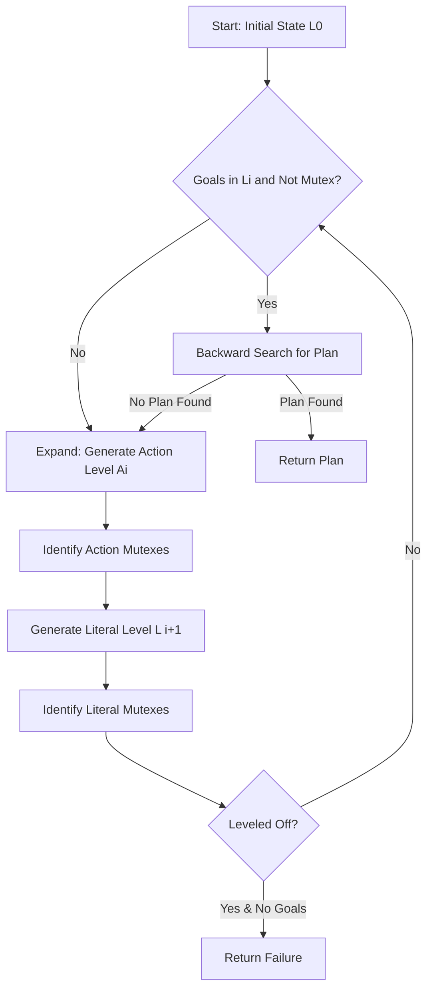

# Classical Planning: PDDL, STRIPS, and GraphPlan

> **Classical Planning** is the formal study of finding a sequence of actions that transforms a structured representation of the world from an initial state to a goal state, assuming a deterministic, static, and fully observable environment.

## 1. Historical Background & Motivation

The genesis of automated planning dates back to the late 1960s at the Stanford Research Institute (SRI) with the development of **STRIPS** (Stanford Research Institute Problem Solver). Created by Richard Fikes and Nils Nilsson in 1971, STRIPS was designed to power "Shakey the Robot," the first general-purpose mobile robot capable of reasoning about its own actions. Before STRIPS, artificial intelligence relied heavily on theorem proving in first-order logic, which suffered from the **Frame Problem**: the computational nightmare of explicitly stating everything that *remains unchanged* when an action is performed. STRIPS bypassed this by introducing a domain-independent representation where only the *changes* (additions and deletions) are specified.

As the field matured, the need for a standardized language to compare different planning algorithms led to the creation of **PDDL** (Planning Domain Definition Language) in 1998 by Drew McDermott and colleagues for the first International Planning Competition (IPC). PDDL separated the "Domain" (the physics of the world) from the "Problem" (the specific objects and goals). This separation allowed for the development of "off-the-shelf" planners. In 1995, Blum and Furst revolutionized the field with **GraphPlan**, which shifted the paradigm from searching through state-spaces to searching through a specialized "Planning Graph" structure, effectively introducing reachability analysis and mutual exclusion (mutex) reasoning into AI search. Today, these techniques form the backbone of satellite scheduling at NASA, automated warehouse logistics at Amazon, and sophisticated NPC behavior in game engines.

## 2. Visual Intuition
:::demo
<div style="background:#1e1e1e;padding:16px;border-radius:10px;color:#e5e7eb;font-family:system-ui,sans-serif">
  <h3 style="margin:0 0 8px 0;color:#7dd3fc">Classical Planning: PDDL, STRIPS, and GraphPlan - Concept Map</h3>
  <svg width="100%" height="280" viewBox="0 0 640 280" role="img" aria-label="Classical Planning: PDDL, STRIPS, and GraphPlan visual intuition" style="background:#111827;border-radius:8px">
    <rect x="24" y="28" width="180" height="64" rx="10" fill="#1d4ed8" />
    <text x="114" y="66" text-anchor="middle" fill="#e5e7eb" font-size="14">Problem</text>
    <rect x="230" y="28" width="180" height="64" rx="10" fill="#0f766e" />
    <text x="320" y="66" text-anchor="middle" fill="#e5e7eb" font-size="14">Process</text>
    <rect x="436" y="28" width="180" height="64" rx="10" fill="#7c3aed" />
    <text x="526" y="66" text-anchor="middle" fill="#e5e7eb" font-size="14">Outcome</text>

    <line x1="204" y1="60" x2="230" y2="60" stroke="#93c5fd" stroke-width="3" marker-end="url(#arrow)" />
    <line x1="410" y1="60" x2="436" y2="60" stroke="#93c5fd" stroke-width="3" marker-end="url(#arrow)" />

    <rect x="24" y="130" width="592" height="120" rx="10" fill="#0b1220" stroke="#334155" />
    <text x="320" y="156" text-anchor="middle" fill="#cbd5e1" font-size="14">Key intuition for Classical Planning: PDDL, STRIPS, and GraphPlan</text>
    <text x="320" y="182" text-anchor="middle" fill="#94a3b8" font-size="12">Track state changes, constraints, and final behavior.</text>
    <text x="320" y="206" text-anchor="middle" fill="#94a3b8" font-size="12">Use this as a mental model before formal proofs or code.</text>

    <defs>
      <marker id="arrow" markerWidth="10" markerHeight="10" refX="8" refY="3" orient="auto">
        <polygon points="0 0, 10 3, 0 6" fill="#93c5fd" />
      </marker>
    </defs>
  </svg>
  <p style="margin-top:10px;color:#cbd5e1">Interactive-ready visual scaffold for the topic.</p>
</div>
:::
*Caption: A representation of a Planning Graph in GraphPlan. It alternates between Literal levels (states) and Action levels. The red lines represent Mutual Exclusion (mutex) constraints, preventing the planner from executing conflicting actions simultaneously.*

## 3. Core Theory & Mathematical Foundations

Classical planning operates on a formal model often denoted as a restricted version of a **Transition System**.

### 3.1 The STRIPS Formalism
A STRIPS problem is defined as a tuple $\Sigma = (S, A, \gamma, I, G)$:
- **$S$**: A set of states. In STRIPS, a state is a set of ground (variable-free) atomic literals (e.g., `At(Robot, RoomA)`).
- **$A$**: A set of actions. Each action $a \in A$ is defined by three sets:
  1. $Pre(a)$: Preconditions that must be true in the current state to execute $a$.
  2. $Add(a)$: Literals to be added to the state (the "Add List").
  3. $Del(a)$: Literals to be removed from the state (the "Delete List").
- **$\gamma(s, a)$**: The transition function. If $Pre(a) \subseteq s$, then $\gamma(s, a) = (s \setminus Del(a)) \cup Add(a)$. Otherwise, the action is undefined.
- **$I \subseteq S$**: The initial state.
- **$G \subseteq S$**: The goal specification (a set of literals that must be true in the final state).

### 3.2 The PDDL Standard
PDDL extends STRIPS by introducing types, constants, and complex logic. A PDDL definition is split into:
1. **The Domain**: Defines predicates (e.g., `(on ?x ?y)`) and operators (actions with variables).
2. **The Problem**: Defines objects (e.g., `blockA`, `blockB`), the initial state `(:init ...)`, and the goal `(:goal ...)`.

Mathematically, PDDL allows us to represent a huge state space compactly. If we have $n$ boolean predicates and $m$ objects, the number of possible ground literals is proportional to $n \cdot m^k$ (where $k$ is the max arity), leading to a state space of size $2^{n \cdot m^k}$.

### 3.3 GraphPlan and the Planning Graph
The core of GraphPlan is the **Planning Graph** $\mathcal{G}$, which is a directed, leveled graph.
- **Level $L_i$**: A set of literals that *might* be true at time $i$.
- **Level $A_i$**: A set of actions that *might* be applicable at time $i$.

The graph is expanded until all goal literals appear in a literal level $L_k$ without being **mutually exclusive (mutex)**.

#### Mutual Exclusion (Mutex) Relations
Two actions at the same level $A_i$ are mutex if:
1. **Inconsistent Effects**: One action deletes an effect of the other.
2. **Interference**: One action deletes a precondition of the other.
3. **Competing Needs**: Their preconditions are mutex at level $L_i$.

Two literals at level $L_{i+1}$ are mutex if:
1. **Inconsistent Support**: Every possible pair of actions that could achieve these literals is mutex at level $A_i$.

### 3.4 Formal Analysis: Complexity & Correctness
The complexity of classical planning depends on the representation:
- **Propositional STRIPS**: Deciding if a plan exists is **PSPACE-complete**.
- **STRIPS with state constraints**: Can be **EXPSPACE-complete**.
- **GraphPlan Correctness**: GraphPlan is guaranteed to find the shortest possible plan (in terms of time steps, though not necessarily number of actions) if one exists. This is because it expands the graph level-by-level, mimicking a Breadth-First Search (BFS) through the planning graph.

**Theorem (Convergence of Planning Graph):** A planning graph will eventually level off (the set of literals and mutexes will stop changing) because the number of possible literals and actions is finite, and the sets of literals and actions grow monotonically while the set of mutexes shrinks monotonically.

## 4. Algorithm: The GraphPlan Procedure

1.  **Initialize**: Let $i = 0$. $L_0$ = literals in the initial state.
2.  **Expansion Loop**:
    - While the goals are not present in $L_i$ OR any pair of goals in $L_i$ is mutex:
        - Generate $A_i$ by finding all ground actions whose preconditions are in $L_i$ and not mutex.
        - Include "No-op" (persistence) actions for every literal in $L_i$.
        - Calculate mutexes for $A_i$.
        - Generate $L_{i+1}$ by taking the union of all effects of actions in $A_i$.
        - Calculate mutexes for $L_{i+1}$.
        - If the graph has leveled off and goals aren't met, return **FAILURE**.
        - $i = i + 1$.
3.  **Extraction (Backward Search)**:
    - Attempt to find a valid plan by searching backward from the goal at level $L_i$.
    - If search fails, $i = i + 1$, go back to step 2.
    - If search succeeds, return the plan.

## 5. Visual Diagram


*Caption: The GraphPlan execution flow. Note the dual nature: polynomial-time graph expansion and exponential-time backward search.*

## 6. Implementation

### 6.1 Core Implementation: STRIPS Logic in Python

```python
class Action:
    def __init__(self, name, pre, add, delete):
        """
        Represents a STRIPS action.
        :param name: String name of action
        :param pre: Set of literals (preconditions)
        :param add: Set of literals to add
        :param delete: Set of literals to delete
        """
        self.name = name
        self.pre = set(pre)
        self.add = set(add)
        self.delete = set(delete)

    def is_applicable(self, state):
        return self.pre.issubset(state)

    def apply(self, state):
        if not self.is_applicable(state):
            raise ValueError(f"Action {self.name} not applicable")
        return (state - self.delete) | self.add

def simple_strips_search(initial_state, goals, actions):
    """
    Basic Forward State-Space Search (BFS) for a STRIPS plan.
    Complexity: O(b^d) where b is branching factor and d is plan depth.
    """
    queue = [(initial_state, [])]
    visited = {frozenset(initial_state)}

    while queue:
        state, path = queue.pop(0)
        
        # Check if all goal literals are in the current state
        if goals.issubset(state):
            return path
        
        for action in actions:
            if action.is_applicable(state):
                next_state = action.apply(state)
                if frozenset(next_state) not in visited:
                    visited.add(frozenset(next_state))
                    queue.append((next_state, path + [action.name]))
    return None

# --- Example Usage (The 'Have Cake' Problem) ---
# Initial: Have(Cake)
# Goal: Have(Cake) AND Eaten(Cake)
actions = [
    Action("EatCake", {"Have(Cake)"}, {"Eaten(Cake)"}, {"Have(Cake)"}),
    Action("BakeCake", set(), {"Have(Cake)"}, set())
]
init = {"Have(Cake)"}
goal = {"Have(Cake)", "Eaten(Cake)"}

plan = simple_strips_search(init, goal, actions)
print(f"Plan found: {plan}") 
# Expected Output: ['EatCake', 'BakeCake']
```

### 6.2 Optimized Variant: Heuristic Search (A*)
In production, we use **Heuristic Search Planning (HSP)**. A common heuristic is the **Delete Relaxation** ($h^+$, $h_{max}$, or $h_{add}$), where we assume actions never delete literals.

```python
def h_add_heuristic(state, goals, actions):
    """
    Calculates the 'h_add' (additive) heuristic using delete relaxation.
    This is an inadmissible but often effective heuristic.
    """
    reached = {lit: 0 for lit in state}
    changed = True
    while changed:
        changed = False
        for action in actions:
            # If all preconditions are reached
            if action.pre.issubset(reached.keys()):
                cost = sum(reached[p] for p in action.pre) + 1
                for lit in action.add:
                    if lit not in reached or reached[lit] > cost:
                        reached[lit] = cost
                        changed = True
    
    if not goals.issubset(reached.keys()):
        return float('inf')
    return sum(reached[g] for g in goals)
```

### 6.3 Common Pitfalls in Code
1.  **State Representation**: Using lists instead of sets for state checks results in $O(N)$ lookups rather than $O(1)$, slowing down the planner exponentially.
2.  **Infinite Loops**: Forgetting to check "visited states" in forward search will cause the planner to loop infinitely on cycles (e.g., `Move(A,B)` followed by `Move(B,A)`).
3.  **No-op Mutexes**: In GraphPlan, failing to include "Persistence" (No-op) actions leads to the inability to preserve state across levels.

## 7. Interactive Demo

:::demo
<!-- title: GraphPlan Level-by-Level Expansion -->
<!DOCTYPE html>
<html>
<head>
<meta charset="utf-8">
<style>
  body { margin:0; background:#0f1117; color:#e5e7eb; font-family: 'Segoe UI', Tahoma, Geneva, Verdana, sans-serif; padding:16px; }
  .node { border: 1px solid #4b5563; padding: 4px 8px; margin: 4px; border-radius: 4px; display: inline-block; font-size: 11px; }
  .literal { background: #1e293b; color: #60a5fa; }
  .action { background: #312e81; color: #a5b4fc; }
  .mutex { border-color: #ef4444; color: #fca5a5; }
  .level-container { display: flex; flex-direction: row; gap: 20px; overflow-x: auto; padding-bottom: 20px; }
  .level-column { min-width: 150px; border-right: 1px dashed #374151; padding: 10px; }
  .controls { margin-bottom: 20px; background: #1f2937; padding: 10px; border-radius: 8px; }
  button { cursor: pointer; background: #3b82f6; color: white; border: none; padding: 8px 12px; border-radius: 4px; margin-right: 5px; }
  button:disabled { background: #4b5563; }
</style>
</head>
<body>
  <div class="controls">
    <h3>GraphPlan Expansion Simulator</h3>
    <button id="stepBtn">Next Level</button>
    <button id="resetBtn">Reset</button>
    <span>Current Step: <strong id="stepCounter">0</strong></span>
  </div>
  <div class="level-container" id="graphArea"></div>

<script>
  let step = 0;
  const graphArea = document.getElementById('graphArea');
  const stepCounter = document.getElementById('stepCounter');
  
  const domain = {
    init: ["At(Robot,A)", "Free(B)"],
    actions: [
      { name: "Move(A,B)", pre: ["At(Robot,A)", "Free(B)"], add: ["At(Robot,B)", "Free(A)"], del: ["At(Robot,A)", "Free(B)"] },
      { name: "No-op:At(A)", pre: ["At(Robot,A)"], add: ["At(Robot,A)"], del: [] },
      { name: "No-op:Free(B)", pre: ["Free(B)"], add: ["Free(B)"], del: [] }
    ]
  };

  let currentLiterals = [...domain.init];

  function renderLevel(type, items, index) {
    const col = document.createElement('div');
    col.className = 'level-column';
    col.innerHTML = `<h4>${type} ${index}</h4>`;
    items.forEach(item => {
      const div = document.createElement('div');
      div.className = `node ${type.toLowerCase().includes('literal') ? 'literal' : 'action'}`;
      div.textContent = item;
      col.appendChild(div);
    });
    graphArea.appendChild(col);
  }

  function nextStep() {
    if (step % 2 === 0) {
      // Add Actions
      let applicable = domain.actions.filter(a => a.pre.every(p => currentLiterals.includes(p)));
      renderLevel("Actions", applicable.map(a => a.name), Math.floor(step/2));
    } else {
      // Add Literals
      let nextLiterals = new Set();
      domain.actions.forEach(a => {
        if (a.pre.every(p => currentLiterals.includes(p))) {
          a.add.forEach(lit => nextLiterals.add(lit));
        }
      });
      currentLiterals = Array.from(nextLiterals);
      renderLevel("Literals", currentLiterals, Math.ceil(step/2));
    }
    step++;
    stepCounter.textContent = step;
  }

  document.getElementById('stepBtn').onclick = nextStep;
  document.getElementById('resetBtn').onclick = () => {
    graphArea.innerHTML = '';
    step = 0;
    currentLiterals = [...domain.init];
    renderLevel("Literals", currentLiterals, 0);
    stepCounter.textContent = "0";
  };

  // Initial Level
  renderLevel("Literals", currentLiterals, 0);
</script>
</body>
</html>
:::

## 8. Worked Examples

### Example 1 — The Spare Tire Problem
**Initial State**: `At(Spare, Trunk)`, `At(Flat, Axle)`
**Goal**: `At(Spare, Axle)`
**Actions**:
- `Remove(Spare, Trunk)`: Pre: `At(Spare, Trunk)`, Add: `At(Spare, Ground)`, Del: `At(Spare, Trunk)`
- `Remove(Flat, Axle)`: Pre: `At(Flat, Axle)`, Add: `At(Flat, Ground)`, Del: `At(Flat, Axle)`
- `PutOn(Spare, Axle)`: Pre: `At(Spare, Ground)`, `Not At(Flat, Axle)`, Add: `At(Spare, Axle)`, Del: `At(Spare, Ground)`

**Step-by-Step State Evolution**:
1. **$S_0$**: `{At(Spare, Trunk), At(Flat, Axle)}`
2. **Action**: `Remove(Spare, Trunk)` -> **$S_1$**: `{At(Spare, Ground), At(Flat, Axle)}`
3. **Action**: `Remove(Flat, Axle)` -> **$S_2$**: `{At(Spare, Ground), At(Flat, Ground)}`
4. **Action**: `PutOn(Spare, Axle)` -> **$S_3$**: `{At(Spare, Axle), At(Flat, Ground)}` (Goal Reached)

### Example 2 — Mutex in GraphPlan (The "Cake" Case)
Suppose $L_0 = \{\text{HaveCake}\}$.
Actions in $A_0$:
- `EatCake`: Pre: `HaveCake`, Add: `EatenCake`, Del: `HaveCake`
- `Persistence (No-op)`: Pre: `HaveCake`, Add: `HaveCake`

**Mutex Analysis at $A_0$**:
`EatCake` and `No-op:HaveCake` are **mutex** because `EatCake` deletes the effect of `No-op` (Inconsistent Effects) and deletes the precondition of `No-op` (Interference).
Consequently, at $L_1$, the literals `HaveCake` and `EatenCake` will be **mutex**. This correctly models the logic that you cannot simultaneously have your cake and eat it.

## 9. Comparison with Alternatives

| Approach | Time | Space | Pros | Cons | Best Used When |
|---|---|---|---|---|---|
| **STRIPS (BFS)** | $O(b^d)$ | $O(b^d)$ | Simple, Optimal (Shortest path) | Memory explosion | Toy problems |
| **GraphPlan** | Polynomial expansion | Polynomial graph | Prunes state space via Mutex | Backtracking is still exp. | Parallelizable actions |
| **Heuristic Search (HSP/FF)** | $O(\text{Heuristic-directed})$ | $O(\text{States})$ | Extremely fast for huge domains | Sub-optimal plans | Large-scale logistics |
| **Constraint Satisfaction (SATPlan)** | $O(2^n)$ | $O(\text{Constraints})$ | Leverages high-perf SAT solvers | Hard to model | Complex logic constraints |

## 10. Industry Applications & Real Systems

- **NASA Deep Space One**: The "Remote Agent" system used classical planning (specifically a variant of PDDL/Temporal planning) to manage onboard activities without human intervention, handling failure recovery autonomously.
- **Amazon Robotics**: In Kiva-style warehouses, high-level mission planning (which robot picks which shelf) uses classical planning primitives to decompose complex goals into move-and-lift sequences.
- **Cybersecurity (Red Teaming)**: Systems like **CALDERA** use PDDL to model attacker actions. An "Attack Planner" finds a sequence of lateral movements and privilege escalations to reach a "Crown Jewel" server.
- **Automated Manufacturing**: Companies like **BMW** use planning to sequence robotic arms on assembly lines, where preconditions involve specific parts being available and tools being calibrated.

## 11. Practice Problems

### 🟢 Easy
1. **Blocks World**: Given blocks A and B on the table, write the `Unstack(A, B)` action in STRIPS format.
   *Hint: What must be on top of A for it to be moved?*
   *Expected complexity: $O(1)$ representation.*

### 🟡 Medium
2. **Mutex Propagation**: In a planning graph, if two actions $a_1$ and $a_2$ are mutex at level $A_i$, and $a_1$ is the *only* action that achieves literal $p$, while $a_2$ is the *only* action that achieves literal $q$, are $p$ and $q$ mutex at level $L_{i+1}$? Prove your answer.
   *Hint: Use the definition of Inconsistent Support.*

3. **Delete Relaxation**: Calculate the $h_{add}$ heuristic value for the "Spare Tire" problem from Example 1, starting from the initial state.

### 🔴 Hard
4. **PDDL to SAT**: Describe a scheme to encode a STRIPS problem with a fixed horizon $T$ into a Boolean Satisfiability (SAT) formula. How do you represent action application and frame axioms?
   *Hint: Variables represent literals at time $t$ and actions at time $t$.*
   *Expected complexity: Resulting formula is $O(T \cdot (|A| + |L|))$.*

5. **GraphPlan Level-off**: Prove that the set of literals in $L_i$ is a subset of $L_{i+1}$ for all $i$.

## 12. Interactive Quiz

:::quiz
**Q1: What problem did STRIPS primarily solve that plagued earlier Logic-based AI?**
- A) The Halting Problem
- B) The Frame Problem
- C) The Traveling Salesman Problem
- D) The NP-Hardness of SAT
> B — The Frame Problem refers to the difficulty of representing what doesn't change after an action. STRIPS solved this via the "Delete List" assumption.

**Q2: Two actions in GraphPlan are mutex if one deletes a precondition of another. This is called:**
- A) Inconsistent Effects
- B) Competing Needs
- C) Interference
- D) Inconsistent Support
> C — Interference occurs when one action's execution negates the possibility of another by removing its requirements.

**Q3: Which complexity class best describes deciding if a STRIPS plan exists?**
- A) P
- B) NP
- C) PSPACE-complete
- D) EXPTIME-complete
> C — STRIPS planning is PSPACE-complete. Even for simple domains, the state space can be exponential relative to the number of objects.

**Q4: If the GraphPlan graph levels off and the goal is not present (or is mutex), what can we conclude?**
- A) The search took too long.
- B) There is no plan that achieves the goal.
- C) We need to add more actions.
- D) The problem is undecidable.
> B — The planning graph provides a necessary condition for reachability. If the goal isn't reachable in the leveled-off graph, it's unreachable in the state space.

**Q5: What is the primary disadvantage of the "Delete Relaxation" heuristic?**
- A) It is too slow to calculate.
- B) It is inadmissible (can overestimate cost).
- C) it ignores the cost of deleting literals.
- D) It cannot be used with A* search.
> B — Delete relaxation ($h_{add}$) is inadmissible because it ignores the "negative" cost of actions, making goals look easier to reach than they actually are.
:::

## 13. Interview Preparation

### Conceptual Questions
**Q: How does GraphPlan differ from simple BFS in state space?**
*A: BFS searches the state space explicitly, node by node. GraphPlan constructs a leveled graph that represents a "relaxed" version of the problem, allowing it to prune large sections of the search space by identifying mutually exclusive literals and actions. It essentially performs a reachability analysis before committing to a search.*

**Q: Explain the difference between the Domain and Problem files in PDDL.**
*A: The Domain file is the "schema"—it contains predicates and operators (actions) that define the rules of the world. The Problem file is the "instance"—it defines specific objects, the concrete initial state, and the specific goal to be achieved.*

### Quick Reference (Cheat Sheet)
| Property | Value |
|---|---|
| STRIPS Complexity | PSPACE-complete |
| GraphPlan Space | Polynomial in literals/actions |
| Heuristic $h^+$ | Optimal but NP-hard to compute |
| Mutex Types | 3 for Actions, 1 for Literals |
| Optimal? | GraphPlan (Yes, for time-steps) |

## 14. Key Takeaways
1. **Classical Planning** assumes determinism, full observability, and discrete time.
2. **STRIPS** introduced the Add/Delete list mechanism to solve the Frame Problem.
3. **PDDL** is the industry standard for modeling planning domains.
4. **GraphPlan** uses a Planning Graph to detect unreachable states early via **Mutex propagation**.
5. **Heuristic search** (HSP/FF) is currently the most popular approach for large-scale industrial planning.
6. **Mutual Exclusion** is the critical insight that allows GraphPlan to handle parallel actions.

## 15. Common Misconceptions
- ❌ **"GraphPlan finds the plan with the fewest actions."** → ✅ Correct: GraphPlan finds the plan with the fewest **time steps** (it allows parallel non-mutex actions).
- ❌ **"PDDL is a programming language."** → ✅ Correct: It is a **declarative modeling language**. It describes *what* is true, not *how* to search for the solution.
- ❌ **"Classical planning is used for robots in the real world."** → ✅ Correct: Only partially. Real-world robotics often requires **Probabilistic Planning** (MDPs) to handle uncertainty, though classical planning is used for high-level logic.

## 16. Further Reading
- *Artificial Intelligence: A Modern Approach (Russell & Norvig), Chapter 10-11* — The definitive text on planning algorithms.
- *Automated Planning: Theory and Practice (Ghallab et al.)* — Deep dive into the logic and mathematics.
- *The STRIPS Paper (Fikes & Nilsson, 1971)* — The original seminal work.
- *GraphPlan Original Paper (Blum & Furst, 1995)* — Highly readable and transformative.

## 17. Related Topics
- [[heuristic-design]] — How to create heuristics like $h_{add}$.
- [[temporal-logic]] — Adding time constraints to planning.
- [[markov-decision-processes]] — Planning under uncertainty.
- [[search-algorithms]] — Foundational BFS/DFS/A* logic.
