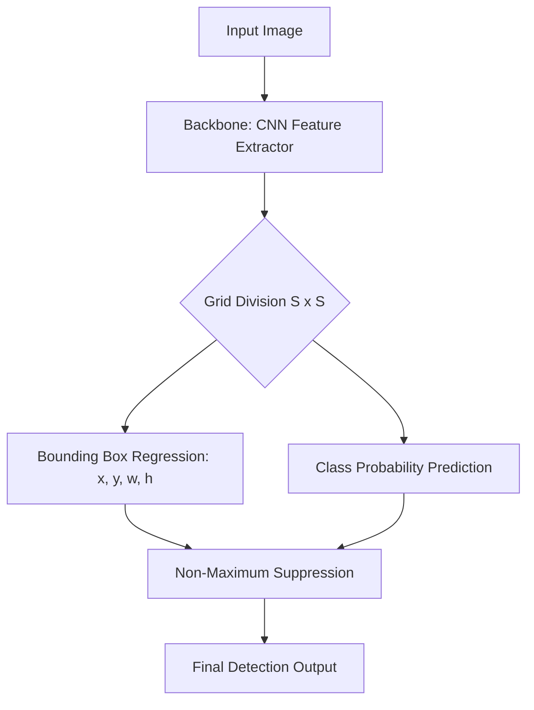

# Computer Vision in AI: Object Detection, Segmentation, YOLO

> Computer vision enables machines to interpret and label visual data by mapping raw pixel intensities into structured semantic representations of objects and their boundaries.

## Overview
Computer Vision (CV) is a subfield of artificial intelligence focused on training computers to derive meaningful information from digital images and videos. While image classification assigns a single label to an entire image, Object Detection and Segmentation delve deeper: detection identifies the presence and location of objects via bounding boxes, while segmentation performs pixel-level classification to delineate the exact shape of an object.

The transition from classical computer vision (e.g., SIFT, HOG features) to deep learning transformed the field. The introduction of the R-CNN (Region-based Convolutional Neural Networks) family in 2014 demonstrated that deep models could reliably propose regions of interest. Today, the standard is shifted toward "single-shot" detectors like YOLO (You Only Look Once), which treat detection as a single regression problem, enabling real-time inference that is critical for autonomous vehicles, robotics, and medical imaging.

## 2. Visual Intuition
:::demo
<div style="background:#1e1e1e;padding:16px;border-radius:10px;color:#e5e7eb;font-family:system-ui,sans-serif">
  <h3 style="margin:0 0 8px 0;color:#7dd3fc">Computer Vision in AI: Object Detection, Segmentation, YOLO - Concept Map</h3>
  <svg width="100%" height="280" viewBox="0 0 640 280" role="img" aria-label="Computer Vision in AI: Object Detection, Segmentation, YOLO visual intuition" style="background:#111827;border-radius:8px">
    <rect x="24" y="28" width="180" height="64" rx="10" fill="#1d4ed8" />
    <text x="114" y="66" text-anchor="middle" fill="#e5e7eb" font-size="14">Problem</text>
    <rect x="230" y="28" width="180" height="64" rx="10" fill="#0f766e" />
    <text x="320" y="66" text-anchor="middle" fill="#e5e7eb" font-size="14">Process</text>
    <rect x="436" y="28" width="180" height="64" rx="10" fill="#7c3aed" />
    <text x="526" y="66" text-anchor="middle" fill="#e5e7eb" font-size="14">Outcome</text>

    <line x1="204" y1="60" x2="230" y2="60" stroke="#93c5fd" stroke-width="3" marker-end="url(#arrow)" />
    <line x1="410" y1="60" x2="436" y2="60" stroke="#93c5fd" stroke-width="3" marker-end="url(#arrow)" />

    <rect x="24" y="130" width="592" height="120" rx="10" fill="#0b1220" stroke="#334155" />
    <text x="320" y="156" text-anchor="middle" fill="#cbd5e1" font-size="14">Key intuition for Computer Vision in AI: Object Detection, Segmentation, YOLO</text>
    <text x="320" y="182" text-anchor="middle" fill="#94a3b8" font-size="12">Track state changes, constraints, and final behavior.</text>
    <text x="320" y="206" text-anchor="middle" fill="#94a3b8" font-size="12">Use this as a mental model before formal proofs or code.</text>

    <defs>
      <marker id="arrow" markerWidth="10" markerHeight="10" refX="8" refY="3" orient="auto">
        <polygon points="0 0, 10 3, 0 6" fill="#93c5fd" />
      </marker>
    </defs>
  </svg>
  <p style="margin-top:10px;color:#cbd5e1">Interactive-ready visual scaffold for the topic.</p>
</div>
:::
*Caption: A demonstration of a YOLO-style detector processing a video frame to draw real-time bounding boxes and class labels.*

## Core Theory
### Object Detection Formulation
Object detection requires predicting a set of bounding boxes $B = \{b_1, b_2, \dots, b_n\}$ and corresponding class probabilities $C = \{c_1, c_2, \dots, c_n\}$. Each box is typically defined by $(x, y, w, h)$, where $(x, y)$ is the center coordinate and $(w, h)$ are the dimensions.

The loss function for detection is a multi-task loss:
$$L_{total} = \lambda_{coord} L_{box} + L_{class} + \lambda_{obj} L_{conf}$$
Where $L_{box}$ is often the Smooth L1 loss or Intersection over Union (IoU) loss:
$$IoU = \frac{|A \cap B|}{|A \cup B|}$$

### YOLO (You Only Look Once)
YOLO divides the input image into an $S \times S$ grid. If the center of an object falls into a grid cell, that cell is responsible for detecting that object. Each cell predicts $B$ bounding boxes and confidence scores $Pr(Object) \times IoU$. This formulation allows for global reasoning about the image during inference, resulting in significantly faster speeds than two-stage detectors (like Faster R-CNN) that require a region proposal network (RPN) pass.

## Visual Diagram

*The architectural pipeline of a single-shot detector showing feature extraction through to NMS.*

## Code Example
```python
import torch
import torch.nn as nn

# Simplified YOLO-like Output Head
class DetectionHead(nn.Module):
    def __init__(self, num_classes, num_anchors):
        super().__init__()
        self.num_classes = num_classes
        self.num_anchors = num_anchors
        # Output: (x, y, w, h) + confidence + classes
        self.conv = nn.Conv2d(1024, num_anchors * (5 + num_classes), 1)

    def forward(self, x):
        batch, _, h, w = x.shape
        out = self.conv(x)
        # Reshape to (Batch, Anchors, Classes+5, H, W)
        return out.view(batch, self.num_anchors, 5 + self.num_classes, h, w)

# Simulation
dummy_feature_map = torch.randn(1, 1024, 13, 13)
head = DetectionHead(num_classes=20, num_anchors=5)
output = head(dummy_feature_map)

print(f"Output shape: {output.shape}") 
# Expected: torch.Size([1, 5, 25, 13, 13])
# 13x13 grid cells, 5 anchors, 25 values (x,y,w,h,conf, 20 classes)
```

## Interactive Demo
:::demo
<!DOCTYPE html>
<html>
<body>
<canvas id="cvCanvas" width="400" height="300" style="background:#222;"></canvas>
<script>
  const canvas = document.getElementById('cvCanvas');
  const ctx = canvas.getContext('2d');
  let x = 50;
  function draw() {
    ctx.clearRect(0,0,400,300);
    ctx.strokeStyle = '#00ff00';
    ctx.lineWidth = 3;
    ctx.strokeRect(x, 100, 100, 100);
    ctx.fillStyle = '#00ff00';
    ctx.fillText("Object: Car", x, 95);
    x = (x + 1) % 300;
    requestAnimationFrame(draw);
  }
  draw();
</script>
</body>
</html>
:::

## Worked Example
Given a grid cell where the network predicts a box center $x=0.5, y=0.5$ relative to the cell, and dimensions $w=0.2, h=0.2$ relative to the full image:
1. **Grid offset:** If cell is at $(2, 3)$ in a $13 \times 13$ grid, real center = $(2+0.5)/13, (3+0.5)/13$.
2. **Prediction:** Box centered at $(0.19, 0.27)$ in image coordinates.
3. **IoU Calculation:** If ground truth is at $(0.2, 0.25)$ with same size, the intersection area and union area are calculated to determine if the detection is a True Positive (usually $IoU > 0.5$).

## Industry Applications
- **Tesla (Autonomous Driving):** Uses multi-camera object detection for pedestrian and vehicle tracking.
- **Amazon (Amazon Go):** Uses computer vision for "Just Walk Out" technology to identify items removed from shelves.
- **Medtronic (Medical Imaging):** Automated segmentation of tumors in MRI scans to assist radiologists.

## Practice Problems

### Easy
1. Given an image size of $416 \times 416$ and a grid size of $13 \times 13$, what is the physical size of one grid cell? *(Hint: Divide image dimension by grid dimension.)*

### Medium
2. Explain the purpose of Non-Maximum Suppression (NMS). Why is it required in YOLO? *(Hint: Multiple grid cells may detect the same object.)*
3. If an object is detected with a confidence score of 0.8 and the true label is "Dog", calculate the final score used for filtering. *(Hint: Multiply confidence by class probability.)*

### Hard
4. Derive the gradient of the IoU loss with respect to the bounding box coordinates $x, y$. Why is IoU loss non-differentiable when the boxes do not overlap? *(Hint: Use the intersection area formula $A \cap B = \max(0, w) \times \max(0, h)$.)*

## Interactive Quiz
:::quiz
**Q1:** What is the primary advantage of YOLO over Faster R-CNN?
- A) Higher precision on small objects
- B) Faster inference speed
- C) Does not require a CNN backbone
- D) Uses more memory
> B — YOLO is a single-stage detector, meaning it bypasses the computationally expensive region proposal stage, making it significantly faster for real-time applications.

**Q2:** In object detection, what does the 'confidence score' represent?
- A) The probability that the bounding box contains an object AND the IoU of that box.
- B) The probability that the image is classified correctly.
- C) The exact pixel location of the object.
- D) The accuracy of the segmentation mask.
> A — Confidence in YOLO is defined as $P(Object) \times IoU_{pred}^{truth}$. It measures both the likelihood an object exists and the fit of the box.

**Q3:** Which of the following is NOT a challenge in object detection?
- A) Occlusion (objects overlapping)
- B) Scale variation (objects appearing at different distances)
- C) Non-differentiability of the classification loss
- D) High class imbalance
> C — Cross-entropy classification loss is fully differentiable. Occlusion, scale variation, and class imbalance are classic, difficult hurdles in detection.
:::

## Interview Questions
**Q: Explain YOLO as you would to a senior engineer.**
*A: YOLO reframes object detection as a single-shot regression problem. By partitioning the image into a grid and predicting bounding boxes and class probabilities directly from feature maps, it avoids the region-proposal bottlenecks of two-stage architectures. This end-to-end differentiable pipeline allows for optimization of both localization and classification simultaneously, achieving the throughput necessary for production real-time vision.*

**Q: What is the complexity of NMS?**
*A: The complexity is $O(N^2)$ in the worst case where $N$ is the number of boxes, as each box is compared against all others. In practice, since we filter by confidence thresholding first, $N$ is small, making it effectively $O(N \log N)$ or lower.*

**Q: How do you handle small object detection?**
*A: Use Feature Pyramid Networks (FPN) to aggregate features from multiple scales. High-resolution low-level features are fused with semantic high-level features to preserve spatial detail for small instances.*

**Q: How does IoU loss handle bounding box regression?**
*A: Unlike MSE, which treats width and height independently, IoU loss is scale-invariant and explicitly optimizes the overlap between predicted and ground truth boxes, which correlates better with human-perceived detection quality.*

## Key Takeaways
- Object detection locates objects; segmentation labels every pixel.
- YOLO is a single-stage detector optimized for real-time performance.
- Intersection over Union (IoU) is the standard metric for evaluation.
- Non-Maximum Suppression (NMS) removes redundant overlapping detections.
- Feature Pyramids are essential for multi-scale object detection.
- Multi-task loss functions are required to train localization and classification simultaneously.

## Common Misconceptions
- ❌ YOLO is always more accurate than two-stage detectors → ✅ Two-stage detectors (like Faster R-CNN) often achieve higher mean Average Precision (mAP) but are slower.
- ❌ IoU loss is the same as MSE loss → ✅ IoU is scale-invariant and relates to the actual overlap area, whereas MSE treats coordinates as independent Euclidean distances.

## Related Topics
- [[cnn-architectures]] — Foundations of the feature extractors used in detection.
- [[loss-functions-ml]] — Optimization techniques for regression and classification.
- [[deep-learning-optimization]] — How to train large-scale detection models efficiently.
