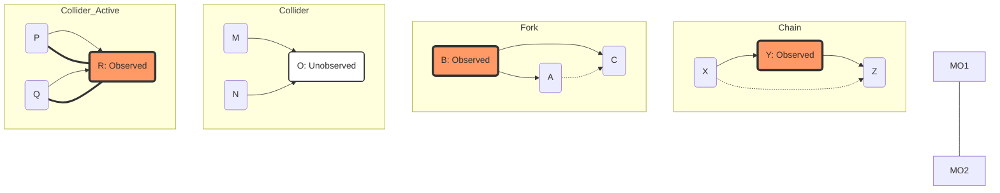

# Conditional Independence and d-Separation in Bayesian Networks

> **Conditional Independence** is the structural property of a probability distribution where two variables provide no information about each other once a third set of variables is known, while **d-separation** (directed-separation) is the formal graph-theoretic criterion used to identify these independencies directly from the topology of a Bayesian Network.

## 1. Historical Background & Motivation

The formalization of conditional independence within graphical models was a watershed moment in Artificial Intelligence, primarily driven by **Judea Pearl** in the 1980s. Before this, AI systems relied heavily on rule-based "expert systems" (like MYCIN) or naive probabilistic approaches that suffered from the "curse of dimensionality." To represent a joint distribution of $n$ boolean variables, one technically needs $2^n - 1$ parameters—an astronomical requirement for even modest systems. Pearl’s introduction of **Bayesian Networks** and the **d-separation algorithm** (1988) provided a mathematically rigorous way to exploit the sparsity of real-world causal relationships.

The evolution of this field shifted AI from "symbolic logic" to "probabilistic reasoning." It solved the problem of *tractability*: by identifying which variables are independent of others, we can factorize the joint probability distribution into a product of local conditional distributions. In modern engineering, this is the backbone of **Causal Inference**, used by companies like Netflix and Meta to move beyond simple correlation to understanding *why* a user interacts with content. Without d-separation, we could not build the Large Language Models (LLMs) or autonomous driving stacks we see today, as these systems rely on understanding the conditional dependencies between features, latent states, and observed outcomes.

## 2. Visual Intuition
:::demo
<div style="background:#1e1e1e;padding:16px;border-radius:10px;color:#e5e7eb;font-family:system-ui,sans-serif">
  <h3 style="margin:0 0 8px 0;color:#7dd3fc">Conditional Independence and d-Separation in Bayesian Networks - Concept Map</h3>
  <svg width="100%" height="280" viewBox="0 0 640 280" role="img" aria-label="Conditional Independence and d-Separation in Bayesian Networks visual intuition" style="background:#111827;border-radius:8px">
    <rect x="24" y="28" width="180" height="64" rx="10" fill="#1d4ed8" />
    <text x="114" y="66" text-anchor="middle" fill="#e5e7eb" font-size="14">Problem</text>
    <rect x="230" y="28" width="180" height="64" rx="10" fill="#0f766e" />
    <text x="320" y="66" text-anchor="middle" fill="#e5e7eb" font-size="14">Process</text>
    <rect x="436" y="28" width="180" height="64" rx="10" fill="#7c3aed" />
    <text x="526" y="66" text-anchor="middle" fill="#e5e7eb" font-size="14">Outcome</text>

    <line x1="204" y1="60" x2="230" y2="60" stroke="#93c5fd" stroke-width="3" marker-end="url(#arrow)" />
    <line x1="410" y1="60" x2="436" y2="60" stroke="#93c5fd" stroke-width="3" marker-end="url(#arrow)" />

    <rect x="24" y="130" width="592" height="120" rx="10" fill="#0b1220" stroke="#334155" />
    <text x="320" y="156" text-anchor="middle" fill="#cbd5e1" font-size="14">Key intuition for Conditional Independence and d-Separation in Bayesian Networks</text>
    <text x="320" y="182" text-anchor="middle" fill="#94a3b8" font-size="12">Track state changes, constraints, and final behavior.</text>
    <text x="320" y="206" text-anchor="middle" fill="#94a3b8" font-size="12">Use this as a mental model before formal proofs or code.</text>

    <defs>
      <marker id="arrow" markerWidth="10" markerHeight="10" refX="8" refY="3" orient="auto">
        <polygon points="0 0, 10 3, 0 6" fill="#93c5fd" />
      </marker>
    </defs>
  </svg>
  <p style="margin-top:10px;color:#cbd5e1">Interactive-ready visual scaffold for the topic.</p>
</div>
:::
*Caption: A classic Bayesian Network structure. d-separation allows us to determine if information can "flow" from one node to another through various paths, given a set of observed evidence nodes.*

## 3. Core Theory & Mathematical Foundations

At the heart of probabilistic graphical models (PGMs) lies the concept of **Conditional Independence (CI)**. Two random variables $X$ and $Y$ are conditionally independent given $Z$ if:
$$P(X, Y | Z) = P(X | Z) P(Y | Z)$$
Or equivalently:
$$P(X | Y, Z) = P(X | Z)$$

This implies that if we already know the state of $Z$, then learning $Y$ provides no additional information about $X$.

### 3.1 The Global Markov Property
A Directed Acyclic Graph (DAG) encodes a set of CI assumptions. The **Global Markov Property** states that any distribution $P$ that factorizes according to a DAG $G$ must satisfy the conditional independencies identified by the d-separation criterion. This link between the *algebra* (probabilities) and the *geometry* (the graph) is what makes Bayesian Networks powerful.

### 3.2 The Three Fundamental Triplets
The "flow" of information through a graph is determined by the configuration of nodes along a path. Any complex path can be decomposed into three types of local structures (triplets):

1.  **Causal Chains ($X \to Y \to Z$):**
    Information flows from $X$ to $Z$ through $Y$. If $Y$ is **unobserved**, $X$ and $Z$ are dependent. If $Y$ is **observed**, the path is blocked, and $X \perp Z | Y$.
    *Example:* Low Pressure $\to$ Rain $\to$ Wet Grass. If you know it's raining, knowing the air pressure doesn't change your belief about the grass being wet.

2.  **Common Cause / Forks ($X \leftarrow Y \to Z$):**
    $Y$ is a common cause of $X$ and $Z$. If $Y$ is **unobserved**, $X$ and $Z$ are dependent (correlated through their parent). If $Y$ is **observed**, the path is blocked, and $X \perp Z | Y$.
    *Example:* Flu $\to$ Fever and Flu $\to$ Aches. Fever and Aches are correlated, but if you know for a fact the patient has the Flu, knowing they have a fever adds no info about their aches.

3.  **Common Effect / Colliders ($X \to Y \leftarrow Z$):**
    This is the most counter-intuitive case. If $Y$ is **unobserved**, the path is blocked ($X \perp Z$). However, if $Y$ (or any of its descendants) is **observed**, the path becomes **active**, and $X$ and $Z$ become dependent. This is known as **Explaining Away**.
    *Example:* Battery Dead $\to$ Car Won't Start $\leftarrow$ No Gas. "Battery Dead" and "No Gas" are independent. But if the car won't start (observed) and I tell you the battery is dead, the probability that it's out of gas decreases.

### 3.3 d-Separation Formal Definition
A path between nodes $U$ and $V$ is **d-separated** by a set of evidence nodes $E$ if and only if:
1.  The path contains a **chain** ($A \to B \to C$) or a **fork** ($A \leftarrow B \to C$) such that the middle node $B$ is in $E$.
2.  The path contains a **collider** ($A \to B \leftarrow C$) such that neither the middle node $B$ nor any descendant of $B$ is in $E$.

If **all** paths between $U$ and $V$ are d-separated by $E$, then $U$ and $V$ are conditionally independent given $E$.

### 3.4 Formal Analysis: Complexity
The check for d-separation is efficient. While exact probabilistic inference in Bayesian Networks is **NP-Hard**, checking d-separation is essentially a reachability problem in a graph.
-   **Time Complexity:** $O(|V| + |E|)$ using a modified Breadth-First Search (BFS) or Depth-First Search (DFS).
-   **Space Complexity:** $O(|V| + |E|)$ to store the graph adjacency list and the visited states.

## 4. Algorithm / Process (The Bayes-Ball Algorithm)

The **Bayes-Ball** algorithm is a popular mental model and computational procedure for checking d-separation. We "roll" a ball from node $X$ to node $Y$. If the ball can reach $Y$, then $X$ and $Y$ are *not* d-separated (they are d-connected).

1.  **Initialize:** Create a set of "observed" nodes $E$.
2.  **Traverse:** Start at node $X$. Depending on the node type and whether it's in $E$, the ball passes through, bounces back, or is blocked.
3.  **Rule for Chains ($A \to B \to C$):**
    -   If $B$ is observed: Ball is blocked.
    -   If $B$ is unobserved: Ball passes through.
4.  **Rule for Forks ($A \leftarrow B \to C$):**
    -   If $B$ is observed: Ball is blocked.
    -   If $B$ is unobserved: Ball passes through.
5.  **Rule for Colliders ($A \to B \leftarrow C$):**
    -   If $B$ (or descendant) is observed: Ball passes through.
    -   If $B$ (and all descendants) are unobserved: Ball is blocked.
6.  **Termination:** If the ball reaches $Y$, $X \not\perp Y | E$. If the ball cannot reach $Y$ after exploring all paths, $X \perp Y | E$.

## 5. Visual Diagram


*Caption: In chains and forks, observing the middle node blocks the path (dashed line). In colliders, observing the middle node activates the path (thick line).*

## 6. Implementation

### 6.1 Core Implementation: d-Separation Checker
This implementation uses a reachability approach on the "moralized" or transformed graph logic, but specifically implements the d-separation rules for clarity.

```python
from collections import deque

class BayesianNetwork:
    def __init__(self, adj_list):
        """
        adj_list: Dict mapping node to list of children.
        Example: {'A': ['C'], 'B': ['C'], 'C': ['D']}
        """
        self.adj = adj_list
        self.nodes = list(adj_list.keys())
        self.parents = {n: [] for n in self.nodes}
        for parent, children in adj_list.items():
            for child in children:
                self.parents[child].append(parent)

    def is_descendant(self, start_node, target_set):
        """Checks if start_node is a descendant of any node in target_set."""
        queue = deque([start_node])
        visited = set()
        while queue:
            curr = queue.popleft()
            if curr in target_set: return True
            if curr in visited: continue
            visited.add(curr)
            queue.extend(self.adj.get(curr, []))
        return False

    def is_d_separated(self, start, end, evidence):
        """
        Implements d-separation using the 'Bayes-Ball' or Reachability logic.
        Returns True if start and end are d-separated by evidence.
        """
        # We search for an active path. If no active path exists, they are d-separated.
        # State: (current_node, direction) where direction is 'up' or 'down'
        visited = set()
        queue = deque([(start, 'from_parent')])
        
        # Precompute descendants for collider rule
        has_observed_descendant = {}
        for n in self.nodes:
            has_observed_descendant[n] = any(self.is_descendant(n, {e}) for e in evidence) or (n in evidence)

        while queue:
            curr, direction = queue.popleft()
            if curr == end: return False # Found an active path
            if (curr, direction) in visited: continue
            visited.add((curr, direction))

            if direction == 'from_parent':
                if curr not in evidence:
                    # Case: Chain (down to children)
                    for child in self.adj.get(curr, []):
                        queue.append((child, 'from_parent'))
                    # Case: Fork (up to parents) - wait, this is handled by from_child
                if has_observed_descendant[curr]:
                    # Case: Collider (up to other parents)
                    for parent in self.parents.get(curr, []):
                        queue.append((parent, 'from_child'))
            
            elif direction == 'from_child':
                if curr not in evidence:
                    # Case: Fork (down to other children)
                    for child in self.adj.get(curr, []):
                        queue.append((child, 'from_parent'))
                    # Case: Chain (up to parents)
                    for parent in self.parents.get(curr, []):
                        queue.append((parent, 'from_child'))

        return True

# --- Sample Usage ---
# Graph: A -> C <- B, C -> D
# A and B are independent. If D is observed, A and B are dependent.
network = BayesianNetwork({'A': ['C'], 'B': ['C'], 'C': ['D'], 'D': []})
print(f"A independent of B given empty set: {network.is_d_separated('A', 'B', set())}") 
# Output: True
print(f"A independent of B given {{D}}: {network.is_d_separated('A', 'B', {'D'})}")
# Output: False
```

### 6.2 Optimized Production Variant
In production systems (like `pgmpy` in Python), d-separation is often checked by:
1.  Constructing the **Moral Graph** of the ancestral set of the nodes of interest.
2.  Removing all evidence nodes.
3.  Checking connectivity.

This is more efficient for batch queries.

### 6.3 Common Pitfalls in Code
*   **Missing Descendants:** A common bug is checking if the collider itself is in the evidence, but forgetting its descendants. If a child of a collider is observed, the collider is activated.
*   **Cycle Detection:** While Bayesian Networks are DAGs, a buggy input might contain cycles, leading to infinite loops in DFS. Always use a `visited` set.
*   **Directional Confusion:** Forgetting that information flows differently "up" the graph (towards parents) versus "down" the graph (towards children).

## 7. Interactive Demo

:::demo
<!-- Interactive d-Separation Visualizer -->
<!DOCTYPE html>
<html>
<head>
<meta charset="utf-8">
<style>
  body { margin:0; background:#0f1117; color:#e5e7eb; font-family: system-ui, sans-serif; font-size:13px; padding:16px; overflow: hidden; }
  canvas { background: #1a1d24; border-radius: 8px; cursor: crosshair; box-shadow: 0 4px 6px -1px rgba(0, 0, 0, 0.1); }
  .controls { position: absolute; top: 20px; left: 20px; background: rgba(0,0,0,0.7); padding: 15px; border-radius: 8px; }
  .legend { position: absolute; bottom: 20px; right: 20px; background: rgba(0,0,0,0.7); padding: 10px; border-radius: 8px; }
  .status { font-weight: bold; color: #10b981; margin-top: 10px; }
  button { background: #3b82f6; color: white; border: none; padding: 5px 10px; border-radius: 4px; cursor: pointer; margin-right: 5px; }
  button:hover { background: #2563eb; }
</style>
</head>
<body>
<div class="controls">
  <strong>d-Separation: A -> C <- B</strong><br><br>
  <button onclick="toggleEvidence('C')">Toggle C (Collider) Observed</button>
  <button onclick="reset()">Reset</button>
  <div id="status" class="status">A and B are Independent</div>
</div>
<div class="legend">
  Blue: Node<br>
  Orange: Observed Evidence<br>
  Green Line: Active Path<br>
  Red X: Blocked Path
</div>
<canvas id="bnCanvas" width="800" height="500"></canvas>
<script>
  const canvas = document.getElementById('bnCanvas');
  const ctx = canvas.getContext('2d');
  const statusDiv = document.getElementById('status');

  let nodes = {
    'A': { x: 200, y: 150, obs: false },
    'B': { x: 600, y: 150, obs: false },
    'C': { x: 400, y: 350, obs: false }
  };
  
  function toggleEvidence(id) {
    nodes[id].obs = !nodes[id].obs;
    updateStatus();
    draw();
  }

  function reset() {
    Object.values(nodes).forEach(n => n.obs = false);
    updateStatus();
    draw();
  }

  function updateStatus() {
    if (nodes['C'].obs) {
      statusDiv.innerText = "A and B are DEPENDENT (Path Active)";
      statusDiv.style.color = "#ef4444";
    } else {
      statusDiv.innerText = "A and B are INDEPENDENT (Blocked)";
      statusDiv.style.color = "#10b981";
    }
  }

  function drawArrow(x1, y1, x2, y2, active) {
    const headlen = 15;
    const angle = Math.atan2(y2 - y1, x2 - x1);
    ctx.beginPath();
    ctx.moveTo(x1, y1);
    ctx.lineTo(x2, y2);
    ctx.strokeStyle = active ? '#10b981' : '#4b5563';
    ctx.lineWidth = active ? 4 : 2;
    ctx.stroke();
    
    ctx.beginPath();
    ctx.moveTo(x2, y2);
    ctx.lineTo(x2 - headlen * Math.cos(angle - Math.PI / 6), y2 - headlen * Math.sin(angle - Math.PI / 6));
    ctx.lineTo(x2 - headlen * Math.cos(angle + Math.PI / 6), y2 - headlen * Math.sin(angle + Math.PI / 6));
    ctx.closePath();
    ctx.fillStyle = active ? '#10b981' : '#4b5563';
    ctx.fill();
  }

  function draw() {
    ctx.clearRect(0, 0, canvas.width, canvas.height);
    
    // Draw edges
    const isActive = nodes['C'].obs;
    drawArrow(nodes['A'].x, nodes['A'].y, nodes['C'].x, nodes['C'].y, isActive);
    drawArrow(nodes['B'].x, nodes['B'].y, nodes['C'].x, nodes['C'].y, isActive);

    // Draw nodes
    Object.entries(nodes).forEach(([id, n]) => {
      ctx.beginPath();
      ctx.arc(n.x, n.y, 30, 0, Math.PI * 2);
      ctx.fillStyle = n.obs ? '#f97316' : '#3b82f6';
      ctx.fill();
      ctx.strokeStyle = '#fff';
      ctx.lineWidth = 2;
      ctx.stroke();
      
      ctx.fillStyle = '#fff';
      ctx.font = 'bold 16px sans-serif';
      ctx.textAlign = 'center';
      ctx.fillText(id, n.x, n.y + 6);
    });

    if (!isActive) {
        ctx.strokeStyle = '#ef4444';
        ctx.lineWidth = 5;
        ctx.beginPath();
        ctx.moveTo(380, 240); ctx.lineTo(420, 260);
        ctx.moveTo(420, 240); ctx.lineTo(380, 260);
        ctx.stroke();
    }
  }

  draw();
</script>
</body>
</html>
:::

## 8. Worked Examples

### Example 1 — Basic Application (The Burglar Alarm)
**Graph:** Burglary ($B$) $\to$ Alarm ($A$), Earthquake ($E$) $\to$ Alarm ($A$), Alarm ($A$) $\to$ JohnCalls ($J$).
**Scenario:** Are $B$ and $E$ independent if $J$ is observed?

1.  Identify paths between $B$ and $E$: The only path is $B \to A \leftarrow E$.
2.  Analyze structure: This is a **collider** at node $A$.
3.  Check Evidence: The set $E = \{J\}$.
4.  Check d-separation criteria:
    -   Is the collider node $A$ in $E$? No.
    -   Is any descendant of $A$ in $E$? Yes, $J$ is a descendant of $A$ and $J \in E$.
5.  **Result:** The path is **active**. $B$ and $E$ are **dependent** given $J$. Knowing John called increases the likelihood that either a burglary or earthquake happened, and knowing one "explains away" the other.

### Example 2 — Complex Multi-path Case
**Nodes:** $X_1 \to X_2, X_1 \to X_3, X_2 \to X_4, X_3 \to X_4, X_4 \to X_5$.
**Question:** Is $X_2 \perp X_3 | \{X_1, X_5\}$?

1.  Path 1: $X_2 \leftarrow X_1 \to X_3$. (Fork at $X_1$).
    -   $X_1$ is observed. This path is **blocked**.
2.  Path 2: $X_2 \to X_4 \leftarrow X_3$. (Collider at $X_4$).
    -   Is $X_4$ observed? No.
    -   Is descendant $X_5$ observed? **Yes**.
    -   This path is **active**.
3.  **Conclusion:** Since at least one path is active, $X_2$ and $X_3$ are **dependent**.

## 9. Comparison with Alternatives

| Approach | Time | Space | Pros | Cons | Best Used When |
|---|---|---|---|---|---|
| **d-Separation** | $O(V+E)$ | $O(V+E)$ | Fast, graph-based, no math required. | Only gives independence, not magnitude. | Quick structural analysis, pruning graphs. |
| **Variable Elimination** | $O(Exp(w))$ | $O(Exp(w))$ | Provides exact probabilities. | NP-Hard (width $w$ dependent). | Small to medium networks. |
| **Sampling (MCMC)** | $O(Samples)$ | $O(V+E)$ | Handles any distribution. | Slow convergence, approximate. | Large, complex continuous models. |
| **Moralization** | $O(V^2)$ | $O(V+E)$ | Generalizes to Undirected Graphs. | Information loss in directionality. | Converting Bayes Nets to Markov Nets. |

## 10. Industry Applications & Real Systems

-   **Google (Search Quality)**: Bayesian networks are used to model the relationship between user intent, queries, and document relevance. d-separation helps engineers identify which user signals (clicks, dwell time) are independent given the query intent.
-   **Microsoft (TrueSkill Rating)**: Used in Xbox Live matchmaking. It models player skill as a latent variable. d-separation determines how a match outcome updates the skill estimates of all participants in a multi-player session.
-   **Tesla (Autopilot Perception)**: The perception stack uses PGMs to fuse sensor data. Conditional independence assumptions allow the system to treat LIDAR and Camera data as independent sources of information given the actual state of an object, simplifying the Kalman Filter updates.
-   **Healthcare (PathAI)**: In digital pathology, d-separation is used to build causal models of disease progression. It helps researchers distinguish between a biomarker that *causes* a disease vs. one that is simply a *common effect* of a latent condition.

## 11. Practice Problems

### 🟢 Easy
1.  **Chain Blockage**: In a chain $A \to B \to C$, if we observe $B$, does $A$ provide any information about $C$?
    *Hint: Apply the chain rule.*
    *Expected complexity: O(1) conceptually.*

### 🟡 Medium
2.  **The Diamond Network**: Given $A \to B, A \to C, B \to D, C \to D$. Are $B$ and $C$ independent given $A$? Are they independent given $D$?
    *Hint: One is a fork, the other involves a collider.*
    *Expected complexity: O(V+E).*

3.  **Markov Blanket Verification**: Prove that a node is d-separated from the rest of the network given its parents, its children, and its children's parents.
    *Hint: This set is called the Markov Blanket.*

### 🔴 Hard
4.  **Algorithm Implementation**: Write a function that returns the *minimal* set of nodes $E$ required to d-separate node $X$ from node $Y$.
    *Hint: This involves finding the minimal cut in a transformed graph.*
    *Expected complexity: Polynomial in V.*

5.  **Faithfulness**: A distribution $P$ is *faithful* to graph $G$ if all independencies in $P$ are captured by d-separation in $G$. Construct a case where $P$ satisfies $X \perp Y$ but the graph $G$ shows $X$ and $Y$ are d-connected.
    *Hint: Think about parameters that exactly cancel each other out (e.g., $P(C|A,B)$).*

## 12. Interactive Quiz

:::quiz
**Q1: Which of the following conditions makes a collider $X \to Y \leftarrow Z$ active?**
- A) Node $Y$ is unobserved.
- B) Node $Y$ is observed.
- C) A descendant of $Y$ is observed.
- D) Both B and C.
> D — A collider path is active if the junction node or any of its descendants are in the evidence set.

**Q2: What is the time complexity of checking d-separation between two nodes in a graph with $V$ nodes and $E$ edges?**
- A) $O(2^V)$
- B) $O(V \cdot E)$
- C) $O(V + E)$
- D) $O(V^2)$
> C — d-separation can be solved using reachability algorithms like BFS or Bayes-Ball which visit each node and edge a constant number of times.

**Q3: If $X$ and $Y$ are d-separated by $Z$, then $P(X|Y,Z)$ is equal to:**
- A) $P(X)$
- B) $P(X|Z)$
- C) $P(Y|Z)$
- D) $P(X,Y|Z)$
> B — This is the fundamental definition of conditional independence. Knowledge of $Y$ is redundant if $Z$ is already known.

**Q4: In the structure $X \leftarrow Y \to Z$, what happens if $Y$ is observed?**
- A) Information flows from $X$ to $Z$.
- B) The path is blocked.
- C) $X$ and $Z$ become dependent.
- D) The graph is no longer a DAG.
> B — This is a "Fork" structure. Observing the common cause blocks the correlation between the effects.

**Q5: Which concept connects d-separation (graph property) to probability (distribution property)?**
- A) The Central Limit Theorem
- B) The Markov Blanket
- C) The Global Markov Property
- D) Bayes' Theorem
> C — The Global Markov Property states that graph-based d-separation implies probabilistic conditional independence.
:::

## 13. Interview Preparation

### Conceptual Questions
**Q: Explain d-separation as if teaching it to a fellow engineer.**
*A: d-separation is a way to look at a flow-chart of causes and effects and decide if two things are independent. Think of it like water pipes. In most cases, observing a node blocks the pipe. But in "colliders" (where two pipes flow into one), observing the junction actually opens the pipe. It's the technical rule for determining when knowing one variable makes another variable redundant.*

**Q: What is "Explaining Away"?**
*A: Explaining away occurs in collider structures ($A \to C \leftarrow B$). Initially, $A$ and $B$ are independent. Once we observe the effect $C$, $A$ and $B$ become dependent. If we then observe that $A$ happened, it provides a reason for $C$, which reduces the probability that $B$ happened. $A$ "explains away" the evidence $C$, making $B$ less likely.*

**Q: Why do we care about d-separation when we have deep learning?**
*A: Deep learning models are often "black boxes" that capture correlations. d-separation is the foundation of **Causal AI**. If we want to know if a medicine actually cures a disease (causality) vs. healthy people just being more likely to take the medicine (correlation/confounding), we must use d-separation to identify and control for those confounding forks.*

### Quick Reference (Cheat Sheet)
| Structure | Path Status (Unobserved) | Path Status (Observed) |
|---|---|---|
| **Chain** ($A \to B \to C$) | **Active** | **Blocked** |
| **Fork** ($A \leftarrow B \to C$) | **Active** | **Blocked** |
| **Collider** ($A \to B \leftarrow C$) | **Blocked** | **Active** |

## 14. Key Takeaways
1.  **Structure Implies Logic**: The topology of a Bayesian Network encodes specific conditional independence assumptions.
2.  **Bayes-Ball Rules**: Chains and Forks are blocked by evidence; Colliders are activated by evidence.
3.  **Efficiency**: Checking independence is an $O(V+E)$ graph problem, far cheaper than computing the actual probabilities.
4.  **Descendant Rule**: Always check if a *descendant* of a collider is observed, not just the collider itself.
5.  **Causality vs. Correlation**: d-separation is the tool used to remove "backdoor" paths and find true causal effects.
6.  **Markov Blanket**: To predict a node's behavior, you only need its Markov Blanket; everything else is d-separated and irrelevant.

## 15. Common Misconceptions
- ❌ **"Dependency means causality"** → ✅ d-separation only identifies if variables *can* provide information about each other. A "Fork" creates dependency without one effect causing the other.
- ❌ **"Observing more nodes always makes the graph simpler"** → ✅ No! Observing a collider **activates** a path, potentially making the dependency structure more complex.
- ❌ **"d-separation is only for discrete variables"** → ✅ The rules of d-separation apply to any random variables (continuous or discrete) as long as the distribution factorizes over the DAG.

## 16. Further Reading
- *Probabilistic Graphical Models: Principles and Techniques* by Daphne Koller and Nir Friedman — The definitive "bible" of PGMs.
- *The Book of Why* by Judea Pearl — A less technical, high-level overview of causality and d-separation.
- *Causality* by Judea Pearl (2009) — The formal mathematical treatment of these concepts.
- *Stanford CS228 Notes* — Excellent summary of d-separation and its applications in modern AI.

## 17. Related Topics
- [[heuristic-design]] — Used to speed up the search for optimal structures.
- [[arc-consistency]] — A different type of consistency in Constraint Satisfaction Problems.
- [[description-logics]] — Used for formalizing the knowledge used in these networks.
- [[temporal-logic]] — Used when Bayesian Networks are extended into the time domain (Dynamic Bayes Nets).
