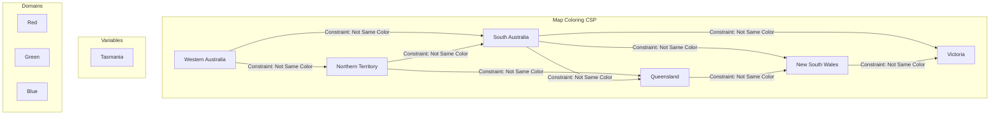

# Constraint Satisfaction Problems

> A Constraint Satisfaction Problem (CSP) is a problem of finding a state or a set of values that satisfies a number of constraints.

## Overview
Constraint Satisfaction Problems are a class of problems in which the goal is to find a configuration of a set of variables that satisfies a given set of constraints. CSPs are declarative: you define the variables, their possible values (domains), and the constraints, and the solver finds a solution. This is a powerful paradigm because it separates the problem statement from the solving algorithm.

CSPs are typically solved using a form of search, but the search is often augmented with powerful techniques for pruning the search space. The most common algorithm for solving CSPs is backtracking search, which is a form of depth-first search. This is often combined with heuristics for variable and value ordering, and with constraint propagation techniques like forward checking and arc consistency.

## 2. Visual Intuition
:::demo
<div style="background:#1e1e1e;padding:16px;border-radius:10px;color:#e5e7eb;font-family:system-ui,sans-serif">
  <h3 style="margin:0 0 8px 0;color:#7dd3fc">Constraint Satisfaction Problems - Concept Map</h3>
  <svg width="100%" height="280" viewBox="0 0 640 280" role="img" aria-label="Constraint Satisfaction Problems visual intuition" style="background:#111827;border-radius:8px">
    <rect x="24" y="28" width="180" height="64" rx="10" fill="#1d4ed8" />
    <text x="114" y="66" text-anchor="middle" fill="#e5e7eb" font-size="14">Problem</text>
    <rect x="230" y="28" width="180" height="64" rx="10" fill="#0f766e" />
    <text x="320" y="66" text-anchor="middle" fill="#e5e7eb" font-size="14">Process</text>
    <rect x="436" y="28" width="180" height="64" rx="10" fill="#7c3aed" />
    <text x="526" y="66" text-anchor="middle" fill="#e5e7eb" font-size="14">Outcome</text>

    <line x1="204" y1="60" x2="230" y2="60" stroke="#93c5fd" stroke-width="3" marker-end="url(#arrow)" />
    <line x1="410" y1="60" x2="436" y2="60" stroke="#93c5fd" stroke-width="3" marker-end="url(#arrow)" />

    <rect x="24" y="130" width="592" height="120" rx="10" fill="#0b1220" stroke="#334155" />
    <text x="320" y="156" text-anchor="middle" fill="#cbd5e1" font-size="14">Key intuition for Constraint Satisfaction Problems</text>
    <text x="320" y="182" text-anchor="middle" fill="#94a3b8" font-size="12">Track state changes, constraints, and final behavior.</text>
    <text x="320" y="206" text-anchor="middle" fill="#94a3b8" font-size="12">Use this as a mental model before formal proofs or code.</text>

    <defs>
      <marker id="arrow" markerWidth="10" markerHeight="10" refX="8" refY="3" orient="auto">
        <polygon points="0 0, 10 3, 0 6" fill="#93c5fd" />
      </marker>
    </defs>
  </svg>
  <p style="margin-top:10px;color:#cbd5e1">Interactive-ready visual scaffold for the topic.</p>
</div>
:::
*Caption: This visual shows how Constraint Satisfaction Problems works step by step.*

## Core Theory
A CSP is defined by three components:
-   **Variables:** A set of variables `X = {X1, ..., Xn}`.
-   **Domains:** A set of domains `D = {D1, ..., Dn}`, one for each variable.
-   **Constraints:** A set of constraints `C = {C1, ..., Ck}` that specify allowable combinations of values.

**Solving CSPs:**
-   **Backtracking Search:** A depth-first search that recursively assigns values to variables. If a partial assignment violates a constraint, the algorithm backtracks to the previous variable and tries a different value.
-   **Heuristics:**
    -   **Minimum Remaining Values (MRV):** Choose the variable with the fewest legal values.
    -   **Degree Heuristic:** Choose the variable that is involved in the largest number of constraints on other unassigned variables.
    -   **Least Constraining Value (LCV):** Prefer the value that rules out the fewest choices for the neighboring variables in the constraint graph.
-   **Constraint Propagation:**
    -   **Forward Checking:** When a variable is assigned a value, check the constraints on its unassigned neighbors and prune their domains if necessary.
    -   **Arc Consistency (AC-3):** A more powerful propagation technique that makes a constraint graph arc-consistent. An arc `(Xi, Xj)` is consistent if for every value `x` in `Di`, there is some value `y` in `Dj` that is consistent with `x`.

## Visual Diagram

*A constraint graph for the map coloring problem of Australia. Each state is a variable, and an edge exists between two states if they are adjacent.*

## Code Example
```python
# A simple backtracking solver for the map coloring problem
def is_safe(graph, node, color, colors):
    for neighbor in graph[node]:
        if neighbor in colors and colors[neighbor] == color:
            return False
    return True

def map_coloring(graph, num_colors, node, colors):
    if node is None:
        return True

    for i in range(1, num_colors + 1):
        if is_safe(graph, node, i, colors):
            colors[node] = i
            
            uncolored_nodes = [n for n in graph if n not in colors]
            next_node = uncolored_nodes[0] if uncolored_nodes else None

            if map_coloring(graph, num_colors, next_node, colors):
                return True
            
            del colors[node] # backtrack
            
    return False

# Example usage
australia = {
    'WA': ['NT', 'SA'],
    'NT': ['WA', 'SA', 'Q'],
    'SA': ['WA', 'NT', 'Q', 'NSW', 'V'],
    'Q': ['NT', 'SA', 'NSW'],
    'NSW': ['Q', 'SA', 'V'],
    'V': ['SA', 'NSW'],
    'T': []
}
colors = {}
if map_coloring(australia, 3, 'WA', colors):
    print("Solution exists:", colors)
else:
    print("No solution exists")
```

## Interactive Demo
:::demo
<!-- title: "N-Queens Problem Visualizer" -->
<!DOCTYPE html>
<html>
<head>
<meta charset="utf-8">
<style>
  body { margin:0; background:#0f1117; color:#e5e7eb; font-family: system-ui, sans-serif; display: flex; flex-direction: column; align-items: center; justify-content: center; }
  .board { display: grid; grid-template-columns: repeat(4, 50px); grid-template-rows: repeat(4, 50px); border: 2px solid #9ca3af; }
  .cell { width: 50px; height: 50px; }
  .cell.light { background: #f3f4f6; }
  .cell.dark { background: #9ca3af; }
  .queen { font-size: 36px; text-align: center; line-height: 50px; }
</style>
</head>
<body>
<h3>4-Queens Problem</h3>
<div id="board" class="board"></div>
<script>
    const N = 4;
    const board = document.getElementById('board');
    let solution = [];

    function solveNQueens() {
        // A full backtracking implementation is complex for a simple demo.
        // This just displays one of the two possible solutions for N=4
        solution = [1, 3, 0, 2]; 
        renderBoard();
    }

    function renderBoard() {
        board.innerHTML = '';
        for (let i = 0; i < N; i++) {
            for (let j = 0; j < N; j++) {
                const cell = document.createElement('div');
                cell.className = (i + j) % 2 === 0 ? 'cell light' : 'cell dark';
                if (solution[i] === j) {
                    const queen = document.createElement('div');
                    queen.className = 'queen';
                    queen.textContent = '♛';
                    cell.appendChild(queen);
                }
                board.appendChild(cell);
            }
        }
    }
    
    solveNQueens();
</script>
</body>
</html>
:::

## Worked Example
**Problem:** For the Australia map coloring problem with 3 colors (R, G, B), if WA='R' and NT='G', what are the remaining legal values for SA?

**Solution:**
1.  **Identify constraints on SA:** SA is adjacent to WA and NT.
2.  **Apply constraints:**
    -   SA cannot be the same color as WA. Since WA='R', SA cannot be 'R'.
    -   SA cannot be the same color as NT. Since NT='G', SA cannot be 'G'.
3.  **Determine remaining domain:** The original domain for SA was {R, G, B}. After applying the constraints, the only remaining legal value is 'B'.

## Industry Applications
- **Scheduling:** University course timetabling, employee shift scheduling, and flight gate assignment.
- **Resource Allocation:** Assigning tasks to processors in a distributed system, or allocating bandwidth in a network.
- **Logistics:** Vehicle routing and delivery planning.
- **Bioinformatics:** Protein design and structure prediction.

## Practice Problems

### Easy
1. Define the variables, domains, and constraints for a Sudoku puzzle.

### Medium
2. Explain the Minimum Remaining Values (MRV) heuristic. Why is it effective?

### Hard
3. What is the difference between forward checking and arc consistency? Which is more powerful?

## Interactive Quiz
:::quiz
**Q1:** Which of the following is NOT a component of a CSP?
- A) Variables
- B) Domains
- C) Constraints
- D) Heuristic function
> D — A heuristic function is used to solve a CSP, but it is not part of the problem definition itself.

**Q2:** The Minimum Remaining Values (MRV) heuristic suggests choosing the variable with...
- A) The fewest legal values.
- B) The most legal values.
- C) The most constraints on other variables.
- D) The fewest constraints on other variables.
> A — By choosing the variable with the fewest remaining values, you are likely to prune the search tree more quickly.

**Q3:** The N-Queens problem is an example of a...
- A) Search problem
- B) Adversarial search problem
- C) Constraint satisfaction problem
- D) Reinforcement learning problem
> C — The goal is to find a configuration of queens on a board that satisfies a set of constraints.
:::

## Interview Questions

**Q: What is a Constraint Satisfaction Problem?**
*A: A CSP is a problem where you need to find a set of values for a set of variables that satisfy a set of constraints. It's a powerful way to model problems like scheduling, planning, and puzzles.*

**Q: How does backtracking search work?**
*A: Backtracking is a depth-first search algorithm that assigns values to variables one at a time. If an assignment violates a constraint, the algorithm backtracks to the previous variable and tries a different value. This process continues until a solution is found or the entire search space has been explored.*

**Q: What is constraint propagation?**
*A: Constraint propagation is the process of using the constraints to reduce the number of legal values for a variable, which in turn can reduce the legal values for other variables. This helps to prune the search space and make the search more efficient. Forward checking and arc consistency are two examples.*

**Q: Can you give a real-world example of a CSP?**
*A: A university course timetabling problem is a classic example. The variables are the courses, the domains are the possible time slots and classrooms, and the constraints are things like "no two courses can be in the same room at the same time" and "a professor cannot teach two courses at the same time".*

## Key Takeaways
- CSPs are a special type of search problem where the state is defined by variables, domains, and constraints.
- Backtracking search is the primary algorithm for solving CSPs.
- Heuristics like MRV and LCV can significantly improve the performance of backtracking search.
- Constraint propagation techniques like forward checking and arc consistency prune the search space.
- CSPs have many real-world applications in scheduling, planning, and resource allocation.

## Common Misconceptions
- ❌ CSP solvers always find the optimal solution. → ✅ Standard CSP solvers find *a* solution, not necessarily the optimal one. For optimization, you need to use techniques like branch and bound.
- ❌ Any search problem can be formulated as a CSP. → ✅ While many problems can be modeled as CSPs, it's not always the most efficient or natural way to represent them.

## Related Topics
- [[search-algorithms]] — CSPs are a specific type of search problem.
- [[propositional-logic]] — Constraints in CSPs can often be expressed using logical formulas.
- [[planning]] — Planning problems can sometimes be formulated as CSPs.
