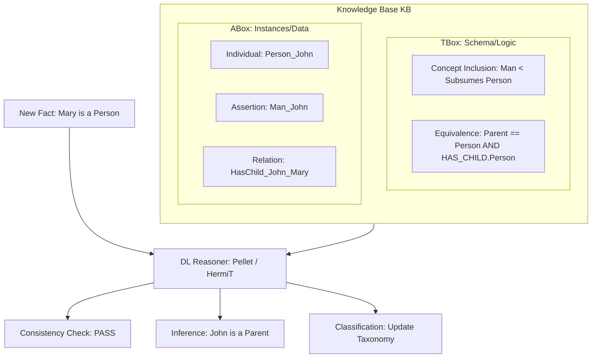

# Description Logics and OWL Ontologies

> Description Logics (DLs) are a family of formal knowledge representation languages that provide a decidable fragment of First-Order Logic, specifically designed to represent the terminological knowledge of an application domain in a structured and mathematically well-defined manner.

## 1. Historical Background & Motivation

The genesis of Description Logics (DLs) lies in the limitations and ambiguities of early Knowledge Representation (KR) systems, specifically **Semantic Networks** and **Frame Systems** of the 1970s. While these systems were intuitive for humans, they lacked a formal semantics—the meaning of an "is-a" link could vary wildly between implementations, leading to inconsistent reasoning. In 1985, Ronald Brachman and Hector Levesque pioneered the transition toward logic-based systems with **KL-ONE**, which separated knowledge into a "TBox" (Terminological component) and an "ABox" (Assertional component). This distinction allowed for automated reasoning, where a computer could verify the consistency of definitions and infer hidden relationships.

As the internet evolved, the need for a standardized "Semantic Web" became apparent. Tim Berners-Lee envisioned a web where machines could process the meaning of data, not just display it. This led to the development of the **Web Ontology Language (OWL)**, which is essentially a syntax for specific, highly expressive Description Logics. Today, DLs are the backbone of massive knowledge graphs at companies like Amazon and Google, and they power complex medical terminologies like SNOMED CT. They solve the fundamental engineering trade-off: providing enough expressive power to model the world while remaining **decidable**, ensuring that reasoning algorithms will always terminate with a correct answer.

## 2. Visual Intuition
:::demo
<div style="background:#1e1e1e;padding:16px;border-radius:10px;color:#e5e7eb;font-family:system-ui,sans-serif">
  <h3 style="margin:0 0 8px 0;color:#7dd3fc">Concept Subsumption in Description Logics</h3>
  <svg width="600" height="350" viewBox="0 0 600 350">
    <defs>
      <style type="text/css">
        /* Base styles for existing concepts */
        .concept { fill: #2c3e50; stroke: #3498db; stroke-width: 2; }
        .text { fill: #ecf0f1; font-family: system-ui,sans-serif; font-size: 14px; text-anchor: middle; dominant-baseline: central; }
        /* Style for subsumption arrows (general to specific) */
        .arrow { stroke: #9b59b6; stroke-width: 1.5; marker-end: url(#arrowhead); fill: none; }
        /* Style for the newly inferred concept */
        .new-concept { fill: #3f0f10; stroke: #f39c12; stroke-width: 2; } /* Darker fill, distinct border */
        .new-concept-text { fill: #f1c40f; font-family: system-ui,sans-serif; font-size: 14px; text-anchor: middle; dominant-baseline: central; font-weight: bold; }
      </style>
      <!-- Arrowhead marker definition -->
      <marker id="arrowhead" markerWidth="10" markerHeight="7" refX="8" refY="3.5" orient="auto">
        <polygon points="0 0, 10 3.5, 0 7" fill="#9b59b6" />
      </marker>
      <!-- Define a different arrowhead for inferred links to distinguish them slightly -->
      <marker id="arrowhead-inferred" markerWidth="10" markerHeight="7" refX="8" refY="3.5" orient="auto">
        <polygon points="0 0, 10 3.5, 0 7" fill="#2ecc71" />
      </marker>
    </defs>

    <!-- Existing Concept: Vehicle -->
    <rect x="250" y="20" width="100" height="40" rx="5" ry="5" class="concept"/>
    <text x="300" y="40" class="text">Vehicle</text>

    <!-- Existing Concept: Car -->
    <rect x="150" y="100" width="100" height="40" rx="5" ry="5" class="concept"/>
    <text x="200" y="120" class="text">Car</text>

    <!-- Existing Concept: SUV -->
    <rect x="150" y="180" width="100" height="40" rx="5" ry="5" class="concept"/>
    <text x="200" y="200" class="text">SUV</text>

    <!-- Existing Concept: Electric (separate branch for now) -->
    <rect x="350" y="180" width="100" height="40" rx="5" ry="5" class="concept"/>
    <text x="400" y="200" class="text">Electric</text>

    <!-- Subsumption Arrows for Vehicle Hierarchy -->
    <path d="M300,60 L200,100" class="arrow" /> <!-- Vehicle -> Car -->
    <path d="M200,140 L200,180" class="arrow" /> <!-- Car -> SUV -->

    <!-- New Concept: Electric SUV -->
    <rect x="250" y="280" width="150" height="40" rx="5" ry="5" class="new-concept"/>
    <text x="325" y="300" class="new-concept-text">Electric SUV</text>
    
    <!-- Text indicating the definition -->
    <text x="325" y="260" class="text" style="font-size:12px; fill:#a0a7af;">Defined as: Vehicle $\sqcap$ Electric $\sqcap$ SUV</text>

    <!-- Inference Arrows: SUV -> Electric SUV, Electric -> Electric SUV -->
    <!-- These arrows point from the more general concepts to the inferred specific concept. -->
    <path d="M200,220 L290,280" class="arrow" style="stroke:#2ecc71; marker-end: url(#arrowhead-inferred);"/> <!-- SUV -> Electric SUV -->
    <path d="M400,220 L360,280" class="arrow" style="stroke:#2ecc71; marker-end: url(#arrowhead-inferred);"/> <!-- Electric -> Electric SUV -->

  </svg>
  <p style="margin-top:10px;color:#cbd5e1">A visual representation of a concept hierarchy. In Description Logics, the primary task is "Subsumption Reasoning," which automatically places a new concept (e.g., "Electric SUV") into its correct place in the taxonomy based on its logical definitions (e.g., "Vehicle" $\sqcap$ "Electric" $\sqcap$ "SUV").</p>
</div>
:::
*Caption: A visual representation of a concept hierarchy. In Description Logics, the primary task is "Subsumption Reasoning," which automatically places a new concept (e.g., "Electric SUV") into its correct place in the taxonomy based on its logical definitions (e.g., "Vehicle" $\sqcap$ "Electric" $\sqcap$ "SUV").*

## 3. Core Theory & Mathematical Foundations

Description Logics represent knowledge using three fundamental building blocks: **Concepts** (unary predicates/classes), **Roles** (binary predicates/properties), and **Individuals** (constants).

### 3.1 Formal Syntax and Semantics
The basic DL is $\mathcal{ALC}$ (Attribute Language with Complement). The semantics of $\mathcal{ALC}$ are defined via an **Interpretation** $\mathcal{I} = (\Delta^\mathcal{I}, \cdot^\mathcal{I})$, where:
1. $\Delta^\mathcal{I}$ is a non-empty set called the **Domain**.
2. $\cdot^\mathcal{I}$ is an **Interpretation Function** that maps:
   - Every atomic concept $A$ to a subset $A^\mathcal{I} \subseteq \Delta^\mathcal{I}$.
   - Every atomic role $R$ to a binary relation $R^\mathcal{I} \subseteq \Delta^\mathcal{I} \times \Delta^\mathcal{I}$.
   - Every individual $a$ to an element $a^\mathcal{I} \in \Delta^\mathcal{I}$.

The interpretation of complex concepts is defined recursively:
- **Top ($\top$):** $\top^\mathcal{I} = \Delta^\mathcal{I}$
- **Bottom ($\bot$):** $\bot^\mathcal{I} = \emptyset$
- **Intersection ($C \sqcap D$):** $(C \sqcap D)^\mathcal{I} = C^\mathcal{I} \cap D^\mathcal{I}$
- **Union ($C \sqcup D$):** $(C \sqcup D)^\mathcal{I} = C^\mathcal{I} \cup D^\mathcal{I}$
- **Negation ($\neg C$):** $(\neg C)^\mathcal{I} = \Delta^\mathcal{I} \setminus C^\mathcal{I}$
- **Existential Restriction ($\exists R.C$):** $\{x \in \Delta^\mathcal{I} \mid \exists y . (x, y) \in R^\mathcal{I} \land y \in C^\mathcal{I}\}$
- **Value Restriction ($\forall R.C$):** $\{x \in \Delta^\mathcal{I} \mid \forall y . (x, y) \in R^\mathcal{I} \implies y \in C^\mathcal{I}\}$

### 3.2 The TBox and ABox
A DL knowledge base $\mathcal{K} = \langle \mathcal{T}, \mathcal{A} \rangle$ consists of:
- **TBox ($\mathcal{T}$):** Terminological axioms. Usually takes the form of **Inclusion** $C \sqsubseteq D$ (stating $C^\mathcal{I} \subseteq D^\mathcal{I}$) or **Equality** $C \equiv D$.
- **ABox ($\mathcal{A}$):** Assertional axioms. Takes the form of **Concept Assertions** $C(a)$ (stating $a^\mathcal{I} \in C^\mathcal{I}$) or **Role Assertions** $R(a, b)$ (stating $(a^\mathcal{I}, b^\mathcal{I}) \in R^\mathcal{I}$).

### 3.3 Reasoning Tasks
The power of DLs lies in automated reasoning:
1. **Satisfiability:** Is there an interpretation $\mathcal{I}$ that satisfies the TBox?
2. **Subsumption ($C \sqsubseteq D$):** Does $C^\mathcal{I} \subseteq D^\mathcal{I}$ hold for every model of $\mathcal{T}$?
3. **Consistency:** Is the ABox $\mathcal{A}$ consistent with the TBox $\mathcal{T}$?
4. **Instance Checking:** Given $\mathcal{K}$, does $C(a)$ necessarily hold?

### 3.4 Formal Analysis: Complexity and Decidability
The complexity of DLs is a function of the constructors used. For the base logic $\mathcal{ALC}$:
- **Satisfiability** is **PSPACE-complete**.
- For more expressive logics like $\mathcal{SHIQ}$ (used in OWL), complexity can jump to **EXPTIME** or **N2EXPTIME**.

**Theorem (Decidability of $\mathcal{ALC}$):** The satisfiability of an $\mathcal{ALC}$ concept with respect to an empty TBox is decidable in PSPACE.
*Proof Sketch:* We use the **Tableau Algorithm**. Since the algorithm generates a tree-like model and the depth of the tree is bounded by the length of the concept expression, we can explore paths using a depth-first search, requiring only polynomial space.

## 4. Algorithm / Process: The Tableau Algorithm

The standard method for DL reasoning is the **Tableau Algorithm**. To check if a concept $C$ is satisfiable, we attempt to construct a model (a graph) that satisfies it. If we find a contradiction ("clash"), the concept is unsatisfiable.

1. **Preprocessing:** Convert the concept into Negation Normal Form (NNF), where negations only appear in front of atomic concepts.
2. **Initialization:** Start with a root node $x$ and the constraint $x:C$.
3. **Expansion Rules:**
    - **$\sqcap$-rule:** If $x : C \sqcap D$ is in the node, add $x : C$ and $x : D$.
    - **$\sqcup$-rule:** If $x : C \sqcup D$ is in the node, create two branches (non-deterministic): one with $x : C$ and one with $x : D$.
    - **$\exists$-rule:** If $x : \exists R.C$ is in the node, create a new successor node $y$ with the edge $R(x, y)$ and the constraint $y : C$.
    - **$\forall$-rule:** If $x : \forall R.C$ and an edge $R(x, y)$ exist, add $y : C$ to node $y$.
4. **Termination:**
    - **Clash:** If a node contains $x : A$ and $x : \neg A$, or $x : \bot$, that branch is closed.
    - **Complete:** If no more rules can be applied and no clash is found, the concept is satisfiable.

## 5. Visual Diagram


*Caption: The interaction between the TBox (definitions), ABox (data), and the Reasoner. The reasoner uses the TBox's logical rules to infer new facts in the ABox or identify contradictions.*

## 6. Implementation

### 6.1 Core Implementation: A Mini-DL Lexer and Parser
In modern AI engineering, we often use `Owlready2` to handle OWL ontologies. Below is a demonstration of creating an ontology and performing reasoning.

```python
from owlready2 import *

# 1. Setup a Local Ontology
onto = get_ontology("http://test.org/demo.owl")

with onto:
    # 2. Define Classes (Concepts)
    class Device(Thing):
        pass

    class Sensor(Device):
        pass

    class SmartDevice(Device):
        # EquivalentTo defines a complex concept: 
        # SmartDevice is a Device that has at least one Sensor
        equivalent_to = [Device & onto.has_sensor.some(Sensor)]

    # 3. Define Object Properties (Roles)
    class has_sensor(ObjectProperty):
        domain = [Device]
        range = [Sensor]

# 4. Instantiate (ABox)
d1 = onto.Device("thermostat_001")
s1 = onto.Sensor("temp_sensor_001")
d1.has_sensor.append(s1)

# 5. Reasoning (Inference)
def run_inference():
    """
    Runs the HermiT reasoner to infer that d1 is a SmartDevice.
    Complexity: Depends on the DL expressivity (OWL 2 DL is N2EXPTIME).
    """
    print(f"Before Reasoning: Is d1 a SmartDevice? {isinstance(d1, onto.SmartDevice)}")
    
    # Sync with HermiT reasoner (Java-based, called via bridge)
    sync_reasoner_hermit()
    
    print(f"After Reasoning: Is d1 a SmartDevice? {isinstance(d1, onto.SmartDevice)}")

if __name__ == "__main__":
    run_inference()

# Expected Output:
# Before Reasoning: Is d1 a SmartDevice? False
# After Reasoning: Is d1 a SmartDevice? True
```

### 6.2 Optimized Production Variant: Using RDFLib for Scale
For massive Knowledge Graphs (billions of triples), standard DL reasoners might be too slow. We use RDFLib for graph-based traversal.

```python
import rdflib
from rdflib import Graph, URIRef, RDF, RDFS

def build_knowledge_graph():
    """
    Constructs a lightweight KG using RDFS (a subset of DL).
    RDFS is O(N) for entailment but less expressive than OWL.
    """
    g = Graph()
    EX = rdflib.Namespace("http://example.org/")
    
    # Schema
    g.add((EX.Engineer, RDFS.subClassOf, EX.Person))
    
    # Data
    g.add((EX.Alice, RDF.type, EX.Engineer))
    
    # Query for Subsumption
    query = """
    SELECT ?person WHERE {
        ?person rdf:type/rdfs:subClassOf* ex:Person .
    }
    """
    # Note: Logic is applied during query time (Property Paths)
    # or pre-computed via materialization.
    return g
```

### 6.3 Common Pitfalls in Code
1. **Open World Assumption (OWA):** In DLs/OWL, "not knowing $X$ is true" does **not** mean "$X$ is false." This is the opposite of SQL/Prolog's Closed World Assumption. Forgetting this leads to failed existential checks.
2. **Missing Domain/Range:** If you define `has_part` with range `Engine`, and you assert `car1 has_part tire1`, the reasoner will infer `tire1` is an `Engine` rather than throwing an error.
3. **Reasoner Performance:** Applying reasoning to an entire graph of 10M triples is usually a recipe for a timeout. Use **incremental reasoning** or **modularization**.

## 7. Interactive Demo

:::demo
<!-- title: Tableau Algorithm Visualizer -->
<!DOCTYPE html>
<html>
<head>
<style>
  body { background:#111827; color:#f3f4f6; font-family: monospace; padding: 20px; }
  .node { border: 2px solid #3b82f6; padding: 10px; margin: 10px; border-radius: 8px; background: #1f2937; display: inline-block; min-width: 150px; vertical-align: top; }
  .arrow { color: #10b981; font-weight: bold; }
  .clash { border-color: #ef4444 !important; background: #450a0a !important; }
  .controls { margin-bottom: 20px; border-bottom: 1px solid #374151; padding-bottom: 10px; }
  button { background: #3b82f6; color: white; border: none; padding: 8px 16px; border-radius: 4px; cursor: pointer; margin-right: 10px; }
  button:hover { background: #2563eb; }
  .formula { color: #facc15; font-weight: bold; }
</style>
</head>
<body>
  <div class="controls">
    <strong>Concept: (Person ⊓ ∃hasChild.Doctor)</strong><br><br>
    <button onclick="step()">Next Step</button>
    <button onclick="reset()">Reset</button>
  </div>
  <div id="canvas"></div>

<script>
  let state = 0;
  const canvas = document.getElementById('canvas');

  function reset() {
    state = 0;
    canvas.innerHTML = '';
  }

  function addNode(id, content, isClash = false) {
    const div = document.createElement('div');
    div.className = 'node' + (isClash ? ' clash' : '');
    div.innerHTML = `<strong>Node ${id}</strong><br>${content}`;
    canvas.appendChild(div);
  }

  function addArrow(label) {
    const span = document.createElement('span');
    span.className = 'arrow';
    span.innerHTML = ` &nbsp; —(${label})—> &nbsp; `;
    canvas.appendChild(span);
  }

  function step() {
    if (state === 0) {
      addNode('x', 'Initial:<br><span class="formula">Person ⊓ ∃hasChild.Doctor</span>');
      state++;
    } else if (state === 1) {
      canvas.lastChild.innerHTML += '<br>Applied ⊓-rule:<br>+ Person<br>+ ∃hasChild.Doctor';
      state++;
    } else if (state === 2) {
      addArrow('hasChild');
      addNode('y', '∃-rule applied:<br><span class="formula">Doctor</span>');
      state++;
    } else if (state === 3) {
      canvas.lastChild.innerHTML += '<br><br><em>Status: Satisfiable</em>';
      state++;
    }
  }
</script>
</body>
</html>
:::

## 8. Worked Examples

### Example 1: Concept Subsumption
Suppose we have the following TBox:
1. $Mother \equiv Woman \sqcap \exists hasChild.Person$
2. $Grandmother \equiv Mother \sqcap \exists hasChild.Parent$
3. $Parent \equiv Person \sqcap \exists hasChild.Person$

**Problem:** Prove $Grandmother \sqsubseteq Mother$.
**Step-by-step:**
1. The definition of $Grandmother$ is $Mother \sqcap \dots$
2. By the property of Intersection ($\sqcap$), $A \sqcap B \sqsubseteq A$ always holds.
3. Therefore, $Mother \sqcap \exists hasChild.Parent \sqsubseteq Mother$ holds trivially via structural subsumption.

### Example 2: Detecting Unsatisfiability
**Concept:** $Pet \sqcap \forall hasOwner.Human \sqcap \exists hasOwner.Robot \sqcap \text{Disjoint}(Human, Robot)$

**Trace:**
1. Let node $x$ contain the concept.
2. From $\exists hasOwner.Robot$, create node $y$ with $Robot$ and edge $hasOwner(x, y)$.
3. From $\forall hasOwner.Human$ and edge $hasOwner(x, y)$, propagate $Human$ to node $y$.
4. Node $y$ now contains $\{Robot, Human\}$.
5. Since $Human$ and $Robot$ are **disjoint**, we have a **Clash**.
6. **Result:** The concept is unsatisfiable.

## 9. Comparison with Alternatives

| Approach | Logic | Decidability | Use Case | Pros | Cons |
|---|---|---|---|---|---|
| **SQL / RDBMS** | Relational Algebra | Yes | Structured Data | Fast, ACID | Weak semantics, no inference |
| **Description Logics (OWL)** | Decidable FOL Fragment | **Yes** | Knowledge Graphs | Strong formal reasoning | High computational complexity |
| **First-Order Logic (FOL)** | Full FOL | **No** | General Math | Maximum expressivity | Can loop forever (Undecidable) |
| **Prolog (LP)** | Horn Clauses | No (with recursion) | Rule-based AI | Efficient execution | No negation/disjunction support |

## 10. Industry Applications & Real Systems

- **Amazon (Product Graph)**: Amazon uses OWL-based ontologies to categorize billions of products. If a product is tagged with "Lithium Battery," the reasoner can automatically infer it requires "Hazardous Material Shipping" rules based on the ontology.
- **SNOMED CT**: The world's most comprehensive clinical healthcare terminology. It uses a specific DL ($\mathcal{EL}++$) to define over 300,000 medical concepts, ensuring that "Diabetes Mellitus" is correctly categorized under "Endocrine System Disease."
- **Google Knowledge Graph**: While Google uses a mix of technologies, the underlying schema (Schema.org) and the relationships between entities are heavily influenced by DL concepts like domain/range restrictions and type hierarchies.
- **NASA (SWEET Ontology)**: The Semantic Web for Earth and Environmental Terminology uses OWL to integrate data from disparate satellite sensors, allowing researchers to query across "Temperature" and "Thermal Intensity" as related concepts.

## 11. Practice Problems

### 🟢 Easy
1. **Logical Translation**: Translate the sentence "A Vegetarian is a Person who does not eat Meat" into Description Logic syntax.
   *Hint: Use $\sqcap$, $\neg$, and the role `eats`.*
   *Expected: $Vegetarian \equiv Person \sqcap \forall eats.\neg Meat$*

### 🟡 Medium
2. **Subsumption Reasoning**: Given $C \sqsubseteq D$ and $D \sqsubseteq E$, prove using the interpretation definition that $C \sqsubseteq E$.
   *Expected complexity: O(1) proof.*

3. **Tableau Trace**: Perform a manual tableau expansion for $(A \sqcup B) \sqcap \neg A \sqcap \neg B$. Does it result in a clash?
   *Hint: The $\sqcup$-rule creates two branches. Check both for clashes.*

### 🔴 Hard
4. **Complexity Analysis**: Explain why adding **Role Hierarchies** ($R \sqsubseteq S$) and **Transitive Roles** ($Trans(R)$) increases the reasoning complexity of $\mathcal{ALC}$.
   *Hint: Transitivity can lead to infinite chains if not handled by 'blocking' in the tableau.*

5. **N-ary Relations**: DLs only support unary (concepts) and binary (roles) predicates. How can you represent a ternary relation like `Sold(Seller, Buyer, Object)` in a DL?
   *Hint: Look up 'Reification'.*

## 12. Interactive Quiz

:::quiz
**Q1: What is the primary difference between the ABox and the TBox?**
- A) ABox is for logic, TBox is for data.
- B) TBox defines the schema (concepts/roles), ABox contains assertions about individuals.
- C) There is no difference; they are interchangeable.
- D) ABox is only used in First-Order Logic, not DL.
> B — TBox (Terminological) stores the "definitions" while ABox (Assertional) stores the "facts."

**Q2: Description Logics are designed to be a fragment of First-Order Logic that is specifically:**
- A) Turing Complete
- B) Non-monotonic
- C) Decidable
- D) Only Propositional
> C — The core goal of DL is to ensure that reasoning tasks (like subsumption) always terminate.

**Q3: In the logic $\mathcal{ALC}$, what is the complexity of concept satisfiability?**
- A) P
- B) NP
- C) PSPACE-complete
- D) Undecidable
> C — $\mathcal{ALC}$ satisfiability is PSPACE-complete.

**Q4: Under the Open World Assumption (OWA), if a Knowledge Base does not contain the fact "John is a Doctor", what does the reasoner conclude?**
- A) John is definitely not a doctor.
- B) John is a doctor.
- C) It is unknown whether John is a doctor.
- D) The KB is inconsistent.
> C — OWA means "absence of information is not information of absence."

**Q5: Which rule in the Tableau Algorithm is non-deterministic (requires branching)?**
- A) The $\sqcap$-rule
- B) The $\exists$-rule
- C) The $\sqcup$-rule
- D) The $\forall$-rule
> C — The union rule ($\sqcup$) requires checking multiple possible worlds, leading to exponential search space in the worst case.
:::

## 13. Interview Preparation

### Conceptual Questions
**Q: What is the "Open World Assumption" (OWA) and how does it contrast with the "Closed World Assumption" (CWA)?**
*A: OWA assumes that a statement cannot be assumed false simply because it is not known to be true. In a CWA system (like a relational database), if a record doesn't exist, it's false. In OWA (DL/OWL), it's just "unknown." This is crucial for web-scale knowledge where we can never have all the data.*

**Q: Why use DL instead of full First-Order Logic?**
*A: Full FOL is semi-decidable; a prover might run forever if a statement is not a tautology. DLs identify the specific constructors (like restricted quantification) that allow for powerful modeling while guaranteeing that the reasoner will always return an answer in a finite (though sometimes long) time.*

**Q: Explain 'Classification' in the context of an OWL Ontology.**
*A: Classification is the process where a reasoner computes the entire subclass hierarchy of an ontology. It uses the logical definitions to move concepts from a flat list into a deep tree (or DAG), identifying where one concept logically subsumes another.*

### Quick Reference (Cheat Sheet)
| Property | Value |
|---|---|
| Base Logic | $\mathcal{ALC}$ |
| Reasoning Complexity | PSPACE to N2EXPTIME |
| Decidable? | Yes |
| Main Algorithm | Tableau Expansion |
| Industry Standard | OWL 2 DL |

## 14. Key Takeaways
1. **Decidability is Key**: DLs trade off expressivity for the guarantee that reasoning will terminate.
2. **TBox vs ABox**: Distinguish between your schema (TBox) and your data (ABox).
3. **Tableau Algorithm**: The engine of DL; it works by trying to build a model and looking for contradictions.
4. **Open World Assumption**: Always remember that "not found" does not mean "false" in OWL.
5. **OWL 2**: The modern implementation of DL for the web, categorized into profiles (EL, QL, RL) for different performance needs.

## 15. Common Misconceptions
- ❌ **"OWL is just a different way to write XML/JSON."** → ✅ OWL is a logical language with formal semantics; XML is just one way to serialize it.
- ❌ **"If my reasoner is slow, I need a faster CPU."** → ✅ Reasoning is often high-complexity (EXPTIME). You likely need to simplify your TBox axioms or use a less expressive DL profile like OWL 2 EL.
- ❌ **"Classes are the same as Object-Oriented classes."** → ✅ OO classes are templates for creation; DL classes (concepts) are sets used for classification and inference.

## 16. Further Reading
- *The Description Logic Handbook* (Baader et al.) — The "Bible" of DL.
- *Foundations of Semantic Web Technologies* (Hitzler, Krötzsch, Rudolph) — Excellent for OWL 2 specifics.
- *Structure and Interpretation of Computer Programs (SICP)*, Chapter 4 — For a deeper look at logic programming.
- *Description Logic Complexity Map* (Zolin) — A vital online resource for checking complexity.

## 17. Related Topics
- [[heuristic-design]] — Used to speed up the non-deterministic branches in Tableau.
- [[arc-consistency]] — Similar constraint satisfaction principles used in reasoning.
- [[temporal-logic]] — Extending DLs to handle time-varying knowledge.