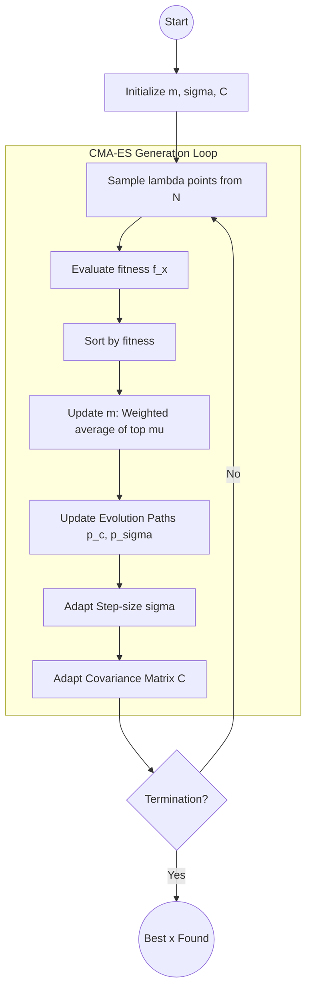

# Evolutionary Strategies and CMA-ES for Black-Box Optimization

> Evolutionary Strategies (ES) are a class of black-box optimization algorithms inspired by natural selection that iteratively evolve a population of candidate solutions by sampling from a parameterized probability distribution and updating those parameters based on the fitness of the samples.

## 1. Historical Background & Motivation

The genesis of Evolutionary Strategies (ES) traces back to the early 1960s at the Technical University of Berlin. Ingo Rechenberg and Hans-Paul Schwefel, facing the challenge of optimizing the aerodynamic shapes of physical objects (like pipes and wings) where no analytical gradient existed, devised a method of stochastic trial-and-error. Unlike the concurrently developing Genetic Algorithms (GA) by John Holland, which focused on discrete bit-string representations and crossover operators, ES was built from the ground up for continuous parameter spaces using Gaussian mutations.

For decades, ES remained a niche topic in numerical optimization. However, it underwent a renaissance with the introduction of the **Covariance Matrix Adaptation Evolution Strategy (CMA-ES)** by Nikolaus Hansen in 1996. CMA-ES introduced a sophisticated way to adapt the search distribution's shape (the covariance matrix), effectively learning the "inverse Hessian" of the objective function without ever calculating a derivative. In the modern era, ES has become a cornerstone of Reinforcement Learning (RL) and Neural Architecture Search (NAS). In 2017, OpenAI demonstrated that a simplified ES could compete with state-of-the-art policy gradient methods on Atari and MuJoCo benchmarks, highlighting its massive scalability in distributed computing environments.

## 2. Visual Intuition
:::demo
<div style="background:#1e1e1e;padding:16px;border-radius:10px;color:#e5e7eb;font-family:system-ui,sans-serif">
  <h3 style="margin:0 0 8px 0;color:#7dd3fc">Evolutionary Strategies and CMA-ES for Black-Box Optimization - Concept Map</h3>
  <svg width="100%" height="280" viewBox="0 0 640 280" role="img" aria-label="Evolutionary Strategies and CMA-ES for Black-Box Optimization visual intuition" style="background:#111827;border-radius:8px">
    <rect x="24" y="28" width="180" height="64" rx="10" fill="#1d4ed8" />
    <text x="114" y="66" text-anchor="middle" fill="#e5e7eb" font-size="14">Problem</text>
    <rect x="230" y="28" width="180" height="64" rx="10" fill="#0f766e" />
    <text x="320" y="66" text-anchor="middle" fill="#e5e7eb" font-size="14">Process</text>
    <rect x="436" y="28" width="180" height="64" rx="10" fill="#7c3aed" />
    <text x="526" y="66" text-anchor="middle" fill="#e5e7eb" font-size="14">Outcome</text>

    <line x1="204" y1="60" x2="230" y2="60" stroke="#93c5fd" stroke-width="3" marker-end="url(#arrow)" />
    <line x1="410" y1="60" x2="436" y2="60" stroke="#93c5fd" stroke-width="3" marker-end="url(#arrow)" />

    <rect x="24" y="130" width="592" height="120" rx="10" fill="#0b1220" stroke="#334155" />
    <text x="320" y="156" text-anchor="middle" fill="#cbd5e1" font-size="14">Key intuition for Evolutionary Strategies and CMA-ES for Black-Box Optimization</text>
    <text x="320" y="182" text-anchor="middle" fill="#94a3b8" font-size="12">Track state changes, constraints, and final behavior.</text>
    <text x="320" y="206" text-anchor="middle" fill="#94a3b8" font-size="12">Use this as a mental model before formal proofs or code.</text>

    <defs>
      <marker id="arrow" markerWidth="10" markerHeight="10" refX="8" refY="3" orient="auto">
        <polygon points="0 0, 10 3, 0 6" fill="#93c5fd" />
      </marker>
    </defs>
  </svg>
  <p style="margin-top:10px;color:#cbd5e1">Interactive-ready visual scaffold for the topic.</p>
</div>
:::
*Caption: CMA-ES optimizing the Rosenbrock "banana" function. Notice how the distribution (represented by the ellipse) elongates and rotates to follow the narrow valley, effectively learning the local geometry of the objective function.*

## 3. Core Theory & Mathematical Foundations

At its heart, Evolutionary Strategies seek to solve the problem:
$$\min_{x \in \mathbb{R}^n} f(x)$$
where $f$ is a "black-box" function—we can evaluate it, but we have no access to its gradient $\nabla f$ or its Hessian $\mathbf{H}$.

### 3.1 The Gaussian Sampling Paradigm
Most ES variants represent the population as a multivariate normal distribution:
$$x \sim \mathcal{N}(m, \sigma^2 \mathbf{C})$$
Where:
- $m \in \mathbb{R}^n$ is the mean of the distribution (the current "best guess").
- $\sigma \in \mathbb{R}_+$ is the step-size (the global scale of exploration).
- $\mathbf{C} \in \mathbb{R}^{n \times n}$ is the covariance matrix (the shape and orientation of the search).

The optimization process is an iterative loop:
1. **Sample** $\lambda$ individuals from the distribution.
2. **Evaluate** their fitness using $f(x)$.
3. **Update** $m, \sigma, \mathbf{C}$ to increase the likelihood of sampling better-performing points.

### 3.2 The $(\mu, \lambda)$-ES vs. $(\mu + \lambda)$-ES
These notations define the selection strategy:
- **$(\mu, \lambda)$-ES**: From $\lambda$ offspring, the best $\mu$ are chosen to form the next generation. The parents are discarded. This encourages exploration and allows the algorithm to escape local optima by "forgetting" old points.
- **$(\mu + \lambda)$-ES**: The best $\mu$ are chosen from the union of parents and offspring. This is "elitist" and guarantees that the best-found solution is never lost (monotonic improvement).

### 3.3 CMA-ES: Learning the Second Order Structure
The brilliance of CMA-ES lies in how it updates the covariance matrix $\mathbf{C}$. It mimics a second-order optimization method (like Newton's method). In Newton's method, we use the inverse Hessian $\mathbf{H}^{-1}$ to scale the gradient. In CMA-ES, $\mathbf{C}$ converges to a result proportional to $\mathbf{H}^{-1}$.

#### The Rank-$\mu$ Update
The distribution is shifted toward the weighted mean of the successful candidates:
$$m_{t+1} = \sum_{i=1}^{\mu} w_i x_{i:\lambda}$$
where $x_{i:\lambda}$ denotes the $i$-th best individual in the current generation, and $w_i$ are weights such that $\sum w_i = 1$.

#### The Cumulation Path
CMA-ES does not just look at the current generation. It maintains an "evolution path" $p_c$, which is an exponential moving average of the steps taken by the mean:
$$p_{c}^{(t+1)} = (1 - c_c) p_c^{(t)} + \sqrt{c_c(2-c_c)\mu_{eff}} \frac{m_{t+1} - m_t}{\sigma_t}$$
This path captures the correlation between consecutive steps. If the algorithm moves in the same direction over several generations, the path grows long, and $\mathbf{C}$ is expanded in that direction.

### 3.4 Formal Analysis: Why it works
The update rule for the mean $m$ can be viewed as an approximation of the **Natural Gradient Descent** on the manifold of probability distributions.
By maximizing the log-likelihood of successful samples:
$$\mathcal{J}(\theta) = \mathbb{E}_{x \sim p_\theta} [f(x)]$$
The gradient is $\nabla_\theta \mathcal{J}(\theta) = \mathbb{E}_{x \sim p_\theta} [f(x) \nabla_\theta \log p_\theta(x)]$.
ES uses a Monte-Carlo estimator of this gradient. Since it doesn't rely on backpropagation through the function $f$, it is highly robust to discontinuous, noisy, or non-differentiable landscapes.

**Complexity Analysis:**
- **Time Complexity:** Per generation, we perform $O(\lambda \cdot \text{Cost}(f))$ for evaluation. Updating the covariance matrix $\mathbf{C}$ via eigen-decomposition takes $O(n^3)$. However, this is usually done every $n$ generations to reduce the amortized cost to $O(n^2)$.
- **Space Complexity:** $O(n^2)$ to store the covariance matrix $\mathbf{C}$. This makes standard CMA-ES difficult for very high-dimensional problems (e.g., millions of neural network weights), leading to variants like VD-CMA or LM-CMA.

## 4. Algorithm / Process (Step-by-Step)

The CMA-ES algorithm follows these logical steps in every generation $g$:

1.  **Selection and Recombination**:
    *   Sample $\lambda$ points: $x_k = m^{(g)} + \sigma^{(g)} \mathcal{N}(0, \mathbf{C}^{(g)})$ for $k=1 \dots \lambda$.
    *   Evaluate fitness $f(x_k)$.
    *   Sort $x_k$ by fitness and select the top $\mu$ individuals.
    *   Compute the new mean $m^{(g+1)}$ as the weighted average of the top $\mu$.

2.  **Step-Size Control (Cumulative Step Adaptation - CSA)**:
    *   Update the conjugate evolution path $p_\sigma$.
    *   If the path is longer than expected (steps are parallel), increase $\sigma$.
    *   If the path is shorter than expected (steps are anti-parallel/zigzagging), decrease $\sigma$.

3.  **Covariance Matrix Adaptation**:
    *   Update the evolution path $p_c$.
    *   **Rank-one update**: Adjust $\mathbf{C}$ to increase the likelihood of the evolution path $p_c$.
    *   **Rank-$\mu$ update**: Adjust $\mathbf{C}$ to increase the likelihood of the current $\mu$ successful steps.

4.  **Finalize Generation**:
    *   Ensure $\mathbf{C}$ remains symmetric and positive definite (via eigen-decomposition or Cholesky update).

## 5. Visual Diagram


*Caption: The structural flow of a CMA-ES iteration, highlighting the dual adaptation of the global step-size and the local distribution shape.*

## 6. Implementation

### 6.1 Core Implementation (Standard ES)
This implementation demonstrates a $( \mu, \lambda )$-Evolution Strategy with simple step-size adaptation, targeting the Sphere function.

```python
import numpy as np

def sphere_function(x):
    """Target function: Global minimum at 0 with f(0)=0."""
    return np.sum(x**2)

class SimpleES:
    def __init__(self, dim, pop_size=50, mu=10):
        self.dim = dim
        self.pop_size = pop_size # lambda
        self.mu = mu             # select top mu
        self.mean = np.random.randn(dim) * 10
        self.sigma = 1.0
        
    def evolve(self, generations=100):
        for gen in range(generations):
            # 1. Sample (Offspring)
            noise = np.random.randn(self.pop_size, self.dim)
            offspring = self.mean + self.sigma * noise
            
            # 2. Evaluate
            fitness = np.array([sphere_function(ind) for ind in offspring])
            
            # 3. Sort and Select top mu
            indices = np.argsort(fitness)
            best_indices = indices[:self.mu]
            best_offspring = offspring[best_indices]
            
            # 4. Recombination (Update Mean)
            old_mean = self.mean.copy()
            self.mean = np.mean(best_offspring, axis=0)
            
            # 5. Heuristic Step-size adaptation (1/5th success rule simplified)
            # If the new mean is better than the old, expand sigma
            if sphere_function(self.mean) < sphere_function(old_mean):
                self.sigma *= 1.1
            else:
                self.sigma *= 0.9
            
            if gen % 10 == 0:
                print(f"Gen {gen}: Best Fitness = {fitness[indices[0]]:.4f}, Sigma = {self.sigma:.4f}")

# Usage
es = SimpleES(dim=5)
es.evolve(generations=50)
```

### 6.2 Optimized Variant (CMA-ES Sketch)
In high-dimensional production environments (like hyperparameter tuning), we use vectorized NumPy operations.

```python
def cma_es_step(m, sigma, C, f, lam=20, mu=10):
    """
    Simplified single step of CMA-ES.
    m: mean, sigma: step size, C: covariance
    """
    n = len(m)
    weights = np.log(mu + 0.5) - np.log(np.arange(1, mu + 1))
    weights /= np.sum(weights) # Normalize weights
    
    # Eigen-decomposition for sampling
    D, B = np.linalg.eigh(C)
    sqrtD = np.diag(np.sqrt(D))
    invsqrtC = B @ np.diag(1 / np.sqrt(D)) @ B.T
    
    # 1. Sampling
    z = np.random.randn(lam, n)
    y = z @ sqrtD @ B.T # distributed according to N(0, C)
    x = m + sigma * y
    
    # 2. Evaluation
    fitness = np.apply_along_axis(f, 1, x)
    idx = np.argsort(fitness)
    
    # 3. Update Mean
    m_new = weights @ x[idx[:mu]]
    
    # Note: Full CMA-ES would update p_sigma, p_c, sigma, and C here
    return m_new, fitness[idx[0]]

# Expected output: m_new closer to local minima, fitness decreasing.
```

### 6.3 Common Pitfalls in Code
1.  **Covariance Matrix Divergence**: In practice, $\mathbf{C}$ can become non-positive definite due to floating-point errors. Use `np.linalg.eigh` and enforce symmetry: `C = (C + C.T) / 2`.
2.  **Population Size ($\lambda$)**: Setting $\lambda$ too small leads to premature convergence (getting stuck in local minima). For CMA-ES, a common heuristic is $\lambda = 4 + \lfloor 3 \ln(n) \rfloor$.
3.  **Exploding Step-size**: Without proper cumulative step-size adaptation (CSA), $\sigma$ can either shrink to zero instantly or blow up. Always bound $\sigma$ or use paths.

## 7. Interactive Demo

:::demo
<!-- title: Evolutionary Distribution Visualization -->
<!DOCTYPE html>
<html>
<head>
<meta charset="utf-8">
<style>
  body { margin:0; background:#0f1117; color:#e5e7eb; font-family: monospace; overflow: hidden; }
  canvas { display: block; }
  .controls { position: absolute; top: 10px; left: 10px; background: rgba(0,0,0,0.7); padding: 10px; border-radius: 5px; }
  button { cursor: pointer; background: #3b82f6; border: none; color: white; padding: 5px 10px; border-radius: 3px; }
  .stat { color: #10b981; }
</style>
</head>
<body>
<div class="controls">
  <div>Generation: <span id="gen" class="stat">0</span></div>
  <div>Best Value: <span id="val" class="stat">-</span></div>
  <button onclick="reset()">Reset</button>
  <button onclick="toggle()">Play/Pause</button>
</div>
<canvas id="viz"></canvas>
<script>
  const canvas = document.getElementById('viz');
  const ctx = canvas.getContext('2d');
  let width, height;
  let m = [0, 0];
  let sigma = 50;
  let C = [[1, 0], [0, 1]];
  let gen = 0;
  let running = true;
  let samples = [];

  function resize() {
    width = canvas.width = window.innerWidth;
    height = canvas.height = window.innerHeight;
    m = [width/2, height/2];
  }

  function objective(x, y) {
    // Target is middle of screen
    let tx = width/2, ty = height/2;
    return Math.sqrt((x-tx)**2 + (y-ty)**2);
  }

  function sampleNormal() {
    let u = 1 - Math.random(), v = 1 - Math.random();
    return Math.sqrt(-2.0 * Math.log(u)) * Math.cos(2.0 * Math.PI * v);
  }

  function step() {
    let lambda = 20, mu = 5;
    let offspring = [];
    for(let i=0; i<lambda; i++) {
        let z = [sampleNormal(), sampleNormal()];
        // Simple scale for demo (ignoring full C rotation for brevity in JS)
        let x = m[0] + sigma * z[0];
        let y = m[1] + sigma * z[1];
        offspring.push({pos: [x,y], fit: objective(x,y)});
    }
    offspring.sort((a,b) => a.fit - b.fit);
    
    let nextM = [0, 0];
    for(let i=0; i<mu; i++) {
        nextM[0] += offspring[i].pos[0] / mu;
        nextM[1] += offspring[i].pos[1] / mu;
    }
    
    if(objective(nextM[0], nextM[1]) < objective(m[0], m[1])) sigma *= 0.99;
    else sigma *= 1.01;

    m = nextM;
    samples = offspring;
    gen++;
    document.getElementById('gen').innerText = gen;
    document.getElementById('val').innerText = offspring[0].fit.toFixed(2);
  }

  function draw() {
    ctx.fillStyle = '#0f1117';
    ctx.fillRect(0, 0, width, height);
    
    // Draw target
    ctx.strokeStyle = '#ef4444';
    ctx.beginPath();
    ctx.arc(width/2, height/2, 5, 0, Math.PI*2);
    ctx.stroke();

    // Draw samples
    samples.forEach((s, i) => {
        ctx.fillStyle = i < 5 ? '#10b981' : '#4b5563';
        ctx.beginPath();
        ctx.arc(s.pos[0], s.pos[1], 3, 0, Math.PI*2);
        ctx.fill();
    });

    // Draw Mean
    ctx.strokeStyle = '#3b82f6';
    ctx.lineWidth = 2;
    ctx.beginPath();
    ctx.arc(m[0], m[1], sigma, 0, Math.PI*2);
    ctx.stroke();

    if(running) step();
    requestAnimationFrame(draw);
  }

  function reset() {
    gen = 0;
    m = [Math.random()*width, Math.random()*height];
    sigma = 100;
  }
  function toggle() { running = !running; }

  window.addEventListener('resize', resize);
  resize();
  draw();
</script>
</body>
</html>
:::

## 8. Worked Examples

### Example 1 — Basic Application (1+1)-ES
Consider the 1-D function $f(x) = x^2$.
1.  **Init**: $m = 5, \sigma = 1$.
2.  **Iter 1**: Sample $x = m + \sigma \cdot \mathcal{N}(0,1)$. Suppose $z=0.5 \Rightarrow x=5.5$.
    *   $f(5.5) = 30.25$, $f(5) = 25$. $30.25 > 25$, so "Failure".
    *   Update: $m$ stays 5, $\sigma$ decreases (e.g., $1 \times 0.8 = 0.8$).
3.  **Iter 2**: Sample $z=-1.2 \Rightarrow x = 5 + 0.8(-1.2) = 4.04$.
    *   $f(4.04) = 16.32 < 25$, so "Success".
    *   Update: $m = 4.04, \sigma$ increases (e.g., $0.8 \times 1.2 = 0.96$).

### Example 2 — The Correlated Landscape
Optimizing $f(x_1, x_2) = 100x_1^2 + x_2^2$ (an axis-aligned ellipsoid).
*   A standard search would zigzag because the gradient toward the origin is much steeper in $x_1$ than $x_2$.
*   CMA-ES learns that the variance in $x_2$ should be much larger than in $x_1$.
*   The Covariance matrix $\mathbf{C}$ becomes $\text{diag}(0.01, 1)$, allowing the algorithm to take large steps in $x_2$ and small precise steps in $x_1$, reaching the optimum in a fraction of the generations required by non-adaptive methods.

## 9. Comparison with Alternatives

| Approach | Time per Iter | Global/Local | Gradient Req. | Best Used When |
|---|---|---|---|---|
| **CMA-ES** | $O(n^2)$ to $O(n^3)$ | Global-ish | No | $n < 1000$, non-convex, rugged. |
| **Adam/SGD** | $O(n)$ | Local | Yes | Neural networks, billions of params. |
| **Bayesian Opt** | $O(k^3)$ ($k$ = evals) | Global | No | Expensive evaluations (e.g., wet lab). |
| **Genetic Alg** | $O(n \cdot \lambda)$ | Global | No | Combinatorial/Discrete spaces. |

## 10. Industry Applications & Real Systems

-   **OpenAI / DeepMind**: Evolutionary strategies are used for **Reinforcement Learning** in environments where rewards are sparse or the action space is complex. ES is easier to parallelize than PPO or SAC because it only requires communicating scalars (fitness) rather than heavy gradients.
-   **Waymo / Tesla**: Used in **Motion Planning** and trajectory optimization. When a car needs to find a path through a crowded intersection, the "cost function" involves non-differentiable constraints (e.g., "don't hit the curb"). CMA-ES evolves smooth splines that satisfy these constraints.
-   **Google (AutoML)**: CMA-ES is a backbone for **Hyperparameter Optimization**. It tunes learning rates, dropout ratios, and layer counts. Since training a model is a black-box, ES is the natural choice.
-   **Quantitative Finance**: Portfolio optimization with complex constraints (transaction costs, integer lot sizes). Banks use ES to find optimal asset weights where the risk-surface is discontinuous and highly non-convex.

## 11. Practice Problems

### 🟢 Easy
1.  **Sphere Convergence**: Implement a $(1+1)$-ES to find the minimum of $f(x) = \sum x_i^2$ in 10 dimensions. How many iterations does it take to reach a fitness $< 1e-6$?
    *   *Hint: Adjust $\sigma$ based on the 1/5th success rule.*
    *   *Expected complexity: $O(n \cdot \text{iterations})$.*

### 🟡 Medium
2.  **The Cigar Function**: CMA-ES is designed to handle "ill-conditioned" functions. The Cigar function is $f(x) = x_1^2 + 10^6 \sum_{i=2}^n x_i^2$. Compare the performance of a standard ES (fixed $\mathbf{C}=\mathbf{I}$) vs. a simplified CMA-ES (adapting $\mathbf{C}$).
    *   *Hint: Notice how the condition number affects the step size.*

3.  **Noise Robustness**: Modify your objective function to return $f(x) + \epsilon$ where $\epsilon \sim \mathcal{N}(0,1)$. Observe how the population size $\lambda$ must increase to maintain convergence.

### 🔴 Hard
4.  **Neuroevolution**: Train a small 2-layer neural network (e.g., for the Pendulum-v1 task) using ES instead of Backpropagation. The "fitness" is the total reward over an episode.
    *   *Hint: Flatten all weights into a single vector for the ES.*
    *   *Expected complexity: $O(\text{weights}^2)$ for CMA update.*

5.  **CMA-ES Rank-1 Derivation**: Prove that the rank-1 update $\mathbf{C} = (1-c_1)\mathbf{C} + c_1(p_c p_c^T)$ maintains the positive-definiteness of $\mathbf{C}$ if the initial $\mathbf{C}$ is positive-definite and $c_1 \in (0,1)$.

## 12. Interactive Quiz

:::quiz
**Q1: Why is CMA-ES often called a "Second-Order" method?**
- A) It requires the user to provide the Hessian matrix.
- B) It calculates the second derivative of the fitness function.
- C) It learns the covariance matrix, which is analogous to the inverse Hessian.
- D) It uses two populations to find the optimum.
> C — By adapting the covariance matrix, CMA-ES effectively scales the coordinate system to match the curvature of the objective function, just as Newton's method uses the inverse Hessian.

**Q2: In $(\mu, \lambda)$-ES, what happens if $\mu$ is very close to $\lambda$?**
- A) The algorithm converges faster.
- B) The algorithm becomes very elitist.
- C) Selection pressure decreases, potentially leading to a random walk.
- D) The variance of the distribution becomes zero.
> C — Selection pressure is the "drive" toward better solutions. If you keep almost everyone, you aren't favoring the best, which slows down directed optimization.

**Q3: What is the primary disadvantage of standard CMA-ES in deep learning?**
- A) It cannot handle non-convex functions.
- B) The $O(n^2)$ space and $O(n^3)$ time complexity for matrix updates.
- C) It requires a differentiable loss function.
- D) It is impossible to parallelize.
> B — With millions of parameters, an $n \times n$ covariance matrix is too large to store or invert.

**Q4: What role does the evolution path $p_\sigma$ play?**
- A) It stores the best solution found so far.
- B) It controls the global step-size $\sigma$ by detecting zigzagging.
- C) It defines the crossover probability.
- D) It prevents the algorithm from moving into negative regions.
> B — By checking if the path is longer or shorter than a random walk, the algorithm can determine if it should speed up or slow down.

**Q5: Which condition describes a "Success" in the 1/5th success rule?**
- A) The offspring is better than the global minimum.
- B) The offspring is better than the median of the previous generation.
- C) The offspring is better than its parent.
- D) The algorithm finishes in under 5 minutes.
> C — The rule suggests that if more than 1/5th of offspring are better than their parents, we should increase the search radius (sigma).
:::

## 13. Interview Preparation

### Conceptual Questions
**Q: Explain CMA-ES as if teaching it to a fellow engineer.**
*A: CMA-ES is a black-box optimizer that treats the search as a probability distribution. Imagine a cloud of points exploring a landscape. Based on which points perform best, the cloud moves its center (mean) and changes its shape (covariance) to squeeze into narrow valleys or stretch along promising ridges. It’s essentially "learning" the shape of the terrain without having a map (gradient).*

**Q: What are the time and space complexities? Derive them.**
*A: For a problem with $n$ dimensions and population $\lambda$: The space complexity is $O(n^2)$ to store the covariance matrix. The time complexity per generation is $O(\lambda \cdot \text{Cost}(f) + n^3)$. The $n^3$ comes from the eigen-decomposition of the covariance matrix required to sample from the multivariate normal distribution. However, this is often optimized to $O(n^2)$ per generation.*

**Q: How would you choose between ES and Reinforcement Learning (e.g., PPO)?**
*A: Use ES if: (1) The reward is extremely sparse or delayed, (2) The objective is non-differentiable, (3) You have massive CPU clusters but limited GPUs (ES parallelizes better). Use RL (PPO/SAC) if you have a dense reward signal and want to exploit the temporal structure of the MDP via credit assignment.*

### Quick Reference (Cheat Sheet)
| Property | Value |
|---|---|
| Search Type | Stochastic / Black-box |
| Memory Complexity | $O(n^2)$ |
| Key Parameters | $\lambda$ (offspring), $\mu$ (parents), $\sigma$ (step) |
| Parallelizable? | Highly (embarrassingly parallel) |
| Convergence | Linear on most functions |

## 14. Key Takeaways
1.  **Black-Box Power**: ES requires no gradients, making it ideal for simulation-based optimization.
2.  **CMA-ES is the Gold Standard**: For continuous optimization in dimensions up to ~1000, it is nearly unbeatable.
3.  **Invariance**: CMA-ES is invariant to rank-preserving transformations of the fitness function (it only cares about the sort order).
4.  **Step-Size Control**: Global $\sigma$ prevents the distribution from collapsing prematurely.
5.  **Scaling**: Modern ES uses "Evolutionary Strategies as an alternative to Reinforcement Learning," scaling to thousands of CPUs.

## 15. Common Misconceptions
- ❌ **ES is just a Genetic Algorithm** → ✅ While related, ES focuses on continuous spaces and uses self-adaptive Gaussian mutation rather than discrete crossover.
- ❌ **ES is slower than Gradient Descent** → ✅ Per evaluation, yes. But ES can be faster to "wall-clock" time because it parallelizes perfectly across thousands of nodes without synchronization bottlenecks.
- ❌ **CMA-ES always finds the global optimum** → ✅ It is a local search at its core, but its stochastic nature and large population help it skip over small local minima.

## 16. Further Reading
- *The CMA Evolution Strategy: A Tutorial* by Nikolaus Hansen. The definitive source.
- *Evolution Strategies as a Scalable Alternative to Reinforcement Learning* (OpenAI, 2017).
- *Information Geometric Optimization (IGO)* — Theoretical framework linking ES to natural gradients.

## 17. Related Topics
- [[local-search-optimization]] — Foundations of hill climbing.
- [[heuristic-design]] — How to craft the fitness functions used by ES.
- [[monte-carlo-tree-search]] — Another stochastic approach to decision making.
- [[temporal-logic]] — Used for defining complex fitness constraints in robotics.
