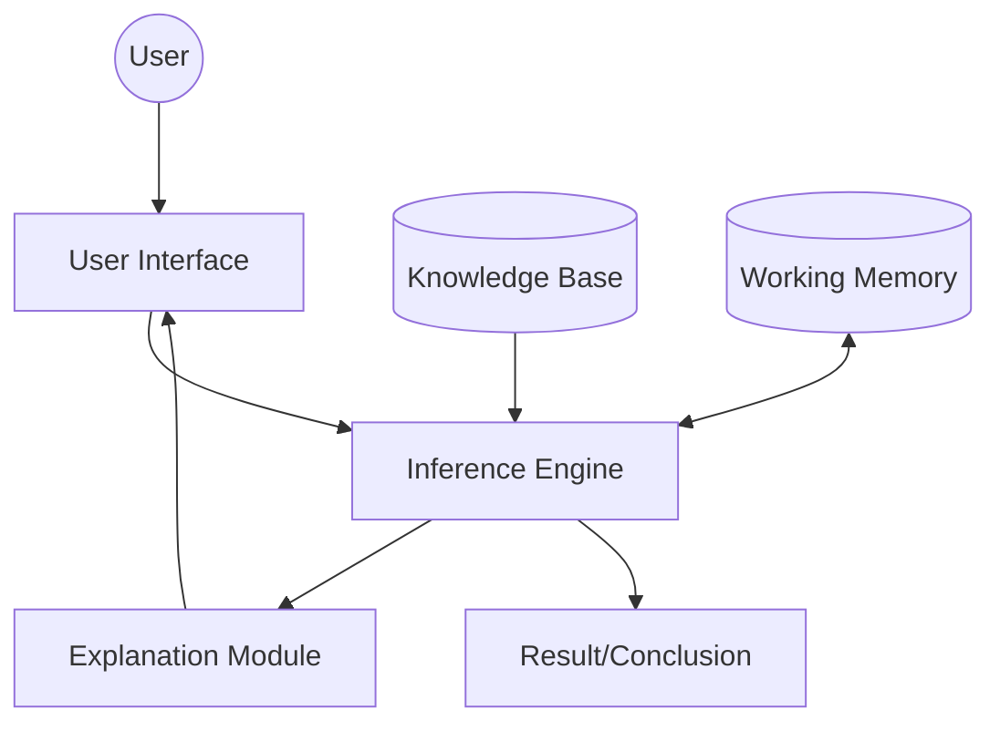

# Expert Systems and Rule-Based Reasoning

> Expert systems are specialized software architectures that emulate the decision-making capabilities of human experts by applying logical rules to a curated knowledge base.

## Overview
Expert Systems (ES) represent the "Symbolic AI" paradigm that dominated the field from the 1970s through the late 1980s. Unlike modern deep learning models that learn statistical patterns from massive datasets, expert systems rely on "if-then" production rules provided by domain experts. The system architecture is bifurcated into two distinct components: the **Knowledge Base**, containing the domain-specific facts and rules, and the **Inference Engine**, which applies logical reasoning to deduce conclusions.

While the "AI Winter" shifted the industry focus toward connectionism and machine learning, rule-based reasoning remains a cornerstone of enterprise software. Today, it is essential for regulatory compliance, complex financial validation, and medical diagnostics where "black box" neural network predictions are unacceptable due to the requirement for auditability, explainability, and deterministic outcomes.

## 2. Visual Intuition
:::demo
<div style="background:#1e1e1e;padding:16px;border-radius:10px;color:#e5e7eb;font-family:system-ui,sans-serif">
  <h3 style="margin:0 0 8px 0;color:#7dd3fc">Expert Systems and Rule-Based Reasoning - Concept Map</h3>
  <svg width="100%" height="280" viewBox="0 0 640 280" role="img" aria-label="Expert Systems and Rule-Based Reasoning visual intuition" style="background:#111827;border-radius:8px">
    <rect x="24" y="28" width="180" height="64" rx="10" fill="#1d4ed8" />
    <text x="114" y="66" text-anchor="middle" fill="#e5e7eb" font-size="14">Problem</text>
    <rect x="230" y="28" width="180" height="64" rx="10" fill="#0f766e" />
    <text x="320" y="66" text-anchor="middle" fill="#e5e7eb" font-size="14">Process</text>
    <rect x="436" y="28" width="180" height="64" rx="10" fill="#7c3aed" />
    <text x="526" y="66" text-anchor="middle" fill="#e5e7eb" font-size="14">Outcome</text>

    <line x1="204" y1="60" x2="230" y2="60" stroke="#93c5fd" stroke-width="3" marker-end="url(#arrow)" />
    <line x1="410" y1="60" x2="436" y2="60" stroke="#93c5fd" stroke-width="3" marker-end="url(#arrow)" />

    <rect x="24" y="130" width="592" height="120" rx="10" fill="#0b1220" stroke="#334155" />
    <text x="320" y="156" text-anchor="middle" fill="#cbd5e1" font-size="14">Key intuition for Expert Systems and Rule-Based Reasoning</text>
    <text x="320" y="182" text-anchor="middle" fill="#94a3b8" font-size="12">Track state changes, constraints, and final behavior.</text>
    <text x="320" y="206" text-anchor="middle" fill="#94a3b8" font-size="12">Use this as a mental model before formal proofs or code.</text>

    <defs>
      <marker id="arrow" markerWidth="10" markerHeight="10" refX="8" refY="3" orient="auto">
        <polygon points="0 0, 10 3, 0 6" fill="#93c5fd" />
      </marker>
    </defs>
  </svg>
  <p style="margin-top:10px;color:#cbd5e1">Interactive-ready visual scaffold for the topic.</p>
</div>
:::
*Caption: Animated illustration of Expert Systems and Rule-Based Reasoning*

## Core Theory

The core of an expert system is the **Production System**. A production system consists of a set of rules (productions), a working memory, and a recognition-act cycle.

### Inference Strategies
1. **Forward Chaining (Data-Driven):** Starting with known facts and applying rules to extract new information until a goal is reached. This is ideal for planning and monitoring.
   If we have facts $F = \{f_1, f_2, ..., f_n\}$ and a set of rules $R = \{r_1, r_2, ..., r_m\}$, the inference engine finds all $r_i$ where the antecedent $Ante(r_i) \subseteq F$, adding the consequent $Cons(r_i)$ to $F$.

2. **Backward Chaining (Goal-Driven):** Starting with a hypothesis $H$ and working backward to see if the known facts support it. The system tries to prove $H$ by verifying its prerequisites:
   $$Prove(H) \iff \exists r_i : Cons(r_i) = H \land \forall p \in Ante(r_i), Prove(p)$$

3. **Conflict Resolution:** When multiple rules trigger, the system must decide which to execute. Common strategies include *Longest Match* (specificity), *Recency* (newest data), or *Priority* (defined by the expert).

## Visual Diagram

*The feedback loop of an expert system: Input facts drive the inference engine against the knowledge base, with an explanation module providing transparency into the reasoning path.*

## Code Example
```python
# A simple Forward-Chaining Inference Engine
class ExpertSystem:
    def __init__(self):
        self.rules = []
        self.facts = set()

    def add_rule(self, antecedent, consequent):
        self.rules.append((set(antecedent), consequent))

    def run(self):
        changed = True
        while changed:
            changed = False
            for antecedent, consequent in self.rules:
                if antecedent.issubset(self.facts) and consequent not in self.facts:
                    print(f"Applying Rule: {antecedent} -> {consequent}")
                    self.facts.add(consequent)
                    changed = True
        return self.facts

# Usage
engine = ExpertSystem()
engine.facts.update(["engine_cranks", "lights_on"])
engine.add_rule(["engine_cranks", "lights_on"], "battery_ok")
engine.add_rule(["battery_ok", "no_start"], "check_fuel")

result = engine.run()
# Output:
# Applying Rule: {'lights_on', 'engine_cranks'} -> battery_ok
# Result: {'engine_cranks', 'lights_on', 'battery_ok'}
```

## Interactive Demo
:::demo
<!DOCTYPE html>
<html>
<style>
  .rule { border: 1px solid #444; padding: 5px; margin: 5px; border-radius: 4px; }
  .fact { color: #4ade80; }
</style>
<body>
  <h3>Rule Engine Demo</h3>
  <div id="status">Facts: <span id="facts" class="fact">engine_ok</span></div>
  <button onclick="trigger()">Add 'has_gas' Fact</button>
  <div id="log" class="rule"></div>
  <script>
    let facts = new Set(['engine_ok']);
    function trigger() {
      facts.add('has_gas');
      document.getElementById('facts').innerText = Array.from(facts).join(', ');
      if(facts.has('engine_ok') && facts.has('has_gas')) {
        document.getElementById('log').innerText = "Inferred: Start_Engine";
      }
    }
  </script>
</body>
</html>
:::

## Worked Example
Problem: Diagnose a computer that won't turn on.
1. **Initial Facts:** {Power_cord_plugged, Power_strip_on}
2. **Rule 1:** {Power_cord_plugged, Power_strip_on} -> {Electricity_available}
3. **Rule 2:** {Electricity_available, Power_button_pressed} -> {Computer_should_start}
4. **Step 1:** Inference Engine sees Rule 1 matches Facts. New Fact: {Electricity_available}.
5. **Step 2:** User inputs {Power_button_pressed}.
6. **Step 3:** Rule 2 matches {Electricity_available, Power_button_pressed}. New Fact: {Computer_should_start}.
7. **Final Conclusion:** Computer should start. If it does not, the system triggers a "Hardware Error" rule.

## Industry Applications
- **Finance (FICO/Credit Scoring):** Automated loan approval systems use complex rule trees to evaluate risk based on consumer behavior.
- **Healthcare (Clinical Decision Support):** Systems like *IBM Watson Health* (in its early iterations) used rule-based engines to suggest drug interactions.
- **Manufacturing (Fault Detection):** Predictive maintenance in GE turbines uses rule sets to identify anomalies from sensor data.

## Practice Problems

### Easy
1. Define the difference between the "Inference Engine" and the "Knowledge Base". *(Hint: Think of data vs. processor)*

### Medium
2. Implement a rule that handles an "OR" condition in your Python engine.
3. Why does backward chaining perform poorly when the number of possible goals is very large?

### Hard
4. Design an algorithm to detect infinite loops in a rule set (where rule A triggers B and B triggers A).

## Interactive Quiz
:::quiz
**Q1:** Which strategy is most efficient when you have a specific hypothesis to verify?
- A) Forward Chaining
- B) Backward Chaining
- C) Breadth-First Search
- D) Conflict Resolution
> B — Backward chaining starts from the goal (the hypothesis) and recursively works back to check if the supporting conditions exist in the knowledge base.

**Q2:** In an inference engine, what is "Conflict Resolution"?
- A) Removing invalid facts
- B) Resolving syntax errors in rules
- C) Selecting one rule from many that match the current facts
- D) Terminating an infinite loop
> C — When multiple rules meet the criteria of the current knowledge base, the conflict resolution strategy determines the priority or execution order.

**Q3:** Which of the following is a limitation of pure rule-based systems?
- A) They are too fast
- B) They cannot explain their reasoning
- C) They struggle with uncertain or incomplete data
- D) They require too much memory
> C — Unlike probabilistic models (Bayesian networks), classic rule-based systems lack native mechanisms to handle uncertainty, leading to brittleness in real-world scenarios.
:::

## Interview Questions
**Q: Explain Expert Systems as you would to a senior engineer.**
*A: Expert systems utilize a knowledge-based architecture to perform automated reasoning. They separate the domain logic (Knowledge Base) from the execution strategy (Inference Engine). They are highly effective for deterministic, rule-heavy domains requiring explainability, though they lack the generalization capabilities of neural networks.*

**Q: Complexity of the Rete Algorithm?**
*A: The Rete algorithm is the standard for matching rules. Its time complexity is $O(N)$ relative to the number of changes in the working memory, where $N$ is the number of rules affected, offering significant optimization over re-evaluating the entire rule set $O(Rules \times Facts)$.*

**Q: What if the knowledge base becomes massive?**
*A: A massive KB leads to performance degradation and "knowledge engineering" bottlenecks. We would employ hierarchical rule structuring, modularization, or integrate machine learning to dynamically prune irrelevant rules.*

**Q: How do you handle "uncertainty" in rule-based systems?**
*A: We introduce Certainty Factors (CF) or Fuzzy Logic, where rules don't return binary results but rather confidence scores $s \in [0, 1]$, combined via algebraic operations.*

## Key Takeaways
- Expert Systems = Knowledge Base + Inference Engine.
- Forward chaining: Data $\rightarrow$ Conclusions.
- Backward chaining: Hypothesis $\rightarrow$ Supporting Evidence.
- Rule-based systems provide high auditability and explainability.
- Rete algorithm is the standard optimization for production matching.
- Not a replacement for ML, but a complement for deterministic logic.

## Common Misconceptions
- ❌ Expert systems are outdated AI → ✅ They are foundational for decision engines in finance/law.
- ❌ Rule engines are equivalent to simple `if/else` → ✅ Expert engines use formal logic frameworks and state management.

## Related Topics
- [[knowledge-representation]] — Explores how to structure knowledge (ontologies/graphs).
- [[search-algorithms]] — Underlying logic for how state spaces are traversed.
- [[fuzzy-logic]] — Handling uncertainty in rule-based systems.
- [[explainable-ai]] — Modern approaches to the transparency expert systems provided natively.
