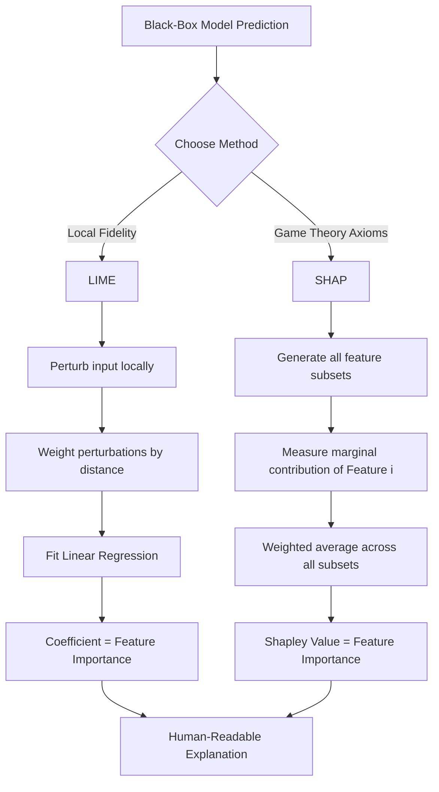

# Explainable AI (XAI): LIME, SHAP, and Interpretability Methods

> **Explainable AI (XAI)** is a suite of machine learning techniques designed to make the internal mechanics, decision-making processes, and specific predictions of "black-box" models (like deep neural networks or ensemble methods) transparent and understandable to human operators without sacrificing predictive performance.

## 1. Historical Background & Motivation

The "interpretability-performance" trade-off has been a central tension in Artificial Intelligence since the early expert systems of the 1970s. While early logic-based systems (see [[description-logics]]) were inherently transparent, they lacked the capacity to generalize to high-dimensional, noisy data. The "Connectionist" revolution and the subsequent rise of Deep Learning (DL) in the 2010s inverted this: we achieved superhuman performance in vision and NLP, but at the cost of opacity. As models grew from a few hundred parameters to hundreds of billions, they became "black boxes" where even the architects could not explain why a specific input led to a specific output.

The modern field of XAI crystallized around 2016-2017 with two seminal papers: "Why Should I Trust You?" (Ribeiro et al., introducing **LIME**) and "A Unified Approach to Interpreting Model Predictions" (Lundberg & Lee, introducing **SHAP**). This shift was driven by three primary catalysts:
1.  **Regulatory Compliance:** The European Union’s General Data Protection Regulation (GDPR) introduced a "right to explanation," making it legally risky to use opaque models for credit scoring or hiring.
2.  **Safety-Critical Systems:** In medical diagnosis or autonomous driving, a "false positive" is not just a metric; it is a life-altering event. Engineers must understand *why* a model failed to prevent future regressions.
3.  **Model Debugging:** ML Engineers realized that models often learn "spurious correlations" (e.g., a model identifying a wolf because there is snow in the background). XAI provides the "visual debugger" for high-dimensional feature spaces.

## 2. Visual Intuition
:::demo
<div style="background:#1e1e1e;padding:16px;border-radius:10px;color:#e5e7eb;font-family:system-ui,sans-serif">
  <h3 style="margin:0 0 8px 0;color:#7dd3fc">Explainable AI (XAI): LIME, SHAP, and Interpretability Methods - Concept Map</h3>
  <svg width="100%" height="280" viewBox="0 0 640 280" role="img" aria-label="Explainable AI (XAI): LIME, SHAP, and Interpretability Methods visual intuition" style="background:#111827;border-radius:8px">
    <rect x="24" y="28" width="180" height="64" rx="10" fill="#1d4ed8" />
    <text x="114" y="66" text-anchor="middle" fill="#e5e7eb" font-size="14">Problem</text>
    <rect x="230" y="28" width="180" height="64" rx="10" fill="#0f766e" />
    <text x="320" y="66" text-anchor="middle" fill="#e5e7eb" font-size="14">Process</text>
    <rect x="436" y="28" width="180" height="64" rx="10" fill="#7c3aed" />
    <text x="526" y="66" text-anchor="middle" fill="#e5e7eb" font-size="14">Outcome</text>

    <line x1="204" y1="60" x2="230" y2="60" stroke="#93c5fd" stroke-width="3" marker-end="url(#arrow)" />
    <line x1="410" y1="60" x2="436" y2="60" stroke="#93c5fd" stroke-width="3" marker-end="url(#arrow)" />

    <rect x="24" y="130" width="592" height="120" rx="10" fill="#0b1220" stroke="#334155" />
    <text x="320" y="156" text-anchor="middle" fill="#cbd5e1" font-size="14">Key intuition for Explainable AI (XAI): LIME, SHAP, and Interpretability Methods</text>
    <text x="320" y="182" text-anchor="middle" fill="#94a3b8" font-size="12">Track state changes, constraints, and final behavior.</text>
    <text x="320" y="206" text-anchor="middle" fill="#94a3b8" font-size="12">Use this as a mental model before formal proofs or code.</text>

    <defs>
      <marker id="arrow" markerWidth="10" markerHeight="10" refX="8" refY="3" orient="auto">
        <polygon points="0 0, 10 3, 0 6" fill="#93c5fd" />
      </marker>
    </defs>
  </svg>
  <p style="margin-top:10px;color:#cbd5e1">Interactive-ready visual scaffold for the topic.</p>
</div>
:::
*Caption: LIME works by taking a complex, non-linear decision boundary (the red/blue background) and fitting a simple, interpretable linear model (the dashed line) locally around a specific point of interest (the bold plus sign).*

## 3. Core Theory & Mathematical Foundations

XAI methods are generally categorized into **Global Interpretability** (how the whole model works) and **Local Interpretability** (why a specific prediction was made). We focus on model-agnostic local methods, which treat the model $f$ as a black box and probe it with perturbed inputs.

### 3.1 LIME: Local Fidelity vs. Global Complexity
LIME (Local Interpretable Model-agnostic Explanations) operates on the principle that while the global decision boundary may be incredibly complex, it can be approximated locally by a simpler model (e.g., a linear regressor or decision tree).

Formally, an explanation is a model $g \in G$ (where $G$ is the class of interpretable models). We minimize the following objective:
$$\xi(x) = \arg\min_{g \in G} L(f, g, \pi_x) + \Omega(g)$$
Where:
- $f$ is the black-box model.
- $g$ is the interpretable surrogate model.
- $\pi_x$ is a proximity measure that defines how "local" the explanation should be around input $x$.
- $L$ is the loss function (usually squared loss) measuring how close $g$'s predictions are to $f$'s in the locality.
- $\Omega(g)$ is a complexity penalty (e.g., the number of non-zero weights in a linear model).

### 3.2 SHAP: The Game Theoretic Gold Standard
SHAP (SHapley Additive exPlanations) is based on **Shapley Values** from cooperative game theory. If a model prediction is a "game" and the input features are the "players," the Shapley value is the unique way to distribute the "payout" (the prediction) among the players such that certain fairness axioms are satisfied.

The Shapley value for feature $i$ is defined as:
$$\phi_i = \sum_{S \subseteq N \setminus \{i\}} \frac{|S|! (M - |S| - 1)!}{M!} [f(S \cup \{i\}) - f(S)]$$
Where:
- $N$ is the set of all features, $M = |N|$.
- $S$ is a subset of features that does *not* include feature $i$.
- $f(S)$ is the model's prediction using only the features in $S$.
- The term $[f(S \cup \{i\}) - f(S)]$ is the **marginal contribution** of feature $i$.

### 3.3 The Four Axioms of SHAP
Unlike LIME, which is heuristic, SHAP is the only method that satisfies these four critical properties:
1.  **Efficiency:** The sum of the Shapley values of all features must equal the total prediction minus the average prediction: $\sum_{i=1}^M \phi_i = f(x) - E[f(x)]$.
2.  **Symmetry:** If two features $i$ and $j$ contribute identically to all possible coalitions, their Shapley values must be equal.
3.  **Dummy (Null Player):** If a feature $i$ contributes nothing to any coalition, its Shapley value is 0.
4.  **Additivity:** For two models $f$ and $h$, the Shapley value of a feature in the model $f+h$ is the sum of its values in $f$ and $h$.

### 3.4 Formal Analysis (Complexity / Correctness)
**Time Complexity:**
- **LIME:** $O(N \cdot P)$, where $N$ is the number of samples and $P$ is the number of features. It is relatively fast because it only fits one local model.
- **SHAP (Exact):** $O(2^M)$, where $M$ is the number of features. Computing the exact Shapley value is NP-hard because it requires evaluating every possible subset of features.
- **KernelSHAP:** $O(N_{samples} \cdot M)$, an approximation that uses weighted linear regression.
- **TreeSHAP:** $O(T \cdot L \cdot D)$, where $T$ is trees, $L$ is leaves, and $D$ is depth. This is a highly optimized algorithm for tree ensembles (XGBoost, LightGBM).

**Space Complexity:**
- $O(M \cdot K)$, where $K$ is the number of background samples used to estimate the "absence" of a feature.

## 4. Algorithm / Process (Step-by-Step)

### KernelSHAP Procedure
1.  **Select Instance:** Choose the instance $x$ you want to explain.
2.  **Generate Coalitions:** Create binary masks $z' \in \{0,1\}^M$. A '1' means the feature value is present; a '0' means it is replaced by a value from a reference "background" dataset.
3.  **Map to Original Space:** Transform $z'$ back to the original feature space $h_x(z')$.
4.  **Predict:** Pass the perturbed samples through the black-box model: $y = f(h_x(z'))$.
5.  **Assign Weights:** Calculate the KernelSHAP weight for each coalition:
    $$w(z') = \frac{M - 1}{(M \text{ choose } |z'|) \cdot |z'| \cdot (M - |z'|)}$$
    *Note: This weight ensures the linear regression coefficients match the theoretical Shapley values.*
6.  **Weighted Regression:** Fit a linear model $g(z') = \phi_0 + \sum \phi_i z'_i$ by minimizing the weighted squared error.
7.  **Extract $\phi$:** The coefficients $\phi_i$ are the Shapley values.

## 5. Visual Diagram

*Caption: The workflow comparison between LIME (perturbation-based) and SHAP (coalition-based).*

## 6. Implementation

### 6.1 Core Implementation (Manual KernelSHAP concept)
```python
import numpy as np
from sklearn.linear_model import Lasso

def compute_kernel_weight(M, coalition_size):
    """
    Calculates the KernelSHAP weight for a given coalition size.
    Complexity: O(1)
    """
    if coalition_size == 0 or coalition_size == M:
        return 1e6  # Represent infinity to force the constraint
    
    numerator = M - 1
    denominator = (np.math.comb(M, coalition_size) * 
                   coalition_size * (M - coalition_size))
    return numerator / denominator

def simple_lime_explain(model, x, num_samples=500):
    """
    Simplified LIME for a 1D feature array.
    Args:
        model: Black-box model with a .predict() method
        x: The instance to explain (1D array)
        num_samples: Number of perturbations
    Returns:
        Interpretable weights (linear coefficients)
    """
    M = len(x)
    # 1. Generate perturbations (random noise)
    perturbations = np.random.normal(0, 1, (num_samples, M))
    z_prime = x + perturbations
    
    # 2. Get black-box predictions
    y_prime = model.predict(z_prime)
    
    # 3. Calculate distances (locality)
    distances = np.linalg.norm(z_prime - x, axis=1)
    weights = np.exp(-(distances**2) / (0.75**2)) # Kernel width 0.75
    
    # 4. Fit weighted linear model (Lasso for sparsity)
    surrogate = Lasso(alpha=0.01)
    surrogate.fit(perturbations, y_prime, sample_weight=weights)
    
    return surrogate.coef_

# Example Usage
# model = MyComplexNeuralNet()
# x = np.array([0.5, 2.1, -1.2])
# importance = simple_lime_explain(model, x)
# print(f"Feature contributions: {importance}")
```

### 6.2 Production Variant (Using the `shap` library)
In industry, manual implementation is rare due to the complexity of the TreeSHAP optimization.
```python
import shap
import xgboost as xgb

# 1. Train a black-box model
X, y = shap.datasets.boston()
model = xgb.XGBRegressor().fit(X, y)

# 2. Initialize the Explainer (TreeSHAP is O(T*L*D))
explainer = shap.Explainer(model)
shap_values = explainer(X)

# 3. Visualize the first prediction's explanation
# This creates a "Force Plot" showing features pushing prediction from base value
shap.plots.force(shap_values[0])

# 4. Global importance (Summary Plot)
shap.summary_plot(shap_values, X)
```

### 6.3 Common Pitfalls in Code
*   **Background Data Leakage:** In SHAP, if your "background" samples are not representative, your feature "absence" calculation will be biased.
*   **Feature Correlation:** LIME and KernelSHAP often struggle when features are highly correlated. If $x_1 \approx x_2$, the model might split importance between them arbitrarily or fail to identify either.
*   **Kernel Width:** In LIME, the choice of the proximity kernel width is sensitive. Too large, and you capture global non-linearities; too small, and you capture noise.

## 7. Interactive Demo

:::demo
<!-- title: Local Linear Approximation (LIME Intuition) -->
<!DOCTYPE html>
<html>
<head>
<meta charset="utf-8">
<style>
  body { margin:0; background:#0f1117; color:#e5e7eb; font-family: system-ui, sans-serif; font-size:13px; padding:16px; }
  canvas { border: 1px solid #334155; background: #000; cursor: crosshair; }
  .controls { margin-top: 10px; display: flex; gap: 10px; align-items: center; }
  button { background: #3b82f6; border: none; color: white; padding: 5px 10px; border-radius: 4px; cursor: pointer; }
  .info { color: #94a3b8; margin-top: 5px; }
</style>
</head>
<body>
  <div style="font-weight:bold; margin-bottom:10px;">LIME Simulation: Local Linear Fit</div>
  <canvas id="viz" width="500" height="300"></canvas>
  <div class="controls">
    <button onclick="reset()">Reset</button>
    <div id="status">Click anywhere to explain the local boundary</div>
  </div>
  <div class="info">Black line: Global non-linear model. Red line: Local LIME approximation.</div>

<script>
const canvas = document.getElementById('viz');
const ctx = canvas.getContext('2d');
const W = canvas.width;
const H = canvas.height;

// Global non-linear function: f(x) = sin(x) + noise
function f(x) {
    return 150 + 60 * Math.sin(x / 50) + 20 * Math.cos(x / 20);
}

function drawBackground() {
    ctx.strokeStyle = '#334155';
    ctx.lineWidth = 2;
    ctx.beginPath();
    for(let x=0; x<W; x++) {
        ctx.lineTo(x, f(x));
    }
    ctx.stroke();
}

function reset() {
    ctx.clearRect(0, 0, W, H);
    drawBackground();
}

canvas.addEventListener('mousedown', (e) => {
    const rect = canvas.getBoundingClientRect();
    const px = e.clientX - rect.left;
    const py = f(px);

    reset();
    
    // Draw target point
    ctx.fillStyle = '#10b981';
    ctx.beginPath();
    ctx.arc(px, py, 5, 0, Math.PI*2);
    ctx.fill();

    // Generate local perturbations
    const samples = [];
    for(let i=0; i<30; i++) {
        let sx = px + (Math.random() - 0.5) * 80;
        let sy = f(sx) + (Math.random() - 0.5) * 10;
        samples.push({x: sx, y: sy});
        
        // Draw samples with alpha based on distance
        let dist = Math.abs(sx - px);
        let weight = Math.exp(-(dist**2)/(40**2));
        ctx.fillStyle = `rgba(59, 130, 246, ${weight})`;
        ctx.fillRect(sx-1, sy-1, 3, 3);
    }

    // Simple Linear Regression (Y = mx + b) weighted by distance
    let sumW=0, sumWX=0, sumWY=0, sumWXX=0, sumWXY=0;
    samples.forEach(s => {
        let dist = Math.abs(s.x - px);
        let w = Math.exp(-(dist**2)/(40**2));
        sumW += w;
        sumWX += w * s.x;
        sumWY += w * s.y;
        sumWXX += w * s.x * s.x;
        sumWXY += w * s.x * s.y;
    });

    const m = (sumW * sumWXY - sumWX * sumWY) / (sumW * sumWXX - sumWX * sumWX);
    const b = (sumWY - m * sumWX) / sumW;

    // Draw Local Model (The "Explanation")
    ctx.strokeStyle = '#ef4444';
    ctx.lineWidth = 3;
    ctx.beginPath();
    ctx.moveTo(px - 40, m * (px - 40) + b);
    ctx.lineTo(px + 40, m * (px + 40) + b);
    ctx.stroke();
});

reset();
</script>
</body>
</html>
:::

## 8. Worked Examples

### Example 1 — Credit Score Explanation (SHAP)
**Context:** A model predicts a customer's credit risk as 0.85 (High Risk).
**Features:** Salary ($x_1$), Debt-to-Income ($x_2$), Past Defaults ($x_3$).

1.  **Base Value ($E[f(x)]$):** The average risk across all customers is 0.40.
2.  **Total Contribution:** $\sum \phi_i = 0.85 - 0.40 = 0.45$.
3.  **Step-wise Calculation (Simplified):**
    -   Coalition $\{Salary\}$ vs $\emptyset$: Risk drops by 0.10.
    -   Coalition $\{Salary, Debt\}$ vs $\{Salary\}$: Risk increases by 0.30.
    -   Coalition $\{Salary, Debt, Defaults\}$ vs $\{Salary, Debt\}$: Risk increases by 0.25.
4.  **Averaging:** After considering all permutations, we find:
    -   $\phi_{Salary} = -0.05$ (Pushes risk down)
    -   $\phi_{Debt} = +0.20$ (Pushes risk up)
    -   $\phi_{Defaults} = +0.30$ (Pushes risk up)
5.  **Check:** $-0.05 + 0.20 + 0.30 = 0.45$. Correct.

### Example 2 — Image Classification (LIME)
**Context:** An InceptionV3 model classifies an image as "Electric Guitar."
1.  **Segmentation:** LIME divides the image into "superpixels" (blobs of similar color).
2.  **Perturbation:** It randomly hides (turns grey) different superpixels.
3.  **Local Model:** It trains a linear regressor: $y = \sum w_i \cdot (\text{superpixel}_i \text{ is visible})$.
4.  **Result:** The superpixels with the highest $w_i$ are highlighted. If the highest weights are on the *guitar strings*, the model is correct. If they are on the *player's hand*, the model is biased.

## 9. Comparison with Alternatives

| Method | Approach | Theoretical Basis | Consistency | Speed |
|---|---|---|---|---|
| **LIME** | Perturbation / Surrogate | Heuristic | Low (can vary by run) | Fast |
| **SHAP** | Coalition / Game Theory | Shapley Values | High (Axiomatic) | Slow (Exponential) |
| **Permutation Importance** | Global Feature Shuffling | Statistics | Medium | Very Fast |
| **Integrated Gradients** | Gradient Integration | Calculus | High | Medium (NN only) |
| **Attention Maps** | Internal weights | Architecture-specific | Low (often noisy) | Instant |

## 10. Industry Applications & Real Systems

-   **Netflix (Recommendation Engines):** Netflix uses XAI to provide "Because you watched..." reasons. While simple heuristics exist, SHAP-style analysis on the underlying reinforcement learning models helps engineers understand why certain genres are trending for a user segment.
-   **Zillow (Zestimate):** To build trust with homeowners, Zillow uses interpretability methods to show which features (e.g., a newly renovated kitchen vs. square footage) most influenced the estimated house price.
-   **JPMorgan Chase (Fraud Detection):** For regulatory compliance under the Fair Credit Reporting Act, the bank uses SHAP values to generate "Reason Codes" for why a credit application was denied by their XGBoost models.
-   **Healthcare (Pathology AI):** Deep learning models identifying cancerous cells in slide images use LIME or Integrated Gradients to highlight the specific cells that triggered a "Malignant" diagnosis, allowing pathologists to verify the reasoning.

## 11. Practice Problems

### 🟢 Easy
1.  **Additive Check:** A model outputs a prediction of 100. The baseline value is 60. You are given three Shapley values: $\phi_1 = 15, \phi_2 = 10, \phi_3 = ?$. Find $\phi_3$.
    *Hint: Use the Efficiency Axiom.*
    *Expected Answer: 15.*

### 🟡 Medium
2.  **LIME Weights:** Why does LIME use a weighted linear regression rather than a simple one? What happens to the explanation if the kernel width is set to infinity?
    *Hint: Think about local vs. global fidelity.*

3.  **The Dummy Axiom:** Prove that if a feature $i$ never changes the model's output in any subset (i.e., $f(S \cup \{i\}) = f(S)$ for all $S$), its Shapley value must be zero.

### 🔴 Hard
4.  **Exponential Explosion:** Suppose you have a model with 50 features. How many model evaluations are required to calculate the *exact* Shapley values for one prediction? If each evaluation takes 1ms, how long would this take?
    *Hint: $2^{50}$ is the number of subsets.*
    *Expected complexity: O(2^M).*

5.  **KernelSHAP Derivation:** In the KernelSHAP weight formula $w(z')$, why do coalitions with size 1 or $M-1$ receive the highest weights?
    *Hint: These coalitions provide the most information about individual feature marginal contributions.*

## 12. Interactive Quiz

:::quiz
**Q1: Which axiom ensures that the sum of feature contributions equals the model's output minus the base value?**
- A) Symmetry
- B) Additivity
- C) Efficiency
- D) Dummy
> C — Efficiency (also called Local Accuracy) is the fundamental property ensuring the explanation is "complete" relative to the prediction.

**Q2: What is a primary drawback of LIME compared to SHAP?**
- A) LIME is slower than SHAP.
- B) LIME lacks a solid theoretical foundation (axioms).
- C) LIME only works for image data.
- D) LIME requires access to the model's gradients.
> B — LIME is a heuristic approach that can yield different explanations for the same point across different runs, whereas SHAP provides a unique, mathematically grounded solution.

**Q3: TreeSHAP is an optimized algorithm for which class of models?**
- A) Deep Neural Networks
- B) Support Vector Machines
- C) Gradient Boosted Trees / Random Forests
- D) Linear Regression
> C — TreeSHAP leverages the internal structure of decision trees to compute Shapley values in polynomial time $O(TLD)$ instead of exponential time.

**Q4: In SHAP, what does the "Base Value" represent?**
- A) The minimum possible prediction.
- B) The average model prediction over the background training set.
- C) The bias term of a linear regression.
- D) Zero.
> B — The base value $E[f(X)]$ represents what the model would predict if it had no information about the current features.

**Q5: If two features are perfectly correlated, how does KernelSHAP behave?**
- A) It assigns all importance to the first feature.
- B) It ignores both features.
- C) It tends to split the importance between them.
- D) It throws a ConvergenceWarning.
> C — Due to the symmetry axiom and the way perturbations are sampled, SHAP will typically share the "credit" between highly correlated features.
:::

## 13. Interview Preparation

### Conceptual Questions
**Q: Explain the difference between Model-Agnostic and Model-Specific interpretability.**
*A: Model-agnostic methods (LIME, SHAP) treat the model as a black box and can be applied to any algorithm by perturbing inputs. Model-specific methods (like Integrated Gradients for NNs or TreeSHAP for trees) exploit the internal structure (gradients, nodes) to gain efficiency or accuracy.*

**Q: Derive the time complexity of exact Shapley values.**
*A: To compute one Shapley value, we must consider every possible subset $S$ of the $M$ features. There are $2^M$ possible subsets. For each subset, we perform a model inference. Thus, the complexity is $O(2^M \cdot \text{Cost}(f))$.*

**Q: How would you choose between LIME and SHAP in a production environment?**
*A: I would choose SHAP (specifically TreeSHAP) if using tree-based models because it offers mathematical guarantees and consistency. If I am using a variety of disparate models and need fast, "good enough" explanations for real-time dashboards, LIME's speed might make it more practical despite its lack of axioms.*

### Quick Reference (Cheat Sheet)
| Property | LIME | SHAP |
|---|---|---|
| **Base** | Local Linear Surrogate | Game Theory (Shapley) |
| **Consistency** | No | Yes |
| **Complexity** | $O(N \cdot P)$ | $O(2^M)$ (Exact) |
| **Best Feature** | Very intuitive, fast | Mathematically robust |
| **Worst Feature** | Unstable results | Computationally expensive |

## 14. Key Takeaways
1.  **Local vs. Global:** Interpretability can explain a single prediction (Local) or the entire model's logic (Global).
2.  **Shapley Axioms:** SHAP is preferred because it is the only method satisfying Efficiency, Symmetry, Dummy, and Additivity.
3.  **The Role of Background Data:** Both methods require "background" data to simulate the absence of a feature.
4.  **Faithfulness:** An explanation is only useful if it is "faithful" to the model, not just "plausible" to a human.
5.  **Spurious Correlations:** XAI is the primary tool for detecting when a model is "cheating" by using biased or irrelevant features.

## 15. Common Misconceptions
- ❌ **"XAI tells you why something happened in the real world."** → ✅ **XAI only tells you why the MODEL thinks something happened.** If the model is wrong, the explanation will accurately explain a wrong decision.
- ❌ **"Feature Importance is the same as Correlation."** → ✅ SHAP values capture non-linear interactions that simple correlation coefficients miss entirely.
- ❌ **"LIME is always better because it's faster."** → ✅ LIME's instability can lead to two different explanations for the same user, which is a major legal/UX risk.

## 16. Further Reading
- *Interpretable Machine Learning* by Christoph Molnar — The definitive online book on this topic.
- *Lundberg, S. M., & Lee, S. I. (2017). A Unified Approach to Interpreting Model Predictions.* — Original SHAP paper.
- *Ribeiro, M. T., et al. (2016). "Why Should I Trust You?": Explaining the Predictions of Any Classifier.* — Original LIME paper.

## 17. Related Topics
- [[heuristic-design]] — How simple rules compare to complex models.
- [[arc-consistency]] — Constraint satisfaction logic often used in symbolic AI.
- [[local-search-optimization]] — LIME uses local optimization to fit its surrogate.
