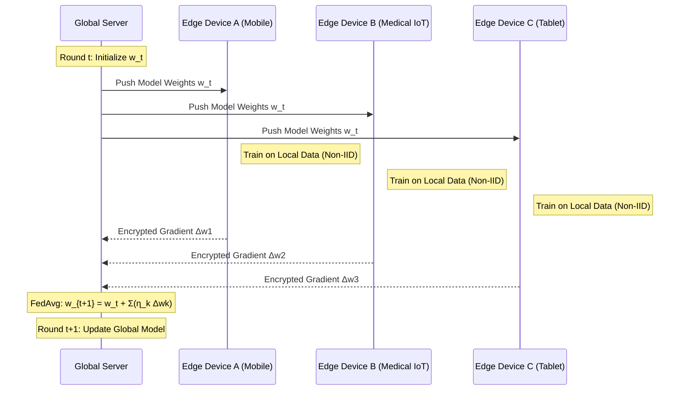

# Federated Learning: Privacy-Preserving Distributed AI

> **Federated Learning (FL)** is a distributed machine learning paradigm where multiple decentralized entities (clients) collaboratively train a model under the orchestration of a central server, while keeping the raw training data localized on the individual clients to preserve privacy and minimize communication overhead.

## 1. Historical Background & Motivation

The genesis of Federated Learning can be traced back to a seminal 2016 paper by Brendan McMahan and colleagues at Google Research, titled *"Communication-Efficient Learning of Deep Networks from Decentralized Data."* Before FL, the standard industry practice for training large-scale machine learning models was the **Centralized Data Silo** approach. In this model, all user data—ranging from sensitive text messages on mobile phones to medical records in hospitals—was uploaded to a central cloud server. This "Big Data" era, while successful in producing high-accuracy models like GPT or ResNet, introduced massive security vulnerabilities, high latency, and significant regulatory hurdles (e.g., GDPR in Europe, HIPAA in the US).

The motivation for FL was twofold: **Privacy** and **Communication Efficiency**. As mobile devices became more powerful (the "Edge Computing" revolution), it became feasible to perform local stochastic gradient descent (SGD) on the device itself. Google’s initial use case was *Gboard*, the mobile keyboard. They wanted to improve word prediction without reading the users' private messages. By moving the model to the data rather than the data to the model, FL solved the fundamental tension between the need for large-scale data and the ethical/legal requirement for data sovereignty. Today, FL is the gold standard for high-stakes industries like healthcare, where data cannot leave institutional firewalls, and finance, where trade secrets are paramount.

## 2. Visual Intuition
:::demo
<div style="background:#1e1e1e;padding:16px;border-radius:10px;color:#e5e7eb;font-family:system-ui,sans-serif">
  <h3 style="margin:0 0 8px 0;color:#7dd3fc">Federated Learning: Privacy-Preserving Distributed AI - Concept Map</h3>
  <svg width="100%" height="280" viewBox="0 0 640 280" role="img" aria-label="Federated Learning: Privacy-Preserving Distributed AI visual intuition" style="background:#111827;border-radius:8px">
    <rect x="24" y="28" width="180" height="64" rx="10" fill="#1d4ed8" />
    <text x="114" y="66" text-anchor="middle" fill="#e5e7eb" font-size="14">Problem</text>
    <rect x="230" y="28" width="180" height="64" rx="10" fill="#0f766e" />
    <text x="320" y="66" text-anchor="middle" fill="#e5e7eb" font-size="14">Process</text>
    <rect x="436" y="28" width="180" height="64" rx="10" fill="#7c3aed" />
    <text x="526" y="66" text-anchor="middle" fill="#e5e7eb" font-size="14">Outcome</text>

    <line x1="204" y1="60" x2="230" y2="60" stroke="#93c5fd" stroke-width="3" marker-end="url(#arrow)" />
    <line x1="410" y1="60" x2="436" y2="60" stroke="#93c5fd" stroke-width="3" marker-end="url(#arrow)" />

    <rect x="24" y="130" width="592" height="120" rx="10" fill="#0b1220" stroke="#334155" />
    <text x="320" y="156" text-anchor="middle" fill="#cbd5e1" font-size="14">Key intuition for Federated Learning: Privacy-Preserving Distributed AI</text>
    <text x="320" y="182" text-anchor="middle" fill="#94a3b8" font-size="12">Track state changes, constraints, and final behavior.</text>
    <text x="320" y="206" text-anchor="middle" fill="#94a3b8" font-size="12">Use this as a mental model before formal proofs or code.</text>

    <defs>
      <marker id="arrow" markerWidth="10" markerHeight="10" refX="8" refY="3" orient="auto">
        <polygon points="0 0, 10 3, 0 6" fill="#93c5fd" />
      </marker>
    </defs>
  </svg>
  <p style="margin-top:10px;color:#cbd5e1">Interactive-ready visual scaffold for the topic.</p>
</div>
:::
*Caption: The Federated Learning cycle: (1) The server broadcasts the global model, (2) Clients train on local data, (3) Clients send weight updates/gradients back, and (4) The server aggregates updates to form a new global model.*

## 3. Core Theory & Mathematical Foundations

Federated Learning shifts the optimization objective from a single dataset to a weighted average of local objectives.

### 3.1 The Global Objective Function
In a standard centralized setting, we minimize a loss function $L(w)$ over a dataset $D$. In FL, we assume there are $K$ clients, each with a local dataset $D_k$ of size $n_k$. Let $n = \sum n_k$ be the total number of samples. The objective is to find $w$ that minimizes:

$$ \min_{w \in \mathbb{R}^d} F(w) = \sum_{k=1}^K \frac{n_k}{n} F_k(w) $$

where $F_k(w) = \frac{1}{n_k} \sum_{x_i \in D_k} \ell(w; x_i)$ is the local empirical risk function for client $k$.

### 3.2 The Federated Averaging (FedAvg) Algorithm
The most widely used optimization algorithm in FL is **FedAvg**. Unlike distributed SGD, where clients send gradients after every single step, FedAvg allows clients to perform multiple local steps of SGD before communicating. This significantly reduces the communication rounds $T$.

1. **Initialization:** Server initializes $w_0$.
2. **For each round $t = 0, 1, 2, ...$:**
   - Server selects a random subset of clients $S_t$.
   - Server broadcasts $w_t$ to all clients in $S_t$.
   - Each client $k \in S_t$ updates $w_t$ locally for $E$ epochs with learning rate $\eta$:
     $$ w_{t+1}^k \leftarrow w_t - \eta \nabla F_k(w_t) $$
   - Clients send the updated weights $w_{t+1}^k$ back to the server.
   - Server aggregates:
     $$ w_{t+1} = \sum_{k \in S_t} \frac{n_k}{n_{S_t}} w_{t+1}^k $$

### 3.3 Statistical Heterogeneity (Non-IID Data)
A core challenge in FL is that data across clients is **Non-IID** (not Independent and Identically Distributed). For example, a user in Japan will have different typing patterns than a user in Brazil. Mathematically, this means:
$$ \mathbb{E}_{D_k} [F_k(w)] \neq \mathbb{E}_{D_j} [F_j(w)] $$
for $k \neq j$. This leads to "client drift," where local updates move the model towards local optima that are far from the global optimum. Researchers use techniques like **FedProx**, which adds a proximal term to the local objective to limit the distance from the global model:
$$ \min_w F_k(w) + \frac{\mu}{2} \| w - w_t \|^2 $$

### 3.4 Differential Privacy (DP)
To ensure that the aggregated weights do not leak information about any single individual in a client's dataset, we apply **Differential Privacy**. We add calibrated noise $\epsilon$ to the updates:
$$ \Delta w_k = \text{Clip}(\Delta w_k, S) + \mathcal{N}(0, \sigma^2 S^2) $$
where $S$ is the sensitivity and $\sigma$ is the noise multiplier. This guarantees that the presence or absence of a single data point does not significantly change the output distribution of the model.

### 3.5 Formal Analysis (Complexity / Correctness)
**Communication Complexity:** In centralized ML, communication is $O(1)$ (local bus). In FL, it is $O(T \cdot |S_t| \cdot d)$, where $T$ is rounds, $|S_t|$ is participants, and $d$ is model parameters. FedAvg reduces $T$ by increasing local computation $E$.
**Convergence:** For strongly convex functions, FedAvg converges at a rate of $O(1/T)$. However, if data is highly non-IID, the convergence constant is significantly larger than IID distributed SGD.

## 4. Algorithm / Process (Step-by-Step)

The Federated Learning lifecycle consists of five distinct phases:

1.  **Client Selection:** The server identifies a set of available "eligible" clients. Eligibility criteria often include being on a non-metered connection (Wi-Fi), being plugged into power, and being idle.
2.  **Configuration:** The server decides the hyperparameters for this round: the number of local epochs ($E$), the local learning rate ($\eta$), and the aggregation weights ($n_k/n$).
3.  **Local Training:** The server transmits the current global model weights to the selected clients. Each client executes $E$ iterations of SGD on their local private data.
4.  **Secure Aggregation:** Clients send their updated weights (or weight deltas) back to the server. To prevent the server from seeing individual updates, **Secure Multi-Party Computation (SMPC)** or **Homomorphic Encryption** may be used, ensuring the server only sees the sum.
5.  **Global Update:** The server computes the weighted average of the received updates to produce the model for round $t+1$. The previous local weights are discarded.

## 5. Visual Diagram


*Caption: The sequence of data-less exchange in Federated Learning, emphasizing that only weight updates (not data) traverse the network.*

## 6. Implementation

### 6.1 Core Implementation: Federated Averaging from Scratch
This implementation uses NumPy to simulate a federated environment with a server and multiple clients.

```python
import numpy as np

class FederatedServer:
    def __init__(self, model_shape):
        """
        Initializes the global model.
        Args: model_shape (int): Number of parameters in our simple linear model.
        """
        self.global_weights = np.random.randn(model_shape)
        
    def aggregate(self, client_updates, client_sizes):
        """
        Performs Federated Averaging.
        Args:
            client_updates (list): List of weight vectors from clients.
            client_sizes (list): List of dataset sizes for each client.
        Returns: None (updates self.global_weights)
        Complexity: O(K * d) where K is clients, d is model dimensions.
        """
        total_n = sum(client_sizes)
        new_weights = np.zeros_like(self.global_weights)
        
        for weights, n_k in zip(client_updates, client_sizes):
            # Weighted average: (n_k / n) * weights
            new_weights += (n_k / total_n) * weights
            
        self.global_weights = new_weights

class FederatedClient:
    def __init__(self, data_x, data_y):
        self.x = data_x
        self.y = data_y
        self.n = len(data_y)

    def train_locally(self, global_weights, epochs=5, lr=0.01):
        """
        Simulates local SGD on client data.
        Args: global_weights (np.array): Weights received from server.
        Returns: np.array: Updated local weights.
        """
        w = global_weights.copy()
        for _ in range(epochs):
            for i in range(self.n):
                # Simple Linear Regression Gradient: (wx - y) * x
                prediction = np.dot(w, self.x[i])
                gradient = (prediction - self.y[i]) * self.x[i]
                w -= lr * gradient
        return w

# --- Simulation Execution ---
# Generate dummy non-IID data
server = FederatedServer(model_shape=2)
clients = [
    FederatedClient(np.array([[1, 2], [1, 3]]), np.array([5, 7])), # Client 1
    FederatedClient(np.array([[1, 10], [1, 12]]), np.array([21, 25])) # Client 2
]

for round in range(10):
    updates = []
    sizes = []
    for c in clients:
        local_w = c.train_locally(server.global_weights)
        updates.append(local_w)
        sizes.append(c.n)
    
    server.aggregate(updates, sizes)
    print(f"Round {round} Global Weights: {server.global_weights}")
```

### 6.2 Optimized / Production Variant: FedProx (with Proximal Term)
In production, we often handle system heterogeneity (some clients are slower). FedProx handles this by adding a penalty.

```python
def train_locally_fedprox(self, global_weights, mu=0.1, epochs=5, lr=0.01):
    """
    FedProx implementation: Adds a proximal term to constrain local updates.
    Formula: Loss_local + (mu/2) * ||w - w_global||^2
    """
    w = global_weights.copy()
    for _ in range(epochs):
        for i in range(self.n):
            prediction = np.dot(w, self.x[i])
            # Gradient of (wx-y)^2 is 2(wx-y)x. 
            # Gradient of proximal term (mu/2)||w-w_g||^2 is mu(w-w_g).
            grad_loss = (prediction - self.y[i]) * self.x[i]
            grad_prox = mu * (w - global_weights)
            w -= lr * (grad_loss + grad_prox)
    return w
```

### 6.3 Common Pitfalls in Code
1.  **Weight Divergence:** If the learning rate $\eta$ is too high or local epochs $E$ are too many, the local models will diverge too far in different directions, causing the average to be a poor model.
2.  **Floating Point Precision:** When aggregating thousands of models, floating-point errors can accumulate. Using `np.float64` is safer than `np.float32`.
3.  **Memory Leaks:** In PyTorch/TensorFlow FL implementations, failing to clear the GPU cache or delete local models after aggregation will quickly lead to OOM (Out of Memory) errors during round transitions.

## 7. Interactive Demo

:::demo
<!-- title: Federated Averaging Visualization -->
<!DOCTYPE html>
<html>
<head>
<meta charset="utf-8">
<style>
  body { margin:0; background:#0f1117; color:#e5e7eb; font-family: 'Segoe UI', Tahoma, Geneva, Verdana, sans-serif; font-size:13px; padding:16px; overflow: hidden; }
  canvas { border: 1px solid #374151; border-radius: 8px; background: #1f2937; }
  .controls { margin-bottom: 10px; display: flex; gap: 10px; align-items: center; }
  button { background: #3b82f6; color: white; border: none; padding: 6px 12px; border-radius: 4px; cursor: pointer; }
  button:hover { background: #2563eb; }
  .stats { font-family: monospace; color: #10b981; }
</style>
</head>
<body>
<div class="controls">
  <button id="playPause">Start Round</button>
  <button id="reset">Reset</button>
  <span>Status: <span id="status" class="stats">Idle</span></span>
  <span>Round: <span id="roundCount" class="stats">0</span></span>
</div>
<canvas id="flCanvas"></canvas>

<script>
  const canvas = document.getElementById('flCanvas');
  const ctx = canvas.getContext('2d');
  canvas.width = 600;
  canvas.height = 350;

  let round = 0;
  let phase = 'IDLE'; // IDLE, BROADCAST, TRAIN, AGGREGATE
  let timer = 0;
  
  const server = { x: 300, y: 50, size: 30, color: '#f59e0b', weight: 0.5 };
  const clients = [
    { x: 100, y: 250, size: 20, color: '#3b82f6', weight: 0.1, data: 10, offset: 0 },
    { x: 300, y: 300, size: 20, color: '#3b82f6', weight: 0.9, data: 50, offset: 0 },
    { x: 500, y: 250, size: 20, color: '#3b82f6', weight: 0.4, data: 20, offset: 0 }
  ];

  const packets = [];

  function draw() {
    ctx.clearRect(0, 0, canvas.width, canvas.height);
    
    // Draw Connections
    ctx.setLineDash([5, 5]);
    ctx.strokeStyle = '#4b5563';
    clients.forEach(c => {
      ctx.beginPath();
      ctx.moveTo(server.x, server.y);
      ctx.lineTo(c.x, c.y);
      ctx.stroke();
    });
    ctx.setLineDash([]);

    // Draw Server
    ctx.fillStyle = server.color;
    ctx.beginPath();
    ctx.arc(server.x, server.y, server.size, 0, Math.PI * 2);
    ctx.fill();
    ctx.fillStyle = '#000';
    ctx.fillText('SERVER', server.x - 20, server.y + 5);
    ctx.fillStyle = '#fff';
    ctx.fillText(`W: ${server.weight.toFixed(3)}`, server.x - 22, server.y + 45);

    // Draw Clients
    clients.forEach((c, i) => {
      ctx.fillStyle = c.color;
      ctx.beginPath();
      ctx.arc(c.x, c.y, c.size, 0, Math.PI * 2);
      ctx.fill();
      ctx.fillStyle = '#fff';
      ctx.fillText(`C${i+1}`, c.x - 8, c.y + 5);
      ctx.fillText(`w: ${c.weight.toFixed(2)}`, c.x - 20, c.y + 35);
      
      // Local training animation
      if (phase === 'TRAIN') {
        c.offset = Math.sin(Date.now() / 100) * 5;
        ctx.strokeStyle = '#10b981';
        ctx.lineWidth = 3;
        ctx.beginPath();
        ctx.arc(c.x, c.y, c.size + 5, 0, Math.PI * 2);
        ctx.stroke();
      }
    });

    // Draw Packets
    packets.forEach((p, index) => {
      p.t += 0.02;
      const curX = p.startX + (p.endX - p.startX) * p.t;
      const curY = p.startY + (p.endY - p.startY) * p.t;
      
      ctx.fillStyle = '#ef4444';
      ctx.beginPath();
      ctx.arc(curX, curY, 5, 0, Math.PI * 2);
      ctx.fill();

      if (p.t >= 1) {
        if (phase === 'BROADCAST') c.weight = server.weight;
        packets.splice(index, 1);
      }
    });

    if (phase === 'BROADCAST' && packets.length === 0) {
      phase = 'TRAIN';
      timer = 0;
      document.getElementById('status').innerText = 'Local Training...';
    }

    if (phase === 'TRAIN') {
      timer++;
      if (timer > 100) {
        phase = 'AGGREGATE';
        document.getElementById('status').innerText = 'Sending Updates...';
        clients.forEach(c => {
            // Simulate local SGD noise
            c.weight += (Math.random() - 0.5) * 0.2;
            packets.push({ startX: c.x, startY: c.y, endX: server.x, endY: server.y, t: 0 });
        });
      }
    }

    if (phase === 'AGGREGATE' && packets.length === 0) {
      // FedAvg Logic
      let sumW = 0;
      let totalD = 0;
      clients.forEach(c => {
        sumW += c.weight * c.data;
        totalD += c.data;
      });
      server.weight = sumW / totalD;
      phase = 'IDLE';
      round++;
      document.getElementById('roundCount').innerText = round;
      document.getElementById('status').innerText = 'Idle';
      document.getElementById('playPause').innerText = 'Start Next Round';
    }

    requestAnimationFrame(draw);
  }

  document.getElementById('playPause').addEventListener('click', () => {
    if (phase === 'IDLE') {
      phase = 'BROADCAST';
      document.getElementById('status').innerText = 'Broadcasting...';
      clients.forEach(c => {
        packets.push({ startX: server.x, startY: server.y, endX: c.x, endY: c.y, t: 0 });
      });
    }
  });

  document.getElementById('reset').addEventListener('click', () => {
    round = 0;
    server.weight = Math.random();
    phase = 'IDLE';
    document.getElementById('roundCount').innerText = '0';
  });

  draw();
</script>
</body>
</html>
:::

## 8. Worked Examples

### Example 1 — Basic Federated Averaging
**Scenario:** A central server wants to train a univariate model $y = wx$.
- **Global Model ($w_t$):** 10.0
- **Client A:** $n_A = 100$ samples, computes local update $w_{t+1}^A = 9.0$
- **Client B:** $n_B = 400$ samples, computes local update $w_{t+1}^B = 11.5$

**Step 1: Calculate total samples ($n$):**
$$ n = 100 + 400 = 500 $$

**Step 2: Apply Weighted Averaging:**
$$ w_{t+1} = \frac{100}{500}(9.0) + \frac{400}{500}(11.5) $$
$$ w_{t+1} = 0.2(9.0) + 0.8(11.5) = 1.8 + 9.2 = 11.0 $$
The global model shifts more towards Client B because it has a larger dataset.

### Example 2 — Non-IID Class Imbalance
**Scenario:** We are training an MNIST digit classifier (10 classes).
- **Client 1** has 1000 images, but only of digits "0" and "1".
- **Client 2** has 1000 images, but only of digits "8" and "9".
- **Client 3** has 1000 images of all digits (0-9).

If we set $E=100$ (high local epochs), Client 1's local model will completely forget how to recognize "8" or "9" (Catastrophic Forgetting). When the server averages these, the resulting weights for the output layers corresponding to digits 2-7 will be severely degraded.
**Solution:** Reduce $E$ to 1-5 or use **FedProx** to penalize local weights from straying too far from the global "balanced" model.

## 9. Comparison with Alternatives

| Approach | Privacy | Bandwidth | Latency | Consistency | Best Used When |
|---|---|---|---|---|---|
| **Centralized ML** | Low | High (Data) | Low (Training) | High | Internal high-trust data. |
| **Distributed SGD** | Low | Very High | High | Very High | Multi-GPU cluster, same DC. |
| **Federated Learning** | High | Low (Weights) | High | Medium | Edge devices, HIPAA data. |
| **Split Learning** | High | Medium | Medium | Medium | Large models on weak edge. |

## 10. Industry Applications & Real Systems

- **Google (Gboard)**: This is the most famous deployment. Gboard uses FL to train "Next Word Prediction" and "Emoji Prediction." The model learns from what you type locally. Only the learned patterns (not your actual words) are sent back to Google during the night when your phone is charging.
- **Apple (QuickType/Siri)**: Similar to Google, Apple uses FL to improve Siri’s voice recognition and QuickType's auto-correct. They combine FL with **Local Differential Privacy** to provide a mathematical guarantee that Siri doesn't "remember" individual voice prints.
- **NVIDIA (Clara Federated Learning)**: In healthcare, hospitals cannot share patient X-rays due to privacy laws. NVIDIA Clara allows different hospitals (e.g., Mayo Clinic and MGH) to collaboratively train a tumor detection model. The model travels to each hospital, learns from their local silos, and shares the expertise globally.
- **IBM (Financial Fraud Detection)**: Banks use FL to detect money laundering patterns across institutions. Since banks cannot share customer transaction data with competitors, FL allows them to share "fraud patterns" without exposing individual identities.

## 11. Practice Problems

### 🟢 Easy
1. **Weighted Average Calculation**: A federated system has 3 clients with dataset sizes 50, 150, and 300. If their local weight updates for a parameter are 0.5, 0.7, and 0.9 respectively, what is the aggregated global weight?
   *Hint: Use the $n_k/n$ formula.*
   *Expected Answer: 0.8*

### 🟡 Medium
2. **Communication Bottleneck**: Suppose a model has 100 million parameters (each 4 bytes). In a federated round, 100 clients participate.
   a) How much data does the server receive in one round?
   b) If the network speed is 10 Mbps per client, how long does the upload take?
   *Hint: Consider total bytes per client first.*
   *Expected complexity: $O(Params \cdot Clients)$*

3. **Gradient vs. Weight Averaging**: Prove that if $E=1$ (one local step), Federated Averaging is mathematically equivalent to Distributed Stochastic Gradient Descent.

### 🔴 Hard
4. **Differential Privacy Budget**: A federated system adds Laplace noise $Lap(S/\epsilon)$ to each client's weight delta to achieve $\epsilon$-differential privacy. If we conduct $T$ rounds of federated learning, and each round is $(\epsilon)$-DP, what is the total privacy leakage according to the Basic Composition Theorem? How does the Moments Accountant method improve this bound?
   *Hint: Review the composition of DP mechanisms.*

5. **Convergence under Non-IID**: Given a local objective that is L-smooth and $\mu$-strongly convex, derive why the term $\Gamma = F^* - \sum p_k F_k^*$ (the heterogeneity gap) prevents the global model from converging to the global optimum in the presence of a fixed learning rate.

## 12. Interactive Quiz

:::quiz
**Q1: Why is raw data NOT sent to the server in Federated Learning?**
- A) The server doesn't have enough storage.
- B) To preserve user privacy and comply with data regulations.
- C) It is faster to send raw data than model weights.
- D) Raw data is usually corrupted.
> B — FL is fundamentally designed to decouple the ability to do machine learning from the need to store the data in the cloud.

**Q2: What happens in FedAvg if we set the number of local epochs (E) to be very large?**
- A) The model converges faster with no side effects.
- B) The model suffers from "Client Drift" as local models diverge from the global optimum.
- C) The communication cost increases linearly.
- D) The global model becomes perfectly IID.
> B — Large E causes local models to over-optimize for local data, which can be highly non-IID, leading to a poor global average.

**Q3: Which mathematical technique ensures that a server cannot see individual client updates during aggregation?**
- A) Gradient Clipping
- B) Secure Multi-Party Computation (SMPC)
- C) Principal Component Analysis (PCA)
- D) Backpropagation
> B — SMPC allows the server to compute the sum of inputs without knowing the individual inputs.

**Q4: In the Federated objective $F(w) = \sum \frac{n_k}{n} F_k(w)$, what does $n_k$ represent?**
- A) The number of neurons in client k.
- B) The number of training samples on client k.
- C) The communication latency of client k.
- D) The learning rate of client k.
> B — $n_k$ is the local sample count, used to weight the influence of each client on the global model.

**Q5: What is the primary bottleneck in scaling Federated Learning to millions of devices?**
- A) Server CPU speed.
- B) Communication overhead and network instability.
- C) Lack of training data.
- D) GPU memory on the central server.
> B — Since weights are large and mobile networks are slow/unreliable, the communication-to-computation ratio is the main challenge.
:::

## 13. Interview Preparation

### Conceptual Questions
**Q: Explain Federated Learning as if teaching it to a fellow engineer.**
*A: Federated Learning is a distributed training pattern where we bring the model to the data rather than the data to the model. Instead of uploading sensitive raw data to a central server, clients download the current model, train it locally on their private data, and only upload the resulting weight updates. The server then aggregates these updates—usually via a weighted average—to improve the global model without ever having seen a single row of the training data.*

**Q: What are the time and space complexities of a single FL round?**
*A: For a model with $d$ parameters and $K$ selected clients:
- **Time Complexity**: $O(K \cdot E \cdot (n_k/B) \cdot d_{backprop})$ per round. Each client performs $E$ epochs over $n_k$ data with batch size $B$.
- **Space Complexity**: On the client, it is $O(d)$ to store the model and $O(B \cdot d)$ for activations. On the server, it is $O(K \cdot d)$ to store all incoming updates before aggregation, though this can be reduced to $O(d)$ using running sums.*

**Q: How would you handle a "Straggler" (a device that is very slow)?**
*A: In a real-world system, we cannot wait for every client to finish. We typically set a "deadline." If a client doesn't return its update within $X$ seconds, the server proceeds with aggregation using only the available updates. Algorithms like **FedProx** or **Asynchronous FL** are specifically designed to handle these cases without biasing the model.*

### Quick Reference (Cheat Sheet)
| Property | Value |
|---|---|
| Primary Algorithm | FedAvg (Federated Averaging) |
| Communication Complexity | $O(T \cdot K \cdot d)$ |
| Key Challenge | Non-IID Data (Statistical Heterogeneity) |
| Privacy Tool | Differential Privacy / SMPC |
| Convergence Rate | $O(1/T)$ for strongly convex |

## 14. Key Takeaways
1.  **Data Sovereignty**: Data never leaves the device; only model updates are shared.
2.  **Communication Efficiency**: FedAvg reduces rounds by performing more local computation.
3.  **Non-IID is the Enemy**: Statistical differences between clients can cause model divergence.
4.  **Security Layers**: Privacy isn't just about not sending data; you must also use DP and SMPC to protect the weights.
5.  **Edge-Heavy**: FL exploits the increasing compute power of mobile and IoT devices.

## 15. Common Misconceptions
- ❌ **"FL is perfectly private by default."** → ✅ **Weights can leak data.** An attacker can reconstruct images from gradients (Gradient Inversion attacks). You need Differential Privacy for real security.
- ❌ **"FL is faster than centralized training."** → ✅ **FL is usually slower.** Network latency and low-power edge CPUs make FL training take much longer in wall-clock time.
- ❌ **"FL only works for simple models."** → ✅ **It scales.** FL is used for massive Transformer models and CNNs in production today.

## 16. Further Reading
- *McMahan et al. (2017)* — **Communication-Efficient Learning of Deep Networks from Decentralized Data.** (The original FL paper).
- *Kairouz et al. (2021)* — **Advances and Open Problems in Federated Learning.** (A 100+ page comprehensive survey).
- *Li et al. (2020)* — **Federated Optimization in Heterogeneous Networks.** (Introduction of FedProx).

## 17. Related Topics
- [[local-search-optimization]] — Used in the local training phase of FL.
- [[differential-privacy]] — The mathematical framework for the privacy guarantees in FL.
- [[edge-computing]] — The infrastructure layer that enables FL.
- [[distributed-systems]] — The foundation of the server-client architecture.
