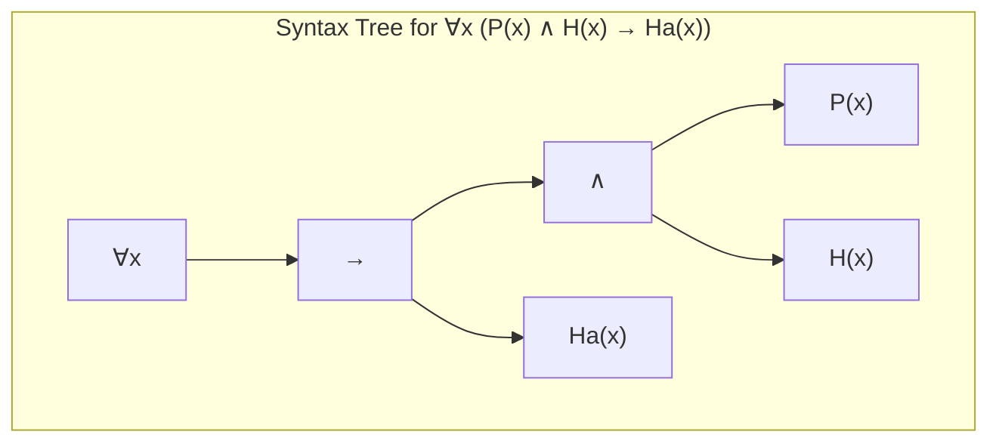

# First-Order Logic

> First-order logic is a formal system used to represent knowledge and make inferences. It is an extension of propositional logic that allows for quantification over individuals.

## Overview
First-order logic (FOL), also known as predicate logic, is a powerful language for knowledge representation and reasoning in artificial intelligence. Unlike propositional logic, which deals with simple true/false propositions, FOL can represent objects, their properties, and the relationships between them. This allows for a much more expressive and concise representation of knowledge.

The key features of FOL are its use of variables, predicates, and quantifiers. Variables allow us to make general statements about objects, predicates allow us to describe properties and relations, and quantifiers ("for all" and "there exists") allow us to specify the scope of our statements. For example, in FOL, we can express the sentence "Every human is mortal" as `∀x (Human(x) → Mortal(x))`.

## 2. Visual Intuition
:::demo
<div style="background:#1e1e1e;padding:16px;border-radius:10px;color:#e5e7eb;font-family:system-ui,sans-serif">
  <h3 style="margin:0 0 8px 0;color:#7dd3fc">First-Order Logic - Concept Map</h3>
  <svg width="100%" height="280" viewBox="0 0 640 280" role="img" aria-label="First-Order Logic visual intuition" style="background:#111827;border-radius:8px">
    <rect x="24" y="28" width="180" height="64" rx="10" fill="#1d4ed8" />
    <text x="114" y="66" text-anchor="middle" fill="#e5e7eb" font-size="14">Problem</text>
    <rect x="230" y="28" width="180" height="64" rx="10" fill="#0f766e" />
    <text x="320" y="66" text-anchor="middle" fill="#e5e7eb" font-size="14">Process</text>
    <rect x="436" y="28" width="180" height="64" rx="10" fill="#7c3aed" />
    <text x="526" y="66" text-anchor="middle" fill="#e5e7eb" font-size="14">Outcome</text>

    <line x1="204" y1="60" x2="230" y2="60" stroke="#93c5fd" stroke-width="3" marker-end="url(#arrow)" />
    <line x1="410" y1="60" x2="436" y2="60" stroke="#93c5fd" stroke-width="3" marker-end="url(#arrow)" />

    <rect x="24" y="130" width="592" height="120" rx="10" fill="#0b1220" stroke="#334155" />
    <text x="320" y="156" text-anchor="middle" fill="#cbd5e1" font-size="14">Key intuition for First-Order Logic</text>
    <text x="320" y="182" text-anchor="middle" fill="#94a3b8" font-size="12">Track state changes, constraints, and final behavior.</text>
    <text x="320" y="206" text-anchor="middle" fill="#94a3b8" font-size="12">Use this as a mental model before formal proofs or code.</text>

    <defs>
      <marker id="arrow" markerWidth="10" markerHeight="10" refX="8" refY="3" orient="auto">
        <polygon points="0 0, 10 3, 0 6" fill="#93c5fd" />
      </marker>
    </defs>
  </svg>
  <p style="margin-top:10px;color:#cbd5e1">Interactive-ready visual scaffold for the topic.</p>
</div>
:::
*Caption: *"Every person who is healthy is happy"**

## Core Theory
The syntax of first-order logic is defined by the following elements:

-   **Constants:** `A`, `B`, `John`, etc. These represent specific objects.
-   **Variables:** `x`, `y`, `z`, etc. These are placeholders for objects.
-   **Predicates:** `P`, `Q`, `Brother`, etc. These represent properties of objects or relations between them.
-   **Functions:** `f`, `g`, `FatherOf`, etc. These map objects to other objects.
-   **Connectives:** `¬`, `∧`, `∨`, `→`, `↔`.
-   **Quantifiers:**
    -   `∀` (Universal Quantifier): "For all..."
    -   `∃` (Existential Quantifier): "There exists..."

**Inference in FOL:**
Inference in FOL is more complex than in propositional logic. In addition to the inference rules of propositional logic, we have new rules for dealing with quantifiers:
-   **Universal Instantiation:** From `∀x P(x)`, we can infer `P(A)` for any constant `A`.
-   **Existential Instantiation:** From `∃x P(x)`, we can infer `P(C)` for some new constant `C`.
-   **Resolution:** A powerful inference rule that can be used to prove theorems in FOL.

## Visual Diagram

*A syntax tree showing the structure of a first-order logic sentence.*

## Code Example
```python
# A full FOL reasoner is very complex. This example demonstrates
# the structure of knowledge, not a working inference engine.

# Facts (as predicates)
# Human('socrates')
# Human('plato')

# Rule (as a universally quantified implication)
# for all x: Human(x) -> Mortal(x)

def forward_chaining(kb):
    """
    A very simplified conceptual demonstration of forward chaining.
    """
    inferred_facts = set()
    # In a real system, we would unify variables and apply rules.
    # Here, we just hardcode the inference for demonstration.
    for fact in kb:
        if fact.startswith("Human"):
            person = fact.split("'")[1]
            inferred_facts.add(f"Mortal('{person}')")
    return inferred_facts

# Example usage
knowledge_base = {"Human('socrates')", "Human('plato')"}
new_facts = forward_chaining(knowledge_base)
print(new_facts)
# Expected output: {"Mortal('socrates')", "Mortal('plato')"}
```

## Interactive Demo
:::demo
<!-- title: "Family Tree Relations" -->
<!DOCTYPE html>
<html>
<head>
<meta charset="utf-8">
<style>
  body { margin:0; background:#0f1117; color:#e5e7eb; font-family: system-ui, sans-serif; padding: 20px; }
  #tree { margin-top: 15px; }
</style>
</head>
<body>
<h3>Family Tree (FOL Example)</h3>
<div id="tree">
  <p><b>Facts:</b></p>
  <ul>
    <li>Father('John', 'Bill')</li>
    <li>Father('Bill', 'Sue')</li>
  </ul>
  <p><b>Rule:</b></p>
  <p>∀x, y, z (Father(x, y) ∧ Father(y, z) → Grandfather(x, z))</p>
  <p><b>Inferred Fact:</b></p>
  <p>Grandfather('John', 'Sue')</p>
</div>
</body>
</html>
:::

## Worked Example
**Problem:** Translate the sentence "Some cats are black" into first-order logic.

**Solution:**
`∃x (Cat(x) ∧ Black(x))`

- `∃x`: "There exists an x" (existential quantifier)
- `Cat(x)`: "x is a cat"
- `∧`: "and"
- `Black(x)`: "x is black"

## Industry Applications
- **Database Systems:** SQL and other database query languages are based on the principles of first-order logic.
- **Semantic Web:** Ontologies and knowledge graphs use FOL-based languages (like OWL and RDF) to represent knowledge.
- **Automated Theorem Proving:** Used in mathematics and software verification to prove the correctness of theorems and programs.
- **Planning:** To define the actions and goals of AI planning systems.

## Practice Problems

### Easy
1. Translate the sentence "All birds can fly" into first-order logic.

### Medium
2. What is the difference between the universal quantifier and the existential quantifier?

### Hard
3. Explain why inference in first-order logic is semi-decidable.

## Interactive Quiz
:::quiz
**Q1:** The symbol `∀` represents...
- A) The existential quantifier ("there exists")
- B) The universal quantifier ("for all")
- C) The conjunction connective ("and")
- D) The implication connective ("implies")
> B — The universal quantifier is used to make statements about all objects in a domain.

**Q2:** Which of the following is NOT a component of first-order logic syntax?
- A) Variables
- B) Predicates
- C) Heuristics
- D) Quantifiers
> C — Heuristics are used in search algorithms, but they are not part of the syntax of first-order logic.

**Q3:** The process of deriving `P(A)` from `∀x P(x)` is called...
- A) Universal Instantiation
- B) Existential Instantiation
- C) Modus Ponens
- D) Resolution
> A — Universal instantiation allows us to infer a specific fact from a general rule.
:::

## Interview Questions

**Q: What is first-order logic and why is it important in AI?**
*A: First-order logic is a powerful language for representing knowledge. It extends propositional logic by adding variables, predicates, and quantifiers, which allows it to represent objects, their properties, and the relationships between them. It's important because it provides a formal and expressive way to represent knowledge, which is crucial for building intelligent systems that can reason about the world.*

**Q: What is the difference between a constant, a variable, and a predicate?**
*A: A constant represents a specific object (e.g., 'John'). A variable is a placeholder for an object (e.g., 'x'). A predicate represents a property of an object or a relation between objects (e.g., 'IsHappy(John)').*

**Q: What is unification?**
*A: Unification is the process of finding a substitution for variables that makes two logical expressions identical. It is a key component of inference algorithms like resolution.*

**Q: Can you explain the concept of a knowledge base?**
*A: A knowledge base is a collection of facts and rules about a particular domain, represented in a formal language like first-order logic. An AI agent can use a knowledge base to reason about the world and make decisions.*

## Key Takeaways
- First-order logic is a powerful and expressive language for knowledge representation.
- It allows for quantification over objects, which is a major advantage over propositional logic.
- Inference in FOL is more complex than in propositional logic, but also more powerful.
- FOL has many applications in AI, databases, and other areas of computer science.
- Understanding FOL is essential for understanding many advanced topics in AI.

## Common Misconceptions
- ❌ First-order logic can represent any kind of knowledge. → ✅ FOL has limitations. It cannot easily represent uncertain or probabilistic knowledge, for example.
- ❌ Inference in FOL is always decidable. → ✅ Inference in FOL is only semi-decidable.

## Related Topics
- [[propositional-logic]] — The foundation upon which first-order logic is built.
- [[knowledge-representation]] — First-order logic is a primary method for knowledge representation.
- [[planning]] — Planning systems often use FOL to represent actions and goals.
