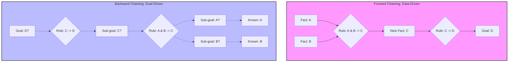

# Forward and Backward Chaining: Rule-Based Inference

> **Rule-based inference** is the process of applying logical transformations to a knowledge base—consisting of facts and rules—to derive new information (Forward Chaining) or verify a specific hypothesis (Backward Chaining).

## 1. Historical Background & Motivation

The development of forward and backward chaining represents the pinnacle of the "Symbolic AI" era, often referred to as the "Classical AI" or "Good Old Fashioned AI" (GOFAI) period. In the late 1950s, researchers like Allen Newell and Herbert Simon introduced the **Logic Theorist**, the first program designed to mimic human problem-solving skills by proving mathematical theorems. However, it wasn't until the 1970s that these methods became commercially and scientifically transformative through the advent of **Expert Systems**. 

The motivation was simple yet profound: human expertise in fields like medicine, geology, and law is often expressed as a series of "if-then" rules. To automate this expertise, computers needed a mechanism to navigate these rules efficiently. Systems like **MYCIN** (developed at Stanford for diagnosing blood infections) and **R1/XCON** (developed by Digital Equipment Corporation for configuring computer systems) proved that rule-based inference could outperform human experts in narrow domains. Forward chaining emerged as the primary tool for data-driven discovery (starting with symptoms to find a disease), while backward chaining excelled at goal-driven verification (starting with a suspected disease and checking for symptoms). Today, while deep learning dominates perception, rule-based inference remains the backbone of "interpretable AI," business logic engines, and modern neuro-symbolic systems.

## 2. Visual Intuition
:::demo
<div style="background:#1e1e1e;padding:16px;border-radius:10px;color:#e5e7eb;font-family:system-ui,sans-serif">
  <h3 style="margin:0 0 8px 0;color:#7dd3fc">Forward and Backward Chaining: Rule-Based Inference - Concept Map</h3>
  <svg width="100%" height="280" viewBox="0 0 640 280" role="img" aria-label="Forward and Backward Chaining: Rule-Based Inference visual intuition" style="background:#111827;border-radius:8px">
    <rect x="24" y="28" width="180" height="64" rx="10" fill="#1d4ed8" />
    <text x="114" y="66" text-anchor="middle" fill="#e5e7eb" font-size="14">Problem</text>
    <rect x="230" y="28" width="180" height="64" rx="10" fill="#0f766e" />
    <text x="320" y="66" text-anchor="middle" fill="#e5e7eb" font-size="14">Process</text>
    <rect x="436" y="28" width="180" height="64" rx="10" fill="#7c3aed" />
    <text x="526" y="66" text-anchor="middle" fill="#e5e7eb" font-size="14">Outcome</text>

    <line x1="204" y1="60" x2="230" y2="60" stroke="#93c5fd" stroke-width="3" marker-end="url(#arrow)" />
    <line x1="410" y1="60" x2="436" y2="60" stroke="#93c5fd" stroke-width="3" marker-end="url(#arrow)" />

    <rect x="24" y="130" width="592" height="120" rx="10" fill="#0b1220" stroke="#334155" />
    <text x="320" y="156" text-anchor="middle" fill="#cbd5e1" font-size="14">Key intuition for Forward and Backward Chaining: Rule-Based Inference</text>
    <text x="320" y="182" text-anchor="middle" fill="#94a3b8" font-size="12">Track state changes, constraints, and final behavior.</text>
    <text x="320" y="206" text-anchor="middle" fill="#94a3b8" font-size="12">Use this as a mental model before formal proofs or code.</text>

    <defs>
      <marker id="arrow" markerWidth="10" markerHeight="10" refX="8" refY="3" orient="auto">
        <polygon points="0 0, 10 3, 0 6" fill="#93c5fd" />
      </marker>
    </defs>
  </svg>
  <p style="margin-top:10px;color:#cbd5e1">Interactive-ready visual scaffold for the topic.</p>
</div>
:::
*Caption: A visualization of Forward Chaining where initial facts (bottom) activate rules, which in turn produce new facts, eventually reaching a conclusion (top). Backward chaining reverses this, starting from a desired conclusion and working down to find supporting evidence.*

## 3. Core Theory & Mathematical Foundations

At the heart of rule-based inference lies **Propositional Logic** and **First-Order Logic**. To ensure computational efficiency, we typically restrict our knowledge base to a specific subset of logic known as **Horn Clauses**.

### 3.1 The Horn Clause Logic
A Horn clause is a disjunction of literals with *at most one positive literal*. In the context of rule-based systems, we focus on **Definite Clauses**, which have *exactly one* positive literal. These take the form:
$$P_1 \land P_2 \land \dots \land P_n \implies Q$$
Where:
- $P_i$ are the **premises** (or body).
- $Q$ is the **conclusion** (or head).
- All $P_i$ and $Q$ are atomic propositions (facts).

If $n=0$, the clause is simply a statement of fact: $(\text{True} \implies Q)$, or simply $Q$.

### 3.2 Forward Chaining: The Data-Driven Approach
Forward chaining is a bottom-up process. We maintain a **Knowledge Base (KB)** of facts and a set of rules. The algorithm iterates through the rules; if a rule's premises are satisfied by current facts, its conclusion is added to the set of known facts. This process repeats until no more facts can be derived or a specific goal is reached.

Mathematically, forward chaining computes the **minimal model** of the KB. Let $KB$ be a set of definite clauses. The set of all facts entailed by $KB$, denoted as $Entailed(KB)$, is the smallest set $S$ such that:
1. All facts in $KB$ are in $S$.
2. For every rule $(P_1 \land \dots \land P_n \implies Q)$ in $KB$, if $\{P_1, \dots, P_n\} \subseteq S$, then $Q \in S$.

### 3.3 Backward Chaining: The Goal-Driven Approach
Backward chaining is a top-down process. Given a goal $G$, the engine searches for rules that conclude $G$. If it finds a rule $(P_1 \land \dots \land P_n \implies G)$, it then recursively attempts to prove all $P_i$ as sub-goals.

This is essentially a **Depth-First Search (DFS)** on the "AND/OR" graph of the knowledge base.
- **AND node**: To prove a conclusion, you must prove *all* its premises.
- **OR node**: To prove a conclusion, you only need to satisfy *any* one of the rules that lead to it.

### 3.4 Formal Analysis (Complexity / Correctness)

**Complexity:**
For a knowledge base with $n$ symbols and $m$ rules:
- **Forward Chaining**: Can be implemented in $O(n + m)$ time. This is achieved by maintaining a counter for each rule representing the number of unknown premises. When a fact is discovered, we decrement the counters of all rules where that fact appears as a premise.
- **Backward Chaining**: In the worst case, $O(2^n)$ for general propositional logic, but for Horn clauses, it is also $O(n + m)$. However, in practice, backward chaining is often much faster because it only explores the relevant subset of the KB.

**Correctness:**
- **Soundness**: Both algorithms are sound; they only derive facts that are logically entailed by the KB.
- **Completeness**: Forward chaining is complete for Horn clauses—if $KB \models q$, forward chaining will find it. Backward chaining is also complete, provided we handle cycles (infinite loops) in the rule graph.

## 4. Algorithm / Process (Step-by-Step)

### Forward Chaining Procedure:
1. Initialize `KnownFacts` with all facts in the KB.
2. Initialize a `Count` table where `Count[rule]` = number of premises in `rule`.
3. Create an `Inferred` table to keep track of symbols already processed to avoid redundant work.
4. While there are new facts in `Agenda`:
    a. Pop a fact `p` from `Agenda`.
    b. If `p` is the goal, return `Success`.
    c. If `p` hasn't been processed:
        i. Mark `p` as processed in `Inferred`.
        ii. For each rule where `p` is in the premises:
            1. Decrement `Count[rule]`.
            2. If `Count[rule] == 0`, add the rule's conclusion to `Agenda`.
5. If the goal is never reached, return `Failure`.

### Backward Chaining Procedure:
1. To prove goal `q`:
2. If `q` is a known fact, return `Success`.
3. If `q` is already on the current recursion stack, return `Failure` (cycle detection).
4. For each rule `R` where `Conclusion(R) == q`:
    a. Let `Premises` be the list of symbols in the body of `R`.
    b. If `All(BackwardChain(p) for p in Premises)` is `Success`, then return `Success`.
5. Return `Failure`.

## 5. Visual Diagram


*Caption: Contrast between the bottom-up propagation of facts in Forward Chaining and the top-down decomposition of goals in Backward Chaining.*

## 6. Implementation

### 6.1 Core Implementation (Forward Chaining)

```python
class Rule:
    def __init__(self, premises, conclusion):
        self.premises = set(premises)
        self.conclusion = conclusion

    def __repr__(self):
        return f"{' & '.join(self.premises)} => {self.conclusion}"

def forward_chain(rules, facts, goal):
    """
    Performs forward chaining to determine if goal is entailed by rules and facts.
    
    Args:
        rules: List of Rule objects.
        facts: Set of initial true symbols.
        goal: The symbol we want to prove.
        
    Returns:
        bool: True if goal is reachable, False otherwise.
        
    Complexity: O(m + n) where m is number of rules, n is number of symbols.
    """
    agenda = list(facts)
    known = set(facts)
    # count[rule] = number of premises yet to be satisfied
    count = {rule: len(rule.premises) for rule in rules}
    # inferred[symbol] to track if we've already processed this fact
    inferred = {fact: True for fact in facts}

    while agenda:
        p = agenda.pop(0)
        if p == goal:
            return True
        
        for rule in rules:
            if p in rule.premises:
                count[rule] -= 1
                if count[rule] == 0:
                    new_fact = rule.conclusion
                    if new_fact not in inferred:
                        inferred[new_fact] = True
                        agenda.append(new_fact)
                        known.add(new_fact)
                        
    return goal in known

# Sample Input
kb_rules = [
    Rule(['P', 'Q'], 'R'),
    Rule(['R'], 'S'),
    Rule(['A'], 'P'),
    Rule(['B'], 'Q')
]
initial_facts = {'A', 'B'}
# Path: A->P, B->Q, (P&Q)->R, R->S. Goal S should be True.
print(f"Goal S reached: {forward_chain(kb_rules, initial_facts, 'S')}") # Expected: True
```

### 6.2 Production Variant: The Rete Algorithm
In real-world production systems (like Drools or CLIPS), simple forward chaining is too slow for millions of facts. They use the **Rete Algorithm**. Rete creates a rooted acyclic directed graph where each node represents a pattern in a rule's premise.

```python
# Conceptual snippet of a Rete-like Alpha Network
class AlphaNode:
    """Matches simple literal conditions (e.g., 'Color == Red')"""
    def __init__(self, attribute, value):
        self.attribute = attribute
        self.value = value
        self.successors = []

    def activate(self, fact):
        if fact.get(self.attribute) == self.value:
            for node in self.successors:
                node.receive(fact)

# Note: Full Rete implementation involves BetaNodes for joins (e.g., matching 
# variables across different premises), which is out of scope for a basic engine.
```

### 6.3 Common Pitfalls in Code
1.  **Infinite Loops (Cycles)**: In backward chaining, a rule like $A \implies B$ and $B \implies A$ will cause a recursion error if you don't maintain a "visited" stack.
2.  **Redundant Work**: Without an `inferred` or `memoization` table, forward chaining might process the same fact multiple times if it's the conclusion of multiple satisfied rules.
3.  **Variable Binding (Unification)**: In First-Order Logic, you don't just match symbols; you match patterns (e.g., `Parent(x, y)`). Failing to handle variable consistency across premises (e.g., `Parent(x, y) & Parent(y, z) \implies Grandparent(x, z)`) is a common error.

## 7. Interactive Demo

:::demo
<!-- title: Rule-Based Inference Visualization -->
<!DOCTYPE html>
<html>
<head>
<meta charset="utf-8">
<style>
  body { margin:0; background:#0f1117; color:#e5e7eb; font-family: system-ui, sans-serif; font-size:13px; padding:16px; display: flex; flex-direction: column; align-items: center;}
  canvas { border: 1px solid #374151; background: #1f2937; border-radius: 8px; cursor: crosshair; }
  .controls { margin-top: 10px; display: flex; gap: 10px; }
  button { background: #3b82f6; color: white; border: none; padding: 8px 16px; border-radius: 4px; cursor: pointer; }
  button:hover { background: #2563eb; }
  .status { margin-top: 10px; font-weight: bold; color: #10b981; }
</style>
</head>
<body>
  <div class="status" id="statusMsg">Mode: Forward Chaining. Click 'Step' to propagate facts.</div>
  <canvas id="chainCanvas" width="600" height="400"></canvas>
  <div class="controls">
    <button onclick="resetDemo()">Reset</button>
    <button onclick="stepForward()">Step Forward</button>
  </div>

<script>
  const canvas = document.getElementById('chainCanvas');
  const ctx = canvas.getContext('2d');
  const statusMsg = document.getElementById('statusMsg');

  let nodes = [
    {id: 'A', x: 100, y: 300, state: 'fact'},
    {id: 'B', x: 200, y: 300, state: 'fact'},
    {id: 'P', x: 100, y: 200, state: 'unknown'},
    {id: 'Q', x: 200, y: 200, state: 'unknown'},
    {id: 'R', x: 150, y: 100, state: 'unknown'},
    {id: 'Goal', x: 150, y: 30, state: 'unknown'}
  ];

  let edges = [
    {from: 'A', to: 'P'},
    {from: 'B', to: 'Q'},
    {from: 'P', to: 'R'},
    {from: 'Q', to: 'R'},
    {from: 'R', to: 'Goal'}
  ];

  let agenda = ['A', 'B'];

  function draw() {
    ctx.clearRect(0, 0, canvas.width, canvas.height);
    
    // Draw edges
    edges.forEach(edge => {
      const f = nodes.find(n => n.id === edge.from);
      const t = nodes.find(n => n.id === edge.to);
      ctx.beginPath();
      ctx.moveTo(f.x, f.y);
      ctx.lineTo(t.x, t.y);
      ctx.strokeStyle = (f.state === 'active') ? '#10b981' : '#4b5563';
      ctx.lineWidth = (f.state === 'active') ? 3 : 1;
      ctx.stroke();
    });

    // Draw nodes
    nodes.forEach(node => {
      ctx.beginPath();
      ctx.arc(node.x, node.y, 20, 0, Math.PI * 2);
      if (node.state === 'fact') ctx.fillStyle = '#3b82f6';
      else if (node.state === 'active') ctx.fillStyle = '#10b981';
      else ctx.fillStyle = '#374151';
      ctx.fill();
      ctx.strokeStyle = '#fff';
      ctx.stroke();
      ctx.fillStyle = '#fff';
      ctx.textAlign = 'center';
      ctx.fillText(node.id, node.x, node.y + 5);
    });
  }

  function stepForward() {
    if (agenda.length === 0) {
      statusMsg.innerText = "Inference Complete.";
      return;
    }
    let p = agenda.shift();
    let node = nodes.find(n => n.id === p);
    node.state = 'active';

    // Check rules: in this demo, P depends on A, Q on B, R on P&Q
    if (p === 'A') agenda.push('P');
    if (p === 'B') agenda.push('Q');
    if (nodes.find(n=>n.id==='P').state === 'active' && nodes.find(n=>n.id==='Q').state === 'active') {
        if (!agenda.includes('R') && nodes.find(n=>n.id==='R').state === 'unknown') agenda.push('R');
    }
    if (p === 'R') agenda.push('Goal');

    draw();
  }

  function resetDemo() {
    nodes.forEach(n => n.state = (n.id === 'A' || n.id === 'B') ? 'fact' : 'unknown');
    agenda = ['A', 'B'];
    statusMsg.innerText = "Mode: Forward Chaining. Click 'Step' to propagate facts.";
    draw();
  }

  draw();
</script>
</body>
</html>
:::

## 8. Worked Examples

### Example 1 — Basic Application (Financial Approval)
**Knowledge Base:**
1. `HighIncome(x) & GoodCredit(x) => ApproveLoan(x)`
2. `Bankrupt(x) => !GoodCredit(x)` (Note: Horn clauses usually don't have negation, so we treat `!GoodCredit` as a separate symbol `CreditRisk`)
3. `StableJob(x) => HighIncome(x)`

**Facts:** `StableJob(Alice)`, `GoodCredit(Alice)`

**Forward Chaining Steps:**
- **Step 1:** Fact `StableJob(Alice)` is known. Rule 3 triggers.
- **Step 2:** Add `HighIncome(Alice)` to facts.
- **Step 3:** Now `HighIncome(Alice)` AND `GoodCredit(Alice)` are true. Rule 1 triggers.
- **Step 4:** Add `ApproveLoan(Alice)` to facts. Goal reached.

### Example 2 — Complex Edge Case (Recursive Math)
**Knowledge Base:**
1. `IsZero(0)`
2. `Number(x) => Number(Successor(x))`
3. `IsZero(x) => Number(x)`

**Goal:** `Number(Successor(Successor(0)))`

**Backward Chaining Steps:**
- **Step 1:** Try to prove `Number(Successor(Successor(0)))`.
- **Step 2:** Use Rule 2: Sub-goal `Number(Successor(0))`.
- **Step 3:** Use Rule 2: Sub-goal `Number(0)`.
- **Step 4:** Use Rule 3: Sub-goal `IsZero(0)`.
- **Step 5:** Rule 1 matches `IsZero(0)`. Return `Success` up the chain.

## 9. Comparison with Alternatives

| Approach | Time | Space | Pros | Cons | Best Used When |
|---|---|---|---|---|---|
| **Forward Chaining** | $O(n+m)$ | $O(n)$ | Automatic discovery, efficient for monitoring. | May derive many irrelevant facts. | Data-driven, real-time alerts, configuration. |
| **Backward Chaining** | $O(n+m)$ | $O(depth)$ | Goal-focused, only touches relevant rules. | Can get stuck in loops, slower if goal is false. | Query-driven, diagnostics, theorem proving. |
| **SAT Solvers** | NP-Complete | $O(n)$ | Can handle any logical formula (not just Horn). | Computationally expensive for large systems. | Circuit design, complex scheduling. |
| **Resolution** | Exponential | Exponential | Refutation complete for FOL. | Hard to control search space. | General mathematical theorem proving. |

## 10. Industry Applications & Real Systems

- **Credit Scoring (FICO/Experian)**: Uses massive rule engines (like **FICO Blaze Advisor**) to determine creditworthiness. Forward chaining processes applicant data (income, debt, payment history) against thousands of regulatory and internal rules.
- **Manufacturing Configuration (SAP/Oracle)**: Systems like **SAP Variant Configuration** use rule-based inference to ensure that when a customer orders a custom car or server, the selected components are compatible (e.g., "If Engine=V8, then Radiator=HeavyDuty").
- **Medical Decision Support**: **Epic Systems** uses rule engines to trigger "Best Practice Advisories." If a patient's lab results (Facts) indicate high potassium and they are prescribed a specific drug, the system forward-chains to flag a potential adverse reaction.
- **Game AI (The Sims)**: The Sims series uses a form of forward chaining for its "utility-based" AI. When a Sim is hungry (Fact), the inference engine evaluates rules to find the best sequence of actions (Go to fridge -> Get ingredients -> Cook) to satisfy the goal.

## 11. Practice Problems

### 🟢 Easy
1. **Rule Discovery**: Given facts `{A, B}` and rules `{A & B => C, C => D, B => E}`, list the order in which facts are added to the KB using forward chaining.
   *Hint: Process facts in alphabetical order from the agenda.*
   *Expected complexity: O(Rules)*

### 🟡 Medium
2. **Cycle Detection**: Implement a backward chaining function that returns `False` instead of crashing when it encounters a cycle like `P => Q, Q => P`.
   *Hint: Maintain a set of symbols currently being explored in the recursion stack.*
   *Expected complexity: O(V + E)*

3. **Conflict Resolution**: In forward chaining, multiple rules might be "triggered" at once. Design a strategy to decide which one to fire first based on "Specificity" (rules with more premises have higher priority).

### 🔴 Hard
4. **The Rete Network**: Given a set of 5 rules involving 3 variables, manually construct the Alpha and Beta nodes for a Rete network. Explain how adding a new fact avoids re-evaluating the premises of rules that don't involve that fact.
   *Hint: Focus on the join nodes where variable bindings must match.*

5. **First-Order Inference**: Extend the Python implementation to support variables. Implement a basic `unify(p, q)` function that can match `Parent(Alice, x)` with `Parent(Alice, Bob)`.

## 12. Interactive Quiz

:::quiz
**Q1: Why is Forward Chaining considered "Data-Driven"?**
- A) It uses a large dataset to train a neural network.
- B) It starts with known facts and propagates them forward to see what else must be true.
- C) It stores data in a SQL database for faster retrieval.
- D) It requires a human to input data at every step.
> B — Forward chaining begins with the "given" (the data) and moves toward the "unknown" (the conclusions).

**Q2: What is the primary advantage of restricting rules to Horn Clauses?**
- A) It allows for the use of negation.
- B) It makes the rules easier for humans to read.
- C) It reduces the complexity of inference from NP-Complete to Linear Time.
- D) It allows the system to handle uncertain or probabilistic data.
> C — General propositional satisfiability is NP-Complete, but inference with Horn clauses is $O(n+m)$.

**Q3: In Backward Chaining, what does an "AND" node in the search graph represent?**
- A) Multiple rules that could satisfy the same goal.
- B) A single rule with multiple premises that must all be true.
- C) A fact that is known to be true.
- D) A contradiction in the knowledge base.
> B — To satisfy the conclusion of a rule, you must satisfy *all* (AND) of its premises.

**Q4: Which system would most likely use Backward Chaining?**
- A) A real-time temperature monitoring system that alerts if a fire starts.
- B) An automated stock trading bot that reacts to price changes.
- C) A diagnostic tool where a doctor asks: "Does this patient have Malaria?"
- D) A self-driving car's sensor fusion module.
> C — Diagnostics are typically query-driven: you have a hypothesis (Goal) and you look for evidence to support it.

**Q5: What happens if a rule base has a cycle (e.g., A → B, B → A) and no cycle detection?**
- A) Forward chaining will loop forever.
- B) Backward chaining will produce an incorrect "False" result.
- C) Backward chaining will result in a Stack Overflow.
- D) The system will automatically resolve the cycle using Modus Ponens.
> C — Without cycle detection, the recursive calls in backward chaining will never terminate, eventually exhausting the stack.
:::

## 13. Interview Preparation

### Conceptual Questions
**Q: Compare and contrast Forward and Backward Chaining.**
*A: Forward chaining is a data-driven, bottom-up approach that starts with known facts and applies rules to derive all possible conclusions. It's best for monitoring and discovery. Backward chaining is a goal-driven, top-down approach that starts with a hypothesis and works backward to find supporting facts. It's more efficient for diagnostics and verification where the state space is large but the goal is specific.*

**Q: Why do production rule engines use the Rete algorithm instead of simple forward chaining?**
*A: Simple forward chaining re-evaluates every rule every time a new fact is added, which is $O(Rules \times Facts)$. Rete caches the partial matches of rule premises in a network. When a new fact enters, it only flows through the parts of the network that mention that fact, drastically reducing redundant computations and enabling systems with millions of rules and facts.*

**Q: How do you handle uncertainty in these systems?**
*A: Classical chaining is deterministic (True/False). To handle uncertainty, we use "Certainty Factors" (as in MYCIN) or "Fuzzy Logic." Alternatively, we move to probabilistic graphical models like Bayesian Networks, though these lose the direct "if-then" interpretability of rule-based systems.*

### Quick Reference (Cheat Sheet)
| Property | Forward Chaining | Backward Chaining |
|---|---|---|
| **Direction** | Data -> Goal | Goal -> Data |
| **Approach** | Bottom-up | Top-down |
| **Search Strategy**| Usually BFS | Usually DFS |
| **Complexity** | $O(n+m)$ | $O(n+m)$ |
| **Completeness** | Complete for Horn Clauses | Complete for Horn Clauses |

## 14. Key Takeaways
1. **Horn Clauses are the "Sweet Spot"**: They provide enough expressivity for most expert systems while maintaining linear-time inference.
2. **Data vs. Goal Driven**: Choose Forward Chaining when facts are many and goals are unknown; choose Backward Chaining for specific hypothesis testing.
3. **Linear Complexity**: With clever indexing (the `count` array), inference doesn't have to be slow.
4. **Cycle Detection is Vital**: Especially in backward chaining, always track the recursion stack to avoid infinite loops.
5. **Conflict Resolution**: In complex systems, use strategies like "Recency" or "Specificity" to decide which rule fires first.
6. **Interpretability**: Unlike deep learning, every conclusion in a rule-based system has a clear "audit trail" or explanation.

## 15. Common Misconceptions
- ❌ **"Rule-based systems are obsolete because of ML."** → ✅ Rule-based systems are critical in regulated industries (Finance/Healthcare) where "black box" decisions are legally unacceptable and 100% predictability is required.
- ❌ **"Forward chaining is always slower."** → ✅ If you have few initial facts and many rules, forward chaining is very fast. It only feels slow if it derives thousands of irrelevant facts.
- ❌ **"Rules can be written in any order."** → ✅ Logically, yes. But for performance and conflict resolution, order often matters in practical engines (e.g., placing more restrictive premises first).

## 16. Further Reading
- *Artificial Intelligence: A Modern Approach (Russell & Norvig)* — Chapters 7 and 9 provide the definitive academic treatment.
- *The Rete Algorithm (Charles Forgy, 1982)* — The original paper for those interested in high-performance engine design.
- *Introduction to Expert Systems (Peter Jackson)* — A deep dive into the engineering of MYCIN and other classic systems.

## 17. Related Topics
- [[arc-consistency]] — How constraints propagate in a similar "forward" fashion.
- [[description-logics]] — A more expressive family of logic used in the Semantic Web.
- [[temporal-logic]] — Applying rules over time (e.g., "If A happens, then B must happen eventually").
- [[description-logics]] — Formalizing the "Knowledge Base" structure.
