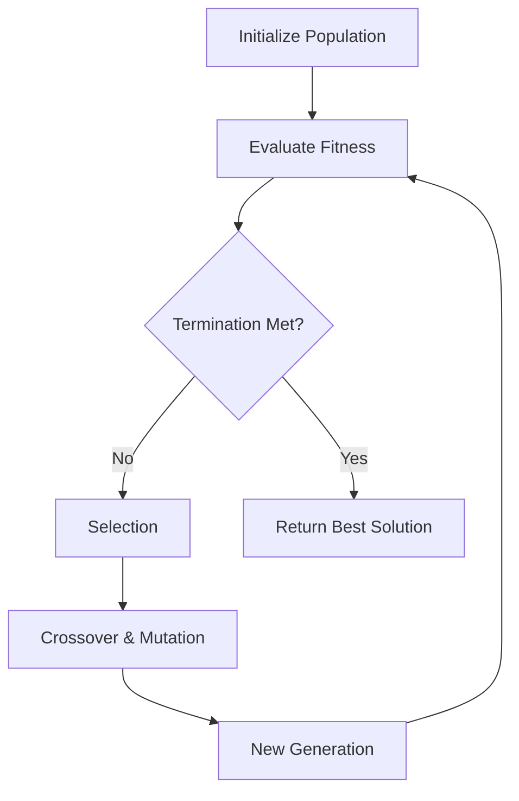

# Evolutionary Computing: Genetic Algorithms and Swarm Intelligence

> Evolutionary computing leverages the principles of natural selection and collective social behavior to solve complex, high-dimensional optimization problems where traditional gradient-based methods often fail.

## Overview

Evolutionary Computing (EC) is a subset of artificial intelligence that draws inspiration from biological evolution. Genetic Algorithms (GAs) mimic the process of natural selection, utilizing mechanisms such as mutation, crossover, and selection to evolve a population of candidate solutions toward an optimal state. Unlike gradient descent, which requires a differentiable objective function, GAs are derivative-free and excel at navigating non-convex landscapes with multiple local optima.

Swarm Intelligence (SI) complements EC by focusing on the collective behavior of decentralized, self-organized systems. Algorithms like Particle Swarm Optimization (PSO) and Ant Colony Optimization (ACO) model how individual agents (particles or ants) interact with their environment and each other to reach global coordination without a central controller. These paradigms are essential in modern engineering for tasks such as hyperparameter tuning, robotic path planning, and complex logistics optimization.

## 2. Visual Intuition
:::demo
<div style="background:#1e1e1e;padding:16px;border-radius:10px;color:#e5e7eb;font-family:system-ui,sans-serif">
  <h3 style="margin:0 0 8px 0;color:#7dd3fc">Evolutionary Computing: Genetic Algorithms and Swarm Intelligence - Concept Map</h3>
  <svg width="100%" height="280" viewBox="0 0 640 280" role="img" aria-label="Evolutionary Computing: Genetic Algorithms and Swarm Intelligence visual intuition" style="background:#111827;border-radius:8px">
    <rect x="24" y="28" width="180" height="64" rx="10" fill="#1d4ed8" />
    <text x="114" y="66" text-anchor="middle" fill="#e5e7eb" font-size="14">Problem</text>
    <rect x="230" y="28" width="180" height="64" rx="10" fill="#0f766e" />
    <text x="320" y="66" text-anchor="middle" fill="#e5e7eb" font-size="14">Process</text>
    <rect x="436" y="28" width="180" height="64" rx="10" fill="#7c3aed" />
    <text x="526" y="66" text-anchor="middle" fill="#e5e7eb" font-size="14">Outcome</text>

    <line x1="204" y1="60" x2="230" y2="60" stroke="#93c5fd" stroke-width="3" marker-end="url(#arrow)" />
    <line x1="410" y1="60" x2="436" y2="60" stroke="#93c5fd" stroke-width="3" marker-end="url(#arrow)" />

    <rect x="24" y="130" width="592" height="120" rx="10" fill="#0b1220" stroke="#334155" />
    <text x="320" y="156" text-anchor="middle" fill="#cbd5e1" font-size="14">Key intuition for Evolutionary Computing: Genetic Algorithms and Swarm Intelligence</text>
    <text x="320" y="182" text-anchor="middle" fill="#94a3b8" font-size="12">Track state changes, constraints, and final behavior.</text>
    <text x="320" y="206" text-anchor="middle" fill="#94a3b8" font-size="12">Use this as a mental model before formal proofs or code.</text>

    <defs>
      <marker id="arrow" markerWidth="10" markerHeight="10" refX="8" refY="3" orient="auto">
        <polygon points="0 0, 10 3, 0 6" fill="#93c5fd" />
      </marker>
    </defs>
  </svg>
  <p style="margin-top:10px;color:#cbd5e1">Interactive-ready visual scaffold for the topic.</p>
</div>
:::
*Caption: An animation showing a population of individuals (represented as points) evolving over generations to converge toward the global maximum of a 2D fitness landscape.*

## Core Theory

### Genetic Algorithms
A Genetic Algorithm maintains a population of chromosomes $P = \{c_1, c_2, ..., c_n\}$. Each chromosome encodes a candidate solution. The fitness function $f(c)$ evaluates the quality of each individual. The evolution cycle consists of:

1. **Selection**: Choosing parents based on fitness $f(c)$, often using Tournament Selection or Roulette Wheel Selection:
   $$P(c_i) = \frac{f(c_i)}{\sum_{j=1}^{n} f(c_j)}$$
2. **Crossover**: Combining two parents to produce offspring. In binary strings, a single-point crossover at index $k$ splits parents $A$ and $B$:
   $$Child_1 = A[0:k] + B[k:n]$$
3. **Mutation**: Randomly altering genes to maintain genetic diversity and prevent premature convergence.

### Particle Swarm Optimization
PSO mimics social behavior. Each particle $i$ has a position $x_i$ and velocity $v_i$. The update rules are:
$$v_i(t+1) = \omega v_i(t) + c_1 r_1 (pbest_i - x_i(t)) + c_2 r_2 (gbest - x_i(t))$$
$$x_i(t+1) = x_i(t) + v_i(t+1)$$
Where $\omega$ is inertia, $c_1, c_2$ are acceleration coefficients, and $r_1, r_2 \in [0,1]$ are random variables.

## Visual Diagram

*The iterative lifecycle of a Genetic Algorithm from initialization to convergence.*

## Code Example

```python
import random

# Objective function: Maximize x^2
def fitness(x):
    return x**2

# Initialize population
pop_size = 10
population = [random.randint(0, 31) for _ in range(pop_size)]

for generation in range(5):
    # Selection (Elitism + Random)
    population = sorted(population, key=lambda x: fitness(x), reverse=True)
    parents = population[:2]
    
    # Crossover (Simple Average)
    offspring = [(parents[0] + parents[1]) // 2]
    
    # Mutation
    if random.random() < 0.2:
        offspring[0] += random.randint(-1, 1)
        
    population = parents + offspring + [random.randint(0, 31) for _ in range(7)]
    print(f"Gen {generation}: Best Individual = {max(population, key=fitness)}")

# Expected Output:
# Gen 0: Best Individual = 31
# ... (evolves towards 31)
```

## Interactive Demo
:::demo
<!DOCTYPE html>
<html>
<body>
<canvas id="c" width="400" height="200" style="background:#1a1a1a"></canvas>
<script>
  const ctx = document.getElementById('c').getContext('2d');
  let particles = Array.from({length: 20}, () => ({x: Math.random()*400, v: Math.random()*2-1}));
  function update() {
    ctx.clearRect(0,0,400,200);
    particles.forEach(p => {
      p.x += p.v;
      if(p.x > 400 || p.x < 0) p.v *= -1;
      ctx.fillRect(p.x, 100, 5, 5);
    });
    requestAnimationFrame(update);
  }
  update();
</script>
</body>
</html>
:::

## Worked Example
**Problem**: Optimize $f(x) = x^2$ for $x \in [0, 31]$ using 5-bit binary strings.
1. **Population**: $[01101, 11001] \rightarrow [13, 25]$
2. **Fitness**: $f(13)=169, f(25)=625$.
3. **Selection**: $25$ is the winner.
4. **Crossover**: Take bits from both. Result: $11101$ (29).
5. **Mutation**: Flip last bit: $11100$ (28).
6. **Result**: The population trends toward the boundary 31.

## Industry Applications
- **Google (DeepMind)**: Using evolutionary strategies to train reinforcement learning agents for complex games.
- **Tesla**: Utilizing swarm-based path planning algorithms for autonomous valet parking logic.
- **Boeing**: Applying genetic algorithms to optimize aircraft wing geometry for aerodynamic efficiency.

## Practice Problems

### Easy
1. Define the role of the "mutation rate" parameter in maintaining population diversity. *(Hint: Consider the balance between exploitation and exploration.)*

### Medium
2. Implement Tournament Selection where $k=3$. Compare it to Roulette Wheel selection.
3. Why does PSO often converge faster than GAs in continuous search spaces?

### Hard
4. Design a genetic algorithm to solve the Traveling Salesperson Problem (TSP). Define the chromosome representation and crossover operator.

## Interactive Quiz
:::quiz
**Q1:** What is the primary purpose of mutation in a Genetic Algorithm?
- A) To increase the fitness of the current generation.
- B) To maintain genetic diversity and prevent premature convergence.
- C) To reduce the computational complexity.
- D) To replace selection.
> B — Mutation injects new genetic material, allowing the algorithm to escape local optima.

**Q2:** In PSO, what does the $pbest$ vector represent?
- A) The global best position found by any particle.
- B) The velocity of the particle.
- C) The personal best position attained by a specific particle.
- D) The inertia coefficient.
> C — $pbest$ is the individual history of the particle's best performance.

**Q3:** What is the "Schema Theorem"?
- A) The proof that GAs always find the global optimum.
- B) The mathematical foundation describing how highly fit short building blocks increase in frequency.
- C) A rule for setting the crossover probability.
- D) A heuristic for swarm size.
> B — The Schema Theorem explains how effective sub-patterns survive and replicate.
:::

## Interview Questions

**Q: Explain GA/Swarm Intelligence to a senior engineer.**
*A: These are stochastic, population-based search metaheuristics. Unlike gradient-based optimization, they do not require gradient information, making them ideal for black-box, non-convex, or discrete search spaces where the objective function landscape is rugged or non-differentiable.*

**Q: Complexity of a single generation of a GA?**
*A: $O(N \cdot L)$ where $N$ is population size and $L$ is chromosome length, assuming fitness evaluation is $O(L)$.*

**Q: When would you use PSO over Gradient Descent?**
*A: Use PSO when the function is non-convex, noisy, or lacks analytical gradients (e.g., hyperparameter search for neural network architectures).*

**Q: How do you prevent "Premature Convergence"?**
*A: Increase the mutation rate, use a larger population, or implement diversity-preserving mechanisms like fitness sharing or speciation.*

## Key Takeaways
- Genetic Algorithms mimic evolution (selection, crossover, mutation).
- Swarm Intelligence utilizes collective social behavior (PSO, ACO).
- These are derivative-free optimization methods.
- Essential for non-convex, discrete, or black-box optimization.
- Always monitor for "premature convergence" to a local optimum.

## Common Misconceptions
- ❌ GAs are always better than Gradient Descent → ✅ They are slower but work when gradients are unavailable.
- ❌ Mutations are always bad → ✅ They are necessary for finding the global optimum.

## Related Topics
- [[gradient-descent]] — Comparison with gradient-based optimization.
- [[reinforcement-learning]] — Using evolutionary methods to train agents.
- [[discrete-optimization]] — How these algorithms handle combinatorial problems.
