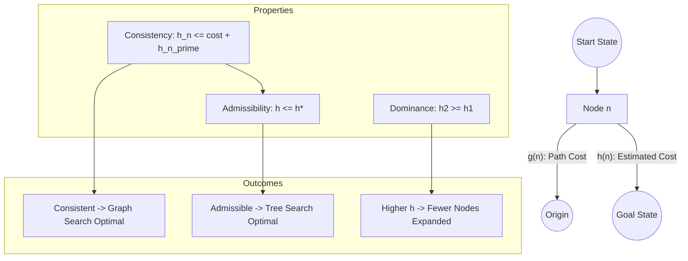

# Heuristic Function Design: Admissibility, Consistency, and Dominance

> A heuristic function $h(n)$ is an informed search component that estimates the minimum cost from a state $n$ to a goal state, serving as the critical driver for pruning search spaces in algorithms like A* and IDA*.

## 1. Historical Background & Motivation

The formal study of heuristic functions traces back to the late 1960s at the Stanford Research Institute (SRI). While working on "Shakey the Robot," Peter Hart, Nils Nilsson, and Bertram Raphael sought to improve upon Dijkstra’s algorithm, which explored nodes in all directions uniformly (a "blind" search). They realized that by incorporating "problem-specific knowledge"—an estimate of the distance remaining—the robot could prioritize paths that looked more promising. This insight led to the birth of the A* algorithm in 1968.

In modern computing, heuristic design is no longer just about grid pathfinding. It is the backbone of symbolic AI, automated planning, and even modern Large Language Model (LLM) decoding strategies (such as look-ahead search). In logistics, companies like Amazon and FedEx use complex heuristics to solve variants of the Traveling Salesperson Problem (TSP) and Vehicle Routing Problem (VRP) where the state space is too vast for exhaustive search. The evolution of heuristics has moved from simple geometric distances (like Euclidean distance) to "pattern databases" and "machine-learned heuristics" that can predict search costs by recognizing structural patterns in the state space.

## 2. Visual Intuition

*Caption: This animation demonstrates A* search using a Manhattan distance heuristic. The "informed" nature of the search causes the algorithm to favor nodes that lie on a direct path toward the goal, significantly reducing the number of expanded nodes compared to BFS or Dijkstra.*

## 3. Core Theory & Mathematical Foundations

Heuristic search algorithms leverage a cost function $f(n) = g(n) + h(n)$, where $g(n)$ is the cost to reach node $n$ from the start, and $h(n)$ is the estimated cost to reach the goal from $n$. The efficiency and correctness of the search depend entirely on the properties of $h(n)$.

### 3.1 Admissibility
A heuristic $h(n)$ is **admissible** if it never overestimates the cost to reach the goal. Formally, if $h^*(n)$ is the true optimal cost from $n$ to the goal, then:
$$0 \leq h(n) \leq h^*(n) \quad \forall n$$
Admissibility is the "optimistic" property. It ensures that A* search will never settle for a sub-optimal path because the actual cost of a path through a sub-optimal node will always eventually exceed the estimated cost of the optimal path.

**Theorem:** If $h(n)$ is admissible, A* using Tree-Search is optimal.

### 3.2 Consistency (Monotonicity)
A heuristic $h(n)$ is **consistent** (or monotonic) if, for every node $n$ and every successor $n'$ of $n$ generated by an action $a$, the estimated cost of reaching the goal from $n$ is no greater than the step cost of getting to $n'$ plus the estimated cost of reaching the goal from $n'$:
$$h(n) \leq c(n, a, n') + h(n')$$
This is essentially a form of the **triangle inequality**. Consistency is a stronger requirement than admissibility. If a heuristic is consistent, then $f(n)$ is non-decreasing along any path.

**Theorem:** Every consistent heuristic is also admissible.
*Proof Sketch:* By induction. For the goal state $g$, $h(g)=0$. For any $n$, $h(n) \leq c(n, a, g) + h(g) = c(n, a, g)$, which is $h^*(n)$.

**Theorem:** If $h(n)$ is consistent, A* using Graph-Search (which keeps track of visited nodes) is optimal and does not require re-opening nodes in the closed set.

### 3.3 Dominance and Efficiency
Given two admissible heuristics $h_1$ and $h_2$, we say $h_2$ **dominates** $h_1$ if:
$$\forall n: h_2(n) \geq h_1(n)$$
In the context of A*, dominance is a measure of "informedness." A dominating heuristic is strictly better because it will expand fewer nodes. Since both are lower bounds on $h^*(n)$, the one that is closer to $h^*(n)$ provides a tighter bound, allowing A* to prune more branches of the search tree.

### 3.4 Formal Analysis (Complexity)
The performance of A* is often analyzed via the **Effective Branching Factor** $b^*$. If A* expands $N$ nodes to find a goal at depth $d$, $b^*$ is the branching factor a uniform tree would need to have $N$ nodes:
$$N + 1 = \sum_{i=0}^{d} (b^*)^i$$
A "perfect" heuristic ($h = h^*$) results in $b^* = 1$, meaning the algorithm walks straight to the goal. A poor heuristic ($h=0$, Dijkstra) results in $b^* \approx b$ (the actual branching factor). The time complexity is $O((b^*)^d)$, where $b^*$ is heavily influenced by the quality of $h$.

## 4. Algorithm / Process (Step-by-Step)

Designing a heuristic usually involves the technique of **Relaxing the Problem**.

1.  **Define the Original Constraints:** Identify the rules of the state space (e.g., in an 8-puzzle, a tile can move to an adjacent square if it is empty).
2.  **Relax Constraints:** Remove one or more constraints to make the problem easier to solve.
    *   *Relaxation A:* A tile can move to any adjacent square (ignores if it's empty). This leads to the **Manhattan Distance** heuristic.
    *   *Relaxation B:* A tile can move to any square. This leads to the **Misplaced Tiles** heuristic.
3.  **Solve the Relaxed Problem Exactly:** The cost of an optimal solution to a relaxed problem is an admissible heuristic for the original problem.
4.  **Verify Admissibility:** Ensure that for all $n$, $h_{relaxed}(n) \leq h^*(n)$. Since the relaxed problem has fewer constraints, any path in the original problem is also a path in the relaxed problem, but the relaxed problem likely has shorter paths.
5.  **Verify Consistency:** Check if $h(n) - h(n') \leq c(n, a, n')$. Most heuristics derived from relaxed problems are naturally consistent.
6.  **Compose Heuristics:** If you have multiple admissible heuristics $h_1, h_2, \dots, h_k$, define $h(n) = \max(h_1(n), h_2(n), \dots, h_k(n))$. This composite heuristic is also admissible and dominates all individual components.

## 5. Visual Diagram


*Caption: The relationship between heuristic properties and A* performance. Note that Consistency is a subset of Admissibility.*

## 6. Implementation

### 6.1 Core Implementation
Below is a generic A* implementation using a grid-based heuristic to demonstrate Admissibility and Consistency.

```python
import heapq

class AStarSolver:
    """
    Standard A* Implementation for a 2D Grid.
    Demonstrates how heuristics influence expansion.
    """
    def __init__(self, grid):
        self.grid = grid  # 0: empty, 1: wall
        self.rows = len(grid)
        self.cols = len(grid[0])

    def heuristic(self, a, b, mode="manhattan"):
        """
        Calculates the heuristic distance between two points.
        Complexity: O(1)
        """
        if mode == "manhattan":
            # Admissible and Consistent for 4-way movement
            return abs(a[0] - b[0]) + abs(a[1] - b[1])
        elif mode == "euclidean":
            # Admissible and Consistent for any-angle/diagonal movement
            return ((a[0] - b[0])**2 + (a[1] - b[1])**2)**0.5
        elif mode == "zero":
            # Becomes Dijkstra's Algorithm
            return 0
        return 0

    def search(self, start, goal, h_type="manhattan"):
        # Priority Queue stores (f_score, g_score, current_node)
        pq = [(0 + self.heuristic(start, goal, h_type), 0, start)]
        came_from = {}
        g_score = {start: 0}
        nodes_expanded = 0

        while pq:
            f, g, current = heapq.heappop(pq)
            nodes_expanded += 1

            if current == goal:
                return self.reconstruct_path(came_from, current), nodes_expanded

            for dx, dy in [(0, 1), (0, -1), (1, 0), (-1, 0)]:
                neighbor = (current[0] + dx, current[1] + dy)

                if (0 <= neighbor[0] < self.rows and 
                    0 <= neighbor[1] < self.cols and 
                    self.grid[neighbor[0]][neighbor[1]] == 0):
                    
                    tentative_g = g + 1 # Step cost is 1
                    
                    if neighbor not in g_score or tentative_g < g_score[neighbor]:
                        g_score[neighbor] = tentative_g
                        f_neighbor = tentative_g + self.heuristic(neighbor, goal, h_type)
                        heapq.heappush(pq, (f_neighbor, tentative_g, neighbor))
                        came_from[neighbor] = current
        
        return None, nodes_expanded

    def reconstruct_path(self, came_from, current):
        path = [current]
        while current in came_from:
            current = came_from[current]
            path.append(current)
        return path[::-1]

# Sample Execution
grid = [[0, 0, 0], [0, 1, 0], [0, 0, 0]]
solver = AStarSolver(grid)
path, expanded = solver.search((0,0), (2,2), "manhattan")
print(f"Path: {path}, Nodes Expanded: {expanded}")
# Expected Output: Path: [(0, 0), (0, 1), (0, 2), (1, 2), (2, 2)], Nodes Expanded: 6
```

### 6.2 Optimized / Production Variant
In production environments (like high-frequency trading or real-time robotics), we use **Pre-computed Pattern Databases**.

```python
class PatternDatabaseHeuristic:
    """
    A production-grade heuristic using a lookup table (Pattern Database).
    Instead of calculating distances, we look up the exact cost for a sub-problem.
    """
    def __init__(self, pdb_file):
        # Load pre-calculated costs for specific sub-configurations
        # e.g., for the 15-puzzle, the exact cost to solve tiles 1-4.
        self.pdb = self.load_database(pdb_file)

    def get_h(self, state):
        # Hash the state and get the pre-calculated lower bound
        state_hash = hash(state)
        return self.pdb.get(state_hash, 0)

    def load_database(self, file_path):
        # Logic to load multi-GB lookup tables efficiently
        return {} # Placeholder
```

### 6.3 Common Pitfalls in Code
*   **Inconsistent Heuristics in Graph Search:** Using an admissible but *inconsistent* heuristic with a standard "visited" set. This can lead to sub-optimal paths unless you implement "node re-opening" (moving a node from the closed set back to the open set if a cheaper path is found).
*   **Priority Queue Tie-Breaking:** In A*, many nodes may have the same $f(n)$. If the tie-breaking isn't handled (e.g., favoring higher $g(n)$), the algorithm might expand significantly more nodes than necessary.
*   **Floating Point Errors:** When using Euclidean distance, small precision errors in $f(n)$ can lead to inconsistent behavior. Always use an epsilon threshold or integer arithmetic where possible.

## 7. Interactive Demo

:::demo
<!-- title: Heuristic Expansion Visualizer -->
<!DOCTYPE html>
<html>
<head>
<meta charset="utf-8">
<style>
  body { margin:0; background:#0f1117; color:#e5e7eb; font-family: system-ui, sans-serif; font-size:13px; padding:16px; display: flex; flex-direction: column; align-items: center; }
  canvas { border: 2px solid #374151; background: #1f2937; cursor: crosshair; }
  .controls { margin-top: 10px; display: flex; gap: 10px; flex-wrap: wrap; justify-content: center; }
  button { background: #3b82f6; color: white; border: none; padding: 8px 16px; border-radius: 4px; cursor: pointer; font-weight: bold; }
  button:hover { background: #2563eb; }
  select { background: #374151; color: white; border: 1px solid #4b5563; padding: 7px; border-radius: 4px; }
  .stats { margin-top: 10px; font-family: monospace; color: #10b981; }
</style>
</head>
<body>
  <h3>A* Heuristic Search Visualizer</h3>
  <canvas id="gridCanvas" width="400" height="400"></canvas>
  <div class="controls">
    <select id="hSelect">
      <option value="manhattan">Manhattan (Consistent)</option>
      <option value="euclidean">Euclidean (Consistent)</option>
      <option value="dijkstra">H=0 (Dijkstra)</option>
      <option value="overestimate">H*2 (Inadmissible)</option>
    </select>
    <button onclick="runSearch()">Find Path</button>
    <button onclick="resetGrid()">Clear Walls</button>
  </div>
  <div class="stats" id="statOutput">Expanded: 0 | Path Cost: 0</div>

<script>
const canvas = document.getElementById('gridCanvas');
const ctx = canvas.getContext('2d');
const hSelect = document.getElementById('hSelect');
const stats = document.getElementById('statOutput');

const ROWS = 20, COLS = 20, SIZE = 20;
let grid = Array(ROWS).fill().map(() => Array(COLS).fill(0));
let start = [2, 2], goal = [17, 17];

canvas.addEventListener('mousedown', (e) => {
    const rect = canvas.getBoundingClientRect();
    const x = Math.floor((e.clientX - rect.left) / SIZE);
    const y = Math.floor((e.clientY - rect.top) / SIZE);
    if(x >= 0 && x < COLS && y >= 0 && y < ROWS) {
        grid[y][x] = grid[y][x] === 1 ? 0 : 1;
        draw();
    }
});

function draw(visited = [], path = []) {
    ctx.clearRect(0, 0, canvas.width, canvas.height);
    for(let r=0; r<ROWS; r++) {
        for(let c=0; c<COLS; c++) {
            ctx.strokeStyle = '#374151';
            ctx.strokeRect(c*SIZE, r*SIZE, SIZE, SIZE);
            if(grid[r][c] === 1) ctx.fillStyle = '#4b5563';
            else ctx.fillStyle = '#1f2937';
            ctx.fillRect(c*SIZE + 1, r*SIZE + 1, SIZE - 2, SIZE - 2);
        }
    }
    visited.forEach(v => {
        ctx.fillStyle = 'rgba(59, 130, 246, 0.3)';
        ctx.fillRect(v[1]*SIZE + 1, v[0]*SIZE + 1, SIZE - 2, SIZE - 2);
    });
    path.forEach(p => {
        ctx.fillStyle = '#10b981';
        ctx.fillRect(p[1]*SIZE + 1, p[0]*SIZE + 1, SIZE - 2, SIZE - 2);
    });
    ctx.fillStyle = '#ef4444'; ctx.fillRect(start[1]*SIZE, start[0]*SIZE, SIZE, SIZE);
    ctx.fillStyle = '#f59e0b'; ctx.fillRect(goal[1]*SIZE, goal[0]*SIZE, SIZE, SIZE);
}

function getH(pos, target, type) {
    const dy = Math.abs(pos[0] - target[0]), dx = Math.abs(pos[1] - target[1]);
    if(type === 'manhattan') return dx + dy;
    if(type === 'euclidean') return Math.sqrt(dx*dx + dy*dy);
    if(type === 'overestimate') return (dx + dy) * 2;
    return 0;
}

async function runSearch() {
    const type = hSelect.value;
    let openSet = [{pos: start, g: 0, f: getH(start, goal, type), parent: null}];
    let visitedNodes = [];
    let closedSet = new Set();
    
    while(openSet.length > 0) {
        openSet.sort((a, b) => a.f - b.f);
        let current = openSet.shift();
        let key = current.pos.join(',');
        
        if(closedSet.has(key)) continue;
        closedSet.add(key);
        visitedNodes.push(current.pos);
        
        if(current.pos[0] === goal[0] && current.pos[1] === goal[1]) {
            let path = [];
            while(current) { path.push(current.pos); current = current.parent; }
            draw(visitedNodes, path);
            stats.innerText = `Expanded: ${visitedNodes.length} | Path Cost: ${path.length - 1}`;
            return;
        }

        const neighbors = [[0,1],[0,-1],[1,0],[-1,0]];
        for(let [dr, dc] of neighbors) {
            let nr = current.pos[0] + dr, nc = current.pos[1] + dc;
            if(nr >= 0 && nr < ROWS && nc >= 0 && nc < COLS && grid[nr][nc] === 0) {
                let g = current.g + 1;
                openSet.push({pos: [nr, nc], g: g, f: g + getH([nr, nc], goal, type), parent: current});
            }
        }
        if(visitedNodes.length % 5 === 0) {
            draw(visitedNodes);
            await new Promise(r => setTimeout(r, 10));
        }
    }
}

function resetGrid() {
    grid = Array(ROWS).fill().map(() => Array(COLS).fill(0));
    draw();
}

draw();
</script>
</body>
</html>
:::

## 8. Worked Examples

### Example 1 — The 8-Puzzle
The 8-puzzle consists of 8 numbered tiles and one blank space in a 3x3 grid. The goal is to reach a specific configuration.

**State $n$:**
```
7 2 4
5 _ 6
8 3 1
```
**Goal State:**
```
1 2 3
4 5 6
7 8 _
```

*   **Heuristic $h_1$ (Misplaced Tiles):** Count tiles not in their goal position.
    *   Tiles 2, 4, 6 are in place. Tiles 7, 5, 8, 3, 1 are misplaced.
    *   $h_1(n) = 5$.
*   **Heuristic $h_2$ (Manhattan Distance):** Sum of distances of each tile from its goal position.
    *   Tile 7: needs to go from (0,0) to (2,0) $\rightarrow$ 2 steps.
    *   Tile 1: needs to go from (2,2) to (0,0) $\rightarrow$ 4 steps.
    *   ... (summing all tiles) ...
    *   $h_2(n) = 18$.
*   **Comparison:** $h_2$ dominates $h_1$. A* with $h_2$ will expand significantly fewer nodes than $h_1$ because $18$ is a much tighter lower bound than $5$.

### Example 2 — Non-Consistent Admissible Heuristic
Consider a graph where:
- Start $S \rightarrow A$ (cost 1)
- $A \rightarrow$ Goal $G$ (cost 10)
- $S \rightarrow G$ (cost 12)

Let $h(S) = 11, h(A) = 0, h(G) = 0$.
1. **Admissibility:** $h(S) \leq 11$ (true cost is 11 via A). $h(A) \leq 10$. Admissible.
2. **Consistency:** $h(S) \leq c(S, A) + h(A) \implies 11 \leq 1 + 0$ is **False**.
3. **Behavior:** In Graph-Search, A* might reach $A$ with $g=1$, then reach $G$ with $g=11$. However, if there was another path, the inconsistency might trick the algorithm into closing a node prematurely with a sub-optimal $g$-cost.

## 9. Comparison with Alternatives

| Approach | Property | Optimality | Search Efficiency | Memory Usage | Best Used When |
|---|---|---|---|---|---|
| **Dijkstra** | $h(n) = 0$ | Always | Low (Explores all directions) | High | Edge weights vary, no goal info. |
| **Greedy Best-First** | $f(n) = h(n)$ | No | High (Focuses only on goal) | Low | Fast, sub-optimal results okay. |
| **A* (Admissible)** | $h(n) \leq h^*$ | Tree-Search | Medium-High | High | Optimal path is required. |
| **A* (Consistent)** | $h(n)$ Monotonic | Graph-Search | High | High | Large graphs with cycles. |
| **Weighted A*** | $f = g + \epsilon h$ | $\epsilon$-bounded | Very High | Low | Real-time systems (e.g., games). |

## 10. Industry Applications & Real Systems

-   **Google Maps (OSRM/Valhalla)**: Google Maps and open-source routers use a technique called **Contraction Hierarchies** combined with A*. They design heuristics based on "transit nodes" (highways) to prune millions of local residential streets when calculating cross-country routes.
-   **Unity / Unreal Engine (NavMesh)**: Game engines use A* for NPC navigation. They often utilize **Euclidean Distance** as a heuristic but apply a weight $\epsilon > 1$ (Weighted A*) to ensure fluid, real-time performance at the cost of slight path sub-optimality.
-   **SpaceX / NASA (Trajectory Optimization)**: In orbital mechanics, heuristics are designed using the "Two-Body Problem" solution (Keplerian orbits) to estimate the fuel cost ($ \Delta v $) for complex multi-burn transfers between planets.
-   **Logistics Optimization (Route4Me)**: Large-scale delivery systems use heuristics to solve VRP. They design $h(n)$ by solving a **Minimum Spanning Tree (MST)** of the remaining delivery points, which is a known admissible lower bound for the cost of visiting all points.

## 11. Practice Problems

### 🟢 Easy
1.  **Grid Admissibility**: In a grid allowing 8-way movement (horizontal, vertical, diagonal), each step costs 1. Is the Manhattan distance admissible?
    *   *Hint: Consider a move from (0,0) to (1,1).*
    *   *Expected Answer: No, Manhattan distance would be 2, but actual cost is 1.*

### 🟡 Medium
2.  **Consistent Max**: Prove that if $h_1(n)$ and $h_2(n)$ are both consistent, then $h(n) = \max(h_1(n), h_2(n))$ is also consistent.
    *   *Hint: Start with the definition $h_i(n) \leq c + h_i(n')$ and compare $\max$ values.*

3.  **Strict Dominance**: Construct a small graph where heuristic $h_A$ dominates $h_B$, and show the difference in the number of nodes expanded by A*.

### 🔴 Hard
4.  **Pattern Database Construction**: For a 15-puzzle, if we create a pattern database for tiles {1, 2, 3, 4} and another for {5, 6, 7, 8}, can we add their values together to form a new heuristic $h(n) = h_{1-4} + h_{5-8}$? Under what conditions is this sum admissible?
    *   *Hint: Think about "disjoint" moves. Does moving a tile in the first set affect the count of the second?*
    *   *Expected complexity: $O(1)$ lookup, $O(\text{States})$ pre-computation.*

5.  **LLM Search**: In a text generation task, we want to find a sentence of length $L$ that maximizes a reward $R$. If our "cost" is negative log-probability, design an admissible heuristic for the remaining $L-k$ tokens.

## 12. Interactive Quiz

:::quiz
**Q1: Which of the following statements is strictly true regarding Consistency and Admissibility?**
- A) Every admissible heuristic is consistent.
- B) Every consistent heuristic is admissible.
- C) Consistency and Admissibility are equivalent in grid worlds.
- D) Consistency is required for Tree-Search optimality.
> B — By definition and induction, a consistent heuristic (satisfying the triangle inequality) never exceeds the true cost to the goal, making it admissible. The reverse is not always true.

**Q2: If $h^*(n)$ is the true cost to the goal, what happens if we use $h(n) = 2 \cdot h^*(n)$ as our heuristic in A*?**
- A) The search will be faster and still optimal.
- B) The search will be slower and still optimal.
- C) The search will be faster but potentially sub-optimal.
- D) The search will behave exactly like Breadth-First Search.
> C — This is an "overestimating" or "inadmissible" heuristic. It behaves like Greedy Best-First Search, prioritizing nodes closer to the goal aggressively, but it may skip the optimal path.

**Q3: Why is $h(n) = \text{Manhattan Distance}$ consistent for a 4-neighbor grid?**
- A) Because the cost of moving to a neighbor is always 1, and the Manhattan distance changes by at most 1.
- B) Because it is the shortest path in a world without obstacles.
- C) Because it always overestimates the cost.
- D) Because it ignores diagonal moves.
> A — Consistency requires $h(n) \leq cost(n, n') + h(n')$. Since $cost=1$ and the Manhattan distance can decrease by at most 1 per step, the inequality $h(n) - h(n') \leq 1$ holds.

**Q4: Given two admissible heuristics $h_1$ and $h_2$, which composite is guaranteed to be admissible and most efficient?**
- A) $h(n) = (h_1 + h_2) / 2$
- B) $h(n) = \min(h_1, h_2)$
- C) $h(n) = \max(h_1, h_2)$
- D) $h(n) = h_1 \cdot h_2$
> C — Max is admissible if both are admissible, and since $\max(h_1, h_2) \geq h_1$ and $\max(h_1, h_2) \geq h_2$, it dominates both, resulting in the most pruning.

**Q5: In Graph-Search A*, if our heuristic is admissible but NOT consistent, what MUST we do to guarantee optimality?**
- A) Nothing, admissibility is enough for graph search.
- B) Switch to Dijkstra's algorithm.
- C) Allow nodes in the "closed" set to be re-opened if a shorter path is found.
- D) Multiply the heuristic by a small factor $\epsilon < 1$.
> C — Without consistency, the first time we reach a node, it might not be via the optimal path. We must be able to update its $g$-cost and re-expand it.
:::

## 13. Interview Preparation

### Conceptual Questions
**Q: Explain heuristic dominance and why it matters in production systems.**
*A: A heuristic $h_2$ dominates $h_1$ if $h_2(n) \geq h_1(n)$ for all $n$ while remaining admissible. This matters because A* expansions are inversely proportional to how "tight" the heuristic is to the true cost. In production systems like GPS routing, using a dominant heuristic can reduce the search space from millions of nodes to thousands, directly impacting latency and battery life on mobile devices.*

**Q: Derive the time complexity of A* search.**
*A: A* has a worst-case time complexity of $O(b^d)$, where $b$ is the branching factor and $d$ is the depth. However, we more accurately use the Effective Branching Factor $b^*$, where the number of nodes expanded $N \approx (b^*)^d$. The better the heuristic (the closer $h$ is to $h^*$), the closer $b^*$ gets to 1, turning exponential complexity into linear complexity.*

**Q: How would you choose between A* and BFS in a search problem?**
*A: I would choose BFS only if the edge weights are uniform AND I have no domain knowledge to create a heuristic. In all other cases, A* is superior. Even with a weak heuristic ($h=0$), A* defaults to Dijkstra, which is the optimal blind search for varying edge weights. If memory is the constraint, I would consider IDA* (Iterative Deepening A*).*

### Quick Reference (Cheat Sheet)
| Property | Value |
|---|---|
| Optimality (Tree Search) | Guaranteed if Admissible |
| Optimality (Graph Search) | Guaranteed if Consistent |
| Relation | Consistent $\implies$ Admissible |
| Pruning Rule | $h_2 \geq h_1 \implies$ $h_2$ is better |
| Dijkstra Equivalent | $h(n) = 0$ |
| Greedy Search | $f(n) = h(n)$ |

## 14. Key Takeaways
1.  **Optimism is Key:** Admissible heuristics are "optimistic" lower bounds.
2.  **Consistency is Triangle Inequality:** It ensures that $f(n)$ never decreases, which prevents the need for node re-opening.
3.  **Relaxation:** The most common way to derive a heuristic is to solve a simplified version of the problem.
4.  **Dominance:** Always use the "largest" admissible heuristic available to minimize node expansion.
5.  **Composite Heuristics:** Use $\max(h_1, h_2, \dots)$ to combine multiple sources of information without losing admissibility.
6.  **Graph vs. Tree Search:** Remember that Graph Search (with a closed set) requires Consistency for optimality, whereas Tree Search only requires Admissibility.

## 15. Common Misconceptions
- ❌ **"A more accurate heuristic is always more complex to calculate."** → ✅ Not necessarily. Manhattan distance is $O(1)$ to calculate but significantly more accurate than $h=0$ (Dijkstra) for grids.
- ❌ **"If A* finds a goal, it's always the optimal path."** → ✅ Only if the heuristic is admissible. If $h(n)$ overestimates, A* can return a sub-optimal path.
- ❌ **"Consistency is only for graph search."** → ✅ While critical for graph search efficiency, consistency also helps tree search by ensuring $f$-values are monotonic, which can simplify some implementations.

## 16. Further Reading
- *Artificial Intelligence: A Modern Approach (Russell & Norvig, Chapter 3)* — The definitive guide to heuristic search.
- *Heuristics: Intelligent Search Strategies for Computer Problem Solving (Judea Pearl)* — The seminal book that defined the field.
- *CLRS (Introduction to Algorithms, Chapter 24)* — Details on Dijkstra and general graph search foundations.
- "A Formal Basis for the Heuristic Determination of Minimum Cost Paths" (Hart, Nilsson, Raphael, 1968) — The original A* paper.

## 17. Related Topics
- [[bidirectional-search]] — Using heuristics from both start and goal.
- [[local-search-optimization]] — When $h(n)$ is used as an objective function (e.g., Hill Climbing).
- [[monte-carlo-tree-search]] — Heuristic-driven simulation in game trees.
- [[alpha-beta-enhancements]] — Heuristics for move ordering in adversarial search.