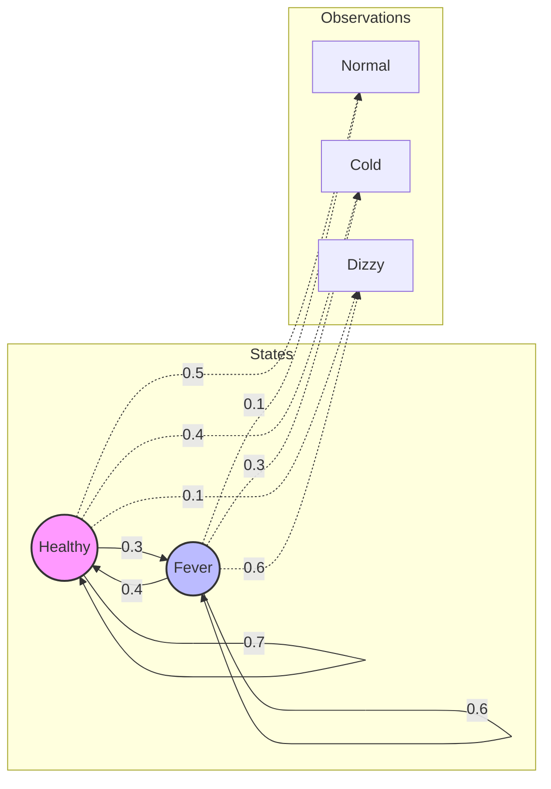

# Hidden Markov Models: Forward-Backward and Viterbi Algorithms

> A Hidden Markov Model (HMM) is a doubly stochastic process consisting of an underlying Markov chain of unobserved (hidden) states and an observation sequence generated by those states through a specific probability distribution.

## 1. Historical Background & Motivation

The development of Hidden Markov Models (HMMs) represents a watershed moment in the transition of Artificial Intelligence from heuristic-based systems to rigorous probabilistic modeling. The foundational mathematics were primarily developed in the mid-1960s by **Leonard E. Baum** and his colleagues at the Institute for Defense Analyses (IDA) in Princeton. Originally termed "functions of Markov chains," these models were initially classified due to their potential applications in cryptanalysis and signal processing for the U.S. government. Baum's work introduced the "Baum-Welch algorithm," a specialized case of the Expectation-Maximization (EM) algorithm, which allowed for the unsupervised learning of model parameters—a revolutionary concept at the time.

The second major pillar of HMMs came from **Andrew Viterbi** in 1967. Viterbi, a co-founder of Qualcomm, developed his namesake algorithm as a decoding method for convolutional codes over noisy digital communication channels. It was not until the early 1970s, through the work of researchers like **James Baker** at Carnegie Mellon and **Frederick Jelinek** at IBM, that the connection between Baum's statistical models and Viterbi's decoding was fully realized for speech recognition. This era replaced "hand-crafted" linguistic rules with "data-driven" statistical inference, laying the groundwork for modern systems like Siri, Alexa, and Google Translate. Today, HMMs remain a fundamental tool in bioinformatics for DNA sequence alignment and in quantitative finance for regime-switching models, where the "hidden state" might represent a bull or bear market.

## 2. Visual Intuition
:::demo
<div style="background:#1e1e1e;padding:16px;border-radius:10px;color:#e5e7eb;font-family:system-ui,sans-serif">
  <h3 style="margin:0 0 8px 0;color:#7dd3fc">Hidden Markov Models: Forward-Backward and Viterbi Algorithms - Concept Map</h3>
  <svg width="100%" height="280" viewBox="0 0 640 280" role="img" aria-label="Hidden Markov Models: Forward-Backward and Viterbi Algorithms visual intuition" style="background:#111827;border-radius:8px">
    <rect x="24" y="28" width="180" height="64" rx="10" fill="#1d4ed8" />
    <text x="114" y="66" text-anchor="middle" fill="#e5e7eb" font-size="14">Problem</text>
    <rect x="230" y="28" width="180" height="64" rx="10" fill="#0f766e" />
    <text x="320" y="66" text-anchor="middle" fill="#e5e7eb" font-size="14">Process</text>
    <rect x="436" y="28" width="180" height="64" rx="10" fill="#7c3aed" />
    <text x="526" y="66" text-anchor="middle" fill="#e5e7eb" font-size="14">Outcome</text>

    <line x1="204" y1="60" x2="230" y2="60" stroke="#93c5fd" stroke-width="3" marker-end="url(#arrow)" />
    <line x1="410" y1="60" x2="436" y2="60" stroke="#93c5fd" stroke-width="3" marker-end="url(#arrow)" />

    <rect x="24" y="130" width="592" height="120" rx="10" fill="#0b1220" stroke="#334155" />
    <text x="320" y="156" text-anchor="middle" fill="#cbd5e1" font-size="14">Key intuition for Hidden Markov Models: Forward-Backward and Viterbi Algorithms</text>
    <text x="320" y="182" text-anchor="middle" fill="#94a3b8" font-size="12">Track state changes, constraints, and final behavior.</text>
    <text x="320" y="206" text-anchor="middle" fill="#94a3b8" font-size="12">Use this as a mental model before formal proofs or code.</text>

    <defs>
      <marker id="arrow" markerWidth="10" markerHeight="10" refX="8" refY="3" orient="auto">
        <polygon points="0 0, 10 3, 0 6" fill="#93c5fd" />
      </marker>
    </defs>
  </svg>
  <p style="margin-top:10px;color:#cbd5e1">Interactive-ready visual scaffold for the topic.</p>
</div>
:::
*Caption: The HMM Trellis Diagram. Each vertical column represents a time step $t$. Each node represents a hidden state. The edges represent transition probabilities, while the observed emissions (not shown) are generated at each node. The Viterbi algorithm finds the single most likely path (red line) through this grid.*

## 3. Core Theory & Mathematical Foundations

An HMM is formally defined by a quintuple $\lambda = (S, V, A, B, \pi)$.

*   $S = \{s_1, s_2, ..., s_N\}$: A set of $N$ hidden states.
*   $V = \{v_1, v_2, ..., v_M\}$: A discrete vocabulary of $M$ possible observation symbols.
*   $A = \{a_{ij}\}$: The state transition probability matrix, where $a_{ij} = P(q_{t+1} = s_j | q_t = s_i)$, representing the probability of moving from state $i$ to state $j$.
*   $B = \{b_j(k)\}$: The emission probability matrix (or observation likelihoods), where $b_j(k) = P(O_t = v_k | q_t = s_j)$.
*   $\pi = \{\pi_i\}$: The initial state distribution, where $\pi_i = P(q_1 = s_i)$.

### 3.1 The Markov Property and Independence Assumptions
The HMM relies on two critical assumptions that make computation tractable:
1.  **The Markov Assumption:** The probability of a particular state depends only on the previous state:
    $$P(q_t | q_{t-1}, q_{t-2}, ..., q_1) = P(q_t | q_{t-1})$$
2.  **The Output Independence Assumption:** The probability of an observation $O_t$ depends only on the state $q_t$ that produced it, and not on any other states or observations:
    $$P(O_t | q_T, ..., q_t, ..., q_1, O_T, ..., O_1) = P(O_t | q_t)$$

### 3.2 The Three Fundamental Problems
To use HMMs in the real world, we must solve three problems:
1.  **Likelihood (The Evaluation Problem):** Given a model $\lambda$ and an observation sequence $O$, how do we compute $P(O|\lambda)$? (Solved by the **Forward Algorithm**).
2.  **Decoding (The Discovery Problem):** Given a model $\lambda$ and observations $O$, what is the most likely sequence of hidden states $Q = q_1, q_2, ..., q_T$? (Solved by the **Viterbi Algorithm**).
3.  **Learning (The Training Problem):** Given an observation sequence $O$ and the set of states, how do we learn the parameters $A$ and $B$? (Solved by the **Baum-Welch Algorithm**).

### 3.3 The Forward-Backward Procedure
The **Forward Algorithm** is a dynamic programming approach that avoids the exponential complexity of summing over all possible state sequences. We define the forward variable $\alpha_t(i)$ as the probability of seeing the partial observation sequence $O_1, ..., O_t$ and being in state $s_i$ at time $t$:
$$\alpha_t(i) = P(O_1, O_2, ..., O_t, q_t = s_i | \lambda)$$

The **Backward Algorithm** defines a similar variable $\beta_t(i)$, representing the probability of seeing the remaining observation sequence from $t+1$ to $T$, given that we are in state $s_i$ at time $t$:
$$\beta_t(i) = P(O_{t+1}, O_{t+2}, ..., O_T | q_t = s_i, \lambda)$$

These two variables allow us to compute the "smoothed" probability of being in state $s_i$ at time $t$ given the *entire* observation sequence:
$$P(q_t = s_i | O, \lambda) = \frac{\alpha_t(i) \beta_t(i)}{P(O | \lambda)}$$

### 3.4 Formal Analysis (Complexity / Correctness)
**Time Complexity:** 
For both Forward and Viterbi algorithms, at each time step $t$ (from 2 to $T$), we must compute values for each of the $N$ states. For each state, we look back at the $N$ states from the previous time step. Thus, the complexity is $O(N^2 T)$. 
*   $N$: Number of hidden states.
*   $T$: Length of the observation sequence.

If we used a naive brute-force approach for the Evaluation problem, we would sum over $N^T$ possible sequences, which is computationally impossible for even small $T$ (e.g., $N=10, T=100$).

**Space Complexity:**
A standard implementation requires an $N \times T$ trellis to store $\alpha$ or $\delta$ values, yielding $O(NT)$ space. In the Viterbi algorithm, we also need $O(NT)$ to store backpointers for path reconstruction.

## 4. Algorithm / Process (Step-by-Step)

### The Viterbi Algorithm
1.  **Initialization:** For each state $i \in \{1...N\}$, compute the starting probability:
    $$\delta_1(i) = \pi_i \cdot b_i(O_1)$$
    $$\psi_1(i) = 0$$
2.  **Recursion:** For $t = 2$ to $T$, and for each state $j \in \{1...N\}$:
    $$\delta_t(j) = \max_{1 \le i \le N} [\delta_{t-1}(i) \cdot a_{ij}] \cdot b_j(O_t)$$
    $$\psi_t(j) = \arg\max_{1 \le i \le N} [\delta_{t-1}(i) \cdot a_{ij}]$$
3.  **Termination:** Find the maximum probability at time $T$:
    $$P^* = \max_{1 \le i \le N} \delta_T(i)$$
    $$q_T^* = \arg\max_{1 \le i \le N} \delta_T(i)$$
4.  **Path Backtracking:** For $t = T-1$ down to 1:
    $$q_t^* = \psi_{t+1}(q_{t+1}^*)$$

## 5. Visual Diagram


*Caption: A State Transition Diagram for a simple medical HMM. Solid lines are transitions ($A$); dashed lines are emissions ($B$).*

## 6. Implementation

### 6.1 Core Implementation (Log-Space Viterbi)
In practice, multiplying many small probabilities leads to **arithmetic underflow**. We convert all operations to log-space: $\log(a \cdot b) = \log(a) + \log(b)$.

```python
import numpy as np

class HiddenMarkovModel:
    def __init__(self, pi, A, B):
        """
        pi: Initial state distribution (N,)
        A: Transition matrix (N, N)
        B: Emission matrix (N, M)
        """
        self.pi = np.log(pi + 1e-15)
        self.A = np.log(A + 1e-15)
        self.B = np.log(B + 1e-15)
        self.N = A.shape[0]

    def viterbi(self, obs_seq):
        """
        Finds the most likely sequence of hidden states.
        Complexity: O(N^2 * T)
        """
        T = len(obs_seq)
        delta = np.zeros((T, self.N))
        psi = np.zeros((T, self.N), dtype=int)

        # 1. Initialization
        delta[0, :] = self.pi + self.B[:, obs_seq[0]]

        # 2. Recursion
        for t in range(1, T):
            for j in range(self.N):
                # Calculate log-probs of coming from each previous state i
                probabilities = delta[t-1, :] + self.A[:, j]
                psi[t, j] = np.argmax(probabilities)
                delta[t, j] = np.max(probabilities) + self.B[j, obs_seq[t]]

        # 3. Termination
        states = np.zeros(T, dtype=int)
        states[T-1] = np.argmax(delta[T-1, :])

        # 4. Path Backtracking
        for t in range(T-2, -1, -1):
            states[t] = psi[t+1, states[t+1]]

        return states, np.max(delta[T-1, :])

# Example Usage:
# States: 0=Rainy, 1=Sunny
# Obs: 0=Walk, 1=Shop, 2=Clean
pi = np.array([0.6, 0.4])
A = np.array([[0.7, 0.3], [0.4, 0.6]])
B = np.array([[0.1, 0.4, 0.5], [0.6, 0.3, 0.1]])
model = HiddenMarkovModel(pi, A, B)
observations = [0, 2, 1] # Walk, Clean, Shop
path, log_prob = model.viterbi(observations)
print(f"Most likely states: {path}") # Expected output: [1 0 0]
```

### 6.2 Optimized Production Variant
In production (e.g., using `NumPy` or `PyTorch`), we vectorize the inner loop to utilize SIMD instructions and BLAS libraries.

```python
def viterbi_vectorized(self, obs_seq):
    T = len(obs_seq)
    delta = np.zeros((T, self.N))
    psi = np.zeros((T, self.N), dtype=int)

    delta[0] = self.pi + self.B[:, obs_seq[0]]

    for t in range(1, T):
        # We broadcast delta[t-1] across columns and self.A across rows
        matrix = delta[t-1][:, np.newaxis] + self.A
        psi[t] = np.argmax(matrix, axis=0)
        delta[t] = np.max(matrix, axis=0) + self.B[:, obs_seq[t]]

    # ... backtracking is same as above ...
    return states
```

### 6.3 Common Pitfalls in Code
1.  **Floating Point Underflow:** Never use raw probabilities for long sequences. Always use $\log$ probabilities.
2.  **The "Zero Probability" Problem:** If an emission $b_j(k)$ is 0, $\log(0)$ will return $-\infty$. Use **Laplace Smoothing** (adding a small $\epsilon$ to counts) or a small floor value.
3.  **Index Mismatch:** Ensure that the emission index corresponds correctly to the observation at time $t$.
4.  **Off-by-one in Backtracking:** The backtracking starts from $T-2$ because $T-1$ is the terminal state already identified.

## 7. Interactive Demo

:::demo
<!-- title: HMM Trellis Visualization -->
<!DOCTYPE html>
<html>
<head>
<meta charset="utf-8">
<style>
  body { margin:0; background:#0f1117; color:#e5e7eb; font-family: system-ui, sans-serif; font-size:13px; padding:16px; }
  canvas { background: #1a1d24; border-radius: 8px; cursor: crosshair; }
  .controls { margin-top: 10px; display: flex; gap: 10px; align-items: center; }
  button { background: #3b82f6; border: none; color: white; padding: 5px 12px; border-radius: 4px; cursor: pointer; }
  button:hover { background: #2563eb; }
  .status { font-family: monospace; color: #10b981; }
</style>
</head>
<body>
  <div class="status" id="status">Step: Initialization</div>
  <canvas id="trellisCanvas" width="600" height="300"></canvas>
  <div class="controls">
    <button onclick="nextStep()">Next Step</button>
    <button onclick="resetDemo()">Reset</button>
    <span id="math-note">Probabilities are visualized by node brightness.</span>
  </div>

<script>
  const canvas = document.getElementById('trellisCanvas');
  const ctx = canvas.getContext('2d');
  const states = ['S0', 'S1', 'S2'];
  const obs = ['O-A', 'O-B', 'O-A', 'O-C'];
  let currentT = 0;
  let activeNodes = [];
  
  function draw() {
    ctx.clearRect(0, 0, canvas.width, canvas.height);
    const padding = 50;
    const colWidth = (canvas.width - 2 * padding) / (obs.length - 1);
    const rowHeight = (canvas.height - 2 * padding) / (states.length - 1);

    // Draw Edges
    for (let t = 0; t < obs.length - 1; t++) {
      for (let i = 0; i < states.length; i++) {
        for (let j = 0; j < states.length; j++) {
          ctx.beginPath();
          ctx.moveTo(padding + t * colWidth, padding + i * rowHeight);
          ctx.lineTo(padding + (t+1) * colWidth, padding + j * rowHeight);
          ctx.strokeStyle = (t < currentT) ? '#3b82f644' : '#333';
          ctx.stroke();
        }
      }
    }

    // Draw Nodes
    for (let t = 0; t < obs.length; t++) {
      for (let i = 0; i < states.length; i++) {
        const x = padding + t * colWidth;
        const y = padding + i * rowHeight;
        
        ctx.beginPath();
        ctx.arc(x, y, 15, 0, Math.PI * 2);
        if (t === currentT) {
            ctx.fillStyle = '#60a5fa';
            ctx.shadowBlur = 15;
            ctx.shadowColor = '#60a5fa';
        } else if (t < currentT) {
            ctx.fillStyle = '#1e40af';
            ctx.shadowBlur = 0;
        } else {
            ctx.fillStyle = '#374151';
            ctx.shadowBlur = 0;
        }
        ctx.fill();
        ctx.fillStyle = 'white';
        ctx.fillText(states[i], x - 8, y + 5);
      }
      ctx.fillStyle = '#9ca3af';
      ctx.fillText(obs[t], padding + t * colWidth - 10, 20);
    }
  }

  function nextStep() {
    if (currentT < obs.length - 1) {
      currentT++;
      document.getElementById('status').innerText = `Step: Computing t=${currentT}`;
      draw();
    } else {
      document.getElementById('status').innerText = `Final Path Backtracking...`;
    }
  }

  function resetDemo() {
    currentT = 0;
    document.getElementById('status').innerText = `Step: Initialization`;
    draw();
  }

  draw();
</script>
</body>
</html>
:::

## 8. Worked Examples

### Example 1 — Basic Weather Prediction
Given:
- States: $\{H: Hot, C: Cold\}$
- Observations: $\{1: IceCream, 2: HotChocolate\}$
- $\pi = [0.8, 0.2]$
- $A = \begin{bmatrix} 0.6 & 0.4 \\ 0.3 & 0.7 \end{bmatrix}$
- $B = \begin{bmatrix} 0.9 & 0.1 \\ 0.2 & 0.8 \end{bmatrix}$
- Sequence: $O = [1, 1]$ (Someone ate ice cream two days in a row).

**Step 1: Initialization ($t=1$)**
- $\delta_1(H) = \pi_H \cdot B_H(1) = 0.8 \cdot 0.9 = 0.72$
- $\delta_1(C) = \pi_C \cdot B_C(1) = 0.2 \cdot 0.2 = 0.04$

**Step 2: Recursion ($t=2$)**
- For state $H$: 
  - From $H$: $0.72 \cdot A_{HH} \cdot B_H(1) = 0.72 \cdot 0.6 \cdot 0.9 = 0.3888$
  - From $C$: $0.04 \cdot A_{CH} \cdot B_H(1) = 0.04 \cdot 0.3 \cdot 0.9 = 0.0108$
  - $\delta_2(H) = 0.3888$, $\psi_2(H) = H$
- For state $C$:
  - From $H$: $0.72 \cdot A_{HC} \cdot B_C(1) = 0.72 \cdot 0.4 \cdot 0.2 = 0.0576$
  - From $C$: $0.04 \cdot A_{CC} \cdot B_C(1) = 0.04 \cdot 0.7 \cdot 0.2 = 0.0056$
  - $\delta_2(C) = 0.0576$, $\psi_2(C) = H$

**Result:**
The most likely sequence is $[H, H]$ with probability 0.3888.

### Example 2 — The "Zero Emission" Edge Case
Suppose an observation $O_k$ has never been seen in state $s_i$ during training. $B_i(k) = 0$.
In the Viterbi algorithm, the term $\delta_t(i) = \max[...] \cdot 0 = 0$.
If this happens for all states at time $t$, the entire probability chain breaks.
**Solution:** Use **Add-one (Laplace) smoothing**:
$$P(O_k | q_i) = \frac{count(O_k, q_i) + \alpha}{count(q_i) + \alpha \cdot M}$$
where $M$ is the vocabulary size.

## 9. Comparison with Alternatives

| Approach | Time | Space | Pros | Cons | Best Used When |
|---|---|---|---|---|---|
| **Viterbi** | $O(N^2 T)$ | $O(NT)$ | Optimal path; efficient DP | Only provides the *single* best path | Finding the most likely sequence (e.g., POS tagging) |
| **Beam Search** | $O(kNT)$ | $O(kT)$ | Faster for massive state spaces ($k \ll N$) | Not guaranteed to find global optimum | Large-vocabulary speech recognition |
| **Conditional Random Fields (CRF)** | $O(N^2 T)$ | $O(NT)$ | Discriminative; handles overlapping features | Slow training; requires labeled data | Modern NLP tasks where features aren't independent |
| **Recurrent Neural Networks (RNN/LSTM)** | $O(T)$ | $O(T)$ | Captures long-term dependencies | Needs massive data; hard to interpret | Modern end-to-end deep learning |

## 10. Industry Applications & Real Systems

- **Google Search (Query Parsing)**: In the early days, HMMs were used to identify the "parts" of a query (e.g., distinguishing between a brand name and a product type) for better indexing.
- **Qualcomm (CDMA Communication)**: The Viterbi algorithm is implemented directly in hardware (Viterbi Decoders) to correct errors in wireless signals caused by interference and multipath fading.
- **Illumina (Genomic Sequencing)**: HMMs are the standard for Base Calling, where the hidden state is the actual DNA base (A, C, G, T) and the observation is the noisy fluorescent signal from the sequencer.
- **Renaissance Technologies (Medallion Fund)**: While proprietary, it is widely known in the industry that Jim Simons' team pioneered using HMM-like hidden state models to detect "regimes" in financial markets, identifying patterns that are invisible to standard technical analysis.

## 11. Practice Problems

### 🟢 Easy
1. **Coin Toss HMM**: You have two coins, one fair ($P(H)=0.5$) and one biased ($P(H)=0.8$). You switch coins with probability 0.1. If you see "H, H, T", what is the probability the sequence was generated using the Fair coin for all three steps?
   *Hint: Calculate the joint probability $P(O, Q)$ directly for that specific $Q$.*
   *Expected complexity: $O(T)$*

### 🟡 Medium
2. **Backward Algorithm Implementation**: Implement the `backward` function for the HMM class provided in Section 6.
   *Hint: Iterate from $T-1$ down to 0, initializing $\beta_T(i) = 1$.*
   *Expected complexity: $O(N^2 T)$*

3. **Log-Sum-Exp Trick**: When implementing the Forward algorithm in log-space, you encounter $\log(\sum \exp(x_i))$. Explain why direct calculation fails and how to use $x_{max}$ to stabilize it.
   *Hint: $\log(\sum e^{x_i}) = x^* + \log(\sum e^{x_i - x^*})$.*

### 🔴 Hard
4. **HMM for Part-of-Speech Tagging**: Given a corpus of sentences and tags, describe how to estimate matrices $A$ and $B$ using Maximum Likelihood Estimation (MLE). What happens when you encounter a word in the test set that was never seen in the training set (The OOV problem)?
   *Expected complexity: $O(N^2 T)$ for inference.*

5. **Constrained Viterbi**: Modify the Viterbi algorithm such that the hidden state $q_t$ is forbidden from being equal to $q_{t-1}$ (no consecutive identical states).
   *Hint: Modify the transition matrix $A$ inside the loop by setting $a_{ii} = 0$.*

## 12. Interactive Quiz

:::quiz
**Q1: What is the primary difference between the Forward algorithm and the Viterbi algorithm?**
- A) Forward uses the maximum over previous states, Viterbi uses the sum.
- B) Forward computes the total probability of the sequence, Viterbi finds the single most likely path.
- C) Forward is $O(N^2 T)$ while Viterbi is $O(N^T)$.
- D) Forward is used for training, Viterbi is used for evaluation.
> B — The Forward algorithm sums probabilities over all possible paths to get $P(O|\lambda)$, while Viterbi uses the `max` operator to find the single best path.

**Q2: Why do we use the log-space Viterbi algorithm in practice?**
- A) To make the algorithm $O(N \log N)$.
- B) To convert emission probabilities into weights for a graph search.
- C) To prevent floating-point underflow from multiplying many small probabilities.
- D) Because computers can only add, not multiply.
> C — In sequences of length $T=100$, multiplying 100 probabilities (each $<1$) results in numbers smaller than $10^{-30}$, which exceeds the precision of 64-bit floats.

**Q3: In an HMM with $N$ states and a sequence of length $T$, what is the time complexity of the Viterbi algorithm?**
- A) $O(T^N)$
- B) $O(N \cdot T)$
- C) $O(N^2 \cdot T)$
- D) $O(T^2 \cdot N)$
> C — For each of the $T$ steps, we compute $N$ states, and for each state, we look at $N$ transitions from the previous step.

**Q4: Which assumption in HMMs states that $P(O_t | q_t, q_{t-1}, O_{t-1}) = P(O_t | q_t)$?**
- A) The Markov Assumption
- B) The Stationary Assumption
- C) The Output Independence Assumption
- D) The Bayes Assumption
> C — This assumption states that the observation at time $t$ depends only on the current state $q_t$.

**Q5: What is a "Backpointer" in the context of the Viterbi algorithm?**
- A) A pointer to the previous observation in memory.
- B) A record of which previous state $i$ led to the maximum probability for current state $j$.
- C) A way to calculate the Backward variable $\beta$.
- D) A pointer used to free memory in C++ implementations.
> B — We need backpointers because the Viterbi algorithm is a greedy max-step forward, but we only know the "best" path once we reach the end and trace backward.
:::

## 13. Interview Preparation

### Conceptual Questions
**Q: Explain HMMs as if teaching it to a fellow engineer.**
*A: An HMM is a tool for modeling sequences where what you see (observations) is caused by something you can't see (hidden states). Think of it like a "black box" where the internal gears move in a Markovian way—the next position depends only on the current one—and each position leaks some information. We use dynamic programming (Viterbi) to work backward from the leaks to figure out what the gears were doing.*

**Q: How would you choose between an HMM and an RNN for a sequence task?**
*A: HMMs are better when data is scarce, interpretability is required, or the Markov property holds strictly. HMMs are generative and model the underlying distribution. RNNs (LSTMs/Transformers) are better when you have massive datasets and the dependencies are "long-range"—where an event at $t=1$ heavily influences $t=100$. HMMs struggle with long-range dependencies due to the first-order Markov assumption.*

**Q: What is the "state-space explosion" in HMMs?**
*A: If a "state" is composed of multiple variables (e.g., $X, Y, Z$), the number of states $N$ becomes the product of the ranges of those variables. Since Viterbi is $O(N^2 T)$, the complexity grows quadratically with the state space, which can make vanilla HMMs unusable for complex multi-variable systems.*

### Quick Reference (Cheat Sheet)
| Property | Value |
|---|---|
| Time Complexity | $O(N^2 T)$ |
| Space Complexity | $O(NT)$ |
| Paradigms | Dynamic Programming, Bayesian Inference |
| Main Use Case | Most likely sequence identification |
| Learning Algorithm | Baum-Welch (EM) |

## 14. Key Takeaways
1.  **HMMs are Generative:** They model the joint probability $P(O, Q)$.
2.  **Dynamic Programming is Key:** Forward and Viterbi turn exponential problems into linear-time ones ($O(T)$).
3.  **Log-space is Non-optional:** Real-world HMMs must use addition in log-space to remain numerically stable.
4.  **Local vs. Global:** Viterbi finds the most likely *sequence*, which is not necessarily the same as the sequence of the most likely *individual states* (found via Forward-Backward).
5.  **Smoothing:** Always handle zero-frequency events in your emission and transition matrices.

## 15. Common Misconceptions
- ❌ **"Viterbi is the same as the Forward algorithm."** → ✅ Viterbi uses `max` to find the best path; Forward uses `sum` to find the total probability.
- ❌ **"HMM states must be physically 'hidden'."** → ✅ "Hidden" just means they aren't part of the input sequence; they are theoretical constructs we use to explain the data.
- ❌ **"HMMs can only handle discrete observations."** → ✅ While this chapter covers discrete emissions, HMMs can use Gaussian Mixture Models (GMMs) for continuous observations.

## 16. Further Reading
- *Foundations of Statistical Natural Language Processing* by Manning and Schütze, Chapter 9.
- *Pattern Recognition and Machine Learning* by Christopher Bishop, Chapter 13.
- *A Tutorial on Hidden Markov Models and Selected Applications in Speech Recognition* by Lawrence Rabiner (The seminal 1989 paper).
- *CLRS (Introduction to Algorithms)*, Chapter 15 (Dynamic Programming), as a foundation for the Viterbi approach.

## 17. Related Topics
- [[temporal-logic]] — For formal verification of state-based systems.
- [[local-search-optimization]] — Used in refining HMM parameters when EM gets stuck.
- [[monte-carlo-tree-search]] — Alternative for sequence decision making in large spaces.
- [[arc-consistency]] — Related to constraint satisfaction in state transitions.
