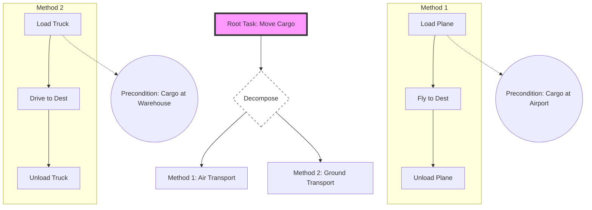

# Hierarchical Task Networks (HTN) and Partial-Order Planning

> **HTN Planning** is a domain-independent planning paradigm that generates plans by decomposing high-level "compound" tasks into increasingly simpler sub-tasks until a sequence of primitive actions is reached, while **Partial-Order Planning (POP)** avoids over-commitment by ordering actions only when necessary to resolve causal conflicts.

## 1. Historical Background & Motivation

The evolution of automated planning is a transition from "blind" search in state-spaces to "structured" search guided by domain knowledge. In the late 1960s, the STRIPS (Stanford Research Institute Problem Solver) system introduced the concept of representing actions via preconditions and effects. However, STRIPS suffered from the "Sussman Anomaly" and extreme state-space explosion when applied to complex, real-world problems. This led researchers to realize that humans do not plan by examining every possible atomic action sequence; rather, we plan hierarchically.

The concept of **Hierarchical Task Networks (HTN)** was pioneered by Earl Sacerdoti in the **NOAH** (Network of Action Hierarchies) system (1975) and later refined in **Nonlin** by Austin Tate. The core motivation was to encode "how" a task is accomplished, rather than just "what" the goal state looks like. By providing a library of standard operating procedures (methods), the search space is pruned significantly. Parallel to this, **Partial-Order Planning (POP)** emerged with systems like **UCPOP** (Universal Classical Partial-Order Planner), addressing the inefficiency of "Total-Order" planners that arbitrary chose an order for independent tasks, leading to unnecessary backtracking. Today, HTNs are the industry standard for non-player character (NPC) intelligence in AAA games (e.g., *F.E.A.R.*, *Horizon Zero Dawn*) and for high-level mission planning in autonomous robotics.

## 2. Visual Intuition
:::demo
<div style="background:#1e1e1e;padding:16px;border-radius:10px;color:#e5e7eb;font-family:system-ui,sans-serif">
  <h3 style="margin:0 0 8px 0;color:#7dd3fc">Hierarchical Task Networks (HTN) and Partial-Order Planning - Concept Map</h3>
  <svg width="100%" height="280" viewBox="0 0 640 280" role="img" aria-label="Hierarchical Task Networks (HTN) and Partial-Order Planning visual intuition" style="background:#111827;border-radius:8px">
    <rect x="24" y="28" width="180" height="64" rx="10" fill="#1d4ed8" />
    <text x="114" y="66" text-anchor="middle" fill="#e5e7eb" font-size="14">Problem</text>
    <rect x="230" y="28" width="180" height="64" rx="10" fill="#0f766e" />
    <text x="320" y="66" text-anchor="middle" fill="#e5e7eb" font-size="14">Process</text>
    <rect x="436" y="28" width="180" height="64" rx="10" fill="#7c3aed" />
    <text x="526" y="66" text-anchor="middle" fill="#e5e7eb" font-size="14">Outcome</text>

    <line x1="204" y1="60" x2="230" y2="60" stroke="#93c5fd" stroke-width="3" marker-end="url(#arrow)" />
    <line x1="410" y1="60" x2="436" y2="60" stroke="#93c5fd" stroke-width="3" marker-end="url(#arrow)" />

    <rect x="24" y="130" width="592" height="120" rx="10" fill="#0b1220" stroke="#334155" />
    <text x="320" y="156" text-anchor="middle" fill="#cbd5e1" font-size="14">Key intuition for Hierarchical Task Networks (HTN) and Partial-Order Planning</text>
    <text x="320" y="182" text-anchor="middle" fill="#94a3b8" font-size="12">Track state changes, constraints, and final behavior.</text>
    <text x="320" y="206" text-anchor="middle" fill="#94a3b8" font-size="12">Use this as a mental model before formal proofs or code.</text>

    <defs>
      <marker id="arrow" markerWidth="10" markerHeight="10" refX="8" refY="3" orient="auto">
        <polygon points="0 0, 10 3, 0 6" fill="#93c5fd" />
      </marker>
    </defs>
  </svg>
  <p style="margin-top:10px;color:#cbd5e1">Interactive-ready visual scaffold for the topic.</p>
</div>
:::
*Caption: This animation illustrates the recursive decomposition of a high-level task ("Build House") into sub-tasks ("Foundation", "Walls", "Roof"). Note how the planner explores different "Methods" to satisfy a task, backtracking if a specific method's preconditions are not met by the current world state.*

## 3. Core Theory & Mathematical Foundations

Planning involves finding a sequence of actions that transforms an initial state $s_0$ into a state $s_g$ that satisfies a goal formula. While classical planners search for a path from $s_0$ to $s_g$, HTN planners search for a way to "decompose" a high-level task network into a primitive task network.

### 3.1 Formal Definition of HTN
An HTN planning problem is a 5-tuple $P = (s_0, w, O, M, \mathcal{T})$, where:
- $s_0$: The initial state (a set of ground atoms).
- $w$: The initial task network to be accomplished.
- $O$: A set of operators (primitive actions).
- $M$: A set of methods (ways to decompose compound tasks).
- $\mathcal{T}$: The domain theory (predicates and logic).

**Task Networks:** A task network $w = (U, E)$ consists of a set of task nodes $U = \{t_1, t_2, \dots, t_n\}$ and a set of ordering constraints $E$ of the form $(t_i \prec t_j)$. If $E = \emptyset$, the tasks are unordered.

**Operators:** An operator $o \in O$ is defined as $(name(o), pre(o), eff^+(o), eff^-(o))$, where $pre$ are preconditions, and $eff^+$ and $eff^-$ are the add and delete lists (atomic changes to the world state).

**Methods:** A method $m \in M$ is a 3-tuple $(name(m), task(m), subtasks(m))$. It maps a compound task to a task network. A method $m$ is *applicable* to a task $t$ in state $s$ if $task(m)$ matches $t$ and the preconditions of $m$ are satisfied in $s$.

### 3.2 Partial-Order Planning (POP) Dynamics
In POP, we represent a plan as a 4-tuple $(\mathcal{A}, \mathcal{O}, \mathcal{L}, \mathcal{B})$:
1. $\mathcal{A}$: The set of actions in the plan.
2. $\mathcal{O}$: A set of ordering constraints $A_i \prec A_j$.
3. $\mathcal{L}$: A set of causal links $A_i \xrightarrow{p} A_j$, meaning $A_i$ achieves precondition $p$ for $A_j$.
4. $\mathcal{B}$: A set of binding constraints (for variables).

A key concept in POP is the **Threat**. A threat occurs if there is an action $A_k$ that could potentially occur between $A_i$ and $A_j$ and deletes the proposition $p$ required by the causal link $A_i \xrightarrow{p} A_j$.

### 3.3 Formal Analysis (Complexity / Correctness)

**HTN Complexity:**
HTN planning is significantly more expressive than STRIPS. In fact, if we allow recursive methods, HTN planning is **undecidable**. This is because HTN can be used to simulate a Context-Free Grammar (CFG) or even a Turing Machine by using task networks to represent the stack/tape.
- If recursion is forbidden: The problem is **NEXPTIME-complete**.
- If the domain is "totally ordered" (like SHOP2): The search is significantly faster, often $O(b^d)$ where $d$ is the depth of the decomposition tree.

**Correctness Proof Sketch:**
An HTN planner is *sound* if every generated plan is a valid sequence of primitive actions that can be executed from $s_0$. Since each decomposition step preserves the consistency of the state (by only allowing applicable methods), and the recursion terminates at primitive operators whose preconditions are satisfied, the resulting sequence is executable. *Completeness* depends on the search strategy (e.g., Breadth-First Decomposition).

## 4. Algorithm / Process (Step-by-Step)

The standard algorithm for HTN planning is **Total-Order Forward Decomposition (TFD)**, as used in the SHOP2 system.

1. **Initialization:** Start with the current state $s = s_0$ and the initial task network $W$.
2. **Task Selection:** Pick a task $t \in W$ that has no predecessors in the ordering constraints.
3. **Primitive Check:**
   - If $t$ is a primitive task (operator):
     - Check if $pre(t)$ is satisfied in $s$.
     - If yes, apply effects $s \leftarrow (s - eff^-(t)) \cup eff^+(t)$, remove $t$ from $W$, and move to next task.
     - If no, **backtrack**.
4. **Compound Check:**
   - If $t$ is a compound task:
     - Find all methods $m \in M$ such that $task(m) = t$.
     - For each method where $pre(m)$ is satisfied in $s$:
       - Replace $t$ in $W$ with the sub-task network defined in $subtasks(m)$.
       - Recursively attempt to solve the new $W$.
5. **Termination:** If $W$ is empty, return the sequence of operators applied. If all methods for a task fail, backtrack to the previous decision point.

## 5. Visual Diagram


*Caption: A high-level HTN decomposition showing branching between two methods. The planner selects a branch based on whether the preconditions (Airport vs Warehouse) are met in the current world state.*

## 6. Implementation

### 6.1 Core Implementation (Simple HTN Planner)

This Python implementation follows the SHOP-style forward decomposition.

```python
class HTNPlanner:
    def __init__(self):
        self.operators = {}
        self.methods = {}

    def declare_operator(self, name, pre_fn, eff_fn):
        """Registers a primitive action."""
        self.operators[name] = (pre_fn, eff_fn)

    def declare_method(self, task_name, method_fn):
        """Registers a way to decompose a compound task."""
        if task_name not in self.methods:
            self.methods[task_name] = []
        self.methods[task_name].append(method_fn)

    def solve(self, state, tasks):
        """
        Standard TFD (Total-order Forward Decomposition)
        state: Dict representing world atoms
        tasks: List of task names (total-ordered for simplicity)
        """
        if not tasks:
            return [] # Goal reached: plan is empty list of future actions

        current_task = tasks[0]
        remaining_tasks = tasks[1:]

        # Case 1: Primitive Task
        if current_task[0] in self.operators:
            op_name, args = current_task[0], current_task[1:]
            pre_fn, eff_fn = self.operators[op_name]
            
            if pre_fn(state, *args):
                new_state = eff_fn(state.copy(), *args)
                result = self.solve(new_state, remaining_tasks)
                if result is not None:
                    return [(op_name, args)] + result
            return None # Backtrack

        # Case 2: Compound Task
        if current_task[0] in self.methods:
            task_name, args = current_task[0], current_task[1:]
            for method in self.methods[task_name]:
                subtasks = method(state, *args)
                if subtasks is not None:
                    # Prepend subtasks to the task queue
                    result = self.solve(state, subtasks + remaining_tasks)
                    if result is not None:
                        return result
            return None # No method worked

        return None

# --- Example Usage: Logistics Domain ---
planner = HTNPlanner()

# Operators
planner.declare_operator('load_truck', 
    lambda s, obj, loc: s.get(f'at_{obj}') == loc and s.get(f'at_truck') == loc,
    lambda s, obj, loc: {**s, f'at_{obj}': 'truck'})

planner.declare_operator('drive',
    lambda s, f, t: s.get('at_truck') == f,
    lambda s, f, t: {**s, 'at_truck': t})

# Methods
def transport_method(state, obj, dest):
    loc = state.get(f'at_{obj}')
    if loc == dest: return [] # Already there
    return [('load_truck', obj, loc), ('drive', loc, dest)]

planner.declare_method('transport', transport_method)

# Execute
initial_state = {'at_package': 'A', 'at_truck': 'A'}
plan = planner.solve(initial_state, [('transport', 'package', 'B')])
print(f"Generated Plan: {plan}")
# Expected Output: [('load_truck', ('package', 'A')), ('drive', ('A', 'B'))]
```

### 6.2 Optimized / Production Variant

In production systems (like the JSHOP2 compiler), we don't just use Python lambdas. We use **unification** and **backtracking generators**.

```python
def find_satisfiers(state, precondition_literals):
    """
    Uses unification to find all variable bindings that satisfy preconditions.
    In a real system, this involves a logic engine (like Prolog-lite).
    """
    # Optimized: Use indexing on literals to avoid O(N) scan of world state
    pass

class OptimizedHTN:
    def search(self, state, tasks, plan):
        # Implementation uses a stack-based approach instead of recursion
        # to avoid RecursionLimit issues in deep task trees.
        stack = [(state, tasks, plan)]
        while stack:
            # ... iterative state management ...
            pass
```

### 6.3 Common Pitfalls in Code
- **Infinite Recursion:** If a method for task $A$ produces sub-task $A$ without changing the state, the planner loops. **Fix:** Implement a depth limit or state-memoization.
- **State Mutation:** Beginners often mutate the `state` dictionary directly. **Fix:** Always pass a copy or use persistent data structures (like `clojure.lang.PersistentHashMap`).
- **Ordering Constraints:** Ignoring the partial-order nature of sub-tasks. **Fix:** Use a Directed Acyclic Graph (DAG) for the task network rather than a simple list.

## 7. Interactive Demo

:::demo
<!-- title: HTN Task Decomposition Visualizer -->
<!DOCTYPE html>
<html>
<head>
<style>
  body { margin:0; background:#0f1117; color:#e5e7eb; font-family: monospace; padding:10px; }
  #canvas { border: 1px solid #334155; width: 100%; height: 300px; display: block; }
  .controls { margin-top: 10px; display: flex; gap: 10px; }
  button { background: #3b82f6; border: none; color: white; padding: 5px 10px; cursor: pointer; border-radius: 4px; }
  button:hover { background: #2563eb; }
  .log { height: 80px; overflow-y: auto; background: #000; padding: 5px; font-size: 11px; margin-top: 10px; border: 1px solid #333; }
</style>
</head>
<body>
  <canvas id="canvas"></canvas>
  <div class="controls">
    <button onclick="startDecomposition()">Decompose Root Task</button>
    <button onclick="resetDemo()">Reset</button>
  </div>
  <div id="log" class="log">Ready...</div>

<script>
  const canvas = document.getElementById('canvas');
  const ctx = canvas.getContext('2d');
  const logDiv = document.getElementById('log');
  
  let nodes = [];
  let connections = [];
  
  function log(msg) {
    logDiv.innerHTML += `> ${msg}<br>`;
    logDiv.scrollTop = logDiv.scrollHeight;
  }

  function drawNode(x, y, label, type) {
    ctx.fillStyle = type === 'compound' ? '#8b5cf6' : '#10b981';
    ctx.beginPath();
    ctx.roundRect(x - 50, y - 15, 100, 30, 5);
    ctx.fill();
    ctx.fillStyle = 'white';
    ctx.textAlign = 'center';
    ctx.fillText(label, x, y + 5);
  }

  function draw() {
    ctx.clearRect(0, 0, canvas.width, canvas.height);
    connections.forEach(c => {
      ctx.strokeStyle = '#475569';
      ctx.beginPath();
      ctx.moveTo(c.x1, c.y1 + 15);
      ctx.lineTo(c.x2, c.y2 - 15);
      ctx.stroke();
    });
    nodes.forEach(n => drawNode(n.x, n.y, n.label, n.type));
  }

  function resetDemo() {
    nodes = [{ x: 200, y: 40, label: 'BuildHouse', type: 'compound' }];
    connections = [];
    logDiv.innerHTML = 'Reset.';
    draw();
  }

  async function startDecomposition() {
    log("Starting decomposition of 'BuildHouse'...");
    
    // Level 1
    await sleep(800);
    const sub1 = [
        { x: 100, y: 120, label: 'Foundations', type: 'primitive' },
        { x: 200, y: 120, label: 'Structure', type: 'compound' },
        { x: 300, y: 120, label: 'Roof', type: 'primitive' }
    ];
    nodes.push(...sub1);
    sub1.forEach(s => connections.push({ x1: 200, y1: 40, x2: s.x, y2: s.y }));
    log("Decomposed into: Foundations, Structure, Roof");
    draw();

    // Level 2
    await sleep(1000);
    const sub2 = [
        { x: 150, y: 200, label: 'Walls', type: 'primitive' },
        { x: 250, y: 200, label: 'Windows', type: 'primitive' }
    ];
    nodes.push(...sub2);
    sub2.forEach(s => connections.push({ x1: 200, y1: 120, x2: s.x, y2: s.y }));
    log("Decomposed 'Structure' into: Walls, Windows");
    draw();
    
    log("Final Plan: [Foundations, Walls, Windows, Roof]");
  }

  function sleep(ms) { return new Promise(resolve => setTimeout(resolve, ms)); }
  
  canvas.width = 400;
  canvas.height = 300;
  resetDemo();
</script>
</body>
</html>
:::

## 8. Worked Examples

### Example 1 — Robotics: Service Domain
**Problem:** Robot must serve a cup of coffee to a guest in the lounge.
- **Initial State:** `at(Robot, Kitchen)`, `has(Robot, Nothing)`, `at(Guest, Lounge)`.
- **Compound Task:** `ServeCoffee(Guest)`.
- **Method 1:** `ServeCoffee(g)`
  - **Sub-tasks:** `Navigate(Kitchen)`, `PickUp(Coffee)`, `Navigate(loc(g))`, `HandOver(Coffee, g)`.

**Step-by-Step Execution:**
1. **Selection:** `ServeCoffee(Guest)` is the only task.
2. **Decomposition:** Method 1 matches. Sub-tasks are added to the network.
3. **Task 1:** `Navigate(Kitchen)`. Robot is already at Kitchen. Operator `Navigate` has precondition `at(R, loc)`. Condition met. Effect: None (already there).
4. **Task 2:** `PickUp(Coffee)`. Operator `PickUp(item)` requires `at(R, loc_of_item)`. Condition met. Effect: `has(Robot, Coffee)`.
5. **Task 3:** `Navigate(Lounge)`. Precondition: `at(R, x)`. Met. Effect: `at(Robot, Lounge)`.
6. **Task 4:** `HandOver(Coffee, Guest)`. Precondition: `at(R, Lounge)` and `has(R, Coffee)`. Both met.
7. **Success:** Return sequence `[PickUp, Navigate, HandOver]`.

### Example 2 — POP Conflict (The "Sussman Anomaly")
Consider building a tower where Block A is on the table, and Block B is on the table, but the goal is `On(A, B)` and `On(B, C)`.
In POP, if we add a causal link $A_1 \xrightarrow{On(A,B)} A_{Goal}$, and another action $A_2$ deletes $On(A,B)$, $A_2$ is a **threat**. 
**Resolution:**
- **Promotion:** Force $A_2 \prec A_1$.
- **Demotion:** Force $A_{Goal} \prec A_2$ (impossible here, as $A_{Goal}$ is the last step).
The POP algorithm forces the ordering of blocks $C$ then $B$ then $A$ only when it detects that putting $B$ on $C$ would "threaten" the space needed for $A$.

## 9. Comparison with Alternatives

| Approach | Complexity | Search Strategy | Pros | Cons | Best Used When |
|---|---|---|---|---|---|
| **STRIPS** | PSPACE-complete | State-space search | Simple, no domain knowledge needed | Severe state explosion | Small, simple domains |
| **HTN** | Undecidable* | Task decomposition | Prunes search, encodes expertise | High "Knowledge Engineering" cost | Games, complex robotics |
| **POP** | PSPACE-complete | Plan-space search | Handles concurrency, least commitment | Hard to implement efficiently | Manufacturing, multi-agent |
| **MCTS** | P-complete | Stochastic simulation | No heuristics needed | Not guaranteed to find optimal | Games like Go, Chess |

## 10. Industry Applications & Real Systems

- **NASA (Remote Agent)**: Used on the Deep Space 1 mission. It combined POP and HTN techniques to allow the spacecraft to plan its own activities (like engine burns and imaging) while managing limited power and data resources.
- **Monolith Productions (F.E.A.R.)**: Revolutionized Game AI by using HTNs (specifically Goal-Oriented Action Planning - GOAP, a subset). This allowed NPCs to take cover, flush out players with grenades, and retreat, appearing remarkably intelligent.
- **Logistics (Bridge Planning)**: Large-scale civil engineering projects use HTN-like scheduling to manage the thousands of sub-tasks (pouring concrete, ordering steel) where specific sequences are mandatory but others can happen in parallel.
- **Autonomous Driving (Waymo/Tesla)**: High-level tactical planning (e.g., "Overtake car", "Make left turn at intersection") is often modeled as a hierarchy of tasks to ensure safety constraints are met before executing low-level steering commands.

## 11. Practice Problems

### 🟢 Easy
1. **Recursive Depth**: Given a compound task `CleanRoom` that decomposes into `PickUpToys` and then `CleanRoom` again (if the floor is still dirty), what is the risk to the planner? How can you prevent a stack overflow?
   *Hint: Consider state-based termination conditions.*
   *Expected complexity: O(D) where D is max recursion depth.*

### 🟡 Medium
2. **POP Threat Resolution**: An agent is planning to "Paint the Floor" and "Walk to Door".
   - Causal Link: `Start -> [PaintFloor] -> FloorPainted`.
   - Action `WalkToDoor` has an effect `~FloorPainted` (it ruins the paint).
   Identify the threat and explain how "Promotion" would solve this.
   *Hint: Ordering matters.*

3. **HTN vs STRIPS**: Design a simple domain for a "Smart Toaster". Show how the STRIPS representation differs from an HTN method for "MakeToast".

### 🔴 Hard
4. **Undecidability Proof**: Sketch a proof showing that an HTN planner can simulate a Context-Free Grammar.
   *Hint: Map non-terminals to compound tasks and terminals to primitive tasks.*

5. **Advanced POP**: Implement a "Least Commitment" constraint solver for a set of 5 actions with 2 overlapping resource requirements. Show the resulting partial order.

## 12. Interactive Quiz

:::quiz
**Q1: What is the primary difference between HTN and STRIPS planning?**
- A) STRIPS is faster but less accurate.
- B) HTN focuses on decomposing tasks; STRIPS focuses on searching state-space.
- C) HTN is only for robotics; STRIPS is only for games.
- D) There is no difference; HTN is a flavor of STRIPS.
> B — HTN utilizes a hierarchy of tasks to guide the search, whereas STRIPS relies purely on the goal state and action preconditions.

**Q2: In Partial-Order Planning, what defines a "Threat"?**
- A) An action that takes too long to execute.
- B) An action that deletes a precondition for another action in a causal link.
- C) A state that cannot be reached.
- D) A task that has no decomposition methods.
> B — A threat occurs when an action's effect contradicts a proposition protected by an existing causal link.

**Q3: Why is HTN planning considered undecidable in its most general form?**
- A) Because the state space is infinite.
- B) Because recursive methods can simulate the production rules of a grammar.
- C) Because it uses floating-point math.
- D) Because of the Halting Problem in Python.
> B — Recursion allows HTN to represent context-free and even recursively enumerable languages, making it equivalent to a Turing machine.

**Q4: Which concept describes the POP philosophy of not ordering actions unless necessary?**
- A) Greedy Search.
- B) Breadth-First Expansion.
- C) Least Commitment.
- D) Early Binding.
> C — "Least Commitment" means we don't commit to a total ordering of actions until we absolutely have to (e.g., to resolve a threat).

**Q5: In the TFD algorithm, what happens if no method's preconditions are met for a compound task?**
- A) The planner crashes.
- B) The planner skips the task.
- C) The planner backtracks to the previous task or method choice.
- D) The planner converts the task to a primitive one.
> C — TFD is a search-based algorithm; failure at any branch triggers backtracking to explore alternative decompositions.
:::

## 13. Interview Preparation

### Conceptual Questions
**Q: Explain HTN planning as if teaching it to a fellow engineer.**
*A: HTN planning is essentially "Top-Down" problem solving. Instead of the planner trying to figure out that it needs to 'open the door' then 'walk through' then 'close the door' to move rooms, we give it a 'Navigate' method. This method explicitly says: 'To move from A to B, do these three things.' It encodes expert knowledge directly into the search process, making it much more efficient than searching from scratch.*

**Q: What are the time and space complexities? Derive them.**
*A: For non-recursive HTNs, the complexity is NEXPTIME-complete. Space complexity is proportional to the depth of the decomposition tree $O(D)$. If recursion is allowed, it becomes undecidable because the task network can grow infinitely, representing a stack in a pushdown automaton.*

**Q: How would you choose between HTN and a pathfinder like A*?**
*A: A* is for low-level spatial navigation (finding a path through a grid). HTN is for high-level logic (deciding to go to the store, then buy eggs, then cook). In a real system, you'd use both: the HTN decides the next high-level location, and A* calculates the specific path to get there.*

### Quick Reference (Cheat Sheet)
| Property | Value |
|---|---|
| Main Goal | Decompose Task Network |
| Search Type | Plan-space or Task-space |
| Recursive? | Yes (leads to undecidability) |
| Least Commitment | Key feature of POP |
| Used In | F.E.A.R., NASA, Robotics |

## 14. Key Takeaways
1. **Hierarchical structure** mirrors human planning and prunes massive search spaces.
2. **Domain knowledge** (Methods) is required to make HTNs effective.
3. **Partial-Order Planning** avoids unnecessary ordering, reducing backtracking.
4. **Causal Links** are the primary mechanism for ensuring plan validity in POP.
5. **HTN is powerful** but requires significant "Knowledge Engineering" compared to blind search.
6. **Undecidability** is a theoretical risk with recursive HTN definitions.

## 15. Common Misconceptions
- ❌ **HTN is just a State-Space Search** → ✅ HTN is a **Task-Space Search**. It searches the space of possible task decompositions, not just world states.
- ❌ **POP always finds the shortest plan** → ✅ POP finds *a* valid plan. It doesn't guarantee optimality unless augmented with a cost-aware heuristic.
- ❌ **Planning and RL (Reinforcement Learning) are the same** → ✅ Planning is **model-based** (we know the rules); RL is often **model-free** (we learn the rules by trial and error).

## 16. Further Reading
- *Automated Planning: Theory and Practice* (Ghallab, Nau, Traverso) — The "Bible" of AI planning.
- *Artificial Intelligence: A Modern Approach* (Russell & Norvig), Chapter 11.
- *SHOP2: An HTN Planning System* (Nau et al., 2003) — The seminal paper on modern HTN.
- *The STRIPS Case Study* (Sacerdoti) — Historical context on why we moved to hierarchies.

## 17. Related Topics
- [[heuristic-design]] — Creating heuristics to guide task selection.
- [[temporal-logic]] — Expressing constraints over time in plans.
- [[monte-carlo-tree-search]] — A modern alternative for planning in uncertain environments.
- [[arc-consistency]] — Used in the constraint satisfaction part of POP.
