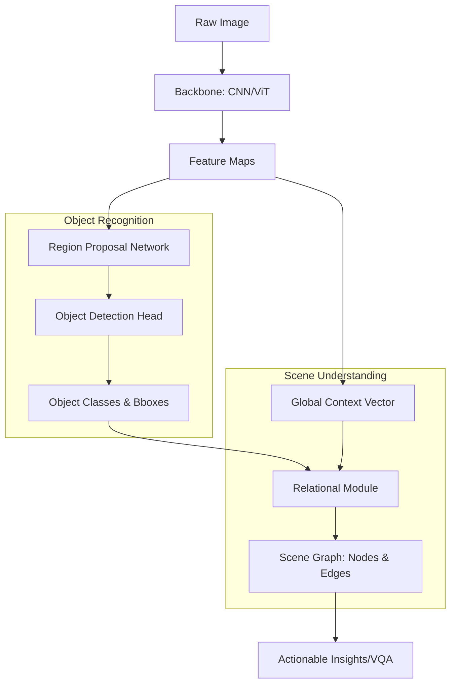

# Image Recognition and Scene Understanding Pipelines

> **Image Recognition and Scene Understanding** is the hierarchical process of transforming raw high-dimensional pixel data into structured semantic representations, progressing from local feature detection to global object classification and the relational mapping of entities within a 3D or 2D space.

## 1. Historical Background & Motivation

The quest for machine vision began with the "Summer Vision Project" at MIT in 1966, where Seymour Papert famously assigned the task of "linking a camera to a computer and having it describe what it sees" as a summer project for an undergraduate. Decades of research revealed that vision is not a simple "inverse graphics" problem but a deeply complex task involving the resolution of the **Semantic Gap**—the disconnect between the low-level pixel intensities (0–255) and the high-level concepts (e.g., "a golden retriever catching a frisbee in a park").

Initially, the field relied on hand-crafted descriptors like **SIFT (Scale-Invariant Feature Transform)** and **HOG (Histogram of Oriented Gradients)** combined with shallow classifiers like Support Vector Machines (SVMs). This paradigm shifted dramatically in 2012 with the "AlexNet" moment, where deep Convolutional Neural Networks (CNNs) leveraged GPU acceleration and massive datasets (ImageNet) to achieve unprecedented accuracy. Modern pipelines have evolved beyond simple classification to **Scene Understanding**, which incorporates object detection, instance segmentation, and **Scene Graph Generation (SGG)** to model the relationships between objects, effectively providing machines with a "common sense" understanding of visual contexts.

## 2. Visual Intuition
:::demo
<div style="background:#1e1e1e;padding:16px;border-radius:10px;color:#e5e7eb;font-family:system-ui,sans-serif">
  <h3 style="margin:0 0 8px 0;color:#7dd3fc">Image Recognition and Scene Understanding Pipelines - Concept Map</h3>
  <svg width="100%" height="280" viewBox="0 0 640 280" role="img" aria-label="Image Recognition and Scene Understanding Pipelines visual intuition" style="background:#111827;border-radius:8px">
    <rect x="24" y="28" width="180" height="64" rx="10" fill="#1d4ed8" />
    <text x="114" y="66" text-anchor="middle" fill="#e5e7eb" font-size="14">Problem</text>
    <rect x="230" y="28" width="180" height="64" rx="10" fill="#0f766e" />
    <text x="320" y="66" text-anchor="middle" fill="#e5e7eb" font-size="14">Process</text>
    <rect x="436" y="28" width="180" height="64" rx="10" fill="#7c3aed" />
    <text x="526" y="66" text-anchor="middle" fill="#e5e7eb" font-size="14">Outcome</text>

    <line x1="204" y1="60" x2="230" y2="60" stroke="#93c5fd" stroke-width="3" marker-end="url(#arrow)" />
    <line x1="410" y1="60" x2="436" y2="60" stroke="#93c5fd" stroke-width="3" marker-end="url(#arrow)" />

    <rect x="24" y="130" width="592" height="120" rx="10" fill="#0b1220" stroke="#334155" />
    <text x="320" y="156" text-anchor="middle" fill="#cbd5e1" font-size="14">Key intuition for Image Recognition and Scene Understanding Pipelines</text>
    <text x="320" y="182" text-anchor="middle" fill="#94a3b8" font-size="12">Track state changes, constraints, and final behavior.</text>
    <text x="320" y="206" text-anchor="middle" fill="#94a3b8" font-size="12">Use this as a mental model before formal proofs or code.</text>

    <defs>
      <marker id="arrow" markerWidth="10" markerHeight="10" refX="8" refY="3" orient="auto">
        <polygon points="0 0, 10 3, 0 6" fill="#93c5fd" />
      </marker>
    </defs>
  </svg>
  <p style="margin-top:10px;color:#cbd5e1">Interactive-ready visual scaffold for the topic.</p>
</div>
:::
*Caption: A typical Convolutional Neural Network (CNN) architecture showing the hierarchical extraction of features—from low-level edges in the initial layers to complex semantic parts and whole objects in the final layers.*

## 3. Core Theory & Mathematical Foundations

### 3.1 The Convolutional Operation
The fundamental building block of image recognition is the discrete 2D convolution. Given an image $I$ and a kernel $K$ of size $m \times n$, the output feature map $S(i, j)$ is computed as:

$$S(i, j) = (I * K)(i, j) = \sum_{m} \sum_{n} I(i+m, j+n) K(m, n)$$

In practice, neural networks use **cross-correlation** (convolution without flipping the kernel), as the kernel weights are learned through backpropagation. The output dimensions of a convolutional layer, given input width $W$, kernel size $K$, padding $P$, and stride $S$, is defined by:

$$W_{out} = \lfloor \frac{W - K + 2P}{S} \rfloor + 1$$

### 3.2 Feature Hierarchies and Receptive Fields
The **receptive field** is the specific region of the input image that affects a particular neuron's activation. As we stack layers, the receptive field grows linearly with the number of layers but exponentially with strided convolutions. If $R_l$ is the receptive field of layer $l$, and $k_l, s_l$ are the kernel size and stride:

$$R_l = R_{l-1} + (k_l - 1) \prod_{i=1}^{l-1} s_i$$

This allows the network to learn local textures (edges, blobs) in early layers and global structures (faces, cars) in deeper layers.

### 3.3 From Recognition to Scene Graphs
Scene understanding involves mapping an image to a graph $G = (V, E)$, where $V$ is a set of objects (nodes) with class labels and bounding boxes, and $E$ is a set of directed edges representing predicates (e.g., "riding," "near," "part of").

The probability of a scene graph $G$ given image $I$ is modeled as:
$$P(G | I) = \prod_{i \in V} P(v_i | I) \prod_{j \in E} P(e_j | v_{source}, v_{target}, I)$$

This requires the model to not only recognize objects but to extract the **visual context** necessary to disambiguate relationships (e.g., distinguishing between "person holding umbrella" and "umbrella covering person").

### 3.4 Formal Analysis: Complexity and Invariance
*   **Time Complexity:** For an image of size $H \times W$ and $C_{in}$ channels, with $N$ filters of size $K \times K$, the complexity of a single conv layer is $O(H \cdot W \cdot C_{in} \cdot N \cdot K^2)$.
*   **Space Complexity:** Dominated by the weights $O(K^2 \cdot C_{in} \cdot N)$ and the activations stored for backpropagation $O(H \cdot W \cdot N)$.
*   **Translation Equivariance:** Convolutions are naturally equivariant to translation, meaning $f(Translate(x)) = Translate(f(x))$. However, they are not inherently invariant to rotation or scale, which necessitates data augmentation or specialized architectures like Spatial Transformer Networks.

## 4. Algorithm / Process (Step-by-Step)

The standard pipeline for Scene Understanding follows these steps:

1.  **Preprocessing:** Normalize pixel values to $[0, 1]$ or $[-1, 1]$ and resize to a fixed resolution (e.g., 224x224 or 640x640).
2.  **Feature Backbone:** Pass the image through a "backbone" (e.g., ResNet, EfficientNet, or Vision Transformer) to extract high-level feature maps.
3.  **Region Proposal (for Detection):** Use a Region Proposal Network (RPN) or a dense grid to identify potential bounding boxes (Regions of Interest - RoIs).
4.  **Classification and Localization:** For each RoI, predict:
    *   $C$ class probabilities via Softmax.
    *   4 bounding box offsets $(\Delta x, \Delta y, \Delta w, \Delta h)$ relative to anchors.
5.  **Non-Maximum Suppression (NMS):** Filter overlapping boxes by keeping only those with the highest confidence scores among candidates with an Intersection over Union (IoU) above a threshold.
6.  **Relational Inference:** Pass the detected object features into a Message Passing Neural Network (MPNN) or a Transformer decoder to predict predicates between pairs of objects.
7.  **Graph Construction:** Assemble the final Scene Graph for downstream tasks like Visual Question Answering (VQA).

## 5. Visual Diagram


*Caption: The flow from raw pixels to a structured scene graph, distinguishing between simple object recognition and higher-level relational understanding.*

## 6. Implementation

### 6.1 Core Implementation: Basic Convolutional Block
A production-grade implementation of a basic residual block used in vision backbones.

```python
import torch
import torch.nn as nn
import torch.nn.functional as F

class ResidualBlock(nn.Module):
    """
    Standard Residual Block as seen in ResNet.
    Purpose: Allows gradients to flow through deep networks using skip connections.
    Complexity: O(H * W * C^2)
    """
    def __init__(self, in_channels, out_channels, stride=1):
        super(ResidualBlock, self).__init__()
        self.conv1 = nn.Conv2d(in_channels, out_channels, kernel_size=3, 
                               stride=stride, padding=1, bias=False)
        self.bn1 = nn.BatchNorm2d(out_channels)
        self.conv2 = nn.Conv2d(out_channels, out_channels, kernel_size=3, 
                               stride=1, padding=1, bias=False)
        self.bn2 = nn.BatchNorm2d(out_channels)
        
        # Shortcut connection to match dimensions if stride > 1
        self.shortcut = nn.Sequential()
        if stride != 1 or in_channels != out_channels:
            self.shortcut = nn.Sequential(
                nn.Conv2d(in_channels, out_channels, kernel_size=1, stride=stride, bias=False),
                nn.BatchNorm2d(out_channels)
            )

    def forward(self, x):
        out = F.relu(self.bn1(self.conv1(x)))
        out = self.bn2(self.conv2(out))
        out += self.shortcut(x) # The Skip Connection
        out = F.relu(out)
        return out

# Sample Input: Batch=1, Channels=64, Height=56, Width=56
# sample_input = torch.randn(1, 64, 56, 56)
# model = ResidualBlock(64, 128, stride=2)
# output = model(sample_input) 
# Resulting Shape: [1, 128, 28, 28]
```

### 6.2 Production Variant: Vision Transformer (ViT) Patch Embedding
Modern pipelines increasingly use Transformers for better global context.

```python
class PatchEmbedding(nn.Module):
    """
    Converts an image into a sequence of patches for Transformer processing.
    This replaces the traditional convolutional backbone.
    """
    def __init__(self, img_size=224, patch_size=16, in_ch=3, embed_dim=768):
        super().__init__()
        self.num_patches = (img_size // patch_size) ** 2
        # Use a conv layer to extract patches and project to embed_dim simultaneously
        self.proj = nn.Conv2d(in_ch, embed_dim, kernel_size=patch_size, stride=patch_size)

    def forward(self, x):
        # x: [B, 3, 224, 224]
        x = self.proj(x) # [B, embed_dim, 14, 14]
        x = x.flatten(2) # [B, embed_dim, 196]
        x = x.transpose(1, 2) # [B, 196, embed_dim]
        return x
```

### 6.3 Common Pitfalls in Code
1.  **Ignoring the Receptive Field:** Designing a network with too few layers for high-resolution images, causing the model to never "see" the whole object.
2.  **Data Leakage in Augmentation:** Applying augmentations like horizontal flips to classes where orientation matters (e.g., "stop" signs or digit recognition).
3.  **Incorrect Coordinate Scaling:** When using object detectors, forgetting to rescale bounding box coordinates when resizing images during inference.

## 7. Interactive Demo

:::demo
<!-- title: Kernel Convolution Visualizer -->
<!DOCTYPE html>
<html>
<head>
<style>
  body { background:#0f1117; color:#eee; font-family: monospace; }
  .grid-container { display: flex; gap: 20px; align-items: center; justify-content: center; margin-top: 20px; }
  .matrix { display: grid; grid-template-columns: repeat(5, 30px); gap: 2px; }
  .cell { width: 30px; height: 30px; border: 1px solid #444; display: flex; align-items: center; justify-content: center; font-size: 10px; }
  .kernel-matrix { display: grid; grid-template-columns: repeat(3, 40px); gap: 2px; }
  .kernel-cell { width: 40px; height: 40px; border: 1px solid #00ff00; background: #1a331a; display: flex; align-items: center; justify-content: center; }
  .highlight { background: #3b82f6; }
  .active-kernel { border: 2px solid #00ff00; box-shadow: 0 0 10px #00ff00; }
  .controls { text-align: center; margin-bottom: 20px; }
  button { padding: 8px 16px; cursor: pointer; background: #3b82f6; border: none; color: white; border-radius: 4px; }
</style>
</head>
<body>
  <div class="controls">
    <h3>2D Convolution (3x3 Kernel on 5x5 Image)</h3>
    <button onclick="step()">Next Step</button>
    <button onclick="reset()">Reset</button>
    <div id="status">Status: Ready</div>
  </div>
  <div class="grid-container">
    <div>
      <p>Input Image (I)</p>
      <div id="input-grid" class="matrix"></div>
    </div>
    <div>
      <p>Kernel (K)</p>
      <div id="kernel-grid" class="kernel-matrix"></div>
    </div>
    <div>
      <p>Output Map (S)</p>
      <div id="output-grid" class="matrix" style="grid-template-columns: repeat(3, 30px);"></div>
    </div>
  </div>

<script>
  const inputData = [
    1, 1, 1, 0, 0,
    0, 1, 1, 1, 0,
    0, 0, 1, 1, 1,
    0, 0, 1, 1, 0,
    0, 1, 1, 0, 0
  ];
  const kernel = [
    1, 0, 1,
    0, 1, 0,
    1, 0, 1
  ];
  let currentIdx = 0;

  function init() {
    const inputGrid = document.getElementById('input-grid');
    const kernelGrid = document.getElementById('kernel-grid');
    const outputGrid = document.getElementById('output-grid');
    
    inputGrid.innerHTML = inputData.map(v => `<div class="cell">${v}</div>`).join('');
    kernelGrid.innerHTML = kernel.map(v => `<div class="kernel-cell">${v}</div>`).join('');
    outputGrid.innerHTML = Array(9).fill(0).map(() => `<div class="cell">?</div>`).join('');
  }

  function step() {
    if (currentIdx >= 9) return;
    const row = Math.floor(currentIdx / 3);
    const col = currentIdx % 3;
    
    // Clear previous highlights
    document.querySelectorAll('.cell').forEach(c => c.classList.remove('highlight'));
    
    // Highlight input window
    let sum = 0;
    const inputCells = document.getElementById('input-grid').children;
    for(let i=0; i<3; i++) {
      for(let j=0; j<3; j++) {
        const idx = (row + i) * 5 + (col + j);
        inputCells[idx].classList.add('highlight');
        sum += inputData[idx] * kernel[i*3 + j];
      }
    }
    
    const outputCells = document.getElementById('output-grid').children;
    outputCells[currentIdx].innerText = sum;
    outputCells[currentIdx].classList.add('highlight');
    
    document.getElementById('status').innerText = `Step ${currentIdx + 1}: Calculated sum = ${sum}`;
    currentIdx++;
  }

  function reset() {
    currentIdx = 0;
    init();
    document.getElementById('status').innerText = "Status: Reset";
  }

  init();
</script>
</body>
</html>
:::

## 8. Worked Examples

### Example 1: Output Dimension Calculation
**Problem:** You have a $224 \times 224 \times 3$ image. You apply a $7 \times 7$ convolutional layer with a stride of $2$ and padding of $3$. How many parameters are in this layer if there are $64$ filters, and what is the output volume?

**Solution:**
1.  **Output Dimensions:**
    $$W_{out} = \frac{224 - 7 + 2(3)}{2} + 1 = \frac{223}{2} + 1 = 111.5 + 1 \rightarrow 112$$
    Output volume: $112 \times 112 \times 64$.
2.  **Parameters:**
    Each filter has $7 \times 7 \times 3$ weights $+ 1$ bias.
    Total = $64 \times (147 + 1) = 64 \times 148 = 9,472$ parameters.

### Example 2: Intersection over Union (IoU) Calculation
**Problem:** In an object detection task, the ground truth box is $B_{gt} = [10, 10, 50, 50]$ (xmin, ymin, xmax, ymax). The prediction is $B_p = [20, 20, 60, 60]$. Calculate the IoU.

**Solution:**
1.  **Intersection Area:**
    $x_{left} = \max(10, 20) = 20, y_{top} = \max(10, 20) = 20$
    $x_{right} = \min(50, 60) = 50, y_{bottom} = \min(50, 60) = 50$
    Intersection Width = $50-20=30$, Height = $50-20=30$. Area = $900$.
2.  **Union Area:**
    Area($B_{gt}$) = $(50-10) \times (50-10) = 1600$.
    Area($B_p$) = $(60-20) \times (60-20) = 1600$.
    Union = $1600 + 1600 - 900 = 2300$.
3.  **IoU:**
    $IoU = 900 / 2300 \approx 0.391$.
    *If the threshold is 0.5, this prediction is a False Positive.*

## 9. Comparison with Alternatives

| Approach | Feature Extraction | Global Context | Computational Cost | Best Used When |
| :--- | :--- | :--- | :--- | :--- |
| **Traditional (SIFT+SVM)** | Hand-crafted | Low | Very Low | Edge devices with zero training data. |
| **Standard CNN (ResNet)** | Learned Hierarchical | Medium (local) | Moderate | General image classification. |
| **Vision Transformer (ViT)** | Self-Attention | High (global) | High | Large datasets, complex scenes. |
| **Two-Stage Detectors** | RoI-based | High | High (slow) | Precision is critical (Medical). |
| **One-Stage (YOLO)** | Dense Grids | Medium | Low (fast) | Real-time (Robotics, Video). |

## 10. Industry Applications & Real Systems

*   **Tesla Autopilot:** Uses a "HydraNet" architecture where a shared backbone extracts features from 8 cameras, feeding into multiple heads for object detection, lane segmentation, and depth estimation.
*   **Pinterest Visual Search:** Utilizes deep embeddings to map billions of images into a latent space where "Visual Similar" images can be retrieved using K-Nearest Neighbors (KNN).
*   **Meta (Facebook) Content Moderation:** Deploys pipelines that combine Image Recognition with Scene Understanding to detect prohibited content and understand the context of an image (e.g., distinguishing between a medical photo and gore).
*   **Amazon Go (Just Walk Out):** Relies on a massive scene understanding pipeline that tracks people (instance segmentation) and their interactions with items (relation detection) in a 3D environment.

## 11. Practice Problems

### 🟢 Easy
1. **Receptive Field Growth:** If you have three layers of $3 \times 3$ convolutions with stride $1$ and no padding, what is the receptive field of a neuron in the third layer?
   *Hint: Each layer adds $(k-1)$ to the receptive field if stride is $1$.*
   *Expected: $7 \times 7$.*

### 🟡 Medium
2. **Convolutional Memory:** Calculate the memory (in MB) required to store the activations for a single $224 \times 224$ image passing through a layer with $128$ filters, assuming 32-bit floats.
   *Hint: Memory = $H \times W \times C \times 4$ bytes.*
   *Expected: $\approx 24.5$ MB.*

3. **Invariance Test:** Does a standard Max-Pooling layer provide rotation invariance? Explain why or why not.
   *Hint: Consider a 90-degree rotation of a $2 \times 2$ block.*

### 🔴 Hard
4. **Softmax Derivation:** Prove that the derivative of the Softmax cross-entropy loss with respect to the input logits $z_i$ is $\frac{\partial L}{\partial z_i} = \hat{y}_i - y_i$.
   *Expected complexity: Calculus derivation.*

5. **NMS Algorithm:** Write a pseudocode for Non-Maximum Suppression that runs in $O(N^2)$ where $N$ is the number of proposed boxes. Can you optimize it to $O(N \log N)$?

## 12. Interactive Quiz

:::quiz
**Q1: Which component of a CNN is primarily responsible for translation equivariance?**
- A) Fully Connected Layer
- B) Max Pooling Layer
- C) Convolutional Layer
- D) Dropout Layer
> C — The same filter is slid across the entire image, ensuring that a feature detected at one location will result in the same activation if moved elsewhere.

**Q2: What is the primary purpose of "Residual Connections" (Skip Connections)?**
- A) To reduce the number of parameters
- B) To mitigate the vanishing gradient problem in deep networks
- C) To increase the receptive field size
- D) To perform dimensionality reduction
> B — By providing a linear identity path, gradients can flow through the network without being repeatedly multiplied by small weights.

**Q3: In Object Detection, what does the "mAP" metric represent?**
- A) Maximum Absolute Precision
- B) Mean Average Precision
- C) Minimum Area Probability
- D) Median Average Pooling
> B — mAP is the standard metric that averages the area under the Precision-Recall curve across all classes.

**Q4: Which architecture is most likely to capture long-range dependencies between distant objects in an image?**
- A) A 3-layer CNN
- B) A VGG-16 network
- C) A Vision Transformer (ViT)
- D) A standard Perceptron
> C — ViT uses self-attention, which allows every patch of an image to interact with every other patch regardless of distance.

**Q5: What happens to the spatial dimensions of an image if you apply a convolution with $K=3, S=2, P=1$?**
- A) They remain the same
- B) They are halved
- C) They are doubled
- D) They decrease by 2
> B — Using the formula $W_{out} = \lfloor (W - 3 + 2)/2 \rfloor + 1 = \lfloor (W-1)/2 \rfloor + 1 \approx W/2$.
:::

## 13. Interview Preparation

### Conceptual Questions
**Q: Explain the difference between Instance Segmentation and Semantic Segmentation.**
*A: Semantic segmentation treats all objects of the same category as a single entity (e.g., all pixels belonging to "cars" get the same label). Instance segmentation distinguishes between individual objects of the same category (e.g., Car 1, Car 2, Car 3).*

**Q: Why do we use $1 \times 1$ convolutions?**
*A: $1 \times 1$ convolutions are used for channel-wise dimensionality reduction (pooling of feature maps) and to add non-linearity without changing the spatial dimensions of the feature map. This is crucial for architectures like Inception or ResNet Bottlenecks.*

**Q: How do you handle imbalanced datasets in image recognition?**
*A: Strategies include: 1. Data augmentation for the minority class. 2. Weighted Cross-Entropy loss where rare classes have higher weights. 3. Focal Loss to focus on "hard" examples. 4. Over-sampling the minority class during batch creation.*

### Quick Reference (Cheat Sheet)
| Property | Value / Description |
|---|---|
| **Conv Output Size** | $(W - K + 2P)/S + 1$ |
| **Backbone Goal** | Extract high-level semantic features |
| **Detection Head** | Bounding box regression + classification |
| **Standard Metric** | mAP (Mean Average Precision) |
| **Typical Optimizer** | SGD with Momentum or AdamW |

## 14. Key Takeaways
1.  **Hierarchical Learning:** Vision models learn simple features first and complex ones later.
2.  **Arithmetic Matters:** Understanding output shapes and receptive fields is critical for designing valid architectures.
3.  **Local vs. Global:** CNNs excel at local patterns; Transformers excel at global scene context.
4.  **Beyond Labels:** Modern AI aims for Scene Graphs, representing the "verbs" (relationships) between the "nouns" (objects).
5.  **Efficiency:** Mobile and real-time systems use depth-wise separable convolutions to reduce FLOPs.

## 15. Common Misconceptions
- ❌ **"Deep networks always perform better."** → ✅ Deep networks are harder to train and require more data. Without skip connections or proper initialization, they may perform worse than shallow ones due to degradation.
- ❌ **"CNNs are invariant to all transformations."** → ✅ They are equivariant to translation, but naturally sensitive to rotation and scaling unless specifically augmented.
- ❌ **"Pooling is always necessary."** → ✅ Modern architectures like All-CNN or Transformers often replace pooling with strided convolutions or attention to avoid losing spatial information.

## 16. Further Reading
- *Deep Learning (Goodfellow, Bengio, Courville)* — Chapter 9 on Convolutional Networks.
- *Computer Vision: Algorithms and Applications (Richard Szeliski)* — Comprehensive foundational text.
- *ImageNet Classification with Deep Convolutional Neural Networks (Krizhevsky et al., 2012)* — The original AlexNet paper.
- *Attention Is All You Need (Vaswani et al., 2017)* — Though for NLP, it's the basis for Vision Transformers.

## 17. Related Topics
- [[local-search-optimization]] — Used in hyperparameter tuning for vision models.
- [[temporal-logic]] — Used in video understanding to track object state over time.
- [[description-logics]] — Used in formalizing the ontologies for scene graph nodes.
