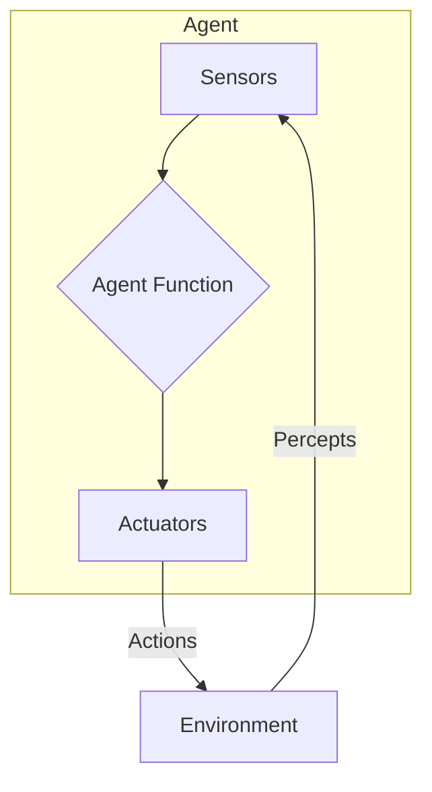

# Intelligent Agents

> An intelligent agent is an autonomous entity which observes through sensors and acts upon an environment using actuators to achieve goals.

## Overview
In artificial intelligence, an intelligent agent (IA) is an autonomous entity that perceives its environment, reasons about its observations, and takes actions to achieve specific goals. This concept is a fundamental paradigm for understanding and building AI systems. The agent's primary loop is "perceive-think-act". It uses sensors to gather information (percepts) from the environment and actuators to perform actions. The agent's behavior is governed by an "agent function" that maps any given percept sequence to an action.

The goal of an AI designer is to create the best possible agent function. The "best" agent is one that is rational, meaning it takes actions that maximize its expected utility, given the information it has. This framework allows us to formalize the problem of building AI systems and to compare different approaches. The PEAS (Performance, Environment, Actuators, Sensors) framework is used to specify the setting for an agent.

## 2. Visual Intuition
:::demo
<div style="background:#1e1e1e;padding:16px;border-radius:10px;color:#e5e7eb;font-family:system-ui,sans-serif">
  <h3 style="margin:0 0 8px 0;color:#7dd3fc">Intelligent Agents - Concept Map</h3>
  <svg width="100%" height="280" viewBox="0 0 640 280" role="img" aria-label="Intelligent Agents visual intuition" style="background:#111827;border-radius:8px">
    <rect x="24" y="28" width="180" height="64" rx="10" fill="#1d4ed8" />
    <text x="114" y="66" text-anchor="middle" fill="#e5e7eb" font-size="14">Problem</text>
    <rect x="230" y="28" width="180" height="64" rx="10" fill="#0f766e" />
    <text x="320" y="66" text-anchor="middle" fill="#e5e7eb" font-size="14">Process</text>
    <rect x="436" y="28" width="180" height="64" rx="10" fill="#7c3aed" />
    <text x="526" y="66" text-anchor="middle" fill="#e5e7eb" font-size="14">Outcome</text>

    <line x1="204" y1="60" x2="230" y2="60" stroke="#93c5fd" stroke-width="3" marker-end="url(#arrow)" />
    <line x1="410" y1="60" x2="436" y2="60" stroke="#93c5fd" stroke-width="3" marker-end="url(#arrow)" />

    <rect x="24" y="130" width="592" height="120" rx="10" fill="#0b1220" stroke="#334155" />
    <text x="320" y="156" text-anchor="middle" fill="#cbd5e1" font-size="14">Key intuition for Intelligent Agents</text>
    <text x="320" y="182" text-anchor="middle" fill="#94a3b8" font-size="12">Track state changes, constraints, and final behavior.</text>
    <text x="320" y="206" text-anchor="middle" fill="#94a3b8" font-size="12">Use this as a mental model before formal proofs or code.</text>

    <defs>
      <marker id="arrow" markerWidth="10" markerHeight="10" refX="8" refY="3" orient="auto">
        <polygon points="0 0, 10 3, 0 6" fill="#93c5fd" />
      </marker>
    </defs>
  </svg>
  <p style="margin-top:10px;color:#cbd5e1">Interactive-ready visual scaffold for the topic.</p>
</div>
:::
*Caption: A model of a general learning agent. The learning element uses feedback from the critic to modify the performance element.*

## Core Theory
The core theory of intelligent agents revolves around the concept of rationality and the different ways that agents can be designed to achieve their goals. The complexity and capabilities of an agent depend on its type.

**Types of Intelligent Agents:**

1.  **Simple Reflex Agents:** These agents select actions based on the current percept, ignoring the rest of the percept history. They are simple but have limited intelligence. For example, a thermostat is a simple reflex agent.

2.  **Model-Based Reflex Agents:** These agents maintain an internal state to track the parts of the world they can't see. The internal state is updated based on how the world evolves and how the agent's actions affect the world.

3.  **Goal-Based Agents:** These agents have a goal they are trying to achieve. They use their knowledge about the world to figure out which actions will lead them to their goal. Search and planning are important subfields of AI that deal with finding sequences of actions to achieve a goal.

4.  **Utility-Based Agents:** These agents try to maximize their own "happiness" or utility. They have a utility function that maps a state (or sequence of states) to a real number, which represents the desirability of that state. This is useful when there are conflicting goals, and the agent needs to make trade-offs.

5.  **Learning Agents:** These agents can improve their performance over time by learning from their experiences. A learning agent has a "learning element" that modifies the agent's behavior, a "performance element" that selects actions, a "critic" that provides feedback on the agent's performance, and a "problem generator" that suggests actions that will lead to new and informative experiences.

## Visual Diagram

*A diagram of the basic intelligent agent loop, showing the agent interacting with its environment.*

## Code Example
```python
# A simple example of a model-based reflex agent
class VacuumCleaner:
    def __init__(self, location="A"):
        self.location = location
        self.model = {"A": "Unknown", "B": "Unknown"} # The agent's model of the world

    def sense(self, location_status):
        self.model[self.location] = location_status

    def act(self):
        if self.model[self.location] == "Dirty":
            return "Suck"
        elif self.location == "A":
            return "Go to B"
        elif self.location == "B":
            return "Go to A"

# Example usage
agent = VacuumCleaner()
print(f"Agent is in room {agent.location}")

# The agent senses that room A is Dirty
agent.sense("Dirty")
action = agent.act()
print(f"Action: {action}") # Expected output: Suck

# After sucking, let's say the agent moves to B and finds it Clean
agent.location = "B"
agent.sense("Clean")
action = agent.act()
print(f"Agent is in room {agent.location}")
print(f"Action: {action}") # Expected output: Go to A
```

## Interactive Demo
:::demo
<!-- title: "Simple Reflex Agent Simulation" -->
<!DOCTYPE html>
<html>
<head>
<meta charset="utf-8">
<style>
  body { margin:0; background:#0f1117; color:#e5e7eb; font-family: system-ui, sans-serif; font-size:13px; padding:12px; display: flex; justify-content: center; align-items: center; height: 100vh; }
  .room-container { display: flex; }
  .room { width: 100px; height: 100px; border: 2px solid #374151; margin: 10px; display: flex; justify-content: center; align-items: center; position: relative; }
  #agent { width: 30px; height: 30px; background: #3b82f6; border-radius: 50%; position: absolute; transition: left 0.5s; }
  .dirty { background-color: #a16207; }
</style>
</head>
<body>
<div class="room-container">
  <div class="room" id="roomA">Room A</div>
  <div class="room" id="roomB">Room B</div>
</div>
<div id="agent"></div>

<script>
  const roomA = document.getElementById('roomA');
  const roomB = document.getElementById('roomB');
  const agent = document.getElementById('agent');

  let agentLocation = 'A';
  let roomStatus = { 'A': 'Clean', 'B': 'Clean' };

  function render() {
      roomA.classList.toggle('dirty', roomStatus['A'] === 'Dirty');
      roomB.classList.toggle('dirty', roomStatus['B'] === 'Dirty');
      agent.style.left = agentLocation === 'A' ? '75px' : '200px';
  }

  function simpleReflexAgent() {
      if (roomStatus[agentLocation] === 'Dirty') {
          roomStatus[agentLocation] = 'Clean';
      } else {
          agentLocation = (agentLocation === 'A') ? 'B' : 'A';
      }
      render();
  }

  setInterval(() => {
      if (Math.random() < 0.2) {
          roomStatus[Math.random() < 0.5 ? 'A' : 'B'] = 'Dirty';
          render();
      }
  }, 1000);
  
  setInterval(simpleReflexAgent, 1500);

  render();
</script>
</body>
</html>
:::

## Worked Example
**Problem:** Specify the PEAS framework for a self-driving car.

**Solution:**

-   **Performance Measure:** Safety (minimize accidents), speed (minimize travel time), comfort (smooth driving), legality (follow traffic laws).
-   **Environment:** Roads, other vehicles, pedestrians, traffic signs, weather conditions.
-   **Actuators:** Steering wheel, accelerator, brake, signal lights, horn, display screen.
-   **Sensors:** Cameras, LiDAR, radar, GPS, odometer, accelerometer.

## Industry Applications
- **Robotics:** Autonomous robots in manufacturing, logistics, and exploration. (e.g., Boston Dynamics, Kiva Systems)
- **Personal Assistants:** Voice assistants like Siri, Alexa, and Google Assistant.
- **E-commerce:** Recommendation engines and dynamic pricing bots. (e.g., Amazon)
- **Gaming:** Non-player characters (NPCs) that exhibit intelligent behavior. (e.g., in games like The Last of Us or Halo)

## Practice Problems

### Easy
1. What are the four components of the PEAS framework? Give an example for each for a spam filter.

### Medium
2. Explain the difference between a goal-based agent and a utility-based agent. When would you prefer one over the other?

### Hard
3. Describe the environment for a chess-playing agent. Is it fully or partially observable? Deterministic or stochastic? Static or dynamic? Discrete or continuous? Single-agent or multi-agent?

## Interactive Quiz
:::quiz
**Q1:** An agent's perception of the environment is received through...
- A) Actuators
- B) Sensors
- C) The performance element
- D) The learning element
> B — Sensors are the components that allow an agent to perceive its environment.

**Q2:** A thermostat that turns on the heat when the temperature is below a certain threshold is an example of a...
- A) Simple reflex agent
- B) Model-based reflex agent
- C) Goal-based agent
- D) Learning agent
> A — It acts solely on the current percept (temperature) without any internal state.

**Q3:** Which of the following is NOT a characteristic of an environment?
- A) Static vs. Dynamic
- B) Discrete vs. Continuous
- C) Simple vs. Complex
- D) Single-agent vs. Multi-agent
> C — While environments can be complex, "Simple vs. Complex" is not one of the standard classifications for AI environments.
:::

## Interview Questions

**Q: What is an intelligent agent?**
*A: An intelligent agent is a system that perceives its environment and takes actions to achieve its goals. It's a useful abstraction for designing and analyzing AI systems.*

**Q: Describe the PEAS framework for a medical diagnosis system.**
*A: Performance: Correct diagnosis, minimizing false positives/negatives, recommending effective treatments. Environment: Patient symptoms, medical history, lab results. Actuators: Display of diagnosis and treatment recommendations. Sensors: Input fields for symptoms and patient data.*

**Q: What is the difference between a rational agent and a perfect agent?**
*A: A rational agent acts to maximize its expected utility, given the information it has. It is not expected to be omniscient. A perfect agent would know the actual outcome of its actions, which is impossible in most real-world environments.*

**Q: How does a learning agent work?**
*A: A learning agent has four main components: a performance element that chooses actions, a critic that provides feedback, a learning element that updates the agent's behavior, and a problem generator that encourages exploration. This allows the agent to improve its performance over time.*

## Key Takeaways
- Intelligent agents are a core concept in AI.
- The PEAS framework is used to define the task environment for an agent.
- There are several types of agents, from simple reflex agents to complex learning agents.
- The concept of rationality is central to the design of intelligent agents.
- The choice of agent architecture depends on the complexity of the environment and the task.

## Common Misconceptions
- ❌ All agents are physical robots. → ✅ An agent can be purely software, like a chatbot or a web crawler.
- ❌ Intelligent agents are always learning. → ✅ Many useful agents are not learning agents. Simple reflex agents are very common.

## Related Topics
- [[overview]] — The broad field of AI in which intelligent agents are a fundamental concept.
- [[search-algorithms]] — Used by goal-based agents to find sequences of actions.
- [[markov-decision-processes]] — A mathematical framework for modeling decision-making in a stochastic environment, often used by utility-based agents.
