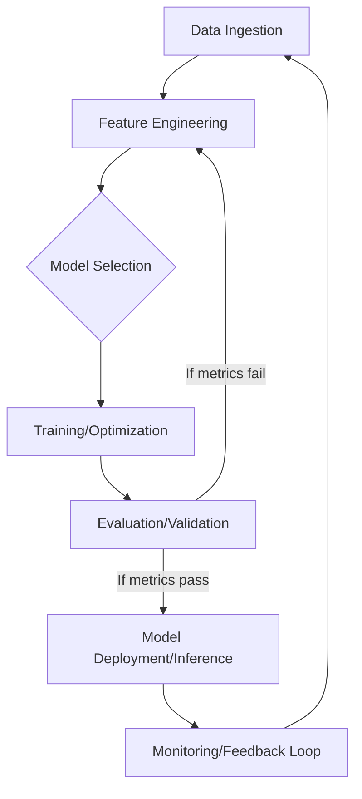

# AI Interview Preparation

> Mastering the AI interview requires a synthesis of rigorous mathematical foundations, algorithmic fluency, and the architectural intuition to deploy models at scale.

## Overview

The AI interview process is distinct from standard software engineering assessments. While coding proficiency remains a baseline requirement, candidates are evaluated on their ability to reason about uncertainty, data distributions, and the trade-offs inherent in machine learning systems. A successful candidate must demonstrate not only how to implement a model, but also why a specific architecture is optimal for a given set of constraints.

Historically, interviews for AI roles have evolved from focusing solely on algorithmic theory to emphasizing "Applied AI" and System Design. This shift reflects the industry's focus on moving from academic prototypes to robust, high-availability production pipelines. Today, interviewing successfully requires a three-pillar strategy: technical depth in mathematics and statistics, coding mastery within the PyData ecosystem, and a product-focused approach to system architecture.

## 2. Visual Intuition
:::demo
<div style="background:#1e1e1e;padding:16px;border-radius:10px;color:#e5e7eb;font-family:system-ui,sans-serif">
  <h3 style="margin:0 0 8px 0;color:#7dd3fc">AI Interview Preparation - Concept Map</h3>
  <svg width="100%" height="280" viewBox="0 0 640 280" role="img" aria-label="AI Interview Preparation visual intuition" style="background:#111827;border-radius:8px">
    <rect x="24" y="28" width="180" height="64" rx="10" fill="#1d4ed8" />
    <text x="114" y="66" text-anchor="middle" fill="#e5e7eb" font-size="14">Problem</text>
    <rect x="230" y="28" width="180" height="64" rx="10" fill="#0f766e" />
    <text x="320" y="66" text-anchor="middle" fill="#e5e7eb" font-size="14">Process</text>
    <rect x="436" y="28" width="180" height="64" rx="10" fill="#7c3aed" />
    <text x="526" y="66" text-anchor="middle" fill="#e5e7eb" font-size="14">Outcome</text>

    <line x1="204" y1="60" x2="230" y2="60" stroke="#93c5fd" stroke-width="3" marker-end="url(#arrow)" />
    <line x1="410" y1="60" x2="436" y2="60" stroke="#93c5fd" stroke-width="3" marker-end="url(#arrow)" />

    <rect x="24" y="130" width="592" height="120" rx="10" fill="#0b1220" stroke="#334155" />
    <text x="320" y="156" text-anchor="middle" fill="#cbd5e1" font-size="14">Key intuition for AI Interview Preparation</text>
    <text x="320" y="182" text-anchor="middle" fill="#94a3b8" font-size="12">Track state changes, constraints, and final behavior.</text>
    <text x="320" y="206" text-anchor="middle" fill="#94a3b8" font-size="12">Use this as a mental model before formal proofs or code.</text>

    <defs>
      <marker id="arrow" markerWidth="10" markerHeight="10" refX="8" refY="3" orient="auto">
        <polygon points="0 0, 10 3, 0 6" fill="#93c5fd" />
      </marker>
    </defs>
  </svg>
  <p style="margin-top:10px;color:#cbd5e1">Interactive-ready visual scaffold for the topic.</p>
</div>
:::
*Caption: The bias-variance tradeoff illustrates the tension between model complexity and generalization error; finding the "sweet spot" is the objective of hyperparameter tuning.*

## Core Theory

AI interviews probe the fundamental mathematical frameworks underpinning modern models. Key areas include:

### 1. Statistical Learning Theory
Understanding the loss function $L(y, \hat{y})$ is critical. For a linear regression model, we aim to minimize the Mean Squared Error (MSE):
$$MSE = \frac{1}{n} \sum_{i=1}^{n} (y_i - \hat{y}_i)^2$$
In classification, we often rely on Cross-Entropy loss for probabilistic output:
$$H(p, q) = -\sum_{x} p(x) \log q(x)$$

### 2. Optimization
Most model training relies on Gradient Descent. The weight update rule is:
$$\theta_{t+1} = \theta_t - \eta \nabla_\theta J(\theta_t)$$
Where $\eta$ is the learning rate and $J$ is the cost function. Candidates should be ready to discuss vanishing gradients in deep architectures and how techniques like Batch Normalization or residual connections mitigate this.

## Visual Diagram

*The lifecycle of a production-grade AI system, emphasizing the cyclical nature of model improvement.*

## Code Example

```python
import numpy as np

# Simple implementation of Stochastic Gradient Descent for Linear Regression
def gradient_descent(X, y, learning_rate=0.01, iterations=1000):
    m, n = X.shape
    weights = np.zeros(n)
    
    for i in range(iterations):
        # Forward pass: y_pred = X * w
        y_pred = np.dot(X, weights)
        # Compute error
        error = y_pred - y
        # Compute gradients
        gradient = (1/m) * np.dot(X.T, error)
        # Update weights
        weights -= learning_rate * gradient
        
    return weights

# Sample data: y = 2x + 1
X = np.array([[1, 1], [1, 2], [1, 3]])
y = np.array([3, 5, 7])
weights = gradient_descent(X, y)

print(f"Learned Weights: {weights}")
# Expected Output: Learned Weights: [1. 2.] (Bias 1, Slope 2)
```

## Interactive Demo

:::demo
<!DOCTYPE html>
<html>
<body style="background:#0f1117; color:white;">
<h3>Gradient Descent Step Visualizer</h3>
<div id="vis" style="width:200px; height:20px; background:#333;">
  <div id="dot" style="width:20px; height:20px; background:#3b82f6; position:relative; left:0px;"></div>
</div>
<button onclick="move()">Step</button>
<script>
  let pos = 0;
  function move() {
    pos += 20;
    document.getElementById('dot').style.left = pos + 'px';
  }
</script>
</body>
</html>
:::

## Worked Example

**Problem:** Calculate the Precision and Recall for a model that identifies spam emails.
*   Total spam emails: 100
*   Model predicts 80 as spam.
*   Of those 80, 70 are actually spam (True Positives).

**Steps:**
1. **True Positives (TP):** 70
2. **False Positives (FP):** Predicted spam - TP = 80 - 70 = 10
3. **False Negatives (FN):** Total spam - TP = 100 - 70 = 30
4. **Precision:** $TP / (TP + FP) = 70 / 80 = 0.875$
5. **Recall:** $TP / (TP + FN) = 70 / 100 = 0.70$

## Industry Applications
- **Netflix**: Personalized recommendation engines using Matrix Factorization and Deep Learning.
- **Waymo/Tesla**: Computer Vision pipelines for object detection and sensor fusion.
- **OpenAI/Anthropic**: Training Large Language Models (LLMs) using RLHF.

## Practice Problems

### Easy
1. Given a list, find the two numbers that sum to target. *(Hint: Use a hash map for $O(n)$ complexity.)*

### Medium
2. Implement K-Means clustering from scratch. *(Hint: Focus on the Expectation-Maximization loop.)*
3. Given a matrix, rotate it 90 degrees clockwise. *(Hint: Transpose then reverse rows.)*

### Hard
4. Design a system to detect anomalies in real-time credit card transactions. *(Hint: Consider windowing, imbalanced data, and latency.)*

## Interactive Quiz

:::quiz
**Q1:** What is the primary cause of high variance in a model?
- A) High bias
- B) Overfitting
- C) Underfitting
- D) Large training set
> B — Overfitting occurs when a model learns noise rather than the signal, leading to high variance.

**Q2:** In gradient descent, if the learning rate is too high, what happens?
- A) The model converges faster
- B) The model achieves higher accuracy
- C) The weights diverge
- D) The model gets stuck in a local minimum
> C — A learning rate that is too high causes the model to "overshoot" the minimum, leading to divergence.

**Q3:** Which loss function is preferred for binary classification?
- A) MSE
- B) Mean Absolute Error
- C) Binary Cross-Entropy
- D) Huber Loss
> C — Cross-entropy is designed for probabilistic outputs between 0 and 1.
:::

## Interview Questions

**Q: Explain the Bias-Variance Trade-off to a senior engineer.**
*A: The bias-variance trade-off describes the conflict between underfitting (high bias, simple model) and overfitting (high variance, overly complex model). We manage this by selecting optimal complexity, using regularization (L1/L2) to constrain weight growth, and utilizing cross-validation to ensure model generalization on unseen data.*

**Q: What is the complexity of training a K-Means model?**
*A: It is $O(n \cdot k \cdot i \cdot d)$, where $n$ is data points, $k$ is clusters, $i$ is iterations, and $d$ is dimensions. Each iteration requires calculating distances from every point to every centroid.*

**Q: What if your model has high latency in production?**
*A: I would investigate model quantization (e.g., FP16), pruning unnecessary weights, caching frequent inference results, or moving to a more efficient architecture like DistilBERT instead of a full BERT model.*

**Q: Design a recommendation system for an e-commerce site.**
*A: I would use a two-stage approach: candidate retrieval (e.g., matrix factorization or ANN) to narrow millions of items to hundreds, followed by a ranking stage (e.g., Gradient Boosted Trees or a Deep Learning model) to score them based on user context and historical purchase data.*

## Key Takeaways
- Master the fundamentals of Calculus, Linear Algebra, and Probability.
- Be able to derive standard loss functions and optimization updates.
- Practice coding with time/space complexity analysis at the forefront.
- Understand the data pipeline: collection, cleaning, feature engineering, and evaluation.
- Familiarize yourself with modern MLOps tools (Kubeflow, MLflow).
- Always consider the "Cold Start" problem in system design.
- Communication of trade-offs is often more important than the "perfect" answer.

## Common Misconceptions
- ❌ More data is always better → ✅ Quality and representativeness of data matter more than raw volume.
- ❌ Deep learning is always the answer → ✅ Simple heuristics or tree-based models often outperform deep learning on tabular data.

## Related Topics
- [[ML-Fundamentals]] — Core mathematical concepts.
- [[System-Design]] — High-level architecture for AI.
- [[Python-for-AI]] — Best practices for efficient tensor manipulation.
