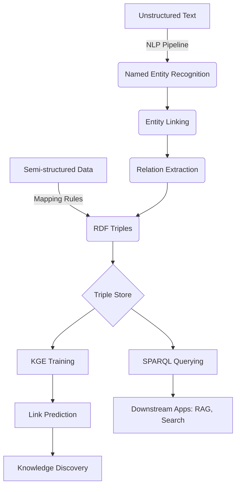

# Knowledge Graphs: Construction, Embedding, and Querying (SPARQL)

> **Knowledge Graphs** are large-scale, multi-relational semantic networks that represent entities and their heterogeneous interrelations as a collection of directed triples $(s, p, o)$, enabling structured reasoning, information retrieval, and representation learning across disparate data sources.

## 1. Historical Background & Motivation

The concept of representing human knowledge as a graph dates back to the semantic networks of the 1960s and 70s, pioneered by researchers like Ross Quillian, who sought to model human memory. However, the modern "Knowledge Graph" (KG) era was inaugurated in 2012 when Google transitioned from a "strings" approach to a "things" approach. Before this, search engines operated primarily on inverted indices and keyword matching. If a user searched for "The height of the Eiffel Tower," the engine would find pages containing those words. Google’s KG changed this by recognizing the "Eiffel Tower" as a unique entity with attributes like `height`, `location`, and `architect`, allowing the engine to return a direct answer ($330m$) rather than just links.

The evolution of KGs is deeply rooted in the Semantic Web movement led by Tim Berners-Lee. The standards developed for the Semantic Web—Resource Description Framework (RDF), Web Ontology Language (OWL), and SPARQL—provided the technical scaffolding for modern KGs. Today, KGs serve as the backbone for modern AI, providing the "world knowledge" that Large Language Models (LLMs) often lack. While LLMs are probabilistic, KGs are deterministic and verifiable, leading to the rise of Retrieval-Augmented Generation (RAG) architectures where KGs provide a "ground truth" layer to ground LLM outputs and prevent hallucinations.

## 2. Visual Intuition
:::demo
<div style="background:#1e1e1e;padding:16px;border-radius:10px;color:#e5e7eb;font-family:system-ui,sans-serif">
  <h3 style="margin:0 0 8px 0;color:#7dd3fc">Knowledge Graphs: Construction, Embedding, and Querying (SPARQL) - Concept Map</h3>
  <svg width="100%" height="280" viewBox="0 0 640 280" role="img" aria-label="Knowledge Graphs: Construction, Embedding, and Querying (SPARQL) visual intuition" style="background:#111827;border-radius:8px">
    <rect x="24" y="28" width="180" height="64" rx="10" fill="#1d4ed8" />
    <text x="114" y="66" text-anchor="middle" fill="#e5e7eb" font-size="14">Problem</text>
    <rect x="230" y="28" width="180" height="64" rx="10" fill="#0f766e" />
    <text x="320" y="66" text-anchor="middle" fill="#e5e7eb" font-size="14">Process</text>
    <rect x="436" y="28" width="180" height="64" rx="10" fill="#7c3aed" />
    <text x="526" y="66" text-anchor="middle" fill="#e5e7eb" font-size="14">Outcome</text>

    <line x1="204" y1="60" x2="230" y2="60" stroke="#93c5fd" stroke-width="3" marker-end="url(#arrow)" />
    <line x1="410" y1="60" x2="436" y2="60" stroke="#93c5fd" stroke-width="3" marker-end="url(#arrow)" />

    <rect x="24" y="130" width="592" height="120" rx="10" fill="#0b1220" stroke="#334155" />
    <text x="320" y="156" text-anchor="middle" fill="#cbd5e1" font-size="14">Key intuition for Knowledge Graphs: Construction, Embedding, and Querying (SPARQL)</text>
    <text x="320" y="182" text-anchor="middle" fill="#94a3b8" font-size="12">Track state changes, constraints, and final behavior.</text>
    <text x="320" y="206" text-anchor="middle" fill="#94a3b8" font-size="12">Use this as a mental model before formal proofs or code.</text>

    <defs>
      <marker id="arrow" markerWidth="10" markerHeight="10" refX="8" refY="3" orient="auto">
        <polygon points="0 0, 10 3, 0 6" fill="#93c5fd" />
      </marker>
    </defs>
  </svg>
  <p style="margin-top:10px;color:#cbd5e1">Interactive-ready visual scaffold for the topic.</p>
</div>
:::
*Caption: A fragment of a Knowledge Graph where nodes represent entities (people, places, concepts) and directed edges represent semantic relations (born_in, works_at, located_in).*

## 3. Core Theory & Mathematical Foundations

### 3.1 Formal Representation
A Knowledge Graph $G$ is defined as a set of triples $T = \{(s, p, o)\} \subseteq E \times R \times (E \cup L)$, where:
- $E$ is the set of entities (nodes).
- $R$ is the set of relations (labeled, directed edges).
- $L$ is the set of literals (concrete values like strings, dates, or numbers).

Each triple represents a fact: $(subject, predicate, object)$. For example, $(\text{Alan\_Turing}, \text{born\_in}, \text{London})$.

### 3.2 Knowledge Graph Construction (KGC)
Construction involves three primary phases:
1.  **Entity Extraction:** Identifying mentions of entities in unstructured text using Named Entity Recognition (NER).
2.  **Entity Linking (EL):** Resolving a mention (e.g., "The Apple") to a specific node in an existing KG (e.g., the company $Q312$ or the fruit $Q89$ in Wikidata).
3.  **Relation Extraction (RE):** Classifying the relationship between two entities. Formally, given a sentence $S$ and entities $e_1, e_2 \in S$, we aim to find $r \in R$ such that $(e_1, r, e_2)$ is true.

### 3.3 Knowledge Graph Embeddings (KGE)
KGEs map entities $e \in E$ and relations $r \in R$ into a continuous vector space $\mathbb{R}^d$. The goal is to define a scoring function $f_r(h, t)$ such that $f_r(h, t)$ is high if the triple $(h, r, t)$ is true and low otherwise.

#### 3.3.1 Translational Models (TransE)
TransE views relations as translations in the embedding space. If $(h, r, t)$ holds, then:
$$\mathbf{h} + \mathbf{r} \approx \mathbf{t}$$
The score function is defined as the negative distance:
$$f_r(h, t) = -\|\mathbf{h} + \mathbf{r} - \mathbf{t}\|_{L_1/L_2}$$
*Limitation:* TransE struggles with 1-to-N, N-to-1, and N-to-N relations. If $(\text{USA}, \text{contains}, \text{NY})$ and $(\text{USA}, \text{contains}, \text{CA})$, TransE forces $\text{NY} \approx \text{CA}$, which is incorrect.

#### 3.3.2 Semantic Matching Models (DistMult)
DistMult uses a bilinear diagonal model:
$$f_r(h, t) = \mathbf{h}^\top \text{diag}(\mathbf{r}) \mathbf{t} = \sum_{i=1}^d h_i r_i t_i$$
*Limitation:* DistMult is inherently symmetric ($f_r(h, t) = f_r(t, h)$), making it unsuitable for asymmetric relations like "parent\_of."

#### 3.3.3 RotatE
RotatE solves symmetry issues by modeling relations as rotations in complex space $\mathbb{C}^d$:
$$\mathbf{t} = \mathbf{h} \circ \mathbf{r}, \text{ where } |r_i| = 1$$
Here, $r_i = e^{i\theta_{r,i}}$, allowing the model to represent inversion and composition properties.

### 3.4 Formal Analysis: Complexity of Querying
Querying a KG typically involves finding subgraphs that match a pattern. This is equivalent to the **Subgraph Isomorphism Problem**, which is NP-complete. However, SPARQL queries often restrict patterns to **Basic Graph Patterns (BGPs)**, which can be solved efficiently using join optimization.
- **Time Complexity:** For a BGP query with $k$ variables and a graph with $N$ triples, the worst-case complexity is $O(N^k)$.
- **Space Complexity:** $O(N)$ to store the adjacency list or triple store.

## 4. Algorithm / Process: KG Construction Pipeline

1.  **Data Acquisition:** Gather structured (SQL), semi-structured (JSON/XML), and unstructured (text) data.
2.  **Ontology Modeling:** Define the schema (classes, properties, domain/range constraints).
3.  **Knowledge Extraction:**
    - Perform NER to find spans.
    - Perform Coreference Resolution (linking "he" to "Alan Turing").
    - Perform RE to identify links.
4.  **Knowledge Fusion (Canonicalization):**
    - **Entity Resolution:** Determine if "U.S.A" and "United States" refer to the same entity.
    - **Conflict Resolution:** If one source says "Birth: 1912" and another "1913," use confidence scores or voting.
5.  **Storage:** Load triples into a Triple Store (e.g., GraphDB, Virtuoso) or a Property Graph (e.g., Neo4j).
6.  **Embedding & Reasoning:** Train KGE models to predict missing links (Link Prediction).

## 5. Visual Diagram


*Caption: The end-to-end Knowledge Graph lifecycle, from raw data ingestion to downstream AI applications.*

## 6. Implementation

### 6.1 Core Implementation: TransE from Scratch
This snippet demonstrates the fundamental logic of training a Translational Embedding (TransE) model.

```python
import torch
import torch.nn as nn
import torch.optim as optim

class TransE(nn.Module):
    def __init__(self, num_entities, num_relations, embedding_dim, margin=1.0):
        """
        Initialize TransE model.
        Args:
            num_entities: Count of unique entities
            num_relations: Count of unique relations
            embedding_dim: Size of latent vector
            margin: Margin for hinge loss
        """
        super(TransE, self).__init__()
        self.entity_embeddings = nn.Embedding(num_entities, embedding_dim)
        self.relation_embeddings = nn.Embedding(num_relations, embedding_dim)
        self.margin = margin
        
        # Initialize embeddings using Xavier uniform
        nn.init.xavier_uniform_(self.entity_embeddings.weight)
        nn.init.xavier_uniform_(self.relation_embeddings.weight)
        
    def forward(self, h, r, t):
        """
        Calculates score for (h, r, t) triples.
        Complexity: O(D) where D is embedding_dim.
        """
        h_emb = self.entity_embeddings(h)
        r_emb = self.relation_embeddings(r)
        t_emb = self.entity_embeddings(t)
        
        # L2 distance: ||h + r - t||
        score = torch.norm(h_emb + r_emb - t_emb, p=2, dim=1)
        return score

    def loss(self, pos_score, neg_score):
        """
        Hinge loss: max(0, margin + pos_score - neg_score)
        Ensures positive triples have lower distance than negative ones.
        """
        return torch.mean(torch.relu(self.margin + pos_score - neg_score))

# Sample training loop logic
# Entities: 0=Turing, 1=London, 2=Churchill
# Relations: 0=born_in
triples = torch.LongTensor([[0, 0, 1]]) # (Turing, born_in, London)
model = TransE(num_entities=3, num_relations=1, embedding_dim=50)
optimizer = optim.Adam(model.parameters(), lr=0.01)

# Optimization step (simplified)
model.train()
optimizer.zero_grad()
pos_score = model(triples[:, 0], triples[:, 1], triples[:, 2])
# Corrupt the object to create a negative triple: (Turing, born_in, Churchill)
neg_triples = torch.LongTensor([[0, 0, 2]])
neg_score = model(neg_triples[:, 0], neg_triples[:, 1], neg_triples[:, 2])

loss = model.loss(pos_score, neg_score)
loss.backward()
optimizer.step()
print(f"Loss: {loss.item():.4f}")
```

### 6.2 Querying with SPARQL (Python/RDFLib)
SPARQL is the SQL of the graph world.

```python
from rdflib import Graph, URIRef, Literal, Namespace

# Create a graph
g = Graph()
EX = Namespace("http://example.org/")

# Add data: (Alan Turing, born in, London)
g.add((EX.Alan_Turing, EX.born_in, EX.London))
g.add((EX.London, EX.part_of, EX.UK))

# SPARQL Query: Who was born in a place that is part of the UK?
query = """
SELECT ?person WHERE {
    ?person <http://example.org/born_in> ?city .
    ?city <http://example.org/part_of> <http://example.org/UK> .
}
"""

for row in g.query(query):
    print(f"Entity found: {row.person}")
# Output: Entity found: http://example.org/Alan_Turing
```

### 6.3 Common Pitfalls in Code
- **Non-normalized Embeddings:** In TransE, if you don't constrain $\|\mathbf{h}\| \le 1$ and $\|\mathbf{t}\| \le 1$, the model can minimize loss by simply increasing embedding magnitudes to infinity.
- **Data Leakage in Evaluation:** When evaluating link prediction, ensure that the reciprocal relation (e.g., `is_born_in` vs `has_birth_place`) is not in the training set if you are testing on its counterpart.
- **Ignoring Literals:** Beginners often treat dates/numbers as nodes. This explodes the graph size. Use Literals for attributes and Entities for objects.

## 7. Interactive Demo

:::demo
<!-- title: Knowledge Graph Traversal & Querying -->
<!DOCTYPE html>
<html>
<head>
<style>
  body { margin:0; background:#0d1117; color:#c9d1d9; font-family: 'Segoe UI', Tahoma, Geneva, Verdana, sans-serif; overflow: hidden; }
  canvas { display: block; }
  #controls { position: absolute; top: 10px; left: 10px; background: rgba(22, 27, 34, 0.9); padding: 15px; border-radius: 8px; border: 1px solid #30363d; width: 250px; }
  .btn { background: #238636; color: white; border: none; padding: 8px 12px; cursor: pointer; border-radius: 4px; margin-top: 5px; width: 100%; }
  .btn:hover { background: #2ea043; }
  .stat { font-size: 12px; margin-top: 10px; color: #8b949e; }
  h3 { margin: 0 0 10px 0; font-size: 16px; color: #58a6ff; }
</style>
</head>
<body>
<div id="controls">
  <h3>KG Explorer</h3>
  <div id="status">Status: Idle</div>
  <button class="btn" onclick="startRandomWalk()">Run Random Walk</button>
  <button class="btn" onclick="resetGraph()">Reset Graph</button>
  <div class="stat" id="stats">Nodes: 15 | Edges: 22</div>
  <div class="stat" style="margin-top:20px;">
    <strong>Theory:</strong> Nodes represent Entities. Connections represent Predicates. Highlighted nodes show the "Query Traversal" path.
  </div>
</div>
<canvas id="canvas"></canvas>
<script>
  const canvas = document.getElementById('canvas');
  const ctx = canvas.getContext('2d');
  canvas.width = window.innerWidth;
  canvas.height = window.innerHeight;

  let nodes = [];
  let links = [];
  let activeNode = null;
  let traversalPath = [];

  class Node {
    constructor(id, x, y, label) {
      this.id = id;
      this.x = x;
      this.y = y;
      this.label = label;
      this.vx = (Math.random() - 0.5) * 2;
      this.vy = (Math.random() - 0.5) * 2;
      this.radius = 8;
    }
    update() {
      this.x += this.vx;
      this.y += this.vy;
      if (this.x < 0 || this.x > canvas.width) this.vx *= -1;
      if (this.y < 0 || this.y > canvas.height) this.vy *= -1;
    }
    draw() {
      ctx.beginPath();
      ctx.arc(this.x, this.y, this.radius, 0, Math.PI * 2);
      ctx.fillStyle = traversalPath.includes(this) ? "#f85149" : "#58a6ff";
      ctx.fill();
      ctx.fillStyle = "#c9d1d9";
      ctx.fillText(this.label, this.x + 12, this.y + 4);
    }
  }

  function init() {
    nodes = []; links = [];
    const names = ["Turing", "London", "UK", "Computing", "Enigma", "Bletchley", "Logic", "AI", "Minsky", "MIT", "USA", "Cambridge", "King's College", "Math", "Algorithms"];
    for(let i=0; i<names.length; i++) {
      nodes.push(new Node(i, Math.random()*canvas.width, Math.random()*canvas.height, names[i]));
    }
    for(let i=0; i<25; i++) {
      let s = Math.floor(Math.random()*nodes.length);
      let t = Math.floor(Math.random()*nodes.length);
      if(s !== t) links.push({s: nodes[s], t: nodes[t]});
    }
  }

  function startRandomWalk() {
    document.getElementById('status').innerText = "Status: Traversing...";
    let current = nodes[Math.floor(Math.random()*nodes.length)];
    traversalPath = [current];
    let steps = 0;
    const interval = setInterval(() => {
      let neighbors = links.filter(l => l.s === current).map(l => l.t);
      if(neighbors.length > 0 && steps < 10) {
        current = neighbors[Math.floor(Math.random()*neighbors.length)];
        traversalPath.push(current);
        steps++;
      } else {
        clearInterval(interval);
        document.getElementById('status').innerText = "Status: Path Found";
      }
    }, 500);
  }

  function resetGraph() {
    traversalPath = [];
    init();
    document.getElementById('status').innerText = "Status: Reset";
  }

  function animate() {
    ctx.clearRect(0, 0, canvas.width, canvas.height);
    links.forEach(l => {
      ctx.beginPath();
      ctx.moveTo(l.s.x, l.s.y);
      ctx.lineTo(l.t.x, l.t.y);
      ctx.strokeStyle = "#30363d";
      ctx.stroke();
    });
    nodes.forEach(n => {
      n.update();
      n.draw();
    });
    requestAnimationFrame(animate);
  }

  init();
  animate();
</script>
</body>
</html>
:::

## 8. Worked Examples

### Example 1 — TransE Score Calculation
Consider a small KG with 2D embeddings:
- $\mathbf{h}_{\text{Paris}} = [1, 2]$
- $\mathbf{r}_{\text{is\_capital\_of}} = [2, 0]$
- $\mathbf{t}_{\text{France}} = [3, 2.1]$

**Calculate the TransE distance score for (Paris, is\_capital\_of, France):**
1.  Compute predicted $\mathbf{t}$: $\mathbf{h} + \mathbf{r} = [1+2, 2+0] = [3, 2]$.
2.  Compute $L_2$ error: $\sqrt{(3-3)^2 + (2-2.1)^2} = \sqrt{0 + 0.01} = 0.1$.
3.  **Score:** $f = -0.1$. Since the score is close to 0 (distance is small), the model predicts this triple as "Likely True."

### Example 2 — SPARQL with Filter and Aggregation
**Scenario:** Find all companies founded after 1990 with more than 500 employees.

```sparql
SELECT ?company (COUNT(?emp) AS ?empCount)
WHERE {
    ?company rdf:type :Company .
    ?company :foundedDate ?date .
    ?company :hasEmployee ?emp .
    FILTER(?date > "1990-01-01"^^xsd:date)
}
GROUP BY ?company
HAVING (?empCount > 500)
```
- **Step 1:** The engine identifies all nodes with `rdf:type` of `Company`.
- **Step 2:** It joins these with their `foundedDate`.
- **Step 3:** It filters the joined list based on the date literal.
- **Step 4:** It groups the results by company and counts the `?emp` variable connections.
- **Step 5:** It applies the post-aggregation filter (`HAVING`).

## 9. Comparison with Alternatives

| Approach | Architecture | Query Language | Best Used When | Cons |
| :--- | :--- | :--- | :--- | :--- |
| **Relational DB** | Tables/Foreign Keys | SQL | Structured, fixed schema data. | Joins are expensive for multi-hop. |
| **Property Graph** | Nodes/Edges + Attrs | Cypher/Gremlin | Graph traversals, pathfinding (e.g., Fraud). | Lacks formal semantics/ontologies. |
| **RDF Knowledge Graph** | Triples $(s, p, o)$ | SPARQL | Data integration, global unique IDs (URIs). | Higher overhead, strict schema. |
| **Vector Database** | Embeddings ($1 \times D$) | Cosine Sim | Unstructured data, semantic search. | No explicit relationships or logic. |

## 10. Industry Applications & Real Systems

- **Google (Knowledge Vault):** Powers the "Knowledge Panel" in search results. It uses a combination of extracted triples from the web and curated data (Wikidata/Freebase) to provide instant factual answers.
- **Amazon (Product Graph):** Links products, brands, categories, and customer intents. For example, if you search for "milk," the KG knows milk is a `DairyProduct`, which is a `Perishable`, and can optimize shipping or recommend related items like `Cereal`.
- **LinkedIn (Economic Graph):** Maps the global economy—members, companies, jobs, and skills. It uses the KG to power "Recommended Jobs" by calculating the semantic distance between a user's skills and a job's requirements.
- **AstraZeneca (Drug Discovery):** Uses KGs to link genes, proteins, diseases, and chemical compounds. By performing **Link Prediction** on this graph, researchers can identify potential new uses for existing drugs (drug repurposing).

## 11. Practice Problems

### 🟢 Easy
1.  **Triple Translation:** Given a natural language sentence: "Elon Musk founded SpaceX in 2002," decompose this into exactly three RDF triples.
    *Hint: One triple for the founding event, one for the date, one for the person's role.*
    *Expected: (Elon\_Musk, founded, SpaceX), (SpaceX, founded\_on, 2002), (Elon\_Musk, type, Human).*

### 🟡 Medium
2.  **TransE Limitations:** Mathematically prove why TransE cannot model a symmetric relation $r$ (where $(h, r, t) \implies (t, r, h)$) unless the relation vector $\mathbf{r} = \mathbf{0}$.
    *Hint: Set $h+r=t$ and $t+r=h$ and solve.*

3.  **SPARQL Path Query:** Write a SPARQL query to find all "cousins" of a person $X$ in a graph using only the `parent_of` relationship.
    *Expected complexity: Requires two steps up and two steps down.*

### 🔴 Hard
4.  **Negative Sampling Complexity:** In KGE training, we generate $K$ negative samples for every positive triple. If we have $|E|$ entities and $|T|$ triples, what is the complexity of a naive uniform negative sampler? How can we use "Filtering" to ensure negative samples aren't actually true triples existing elsewhere in the dataset?
    *Hint: Filtering requires a hash set of all true triples.*

5.  **RotatE Geometry:** Show that the RotatE model can represent the **composition** of relations (e.g., $r_1 = \text{father}$, $r_2 = \text{brother}$, then $r_1 \circ r_2 = \text{uncle}$).
    *Expected complexity: Use complex number multiplication $e^{i\theta_1} \cdot e^{i\theta_2} = e^{i(\theta_1+\theta_2)}$.*

## 12. Interactive Quiz

:::quiz
**Q1: Why did Google shift from "Strings to Things"?**
- A) To save disk space by using graph compression.
- B) To understand the semantic intent and relationships between entities.
- C) Because SQL databases cannot store more than 1 billion rows.
- D) To prioritize ads over organic search results.
> B — Google realized that search intent is about entities (Things) and their properties, not just matching character sequences (Strings).

**Q2: What is the primary disadvantage of the DistMult embedding model?**
- A) It is computationally too expensive for large graphs.
- B) It cannot be trained using gradient descent.
- C) It is forced to be symmetric, so it can't distinguish "A is father of B" from "B is father of A".
- D) It only works on bipartite graphs.
> C — Because DistMult uses $h^\top M_r t$ and $M_r$ is diagonal, $h_i r_i t_i$ is identical to $t_i r_i h_i$.

**Q3: In SPARQL, what is the purpose of the `OPTIONAL` keyword?**
- A) To make the query run faster by skipping certain nodes.
- B) To allow the query to return results even if certain information is missing for an entity.
- C) To define a variable that can be either a URI or a Literal.
- D) To perform a fuzzy match on a string.
> B — Similar to a LEFT JOIN in SQL, `OPTIONAL` ensures that a result is not discarded if the optional pattern doesn't match.

**Q4: Which complexity class does the Subgraph Isomorphism problem belong to?**
- A) P
- B) NP-Complete
- C) BPP
- D) EXPTIME
> B — Finding if a smaller graph exists within a larger graph is a classic NP-Complete problem, making complex KG queries computationally intensive.

**Q5: Which model represents a relation as a rotation in complex space?**
- A) TransE
- B) Rescal
- C) RotatE
- D) ConvE
> C — RotatE uses Hadamard product in the complex domain to model relations as rotations, allowing it to capture symmetry, inversion, and composition.
:::

## 13. Interview Preparation

### Conceptual Questions
**Q: Explain Knowledge Graphs as if teaching it to a fellow engineer.**
*A: A Knowledge Graph is essentially a "multi-labeled directed graph" where nodes are unique entities and edges are specific types of relationships. Unlike a standard social graph where all edges are "friend," a KG has hundreds of edge types like "born\_in," "subsidiary\_of," or "treats\_disease." This allows us to perform multi-hop reasoning (e.g., "Find all drugs that treat diseases caused by this specific protein") which would be a nightmare of joins in a standard SQL database.*

**Q: What are the time and space complexities of TransE?**
*A: For a single triple $(h, r, t)$, the time complexity is $O(d)$ where $d$ is the embedding dimension, as it's a simple vector addition and norm calculation. Space complexity is $O(|E|d + |R|d)$ to store the entity and relation embedding matrices. This is highly efficient and scales linearly with the number of entities.*

**Q: How do you handle "Entity Resolution" when merging two different KGs?**
*A: Entity Resolution (or Record Linkage) is usually handled by a combination of: 1. Literal matching (blocking on name similarity), 2. Attribute comparison (do they share the same birth date?), and 3. Structural similarity (do they share the same neighbors in the graph?). Modern approaches use "Graph Neural Networks" (GNNs) to create structural embeddings and perform a nearest-neighbor search to find matches.*

### Quick Reference (Cheat Sheet)
| Property | TransE | DistMult | RotatE | SPARQL |
|---|---|---|---|---|
| **Space** | $O((E+R)d)$ | $O((E+R)d)$ | $O((E+R)d)$ | $O(Triples)$ |
| **Symmetry** | No | Yes (Forced) | Yes (Capable) | N/A |
| **Inversion** | Yes | No | Yes | N/A |
| **Math Domain** | $\mathbb{R}^d$ | $\mathbb{R}^d$ | $\mathbb{C}^d$ | Set Theory |

## 14. Key Takeaways
1.  **Entities, not Strings:** KGs provide a structured way to represent real-world objects and their interconnections.
2.  **Triples are the Atom:** The $(s, p, o)$ triple is the fundamental unit of information in most KGs.
3.  **Embeddings bridge the Gap:** KGE models like TransE and RotatE allow us to use discrete graph data in continuous ML pipelines.
4.  **SPARQL is Powerful:** It allows for complex graph pattern matching that is difficult or impossible in SQL.
5.  **Scaling is Hard:** Querying KGs is NP-Complete in the general case; real systems rely heavily on indexing and heuristics.
6.  **KGs + LLMs = RAG:** The future of AI lies in combining the reasoning capabilities of LLMs with the factual reliability of KGs.

## 15. Common Misconceptions
- ❌ **KGs are just Graph Databases:** ✅ While they use graph storage, KGs include an **Ontology** (schema/logic layer) that defines what relations mean and how they can be combined.
- ❌ **More dimensions are always better for embeddings:** ✅ Over-parameterizing KGEs can lead to overfitting on small graphs. Often 100-200 dimensions are sufficient even for millions of nodes.
- ❌ **SPARQL is just SQL for graphs:** ✅ SPARQL is based on **Graph Pattern Matching**, whereas SQL is based on **Relational Algebra**. This difference is crucial when performing recursive path queries.

## 16. Further Reading
- *Semantic Web for the Working Ontologist* by Dean Allemang — Excellent for learning RDF/SPARQL.
- *Knowledge Graph Fact Prediction via Complex Embeddings (RotatE Paper)* — Sun et al., ICLR 2019.
- *CS224W: Machine Learning with Graphs* (Stanford) — High-quality video lectures on GNNs and KGs.

## 17. Related Topics
- [[description-logics]] — The mathematical foundation of OWL and KG reasoning.
- [[temporal-logic]] — Used for "Temporal Knowledge Graphs" where facts have timestamps.
- [[natural-language-processing]] — Used for the "Construction" phase of KGs.
- [[representation-learning]] — The broader field encompassing KGEs and word embeddings.
