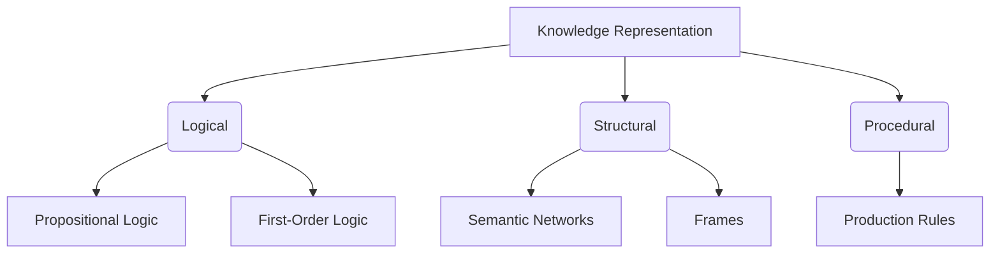

# Knowledge Representation

> Knowledge Representation and Reasoning (KRR) is the field of AI dedicated to representing information about the world in a form that a computer system can use to solve complex tasks.

## Overview
Knowledge Representation and Reasoning (KRR) is a fundamental area of artificial intelligence. The goal of KRR is to create a formal representation of knowledge that can be used by a computer to solve problems. This involves two main tasks: first, representing the knowledge in a structured way (the "knowledge base"), and second, reasoning about that knowledge to derive new information or make decisions.

There are many different approaches to KRR, each with its own strengths and weaknesses. These include logical representations (like propositional and first-order logic), semantic networks, frames, and production rules. The choice of representation depends on the specific problem being solved. A good knowledge representation should be expressive, unambiguous, and computationally efficient.

## 2. Visual Intuition
:::demo
<div style="background:#1e1e1e;padding:16px;border-radius:10px;color:#e5e7eb;font-family:system-ui,sans-serif">
  <h3 style="margin:0 0 8px 0;color:#7dd3fc">Knowledge Representation - Concept Map</h3>
  <svg width="100%" height="280" viewBox="0 0 640 280" role="img" aria-label="Knowledge Representation visual intuition" style="background:#111827;border-radius:8px">
    <rect x="24" y="28" width="180" height="64" rx="10" fill="#1d4ed8" />
    <text x="114" y="66" text-anchor="middle" fill="#e5e7eb" font-size="14">Problem</text>
    <rect x="230" y="28" width="180" height="64" rx="10" fill="#0f766e" />
    <text x="320" y="66" text-anchor="middle" fill="#e5e7eb" font-size="14">Process</text>
    <rect x="436" y="28" width="180" height="64" rx="10" fill="#7c3aed" />
    <text x="526" y="66" text-anchor="middle" fill="#e5e7eb" font-size="14">Outcome</text>

    <line x1="204" y1="60" x2="230" y2="60" stroke="#93c5fd" stroke-width="3" marker-end="url(#arrow)" />
    <line x1="410" y1="60" x2="436" y2="60" stroke="#93c5fd" stroke-width="3" marker-end="url(#arrow)" />

    <rect x="24" y="130" width="592" height="120" rx="10" fill="#0b1220" stroke="#334155" />
    <text x="320" y="156" text-anchor="middle" fill="#cbd5e1" font-size="14">Key intuition for Knowledge Representation</text>
    <text x="320" y="182" text-anchor="middle" fill="#94a3b8" font-size="12">Track state changes, constraints, and final behavior.</text>
    <text x="320" y="206" text-anchor="middle" fill="#94a3b8" font-size="12">Use this as a mental model before formal proofs or code.</text>

    <defs>
      <marker id="arrow" markerWidth="10" markerHeight="10" refX="8" refY="3" orient="auto">
        <polygon points="0 0, 10 3, 0 6" fill="#93c5fd" />
      </marker>
    </defs>
  </svg>
  <p style="margin-top:10px;color:#cbd5e1">Interactive-ready visual scaffold for the topic.</p>
</div>
:::
*Caption: This visual shows how Knowledge Representation works step by step.*

## Core Theory
The core of KRR is the idea of creating a symbolic representation of the world that can be manipulated by a computer.

**Types of Knowledge:**
-   **Declarative Knowledge:** Knowledge of facts (e.g., "The sky is blue").
-   **Procedural Knowledge:** Knowledge of how to do things (e.g., how to ride a bike).
-   **Heuristic Knowledge:** "Rules of thumb" or educated guesses.

**Representation Techniques:**

1.  **Logical Representations:**
    -   **Propositional Logic:** Represents facts as simple true/false propositions.
    -   **First-Order Logic (Predicate Logic):** A more expressive logic that allows for variables, quantifiers ("for all", "there exists"), and relations between objects.

2.  **Semantic Networks:** Represent knowledge as a graph, where nodes are concepts and edges are relationships between them (e.g., "is-a", "has-a").

3.  **Frames:** A data structure for representing a stereotyped situation. A frame has "slots" for different attributes of the object or situation. For example, a "bird" frame might have slots for "color", "size", and "can_fly".

4.  **Production Rules:** "IF-THEN" rules that specify an action to be taken when a certain condition is met. Expert systems are often built using production rules.

**Reasoning:**
-   **Inference:** The process of deriving new knowledge from existing knowledge.
-   **Deductive Reasoning:** Deriving specific conclusions from general rules (e.g., "All men are mortal, Socrates is a man, therefore Socrates is mortal").
-   **Inductive Reasoning:** Generalizing from specific examples to form general rules.

## Visual Diagram

*A diagram showing different types of knowledge representation techniques.*

## Code Example
```python
# A simple example of a knowledge base using a dictionary (like a frame)
knowledge_base = {
    "bird": {
        "is_a": "animal",
        "has_property": ["feathers", "wings"],
        "can": "fly"
    },
    "penguin": {
        "is_a": "bird",
        "can": "swim",
        "cannot": "fly"
    }
}

def get_property(entity, prop):
    if prop in knowledge_base.get(entity, {}):
        return knowledge_base[entity][prop]
    
    parent = knowledge_base.get(entity, {}).get("is_a")
    if parent:
        return get_property(parent, prop)
    
    return "Property not found"

# Example usage
print(f"A penguin is a {get_property('penguin', 'is_a')}")
# Expected output: A penguin is a bird
print(f"A bird can {get_property('bird', 'can')}")
# Expected output: A bird can fly
print(f"Can a penguin fly? {get_property('penguin', 'can')}")
# Expected output: Can a penguin fly? swim (This shows overriding properties)
```

## Interactive Demo
:::demo
<!-- title: "Simple Expert System" -->
<!DOCTYPE html>
<html>
<head>
<meta charset="utf-8">
<style>
  body { margin:0; background:#0f1117; color:#e5e7eb; font-family: system-ui, sans-serif; padding: 20px; }
  select, button { padding: 10px; font-size: 16px; margin: 5px; }
  #result { margin-top: 20px; font-size: 18px; }
</style>
</head>
<body>
<h3>Animal Identification Expert System</h3>
<select id="feature1">
  <option value="">Select a feature...</option>
  <option value="feathers">Has feathers</option>
  <option value="hair">Has hair</option>
</select>
<select id="feature2">
  <option value="">Select another feature...</option>
  <option value="flies">Flies</option>
  <option value="swims">Swims</option>
</select>
<button onclick="diagnose()">Identify Animal</button>
<div id="result"></div>
<script>
    const rules = [
        { conditions: ["feathers", "flies"], conclusion: "It might be a bird." },
        { conditions: ["feathers", "swims"], conclusion: "It might be a penguin." },
        { conditions: ["hair"], conclusion: "It might be a mammal." }
    ];

    function diagnose() {
        const f1 = document.getElementById('feature1').value;
        const f2 = document.getElementById('feature2').value;
        const features = [f1, f2].filter(f => f);
        
        for (const rule of rules) {
            if (rule.conditions.every(c => features.includes(c))) {
                document.getElementById('result').innerText = rule.conclusion;
                return;
            }
        }
        document.getElementById('result').innerText = "I can't identify the animal.";
    }
</script>
</body>
</html>
:::

## Worked Example
**Problem:** Represent the fact "All dogs are mammals" in first-order logic.

**Solution:**
`∀x (Dog(x) → Mammal(x))`

- `∀x`: "For all x" (universal quantifier)
- `Dog(x)`: "x is a dog" (predicate)
- `→`: "implies"
- `Mammal(x)`: "x is a mammal" (predicate)

## Industry Applications
- **Expert Systems:** In medicine (e.g., MYCIN for diagnosing blood infections), finance, and geology.
- **Semantic Web:** To make web content machine-readable and enable intelligent search and data integration.
- **Natural Language Understanding:** To represent the meaning of sentences and documents.
- **Databases:** Knowledge graphs are becoming increasingly popular for storing and querying complex, interconnected data.

## Practice Problems

### Easy
1. What is the difference between declarative and procedural knowledge?

### Medium
2. Represent the sentence "Every student who takes AI is smart" in first-order logic.

### Hard
3. What are the advantages and disadvantages of using a logical representation versus a semantic network?

## Interactive Quiz
:::quiz
**Q1:** Which knowledge representation technique uses "IF-THEN" rules?
- A) Semantic networks
- B) Frames
- C) Production rules
- D) Propositional logic
> C — Production rules are a common way to represent procedural knowledge in expert systems.

**Q2:** The "is-a" relationship is commonly used in which representation?
- A) Propositional logic
- B) Semantic networks
- C) Production rules
- D) None of the above
> B — Semantic networks use labeled edges to represent relationships between concepts, and "is-a" is a common type of relationship.

**Q3:** Which of the following is the most expressive logical representation?
- A) Propositional logic
- B) First-order logic
- C) Boolean logic
- D) They are all equally expressive.
> B — First-order logic allows for variables, quantifiers, and relations, making it much more expressive than propositional logic.
:::

## Interview Questions

**Q: What is knowledge representation?**
*A: Knowledge representation is the field of AI concerned with how to represent information about the world in a way that a computer can use it to solve problems. This includes choosing a suitable formalism (like logic or graphs) and then using a reasoning engine to make inferences.*

**Q: What is the difference between propositional logic and first-order logic?**
*A: Propositional logic deals with simple true/false propositions. First-order logic is more expressive and allows for variables, quantifiers, and relations between objects. This allows it to represent more complex statements about the world.*

**Q: What is an ontology?**
*A: An ontology is a formal specification of a set of concepts and the relationships between them. It provides a shared vocabulary for a particular domain, which can be used to improve communication between different AI systems and to enable more powerful reasoning.*

**Q: What is a knowledge graph?**
*A: A knowledge graph is a large-scale semantic network that represents entities and the relationships between them. They are used by companies like Google to power their search engines and provide more intelligent and context-aware results.*

## Key Takeaways
- KRR is a core area of AI.
- There are many different ways to represent knowledge, each with its own trade-offs.
- The choice of representation depends on the problem being solved.
- Reasoning is the process of using knowledge to make inferences.
- KRR is used in a wide range of applications, from expert systems to the semantic web.

## Common Misconceptions
- ❌ Knowledge representation is a solved problem. → ✅ While we have many powerful techniques, representing common-sense knowledge remains a major challenge in AI.
- ❌ All AI systems use explicit knowledge representation. → ✅ Many modern AI systems, especially those based on deep learning, learn implicit representations from data without any explicit knowledge engineering.

## Related Topics
- [[propositional-logic]] — A fundamental building block of logical knowledge representation.
- [[first-order-logic]] — A more expressive logic for representing complex knowledge.
- [[expert-systems]] — A classic application of knowledge representation and reasoning.
