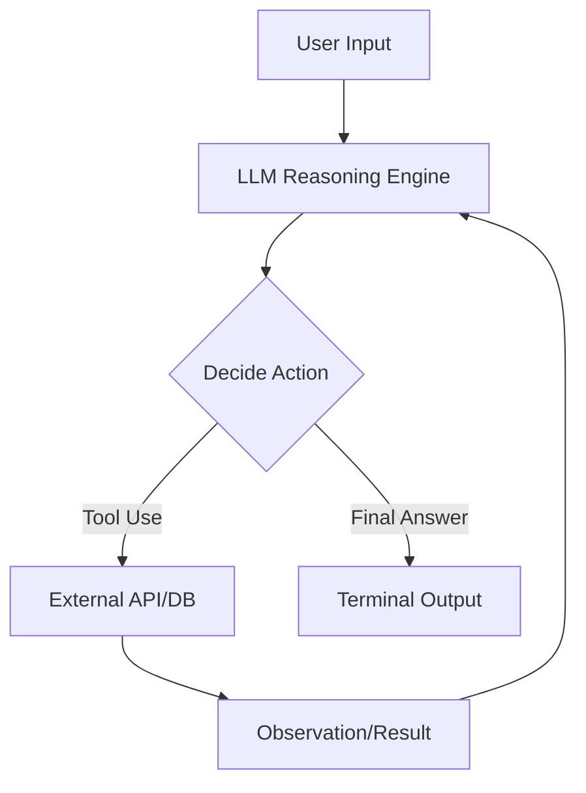

# LLM-Based Agents: Tool Use, ReAct, Chain-of-Thought Prompting

> LLM-based agents leverage reasoning, planning, and external tool execution to transform static language models into autonomous systems capable of solving multi-step, grounded problems.

## Overview

LLM-based agents represent the shift from "chatbots" to "autonomous agents." While a standard Large Language Model (LLM) is essentially a next-token predictor, an agent wraps the model in a control loop that allows it to interact with the external world. This paradigm treats the LLM as a "reasoning engine" that decomposes complex user intents into actionable steps, utilizes APIs or code interpreters, and observes the environment to correct its trajectory.

Historically, the field evolved from simple instruction-following (Zero-shot) to explicit step-by-step reasoning (Chain-of-Thought), and eventually to the ReAct (Reason + Act) pattern. The latter is critical because it solves the "hallucination" and "data-staleness" problems of pure LLMs by forcing the model to ground its outputs in external evidence or tool results. This architecture is now the foundation for modern AI systems deployed in IDE copilots, automated data analysis suites, and robotic process automation.

## 2. Visual Intuition
:::demo
<div style="background:#1e1e1e;padding:16px;border-radius:10px;color:#e5e7eb;font-family:system-ui,sans-serif">
  <h3 style="margin:0 0 8px 0;color:#7dd3fc">LLM-Based Agents: Tool Use, ReAct, Chain-of-Thought Prompting - Concept Map</h3>
  <svg width="100%" height="280" viewBox="0 0 640 280" role="img" aria-label="LLM-Based Agents: Tool Use, ReAct, Chain-of-Thought Prompting visual intuition" style="background:#111827;border-radius:8px">
    <rect x="24" y="28" width="180" height="64" rx="10" fill="#1d4ed8" />
    <text x="114" y="66" text-anchor="middle" fill="#e5e7eb" font-size="14">Problem</text>
    <rect x="230" y="28" width="180" height="64" rx="10" fill="#0f766e" />
    <text x="320" y="66" text-anchor="middle" fill="#e5e7eb" font-size="14">Process</text>
    <rect x="436" y="28" width="180" height="64" rx="10" fill="#7c3aed" />
    <text x="526" y="66" text-anchor="middle" fill="#e5e7eb" font-size="14">Outcome</text>

    <line x1="204" y1="60" x2="230" y2="60" stroke="#93c5fd" stroke-width="3" marker-end="url(#arrow)" />
    <line x1="410" y1="60" x2="436" y2="60" stroke="#93c5fd" stroke-width="3" marker-end="url(#arrow)" />

    <rect x="24" y="130" width="592" height="120" rx="10" fill="#0b1220" stroke="#334155" />
    <text x="320" y="156" text-anchor="middle" fill="#cbd5e1" font-size="14">Key intuition for LLM-Based Agents: Tool Use, ReAct, Chain-of-Thought Prompting</text>
    <text x="320" y="182" text-anchor="middle" fill="#94a3b8" font-size="12">Track state changes, constraints, and final behavior.</text>
    <text x="320" y="206" text-anchor="middle" fill="#94a3b8" font-size="12">Use this as a mental model before formal proofs or code.</text>

    <defs>
      <marker id="arrow" markerWidth="10" markerHeight="10" refX="8" refY="3" orient="auto">
        <polygon points="0 0, 10 3, 0 6" fill="#93c5fd" />
      </marker>
    </defs>
  </svg>
  <p style="margin-top:10px;color:#cbd5e1">Interactive-ready visual scaffold for the topic.</p>
</div>
:::
*Caption: Animated illustration of LLM-Based Agents: Tool Use, ReAct, Chain-of-Thought Prompting*

## Core Theory

### 1. Chain-of-Thought (CoT)
CoT improves reasoning by prompting the model to generate intermediate steps before reaching a final answer. Formally, if $y$ is the final answer, $x$ is the prompt, and $z$ represents the intermediate steps:
$$P(y|x) = \sum_{z} P(y|x, z) P(z|x)$$
By maximizing the joint probability of $z$ and $y$ rather than just $y$, the model maintains logical coherence over complex multi-step tasks.

### 2. The ReAct Pattern
ReAct stands for "Reasoning and Acting." Unlike standard CoT, the model produces a thought, an action, and then consumes an observation:
1. **Thought**: $t_i = \text{LLM}(x, \{t_1, a_1, o_1, \dots, t_{i-1}, a_{i-1}, o_{i-1}\})$
2. **Action**: $a_i = \text{Parse}(t_i)$
3. **Observation**: $o_i = \text{ToolExec}(a_i)$

This allows the agent to navigate partially observable environments where the state depends on the result of the action.

## Visual Diagram

*The ReAct loop: The LLM iteratively plans and executes until it reaches a conclusion.*

## Code Example

```python
import json

# A mock tool for demonstration
def search_database(query):
    data = {"revenue_2023": "$5M", "growth": "20%"}
    return data.get(query, "Data not found")

class SimpleAgent:
    def __init__(self):
        self.history = []

    def step(self, prompt):
        # In a real scenario, this calls openai.ChatCompletion
        # We simulate the ReAct pattern output:
        print(f"Thought: I need to check the {prompt}")
        observation = search_database(prompt)
        print(f"Observation: {observation}")
        return f"The {prompt} is {observation}"

agent = SimpleAgent()
result = agent.step("revenue_2023")
print(f"Final Answer: {result}")

# Expected Output:
# Thought: I need to check the revenue_2023
# Observation: $5M
# Final Answer: The revenue_2023 is $5M
```

## Interactive Demo
:::demo
<!DOCTYPE html>
<html>
<style>
  .box { border: 1px solid #444; padding: 10px; margin: 10px; border-radius: 8px; }
  .active { border-color: #3b82f6; background: #1e293b; }
</style>
<body>
  <h3>ReAct Visualizer</h3>
  <div id="state">State: Reasoning...</div>
  <button onclick="nextStep()">Step Forward</button>
  <script>
    let step = 0;
    const states = ["Reasoning (Planning)", "Acting (Calling API)", "Observing (Refining)"];
    function nextStep() {
      step = (step + 1) % states.length;
      document.getElementById('state').innerText = "State: " + states[step];
    }
  </script>
</body>
</html>
:::

## Worked Example

**Goal:** "Find the stock price of Apple and calculate 10% tax."

1. **Step 1 (Reasoning):** "I need to find the current AAPL price."
2. **Step 2 (Action):** `get_stock_price("AAPL")` $\rightarrow$ $175.00$
3. **Step 3 (Reasoning):** "The price is 175. Now I need to multiply by 0.10."
4. **Step 4 (Action):** `calculate(175 * 0.1)` $\rightarrow$ $17.50$
5. **Step 5 (Final Answer):** "The 10% tax on AAPL ($175) is $17.50."

## Industry Applications
- **Salesforce (Einstein GPT)**: Uses agents to ground CRM data via retrieval-augmented generation.
- **LangChain/AutoGPT**: Frameworks used by startups to build autonomous coding and web-scraping bots.
- **GitHub Copilot**: Uses agentic workflows to decompose feature requests into file-specific edits.

## Practice Problems

### Easy
1. Explain why a CoT prompt outperforms a direct prompt for arithmetic word problems. *(Hint: Intermediate steps reduce the cognitive load on the attention mechanism.)*

### Medium
2. Implement a ReAct loop that uses a calculator tool for expressions.
3. Contrast "Parallel Tool Use" vs "Sequential Tool Use." When would you prefer the former?

### Hard
4. Design a self-healing agent loop: what happens when `ToolExec` returns a `404 Error`? How should the agent state update?

## Interactive Quiz
:::quiz
**Q1:** What is the primary advantage of ReAct over standard CoT?
- A) Faster inference latency.
- B) Interaction with external environments.
- C) Reduced parameter count.
- D) Increased training speed.
> B — ReAct introduces an "Observation" phase, allowing the agent to update its knowledge based on external reality rather than just internal model weights.

**Q2:** In the CoT formula $P(y|x) = \sum P(y|x,z)P(z|x)$, what does $z$ represent?
- A) The input prompt.
- B) The final output tokens.
- C) The intermediate reasoning steps.
- D) The model's latent dimensions.
> C — The variable $z$ represents the chain of thought or scratchpad tokens that bridge the input $x$ to the result $y$.

**Q3:** What is the risk of an "infinite loop" in an agentic system?
- A) Too many parameters.
- B) The agent continues to call tools without converging.
- C) Overfitting on training data.
- D) The model cannot handle streaming.
> B — Without a max-step constraint or terminal condition, an agent may cycle between thoughts and observations indefinitely.
:::

## Interview Questions

**Q: Explain ReAct to a senior engineer.**
*A: ReAct is a prompt-engineering and control-flow pattern that interleaves model reasoning with external environment observations. It treats the LLM as a policy function in a Markov Decision Process, where the action space consists of both natural language thoughts and API invocations. This grounds the agent, preventing hallucinations by forcing verification of facts against tools.*

**Q: What is the complexity of an agentic workflow?**
*A: Time complexity is $O(n \cdot m)$ where $n$ is the number of agent steps and $m$ is the latency of tool calls/model inference per step. Space complexity is $O(k)$ where $k$ is the context window size required to maintain the history of thoughts, actions, and observations.*

**Q: How do you prevent "Agent Stall"?**
*A: I implement a "Max Iteration" counter and a "Confidence Threshold." If the agent repeats the same tool call twice or exceeds 10 steps, we trigger a fallback routine or ask the user for human-in-the-loop intervention.*

**Q: Design a system to debug code using an agent.**
*A: Use a tool-enabled agent: (1) Run code, (2) Capture `stderr`, (3) Feed `stderr` as an Observation back to the LLM, (4) LLM suggests a fix, (5) Repeat until the test suite passes or max-tries reached.*

## Key Takeaways
- Agents convert LLMs from text generators to active solvers.
- ReAct is the standard pattern for ground-truth-based interactions.
- Chain-of-Thought is the foundational reasoning mechanism.
- Tool use requires strict schema definition (e.g., JSON mode).
- Always include "Self-Correction" paths in your agent design.

## Common Misconceptions
- ❌ Agents can "think" on their own → ✅ Agents are reactive loops steered by a probabilistic next-token predictor.
- ❌ ReAct increases model accuracy → ✅ ReAct increases grounding and interpretability, not necessarily the raw model intelligence.

## Related Topics
- [[llm-fine-tuning]] — How to optimize agents for specific domains.
- [[retrieval-augmented-generation]] — How agents pull context from vector stores.
- [[prompt-engineering]] — The base techniques for building effective reasoning prompts.
