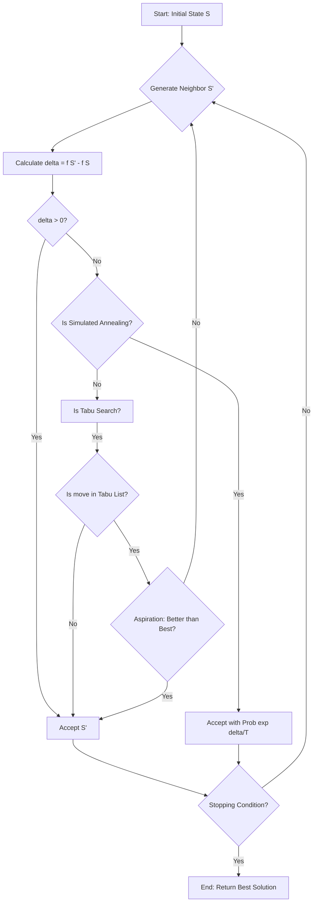

# Local Search: Hill Climbing, Simulated Annealing, and Tabu Search

> **Local search is a metaheuristic framework for solving computationally hard optimization problems by iteratively moving from a current solution to a neighboring solution that improves the objective function, potentially sacrificing global optimality for efficiency in massive state spaces.**

## 1. Historical Background & Motivation

The genesis of local search algorithms traces back to the early days of combinatorial optimization in the 1950s and 60s, primarily driven by the need to solve the Traveling Salesperson Problem (TSP) and large-scale industrial scheduling. While exhaustive search algorithms like A* or Dijkstra’s ensure optimality, they suffer from the "curse of dimensionality"—in many real-world problems, the state space $S$ grows factorially ($n!$) or exponentially ($2^n$), making systematic exploration impossible. Hill Climbing emerged as the simplest greedy approach, but its susceptibility to local optima necessitated more robust frameworks.

In 1983, Kirkpatrick et al. revolutionized the field by introducing **Simulated Annealing (SA)**, an algorithm inspired by statistical mechanics and the physical process of annealing in metallurgy. This marked a paradigm shift: for the first time, an algorithm purposefully accepted "bad" moves to escape local traps, backed by the mathematical foundations of Markov Chains. Shortly after, in 1986, Fred Glover formalized **Tabu Search**, introducing the concept of "memory" in search—mimicking human cognitive processes by tracking recently visited states to force exploration of new regions. Today, these algorithms are the backbone of modern EDA (Electronic Design Automation), airline crew scheduling, and the training of certain neural network architectures where gradient descent is inapplicable.

## 2. Visual Intuition
:::demo
<div style="background:#1e1e1e;padding:16px;border-radius:10px;color:#e5e7eb;font-family:system-ui,sans-serif">
  <h3 style="margin:0 0 8px 0;color:#7dd3fc">Local Search: Hill Climbing, Simulated Annealing, and Tabu Search - Concept Map</h3>
  <svg width="100%" height="280" viewBox="0 0 640 280" role="img" aria-label="Local Search: Hill Climbing, Simulated Annealing, and Tabu Search visual intuition" style="background:#111827;border-radius:8px">
    <rect x="24" y="28" width="180" height="64" rx="10" fill="#1d4ed8" />
    <text x="114" y="66" text-anchor="middle" fill="#e5e7eb" font-size="14">Problem</text>
    <rect x="230" y="28" width="180" height="64" rx="10" fill="#0f766e" />
    <text x="320" y="66" text-anchor="middle" fill="#e5e7eb" font-size="14">Process</text>
    <rect x="436" y="28" width="180" height="64" rx="10" fill="#7c3aed" />
    <text x="526" y="66" text-anchor="middle" fill="#e5e7eb" font-size="14">Outcome</text>

    <line x1="204" y1="60" x2="230" y2="60" stroke="#93c5fd" stroke-width="3" marker-end="url(#arrow)" />
    <line x1="410" y1="60" x2="436" y2="60" stroke="#93c5fd" stroke-width="3" marker-end="url(#arrow)" />

    <rect x="24" y="130" width="592" height="120" rx="10" fill="#0b1220" stroke="#334155" />
    <text x="320" y="156" text-anchor="middle" fill="#cbd5e1" font-size="14">Key intuition for Local Search: Hill Climbing, Simulated Annealing, and Tabu Search</text>
    <text x="320" y="182" text-anchor="middle" fill="#94a3b8" font-size="12">Track state changes, constraints, and final behavior.</text>
    <text x="320" y="206" text-anchor="middle" fill="#94a3b8" font-size="12">Use this as a mental model before formal proofs or code.</text>

    <defs>
      <marker id="arrow" markerWidth="10" markerHeight="10" refX="8" refY="3" orient="auto">
        <polygon points="0 0, 10 3, 0 6" fill="#93c5fd" />
      </marker>
    </defs>
  </svg>
  <p style="margin-top:10px;color:#cbd5e1">Interactive-ready visual scaffold for the topic.</p>
</div>
:::
*Caption: A visual comparison of search strategies. While a pure hill climber would get stuck in the first peak it encounters, Simulated Annealing uses probabilistic "downhill" moves to explore the broader landscape, eventually settling in the global maximum as the "temperature" cools.*

## 3. Core Theory & Mathematical Foundations

Local search operates on a **State Space Landscape**. We define a problem by a state space $S$ and an objective function $f: S \to \mathbb{R}$. The goal is to find $s^* \in S$ such that $f(s^*) \geq f(s)$ for all $s \in S$ (maximization).

### 3.1 The Neighborhood Structure
The most critical component of any local search is the **Neighborhood Function** $N: S \to \mathcal{P}(S)$. For a state $s$, $N(s)$ is the set of states reachable in a single "move."
- **Discrete Space:** In TSP, a neighborhood might be all tours reachable by swapping two cities (2-opt).
- **Continuous Space:** A neighborhood might be $s \pm \epsilon$.

The "ruggedness" of the landscape depends entirely on $N$. If the neighborhood is too small, the algorithm gets stuck easily. If too large, the search degenerates into a random search.

### 3.2 Hill Climbing Variations
Hill Climbing is a mathematical manifestation of the "greedy" philosophy.
1.  **Steepest-Ascent:** $s_{t+1} = \text{argmax}_{s' \in N(s_t)} f(s')$. It examines all neighbors and picks the best.
2.  **Stochastic Hill Climbing:** Chooses at random from the uphill moves, with the probability of selection potentially weighted by the magnitude of improvement.
3.  **First-Choice:** Generates neighbors randomly until one is found that is better than the current state.

**The Local Optimum Problem:** A state $s$ is a local maximum if $f(s) \geq f(s')$ for all $s' \in N(s)$. Without stochastic elements, hill climbing terminates here, even if $s$ is far inferior to the global maximum $s^*$.

### 3.3 Simulated Annealing and the Metropolis Criterion
SA models the search as a non-stationary Markov Chain. At each step $t$, a neighbor $s'$ is chosen. If $f(s') > f(s)$, we move to $s'$. If $f(s') \leq f(s)$, we move to $s'$ with probability:
$$P(\text{accept}) = \exp\left(\frac{f(s') - f(s)}{T}\right)$$
where $T$ is the **Temperature**.

**The Annealing Schedule:** $T$ starts high ($T \to \infty$, making the search a random walk) and decreases toward zero ($T \to 0$, making the search greedy).
**Convergence Theorem:** If the cooling schedule is logarithmic, e.g., $T(t) = \frac{C}{\log(1+t)}$, SA is guaranteed to converge to the global optimum as $t \to \infty$. However, in practice, faster geometric schedules ($T_{t+1} = \alpha T_t, \alpha \in [0.8, 0.99]$) are used.

### 3.4 Tabu Search and Deterministic Memory
Tabu Search (TS) prevents cycling and encourages exploration via a **Tabu List** $L$.
- **Short-term memory:** Stores the last $k$ moves. A move is "Tabu" (forbidden) if it exists in $L$.
- **Aspiration Criterion:** A rule that overrides Tabu status. Most commonly: "If a Tabu move results in a state better than the best found so far ($f(s') > f_{best}$), accept it anyway."

### 3.5 Formal Analysis (Complexity / Correctness)
- **Time Complexity:** For Hill Climbing, $O(k \cdot |N|)$ where $k$ is the number of iterations and $|N|$ is the neighborhood size. For SA, $k$ is usually pre-determined by the schedule.
- **Space Complexity:** $O(1)$ for Hill Climbing and SA (they only store the current state). Tabu Search is $O(L)$ where $L$ is the size of the Tabu list.
- **Optimality:** Local search is **not** guaranteed to find the global optimum in polynomial time. It is a heuristic approach for NP-Hard problems where $P \neq NP$ implies no polynomial-time optimal algorithm exists.

## 4. Algorithm / Process (Step-by-Step)

### Simulated Annealing Procedure:
1.  **Initialize:** Choose an initial state $s$, initial temperature $T_{max}$, and minimum temperature $T_{min}$.
2.  **Evaluate:** Calculate $f(s)$.
3.  **Perturb:** Select a random neighbor $s' \in N(s)$.
4.  **Calculate $\Delta E$:** $\Delta E = f(s') - f(s)$.
5.  **Decide:**
    *   If $\Delta E > 0$, move to $s'$.
    *   If $\Delta E \leq 0$, generate random $r \in [0, 1]$. If $r < \exp(\Delta E / T)$, move to $s'$.
6.  **Cool:** $T = T \times \alpha$ (where $\alpha < 1$).
7.  **Terminate:** If $T < T_{min}$ or max iterations reached, return $s_{best}$.

## 5. Visual Diagram


*Caption: The unified logic flow for Local Search variants. Note how SA and Tabu introduce secondary checks to escape local optima that would stop a standard Hill Climber.*

## 6. Implementation

### 6.1 Core Implementation: Simulated Annealing for TSP
This implementation solves the Traveling Salesperson Problem by swapping city indices.

```python
import math
import random

def simulated_annealing(initial_state, objective_fn, neighbor_fn, temp, alpha, max_iter):
    """
    Simulated Annealing for combinatorial optimization.
    
    Args:
        initial_state: The starting configuration (e.g., list of cities)
        objective_fn: Function to minimize (e.g., total distance)
        neighbor_fn: Function to generate a random neighbor
        temp: Initial temperature
        alpha: Cooling rate (0 < alpha < 1)
        max_iter: Iterations per temperature step
        
    Returns:
        Best state found, Best objective value
    """
    current_s = initial_state
    current_f = objective_fn(current_s)
    best_s = current_s
    best_f = current_f
    
    T = temp
    
    while T > 0.01:
        for _ in range(max_iter):
            # Generate a neighbor
            neighbor = neighbor_fn(current_s)
            neighbor_f = objective_fn(neighbor)
            
            # Change in objective (we minimize, so delta = current - neighbor)
            delta = current_f - neighbor_f
            
            # Acceptance probability
            if delta > 0 or random.random() < math.exp(delta / T):
                current_s = neighbor
                current_f = neighbor_f
                
                # Update global best
                if current_f < best_f:
                    best_s = current_s
                    best_f = current_f
        
        T *= alpha  # Geometric cooling
        
    return best_s, best_f

# Example Usage: TSP Distance minimization
def tsp_dist(path):
    # Dummy distance function: sum of absolute differences
    return sum(abs(path[i] - path[i-1]) for i in range(len(path)))

def tsp_neighbor(path):
    # 2-opt swap: pick two indices and swap
    new_path = path[:]
    i, j = random.sample(range(len(path)), 2)
    new_path[i], new_path[j] = new_path[j], new_path[i]
    return new_path

# Initial path: [0, 1, 2, 3, 4, 5, 6, 7, 8, 9]
# Result will be a sorted or reverse sorted list (minimum distance)
best_path, score = simulated_annealing(list(range(10)), tsp_dist, tsp_neighbor, 100, 0.95, 100)
print(f"Best Path: {best_path} with Score: {score}")
```

### 6.2 Optimized Variant: Tabu Search with Tenure
In production, Tabu Search often uses a "Tabu Tenure" which is dynamic.

```python
from collections import deque

def tabu_search(initial_state, objective_fn, get_neighbors, tabu_size, max_steps):
    """
    Tabu Search for discrete optimization with aspiration.
    """
    current_s = initial_state
    best_s = initial_state
    tabu_list = deque(maxlen=tabu_size) # Short-term memory
    
    for _ in range(max_steps):
        neighbors = get_neighbors(current_s)
        # Filter neighbors: must not be in tabu list OR meet aspiration
        valid_neighbors = []
        for n in neighbors:
            if n not in tabu_list or objective_fn(n) < objective_fn(best_s):
                valid_neighbors.append(n)
        
        if not valid_neighbors:
            break
            
        # Move to the best valid neighbor (even if it's worse than current)
        next_s = min(valid_neighbors, key=lambda x: objective_fn(x))
        
        tabu_list.append(next_s)
        current_s = next_s
        
        if objective_fn(current_s) < objective_fn(best_s):
            best_s = current_s
            
    return best_s
```

### 6.3 Common Pitfalls in Code
1.  **Objective Inversion:** Mixing up minimization and maximization. In SA, if minimizing, $\Delta E = f(s) - f(s')$. If maximizing, $\Delta E = f(s') - f(s)$.
2.  **Neighborhood Bias:** If your `neighbor_fn` cannot reach certain parts of the state space, you will never find the global optimum (lack of ergodicity).
3.  **Temperature Overflow:** In SA, if $T$ is very small and $\Delta E$ is large, `math.exp(delta/T)` can cause a floating-point underflow or overflow. Use `max(-700, delta/T)` to clip values.
4.  **Tabu List Scaling:** Using a fixed-size list for a state space that expands dynamically can lead to cycles if the list is too short.

## 7. Interactive Demo

:::demo
<!-- title: Local Search Landscape Explorer -->
<!DOCTYPE html>
<html>
<head>
<meta charset="utf-8">
<style>
  body { margin:0; background:#0f1117; color:#e5e7eb; font-family: system-ui, sans-serif; font-size:13px; padding:16px; }
  canvas { background: #1a1d24; border-radius: 8px; width: 100%; height: 200px; cursor: crosshair; }
  .controls { display: flex; gap: 10px; margin-top: 10px; flex-wrap: wrap; }
  button { background: #3b82f6; color: white; border: none; padding: 6px 12px; border-radius: 4px; cursor: pointer; }
  button:hover { background: #2563eb; }
  .stats { margin-top: 10px; font-family: monospace; color: #10b981; }
  label { font-weight: bold; }
</style>
</head>
<body>
  <label>Optimization Landscape (Find the Peak!)</label>
  <canvas id="viz"></canvas>
  <div class="controls">
    <button onclick="startHillClimb()">Hill Climbing</button>
    <button onclick="startSA()">Simulated Annealing</button>
    <button onclick="reset()">Reset</button>
    <span>Temp: <span id="tempVal">0</span></span>
  </div>
  <div class="stats" id="stats">Ready...</div>

<script>
  const canvas = document.getElementById('viz');
  const ctx = canvas.getContext('2d');
  const stats = document.getElementById('stats');
  const tempDisp = document.getElementById('tempVal');
  
  let width, height;
  let landscape = [];
  let currentX = 50;
  let running = false;

  function init() {
    width = canvas.width = canvas.offsetWidth;
    height = canvas.height = canvas.offsetHeight;
    landscape = [];
    for(let i=0; i<width; i++) {
      // Generate a rugged landscape using multiple sine waves
      let val = Math.sin(i*0.02) * 40 + Math.sin(i*0.05) * 20 + Math.sin(i*0.1) * 10;
      landscape.push(height/2 - val);
    }
    draw();
  }

  function draw() {
    ctx.clearRect(0,0,width,height);
    ctx.strokeStyle = '#4b5563';
    ctx.beginPath();
    for(let i=0; i<width; i++) {
      ctx.lineTo(i, landscape[i]);
    }
    ctx.stroke();
    
    // Draw agent
    ctx.fillStyle = '#ef4444';
    ctx.beginPath();
    ctx.arc(currentX, landscape[Math.floor(currentX)], 5, 0, Math.PI*2);
    ctx.fill();
  }

  async function startHillClimb() {
    if(running) return;
    running = true;
    while(running) {
      let nextLeft = Math.max(0, currentX - 1);
      let nextRight = Math.min(width - 1, currentX + 1);
      
      // We want to minimize height (go higher on screen)
      if(landscape[nextLeft] < landscape[currentX]) {
        currentX = nextLeft;
      } else if(landscape[nextRight] < landscape[currentX]) {
        currentX = nextRight;
      } else {
        stats.innerText = "Stuck in Local Optimum!";
        running = false;
        break;
      }
      draw();
      await new Promise(r => setTimeout(r, 20));
    }
  }

  async function startSA() {
    if(running) return;
    running = true;
    let temp = 50;
    while(running && temp > 0.1) {
      let step = (Math.random() - 0.5) * 20;
      let nextX = Math.max(0, Math.min(width - 1, Math.floor(currentX + step)));
      
      let delta = landscape[currentX] - landscape[nextX]; // Positive if nextX is higher
      
      if(delta > 0 || Math.random() < Math.exp(delta / temp)) {
        currentX = nextX;
      }
      
      temp *= 0.99;
      tempDisp.innerText = temp.toFixed(2);
      draw();
      await new Promise(r => setTimeout(r, 20));
    }
    running = false;
    stats.innerText = "SA Finished Cooling.";
  }

  function reset() {
    running = false;
    currentX = Math.random() * width;
    stats.innerText = "Reset.";
    draw();
  }

  window.addEventListener('resize', init);
  init();
</script>
</body>
</html>
:::

## 8. Worked Examples

### Example 1 — 8-Queens Problem
**State:** A configuration of 8 queens on an $8 \times 8$ board, one per column. Represented as an array $Q = [r_1, r_2, ..., r_8]$.
**Objective Function $f(s)$:** Number of pairs of queens attacking each other (to be minimized). $f(s) = 0$ is the global optimum.
**Neighborhood $N(s)$:** All states reachable by moving a single queen to a different row in its column (56 neighbors).

**Trace of Steepest-Ascent Hill Climbing:**
1.  **Initial State $s_0$**: $[1, 1, 1, 1, 1, 1, 1, 1]$. $f(s_0) = 28$ (all pairs attack).
2.  **Evaluate Neighbors**: Calculate $f(s')$ for all 56 neighbors.
3.  **Best Neighbor**: Moving $Q[2]$ to row 5 reduces $f(s)$ to 18.
4.  **Iteration 2**: Current $s_1 = [1, 5, 1, 1, 1, 1, 1, 1]$.
5.  **Local Optimum**: Eventually, we reach a state like $[2, 4, 6, 8, 3, 1, 7, 5]$ where $f(s) = 1$. Every single move of any queen increases $f(s)$. Pure Hill Climbing stops here.

### Example 2 — Simulated Annealing for Schedule Optimization
Consider a university with 3 exam slots and 2 courses with overlapping students.
**Initial State**: Slot 1: {CS101, BIO101}, Slot 2: {}, Slot 3: {}.
**Objective**: Number of conflicts (students with 2 exams in 1 slot). Current conflicts: 10.
**Neighbor**: Move BIO101 to Slot 2.
**Calculation**:
- New conflicts: 0. $\Delta E = 10 - 0 = 10$. Move accepted ($10 > 0$).
- Next Neighbor: Move CS101 to Slot 2. New conflicts: 10. $\Delta E = 0 - 10 = -10$.
- If $T = 20$, $P(\text{accept}) = \exp(-10 / 20) = 0.606$. We might accept this "bad" move to explore if moving other courses later yields a better global schedule.

## 9. Comparison with Alternatives

| Approach | Time Complexity | Space Complexity | Optimality | Best Used When |
|---|---|---|---|---|
| **A* Search** | $O(b^d)$ | $O(b^d)$ | Guaranteed | Small state spaces, optimality is non-negotiable. |
| **Hill Climbing** | $O(k|N|)$ | $O(1)$ | No | Very fast, simple landscape. |
| **Simulated Annealing** | $O(k|N|)$ | $O(1)$ | Probabilistic | Rugged landscape, time allows for cooling. |
| **Tabu Search** | $O(k|N|)$ | $O(L)$ | No | Combinatorial problems with many plateaus. |
| **Genetic Algorithms** | $O(pop \cdot k)$ | $O(pop)$ | No | Landscape is "discontinuous" or multi-modal. |

## 10. Industry Applications & Real Systems

- **NVIDIA (VLSI Floorplanning)**: When designing a GPU, billions of transistors must be arranged to minimize wire length and heat. Simulated Annealing is the industry standard for "macro-placement," where blocks of the chip are iteratively moved to find a thermally stable, compact layout.
- **Amazon (Vehicle Routing)**: Amazon's "Last Mile" delivery uses variants of Tabu Search to optimize routes for thousands of vans. The search incorporates time windows, vehicle capacity, and driver breaks, where a "move" might be swapping a delivery between two vans.
- **Google (Data Center Workload Balancing)**: To minimize electricity costs, Google uses local search to migrate virtual machines across physical servers. The objective function includes power usage effectiveness (PUE) and latency constraints.
- **NASA (Deep Space Network Scheduling)**: Scheduling the 70m radio antennas to communicate with probes like Voyager or Mars Rovers is a massive combinatorial problem. Local search handles the complex constraints of orbital mechanics and antenna availability.

## 11. Practice Problems

### 🟢 Easy
1.  **Bit-String Maximization**: Given a function $f(x)$ that counts the number of '1's in a 100-bit string, why will Hill Climbing always find the global optimum?
    *Hint: Consider if there are any local maxima that aren't global maxima.*
    *Expected complexity: O(100)*

### 🟡 Medium
2.  **SA Cooling Rates**: You are running SA with a geometric cooling $\alpha = 0.5$ and $\alpha = 0.99$. Which one is more likely to act like a random walk for longer, and which one is more likely to get stuck in a local optimum? Explain using the probability formula.
    *Hint: Think about how fast $T$ approaches 0.*

3.  **Tabu List Tenure**: In a search space of size $N=1000$, you set your Tabu List size to $L=1001$. What is the behavior of the algorithm after 1001 steps?
    *Hint: Consider the available move set.*

### 🔴 Hard
4.  **Graph Partitioning**: Use SA to partition a graph of $V$ vertices into two equal sets such that the number of edges between sets is minimized (Min-Cut). Define the neighborhood function and the objective function. Prove that your neighborhood function makes the state space connected.
    *Hint: A move could be swapping one vertex from set A with one from set B.*
    *Expected complexity: O(E) per iteration.*

5.  **Infinite Temperature Limit**: Prove that as $T \to \infty$, Simulated Annealing becomes a uniform random walk over the state space, regardless of the objective function values.
    *Hint: Calculate the limit of $\exp(\Delta E / T)$ as $T \to \infty$.*

## 12. Interactive Quiz

:::quiz
**Q1: What is the primary purpose of the 'Temperature' parameter in Simulated Annealing?**
- A) To increase the execution speed of the algorithm.
- B) To control the probability of accepting moves that decrease the objective value.
- C) To determine the size of the neighborhood.
- D) To store the best solution found so far.
> B — Temperature scales the energy difference. At high $T$, the exponent is near 0, making the probability near 1.

**Q2: Which search algorithm maintains a memory of recently visited states?**
- A) Hill Climbing
- B) Simulated Annealing
- C) Tabu Search
- D) Breadth-First Search
> C — Tabu Search uses the Tabu List to prevent cycling back to recently visited states.

**Q3: If your search landscape is a perfectly smooth "convex" hill with one peak, which algorithm is most efficient?**
- A) Simulated Annealing
- B) Tabu Search
- C) Genetic Algorithm
- D) Steepest-Ascent Hill Climbing
> D — On a convex landscape, the first uphill move is always progress toward the global peak. SA and Tabu add unnecessary overhead.

**Q4: In Tabu Search, what does the "Aspiration Criterion" do?**
- A) It ends the search if the goal is reached.
- B) It allows a Tabu move if it results in a new global best.
- C) It randomly resets the search to a new state.
- D) It increases the size of the Tabu list.
> B — Aspiration allows us to be flexible; if a forbidden move is exceptionally good, we ignore its Tabu status.

**Q5: Why is the choice of "Neighborhood Function" $N(s)$ critical?**
- A) It defines the time complexity of a single step.
- B) It determines if the global optimum is even reachable from the start state.
- C) It influences the shape (ruggedness) of the landscape.
- D) All of the above.
> D — The neighborhood defines both the connectivity of the graph and the efficiency/topology of the search.
:::

## 13. Interview Preparation

### Conceptual Questions
**Q: Explain the difference between Hill Climbing and Simulated Annealing to a non-technical stakeholder.**
*A: Imagine you are trying to find the highest peak in a mountain range during a thick fog. Hill Climbing is like only ever taking a step if it goes up; you'll reach a peak, but it might be a small hill. Simulated Annealing is like occasionally taking a step down or sideways. Early on, you're willing to wander quite a bit to find the base of the tallest mountain. As the "fog" clears (the temperature cools), you become more disciplined and only move upward until you reach the very top.*

**Q: What are the time and space complexities? Derive them.**
*A: Space is $O(S)$ where $S$ is the state representation size, as we only store the current (and best) state. Time is $O(k \cdot |N|)$ where $k$ is iterations and $|N|$ is the neighborhood size. Note that for large $|N|$, we often use "First-Choice" HC or stochastic SA to avoid $O(|N|)$ neighbor evaluation.*

**Q: How would you choose the initial temperature for Simulated Annealing?**
*A: A common heuristic is to perform a short random walk, calculate the average $\Delta E$ for "bad" moves, and set $T_0$ such that $\exp(-\Delta E_{avg} / T_0) \approx 0.8$. This ensures we start with high exploration.*

### Quick Reference (Cheat Sheet)
| Property | Hill Climbing | Simulated Annealing | Tabu Search |
|---|---|---|---|
| **Greedy?** | Yes | No (Probabilistic) | No (Memory-based) |
| **Escapes Local Optima?** | No | Yes | Yes |
| **Memory?** | None | None | Tabu List |
| **Parameters** | None | $T_0, \alpha, \text{steps}$ | List Size, Aspiration |

## 14. Key Takeaways
1.  **Local Search is for "Where," not "How":** It finds a state that satisfies constraints, rather than a path to a goal.
2.  **Exploitation vs. Exploration:** Hill Climbing is pure exploitation. SA and Tabu balance both.
3.  **Landscape Matters:** The effectiveness of local search is highly dependent on how you define the "neighbor" of a state.
4.  **No Free Lunch:** No single metaheuristic is best for all problems; tuning parameters ($T$, $\alpha$, Tabu tenure) is often an empirical task.
5.  **Restart Strategy:** Random-Restart Hill Climbing (running it $N$ times from different spots) is often a baseline that beats complex SA implementations.

## 15. Common Misconceptions
- ❌ **"Simulated Annealing always finds the global optimum."** → ✅ **Correct understanding:** It only guarantees this in the limit of infinite time with a specific cooling schedule. In finite time, it is a heuristic.
- ❌ **"Tabu Search is just Hill Climbing with a list."** → ✅ **Correct understanding:** TS can accept *worse* moves even without the probabilistic element of SA, simply because the better moves are currently "Tabu."
- ❌ **"Local search is only for discrete problems."** → ✅ **Correct understanding:** While popular in combinatorial optimization, it is used in continuous spaces (e.g., Nelder-Mead simplex search).

## 16. Further Reading
- *Artificial Intelligence: A Modern Approach (Russell & Norvig), Chapter 4* — The definitive introduction to local search in AI.
- *Modern Heuristic Techniques for Combinatorial Problems (Colin Reeves)* — Deep dive into Tabu and SA.
- *Kirkpatrick, S., Gelatt, C.D., & Vecchi, M.P. (1983). "Optimization by Simulated Annealing"* — The original Science paper.
- *Glover, F. (1989). "Tabu Search — Part I"* — The foundational paper on Tabu memory structures.

## 17. Related Topics
- [[heuristic-design]] — How to create the objective functions used here.
- [[genetic-algorithms]] — A population-based alternative to local search.
- [[arc-consistency]] — Used in Constraint Satisfaction Problems (CSPs), which local search often solves (e.g., Min-Conflicts).
- [[monte-carlo-tree-search]] — Combines tree search with stochastic simulation.
