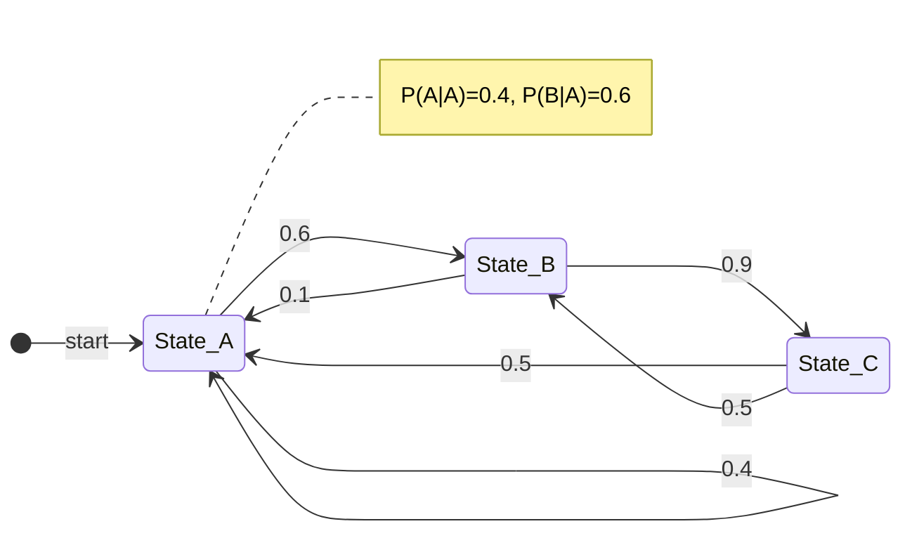

# Markov Chains and Stationary Distributions

> A Markov Chain is a stochastic model describing a sequence of possible events in which the probability of each event depends only on the state attained in the previous event, formally satisfying the memoryless property known as the Markov property.

## 1. Historical Background & Motivation

The genesis of Markov chains traces back to the early 20th century, specifically to the work of the Russian mathematician Andrey Markov. In 1906, Markov sought to extend the Law of Large Numbers to dependent variables. At the time, Pavel Nekrasov argued that independence was a necessary condition for the law to hold. Markov, driven by a desire to prove him wrong, formalized a class of dependent random variables where the future state is independent of the past, given the present. His first practical application was surprisingly linguistic: he analyzed the sequence of 20,000 letters in Alexander Pushkin’s novel *Eugene Onegin* to model the transitions between vowels and consonants, effectively creating the first statistical language model.

In modern computing, Markov chains are the bedrock of numerous transformative technologies. They are the mathematical engine behind Google’s PageRank algorithm, which revolutionized web search by modeling the internet as a massive graph where a "random surfer" moves between pages. In physics and chemistry, Markov Chain Monte Carlo (MCMC) methods allow scientists to sample from complex, high-dimensional probability distributions that are otherwise analytically intractable. In Artificial Intelligence, they serve as the foundational structure for Markov Decision Processes (MDPs), which underpin the entire field of Reinforcement Learning. Without the ability to model state-to-state transitions and identify long-term stable distributions, our ability to simulate weather patterns, predict stock market volatility, or generate coherent text would be non-existent.

## 2. Visual Intuition
:::demo
<div style="background:#1e1e1e;padding:16px;border-radius:10px;color:#e5e7eb;font-family:system-ui,sans-serif">
  <h3 style="margin:0 0 8px 0;color:#7dd3fc">Markov Chains and Stationary Distributions - Concept Map</h3>
  <svg width="100%" height="280" viewBox="0 0 640 280" role="img" aria-label="Markov Chains and Stationary Distributions visual intuition" style="background:#111827;border-radius:8px">
    <rect x="24" y="28" width="180" height="64" rx="10" fill="#1d4ed8" />
    <text x="114" y="66" text-anchor="middle" fill="#e5e7eb" font-size="14">Problem</text>
    <rect x="230" y="28" width="180" height="64" rx="10" fill="#0f766e" />
    <text x="320" y="66" text-anchor="middle" fill="#e5e7eb" font-size="14">Process</text>
    <rect x="436" y="28" width="180" height="64" rx="10" fill="#7c3aed" />
    <text x="526" y="66" text-anchor="middle" fill="#e5e7eb" font-size="14">Outcome</text>

    <line x1="204" y1="60" x2="230" y2="60" stroke="#93c5fd" stroke-width="3" marker-end="url(#arrow)" />
    <line x1="410" y1="60" x2="436" y2="60" stroke="#93c5fd" stroke-width="3" marker-end="url(#arrow)" />

    <rect x="24" y="130" width="592" height="120" rx="10" fill="#0b1220" stroke="#334155" />
    <text x="320" y="156" text-anchor="middle" fill="#cbd5e1" font-size="14">Key intuition for Markov Chains and Stationary Distributions</text>
    <text x="320" y="182" text-anchor="middle" fill="#94a3b8" font-size="12">Track state changes, constraints, and final behavior.</text>
    <text x="320" y="206" text-anchor="middle" fill="#94a3b8" font-size="12">Use this as a mental model before formal proofs or code.</text>

    <defs>
      <marker id="arrow" markerWidth="10" markerHeight="10" refX="8" refY="3" orient="auto">
        <polygon points="0 0, 10 3, 0 6" fill="#93c5fd" />
      </marker>
    </defs>
  </svg>
  <p style="margin-top:10px;color:#cbd5e1">Interactive-ready visual scaffold for the topic.</p>
</div>
:::
*Caption: A 3-state Markov process showing transitions between states A, B, and C. The thickness of the arrows represents the transition probability. Over time, the distribution of "mass" across these states often converges to a steady state.*

## 3. Core Theory & Mathematical Foundations

A Markov chain is defined over a state space $S = \{s_1, s_2, \dots, s_n\}$. The process moves from state to state at discrete time steps. We represent the probability of moving from state $i$ to state $j$ as $p_{ij}$.

### 3.1 The Markov Property
The defining characteristic of a Markov chain is the **First-Order Markov Property**. Formally, a sequence of random variables $X_1, X_2, X_3, \dots$ satisfies:
$$P(X_{n+1} = x | X_n = x_n, X_{n-1} = x_{n-1}, \dots, X_1 = x_1) = P(X_{n+1} = x | X_n = x_n)$$
This implies that the "future" is independent of the "past," conditioned on the "present." In engineering terms, the current state $X_n$ encapsulates all information necessary to predict the distribution of $X_{n+1}$.

### 3.2 The Transition Matrix
For a finite state space, we encapsulate these probabilities in a **Transition Probability Matrix** $P$, where:
$$P = \begin{bmatrix} p_{11} & p_{12} & \dots & p_{1n} \\ p_{21} & p_{22} & \dots & p_{2n} \\ \vdots & \vdots & \ddots & \vdots \\ p_{n1} & p_{n2} & \dots & p_{nn} \end{bmatrix}$$
Every row must sum to 1 ($ \sum_{j} p_{ij} = 1 $), making $P$ a **row-stochastic matrix**. 

To find the probability distribution after $k$ steps, given an initial distribution vector $\pi^{(0)}$, we compute:
$$\pi^{(k)} = \pi^{(0)} P^k$$
where $\pi^{(k)}$ is a row vector representing the probability of being in each state at time $k$.

### 3.3 Stationary Distributions
A stationary distribution $\pi$ is a probability distribution that remains invariant under the transition matrix $P$. Mathematically, $\pi$ is stationary if:
$$\pi P = \pi$$
subject to the constraints:
1. $\sum_i \pi_i = 1$
2. $\pi_i \ge 0$ for all $i$

In the language of linear algebra, $\pi$ is a **left eigenvector** of $P$ corresponding to the eigenvalue $\lambda = 1$. According to the **Perron-Frobenius Theorem**, any stochastic matrix has at least one eigenvalue equal to 1, ensuring a stationary distribution exists for any finite Markov chain.

### 3.4 Ergodicity and Convergence
For a Markov chain to converge to a *unique* stationary distribution regardless of the starting state, it must be **Ergodic**. Ergodicity requires two conditions:
1.  **Irreducibility**: It is possible to get from any state to any other state in a finite number of steps. There are no "traps" (absorbing states) or isolated sub-graphs.
2.  **Aperiodicity**: The chain does not get stuck in a cycle. Formally, for each state $i$, the greatest common divisor of the lengths of all paths returning to $i$ is 1.

If these hold, the **Fundamental Theorem of Markov Chains** states that:
$$\lim_{k \to \infty} P^k = \mathbf{1}\pi$$
where $\mathbf{1}$ is a column vector of ones, meaning every row of the converged matrix $P^\infty$ is the stationary distribution $\pi$.

### 3.5 Formal Analysis (Complexity / Correctness)
**Time Complexity:** 
- Calculating $\pi$ via **Power Iteration** ($\pi^{(k+1)} = \pi^{(k)}P$): $O(k \cdot N^2)$, where $N$ is the number of states and $k$ is the number of iterations until convergence. For sparse matrices (common in real-world graphs), this reduces to $O(k \cdot E)$ where $E$ is the number of non-zero transitions.
- Calculating $\pi$ via **Direct Matrix Inversion** (solving $(\mathbf{I} - P^T)\pi^T = 0$): $O(N^3)$ using Gaussian elimination.

**Correctness:**
The convergence is guaranteed by the spectral gap $\gamma = 1 - |\lambda_2|$, where $\lambda_2$ is the second-largest eigenvalue. The rate of convergence is geometric: $\|\pi^{(k)} - \pi\| \approx C |\lambda_2|^k$. A larger spectral gap means faster convergence.

## 4. Algorithm / Process (Step-by-Step)

To find the stationary distribution of a Markov Chain numerically (the most common industry approach):

1.  **Define the State Space**: List all possible discrete states $S$.
2.  **Construct the Transition Matrix $P$**:
    - Ensure all $p_{ij} \ge 0$.
    - Ensure each row sums to 1.0.
3.  **Check for Irreducibility**: Verify that the graph represented by $P$ is strongly connected.
4.  **Handle Periodicity (Optional)**: If the chain is periodic, apply a damping factor (e.g., the PageRank "teleportation" trick): $P_{adj} = (1-d)P + d(\frac{1}{N}J)$, where $J$ is an $N \times N$ matrix of ones.
5.  **Initialize Distribution**: Set $\pi^{(0)}$ as a uniform distribution $[1/N, 1/N, \dots, 1/N]$.
6.  **Iterate (Power Method)**:
    - Compute $\pi^{(new)} = \pi^{(old)} P$.
    - Check for convergence: $\|\pi^{(new)} - \pi^{(old)}\|_1 < \epsilon$.
    - Update $\pi^{(old)} = \pi^{(new)}$.
7.  **Normalize**: While the power method on a stochastic matrix should preserve the sum, floating-point errors may occur. Re-normalize $\pi$ so $\sum \pi_i = 1$.

## 5. Visual Diagram


*Caption: A state transition diagram for a 3-state system. Each arrow represents the transition probability $P(X_{t+1} | X_t)$. Note that outgoing probabilities from any single node sum to 1.0.*

## 6. Implementation

### 6.1 Core Implementation (NumPy)

```python
import numpy as np

def compute_stationary_distribution(P, max_iter=1000, tol=1e-10):
    """
    Computes the stationary distribution of a Markov Chain using Power Iteration.
    
    Args:
        P (np.ndarray): Transition matrix of shape (N, N).
        max_iter (int): Maximum number of iterations.
        tol (float): Convergence threshold.
        
    Returns:
        np.ndarray: The stationary distribution vector pi.
        
    Complexity: O(k * N^2) where k is iterations and N is states.
    """
    n = P.shape[0]
    # 1. Initialize pi uniformly
    pi = np.ones(n) / n
    
    for i in range(max_iter):
        pi_next = np.dot(pi, P)
        
        # 2. Check for convergence (L1 norm)
        if np.linalg.norm(pi_next - pi, ord=1) < tol:
            print(f"Converged in {i} iterations.")
            return pi_next
        
        pi = pi_next
        
    print("Reached max iterations without full convergence.")
    return pi

# Sample Matrix: 0=Sunny, 1=Rainy
# If Sunny: 80% stays Sunny, 20% becomes Rainy
# If Rainy: 40% stays Rainy, 60% becomes Sunny
P_weather = np.array([
    [0.8, 0.2],
    [0.6, 0.4]
])

stat_dist = compute_stationary_distribution(P_weather)
print(f"Stationary Distribution: {stat_dist}")
# Expected Output: [0.75, 0.25]
# Meaning: In the long run, it is sunny 75% of the time.
```

### 6.2 Optimized Variant (Eigen-decomposition)

For smaller matrices, we can solve the system exactly using the property $\pi(P - I) = 0$.

```python
def compute_stationary_exact(P):
    """
    Computes the stationary distribution using the eigenvector method.
    More accurate for small N but O(N^3).
    """
    # We want the left eigenvector for lambda=1
    # This is equivalent to the right eigenvector of P.T
    eigenvalues, eigenvectors = np.linalg.eig(P.T)
    
    # Find the index of the eigenvalue closest to 1
    idx = np.argmin(np.abs(eigenvalues - 1.0))
    
    # Extract corresponding eigenvector and take the real part
    pi = np.real(eigenvectors[:, idx])
    
    # Normalize to sum to 1
    return pi / np.sum(pi)

# Usage
stat_dist_exact = compute_stationary_exact(P_weather)
print(f"Exact Stationary Distribution: {stat_dist_exact}")
```

### 6.3 Common Pitfalls in Code
*   **Floating Point Drift**: In very long simulations, the sum of probabilities might drift from 1.0. Always re-normalize.
*   **Zero-index Confusion**: Mixing up `P[i, j]` (row $i$, column $j$) with the transition $i \to j$. Standard convention is $P_{ij} = P(X_{t+1}=j | X_t=i)$.
*   **Sink States**: If a state has no outgoing edges, the row sum will be 0, and the matrix will not be stochastic. In PageRank, this is handled by adding transitions to all other nodes.
*   **Non-square Matrices**: Markov transition matrices must always be $N \times N$.

## 7. Interactive Demo

:::demo
<!-- title: Markov Chain Transition Simulator -->
<!DOCTYPE html>
<html>
<head>
<meta charset="utf-8">
<style>
  body { margin:0; background:#0f1117; color:#e5e7eb; font-family: system-ui, sans-serif; font-size:13px; padding:16px; display: flex; flex-direction: column; align-items: center; }
  canvas { border: 1px solid #374151; border-radius: 8px; background: #1f2937; cursor: crosshair; }
  .controls { margin-top: 15px; display: flex; gap: 10px; align-items: center; }
  button { background: #3b82f6; color: white; border: none; padding: 6px 12px; border-radius: 4px; cursor: pointer; }
  button:hover { background: #2563eb; }
  .stats { margin-top: 10px; font-family: monospace; color: #10b981; }
</style>
</head>
<body>
  <canvas id="mcCanvas" width="500" height="300"></canvas>
  <div class="controls">
    <button onclick="toggleSim()">Play/Pause</button>
    <button onclick="resetSim()">Reset</button>
    <span id="iterCount">Step: 0</span>
  </div>
  <div class="stats" id="distStats">Dist: [0.33, 0.33, 0.33]</div>

<script>
  const canvas = document.getElementById('mcCanvas');
  const ctx = canvas.getContext('2d');
  let running = false;
  let step = 0;
  
  const nodes = [
    { x: 100, y: 150, color: '#f87171', label: 'A', mass: 100 },
    { x: 250, y: 80,  color: '#60a5fa', label: 'B', mass: 0 },
    { x: 400, y: 150, color: '#34d399', label: 'C', mass: 0 }
  ];

  const P = [
    [0.7, 0.2, 0.1],
    [0.3, 0.4, 0.3],
    [0.2, 0.3, 0.5]
  ];

  function draw() {
    ctx.clearRect(0, 0, canvas.width, canvas.height);
    
    // Draw edges
    ctx.lineWidth = 2;
    for(let i=0; i<3; i++) {
      for(let j=0; j<3; j++) {
        ctx.beginPath();
        ctx.strokeStyle = `rgba(156, 163, 175, ${P[i][j]})`;
        ctx.moveTo(nodes[i].x, nodes[i].y);
        ctx.lineTo(nodes[j].x, nodes[j].y);
        ctx.stroke();
      }
    }

    // Draw nodes
    nodes.forEach(n => {
      ctx.beginPath();
      ctx.arc(n.x, n.y, 10 + n.mass/10, 0, Math.PI*2);
      ctx.fillStyle = n.color;
      ctx.fill();
      ctx.fillStyle = 'white';
      ctx.fillText(n.label, n.x - 5, n.y + 5);
      ctx.fillText(n.mass.toFixed(1), n.x - 15, n.y + 30);
    });
  }

  function update() {
    if(!running) return;
    let nextMass = [0, 0, 0];
    for(let i=0; i<3; i++) {
      for(let j=0; j<3; j++) {
        nextMass[j] += nodes[i].mass * P[i][j];
      }
    }
    nodes.forEach((n, i) => n.mass = nextMass[i]);
    step++;
    document.getElementById('iterCount').innerText = `Step: ${step}`;
    document.getElementById('distStats').innerText = `Dist: [${nodes.map(n=>(n.mass/100).toFixed(2)).join(', ')}]`;
    draw();
    setTimeout(() => requestAnimationFrame(update), 500);
  }

  function toggleSim() { running = !running; if(running) update(); }
  function resetSim() { 
    nodes[0].mass = 100; nodes[1].mass = 0; nodes[2].mass = 0; 
    step = 0; draw(); 
  }
  
  draw();
</script>
</body>
</html>
:::

## 8. Worked Examples

### Example 1 — Basic Application (The Inventory Problem)
A shop stocks a maximum of 2 units of a specialized GPU. Each day, there is a 50% chance 1 unit is sold, and a 50% chance 0 units are sold. If the stock at the end of the day is 0, it is replenished to 2 units overnight.

**States:** $S = \{0, 1, 2\}$ units in stock.

**Transition Matrix $P$:**
- From State 2: 50% stay at 2 (0 sold), 50% move to 1 (1 sold).
- From State 1: 50% stay at 1 (0 sold), 50% move to 0 (1 sold).
- From State 0: 100% move to 2 (replenishment).

$$P = \begin{bmatrix} 0 & 0 & 1 \\ 0.5 & 0.5 & 0 \\ 0 & 0.5 & 0.5 \end{bmatrix}$$

**Solving for $\pi$:**
1. $\pi_0 = 0.5\pi_1$
2. $\pi_1 = 0.5\pi_1 + 0.5\pi_2 \implies 0.5\pi_1 = 0.5\pi_2 \implies \pi_1 = \pi_2$
3. $\pi_2 = \pi_0 + 0.5\pi_2 \implies 0.5\pi_2 = \pi_0 \implies \pi_2 = 2\pi_0$

Constraint: $\pi_0 + \pi_1 + \pi_2 = 1 \implies \pi_0 + 2\pi_0 + 2\pi_0 = 1 \implies 5\pi_0 = 1$.
**Result:** $\pi = [0.2, 0.4, 0.4]$. 
The shop is out of stock 20% of the time.

### Example 2 — Complex Case (Gambler's Ruin)
A gambler starts with $\$2$. They bet $\$1$ each round. They win $\$1$ with probability $p=0.4$ and lose $\$1$ with probability $q=0.6$. They stop if they reach $\$0$ or $\$4$.

**States:** $S = \{0, 1, 2, 3, 4\}$.
States 0 and 4 are **absorbing states**. This chain is **not irreducible**. It does not have a unique stationary distribution that is independent of the starting state. Instead, it has multiple stationary distributions (any distribution concentrated on 0 and 4). This demonstrates why irreducibility is critical for the Fundamental Theorem.

## 9. Comparison with Alternatives

| Approach | Time | Space | Pros | Cons | Best Used When |
|---|---|---|---|---|---|
| **Power Iteration** | $O(k E)$ | $O(N)$ | Scalable to billions of nodes (PageRank). | Convergence can be slow if $\lambda_2 \approx 1$. | Large, sparse graphs. |
| **Direct Inversion** | $O(N^3)$ | $O(N^2)$ | Exact solution. | Cubic scaling makes it impossible for $N > 10,000$. | Small systems with high precision needs. |
| **Monte Carlo Sim** | $O(S \cdot L)$ | $O(N)$ | Easy to implement, works for continuous spaces. | Only gives an approximation. | Complex rules that are hard to matrix-ify. |
| **Eigen-decomposition** | $O(N^3)$ | $O(N^2)$ | Reveals all behaviors (cycles, mixing time). | Computationally expensive. | Theoretical analysis of small chains. |

## 10. Industry Applications & Real Systems

- **Google (Search Ranking)**: The original PageRank algorithm models the web as a Markov chain where the "importance" of a page is its stationary probability. Even with trillions of pages, Google uses Power Iteration to compute this vector.
- **OpenAI / Anthropic (LLMs)**: Autoregressive language models (like GPT-4) are effectively high-order Markov chains. They predict the probability of the next token based on a context window (the "state"). While the "Markov property" is stretched by the attention mechanism, the core concept of state-transition modeling remains.
- **Amazon (Recommendation Systems)**: Markov chains are used to model "User Sessions." If a user looks at a camera, what is the probability they look at a tripod next? This transition matrix helps in real-time personalized suggestions.
- **Netflix (Content Delivery)**: Markov models predict which "chunk" of a video a user will request next based on their current playback state and network conditions, allowing for intelligent pre-fetching in CDN nodes.
- **Quantitative Finance**: Credit rating agencies use Markov chains to model the probability of a company migrating from one credit rating (e.g., AA) to another (e.g., BB) over a year.

## 11. Practice Problems

### 🟢 Easy
1. **The Three-State Weather**: A city has three weather states: Sunny, Cloudy, Rainy. The transition matrix is:
   $P = \begin{bmatrix} 0.6 & 0.3 & 0.1 \\ 0.2 & 0.6 & 0.2 \\ 0.1 & 0.4 & 0.5 \end{bmatrix}$. 
   If it is Sunny today, what is the probability it is Sunny the day after tomorrow?
   *Hint: Calculate $P^2$.*
   *Expected complexity: $O(N^3)$ for manual multiplication.*

### 🟡 Medium
2. **The Drunkard's Walk**: A drunkard is on a path of 5 blocks (0 to 4). At each step, they move left with 0.4 probability and right with 0.6 probability. Block 0 is his house (absorbing) and Block 4 is a bar (absorbing). If he starts at Block 2, what is the probability he reaches his house before the bar?
   *Hint: Set up a system of linear equations for $a_i$ (probability of reaching 0 from state $i$).*

3. **Mixing Time**: For a 2x2 matrix $P = \begin{bmatrix} 1-\alpha & \alpha \\ \beta & 1-\beta \end{bmatrix}$, derive the expression for the second eigenvalue $\lambda_2$. How does $\alpha + \beta$ affect the speed of convergence?

### 🔴 Hard
4. **Google PageRank with Dangling Nodes**: You have a web graph where node $A$ points to $B$ and $C$, but node $C$ points to nothing.
   - Explain why the raw transition matrix is not stochastic.
   - Show how to "fix" node $C$ to ensure a unique stationary distribution exists.
   - Calculate the stationary distribution for $d=0.85$.

5. **Infinite State Space**: Consider a "Random Walk on Integers" where $p_{i, i+1} = p$ and $p_{i, i-1} = 1-p$. Prove that a stationary distribution exists only if the state space is finite or restricted (e.g., by a reflecting boundary).

## 12. Interactive Quiz

:::quiz
**Q1: What property must a Markov chain possess to guarantee a unique stationary distribution regardless of the starting state?**
- A) Absorbing states
- B) Ergodicity (Irreducibility and Aperiodicity)
- C) Symmetry
- D) Deterministic transitions
> B — Ergodicity ensures the chain can reach any state and doesn't get trapped in cycles, leading to a unique global equilibrium.

**Q2: If the transition matrix $P$ is symmetric (i.e., $p_{ij} = p_{ji}$), what is the stationary distribution?**
- A) $\pi = [1, 0, \dots, 0]$
- B) $\pi = [1/N, 1/N, \dots, 1/N]$ (Uniform)
- C) The distribution depends on the starting state.
- D) A symmetric matrix cannot have a stationary distribution.
> B — For a symmetric matrix, the row sums and column sums are both 1 (doubly stochastic), making the uniform distribution stationary.

**Q3: What is the computational complexity of finding the stationary distribution of a sparse graph with $N$ nodes and $E$ edges using power iteration for $k$ steps?**
- A) $O(N^3)$
- B) $O(k N^2)$
- C) $O(k E)$
- D) $O(E^2)$
> C — In each iteration, we multiply a vector by a matrix. For a sparse matrix, only $E$ non-zero entries are processed.

**Q4: In the context of PageRank, why is a "damping factor" (teleportation probability) used?**
- A) To make the matrix larger
- B) To ensure the chain is irreducible and aperiodic
- C) To speed up the CPU
- D) To prevent the rank from becoming too high
> B — The web has "spider traps" and "dead ends." Teleportation allows the random surfer to escape these, ensuring the graph is strongly connected.

**Q5: If the second-largest eigenvalue $\lambda_2$ of a transition matrix is 0.99, what can we conclude about the convergence?**
- A) It will converge extremely fast.
- B) It will converge slowly.
- C) It will never converge.
- D) The stationary distribution is zero.
> B — The convergence rate depends on the spectral gap $(1 - |\lambda_2|)$. A value of 0.99 means a tiny gap of 0.01, leading to very slow convergence.
:::

## 13. Interview Preparation

### Conceptual Questions
**Q: Explain Markov Chains as if teaching it to a fellow engineer.**
*A: A Markov Chain is a system that transitions between states according to fixed probabilities, where the next state depends only on where you are now, not how you got there. Think of it as a directed graph where edges are probabilities. We often look for the "stationary distribution," which tells us the percentage of time the system spends in each state over the long run. It’s the mathematical foundation for everything from PageRank to predicting user behavior in apps.*

**Q: What are the time and space complexities? Derive them.**
*A: For Power Iteration, space is $O(N)$ to store the distribution vector $\pi$. Time is $O(k \cdot E)$ for $k$ iterations and $E$ edges, as each iteration is a vector-matrix multiplication. For direct solving via $(I - P^T)\pi = 0$, it's $O(N^2)$ space for the matrix and $O(N^3)$ time for Gaussian elimination. In industry-scale problems (like the web), we strictly use Power Iteration because $N$ is in the billions.*

**Q: How would you handle a Markov Chain that has an "absorbing state" (a state you can enter but never leave)?**
*A: If a chain has an absorbing state, it is not irreducible. If it's the only absorbing state, the stationary distribution will eventually put 100% of the probability mass in that state. If there are multiple absorbing states, the final distribution depends on the starting state. In systems like PageRank, we solve this by adding a "teleportation" probability, effectively adding a small-probability edge from the absorbing state to every other state in the graph.*

**Q: [System Design] How would you design a "Trending Topics" feature using Markov Chains?**
*A: I would model "topics" as states and "user transitions" (clicking one topic after another) as edges. By calculating the stationary distribution over a sliding window of time, I can identify which topics are currently "absorbing" the most user attention. I’d compare the current stationary distribution with a historical baseline to find the largest "delta," which represents a trending spike rather than just a perennially popular topic.*

### Quick Reference (Cheat Sheet)
| Property | Value |
|---|---|
| Markov Property | $P(X_{n+1}|X_n, \dots, X_0) = P(X_{n+1}|X_n)$ |
| Stationary Condition | $\pi P = \pi$ |
| Row Sum Constraint | $\sum_j P_{ij} = 1$ |
| Convergence Condition | Irreducible + Aperiodic |
| Best Numerical Method | Power Iteration |

## 14. Key Takeaways
1.  **Memorylessness**: The future depends only on the present.
2.  **Stationarity**: $\pi P = \pi$ represents the long-term equilibrium of the system.
3.  **Ergodicity**: A chain must be irreducible and aperiodic to guarantee a unique, global stationary distribution.
4.  **Spectral Gap**: The difference between the largest (1.0) and second-largest eigenvalue determines how fast the system settles.
5.  **Scalability**: For large real-world graphs, sparse matrix-vector multiplication (Power Iteration) is the only viable calculation path.
6.  **PageRank**: This is essentially the stationary distribution of the web graph with added teleportation.
7.  **Transition vs. State**: Always distinguish between the transition matrix (how things change) and the state vector (where things are).

## 15. Common Misconceptions
- ❌ **"A stationary distribution always exists and is unique."** → ✅ Only true for finite, irreducible, and aperiodic chains. Infinite chains or reducible chains can have zero or infinite stationary distributions.
- ❌ **"The stationary distribution is the same as the limit of $P^n$."** → ✅ Not if the chain is periodic (e.g., a cycle A -> B -> A). The *average* time spent in states will be the stationary distribution, but the actual state probability may oscillate.
- ❌ **"Markov chains can only model sequences."** → ✅ They can model any system with discrete states, including 2D grids (image processing) and abstract configurations (genetic algorithms).

## 16. Further Reading
- *Introduction to Probability Models* by Sheldon Ross, Chapter 4 — Excellent for rigorous derivations.
- *Modern Information Retrieval* by Baeza-Yates — For the specific application of Markov chains to search engines.
- *The PageRank Citation Ranking: Bringing Order to the Web* (Page, Brin, et al.) — The original Stanford paper that started Google.
- *CLRS (Introduction to Algorithms)*, Section on Random Walks — Covers the connection between graphs and Markov processes.

## 17. Related Topics
- [[temporal-logic]] — For reasoning about states over time.
- [[monte-carlo-tree-search]] — Uses stochastic simulations (rollouts) which are Markovian.
- [[local-search-optimization]] — Simulated Annealing is a Markov Chain that samples from a Boltzmann distribution.
- [[description-logics]] — For formalizing state relationships in AI.
