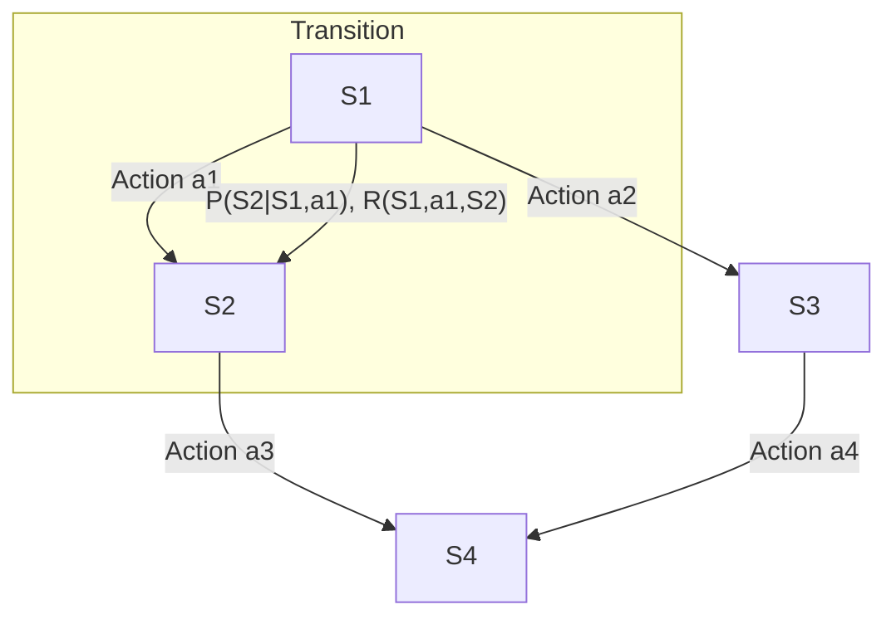

# Markov Decision Processes

> A Markov Decision Process (MDP) is a mathematical framework for modeling decision-making in situations where outcomes are partly random and partly under the control of a decision-maker.

## Overview
Markov Decision Processes (MDPs) are the formal foundation for reinforcement learning. They provide a way to model an agent interacting with an environment over time. The agent makes decisions (actions), and the environment responds by transitioning to a new state and providing a reward. The goal of the agent is to learn a policy (a strategy for choosing actions) that maximizes its cumulative reward over time.

The key assumption of an MDP is the **Markov Property**, which states that the future is independent of the past, given the present. This means that the current state provides all the information needed to make an optimal decision. MDPs are a powerful tool for a wide range of problems, from robotics to finance.

## 2. Visual Intuition
:::demo
<div style="background:#1e1e1e;padding:16px;border-radius:10px;color:#e5e7eb;font-family:system-ui,sans-serif">
  <h3 style="margin:0 0 8px 0;color:#7dd3fc">Markov Decision Processes - Concept Map</h3>
  <svg width="100%" height="280" viewBox="0 0 640 280" role="img" aria-label="Markov Decision Processes visual intuition" style="background:#111827;border-radius:8px">
    <rect x="24" y="28" width="180" height="64" rx="10" fill="#1d4ed8" />
    <text x="114" y="66" text-anchor="middle" fill="#e5e7eb" font-size="14">Problem</text>
    <rect x="230" y="28" width="180" height="64" rx="10" fill="#0f766e" />
    <text x="320" y="66" text-anchor="middle" fill="#e5e7eb" font-size="14">Process</text>
    <rect x="436" y="28" width="180" height="64" rx="10" fill="#7c3aed" />
    <text x="526" y="66" text-anchor="middle" fill="#e5e7eb" font-size="14">Outcome</text>

    <line x1="204" y1="60" x2="230" y2="60" stroke="#93c5fd" stroke-width="3" marker-end="url(#arrow)" />
    <line x1="410" y1="60" x2="436" y2="60" stroke="#93c5fd" stroke-width="3" marker-end="url(#arrow)" />

    <rect x="24" y="130" width="592" height="120" rx="10" fill="#0b1220" stroke="#334155" />
    <text x="320" y="156" text-anchor="middle" fill="#cbd5e1" font-size="14">Key intuition for Markov Decision Processes</text>
    <text x="320" y="182" text-anchor="middle" fill="#94a3b8" font-size="12">Track state changes, constraints, and final behavior.</text>
    <text x="320" y="206" text-anchor="middle" fill="#94a3b8" font-size="12">Use this as a mental model before formal proofs or code.</text>

    <defs>
      <marker id="arrow" markerWidth="10" markerHeight="10" refX="8" refY="3" orient="auto">
        <polygon points="0 0, 10 3, 0 6" fill="#93c5fd" />
      </marker>
    </defs>
  </svg>
  <p style="margin-top:10px;color:#cbd5e1">Interactive-ready visual scaffold for the topic.</p>
</div>
:::
*Caption: The agent observes the state and reward from the environment, and then chooses an action. The environment responds with a new state and reward.*

## Core Theory
An MDP is defined by a tuple `(S, A, P, R, γ)`:

-   **S:** A set of states.
-   **A:** A set of actions.
-   **P(s' | s, a):** The transition probability of moving from state `s` to `s'` after taking action `a`.
-   **R(s, a, s'):** The reward received after transitioning from `s` to `s'` via action `a`.
-   **γ (gamma):** The discount factor, which determines the importance of future rewards.

**The Goal:**
The goal of the agent is to find an optimal policy `π*`, which is a mapping from states to actions that maximizes the expected cumulative discounted reward.

**Value Functions:**
-   **State-Value Function (V(s)):** The expected return starting from state `s` and then following a policy `π`.
-   **Action-Value Function (Q(s, a)):** The expected return starting from state `s`, taking action `a`, and then following a policy `π`.

**The Bellman Equation:**
The Bellman equation is a recursive equation that relates the value of a state to the values of its successor states. For the optimal policy, the Bellman optimality equation is:
`V*(s) = max_a Σ P(s' | s, a) [R(s, a, s') + γV*(s')]`

**Solving MDPs:**
-   **Value Iteration:** An iterative algorithm that computes the optimal state-value function by repeatedly applying the Bellman equation.
-   **Policy Iteration:** An algorithm that alternates between evaluating a policy and improving it until it converges to the optimal policy.

## Visual Diagram

*A simple state transition diagram for an MDP. The agent chooses an action, and the environment stochastically transitions to a new state with an associated reward.*

## Code Example
```python
# A simple implementation of Value Iteration
def value_iteration(states, actions, transitions, rewards, gamma, theta):
    """
    Performs value iteration to find the optimal value function.
    """
    V = {s: 0 for s in states}
    while True:
        delta = 0
        for s in states:
            v = V[s]
            V[s] = max(sum(p * (r + gamma * V[s_prime]) 
                           for p, s_prime, r in transitions[s][a]) 
                       for a in actions[s])
            delta = max(delta, abs(v - V[s]))
        if delta < theta:
            break
    return V

# Example (conceptual - requires full definition of transitions, etc.)
# states = {0, 1, 2, 3}
# actions = ...
# transitions = ...
# rewards = ...
# optimal_values = value_iteration(states, actions, transitions, rewards, 0.9, 0.01)
# print(optimal_values)
```

## Interactive Demo
:::demo
<!-- title: "Grid World" -->
<!DOCTYPE html>
<html>
<head>
<meta charset="utf-8">
<style>
  body { margin:0; background:#0f1117; color:#e5e7eb; font-family: system-ui, sans-serif; display: flex; flex-direction: column; align-items: center; justify-content: center; }
  .grid { display: grid; grid-template-columns: repeat(4, 50px); grid-template-rows: repeat(3, 50px); border: 1px solid #9ca3af; }
  .cell { width: 50px; height: 50px; border: 1px solid #4b5563; text-align: center; line-height: 50px; }
  .goal { background: #10b981; }
  .trap { background: #ef4444; }
  .agent { background: #3b82f6; }
</style>
</head>
<body>
<h3>Grid World MDP</h3>
<div id="grid" class="grid">
    <div class="cell"></div><div class="cell"></div><div class="cell"></div><div class="cell goal">+1</div>
    <div class="cell"></div><div class="cell" style="background: #1f2937;"></div><div class="cell"></div><div class="cell trap">-1</div>
    <div class="cell agent">S</div><div class="cell"></div><div class="cell"></div><div class="cell"></div>
</div>
<p>Goal: Find the policy that maximizes reward.</p>
</body>
</html>
:::

## Worked Example
**Problem:** In a simple two-state MDP (`s1`, `s2`), from `s1` you can either `stay` (reward=1, stay in `s1`) or `go` (reward=0, go to `s2` with 100% probability). From `s2`, you can only `stay` (reward=5, stay in `s2`). With a discount factor `γ = 0.9`, what is the optimal action in `s1`?

**Solution:**
1.  **Calculate value of `stay`:** `V(stay, s1)` = 1 + γ * V(s1) = 1 + 0.9 * V(s1)
2.  **Calculate value of `go`:** `V(go, s1)` = 0 + γ * V(s2)
3.  **Find V(s2):** Since you can only `stay` in `s2`, `V(s2)` is the sum of a geometric series: 5 + 0.9*5 + 0.9^2*5 + ... = 5 / (1 - 0.9) = 50.
4.  **Compare actions in `s1`:**
    -   `V(go, s1)` = 0 + 0.9 * 50 = 45.
    -   To find the value of `stay`, we would need to solve `V(s1) = 1 + 0.9 * V(s1)`, which gives `V(s1) = 10`. The action value is the immediate reward plus the discounted future value, so `V(stay, s1) = 1 + 0.9 * V(s1) = 10`.
5.  **Conclusion:** `V(go, s1) = 45` is much greater than `V(stay, s1) = 10`. The optimal action is to `go`.

## Industry Applications
- **Robotics:** For motion planning and control.
- **Finance:** For optimal asset allocation and options pricing.
- **Operations Research:** For inventory management and supply chain optimization.
- **Natural Resource Management:** For deciding how to harvest resources over time.

## Practice Problems

### Easy
1. What is the Markov Property?

### Medium
2. Explain the difference between the state-value function `V(s)` and the action-value function `Q(s, a)`.

### Hard
3. What is the "curse of dimensionality" in the context of MDPs?

## Interactive Quiz
:::quiz
**Q1:** Which of the following is NOT a component of an MDP?
- A) A set of states (S)
- B) A set of actions (A)
- C) A transition probability function (P)
- D) A heuristic function (H)
> D — A heuristic function is used in informed search, but it is not part of the definition of an MDP.

**Q2:** The discount factor `γ` is used to...
- A) Make the problem easier to solve.
- B) Control the importance of future rewards.
- C) Ensure that the agent always finds a solution.
- D) Model the uncertainty of the environment.
> B — A value close to 1 makes the agent farsighted, while a value close to 0 makes it shortsighted.

**Q3:** The Bellman equation is used to...
- A) Define the policy of the agent.
- B) Relate the value of a state to the values of its successor states.
- C) Calculate the transition probabilities.
- D) Define the reward function.
> B — The Bellman equation is a recursive equation that is fundamental to solving MDPs.
:::

## Interview Questions

**Q: What is a Markov Decision Process?**
*A: An MDP is a mathematical framework for modeling sequential decision-making under uncertainty. It consists of a set of states, actions, transition probabilities, and rewards. It's the foundation for reinforcement learning.*

**Q: What is the difference between value iteration and policy iteration?**
*A: Both are algorithms for solving MDPs. Value iteration iteratively updates the value function until it converges to the optimal value function, from which the optimal policy can be extracted. Policy iteration alternates between evaluating a policy and improving it. Policy iteration often converges faster, but each iteration is more computationally expensive.*

**Q: What is the role of the discount factor?**
*A: The discount factor determines the present value of future rewards. A value less than 1 ensures that the infinite sum of rewards is finite. It also models the intuition that immediate rewards are often more important than future rewards.*

**Q: How does an MDP relate to reinforcement learning?**
*A: An MDP defines the problem that reinforcement learning aims to solve. In many RL scenarios, the agent does not know the transition probabilities or reward function of the MDP and must learn them through experience.*

## Key Takeaways
- MDPs are a powerful framework for modeling sequential decision-making under uncertainty.
- The Bellman equation is the key to solving MDPs.
- Value iteration and policy iteration are two common algorithms for solving MDPs.
- MDPs are the foundation of reinforcement learning.
- They have a wide range of applications in AI and other fields.

## Common Misconceptions
- ❌ MDPs always require a discrete state and action space. → ✅ MDPs can be extended to handle continuous state and action spaces, although this makes them much harder to solve.
- ❌ The goal of an MDP is to find the shortest path to a goal state. → ✅ The goal is to find a policy that maximizes the cumulative reward, which may not be the shortest path.

## Related Topics
- [[reinforcement-learning]] — The field of machine learning that deals with solving MDPs, often without a full model of the environment.
- [[dynamic-programming]] — The mathematical optimization technique that underlies value and policy iteration.
- [[bayesian-networks]] — MDPs can be seen as a sequential version of Bayesian networks.
