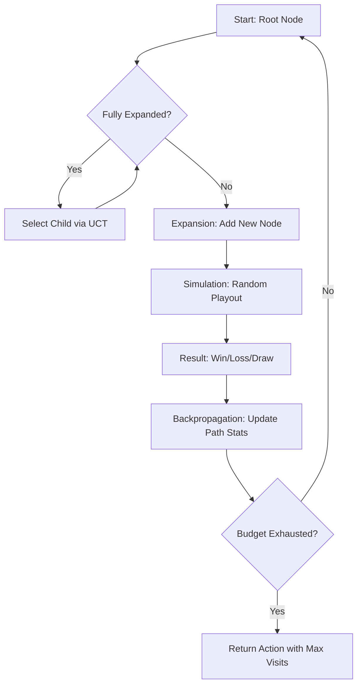

# Monte Carlo Tree Search: UCT and Game Tree Exploration

> Monte Carlo Tree Search (MCTS) is a heuristic search algorithm for decision-making processes, most notably used in game trees, that combines the precision of tree search with the generality of random sampling to converge on optimal policies in massive state spaces.

## 1. Historical Background & Motivation

For decades, the "Gold Standard" for game AI was **Minimax with Alpha-Beta Pruning**. This approach powered IBM’s Deep Blue to defeat Garry Kasparov in 1997. However, Minimax relies heavily on a handcrafted *heuristic evaluation function*—a mathematical proxy for how "good" a board state is. In games like Chess, these functions are relatively straightforward (e.g., counting material). In games like **Go**, with a branching factor of ~250 and a depth of 150+, creating a heuristic function was considered an intractable task for human experts.

The breakthrough came in 2006, when Rémi Coulom coined the term "Monte Carlo Tree Search" and Levente Kocsis and Csaba Szepesvári introduced the **UCT (Upper Confidence Bound applied to Trees)** algorithm. Unlike Minimax, MCTS does not require a heuristic evaluation function for non-terminal states. Instead, it estimates the value of a state by performing thousands of random "rollouts" (simulations) to the end of the game and averaging the results. This paradigm shift—from expert-designed heuristics to statistical simulation—culminated in DeepMind’s **AlphaGo** (2016), which defeated world champion Lee Sedol, marking a new era in Artificial Intelligence. Modern applications have since expanded beyond games into robotic motion planning, protein folding, and automated theorem proving.

## 2. Visual Intuition
:::demo
<div style="background:#1e1e1e;padding:16px;border-radius:10px;color:#e5e7eb;font-family:system-ui,sans-serif">
  <h3 style="margin:0 0 8px 0;color:#7dd3fc">Monte Carlo Tree Search: UCT and Game Tree Exploration - Concept Map</h3>
  <svg width="100%" height="280" viewBox="0 0 640 280" role="img" aria-label="Monte Carlo Tree Search: UCT and Game Tree Exploration visual intuition" style="background:#111827;border-radius:8px">
    <rect x="24" y="28" width="180" height="64" rx="10" fill="#1d4ed8" />
    <text x="114" y="66" text-anchor="middle" fill="#e5e7eb" font-size="14">Problem</text>
    <rect x="230" y="28" width="180" height="64" rx="10" fill="#0f766e" />
    <text x="320" y="66" text-anchor="middle" fill="#e5e7eb" font-size="14">Process</text>
    <rect x="436" y="28" width="180" height="64" rx="10" fill="#7c3aed" />
    <text x="526" y="66" text-anchor="middle" fill="#e5e7eb" font-size="14">Outcome</text>

    <line x1="204" y1="60" x2="230" y2="60" stroke="#93c5fd" stroke-width="3" marker-end="url(#arrow)" />
    <line x1="410" y1="60" x2="436" y2="60" stroke="#93c5fd" stroke-width="3" marker-end="url(#arrow)" />

    <rect x="24" y="130" width="592" height="120" rx="10" fill="#0b1220" stroke="#334155" />
    <text x="320" y="156" text-anchor="middle" fill="#cbd5e1" font-size="14">Key intuition for Monte Carlo Tree Search: UCT and Game Tree Exploration</text>
    <text x="320" y="182" text-anchor="middle" fill="#94a3b8" font-size="12">Track state changes, constraints, and final behavior.</text>
    <text x="320" y="206" text-anchor="middle" fill="#94a3b8" font-size="12">Use this as a mental model before formal proofs or code.</text>

    <defs>
      <marker id="arrow" markerWidth="10" markerHeight="10" refX="8" refY="3" orient="auto">
        <polygon points="0 0, 10 3, 0 6" fill="#93c5fd" />
      </marker>
    </defs>
  </svg>
  <p style="margin-top:10px;color:#cbd5e1">Interactive-ready visual scaffold for the topic.</p>
</div>
:::
*Caption: The four iterative phases of MCTS: 1) Selection: Navigating the tree using UCT. 2) Expansion: Adding a new leaf node. 3) Simulation: A random playout to a terminal state. 4) Backpropagation: Updating statistics up the tree path.*

## 3. Core Theory & Mathematical Foundations

MCTS treats the problem of game tree search as a series of **Multi-Armed Bandit (MAB)** problems. In a standard MAB problem, an agent faces multiple slot machines (arms), each with an unknown reward distribution. The agent must decide which arm to pull to maximize total reward, balancing **Exploitation** (pulling the arm that has performed best so far) and **Exploration** (pulling arms that haven't been tried much to see if they are better).

### 3.1 The UCB1 Formula
To solve the exploration-exploitation trade-off at each node in the tree, we use the **Upper Confidence Bound (UCB1)** formula. For a node $v$ and its child $i$, the value is calculated as:

$$UCT(v, i) = \frac{w_i}{n_i} + C \sqrt{\frac{\ln N_v}{n_i}}$$

Where:
- $w_i$: Number of wins (or total value) for the child node after $n_i$ visits.
- $n_i$: Number of times the child node $i$ has been visited.
- $N_v$: Total number of times the parent node $v$ has been visited.
- $C$: The **exploration parameter**. Theoretically $\sqrt{2}$ for rewards in $[0, 1]$, but often tuned empirically.

The first term, $\frac{w_i}{n_i}$, represents **Exploitation**. The second term, $C \sqrt{\frac{\ln N_v}{n_i}}$, represents **Exploration**. As $n_i$ increases, the exploration term decreases, making the algorithm favor nodes with high win rates.

### 3.2 Convergence and Consistency
MCTS is **anytime**: it can be stopped at any moment to return the best action found so far, and its accuracy improves with the number of iterations. Under certain conditions (specifically, the rewards being bounded and the game being a Markov Decision Process), the MCTS value estimates converge to the minimax values.

Formally, the probability of selecting a sub-optimal action at the root converges to zero at a rate of $O(t^{-1})$, where $t$ is the number of simulations. Unlike Minimax, which explores a uniform depth, MCTS builds an **asymmetric tree**. It grows deeper in "promising" branches while ignoring branches that lead to guaranteed losses.

### 3.3 Formal Analysis (Complexity / Correctness)
**Time Complexity:** 
The complexity per iteration is $O(d \cdot b + S)$, where:
- $d$ is the maximum depth of the search tree.
- $b$ is the branching factor (selection phase).
- $S$ is the number of steps in the simulation (rollout) phase.
Total complexity is $O(K \cdot (d \cdot b + S))$ for $K$ iterations.

**Space Complexity:** 
$O(K \cdot b)$, as every iteration potentially adds a new node to the tree. In practice, memory management (pruning or tree recycling) is required for long-running processes.

**Correctness:**
MCTS is not "correct" in the sense of finding the absolute optimal move in finite time for complex games, but it is **probabilistically approximately correct (PAC)**. As $N \to \infty$, the UCT selection policy ensures that every reachable state is eventually explored, while the average reward estimates converge to the true expected values via the Law of Large Numbers.

## 4. Algorithm / Process (Step-by-Step)

MCTS operates in a loop of four distinct phases until a computational budget (time or iterations) is exhausted:

1.  **Selection**: Starting at the root, we recursively apply the UCT formula to choose the "best" child node until we reach a leaf node (a node that is not fully expanded).
2.  **Expansion**: Unless the leaf node represents a terminal state (end of game), we create one or more new child nodes for legal actions not yet present in the tree.
3.  **Simulation (Rollout)**: From the newly created node, we perform a "playout" by choosing random moves until a terminal state is reached. No tree nodes are created during this phase; it is a simple loop.
4.  **Backpropagation**: The result of the simulation (e.g., +1 for win, 0 for loss) is propagated back up the path from the new node to the root. We increment the visit count $n$ and the win count $w$ for every node on that path.

## 5. Visual Diagram

*Caption: The iterative cycle of MCTS. The "Max Visits" criteria is preferred over "Max Win Rate" as it is more robust to outliers in low-sample branches.*

## 6. Implementation

### 6.1 Core Implementation (Python)
This implementation provides a generic MCTS skeleton that can be applied to any game by defining a `State` object.

```python
import math
import random

class MCTSNode:
    def __init__(self, state, parent=None):
        self.state = state
        self.parent = parent
        self.children = []
        self._number_of_visits = 0
        self._results = 0  # Total wins/score
        self._untried_actions = state.get_legal_actions()

    @property
    def q(self):
        """Returns the accumulated reward."""
        return self._results

    @property
    def n(self):
        """Returns the number of visits."""
        return self._number_of_visits

    def expand(self):
        """Expands the node by taking an untried action."""
        action = self._untried_actions.pop()
        next_state = self.state.move(action)
        child_node = MCTSNode(next_state, parent=self)
        self.children.append(child_node)
        return child_node

    def is_terminal_node(self):
        return self.state.is_game_over()

    def rollout(self):
        """Simulates a random playout from this state."""
        current_rollout_state = self.state
        while not current_rollout_state.is_game_over():
            possible_moves = current_rollout_state.get_legal_actions()
            action = random.choice(possible_moves)
            current_rollout_state = current_rollout_state.move(action)
        return current_rollout_state.game_result()

    def backpropagate(self, result):
        """Updates the node and its ancestors with simulation results."""
        self._number_of_visits += 1
        self._results += result
        if self.parent:
            self.parent.backpropagate(result)

    def is_fully_expanded(self):
        return len(self._untried_actions) == 0

    def best_child(self, c_param=1.41):
        """Selects the child with the highest UCT score."""
        choices_weights = [
            (c.q / c.n) + c_param * math.sqrt((2 * math.log(self.n) / c.n))
            for c in self.children
        ]
        return self.children[choices_weights.index(max(choices_weights))]

def mcts_search(iterations, root_state):
    root = MCTSNode(state=root_state)
    for _ in range(iterations):
        node = root
        # 1. Selection
        while node.is_fully_expanded() and not node.is_terminal_node():
            node = node.best_child()
        
        # 2. Expansion
        if not node.is_terminal_node():
            node = node.expand()
        
        # 3. Simulation
        reward = node.rollout()
        
        # 4. Backpropagation
        node.backpropagate(reward)
        
    return root.best_child(c_param=0) # Return best child with 0 exploration

# Complexity: 
# mcts_search: O(Iterations * (Depth + Playout_Length))
# Space: O(Iterations)
```

### 6.2 Optimized Variant: Parallel MCTS
In production systems, MCTS is parallelized. The most common method is **Root Parallelization**, where multiple MCTS trees are built on different threads and their results (visit counts) are merged at the end.

```python
# Simplified Conceptual Parallel MCTS using multiprocessing
from multiprocessing import Pool

def parallel_mcts(root_state, iterations, num_workers=4):
    with Pool(num_workers) as p:
        # Divide iterations among workers
        results = p.map(run_mcts_worker, [(root_state, iterations // num_workers)] * num_workers)
    
    # Merge visit counts from all trees to decide final action
    return merge_and_choose_best(results)
```

### 6.3 Common Pitfalls in Code
1.  **Selection Logic Error**: Failing to check `is_fully_expanded()` before calling `best_child()`. If you try to calculate UCT for a node with 0 visits, you get a DivisionByZero error.
2.  **State Mutation**: MCTS requires creating many game states. If your `state.move()` function modifies the current object instead of returning a new one, the tree will be corrupted.
3.  **Inconsistent Results**: Forgetting that player 1's win is player 2's loss. Backpropagation must correctly flip the reward sign if the game is zero-sum and nodes alternate players.

## 7. Interactive Demo

:::demo
<!-- title: MCTS Visual Explorer -->
<!DOCTYPE html>
<html>
<head>
<meta charset="utf-8">
<style>
  body { margin:0; background:#0f1117; color:#e5e7eb; font-family: 'Segoe UI', Tahoma, Geneva, Verdana, sans-serif; padding:20px; }
  canvas { border: 1px solid #374151; background: #1f2937; display: block; margin: 0 auto; border-radius: 8px; }
  .controls { display: flex; gap: 10px; justify-content: center; margin-top: 20px; align-items: center; }
  button { padding: 8px 16px; background: #3b82f6; color: white; border: none; border-radius: 4px; cursor: pointer; font-weight: bold; }
  button:hover { background: #2563eb; }
  .stats { text-align: center; margin-top: 10px; font-size: 14px; color: #9ca3af; }
  .node-info { color: #60a5fa; }
</style>
</head>
<body>
  <canvas id="mctsCanvas" width="800" height="400"></canvas>
  <div class="controls">
    <button onclick="step()">Step Iteration</button>
    <button onclick="play()">Auto-Play</button>
    <button onclick="reset()">Reset</button>
    <span>Speed:</span>
    <input type="range" id="speed" min="1" max="100" value="50">
  </div>
  <div class="stats">
    Iterations: <span id="iterCount" class="node-info">0</span> | 
    Tree Nodes: <span id="nodeCount" class="node-info">1</span> |
    Phase: <span id="phase" class="node-info">Idle</span>
  </div>

<script>
  const canvas = document.getElementById('mctsCanvas');
  const ctx = canvas.getContext('2d');
  let iterations = 0;
  let tree = { id: 0, x: 400, y: 50, n: 0, w: 0, children: [], expanded: false };
  let nodeIdCounter = 1;
  let isPlaying = false;
  let currentPhase = "Idle";

  function drawNode(node) {
    ctx.beginPath();
    ctx.arc(node.x, node.y, 15, 0, Math.PI * 2);
    ctx.fillStyle = node.n > 0 ? "#3b82f6" : "#4b5563";
    ctx.fill();
    ctx.strokeStyle = "#fff";
    ctx.stroke();

    ctx.fillStyle = "#fff";
    ctx.font = "10px Arial";
    ctx.textAlign = "center";
    ctx.fillText(`${node.w}/${node.n}`, node.x, node.y + 4);

    node.children.forEach(child => {
      ctx.beginPath();
      ctx.moveTo(node.x, node.y + 15);
      ctx.lineTo(child.x, child.y - 15);
      ctx.strokeStyle = "#6b7280";
      ctx.stroke();
      drawNode(child);
    });
  }

  function expandNode(node) {
    if (node.children.length >= 3) return null;
    const childX = node.x + (node.children.length - 1) * 60;
    const childY = node.y + 70;
    const newNode = { id: nodeIdCounter++, x: childX, y: childY, n: 0, w: 0, children: [], parent: node };
    node.children.push(newNode);
    return newNode;
  }

  function step() {
    currentPhase = "Selecting...";
    let current = tree;
    const path = [current];

    // Simple simulation of MCTS logic
    while (current.children.length > 0 && Math.random() > 0.3) {
      current = current.children[Math.floor(Math.random() * current.children.length)];
      path.push(current);
    }

    currentPhase = "Expanding...";
    const newNode = expandNode(current);
    if (newNode) path.push(newNode);

    currentPhase = "Simulating...";
    const result = Math.random() > 0.5 ? 1 : 0;

    currentPhase = "Backpropagating...";
    path.forEach(n => {
      n.n++;
      n.w += result;
    });

    iterations++;
    updateUI();
    render();
  }

  function updateUI() {
    document.getElementById('iterCount').innerText = iterations;
    document.getElementById('nodeCount').innerText = nodeIdCounter;
    document.getElementById('phase').innerText = currentPhase;
  }

  function render() {
    ctx.clearRect(0, 0, canvas.width, canvas.height);
    drawNode(tree);
  }

  function play() {
    isPlaying = !isPlaying;
    if (isPlaying) autoStep();
  }

  function autoStep() {
    if (!isPlaying) return;
    step();
    setTimeout(autoStep, 101 - document.getElementById('speed').value);
  }

  function reset() {
    iterations = 0;
    nodeIdCounter = 1;
    tree = { id: 0, x: 400, y: 50, n: 0, w: 0, children: [], expanded: false };
    isPlaying = false;
    currentPhase = "Idle";
    updateUI();
    render();
  }

  render();
</script>
</body>
</html>
:::

## 8. Worked Examples

### Example 1 — Basic Application: Tic-Tac-Toe Selection
Suppose the root node $R$ has been visited $N=10$ times. It has two children, $A$ and $B$:
- Node $A$: $w_A = 3$, $n_A = 5$.
- Node $B$: $w_B = 2$, $n_B = 4$.
- Assume $C = 1.41$.

**Calculations:**
1.  **$UCT(A)$**:
    Exploitation: $3/5 = 0.6$
    Exploration: $1.41 \times \sqrt{\ln(10) / 5} = 1.41 \times \sqrt{2.302/5} = 1.41 \times 0.678 \approx 0.956$
    Total: $0.6 + 0.956 = 1.556$

2.  **$UCT(B)$**:
    Exploitation: $2/4 = 0.5$
    Exploration: $1.41 \times \sqrt{\ln(10) / 4} = 1.41 \times \sqrt{2.302/4} = 1.41 \times 0.758 \approx 1.069$
    Total: $0.5 + 1.069 = 1.569$

**Decision**: Even though Node $A$ has a higher win rate (60% vs 50%), Node $B$ has a higher UCT value because it has been explored less. MCTS will select **Node B**.

### Example 2 — The "Trap" Node
Consider a scenario where a move leads to an immediate win for the opponent if they play perfectly, but random playouts suggest it’s a good move.
- In the Simulation phase, if the "Default Policy" is purely random, it may miss a blatant "Mate-in-1" for the opponent because the random playout only finds that win 1 out of 200 times.
- **Solution**: Modern MCTS implementations use a "Heavy Playout" or "Heuristic Playout" where simulations are biased by simple rules (e.g., in Chess, always take a free Queen during rollout).

## 9. Comparison with Alternatives

| Approach | Time | Space | Pros | Cons | Best Used When |
|---|---|---|---|---|---|
| **Minimax** | $O(b^d)$ | $O(d)$ | Guarantees optimality in finite trees. | Exponential time, needs heuristic. | Small state space (Chess, Checkers). |
| **MCTS** | $O(K \cdot d)$ | $O(K)$ | No heuristic needed, asymmetric growth. | Stochastic, may miss narrow traps. | Large state space (Go, Real-time strategy). |
| **Alpha-Beta** | $O(b^{d/2})$ | $O(d)$ | Significant pruning over Minimax. | Still requires board evaluation. | Games with clear material advantage metrics. |
| **BFS / DFS** | $O(V+E)$ | $O(V)$ | Exhaustive. | Intractable for large games. | Solving simple puzzles. |

## 10. Industry Applications & Real Systems

-   **DeepMind (AlphaZero)**: Uses MCTS where the "Simulation" phase is replaced by a Neural Network evaluation. This hybrid approach allowed AlphaZero to master Chess, Shogi, and Go from scratch.
-   **Amazon (AWS SageMaker)**: Uses MCTS-based strategies for **Hyperparameter Optimization (HPO)**. The "arms" are different hyperparameter configurations, and MCTS explores the space of configurations to find the best model.
-   **Total War / Civilization (Game AI)**: Modern grand strategy games use MCTS for long-term strategic planning (which city to build where) because the branching factor of possible empire states is far too large for Minimax.
-   **Autonomous Driving (Motion Planning)**: Companies like Waymo use MCTS variants to simulate potential future trajectories of other cars and pedestrians, selecting the ego-vehicle's path that minimizes "regret" (probability of collision).

## 11. Practice Problems

### 🟢 Easy
1.  **UCB Calculation**: A node has 100 visits and its child has 20 visits with 15 wins. Calculate the UCT value for $C=2$.
    *Hint: Don't forget the natural log.*
    *Expected complexity: O(1)*

### 🟡 Medium
2.  **MCTS for Zero-Sum**: In a two-player zero-sum game, how must the `backpropagate` function be modified to account for the fact that a "win" for the current player is a "loss" for the parent node's player?
    *Hint: Think about negating the result at each level.*
    *Expected complexity: O(Depth)*

3.  **The Exploration Parameter**: If we set $C=0$ in the UCT formula, what happens to the search behavior? Does it resemble another known algorithm?
    *Hint: What happens to the second term?*

### 🔴 Hard
4.  **Convergence Proof Sketch**: Briefly explain why UCT is guaranteed to find the optimal move given infinite time, focusing on the properties of the exploration term as $N_v \to \infty$.
    *Hint: Consider what happens to the UCT value of an unvisited node relative to a visited one.*

5.  **Memory Constraints**: In a system with only 1GB of RAM, an MCTS tree for a complex game grows at 10,000 nodes per second. Design a "Tree Pruning" strategy that maintains search quality while staying under the memory limit.
    *Hint: Look into 'Node Recycling' and 'Greedy Pruning' of low-visit branches.*

## 12. Interactive Quiz

:::quiz
**Q1: What is the primary advantage of MCTS over Minimax in the game of Go?**
- A) MCTS is faster to compute per node.
- B) MCTS does not require a handcrafted heuristic evaluation function.
- C) MCTS uses less memory than Minimax.
- D) MCTS is deterministic and always finds the same move.
> B — Go's complexity makes it nearly impossible to write a reliable heuristic; MCTS bypasses this by using statistics from random simulations.

**Q2: In the UCT formula, what happens to the exploration term as the number of child visits $n_i$ increases while the parent visits $N_v$ remains constant?**
- A) It increases.
- B) It decreases.
- C) It remains constant.
- D) It becomes undefined.
> B — As $n_i$ is in the denominator, the exploration term $\sqrt{\ln N/n_i}$ decreases, shifting focus toward exploitation of the known win rate.

**Q3: Which phase of MCTS involves "playing out" the game to a terminal state?**
- A) Selection
- B) Expansion
- C) Simulation
- D) Backpropagation
> C — The Simulation (or Rollout) phase is a random walk from a new node to a leaf/terminal state.

**Q4: If the exploration constant $C$ is set extremely high (e.g., $C = 1,000,000$), MCTS will behave most like:**
- A) Depth-First Search
- B) Breadth-First Search / Random Search
- C) Alpha-Beta Pruning
- D) Greedy Best-First Search
> B — A massive $C$ forces the algorithm to explore every node equally regardless of win rate, approximating a uniform breadth-based exploration.

**Q5: Why do we typically return the action with the "Most Visits" instead of the "Highest Win Rate" at the root?**
- A) It is computationally cheaper to find the max of integers.
- B) High win rates in low-visit nodes are statistically unreliable (outliers).
- C) The UCT formula already maximizes win rate.
- D) It's a trick to save memory.
> B — A node might have 1 win and 1 visit (100% win rate), but a node with 900 wins and 1000 visits (90% win rate) is a much more reliable choice.
:::

## 13. Interview Preparation

### Conceptual Questions
**Q: Explain MCTS as if teaching it to a fellow engineer.**
*A: MCTS is a search strategy that focuses its effort on the most promising parts of a search tree. Instead of looking at every possibility to a fixed depth like Minimax, it runs simulations to the end of the game. It uses the UCT formula to balance "winning big" (exploitation) with "checking out new moves" (exploration). It’s especially powerful when you can't easily calculate how 'good' a board looks mid-game.*

**Q: What are the time and space complexities? Derive them.**
*A: Time complexity is $O(K \times L)$, where $K$ is iterations and $L$ is the average simulation length. Each iteration involves a traversal of the tree (logarithmic in node count) and a simulation (linear in game depth). Space is $O(K)$ because we typically add one node per iteration.*

**Q: How would you choose between MCTS and Alpha-Beta in a real system?**
*A: I would look at the branching factor and the availability of a heuristic. If the game has a massive branching factor (like Go or RTS games) or I can't define a good scoring function, I'd use MCTS. If the game is Chess-like with a clear material advantage and lower branching, Alpha-Beta is usually more precise.*

### Quick Reference (Cheat Sheet)
| Property | Value |
|---|---|
| Strategy | Stochastic Simulation |
| Convergence | PAC (Probabilistically Approximately Correct) |
| Core Formula | UCB1 (Upper Confidence Bound) |
| Tree Growth | Asymmetric |
| Anytime? | Yes |
| Heuristic Needed? | No (Optional) |

## 14. Key Takeaways
1.  **Balance is Key**: UCT is the engine of MCTS, balancing the known (exploitation) and the unknown (exploration).
2.  **No Expert Knowledge Needed**: MCTS can play any game with defined rules, even without knowing "strategy."
3.  **Asymmetry**: MCTS explores deeper in good branches and shallower in bad ones, which is more efficient than uniform search.
4.  **Simulation Bias**: Purely random simulations can be a weakness; biasing them with simple rules significantly improves performance.
5.  **AlphaZero**: The ultimate MCTS variant replaces random rollouts with Neural Network value predictions.

## 15. Common Misconceptions
- ❌ **"MCTS is always better than Minimax."** → ✅ MCTS is better for large branching factors, but Minimax is superior for "sudden death" games where one mistake leads to an immediate loss, as MCTS might not sample that specific mistake.
- ❌ **"Rollouts must be completely random."** → ✅ Rollouts can (and should) be biased with basic domain knowledge to improve accuracy.
- ❌ **"MCTS gives the perfect move."** → ✅ MCTS gives a statistically likely move. It can be "blind" to narrow paths that lead to a win (the "MCTS-hole" problem).

## 16. Further Reading
- *Artificial Intelligence: A Modern Approach (Russell & Norvig, Chapter 5)* — Covers game search and MCTS foundations.
- *Bandit Based Monte-Carlo Planning (Kocsis & Szepesvári, 2006)* — The original paper introducing UCT.
- *Mastering the Game of Go without Human Knowledge (Silver et al., Nature 2017)* — The AlphaZero paper.

## 17. Related Topics
- [[heuristic-design]] — How to create the functions MCTS helps avoid.
- [[temporal-logic]] — Used in formalizing the states MCTS explores.
- [[local-search-optimization]] — Alternatives for non-tree based decision making.
- [[alpha-beta-enhancements]] — Advanced techniques for the traditional competitor to MCTS.
