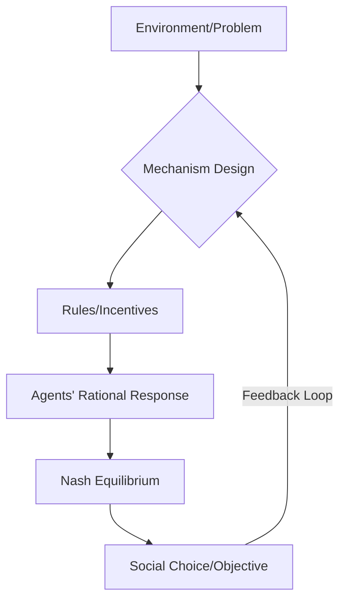

# Multi-Agent Systems: Game Theory, Mechanism Design

> Multi-agent systems apply game-theoretic frameworks to model autonomous agents interacting in environments where the utility of an agent depends on the strategies of others, necessitating mechanism design to align individual incentives with global objectives.

## Overview

Multi-agent systems (MAS) represent a shift from centralized optimization to decentralized coordination. In many modern AI applications, systems must operate in environments containing other intelligent agents—whether they are humans, competing bots, or autonomous software entities. MAS provides the mathematical rigor to analyze these environments, focusing on how agents make decisions when outcomes are interdependent.

Game Theory forms the foundation of MAS, providing tools to model strategic interaction, equilibrium, and conflict. However, purely descriptive game theory is often insufficient for system design; we must often engineer the *rules of the game* to ensure that selfish agents arrive at a desired collective outcome. This is the domain of Mechanism Design (or algorithmic game theory), which deals with the "inverse game theory" problem: starting from a desired social choice function and constructing a game such that agents, acting in their own self-interest, implement that function.

These concepts are critical for modern technical roles, as they underpin real-time bidding (RTB) in online advertising, resource allocation in cloud computing, autonomous traffic routing, and decentralized finance (DeFi) protocols.

## 2. Visual Intuition
:::demo
<div style="background:#1e1e1e;padding:16px;border-radius:10px;color:#e5e7eb;font-family:system-ui,sans-serif">
  <h3 style="margin:0 0 8px 0;color:#7dd3fc">Multi-Agent Systems: Game Theory, Mechanism Design - Concept Map</h3>
  <svg width="100%" height="280" viewBox="0 0 640 280" role="img" aria-label="Multi-Agent Systems: Game Theory, Mechanism Design visual intuition" style="background:#111827;border-radius:8px">
    <rect x="24" y="28" width="180" height="64" rx="10" fill="#1d4ed8" />
    <text x="114" y="66" text-anchor="middle" fill="#e5e7eb" font-size="14">Problem</text>
    <rect x="230" y="28" width="180" height="64" rx="10" fill="#0f766e" />
    <text x="320" y="66" text-anchor="middle" fill="#e5e7eb" font-size="14">Process</text>
    <rect x="436" y="28" width="180" height="64" rx="10" fill="#7c3aed" />
    <text x="526" y="66" text-anchor="middle" fill="#e5e7eb" font-size="14">Outcome</text>

    <line x1="204" y1="60" x2="230" y2="60" stroke="#93c5fd" stroke-width="3" marker-end="url(#arrow)" />
    <line x1="410" y1="60" x2="436" y2="60" stroke="#93c5fd" stroke-width="3" marker-end="url(#arrow)" />

    <rect x="24" y="130" width="592" height="120" rx="10" fill="#0b1220" stroke="#334155" />
    <text x="320" y="156" text-anchor="middle" fill="#cbd5e1" font-size="14">Key intuition for Multi-Agent Systems: Game Theory, Mechanism Design</text>
    <text x="320" y="182" text-anchor="middle" fill="#94a3b8" font-size="12">Track state changes, constraints, and final behavior.</text>
    <text x="320" y="206" text-anchor="middle" fill="#94a3b8" font-size="12">Use this as a mental model before formal proofs or code.</text>

    <defs>
      <marker id="arrow" markerWidth="10" markerHeight="10" refX="8" refY="3" orient="auto">
        <polygon points="0 0, 10 3, 0 6" fill="#93c5fd" />
      </marker>
    </defs>
  </svg>
  <p style="margin-top:10px;color:#cbd5e1">Interactive-ready visual scaffold for the topic.</p>
</div>
:::
*Caption: Animated illustration of Multi-Agent Systems: Game Theory, Mechanism Design*

## Core Theory

### Non-Cooperative Games
A game in normal form is defined by the triplet $(N, S, u)$, where:
- $N = \{1, 2, ..., n\}$ is the set of agents.
- $S = S_1 \times S_2 \times ... \times S_n$ is the strategy space, where $s_i \in S_i$ is an action.
- $u = (u_1, u_2, ..., u_n)$ is the set of utility functions, where $u_i(s_i, s_{-i})$ represents agent $i$'s payoff given their strategy $s_i$ and the profile of others' strategies $s_{-i}$.

The **Nash Equilibrium** is a strategy profile $s^*$ such that for every agent $i$:
$$u_i(s_i^*, s_{-i}^*) \geq u_i(s_i, s_{-i}^*) \quad \forall s_i \in S_i$$
This implies no agent can increase their utility by unilaterally deviating from their strategy.

### Mechanism Design
In mechanism design, we define a set of outcomes $O$ and agent preferences over those outcomes. A mechanism is a pair $(S, g)$, where $S$ is the strategy space (often reportings of private types $\theta_i$) and $g: S \to O$ is an outcome function. 
The **Revelation Principle** states that any outcome that can be implemented by a mechanism can be implemented by a *direct revelation mechanism* in which agents are incentivized to report their types truthfully (Incentive Compatibility).

The **Vickrey-Clarke-Groves (VCG)** mechanism is a classic example that achieves social efficiency by charging agents a "tax" equal to the externality they impose on others:
$$p_i = \left( \sum_{j \neq i} u_j(s_{-i}^*) \right) - \left( \sum_{j \neq i} u_j(s_i^*, s_{-i}^*) \right)$$

## Visual Diagram

*The iterative process of mechanism design: defining rules that guide agent interactions toward a desired social outcome.*

## Code Example

```python
import numpy as np

# A simple Vickrey Auction (Second-Price Auction) simulation
# In this auction, the highest bidder wins but pays the second-highest bid.
# This mechanism is dominant-strategy incentive compatible (truthful bidding).

def vickrey_auction(bids):
    """
    Simulates a sealed-bid second-price auction.
    bids: dict mapping agent_id to their bid amount
    """
    sorted_bids = sorted(bids.items(), key=lambda item: item[1], reverse=True)
    
    winner, winning_bid = sorted_bids[0]
    # Price paid is the second highest bid (or 0 if only one bidder)
    price_paid = sorted_bids[1][1] if len(sorted_bids) > 1 else 0
    
    return winner, price_paid

# Players and their private valuations
valuations = {'Alice': 100, 'Bob': 80, 'Charlie': 120}

# Agents bid their true valuations (the dominant strategy in VCG/Vickrey)
winner, price = vickrey_auction(valuations)

print(f"Winner: {winner}")
print(f"Price Paid: {price}")
# Expected Output:
# Winner: Charlie
# Price Paid: 100
```

## Interactive Demo
:::demo
<!DOCTYPE html>
<html>
<head>
<style>
  #game-board { display: flex; gap: 20px; }
  .box { padding: 20px; background: #222; border: 1px solid #444; cursor: pointer; }
</style>
</head>
<body>
<h3>Nash Equilibrium: Click to change your strategy</h3>
<div id="game-board">
  <div id="p1" class="box" onclick="toggle('p1')">Agent 1: Cooperate</div>
  <div id="p2" class="box" onclick="toggle('p2')">Agent 2: Cooperate</div>
</div>
<p id="msg">Current state: (Cooperate, Cooperate)</p>
<script>
  let s1 = 'Cooperate', s2 = 'Cooperate';
  function toggle(id) {
    if(id === 'p1') s1 = s1 === 'Cooperate' ? 'Defect' : 'Cooperate';
    else s2 = s2 === 'Cooperate' ? 'Defect' : 'Cooperate';
    document.getElementById(id).innerText = (id === 'p1' ? 'Agent 1: ' : 'Agent 2: ') + (id === 'p1' ? s1 : s2);
    document.getElementById('msg').innerText = `Current state: (${s1}, ${s2})`;
  }
</script>
</body>
</html>
:::

## Worked Example

**Problem:** Two agents (A, B) share a resource. They can either "Claim" or "Share".
- If both Share: $(3, 3)$
- If one Claims and one Shares: $(5, 0)$ or $(0, 5)$
- If both Claim: $(1, 1)$

**Step 1:** Identify Payoff Matrix.
| | Share (B) | Claim (B) |
|---|---|---|
| Share (A) | (3, 3) | (0, 5) |
| Claim (A) | (5, 0) | (1, 1) |

**Step 2:** Check for Dominant Strategies.
- If B shares, A prefers Claim ($5 > 3$).
- If B claims, A prefers Claim ($1 > 0$).
- Claiming is the dominant strategy for both.

**Step 3:** Nash Equilibrium.
Both playing "Claim" results in $(1, 1)$. Since no player can improve by switching (as $5 > 1$ is for the other player), (Claim, Claim) is the unique Nash Equilibrium.

## Industry Applications
- **Google/Meta (Ad Exchanges):** Use Generalized Second-Price (GSP) auctions to allocate ad slots in real-time.
- **AWS/Azure (Cloud Infrastructure):** Use spot market mechanisms to allocate unused compute capacity based on bidding strategies.
- **Uber/Lyft (Marketplace Dynamics):** Use dynamic pricing (surge) mechanisms to balance demand and supply in a multi-agent marketplace.

## Practice Problems

### Easy
1. Define the difference between a Zero-Sum game and a General-Sum game. *(Hint: Consider the sum of utilities for all agents across all strategy profiles.)*

### Medium
2. Find the pure-strategy Nash Equilibrium for the Battle of the Sexes game. *(Hint: Look for strategy profiles where neither player can gain by switching.)*
3. Prove that in a Second-Price Auction, bidding your true valuation is a dominant strategy. *(Hint: Consider cases where you bid higher or lower than your value $v$.)*

### Hard
4. Construct a mechanism for a public goods project that satisfies the "Budget Balance" and "Incentive Compatibility" properties simultaneously, or explain why the Impossibility Theorem (Myerson-Satterthwaite) makes this difficult.

## Interactive Quiz

:::quiz
**Q1:** What does the Revelation Principle imply for mechanism design?
- A) Agents will always lie about their private information.
- B) Any outcome reachable by a complex mechanism can be reached by a truthful direct revelation mechanism.
- C) It is impossible to achieve social efficiency in multi-agent systems.
- D) Nash equilibrium is the only stable outcome in game theory.
> B — The Revelation Principle simplifies the design space by stating that we only need to consider incentive-compatible mechanisms where truth-telling is an equilibrium.

**Q2:** In a VCG mechanism, why is a "tax" charged to agents?
- A) To maximize the platform's revenue.
- B) To punish agents who bid high.
- C) To internalize the externality an agent imposes on the system.
- D) To prevent agents from participating.
> C — The VCG tax aligns individual incentives with social welfare by forcing agents to "pay for the impact" they have on others.

**Q3:** Which of the following is NOT true about a Nash Equilibrium?
- A) It is always Pareto optimal.
- B) It represents a stable state where no agent has an incentive to deviate.
- C) There can be more than one Nash Equilibrium in a single game.
- D) A game might have no pure-strategy Nash Equilibrium.
> A — Nash Equilibrium ensures stability (no unilateral deviation), but it does not guarantee Pareto optimality (the best possible outcome for all).
:::

## Interview Questions

**Q: Explain Multi-Agent Systems as you would to a senior engineer in an interview.**
*A: MAS models environments with autonomous, interacting agents where outcomes are functions of joint strategy profiles. We use game theory to model equilibrium and mechanism design to build incentive structures—like VCG auctions—that align individual rational behavior with global efficiency, commonly seen in ad-tech or resource allocation.*

**Q: What is the time/space complexity of finding a Nash Equilibrium in a general-sum game?**
*A: Finding a Nash Equilibrium is PPAD-complete. For a game with $n$ agents and $s$ strategies, the space is $O(s^n)$, making general equilibrium computation intractable for large agent populations, requiring heuristic or iterative approximation methods like fictitious play.*

**Q: How would you design an auction for a new, limited-supply resource?**
*A: I would consider a Vickrey auction (second-price) if truthfulness is the priority to prevent "bid shading." If the goal is maximizing revenue, I would evaluate a first-price auction, recognizing the trade-off with bidding complexity.*

**Q: How do you handle "selfish" agents in a distributed system?**
*A: Through mechanism design. I would implement an incentive structure that makes "cooperative" behavior the dominant strategy. This often involves creating a payment/reward function that makes the social optimum an equilibrium, effectively "internalizing the externalities" via pricing or cost-allocation.*

## Key Takeaways
- Nash Equilibrium describes stability, not necessarily efficiency.
- Mechanism design seeks to construct games to achieve social goals.
- VCG mechanisms are truthful but may suffer from budget balance issues.
- The Revelation Principle simplifies the analysis of complex mechanisms.
- Computational game theory is often hard (PPAD-complete).
- Always consider if a "selfish" agent could deviate to improve their own utility.

## Common Misconceptions
- ❌ Nash Equilibrium is always the "best" outcome for the group. → ✅ Nash Equilibrium is just a stable state where no one can improve by moving alone; it can be very inefficient.
- ❌ Mechanism design is about programming agent behavior. → ✅ Mechanism design is about designing the environment/rules so that *rational* agents choose the behavior you want.

## Related Topics
- [[reinforcement-learning]] — The foundation for how individual agents learn optimal policies in environments.
- [[constrained-optimization]] — Essential for solving the social welfare maximization problems in mechanism design.
- [[distributed-systems]] — The infrastructure layer where these multi-agent protocols are executed.
