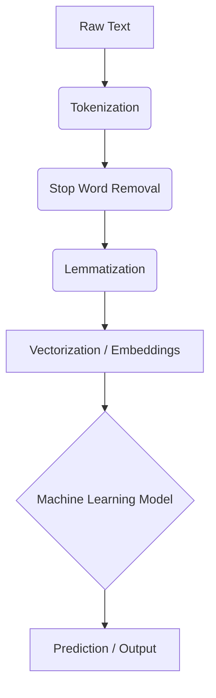

# Natural Language Processing

> Natural Language Processing (NLP) is a field of artificial intelligence that gives computers the ability to read, understand, and derive meaning from human language.

## Overview
Natural Language Processing (NLP) is a crucial and rapidly advancing field of AI that focuses on the interaction between computers and humans through natural language. The ultimate objective of NLP is to enable computers to understand, interpret, and generate human language in a way that is both valuable and meaningful. NLP combines techniques from computer science, linguistics, and machine learning to solve real-world problems.

The field has evolved from rule-based systems to statistical methods and, most recently, to powerful deep learning models like transformers. These modern architectures have led to significant breakthroughs in tasks such as machine translation, sentiment analysis, and question answering, and have powered the rise of large language models (LLMs) like GPT and BERT.

## 2. Visual Intuition
:::demo
<div style="background:#1e1e1e;padding:16px;border-radius:10px;color:#e5e7eb;font-family:system-ui,sans-serif">
  <h3 style="margin:0 0 8px 0;color:#7dd3fc">Natural Language Processing - Concept Map</h3>
  <svg width="100%" height="280" viewBox="0 0 640 280" role="img" aria-label="Natural Language Processing visual intuition" style="background:#111827;border-radius:8px">
    <rect x="24" y="28" width="180" height="64" rx="10" fill="#1d4ed8" />
    <text x="114" y="66" text-anchor="middle" fill="#e5e7eb" font-size="14">Problem</text>
    <rect x="230" y="28" width="180" height="64" rx="10" fill="#0f766e" />
    <text x="320" y="66" text-anchor="middle" fill="#e5e7eb" font-size="14">Process</text>
    <rect x="436" y="28" width="180" height="64" rx="10" fill="#7c3aed" />
    <text x="526" y="66" text-anchor="middle" fill="#e5e7eb" font-size="14">Outcome</text>

    <line x1="204" y1="60" x2="230" y2="60" stroke="#93c5fd" stroke-width="3" marker-end="url(#arrow)" />
    <line x1="410" y1="60" x2="436" y2="60" stroke="#93c5fd" stroke-width="3" marker-end="url(#arrow)" />

    <rect x="24" y="130" width="592" height="120" rx="10" fill="#0b1220" stroke="#334155" />
    <text x="320" y="156" text-anchor="middle" fill="#cbd5e1" font-size="14">Key intuition for Natural Language Processing</text>
    <text x="320" y="182" text-anchor="middle" fill="#94a3b8" font-size="12">Track state changes, constraints, and final behavior.</text>
    <text x="320" y="206" text-anchor="middle" fill="#94a3b8" font-size="12">Use this as a mental model before formal proofs or code.</text>

    <defs>
      <marker id="arrow" markerWidth="10" markerHeight="10" refX="8" refY="3" orient="auto">
        <polygon points="0 0, 10 3, 0 6" fill="#93c5fd" />
      </marker>
    </defs>
  </svg>
  <p style="margin-top:10px;color:#cbd5e1">Interactive-ready visual scaffold for the topic.</p>
</div>
:::
*Caption: A typical pipeline for developing an NLP application, involving data collection, preprocessing, feature extraction, modeling, and evaluation.*

## Core Theory
The core of modern NLP lies in representing words and sentences as numerical vectors (embeddings) that can be processed by machine learning models.

**Key Concepts:**
-   **Tokenization:** The process of breaking down text into smaller units, such as words or subwords.
-   **Embeddings:** Numerical representations of words or sentences in a high-dimensional vector space. Words with similar meanings have similar vectors.
    -   **Word2Vec & GloVe:** Early embedding techniques.
    -   **Contextual Embeddings (BERT, ELMo):** Modern techniques where the representation of a word depends on its context.
-   **Recurrent Neural Networks (RNNs):** A type of neural network designed to handle sequential data like text. LSTMs and GRUs are popular variants that can handle long-range dependencies.
-   **Transformer Architecture:** The current state-of-the-art architecture for NLP. It uses a "self-attention" mechanism to weigh the importance of different words in a sentence, allowing it to process text in parallel and capture complex relationships.

**Common NLP Tasks:**
-   **Text Classification:** Assigning a category or label to a piece of text (e.g., sentiment analysis, spam detection).
-   **Named Entity Recognition (NER):** Identifying and classifying named entities in text (e.g., persons, organizations, locations).
-   **Machine Translation:** Translating text from one language to another.
-   **Question Answering:** Answering questions posed in natural language.

## Visual Diagram

*A simplified NLP pipeline showing the major preprocessing steps before feeding text into a model.*

## Code Example
```python
# Using the NLTK library for basic NLP tasks
# Note: You would need to install NLTK: pip install nltk
import nltk
from nltk.tokenize import word_tokenize
from nltk.corpus import stopwords
from nltk.stem import WordNetLemmatizer

# nltk.download('punkt')
# nltk.download('stopwords')
# nltk.download('wordnet')

text = "Natural Language Processing is a fascinating field of AI."

# 1. Tokenization
tokens = word_tokenize(text.lower())
print(f"Tokens: {tokens}")

# 2. Stop Word Removal
stop_words = set(stopwords.words('english'))
filtered_tokens = [w for w in tokens if not w in stop_words]
print(f"Filtered Tokens: {filtered_tokens}")

# 3. Lemmatization
lemmatizer = WordNetLemmatizer()
lemmatized_tokens = [lemmatizer.lemmatize(w) for w in filtered_tokens]
print(f"Lemmatized Tokens: {lemmatized_tokens}")

# Expected output (simplified):
# Tokens: ['natural', 'language', 'processing', 'is', 'a', 'fascinating', 'field', 'of', 'ai', '.']
# Filtered Tokens: ['natural', 'language', 'processing', 'fascinating', 'field', 'ai', '.']
# Lemmatized Tokens: ['natural', 'language', 'processing', 'fascinating', 'field', 'ai', '.']
```

## Interactive Demo
:::demo
<!-- title: "Sentiment Analysis" -->
<!DOCTYPE html>
<html>
<head>
<meta charset="utf-8">
<style>
  body { margin:0; background:#0f1117; color:#e5e7eb; font-family: system-ui, sans-serif; padding: 20px; }
  textarea { width: 100%; height: 60px; background: #1f2937; color: #e5e7eb; border: 1px solid #374151; padding: 8px; }
  #sentiment { margin-top: 10px; font-size: 18px; }
</style>
</head>
<body>
<h3>Simple Sentiment Analyzer</h3>
<textarea id="text-input" placeholder="Enter text..."></textarea>
<button onclick="analyze()">Analyze</button>
<div id="sentiment"></div>
<script>
    const positive_words = ['good', 'great', 'awesome', 'fascinating', 'love', 'happy'];
    const negative_words = ['bad', 'terrible', 'awful', 'hate', 'sad'];
    function analyze() {
        const text = document.getElementById('text-input').value.toLowerCase();
        let score = 0;
        for (const word of positive_words) {
            if (text.includes(word)) score++;
        }
        for (const word of negative_words) {
            if (text.includes(word)) score--;
        }
        
        let sentiment = "Neutral";
        if (score > 0) sentiment = "Positive";
        if (score < 0) sentiment = "Negative";
        document.getElementById('sentiment').innerText = `Sentiment: ${sentiment}`;
    }
</script>
</body>
</html>
:::

## Worked Example
**Problem:** Perform sentiment analysis on the sentence "The movie was great, but the acting was terrible."

**Solution:**
1.  **Tokenize:** `['the', 'movie', 'was', 'great', ',', 'but', 'the', 'acting', 'was', 'terrible', '.']`
2.  **Identify sentiment words:**
    -   `great` (Positive)
    -   `terrible` (Negative)
3.  **Aggregate sentiment:** The sentence contains both a positive and a negative sentiment word. A simple model might classify this as "Mixed" or "Neutral". A more advanced model might recognize that "but" signals a contrast and weigh the second part of the sentence more heavily.

## Industry Applications
- **Social Media:** Sentiment analysis, trend detection, and content moderation.
- **Search Engines:** Understanding user queries and ranking search results.
- **Healthcare:** Extracting information from clinical notes and medical records.
- **Customer Service:** Chatbots, virtual assistants, and automated email responses.

## Practice Problems

### Easy
1. What is the difference between stemming and lemmatization?

### Medium
2. Explain what a word embedding is and why it is useful.

### Hard
3. Describe the self-attention mechanism in the Transformer architecture.

## Interactive Quiz
:::quiz
**Q1:** The process of breaking text down into individual words is called...
- A) Stemming
- B) Lemmatization
- C) Tokenization
- D) Stop word removal
> C — Tokenization is the first step in most NLP pipelines.

**Q2:** Which of the following is an example of a text classification task?
- A) Machine translation
- B) Question answering
- C) Spam detection
- D) Named entity recognition
> C — Spam detection involves classifying an email as either "spam" or "not spam".

**Q3:** The current state-of-the-art architecture for most NLP tasks is the...
- A) Recurrent Neural Network (RNN)
- B) Convolutional Neural Network (CNN)
- C) Transformer
- D) Multilayer Perceptron (MLP)
> C — The Transformer architecture, with its self-attention mechanism, has revolutionized the field of NLP.
:::

## Interview Questions

**Q: What is NLP?**
*A: NLP is a field of AI that focuses on enabling computers to understand, interpret, and generate human language. It involves tasks like text classification, machine translation, and question answering.*

**Q: What is the difference between NLU and NLG?**
*A: NLU (Natural Language Understanding) is about making the computer understand the meaning of the text. NLG (Natural Language Generation) is about making the computer generate human-like text.*

**Q: What is BERT?**
*A: BERT (Bidirectional Encoder Representations from Transformers) is a powerful language model based on the Transformer architecture. It is "bidirectional," meaning it considers both the left and right context of a word to create a deep, contextualized representation. It is pre-trained on a massive amount of text and can be fine-tuned for a wide range of NLP tasks.*

**Q: How would you build a sentiment analysis model?**
*A: I would start by gathering a labeled dataset of text and corresponding sentiment labels (positive, negative, neutral). I would then preprocess the text (tokenize, clean, etc.) and use a pre-trained language model like BERT to generate embeddings for the text. Finally, I would add a classification layer on top of the BERT model and fine-tune it on my dataset.*

## Key Takeaways
- NLP is a fast-growing field of AI with many practical applications.
- Modern NLP is dominated by deep learning models, especially the Transformer architecture.
- Word embeddings are a key technology for representing text as numerical vectors.
- The NLP pipeline typically involves preprocessing, modeling, and evaluation.
- Pre-trained language models like BERT have significantly advanced the state of the art.

## Common Misconceptions
- ❌ NLP is just about translating languages. → ✅ Machine translation is one task in NLP, but the field is much broader, encompassing understanding, generation, and summarization.
- ❌ You need to be a linguist to do NLP. → ✅ While knowledge of linguistics can be helpful, modern NLP is heavily based on machine learning and data.

## Related Topics
- [[transformer-architecture]] — The dominant neural network architecture for modern NLP.
- [[deep-learning]] — The subfield of machine learning that powers modern NLP.
- [[information-retrieval]] — A field that is closely related to NLP and deals with searching for information in documents.
